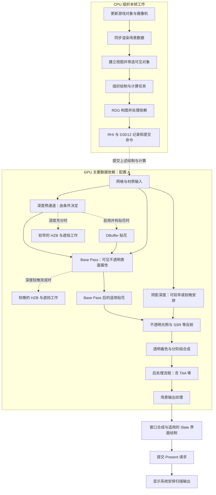
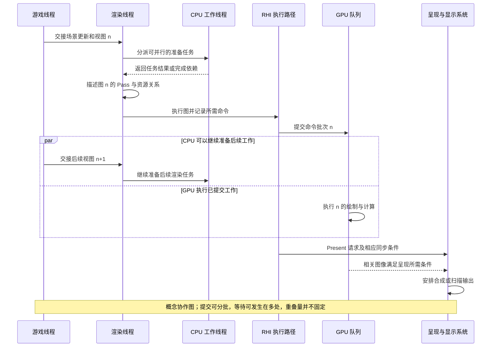
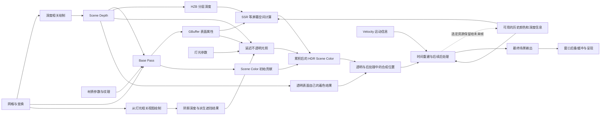

# 一帧渲染总览：先看清整条路线

> 适用基线：UE 5.7.4，CL 51494982，Windows、D3D12、SM6、桌面延迟渲染。版本来自本地 [Build.version](G:/UnrealEngineInstalled/UE_5.7/Engine/Build/Build.version:1)。本章提供阅读地图，各阶段的算法、Shader 和调用细节将在后续章节展开。

## 本章要解决什么问题

读完本章，你应能说清三件事：游戏对象怎样成为渲染输入；为什么画面需要多次处理中间资源；CPU、GPU 和显示器为什么不能当成一个同步执行的程序。

前置知识只需要“程序读取输入、处理数据、产生输出”。遇到不熟悉的术语，可以先查下面的概念表，再回到图中。暂时不需要背下函数名。

本章使用三种证据标记：**[源码已确认]** 表示已核对本地实现；**[教学简化]** 表示用于建立概念的模型，并说明省略的条件；**[尚未验证]** 表示未在运行中的 UE 场景实测。本章没有声称完成 GPU 抓帧或编辑器观察。

本章的三张图使用 Mermaid 描述。若阅读器未渲染图形，或需要放大查看，请打开每张图之后的静态图链接；静态图由同一段 Mermaid 内容生成。

## 0.1 我们究竟在渲染什么

贯穿场景包含摄像机、地面、不透明红方块、金属球、透明薄片、一个可移动方向光和一个可移动点光。方向光用于模拟来自同一方向的照明；点光从一个位置向周围发光。这里的“可移动”是灯光的 Mobility 设置，表示本例使用动态照明，不是要求灯光一直运动。

固定条件的主要观察入口是 Standalone Game（独立游戏），使用第一章指定的 Camera 作为实际视图目标；输出固定为 1280 × 720，手动曝光，不使用烘焙光照或 Sky Light（天空光）。没有天空光时，背光处和金属球缺少环境贡献是合理现象，不能据此断言渲染失败。场景搭建、观察方式与材质数值见[第一章](01-from-scene-to-pixel.md)。

我们追踪两个屏幕位置：**P** 位于红方块可见表面，前面没有透明薄片；**Q** 位于蓝色薄片与红方块投影重叠处，因此本例 Q 的不透明背景也是红方块。P 让我们观察“一个可见表面怎样着色”，Q 让我们观察“多个表面的颜色怎样组合”。位置随相机和物体变化，不是永远绑定某个物体的像素编号。

薄片先采用 Unlit（无光照）透明材质，用自发光颜色提供可控的前景贡献，不模拟折射，也不计算本例灯光对薄片表面的照明。这是为了先理解颜色混合，后续透明章节再研究受光透明材质。

本章主线采用配置 A：关闭 Substrate、Nanite、Lumen、虚拟阴影贴图和硬件光线追踪，使用传统材质、普通网格、常规阴影贴图、SSR 和 TAA。配置 B 改用 Substrate Blendable GBuffer、Nanite、Lumen 软件追踪和虚拟阴影贴图，仍保留 TAA；TSR 另行单项对照。两套配置均先关闭 MegaLights。完整设置见[配置矩阵](../appendices/configuration.md)。

这是一套主动选择的学习配置，不是对 UE 5.7 新项目默认值的描述。开启功能也不等于每帧一定执行所有相关 Pass，场景内容、材质、可见性和质量设置仍会决定工作量。

### 暂时认识这些词

| 名称 | 在本书中的含义与用途 |
|---|---|
| CPU / GPU | 中央处理器 / 图形处理器。CPU 运行游戏和渲染组织代码；GPU 执行提交给它的绘制与计算工作。 |
| Actor / Component | 场景对象 / 组件。Actor 组织游戏实体，网格组件、灯光组件等提供不同能力；并非每个 Actor 都需要绘制。 |
| Mesh / Material / Shader | 网格描述表面几何；材质描述表面属性和着色方式；着色器是实现相关计算、运行在 GPU 上的程序。 |
| View / ViewFamily | 视图 / 视图族。视图描述从哪里看以及如何投影；视图族组织一起渲染的视图及公共设置。本例先考虑单视图。 |
| Render Pass | 渲染阶段或渲染通道，简称 Pass。围绕某项输出组织的一组绘制或计算工作；一个阶段可能由多个 RDG Pass 实现。 |
| Texture / Buffer | 纹理 / 缓冲区。GPU 读写的数据资源。纹理常具有二维布局，但不一定保存能直接显示的照片。 |
| Scene Depth | 场景深度，保存从当前视图得到的深度信息，用来判断遮挡及支持后续计算。它不是直接以米保存的距离照片。 |
| GBuffer | Geometry Buffer，几何缓冲。记录可见不透明表面的材质和几何属性，供后面的光照阶段读取，通常由多张纹理组成。 |
| Scene Color | 场景颜色，画面计算过程中的颜色资源；它在不同阶段具有不同完成度，不等于最终屏幕颜色。 |
| RDG / RHI | Render Dependency Graph，渲染依赖图，用于组织任务和资源依赖；Render Hardware Interface，渲染硬件接口，把引擎工作衔接到底层图形 API。 |
| D3D12 / SM6 | Direct3D 12 图形 API / Shader Model 6 着色器能力体系。本书明确它们，以免混用不同后端的实现。 |
| Slate / Present | Slate 是 UE 的界面框架；Present 是提交呈现请求的操作。它们帮助把场景结果送向窗口显示。 |

## 0.2 第一张图：一帧需要完成哪些工作

**[教学简化]** 下图表达职责和主要依赖。上半部分是 CPU 如何组织工作，下半部分是提交之后 GPU 所需的主要处理。虚线表示“描述或组织这些任务”，不是 CPU 刚执行该节点，GPU 就立即完成对应工作。GPU 部分也只画主要依赖，不代表唯一的实测时间线。

[打开可放大的静态图](../assets/diagrams/overview-flow.png)

图中的透明节点和后处理节点存在内部交织，后文会展开；不能把它读成“所有透明工作都在全部后处理之前”。没有贴花、雾或其他对应内容时，逻辑地图上的一些格子不会变成实际绘制。

### 第一步：把游戏世界转换为可渲染的数据

红方块的游戏对象需要管理位置、碰撞等游戏行为；GPU 需要的是顶点、索引、材质参数和变换等数据。这两个需求不同。UE 使用渲染侧场景表示连接它们，而不是让 GPU 遍历 Actor。

渲染代理（Scene Proxy）是组件在渲染侧的代表；场景还保存用于查找、更新和绘制的数据。对象不发生相关变化时，许多资源可以复用，不需要每帧完整重建网格。变化的数据则通过引擎规定的更新路径传递，不能假定渲染线程可以随意读取游戏线程正在修改的对象。

**[源码已确认]** `BeginRenderingViewFamilies` 在启动视图族渲染前调用 `World->SendAllEndOfFrameUpdates()`，附近注释明确要求让渲染代理保持更新，见 [SceneRendering.cpp](G:/UnrealEngineInstalled/UE_5.7/Engine/Source/Runtime/Renderer/Private/SceneRendering.cpp:5058)。组件如何创建代理、变化如何进入场景，在第 06 章详细追踪。

### 第二步：确定从哪里看、哪些对象值得处理

摄像机产生观察位置、方向、投影参数和输出区域。CPU 可以先做视锥裁剪，即剔除视野之外的对象；后续还可能利用遮挡信息和 GPU 剔除减少实际工作。可见性不是一次判断后永远有效的布尔值：主摄像机、阴影视图、反射等可能关心不同的对象集合。

一个位于摄像机外的方块仍可能把阴影投进画面，因此“主视图看不到它”不能推出“所有阶段都不需要它”。本例的 P、Q 只有在相应三角形覆盖当前视图时，才有后面的表面与颜色计算。

### 第三步：描述具体绘制并建立依赖

绘制命令需要说明使用哪些几何数据、Shader、参数、目标资源以及深度和混合规则。Draw Call（绘制调用）是提交一项绘制工作的接口层概念；一个 Actor 不保证只对应一次 Draw Call，多材质、阴影和不同 Pass 都可能产生额外工作。

RDG 进一步描述“哪个 Pass 读取哪个资源、写入哪个资源”。后一个 Pass 读取前一个 Pass 的结果，形成依赖；没有依赖也不代表必然并行，还要考虑队列、硬件、资源状态和调度配置。

**[源码已确认]** UE 5.7 的入口包含 `FSceneRenderBuilder`。`BeginRenderingViewFamilies` 创建它、建立关联的场景渲染器、调用 `AddRenderer`，最后执行 `Execute`，见 [调度构建入口](G:/UnrealEngineInstalled/UE_5.7/Engine/Source/Runtime/Renderer/Private/SceneRendering.cpp:5167)。它与 `FRDGBuilder` 是不同层次：前者组织场景渲染任务，后者组织具体渲染图。不能把旧教程里简化的单一渲染命令直接当作本版本完整入口。

### 第四步：先解决表面，再解决照到表面的光

延迟渲染中的“延迟”主要指先记录表面属性、再计算大部分不透明光照，不是特意把画面推迟一帧。

深度预通道（Depth Prepass）可以先记录遮挡关系，减少后面昂贵的着色；基础通道（Base Pass）处理通过可见性和深度条件的表面，把法线、基础颜色、粗糙度等属性编码到 GBuffer。法线描述表面朝向；粗糙度影响反射的集中或分散程度。这些属性仍不是最终颜色。

光照阶段读取这些属性、视图信息和灯光数据，并结合阴影结果计算颜色。方块材质是红色，只说明它如何响应光；灯光方向、强度和遮挡改变后，P 的最终颜色仍会变化。金属球则尤其依赖镜面反射贡献，不能用一个固定的“金色 RGB”解释全部外观。

### 第五步：处理透明和画面整体效果

普通透明表面需要保留后方内容，因此不能直接套用“每个位置只记录最近不透明表面，再统一延迟着色”的做法。薄片需要自己的着色与混合工作，并可能先画进单独资源，随后在相应阶段合成。

时间抗锯齿（Temporal Anti-Aliasing，TAA）利用当前帧、历史信息和运动信息稳定画面边缘。后处理还可能包含景深、运动模糊、曝光和色调映射。色调映射将场景中较宽的亮度范围映射到目标显示范围；手动曝光固定的是曝光选择，不能把色调映射和颜色转换一并当作不存在。

### 第六步：形成窗口输出，再请求呈现

主场景的输出可能是一个渲染目标，之后还要放到窗口中并与界面组合。在编辑器中，场景通常只是编辑器窗口的一部分。渲染目标（Render Target）指作为 GPU 写入目标的资源；后备缓冲（Back Buffer）是用于窗口呈现的缓冲图像，不必与中途的 Scene Color 是同一张纹理。

Present 把结果交给呈现系统安排使用。GPU 完成相关命令、CPU 的 Present 调用返回、显示器扫描到某个像素，是不同事件，不能把其中任何一个简单等同于“用户此刻看到了这一帧”。

## 0.3 第二张图：各条执行线怎样协作

**[教学简化]** 下图是一个允许发生的协作场景，不是测量结果；`n` 和 `n+1` 仅用于区分工作批次，没有规定固定的一帧或两帧延迟。线程可用性、任务系统、同步与平台设置都会改变分工和重叠程度。

[打开可放大的静态图](../assets/diagrams/overview-timing.png)

**游戏线程**运行游戏状态与视图发起逻辑。**渲染线程**消费渲染场景更新，组织本次视图需要的渲染工作。**工作线程**可以承担可并行的任务。**RHI 执行路径**把引擎命令衔接到底层 API；它可能涉及专用 RHI 线程和并行任务，不能认为所有 D3D12 工作永远只在一个固定线程上执行。**GPU**消费已提交的命令，而不是直接执行 CPU 上的 C++ 函数。

理解 RDG 时，要拆开四个动作：

1. **构图**：CPU 描述 Pass、参数和资源访问，声明之后要做什么。
2. **编译与执行图**：处理依赖、资源生命周期等，并运行用于记录命令的执行路径。这里的“编译”不是编译材质 Shader。
3. **记录与提交命令**：RHI 和后端准备底层命令，将批次提交到 GPU 队列。
4. **GPU 执行**：设备按资源依赖和队列同步约束处理这些命令。

**[源码已确认]** `FSceneRenderBuilder` 的执行路径通过渲染命令安排工作，内部创建 `FRDGBuilder`，再调用 `GraphBuilder.Execute()`，见 [SceneRenderBuilder.cpp](G:/UnrealEngineInstalled/UE_5.7/Engine/Source/Runtime/Renderer/Private/SceneRenderBuilder.cpp:829)。调用 `Execute` 不表示显示器已经显示了结果，也不保证所有工作都在调用者线程同步做完。

异步计算（Async Compute）指把适用的计算任务安排到可异步使用的计算队列路径。它有机会与图形工作重叠，但受到数据依赖与 GPU 资源竞争约束。不要从函数名里出现 `Async` 就直接推断帧时间缩短。

## 0.4 第三张图：数据被谁写入、被谁读取

**[教学简化]** 下面画资源关系，不画严格时序。一个方框可能概括多张纹理；“历史”来自之前的帧，图中回边代表保留供未来帧读取，不表示同一帧内循环等待。为便于阅读，贴花、阴影过滤和中间降采样资源暂未全部展开。

[打开可放大的静态图](../assets/diagrams/overview-resources.png)

HDR 是 High Dynamic Range，高动态范围，表示场景颜色可以覆盖比普通显示编码更宽的亮度范围。资源中的数值还可能采用 UE 的预曝光约定，因此不能直接把原始浮点数当作屏幕亮度。HZB 是 Hierarchical Z-Buffer，分层深度缓冲，将深度信息组织成不同分辨率的层级，以便更快地检索区域深度。SSR 是 Screen Space Reflections，屏幕空间反射，利用视图可获得的深度等信息追踪反射；它无法凭空恢复屏幕外完整场景。

| 资源 | 它回答的问题 | P 与 Q 的区别 |
|---|---|---|
| Scene Depth | 当前视图里的不透明表面有多深？ | P 对应方块表面；普通薄片覆盖 Q 时，Q 的主不透明深度通常仍属于薄片后方的表面。 |
| GBuffer | 那个可见不透明表面的属性是什么？ | P 保存方块的相关属性；Q 先保存背景表面属性，不能期待它直接变成“薄片和背景的混合材质”。 |
| 阴影资源 | 从光源相关方向看，光是否被挡住？ | 两点都需按各自受光表面判断；相机深度无法单独回答这个问题。 |
| Scene Color | 截至此阶段已经算出了哪些颜色贡献？ | P 在不透明光照后已有主要颜色；Q 还需要透明贡献，并可能在后处理中才完成对应合成。 |
| Velocity 与历史 | 当前信息应该怎样与过去的信息对应？ | 运动、显露的新背景、透明运动都会使关联更复杂，不能直接平均相同屏幕坐标。 |

Velocity 是运动信息缓冲，主要帮助后处理把当前可见位置与过去的投影位置联系起来。摄像机运动同样能让静止物体发生屏幕位移。它的写入位置受配置与材质影响，所以图中把它画成时间处理的输入，不强行规定“永远在 Base Pass 写入”。

资源也不是每帧都重新申请并一直保留。临时资源在不再需要后可释放或复用；需要跨帧的结果必须有明确的保留路径。**[源码已确认]** HZB 的实现使用 `QueueTextureExtraction` 将适用结果交给视图历史状态，见 [DeferredShadingRenderer.cpp](G:/UnrealEngineInstalled/UE_5.7/Engine/Source/Runtime/Renderer/Private/DeferredShadingRenderer.cpp:529)。这让“上一帧数据”成为真实资源关系，而不只是图上的箭头。

## 0.5 哪些顺序不能背成固定口诀

### 深度预通道、HZB 与遮挡

“预通道之后必然紧接完整 HZB，再绘制所有物体”并不适用于所有配置。预通道覆盖哪些物体、是否已得到足够深度，会影响后续遮挡相关工作的安排。遮挡测试还可能消费历史结果，不能把当前帧所有可见性决策都归因于当前帧刚生成的 HZB。

**[源码已确认]** `bOcclusionBeforeBasePass` 由 Early Z 模式或早期深度是否完整决定；满足条件时在 Base Pass 前调用遮挡路径，否则在后面调用，见 [较早分支](G:/UnrealEngineInstalled/UE_5.7/Engine/Source/Runtime/Renderer/Private/DeferredShadingRenderer.cpp:2682)与[较晚分支](G:/UnrealEngineInstalled/UE_5.7/Engine/Source/Runtime/Renderer/Private/DeferredShadingRenderer.cpp:2982)。`RenderOcclusion` 内继续调用 `RenderHzb`，见 [SceneOcclusion.cpp](G:/UnrealEngineInstalled/UE_5.7/Engine/Source/Runtime/Renderer/Private/SceneOcclusion.cpp:1539)。

### 阴影深度与阴影使用

阴影生成和阴影使用是两件事。生成阶段得到从灯光相关视图观察的深度；使用阶段在给表面计算照明时查询遮挡。依赖要求是“使用阴影结果前，结果必须可用”，不是“阴影永远是 Base Pass 前的固定一格”。

**[源码已确认]** 常规阴影可由 `r.shadow.ShadowMapsRenderEarly` 请求提前；该变量在源码中的注册默认值为 `0`。延迟路径有较早和较晚的 `RenderShadowDepthMaps` 分支，VSM 会限制这里的提前选项，见 [提前条件](G:/UnrealEngineInstalled/UE_5.7/Engine/Source/Runtime/Renderer/Private/DeferredShadingRenderer.cpp:2843)和[较晚调用](G:/UnrealEngineInstalled/UE_5.7/Engine/Source/Runtime/Renderer/Private/DeferredShadingRenderer.cpp:3127)。注册默认值不等于项目实际运行值。

### DBuffer 贴花与 GBuffer 贴花

贴花（Decal）用来给表面附加污迹、标记等变化。在传统材质主线中，DBuffer 贴花先写一组专用缓冲，Base Pass 再把这些变化纳入表面材质结果；适用的 GBuffer 贴花在 Base Pass 后修改已存在的表面属性。发光贴花还有相应的颜色贡献阶段。

**[源码已确认]** `ProcessBeforeBasePass` 与 `ProcessAfterBasePass` 分别处理相应贴花阶段，见 [CompositionLighting.cpp](G:/UnrealEngineInstalled/UE_5.7/Engine/Source/Runtime/Renderer/Private/CompositionLighting/CompositionLighting.cpp:541)。后者检查 `BeforeLighting` 和 `Emissive`；源码还明确检查 Base Pass 前只能使用 DBuffer 贴花，见 [贴花阶段约束](G:/UnrealEngineInstalled/UE_5.7/Engine/Source/Runtime/Renderer/Private/CompositionLighting/PostProcessDeferredDecals.cpp:670)。这是可选路径分类，不表示每种贴花都要运行两次。Substrate 相关条件会改变细节，第 21 章单独展开。

### 透明、TAA 与其他后处理

普通透明、景深后透明、运动模糊后透明有不同的绘制和合成安排。景深（Depth of Field，DOF）模拟对焦范围带来的模糊，Motion Blur 是运动模糊；材质选择透明位置，会影响它是否以及如何参与这些效果。

**[源码已确认]** 桌面后处理有 `PostDOFTranslucencyResources` 的条件合成、TAA / TSR 选择，以及 `PostMotionBlurTranslucencyResources` 的较晚合成路径，见 [PostProcessing.cpp](G:/UnrealEngineInstalled/UE_5.7/Engine/Source/Runtime/Renderer/Private/PostProcess/PostProcessing.cpp:897)。因此不能把流程写成“所有透明 → TAA → 所有其他后处理”并当作源码定律。TSR 是 Temporal Super Resolution，时间超分辨率，与 TAA 是分别选择的主时间处理路径，并不是启用后必然在 TAA 后再跑一次。

### 主场景 RDG 与窗口 RDG

**[源码已确认]** Slate 绘制路径创建名为 `Slate` 的 `FRDGBuilder`，添加窗口绘制并执行；随后调用窗口呈现逻辑，见 [SlateRHIRenderer.cpp](G:/UnrealEngineInstalled/UE_5.7/Engine/Source/Runtime/SlateRHIRenderer/Private/SlateRHIRenderer.cpp:1087)。这直接说明一帧可以涉及多个 RDG，不能把主场景的图等同于整个应用一帧。

窗口呈现路径调用 `EndDrawingViewport`，见 [窗口呈现入口](G:/UnrealEngineInstalled/UE_5.7/Engine/Source/Runtime/SlateRHIRenderer/Private/SlateRHIRenderer.cpp:920)。D3D12 后端的 `Present` 继续经过 `PresentChecked` 与平台 `PresentInternal`，见 [D3D12Viewport.cpp](G:/UnrealEngineInstalled/UE_5.7/Engine/Source/Runtime/D3D12RHI/Private/D3D12Viewport.cpp:598)。这些是可追踪的代码边界，不是显示器实际发光时刻的测量。

## 0.6 P 和 Q 怎样走完本章的路线

**[教学简化]** 先忽略抖动和覆盖率等细节，只追踪主要数据来源：

| 问题 | P：不透明方块 | Q：透明薄片覆盖背景 |
|---|---|---|
| 几何从哪里来？ | 方块网格和变换把表面投影到 P 附近。 | 薄片和背景分别投影到 Q 附近。 |
| 哪个表面写主不透明数据？ | 通过深度规则的可见方块表面。 | 背景不透明表面；薄片走透明路径。 |
| 光照读取什么？ | 方块属性、视图、灯光和阴影等资源。 | 背景方块先按不透明流程着色；本例无光照薄片提供自发光颜色，不读取灯光来计算表面照明。 |
| 为什么还要合成？ | 已有颜色还需通过后处理。 | 透明贡献必须与背景组合，并在选定位置进入后处理。 |
| 最后显示的是什么？ | 后处理和显示输出转换后的颜色。 | 透明与背景合成，再经过相关后处理及输出转换的颜色。 |

以简单直通 Alpha 混合为例，若薄片源颜色为 `Cs`，背景颜色为 `Cb`，不透明度为 `a`，则 `C = a × Cs + (1 - a) × Cb`。这只是指定混合方式下的模型，不是所有 UE 透明材质的统一公式；折射、预乘 Alpha、加法混合和分离透明都会扩展或改变处理。第一章会给出完整数值例子。

## 0.7 现代功能在地图上改变哪里

| 功能 | 在现有路线中主要改变什么 | 不能怎样理解 |
|---|---|---|
| Substrate | 改变材质表达、编译和运行时表面数据处理；B 使用 Blendable GBuffer 模式。 | 不能把 B 直接等同于所有完整 Substrate 模式，也不能无条件复用 A 的通道解释。 |
| Nanite | 改变适用几何体的细节选择、剔除、光栅化与材质求值组织。 | 不能认为透明薄片自动获得相同 Nanite 路径。 |
| 虚拟阴影贴图 VSM | 改变阴影数据的分页、需求标记、生成和复用。 | 不能认为它只是把常规阴影纹理尺寸调大。 |
| Lumen 软件追踪 | 引入动态间接光照与反射所需的场景表示、追踪和时间处理。 | “软件”描述追踪表示与实现路径，不表示所有追踪在 CPU 上执行。 |
| 硬件光线追踪 | 为适用功能增加硬件追踪场景、加速结构及相关执行路径。 | 不能认为开启后所有光栅化阶段自动消失。 |
| MegaLights | 改变适用直接光照的采样与阴影组织；本书主线先关闭。 | 不能混入常规直接光照后声称是同一套固定步骤。 |

这是功能分工的概念导读。具体启用条件、平台支持、Shader 和调用链在对应章节核验；本章不声称已经实测上述组合。

## 0.8 源码阅读入口与观察练习

**[源码已确认]** 第一条值得跟读的链路是：`FRendererModule::BeginRenderingViewFamilies` 组织场景渲染任务，`FSceneRenderBuilder` 执行路径创建渲染图，已登记的回调进入 `RenderViewFamily_RenderThread`，正常场景分支调用渲染器的 `Render`。桌面延迟渲染入口为 [FDeferredShadingSceneRenderer::Render](G:/UnrealEngineInstalled/UE_5.7/Engine/Source/Runtime/Renderer/Private/DeferredShadingRenderer.cpp:1736)；正常场景与 Hit Proxy 分支可在 [RenderViewFamily_RenderThread](G:/UnrealEngineInstalled/UE_5.7/Engine/Source/Runtime/Renderer/Private/SceneRendering.cpp:4895)核对。Hit Proxy 是编辑器拾取对象使用的标识渲染，本书当前不沿该分支展开。

先只标记三个层次：哪里安排场景渲染，哪里描述 Pass，哪里执行图。不要把 `Render` 函数里的所有调用看成 GPU 已经完成的逐步结果。完整源码索引与官方资料见[源码索引](../appendices/source-index.md)和[参考资料](../appendices/references.md)。

**[尚未验证]** 以下是建议观察，首批尚未启动编辑器验证实际画面：

1. 按第一章创建场景，在 Standalone 中核验固定相机和配置，选择 P、Q 两处并记录观察对象。此时先不追求最终 RGB 数值一致。
2. 查看主不透明深度与基础颜色等缓冲的可视化。若使用编辑器视口观察，单独记录观察方式，不把它的曝光和渲染比例当作 Standalone 的测量。预期 P 体现方块，Q 的不透明数据仍与背景方块有关。若 Q 显示薄片，应先确认材质是否真为 Translucent，而非 Opaque 或 Masked，并检查看的是否是主场景深度。
3. 只改变方向光方向。预期深度与基础颜色的大部分区域不变，但 Lit 着色画面和阴影变化。若所有画面都不变，检查观察的是基础颜色视图还是最终着色视图，并确认灯光影响当前场景。
4. 只暂时隐藏薄片。预期 Q 的透明贡献消失；P 若不在薄片覆盖或其他间接影响范围内，应保持相应的不透明表面身份。时间历史需要若干帧重新稳定，不把切换后的第一帧当作最终稳定结果。

## 概念回顾与理解检查

一帧渲染同时具有三种结构：CPU 组织工作的结构、GPU 任务依赖的结构、资源生产和消费的结构。只看其中一张图，都会丢失重要信息。延迟不透明表面的主要路线是“记录表面属性 → 计算照明”；透明贡献、时间历史和最终呈现让完整流程比这条主线更丰富。

1. 为什么红方块的 Base Color 不等于 P 的最终屏幕颜色？
2. 为什么 Q 在主不透明 GBuffer 里不必记录透明薄片的属性？
3. `GraphBuilder.Execute()` 返回和显示器显示本帧之间，为什么不能画等号？
4. 阴影深度生成安排在 Base Pass 后，为什么不必然构成错误？
5. 为什么 CPU 可以准备后续帧，而 GPU 仍在执行前面提交的工作？这是否意味着固定存在一帧延迟？

答案与解释见[练习答案](../appendices/exercise-answers.md)。下一部分从最基础的问题开始：网格、材质、光源和摄像机分别提供了哪些数据，以及一个像素到底代表什么。

[返回总目录](../README.md) · [下一章：从场景到像素](01-from-scene-to-pixel.md)
