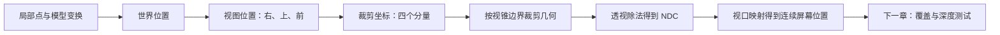
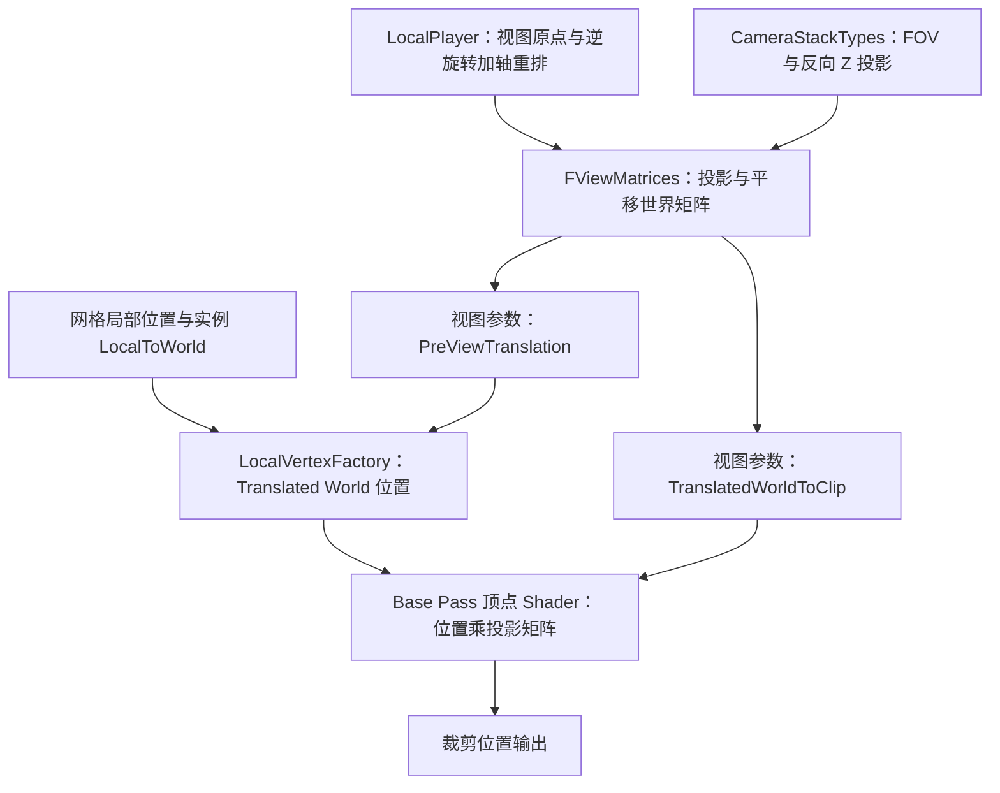

# 第 02 章：坐标变换、相机与投影

[返回目录](../README.md) · [上一章：从场景到像素](01-from-scene-to-pixel.md) · [下一章：光栅化、深度与混合](03-raster-depth-blending.md)

> **适用配置：**UE 5.7.4，Changelist 51494982，Windows／D3D12／SM6，桌面传统延迟渲染，配置 A。设置与运行观察前提见 [配置附录](../appendices/configuration.md)。
>
> **证据边界：**本章核对了指定版本的本地源码，没有启动 UE、创建练习项目或抓帧。数值计算是明确约定输入的 **[教学简化]**，操作结果属于 **[尚未验证]**。手算投影忽略 TAA 投影抖动、镜头偏移、立体视图、分屏和相机扩展。

## 2.1 学习目标与前置知识

完成本章后，你应能沿着一个表面点回答：它在模型里在哪里，放入关卡后在哪里，相对相机在哪里，为什么映射到这个屏幕位置，以及为什么仅有屏幕位置还无法决定最终颜色。

具体要掌握五件事：区分位置与方向；按明确顺序组合变换；解释透视除法；区分距离与设备深度；认识大世界中的浮点精度问题。看到 `mul(Position, Matrix)` 时，应能先问输入输出的空间，再讨论乘法。

前置是第 01 章中的局部位置、网格、摄像机、P 与 Q。数学只要求四则运算、平方根和角度。本章出现的正弦、余弦和正切只用于描述三角形边长比例，不要求先学习高等数学。角度表使用度，程序的三角函数通常接收弧度；180 度等于 π 弧度，不能直接把 `60` 传给要求弧度的 `tan`。

## 2.2 一个三元组，可能表示点，也可能表示方向

### 2.2.1 坐标系是解释数字的约定

**坐标系（Coordinate System）**需要一个原点和一组坐标轴。原点回答“从哪里开始量”，坐标轴回答“沿哪些方向量”。**坐标空间（Coordinate Space）**强调位置或向量目前依据哪套约定表示。

`(100,0,0)` 本身并未说清楚一个对象在哪里。如果这是模型局部位置，它可能表示离模型原点 100 cm；如果是世界位置，则表示离关卡世界原点 100 cm。相机不在世界原点时，“在世界原点”也不等于“在画面正中央”。

同一个真实位置可以有多种坐标写法。切换空间通常是在改变描述，并不意味着真的移动物体。反过来，在同一世界坐标系中修改 Actor 的位置，才是改变摆放。

### 2.2.2 点减点得到向量，点加向量得到另一个点

**点（Point）**表示位置；**向量（Vector）**表示有大小和方向的量。位移是向量的一种，纯方向也可用向量表示。

设世界点 A 为 `(10,20,30) cm`，世界点 B 为 `(40,20,30) cm`：

```text
B - A = (30,0,0) cm
A + (30,0,0) cm = B
```

前者是“从 A 到 B 的位移”，后者是“从 A 出发移动这段位移”。把两个位置直接相加通常没有“合并位置”的几何意义；求中点则可以使用 `A + 0.5 × (B - A)`，清楚说明做了什么。

**向量长度（Length）**也叫模，三维向量 `(x,y,z)` 的长度为 `sqrt(x²+y²+z²)`。如果三个分量用厘米表示，长度也是厘米。`(3,4,0) cm` 的长度为 `5 cm`。

**单位向量（Unit Vector）**的长度为 1，只表示方向。把非零向量除以它的长度称为**归一化（Normalization）**。上面的位移归一化后为 `(0.6,0.8,0)`，没有厘米单位。零向量没有唯一方向，不能用除以零来归一化。

### 2.2.3 点积把一段位移量到一个方向上

两个向量 `a=(ax,ay,az)`、`b=(bx,by,bz)` 的**点积（Dot Product）**定义为：

```text
dot(a,b) = ax×bx + ay×by + az×bz
```

当 `b` 是单位方向时，结果就是 `a` 沿该方向的有符号分量。如果 `a` 是厘米位移，结果也是厘米。正值表示朝该方向，负值表示朝反方向，零表示两者垂直。后面用这一操作把世界位移拆成“相机右侧多少、上方多少、前方多少”。

**法线（Normal）**也是向量，但代表表面的垂直方向。平移不改变法线。旋转可以像处理方向一样处理法线；非均匀缩放，即各轴缩放不同，则不能无条件套用同一个普通方向变换。比如把斜面沿 X 拉长，保持垂直关系所需的法线变化就不同。本章先记住这个边界，第 04 章再展开逆转置与着色法线。

## 2.3 UE 的世界轴与相机轴，不是同一套名字

UE 世界通常使用 X 向前、Y 向右、Z 向上，长度按本书约定使用厘米。这套世界轴称为**左手坐标系（Left-Handed Coordinate System）**。左右手性描述三个轴的空间定向关系，不表示哪个方向的数值一定为负，也不决定矩阵写在向量左边还是右边。

**[源码已确认]** 本地 `FVector3d::ForwardVector`、`RightVector`、`UpVector` 分别为 `(1,0,0)`、`(0,1,0)`、`(0,0,1)`。旋转类型 `FRotator` 的说明还强调：Yaw 与 Pitch、Roll 的正角解释并不统一等同于四元数轴角规则。因此，不能从“UE 左手系”推导出每个旋转参数的正负方向。

| 名称 | 含义 | 本章相机中的值 |
|---|---|---|
| Pitch | 绕右轴的俯仰，正值抬头，负值低头 | `-18°` |
| Yaw | 绕上轴的转向，正值向右转 | `0°` |
| Roll | 绕前轴的侧倾 | `0°` |

第一章 Camera 位于 `(-600,0,250) cm`，Pitch 为 `-18°`。它向世界 +X 方向观察，同时向下俯看。红方块位于相机前方，不要求方块的世界 Z 大于相机的世界 Z。

接下来用视图坐标 `(u,v,d)` 表示一个点相对相机的位置：`u` 为向右距离，`v` 为向上距离，`d` 为向前距离，单位均为厘米。这是为了避免把“世界 Z 向上”和“投影视图 Z 向前”混在一起。

**[源码已确认]** `ULocalPlayer::GetProjectionData` 先取得相机旋转的逆，再乘一个轴重排矩阵。零旋转时，世界方向 `(X,Y,Z)` 在这套投影视图坐标下变成 `(Y,Z,X)`，即本章的 `(u,v,d)`。所以 Shader 投影中的 `z` 可以是前向深度，而编辑器 Transform 中的 `Z` 是高度。二者都正确，只是空间不同。

## 2.4 用齐次坐标统一表达平移、旋转与缩放

### 2.4.1 为什么多出第四个分量

三阶矩阵能表示旋转与缩放，但原点乘任何普通三阶矩阵仍是原点，无法单独表达“把原点移到另一个位置”。**齐次坐标（Homogeneous Coordinates）**增加一个分量，使平移也能写进矩阵运算。

在本章仿射变换阶段，把点写成 `(x,y,z,1)`，把方向写成 `(x,y,z,0)`。**仿射变换（Affine Transform）**包含平移、旋转、缩放等保持直线与平行关系的变换。第四个数此时决定是否受到平移影响，不是透明度，也不是“多了一条三维世界轴”。

更一般地，在第四分量不为零时，齐次点 `(hx,hy,hz,hw)` 对应三维位置 `(hx/hw,hy/hw,hz/hw)`。把四个分量同时乘同一个非零数，并不改变这个位置；例如 `(2,4,6,2)` 与 `(1,2,3,1)` 对应同一点。w=0 的方向不能用这种除法还原为有限位置。后面的透视除法正要用到“按第四分量恢复比例”的性质。

本章始终把向量横写成一行，采用**行向量右乘矩阵**。平移矩阵 T 为：

```text
      [ 1   0   0   0 ]
T  =  [ 0   1   0   0 ]
      [ 0   0   1   0 ]
      [ tx  ty  tz  1 ]

(x,y,z,1) T = (x+tx, y+ty, z+tz, 1)
(x,y,z,0) T = (x,    y,    z,    0)
```

`tx`、`ty`、`tz` 是沿三个轴的平移距离，单位为厘米。可以把矩阵乘法理解成“输出的每个分量都是输入的加权和”：最后一行的平移量分别乘输入第四分量，所以点会移动，方向不会移动。

**[源码已确认]** `TMatrix::TransformPosition` 补入 `w=1`，`TransformVector` 补入 `w=0`。源码也提醒普通方向变换不能自动正确处理非均匀缩放后的表面法线。

### 2.4.2 先后顺序决定实际结果

令 S、R、T 分别是缩放、旋转、平移矩阵，M 是模型到世界矩阵。对行向量，本章写成：

```text
M = S R T
p_world = p_local M
```

从左到右依次应用 S、R、T，即先改变模型自身大小，再旋转，最后放到世界位置。`p_local` 是四分量局部点，`p_world` 是四分量世界点。缩放比例和旋转矩阵的方向系数没有长度单位，平移分量有长度单位。

矩阵乘法通常不交换。先把模型从原点平移出去，再绕世界原点旋转，会使它绕原点转动；先绕自身原点旋转，再平移，是另一种摆放。不能为“代码更好看”而交换两个矩阵的顺序。

### 2.4.3 完整数值算例一：同一变换作用于点与方向

**[教学简化]** 这里使用一个独立模型，不改变贯穿场景的红方块。输入局部点为 `(2,1,0) cm`，缩放为 `(2,1,1)`，绕 Z 轴旋转的效果明确规定为 `(x,y,z) → (-y,x,z)`，对应本例 UE Yaw `+90°`；最后平移 `(10,20,30) cm`。

```text
局部点：               (2,1,0)
先缩放：               (4,1,0)
再旋转：               (-1,4,0)
最后平移：             (9,24,30) cm
```

同一变换作用于局部位移 `(1,0,0) cm`，过程是 `(2,0,0) → (0,2,0)`，平移不再贡献，结果为 `(0,2,0) cm`。它的长度由 1 cm 变成 2 cm；若只需要方向，应归一化为 `(0,1,0)`。

再验证顺序：如果仍先缩放为 `(4,1,0)`，接着平移，得到 `(14,21,30)`，最后再做相同旋转，就得到 `(-21,14,30)`。三项操作各自相同，只交换旋转与平移的先后，结果就不再是 `(9,24,30)`。

**逆变换（Inverse Transform）**撤销原来的变换。对已得到的 `(9,24,30)`，先减平移得到 `(-1,4,0)`，逆旋转得到 `(4,1,0)`，再除以各轴缩放得到 `(2,1,0)`。撤销时必须反过来执行。若某轴缩放为 0，该轴信息已丢失，无法唯一恢复原来的位置。

### 2.4.4 行列向量、存储布局和 Shader 调用分别判断

有些教材采用列向量，写成 `p_world = M p_local`，其组合顺序和矩阵元素排布与本章转置对应。这不是算法冲突，问题在于不能从一本教材拿矩阵，再从另一本教材拿乘法顺序。

**[源码已确认]** UE `TMatrix` 注释明确 `A * B` 在变换意义上先应用 A 再应用 B；本章后面核对的 Shader 使用 `mul(Position, ResolvedView.TranslatedWorldToClip)`。因此本章采用行向量解释这条路径。

但矩阵在内存中逐行还是逐列存放，是**存储布局**问题；HLSL 的 `row_major`、`column_major` 是布局约定；`mul` 两个参数的位置决定数学乘法。CPU 到 GPU 的上传过程还可能进行布局转换。不能只看到一个 `float4x4` 声明就判断全部约定，也不要对已经适配上传的矩阵再随意转置。本章不声称 UE 所有矩阵上传接口都使用同一种处理。

## 2.5 视图变换：从相机出发重新量位置

**视图空间（View Space）**是围绕当前观察者建立的坐标空间。**视图矩阵（View Matrix）**通常撤销相机在世界中的摆放：先去掉相机位置，再把方向转换到相机自己的轴上。

设点的世界位置为 W，相机世界位置为 C，先求 `D = W - C`。W、C 和 D 都按厘米表示。设相机向右、向上、向前的单位向量分别为 r、a、f，则：

```text
u = dot(D,r)
v = dot(D,a)
d = dot(D,f)
```

三个单位向量彼此垂直时，恰好把同一段位移分解到相机的三个方向。这也解释了逆旋转：世界向量没有真的转动，只是我们改用相机的轴描述它。

相机 C 为 `(-600,0,250) cm`，Pitch `-18°`，Yaw 与 Roll 均为 0。取 `cos(18°)≈0.951057`、`sin(18°)≈0.309017`，可写出：

```text
r = (0, 1, 0)
a = (0.309017, 0, 0.951057)
f = (0.951057, 0, -0.309017)
```

f 的 Z 分量为负，符合相机低头；a 不是世界 `(0,0,1)`，因为相机的上方向也随相机倾斜。三者均为无单位的单位方向。

这里的 d 是**沿相机前轴的深度**，不是到相机的直线距离。直线距离为 `sqrt(u²+v²+d²)`。两个点可能具有相同 d，却位于画面不同位置、离相机的实际距离也不同。后面 `1/d` 中的 d 指前轴深度，不能替换成这条斜着的直线距离。

## 2.6 透视投影：先得到裁剪坐标，再做除法

### 2.6.1 视场角决定允许多宽的方向范围

**视场角（Field of View，FOV）**描述相机可见方向的角度范围。水平 FOV 为 60°，表示左右各 30°。它不是“看见 60 米远”，也不是相机分辨率。

对居中的对称透视相机，若水平视场角为 θ，深度 d 处的半宽为 `d × tan(θ/2)`。d 使用厘米，则半宽也是厘米。离相机越远，同样角度范围容纳的世界宽度越大，因此同样宽度的物体在图中越小。

设图像宽高比 `a = Wpx/Hpx`，其中 Wpx、Hpx 为像素宽高；a 没有单位。水平与竖直方向的投影缩放为：

```text
sx = 1 / tan(θ/2)
sy = a × sx
```

sx、sy 没有单位。60° 水平 FOV、16:9 宽高比对应 `sx≈1.732051`、`sy≈3.079201`，竖直 FOV 约为 35.98°，不是 60°。

**[源码已确认]** `FMinimalViewInfo::FOV` 的声明标注为水平角度；实际投影建立还处理 `AspectRatioAxisConstraint`。本章手算明确使用最终水平 FOV 60°、16:9、居中无偏移的画面。在不同宽高比、保持竖直 FOV、黑边约束或相机覆盖下，不能仅凭 Camera 面板中的一个数值复算最终矩阵。

### 2.6.2 为什么需要裁剪空间

**裁剪空间（Clip Space）**是顶点完成投影后、透视除法前的四分量表示。它让图形管线能在统一条件下处理视野边界和跨越边界的三角形。

本章以反向 Z、无限远透视矩阵为例，令近裁剪距离 n 为正数，单位为厘米：

```text
           [ sx  0   0  0 ]
Proj   =   [ 0   sy  0  0 ]
           [ 0   0   0  1 ]
           [ 0   0   n  0 ]

c = (u,v,d,1) Proj = (sx×u, sy×v, n, d)
```

Proj 是本节明确写出的数学矩阵；c 是裁剪坐标，四个分量记为 `cx,cy,cz,cw`。输入的 u、v、d、n 都用厘米时，这种缩放选取下裁剪分量可以带相同长度尺度，但它们已不是普通世界位置。关键是各分量比例，不能把 `cz=n` 理解成“所有物体都在近裁剪面”。

**透视除法（Perspective Divide）**将前三个分量除以 `cw`，得到**归一化设备坐标（Normalized Device Coordinates，NDC）**：

```text
x_ndc = cx/cw = sx×u/d
y_ndc = cy/cw = sy×v/d
z_ndc = cz/cw = n/d
```

这些比值没有单位。近大远小来自除以 d。矩阵乘法本身保持线性组合的形式，深度相关的缩小发生在随后的除法。投影后的第四分量 `cw` 此时为 d，已经不是输入中表示点的常数 1。

如果把模型到世界矩阵记为 M、世界到视图矩阵记为 V，在本章行向量约定下，完整的概念关系就是 `c = p_local M V Proj`。M 决定摆放，V 决定观察位置与方向，Proj 决定投影范围和深度编码。实际 Shader 可以接收已经组合的矩阵，也可以像后面的 UE 路径那样先进入平移世界空间；不要求逐个保留这些中间点。

### 2.6.3 从 NDC 映射到屏幕

在本章 D3D12 常规视图中，可见区域的 x、y 为 `[-1,1]`，设备深度为 `[0,1]`。令视口左上角为 `(x0,y0)`，视口宽高为 Wpx、Hpx，则连续屏幕位置为：

```text
x_screen = x0 + (x_ndc + 1) × Wpx/2
y_screen = y0 + (1 - y_ndc) × Hpx/2
```

x0、y0、Wpx、Hpx 及结果的单位均为像素。屏幕向下增加行坐标，所以 y 方向要翻转。`(-1,+1)` 映射到左上角，`(0,0)` 映射到画面中心，`(+1,-1)` 映射到右下边界。

连续位置还不是整数像素索引。例如 800×400 图像的右边界 x=800，最后一列索引是 799；普通单采样网格的像素中心在 `i+0.5`、`j+0.5`。一个顶点投影到 `(600,100)`，不等于 GPU 已经决定“只写第 600 列第 100 行”。三角形覆盖哪些采样位置，是第 03 章的光栅化问题。

### 2.6.4 完整数值算例二：把计算压缩到容易核对的相机

**[教学简化]** 本例暂用另一个相机，不是关卡中的实际 Camera：已知点的视图坐标为 `(u,v,d)=(100,50,200) cm`，水平 FOV 90°，视口 800×400，左上角 `(0,0)`，近裁剪 n=10 cm，反向 Z、无限远投影。

```text
a  = 800/400 = 2
sx = 1/tan(45°) = 1
sy = 2×1 = 2

裁剪坐标 c = (1×100, 2×50, 10, 200)
             = (100,100,10,200)

NDC = (100/200,100/200,10/200)
    = (0.5,0.5,0.05)

屏幕 x = (0.5+1)×800/2 = 600 px
屏幕 y = (1-0.5)×400/2 = 100 px
```

如果只把 d 从 200 cm 增加到 400 cm，u、v 不变，则 NDC 变为 `(0.25,0.25,0.025)`，屏幕位置变为 `(500,150) px`，向中心收拢。

如果把三个视图分量一起加倍，得到 `(200,100,400) cm`，屏幕位置仍为 `(600,100) px`，设备深度则变为 0.025。因为两个点位于同一条相机射线上，只是前后距离不同。投影会把这种深度不同的位置压到同一屏幕位置，之后必须再判断遮挡。

### 2.6.5 正交投影与反投影提供两个对照

**正交投影（Orthographic Projection）**使用平行的观察射线，不用距离相关的缩小表达近大远小。若视图允许的半宽、半高为 hw、hh，单位为厘米，居中正交视图的 `x_ndc=u/hw`、`y_ndc=v/hh`；同样大小的物体只沿前轴远离，投影尺寸保持不变。它适合某些工程视图、二维画面或特定观察方式，但不等于透视相机只把 FOV 调到很小。

正交相机仍需要近远裁剪和深度。其标准反向设备深度可线性表示为 `(f-d)/(f-n)`，其中 f、d、n 都为厘米；第四分量可以保持 1，除法不再产生随 d 缩小的效果。UE 的正交设置还包含自动平面调整等分支，本章的贯穿相机始终使用透视。

**反投影（Deprojection）**沿相反方向从屏幕信息推回三维信息。只有二维屏幕位置时，通常只能得到一条观察射线，不能唯一恢复世界点；2.6.4 中同一射线上的两个点已说明原因。若另有与当前矩阵匹配的设备深度，才可以通过逆矩阵和相应齐次除法恢复对应位置。读取哪一层深度、是否包含透明表面、采用哪个视口与哪一帧矩阵，会影响结果，不能把反投影当成“凭颜色找到原 Actor”。

## 2.7 近远裁剪与反向 Z：深度数值为何近大远小

### 2.7.1 先区分视野裁剪与物体遮挡

**近裁剪面（Near Clipping Plane）**排除过于接近相机的区域，前轴距离为 n；有限远投影还具有距离 f 的**远裁剪面（Far Clipping Plane）**。n、f 的单位为厘米，通常满足 `0<n<f`。这些边界与左右上下边界共同界定**视锥（View Frustum）**。

在本章 D3D12 的标准齐次裁剪条件下，位置应满足 `-cw≤cx≤cw`、`-cw≤cy≤cw`、`0≤cz≤cw`。这发生在透视除法之前。实际管线还受深度裁剪状态、附加裁剪面等控制，本章只讲标准开启的几何解释。

如果三角形一部分在近面之前、一部分在之后，裁剪会沿边界构造保留的部分；不是发现一个顶点不满足就丢掉整个三角形。相机后方点的 `cw` 为负，不能先不加判断地除法，再把翻转后的二维位置当作正常可见结果；`cw=0` 还会导致除零。

裁剪只回答“是否在允许观察的范围”，不回答“前面有没有别的表面”。方块后面的地面可以在视锥内，却仍被方块挡住。深度测试在形成覆盖之后处理这种关系。

[打开坐标裁剪静态图](../assets/diagrams/02-coordinate-spaces-1.png)



图是 **[教学简化]** 的几何数据关系，不是逐项 CPU 函数调用。视口映射仍未形成最终颜色。

### 2.7.2 正向与反向描述的是编码，不是空间翻转

**设备深度（Device Depth）**是供深度缓冲与相关运算使用的映射值。本章标准视口深度范围为 `[0,1]`。**反向 Z（Reversed Z）**让近面映射到 1、远处趋近 0；常见正向约定则把近面映射到 0、远面映射到 1。

对有限远的反向透视投影：

```text
z_device = A + B/d
A = n/(n-f)
B = n×f/(f-n)
```

A 无单位，B 单位为厘米，d 是厘米前轴深度，因此结果无单位。代入 `d=n` 得到 1，代入 `d=f` 得到 0。这两个边界检查比死记矩阵更容易发现符号错误。

例如 n=10 cm、f=1000 cm 时，`A≈-0.010101`，`B≈10.101010 cm`。在 d=100 cm 处，设备深度约为 0.090909。它既不是 100 cm，也不是“从近到远走了 9.09% 的线性距离”。透视深度含有 `1/d`，分布不是均匀距离刻度。

反向 Z 没有让远处物体跑到前面。它改变的是用于比较的数值约定，测试方向与清除值必须与之匹配；第 03 章会用两个候选表面讲比较规则。其他平台、阴影视图和特殊 Pass 应检查各自状态，不能因看到 Z 就假定一定采用本节公式。

### 2.7.3 无限远投影不意味着无限绘制

当有限远 f 趋向无限大，上式的 A 趋向 0、B 趋向 n，就得到之前的 `z_device=n/d`。没有一个有限 d 被投影远平面切掉，但 d 必须满足近面要求。

**[源码已确认]** 本地 `TReversedZPerspectiveMatrix` 在六参数构造中检测 `MinZ==MaxZ`，此时深度系数取 0 与 MinZ；普通透视投影的一条建立路径恰好将近面值同时传作两个参数。这里的“两个参数相等”是选择无限远公式的实现分支，不表示近远面之间没有可见空间。四参数构造也直接使用无限远形式。

无限远投影仍会受到视锥侧面、距离剔除、网格可见性、LOD 和具体效果距离等限制。阴影的最大距离也不是主相机投影远面。第一章方向光的 2000 cm 动态阴影距离，不表示 2000 cm 以外所有物体都不能出现在画面里。

### 2.7.4 为什么还要在意近面与精度

浮点深度能在靠近 0 的区域表示更密的绝对数值间隔。反向 Z 与透视的 `1/d` 分布配合，通常能显著改善浮点深度的远处精度。这一收益依赖存储格式和计算过程，不能推广为“所有整数深度格式都会得到同样提升”。

近面也不能随意设为 0。它需要为正，既影响投影边界和深度映射，也参与数值稳定性。极近距离、近乎重合的表面、变换误差仍可能产生闪烁；反向 Z 不能为真正共面的两个面凭空创造一个先后关系。

## 2.8 回到贯穿场景：P 与 Q 怎样出现在屏幕上

**[教学简化]** 恢复第一章 Camera：位置 `(-600,0,250) cm`，Pitch `-18°`，水平 FOV 60°，1280×720，近面为本次计算另行指定的 10 cm。这里没有声称项目的最终近面已经查询为 10 cm。假设红 Cube 是边长 100 cm、中心 `(0,-120,50) cm` 的无旋转网格，薄片采用第一章的名义尺寸，且无材质顶点位移。

### 2.8.1 算出一个方块表面点的投影

选择红方块朝相机的 X=-50 cm 面上的点 `P_surface=(-50,-100,75) cm`。`P_surface` 是为了计算新增的表面点标签；它的投影附近可选作本次观察的 P，不把 P 从此定义成永久世界坐标。

```text
D = P_surface - Camera = (550,-100,-175) cm

u = -100 cm
v = 550×sin(18°) - 175×cos(18°) ≈ 3.524457 cm
d = 550×cos(18°) + 175×sin(18°) ≈ 577.159058 cm
```

v 只略为正，说明该点在相机朝向中心上方一点。它的世界高度 75 cm 低于相机 250 cm，却并不因此必在画面下方，因为相机已经低头。

```text
sx≈1.732051，sy≈3.079201

c = (sx×u, sy×v, 10, d)
  ≈ (-173.205081,10.852512,10,577.159058)

NDC ≈ (-0.300099,0.018803,0.017326)

x_screen ≈ (1-0.300099)×640 = 447.94 px
y_screen ≈ (1-0.018803)×360 = 353.23 px
```

这个结果是无抖动理想投影的连续位置，约在画面中心左侧 192 px、上方 7 px。它不是抓帧实测，也不承诺 TAA 后的颜色贡献只来自这一处。

### 2.8.2 同一条射线可以穿过薄片和方块

再选同一方块面上的 `Q_surface=(-50,-165,75) cm`。只有世界 Y 改变，因本例相机没有 Yaw，v 和 d 不变，u 变成 -165 cm。投影约为 `(323.10,353.23) px`。

从相机到该点的一条线可以写成 `C + t×(Q_surface-C)`。t 是无单位比例：t=0 在相机，t=1 在方块点。薄片的平面位于 X=-120 cm，因此：

```text
-600 + 550×t = -120
t = 480/550 ≈ 0.872727

交点 Y = -165×t = -144 cm
交点 Z = 250-175×t ≈ 97.27 cm
```

按第一章 Plane 的名义 100 cm 边长与缩放，薄片在 Y 上覆盖约 `[-200,-130] cm`，在 Z 上覆盖约 `[5,145] cm`，所以此交点位于薄片范围内。相同检查用于 `P_surface` 时，交点 Y 约为 -87.27 cm，在薄片之外。这给出了 P 不被薄片覆盖、Q 被部分覆盖的可计算理由；实际资产尺寸仍需在项目中核验。

Q 射线上薄片的前轴深度约为 `577.159058×t=503.702451 cm`，比方块近。两者设备深度分别约为 0.019853 与 0.017326，较近的薄片数值更大。它们投影重叠，但世界位置不同，这正是后续深度与透明合成需要处理的情况。

这里没有用投影替代透明算法。投影确定候选贡献落在哪里，深度帮助处理遮挡，透明材质与混合过程再决定 Q 的颜色。单层不透明深度通常也不能恢复薄片和方块这两层完整信息。

## 2.9 浮点精度与 Translated World

### 2.9.1 世界很大时，小位移可能在表示中消失

**浮点数（Floating Point Number）**以有限有效位表示很大范围的数值。32 位 `float` 在数值越大的区域，相邻可表示值之间的绝对间隔通常越大，因此“能表示很大的数”不等于“在那个位置仍能表示厘米级细节”。

**[教学简化]** 对普通 IEEE 754 二进制 32 位浮点，在 `2^26=67,108,864 cm` 附近向更大值走，相邻值间隔是 8 cm。设相机 X 为 67,108,864 cm，点 X 为 67,108,865 cm，真实差值为 1 cm。如果先把两个绝对位置各自转换为单精度再相减，它们可能已被舍入为同一个值，结果成为 0 cm。

先用足够精度求出相对位移 1 cm，再把这个较小结果转成 `float`，能保留这段细节。运算顺序与中间表示因此会影响图像中的抖动、裂缝和位置稳定性。

### 2.9.2 先平移世界原点，再用于视图计算

**平移世界空间（Translated World Space）**保留世界轴方向，只把原点移动到视图附近。本章普通透视相机可按以下关系理解：

```text
PreViewTranslation = -CameraPosition
TranslatedWorldPosition = WorldPosition + PreViewTranslation
```

三个量的单位都是厘米。本例相机下，`PreViewTranslation=(600,0,-250) cm`，`P_surface` 的平移世界位置是 `(550,-100,-175) cm`。这正好是前面计算的 D，但仍使用世界轴，尚未分解到相机右、上、前。因此 Translated World 不等于 View Space。

**[源码已确认]** `FViewMatrices::Init` 设置 `PreViewTranslation=-LocalViewOrigin`，以去掉平移的视图旋转矩阵构造 `TranslatedViewProjectionMatrix`。普通本例可按相机中心解释；特殊正交或覆盖视图应按实际 `ViewOrigin` 判断，不把这条简单等式当成所有视图的无条件规则。

这不是在关卡里移动所有 Actor，也不是保存到磁盘的模型全部重写坐标。它是渲染计算采用的表示。不同摄像机可以拥有不同的平移世界原点，同一物体因此具有不同的视图相对表示。

### 2.9.3 UE5 的大世界不是把全部 GPU 变量换成 double

**大世界坐标（Large World Coordinates，LWC）**包含为较大世界范围保持精度所用的类型与计算策略。**[源码已确认]** 本地 `FVector`、`FMatrix` 的基础实数类型是 `double`，仍有明确使用 `float` 的 `FVector3f`、`FMatrix44f`。CPU 能保存更高精度，不代表顶点 Shader 中每项运算都自动使用 64 位浮点。

这条普通网格路径使用 `FDFMatrix` 与 `FDFVector3` 等 **DoubleFloat** 表示和辅助运算，在转入相机附近的坐标时保持需要的精度。它用高低部分等方式组织值，不应与 HLSL 原生 `double` 混为一谈。

`DFTransformLocalToTranslatedWorld` 先计算局部点的旋转缩放，再把物体原点变到平移世界中，最后组合得到 `float4`。它没有先把巨大绝对世界位置粗暴压成一个 `float3` 再减相机。附近结果适合单精度，是这些快捷转换的重要前提；Shader 相邻注释也明确提醒“结果应可容纳于 FP32，亦即接近视图原点”。

Translated World 不会修复一切精度问题。资产局部坐标本身极大、过早降精度、自定义 Shader 把不同空间相加、距离相机仍很远等情况，都需要分别检查。几何位置精度与深度缓冲精度也不同：前者影响点变到哪里，后者影响多个候选表面能否被稳定区分。

## 2.10 源码数据路径：相机参数怎样参与顶点投影

[打开源码数据路径静态图](../assets/diagrams/02-coordinate-spaces-2.png)

以下路径已在 UE 5.7.4 CL 51494982 本地源码静态核对。这个版本的类型名是 **`FViewMatrices`**；不要把概念性的“Scene View 的矩阵”误写成不存在于本条路径的 `FSceneViewMatrices`。



图的箭头表示值的生产与使用关系，不表示每个框都是一个独立 Pass，也不表示 CPU 调用了 HLSL 函数。视图统一参数负责把共享视图数据提供给 Shader；实例变换与顶点属性来自另一条输入路线。

| 阅读问题 | 已确认符号、位置与本机链接 | 应读取的实质 |
|---|---|---|
| 世界方向与旋转正号如何定义？ | [UnrealMath.cpp：方向常量，35 行](G:/UnrealEngineInstalled/UE_5.7/Engine/Source/Runtime/Core/Private/Math/UnrealMath.cpp:35)；[Rotator.h：旋转约定，22 行](G:/UnrealEngineInstalled/UE_5.7/Engine/Source/Runtime/Core/Public/Math/Rotator.h:22) | X 前、Y 右、Z 上；Euler 参数正角的具体解释 |
| 点、方向和矩阵顺序怎样对应？ | [Matrix.h：组合约定，27 行](G:/UnrealEngineInstalled/UE_5.7/Engine/Source/Runtime/Core/Public/Math/Matrix.h:27)；[Matrix.inl：TransformPosition，184 行](G:/UnrealEngineInstalled/UE_5.7/Engine/Source/Runtime/Core/Public/Math/Matrix.inl:184) | `A*B` 先 A 后 B；位置 w=1、方向 w=0 |
| 视图轴怎样从相机得到？ | [LocalPlayer.cpp：ULocalPlayer::GetProjectionData，1130 行](G:/UnrealEngineInstalled/UE_5.7/Engine/Source/Runtime/Engine/Private/LocalPlayer.cpp:1130)；[逆旋转与轴重排，1224 行](G:/UnrealEngineInstalled/UE_5.7/Engine/Source/Runtime/Engine/Private/LocalPlayer.cpp:1224) | 相机前轴 X 转为投影视图前轴 Z |
| FOV 与近面从哪里来？ | [CameraTypes.h：水平 FOV，48 行](G:/UnrealEngineInstalled/UE_5.7/Engine/Source/Runtime/Engine/Classes/Camera/CameraTypes.h:48)；[GetFinalPerspectiveNearClipPlane，217 行](G:/UnrealEngineInstalled/UE_5.7/Engine/Source/Runtime/Engine/Classes/Camera/CameraTypes.h:217) | 近面正覆盖值优先，否则使用全局近面；不得猜测最终值 |
| 透视投影如何建立？ | [CameraStackTypes.cpp：CalculateProjectionMatrixGivenViewRectangle，243 行](G:/UnrealEngineInstalled/UE_5.7/Engine/Source/Runtime/Engine/Private/Camera/CameraStackTypes.cpp:243)；[反向 Z 调用，343 行](G:/UnrealEngineInstalled/UE_5.7/Engine/Source/Runtime/Engine/Private/Camera/CameraStackTypes.cpp:343)；[PerspectiveMatrix.h：六参数构造，124 行](G:/UnrealEngineInstalled/UE_5.7/Engine/Source/Runtime/Core/Public/Math/PerspectiveMatrix.h:124) | 宽高比约束影响 FOV；相等近远参数触发无限远形式 |
| View 与 Translated World 如何连接？ | [SceneView.cpp：FViewMatrices::Init，649 行](G:/UnrealEngineInstalled/UE_5.7/Engine/Source/Runtime/Engine/Private/SceneView.cpp:649) | RHI 投影适配、ViewProjection、PreViewTranslation 与 TranslatedViewProjection 的构造 |
| 矩阵怎样进入 Shader 参数？ | [SceneView.cpp：SetupViewRectUniformBufferParameters 内赋值，2669 行](G:/UnrealEngineInstalled/UE_5.7/Engine/Source/Runtime/Engine/Private/SceneView.cpp:2669) | `GetTranslatedViewProjectionMatrix()` 转为 `FMatrix44f`，赋给 `TranslatedWorldToClip` |
| 网格位置是什么空间？ | [LocalVertexFactory.ush：VertexFactoryGetWorldPosition，1072 行](G:/UnrealEngineInstalled/UE_5.7/Engine/Shaders/Private/LocalVertexFactory.ush:1072)；[VertexFactoryCommon.ush：TransformLocalToTranslatedWorld，114 行](G:/UnrealEngineInstalled/UE_5.7/Engine/Shaders/Private/VertexFactoryCommon.ush:114) | 函数名虽含 WorldPosition，返回注释明确是 translated world |
| 精度在哪里保留和降低？ | [DoubleFloat.ush：DFTransformLocalToTranslatedWorld，511 行](G:/UnrealEngineInstalled/UE_5.7/Engine/Shaders/Private/DoubleFloat.ush:511)；[MathFwd.h：FVector 与 FMatrix 别名，47 行](G:/UnrealEngineInstalled/UE_5.7/Engine/Source/Runtime/Core/Public/Math/MathFwd.h:47) | 先处理局部旋转缩放与相对原点；CPU 类型和 Shader 结果精度不同 |
| 裁剪位置最后怎样写出？ | [BasePassVertexShader.usf：Main，32 行](G:/UnrealEngineInstalled/UE_5.7/Engine/Shaders/Private/BasePassVertexShader.usf:32)；[裁剪位置乘法，61 行](G:/UnrealEngineInstalled/UE_5.7/Engine/Shaders/Private/BasePassVertexShader.usf:61) | 获取顶点工厂位置、处理材质顶点偏移等，然后右乘 `TranslatedWorldToClip` |
| CPU 屏幕投影怎样对应手算？ | [SceneView.cpp：FSceneView::ProjectWorldToScreen，1524 行](G:/UnrealEngineInstalled/UE_5.7/Engine/Source/Runtime/Engine/Private/SceneView.cpp:1524) | 齐次变换、W 判断、除法、XY 归一化与 ViewRect 偏移 |

一个值得逐行核对的事实是：`ProjectWorldToScreen` 的默认前方判断使用 `Result.W>0`。它能算出屏幕外的坐标，不因此证明目标落在视口内，更没有读取深度来确认未被遮挡。函数投影成功不能等同于“玩家能看见这个对象”。

本章没有把 Shader 中全部材质、实例化与可见性分支压成一个模型矩阵。配置 A 的普通静态网格、无 World Position Offset 情形适合建立这条主干理解；加入骨骼变形、实例变换、第一人称变换或材质位移时，还要确认位置进入投影之前有哪些修改。

本节以本地源码为实现依据。已核验的官方补充资料仍见 [参考资料附录](../appendices/references.md)，其中网格绘制文档可帮助理解顶点工厂所处的数据组织。本章没有新增未经正文读取的官方坐标系或 LWC 文档作为已验证来源。

## 2.11 动手操作、预期与排查

> **[尚未验证]** 以下操作需由读者在自己的练习项目执行。先记录实际 View Target、视口宽高比、FOV 约束、近面和配置 A；返回基准状态后再做下一组。无需编译或修改引擎。

### 2.11.1 四组单变量观察

1. **区分世界轴与画面方向。** 固定第一章相机，暂时隐藏薄片，将红方块 Y 增加 50 cm，再恢复。预期它在画面中向右移动；相机俯角不为零时，改变世界 X 或 Z 不能简单概括为只向某个屏幕方向移动。
2. **区分移动相机与修改 FOV。** 相机不动，将 FOV 从 60° 改为 90°，记录可见范围和 P、Q 的重叠关系，再恢复。预期取景变宽，物体更靠近画面中心且投影尺寸变小。再单独后移相机比较：多个不同距离物体之间的视差变化并不等同于只改 FOV。
3. **观察近面裁剪。** 在副本关卡使用独立测试 Cube，缓慢使相机靠近并穿过其表面，记录画面中被近面切掉的区域；保持原有贯穿场景不参与结论。预期可以看到三角形被截断，但视觉现象还可能受到背面剔除影响。不要把相机穿入单面网格后的全部消失都归为近面。
4. **复算 P 与 Q。** 恢复相机与物体名义尺寸，用 2.8 节的点计算相机相对方向与连续屏幕位置，再用实际取景确认薄片覆盖范围。可在蓝图中投影这些世界位置辅助记录，但投影返回值不判断遮挡；也不要把 UI 的 DPI 缩放后坐标直接当作原始 1280×720 像素位置。

TAA 会对投影施加小幅逐帧抖动，并在后续利用历史图像。本章手算的是无抖动基准，不能要求逐帧 Shader 矩阵或最终边缘颜色与它完全相同。要研究这些偏移，应同时记录是否使用无 AA 投影矩阵、内部渲染尺寸和最终输出尺寸，第 19 章再统一解释。

### 2.11.2 结果不符合预期时，按空间逐级检查

| 现象 | 先排查 | 原因 |
|---|---|---|
| 方块沿 Y 移动却没有向预期方向移动 | 实际相机 Yaw、View Target、Actor 父组件变换 | 操作输入可能是相对坐标，观察轴也可能已经旋转 |
| 手算位置整体偏移或出现黑边 | ViewRect 原点、受限宽高比、窗口客户区域 | 映射目标是有效视口，不一定是整张纹理或整个窗口 |
| 手算尺寸总差一个比例 | 水平与竖直 FOV、FOV 轴约束、内部屏幕比例 | 60° 的轴含义和渲染尺寸必须明确 |
| 相机后方对象返回奇怪二维位置 | 裁剪 W 与投影 API 的选项 | 允许计算屏幕外位置不等于正常可见投影 |
| 深度视图的灰度不对应厘米 | 设备深度、线性化与可视化映射 | 灰度可能经过转换，不能直接用取色值替代 d |
| 远处网格抖动或接缝闪烁 | 绝对坐标是否过早变为 float、局部坐标范围、共面几何 | 位置精度与深度冲突是不同来源 |
| Q 没有覆盖、P 反而被覆盖 | 薄片真实尺寸、轴向、相机和顶点位移 | 第一章基础形状名义尺寸不是任意资产通用尺寸 |

每次记录输入值、计算空间、结果单位和观察条件。即使暂时无法解释最终颜色，也应先确认点投影的位置是否合理；位置不对时继续讨论材质颜色通常会让排查范围扩大。

## 2.12 成本与常见误区

矩阵变换会消耗运算，但“有四个空间”不表示 GPU 必须读写四份完整顶点缓冲。多个矩阵可以预先组合，Shader 也可把若干算式合并；具体处理取决于变形、实例化、精度和编译结果。把代码中每个空间名称都画成独立显存资源，会误判带宽成本。

扩大 FOV 可能使更多物体进入视野，同时让单个物体覆盖更少像素；拉近相机可能减少远处可见对象，却使近处几何覆盖更多像素。顶点数量、可见对象数量、像素覆盖和效果范围共同影响成本，不能只凭“看得更广”推断 GPU 时间一定增加多少。

无限远投影只是投影形式；它不要求遍历无限场景。反向 Z 是深度编码；它不减少几何复杂度。LWC 是精度处理；它不意味着所有运算免费，也不意味着必须把每个临时方向都升级为双精度。优化时应先确认目标问题来自变换、覆盖、可见性、存储还是数值误差。

还要避免把三类“归一化”混为一谈：方向归一化使向量长度变成 1；透视除法形成 NDC；纹理 UV 映射决定资源采样位置。它们的输入、结果含义和单位各不相同。

## 2.13 本章回顾

空间名称告诉你数字相对谁、沿哪些轴度量。位置受平移影响，方向不受平移影响；齐次坐标让这一区别进入统一的矩阵表示。采用本章行向量约定时，局部点依次右乘模型、视图、投影相关矩阵，但实际 UE 路径会为了精度先进入 Translated World。

相机视图用右、上、前重新描述世界位移。透视矩阵产生四分量裁剪坐标，几何经过裁剪，再由透视除法得到 NDC，最后映射到连续屏幕位置。反向 Z 把近处编码为大值，设备深度仍然不是线性厘米距离。

P 的方块表面点和 Q 的前后两层都经过这一坐标过程。投影只确定可能的屏幕对应关系；覆盖、遮挡和合成尚未完成。下一章从这里继续，回答一个三角形如何影响一片像素，以及同一位置多个贡献如何比较和组合。

## 2.14 理解检查

先写出计算步骤和空间名称，再看 [第 02 章答案](../appendices/answers/02-coordinate-spaces.md)。

1. 局部点为 `(1,2,3) cm`，位移为 `(0,1,0) cm`。先均匀缩放 2 倍，再平移 `(10,0,-5) cm`，分别求结果。为何两者不能都在末尾加上平移？
2. 一个世界点的高度低于相机，却投影在画面中心上方，是否一定算错？用本章 Pitch `-18°` 的相机与 `P_surface` 解释；再说明视图前轴深度与到相机直线距离的区别。
3. 使用 2.6.4 的简化相机，点的视图坐标改为 `(-50,25,100) cm`。求裁剪坐标、NDC、连续屏幕位置，并判断是否满足标准裁剪条件。若把三个分量同时乘 3，哪些结果保持不变？
4. 反向 Z、无限远投影的近面为 10 cm，两个表面前轴深度为 100 cm 与 500 cm，分别求设备深度。为什么无限远投影不意味着所有远处物体都被绘制？为什么投影 API 返回成功也不能证明表面可见？
5. 某自定义 Shader 先把很大的绝对世界位置和相机位置分别转成 `float3`，再相减，出现小位移丢失。改为 Translated World 为什么可能改善？它和视图空间有何区别，又为何不能自动修复所有深度闪烁？

[上一章](01-from-scene-to-pixel.md) · [下一章](03-raster-depth-blending.md) · [返回目录](../README.md) · [核对答案](../appendices/answers/02-coordinate-spaces.md)
