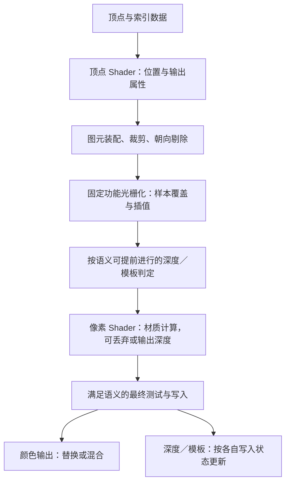
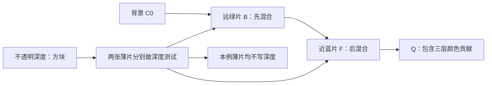

# 第 03 章：三角形、光栅化、深度测试与混合

[返回目录](../README.md) · [上一章：坐标变换、相机与投影](02-coordinate-spaces.md) · [下一章：Shader、材质与光照基础](04-shaders-materials-lighting.md) · [练习答案](../appendices/answers/03-raster-depth-blending.md)

> **适用配置：**UE 5.7.4，CL 51494982，Windows／D3D12／SM6，传统材质、非 Nanite、桌面延迟渲染的配置 A。完整设置见 [配置附录](../appendices/configuration.md)。本章不把普通硬件光栅化流程直接套到 Nanite 软件光栅化或其他现代分支。
>
> **证据边界：**本章 UE 状态设置与 D3D12 转换经过本地源码静态核对。覆盖规则、插值公式属于图形学基础；小网格和颜色数字是明确假设下的教学算例。本批没有创建 UE 项目、启动场景、截图或测量 GPU 时间，观察练习全部是待验证预期。

## 3.1 学习目标与前置知识

学完本章，应当能够把“这个像素被三角形碰到了”拆成五个问题：图元是否被剔除，采样点是否被覆盖，属性怎样到达这个位置，深度与模板是否允许贡献，颜色怎样与已有结果组合。

你还应该能解释：为什么两个相邻三角形不应重复处理共同边界；为什么 UV 通常不能按屏幕坐标直接线性插值；为什么透明物体往往测试深度却不写深度；为什么最终只有一个像素，像素着色器却可能执行多次。

前置知识是第 01 章的顶点、像素 P／Q、传统 GBuffer，以及第 02 章的裁剪坐标、齐次分量 `w`、透视除法和反向 Z。正文使用加减乘除、二维向量和加权平均；公式中的变量都会在首次出现时定义。尚未理解矩阵推导也可以先跟算，但应记住：进入本章时，顶点已经能够被变换到裁剪空间。

贯穿案例继续使用红方块、地面、金属球和无光照透明薄片。**P** 位于方块没有被薄片覆盖的位置，**Q** 位于薄片与方块投影重叠的位置。它们是当前画面上的观察标签，不是永远绑定在某个顶点上的编号。

## 3.2 三角形是一组有顺序的顶点

### 3.2.1 位置相同，不保证是同一个渲染顶点

三角形由三个顶点引用组成，例如索引 `(0,1,2)`。每个顶点不仅有位置，还可能包含 UV、法线、切线、顶点颜色等属性。索引表示引用顺序；顶点属性表示每个引用位置携带的数据。

方块一个角落连接三个面。如果希望三个面在光照上保持棱角，同一几何位置可以有三条顶点记录，分别携带三个面的法线。如果 UV 图在这里有接缝，两侧也可能需要不同 UV。于是“8 个几何角点”“渲染顶点条数”“三角形数”是三个计数，不能互相替代。索引复用可以减少重复输入，但不能把本来不同的属性强行合并。

### 3.2.2 顶点绕序决定朝向分类

**绕序（Winding）**指依次连接三个顶点时，在约定的观察平面上呈顺时针还是逆时针。同一组位置按 `(0,1,2)` 与 `(0,2,1)` 连接，形状相同，绕序相反。

**背面剔除（Back-face Culling）**根据图元朝向和当前光栅状态排除一侧三角形。它不同于“这个面的法线是否朝向灯”：前者解决是否提交覆盖工作，后者参与着色。修改法线贴图可以改变光照效果，却不会因此倒转索引绕序。负缩放、视图反转和网格导入约定也会影响应采用的剔除状态。

本章后面的手算使用屏幕 `x` 向右、`y` 向下、单位为像素间距的坐标。不要把这个平面的顺逆时针结论直接搬到数学课常用的 `y` 向上坐标中。

**[源码已确认]** D3D12 后端在建立光栅状态时设置 `FrontCounterClockwise=true`，并将 RHI 的 `CM_CW`、`CM_CCW` 转换为相应的 D3D12 剔除枚举，见 [D3D12State.cpp：剔除映射](G:/UnrealEngineInstalled/UE_5.7/Engine/Source/Runtime/D3D12RHI/Private/D3D12State.cpp:30) 与 [光栅状态创建](G:/UnrealEngineInstalled/UE_5.7/Engine/Source/Runtime/D3D12RHI/Private/D3D12State.cpp:347)。这证明状态如何传给后端，不足以单独推出所有 UE 网格永远采用同一种剔除方向；具体绘制仍要看最终选中的状态。

薄片启用 Two Sided，使两侧都可以产生可见贡献。它没有凭空增加厚度，也不保证对一个闭合模型只增加“恰好一倍”工作。成本取决于原来被剔除的面是否覆盖画面、是否被深度挡住，以及所用材质。

## 3.3 从连续三角形到离散采样点

### 3.3.1 覆盖的是采样位置，不是整个像素方格的面积

先采用**单采样、普通光栅化、无保守光栅化**的教学模型：像素 `(i,j)` 的中心位于 `(i+0.5,j+0.5)`，其中 `i`、`j` 是从 0 开始的列、行整数。一个很细的三角形即使穿过像素方格，也可能没有覆盖中心，因此不产生该样本的正常覆盖。

这解释了几何边缘为何会有锯齿或随相机轻微运动而改变覆盖。抗锯齿需要进一步处理采样不足，但 TAA 不会把当前帧的普通光栅器改成“每个方格都按几何面积精确积分”。本章不引入 MSAA；在多重采样中，一个像素可有多个覆盖样本，而像素着色执行频率又有自己的设置，二者仍不相等。

**光栅化（Rasterization）**根据图元和状态生成覆盖相关工作，并为后续计算提供插值信息。对于配置 A 的普通三角形，这属于 GPU 图形管线提供的功能。UE 的 C++ 负责设置与提交工作，顶点和像素 Shader 负责各自可编程计算；不能在某个 UE `.usf` 文件中杜撰一段“逐像素枚举所有三角形”的固定功能实现。

### 3.3.2 用边函数判断在三角形哪一侧

**[教学简化]** 以下用实数公式解释覆盖判断，不复刻硬件内部的子像素定点精度、舍入和调度方式。对有向边 `A→B` 与待测位置 `X=(x,y)`，定义：

```text
E_AB(X) = (B.x-A.x)(y-A.y) - (B.y-A.y)(x-A.x)
```

`A`、`B`、`X` 的分量单位都是像素间距，`E` 的单位因此是像素间距的平方。它是一个带符号的面积相关量，不是距离。点在边线上时 `E=0`，移到两侧时符号相反。

令屏幕三角形为：

```text
A=(0.5,0.5), B=(4.5,0.5), C=(0.5,4.5)
```

在本章 `y` 向下的坐标中，这个绕序满足内部三个边函数均为正。对 `X=(1.5,1.5)`：

```text
E_AB(X) = 4×1 - 0×1 = 4
E_BC(X) = (-4)×1 - 4×(-3) = 8
E_CA(X) = 0×(-3) - (-4)×1 = 4
```

三个值都大于 0，所以 X 位于内部。对 `Y=(4.5,4.5)`，`E_BC(Y)=-16`，说明它在 BC 边的外侧。若颠倒三角形绕序，符号约定也必须一起改变，不能继续无条件使用“三个值都大于零”。

### 3.3.3 Top-left 规则让共享边只归一边

仅写 `E>=0` 会产生问题：用两个三角形拼矩形时，落在共同边上的样本可能被算两次。如果两个面都透明，这条边就可能比旁边多混合一次。简单改成 `E>0` 又可能两边都不认，产生缝隙。

**Top-left（上／左边归属）规则**为刚好落在边上的样本指定唯一归属。用本节这种内部 `E>0` 的有向三角形，可以把边界条件写成：非水平边中 `B.y-A.y<0` 的边，以及水平边中 `B.x-A.x>0` 的边，接受等号；其他边不接受。这个表达绑定了本节坐标和绕序，不是脱离约定的通用代码片段。

加入 `D=(4.5,4.5)`，用 `ABC` 与 `BDC` 拼成矩形。共有边在前者中是 `B→C`，其 `dy=4`，不接受等号；在后者中是 `C→B`，其 `dy=-4`，接受等号。位于 `(1.5,3.5)` 的样本恰在共有边上，归 `BDC`，不会同时归两者。

这个保证要求两边实际使用一致的边界位置等条件。若网格存在裂缝、相邻面变形不一致或裁剪结果不匹配，不能指望一条覆盖规则修补几何数据。反过来，正常三角形网格显示一条接缝时，也应检查 UV、法线或材质差异，而不直接认定“GPU 把边画了两遍”。

## 3.4 属性怎样从顶点到达 P

### 3.4.1 屏幕重心坐标是三个面积权重

对三角形内部的位置，可以用三个**重心坐标（Barycentric Coordinates）**表示其相对位置，记作 `λA`、`λB`、`λC`。它们无单位，内部时非负，并且和为 1。屏幕重心权重可由对边的边函数除以整个三角形对应的面积量得到：

```text
D = E_AB(C)
λA = E_BC(X)/D
λB = E_CA(X)/D
λC = E_AB(X)/D
```

这里 `D` 单位是像素间距平方，分子与分母单位抵消。本例 `D=16`，在 `X=(1.5,1.5)` 处得到 `(λA,λB,λC)=(1/2,1/4,1/4)`。

如果三个顶点都具有相同的齐次 `w`，普通顶点属性可以按这些权重线性组合。例如三个顶点的灰度分别为 `0、1、0`，插值得到 `1/4`。但透视投影一般使各顶点的 `w` 不同，屏幕上的“中间”不再对应三维表面上的“中间”。

### 3.4.2 完整算例：透视正确的 UV

**[教学简化]** 仍用上一节的屏幕三角形，把它当作覆盖 P 附近的一小块放大示意。UV 是无单位的纹理坐标；`w` 取统一尺度下的齐次分量，不把其数字当成米或厘米。假设所有顶点在裁剪后有效，采用普通透视正确插值，不使用平面插值或特殊采样位置修饰。

| 顶点 | 屏幕位置，像素间距 | UV | 齐次 `w` | P 处屏幕权重 |
|---|---|---|---|---|
| A | `(0.5,0.5)` | `(0,0)` | `1` | `1/2` |
| B | `(4.5,0.5)` | `(1,0)` | `2` | `1/4` |
| C | `(0.5,4.5)` | `(0,1)` | `4` | `1/4` |

如果直接按屏幕权重求 UV，会得到 `(0.25,0.25)`。透视正确插值则对任意这样的属性 `a` 使用：

```text
a(P) = [λA aA/wA + λB aB/wB + λC aC/wC]
       / [λA/wA + λB/wB + λC/wC]
```

`a` 可以是标量，也可以是逐分量计算的 UV、颜色或其他适合插值的向量。先算公共分母：

```text
H = (1/2)/1 + (1/4)/2 + (1/4)/4
  = 1/2 + 1/8 + 1/16 = 11/16
```

再算两个 UV 分量：

```text
U 的分子 = (1/2)×0/1 + (1/4)×1/2 + (1/4)×0/4 = 1/8
V 的分子 = (1/2)×0/1 + (1/4)×0/2 + (1/4)×1/4 = 1/16

U(P) = (1/8)/(11/16) = 2/11 ≈ 0.181818
V(P) = (1/16)/(11/16) = 1/11 ≈ 0.090909
```

也可以先把屏幕权重修正为 `(8/11,2/11,1/11)`，再组合属性。靠近相机、`w` 较小的顶点得到更大的修正权重，所以结果偏向 A。若把三者的 `w` 都改为 2，公共因子约掉，就重新得到屏幕线性结果 `(0.25,0.25)`。这是检查公式有没有写反的一个办法。

这一步不要求像素 Shader 自己对每条输入重复手写除法。图形管线依据插值约定向 Shader 提供相应属性；本式解释数学结果，不断言硬件逐指令采取同样写法。

### 3.4.3 哪些数据不能照搬这条公式

类别编号、位标记等离散数据一般不应混合出“半个编号”，需要不插值等约定。法线即使正确插值，长度通常也不再为 1，参与光照前常需重新归一化。正确插值不意味着语义自动正确。

深度还要特别区分：普通光栅化中，用于屏幕深度比较的投影后深度 `z_clip/w_clip` 可按屏幕重心权重线性插值。不能先得到这个已经除过 `w` 的量，又当成普通顶点属性再套一次透视正确公式。若要求视图空间深度，则需要按投影关系另行重建。第 02 章的“距离”和本章的“深度数值”必须保持区分。

## 3.5 谁执行了什么：顶点、覆盖与像素着色

[打开光栅化静态图](../assets/diagrams/03-raster-depth-blending-1.png)



图中是**概念责任图**，不是每块 GPU 都逐框串行执行的硬件时序，也没有宣称所有片元都先完整经过 Early-Z。覆盖、着色与写入在实现中可以流水和优化。

顶点 Shader 主要按顶点输入开展工作，其输出不只有颜色。图元裁剪处理跨越裁剪边界的三角形，背面剔除删除不需要的一侧；光栅化把连续图元变成覆盖信息。**像素 Shader 调用（Invocation）**则是某次像素阶段程序执行。一个最终像素可能收到多个三角形、多种 Pass 的调用，部分调用最后没有写颜色。

### 3.5.1 为什么经常提到 2×2 Quad

纹理采样需要估计 UV 在屏幕上变化多快，从而选择合适的细节层级。像素 Shader 中的 `ddx`、`ddy` 一类操作，使用邻近执行位置的差分估计屏幕方向导数。为支持这种计算，常以 **Quad（四个邻近位置的 2×2 组）**理解相关像素执行关系。

假设同一三角形内部一组位置的 U 值为：

```text
0.20  0.24
0.21  0.25
```

用相隔一个像素间距的差分理解，可得水平方向约 `0.04 UV/像素`，竖直方向约 `0.01 UV/像素`。这些量描述纹理坐标对屏幕位置的变化率，不是法线，也不是物体速度。真实 `ddx`／`ddy` 还受粗细导数语义和执行情况影响，不应把这张小表当成所有指令的精确硬件实现。

在三角形边缘，四个位置未必都属于有效覆盖。GPU 可能运行**辅助调用（Helper Invocation）**以提供计算邻域，而这些辅助调用不按正常有效片元提交颜色写入。因此，一个仅覆盖少量样本的小三角形仍可能产生额外执行。不能看到 100 万个最终像素就断言只执行了 100 万次像素 Shader。

当相邻位置选择不同分支时，导数的可用性与具体 Shader 语义有关。实践中应避免在没有理清导数条件的分歧控制流里随意依赖隐式纹理梯度。第 05 章会把这件事与 Mip、过滤和纹理闪烁接起来；本章只建立“插值属性还会通过邻域变化影响采样”的联系。

## 3.6 深度测试与写入是两个开关

### 3.6.1 先比较，再讨论是否保存

令 `d_new` 是当前样本的深度，`d_old` 是同位置深度缓冲已有值。二者必须处于相同投影与深度约定，通常是无量纲的设备深度，不能直接混用厘米值。**深度测试**根据比较函数决定是否允许继续；**深度写入**决定通过相应测试后是否把 `d_new` 保存到深度缓冲。

| 比较与写入组合 | 含义 | 一种可能用途 |
|---|---|---|
| 比较通过才贡献，并写入 | 新表面参与选择，改变后续遮挡依据 | 建立不透明可见表面 |
| 比较通过才贡献，不写入 | 尊重已有遮挡，不建立新的深度遮挡层 | 普通透明颜色绘制 |
| 总是通过，并写入 | 不拒绝当前贡献，但更新深度 | 特定受控绘制，不能当一般透明设置 |
| 总是通过，不写入 | 不用深度限制贡献，也不改变深度 | 某些覆盖式效果 |

颜色是否写入又是独立问题。一个深度预通道可以测试并写深度，同时不输出正常场景颜色。反过来，某次绘制可以写颜色，却让深度保持不变。深度资源的读写访问权限还必须与所用状态相容；一个状态声明不能让只读资源绑定自动变成可写。

**[源码已确认]** [RHI.h：深度模板初始化器](G:/UnrealEngineInstalled/UE_5.7/Engine/Source/Runtime/RHI/Public/RHI.h:325) 分别声明 `bEnableDepthWrite` 与 `DepthTest`。[RHIStaticStates.h](G:/UnrealEngineInstalled/UE_5.7/Engine/Source/Runtime/RenderCore/Public/RHIStaticStates.h:198) 显示 `TStaticDepthStencilState` 的第一个布尔参数就是是否写深度。因此，`TStaticDepthStencilState<false, CF_GreaterEqual>` 中的 `false` 不能读成“关闭深度测试”。

### 3.6.2 反向 Z 下，大值表示较近

本章主视图采用反向 Z：近平面趋近 1，远处趋近 0，背景清除值通常使用远端值。**[源码已确认]** [RHIDefinitions.h：ERHIZBuffer](G:/UnrealEngineInstalled/UE_5.7/Engine/Source/Runtime/RHI/Public/RHIDefinitions.h:298) 定义 `NearPlane=1`、`FarPlane=0`；[比较别名](G:/UnrealEngineInstalled/UE_5.7/Engine/Source/Runtime/RHI/Public/RHIDefinitions.h:405) 据此把 `CF_DepthNearOrEqual` 对应到 `CF_GreaterEqual`。

**[教学简化]** 假设当前目标以 0 清除，比较为 `d_new>=d_old`，通过后允许写深度。用三个虚构设备深度说明：

1. 地面提交 `0.20`，满足 `0.20>=0`，写入 0.20。
2. 方块在 P 提交 `0.70`，满足 `0.70>=0.20`，写入 0.70。
3. 方块背后的另一表面提交 `0.40`，不满足 `0.40>=0.70`，其正常颜色贡献被拒绝。

如果先画方块再画地面，最终仍留下 0.70，但被遮挡工作是否能更早省掉可能不同。结果与顺序无关的前提是这里的普通不透明深度选择模型，不能扩展为“所有 GPU 绘制任意重排”。深度相等、深度偏移、模板更新和混合都会引入额外条件。

对 Q，若薄片在方块前方，假设深度为 0.85，它可通过 `0.85>=0.70`，随后混合颜色。如果透明状态禁止写深度，缓冲仍为方块的 0.70。薄片移到方块后方、假设变为 0.60，测试就失败。这正是“透明仍受不透明遮挡”的基础。

反向 Z 配合浮点深度格式可以改善常见透视投影下的远处精度分配，但没有消除有限精度，也不会修复真正共面的两张表面。Z-fighting（深度冲突）仍应检查几何间隔、近裁剪面、投影、格式与深度偏移等因素，不能归结为只要换一个比较符号即可解决。

### 3.6.3 Early-Z 与 Late-Z 不是两个独立深度缓冲

**Early-Z** 指在昂贵像素着色之前进行允许的深度相关拒绝或测试；**Late-Z** 指需要在像素阶段之后完成的相应判定与更新。它们通常针对同一深度可见性问题，不表示各维护一份名为 EarlyDepth 和 LateDepth 的资源。

如果某个不透明片元已经确定在方块后面，提前拒绝可以省掉材质计算。可是 Masked 材质可能在像素阶段决定丢弃样本；某些 Shader 可能输出自定义深度；副作用和强制早测语义也会影响安排。硬件需要保持程序语义，不能不顾这些因素提前把一个最终会被丢弃的样本写进深度。

不要进一步推断“出现 discard 就完全没有任何 Early-Z 优化”。提前拒绝和提前提交深度写入不是同一件事，硬件可以在允许范围内采用混合安排。实际早测效率、层次深度剔除和辅助调用数量要靠运行工具判断，仅凭材质名称无法计算百分比。

深度预通道是 UE 主动安排的一次或一组绘制工作，Early-Z 是 GPU 对绘制内部的测试安排，两者层次不同。预先生成深度可以帮助后续早拒绝，却也付出了额外几何与深度绘制成本。第 13 章会讨论什么时候这笔交换有利。

## 3.7 Stencil 记录分类，不记录几何远近

**模板缓冲（Stencil Buffer）**保存整数标记。常见深度模板资源中的模板部分为 8 位，可以理解为 0～255 的整数；它不表示米、透明度或另一种连续深度。

模板测试把当前存储值和绘制设置的参考值进行指定比较，并可通过读掩码只关注部分位。例如教学中使用相等比较，参考值 `ref=5`，存储值 `s=1`，读掩码 `mask=3`：

```text
ref & mask = 0101 & 0011 = 0001
s   & mask = 0001 & 0011 = 0001
```

`&` 表示逐位与。两者相等，所以测试通过，尽管原始整数 5 与 1 不同。这里数字都无单位，二进制仅为说明而补足四位。

模板还分别指定模板失败、深度失败、全部通过时采取什么操作，例如保持原值、替换为参考值或递增。写掩码决定哪些位允许更新。**模板测试通过不等于深度测试通过，深度不写入也不等于模板不写入。**

**[源码已确认]** `SetDepthStencilStateForBasePass_Internal` 设置比较规则和特定模板写掩码，其中包含贴花接收、光照通道等相关位，见 [BasePassRendering.cpp](G:/UnrealEngineInstalled/UE_5.7/Engine/Source/Runtime/Renderer/Private/BasePassRendering.cpp:475)。透明状态辅助函数也有“不写深度但按掩码替换模板位”的组合，见 [透明深度模板设置](G:/UnrealEngineInstalled/UE_5.7/Engine/Source/Runtime/Renderer/Private/BasePassRendering.cpp:213)。

因此，不要把教学中的整数 5 当成可以随意写入主场景模板的空闲编号。UE 的主深度模板已有内部用途。用户常接触的 Custom Depth／Custom Stencil 是另外的渲染功能与资源约定，不能因为名称都有 Stencil 就把它与 Base Pass 的内部模板值等同。

## 3.8 Opaque、Masked、Translucent 改变的不只是一个 Alpha

| 模式 | 覆盖样本如何贡献 | 一般深度关系 | 配置 A 的主要理解入口 |
|---|---|---|---|
| Opaque，不透明 | 保留下来的样本作为完整表面 | 建立或匹配已有可见深度 | 普通不透明 Base Pass 与 GBuffer |
| Masked，遮罩 | 由 Opacity Mask 与阈值决定保留或丢弃 | 保留部分按不透明表面处理；具体 Pass 可负责写深度或只匹配 | 深度预通道和不透明 Base Pass 的条件分支 |
| Translucent，半透明 | 有效片元颜色与已有颜色组合 | 通常测试不透明深度，不写普通场景深度 | 专门透明绘制与合成组织 |

Masked 常用于孔洞、栅栏和轮廓切除。一个样本按遮罩留下或丢弃，不是直接以 `Opacity Mask=0.4` 表示“背景透过 60%”。抖动与时序处理能够把二值覆盖组织成另一种视觉结果，但需要额外机制，不能与本章的直接透明公式混称。

把普通 Translucent 的 Opacity 改为 1，只是让当前混合公式的背景 RGB 权重趋于 0，不会自动把材质重新编译为 Opaque 的 GBuffer 路径。把 Opacity 改为 0 也不保证整次绘制被免费删除：CPU 组织、顶点处理、覆盖甚至部分材质计算仍可能发生。

**[源码已确认]** Base Pass 对已经在早期 Pass 中处理的 Masked／抖动条件可以使用不写深度的 `CF_Equal`，其他分支使用可写或只读的 `CF_GreaterEqual`，见 [BasePassRendering.cpp：深度状态选择](G:/UnrealEngineInstalled/UE_5.7/Engine/Source/Runtime/Renderer/Private/BasePassRendering.cpp:499)。这就是为什么不能把整章概念压缩为“Opaque 永远写深度，Masked 永远晚测”。

同文件的 [标准透明 Pass 创建](G:/UnrealEngineInstalled/UE_5.7/Engine/Source/Runtime/Renderer/Private/BasePassRendering.cpp:2647) 初始化不写深度的 `CF_DepthNearOrEqual`。材质禁用深度测试、不同透明用途等还会调整状态，所以本章一直用“普通透明”限定结论。

## 3.9 混合：新颜色怎样与目标已有颜色组合

### 3.9.1 Source 和 Destination 指一次混合两端

**Source（源）**是本次像素输出，**Destination（目标原值）**是颜色目标同位置已有的数据。后画的一层成为 Source，不管它在真实空间中应该近还是远；固定混合单元不会替你重新判断透明层次顺序。

在加法混合操作下，RGB 和 Alpha 可分别写成：

```text
C_out = C_src × F_src + C_dst × F_dst
A_out = A_src × G_src + A_dst × G_dst
```

`C` 是三个线性 RGB 分量，`A` 是目标约定下的 Alpha 数值；`F`、`G` 是所选混合因子，无单位。这里省略颜色通道掩码，假设所讨论通道都可写。RGB 采用本例统一的线性相对光量标度，不是屏幕 sRGB 编码；在 HDR 中可以大于 1。

`F` 与 `G` 不必相同。**[源码已确认]** [RHI.h：混合初始化器](G:/UnrealEngineInstalled/UE_5.7/Engine/Source/Runtime/RHI/Public/RHI.h:402) 分别保存 Color 与 Alpha 的源因子、目标因子和运算；[D3D12State.cpp](G:/UnrealEngineInstalled/UE_5.7/Engine/Source/Runtime/D3D12RHI/Private/D3D12State.cpp:446) 将其分别映射为 D3D12 状态。

### 3.9.2 Straight Alpha 与 Premultiplied Alpha

**Straight Alpha（非预乘 Alpha）**保存未经自身 Alpha 缩放的源 RGB。在本章将源层叠加到已完成背景的模型中，取 `F_src=α`、`F_dst=1-α`：

```text
C_out = α C_src + (1-α) C_dst
```

这里 `α` 是源不透明度，无单位，范围 0～1。**Premultiplied Alpha（预乘 Alpha）**先把源颜色保存为 `C'_src=α C_src`，混合时改用 `F_src=1`：

```text
C_out = C'_src + (1-α) C_dst
```

两式可以表达相同结果，前提是输入表示和混合状态匹配。若把预乘后的 RGB 再乘一次 `α`，源贡献会变成 `α² C_src`，往往过暗；若把非预乘颜色直接交给源因子为 1 的状态，贡献又会过强。预乘不是“效果更透明”的另一个不透明度数值，而是数据表示与公式的配套约定。

透明目标的 RGB／Alpha 如何保存还要另行约定。通用 source-over 覆盖合成若保存预乘 RGB，其 Alpha 可用 `A_out=α+(1-α)A_dst`；如果还要把得到的 RGB 表示成非预乘形式，可能需要除以新 Alpha。不要在两个都半透明的非预乘图层间无条件套用上面针对已完成背景的简式，同时假定结果仍是任意约定下的非预乘 RGB。

### 3.9.3 UE 的这个 Alpha 分支不是通用覆盖 Alpha

**[源码已确认]** 传统材质、普通非 Holdout 的 `BLEND_Translucent` 分支使用 RGB 因子 `SourceAlpha` 与 `InverseSourceAlpha`，但 Alpha 因子是 `Zero` 与 `InverseSourceAlpha`，见 [BasePassRendering.cpp](G:/UnrealEngineInstalled/UE_5.7/Engine/Source/Runtime/Renderer/Private/BasePassRendering.cpp:355)。对应运算是：

```text
C_out = α C_src + (1-α) C_dst
A_out = (1-α) A_dst
```

源码注释说明，独立透明合成会用这个 Alpha 记录背景应加入多少。若相应透明累积目标按“剩余背景权重”初始化为 1，那么绘制多层后就得到各层透射权重的乘积。这里是对该表示的数学解释，不是在声明所有名为 SceneColor 的资源永远以 1 清除、所有捕获输出都直接采用相同 Alpha 含义。

同文件 [AlphaComposite 分支](G:/UnrealEngineInstalled/UE_5.7/Engine/Source/Runtime/Renderer/Private/BasePassRendering.cpp:385) 的源 RGB 因子为 `One`，注释明确源颜色已经预乘。Substrate、Holdout、其他混合模式和具体合成目标还有不同条件。阅读代码时应先确定外层分支、资源用途，再解释 Alpha，不能只摘取一个模板参数就宣布所有透明都遵循同一组规则。

## 3.10 完整案例：Q 的两层透明为什么需要顺序

[打开透明混合静态图](../assets/diagrams/03-raster-depth-blending-2.png)

**[教学简化]** 本例扩展贯穿场景，临时加入第二张绿色薄片。假设两张薄片都在不透明方块前，深度测试通过但不写深度；它们不相交，蓝片 F 较近、绿片 B 较远。颜色已经处在同一个线性混合空间，没有折射、受光变化、曝光变化、色调映射、雾和时序重建。

所有 RGB 都是虚构的混合阶段输入，绝非材质 Base Color 或运行截图数值。场景搭建仍沿用 `Tint×EmissiveStrength(300)` 和约 EV100=9.9 的曝光起点；不要拿下面小于等于 1 的数字替代该实际材质输入，再要求屏幕复现手算。

```text
不透明背景 C0 = (0.8, 0.1, 0.05)
较远绿片 CB   = (0.0, 1.0, 0.0), αB = 0.5
较近蓝片 CF   = (0.1, 0.6, 1.0), αF = 0.35
```

`C0`、`CB`、`CF` 使用同一线性相对光量标度；`αB`、`αF` 为无单位的权重。正确的普通 source-over 绘制从后向前开始，先让绿片覆盖背景：

```text
C1 = 0.5 CB + 0.5 C0
   = (0.4, 0.55, 0.025)

C2 = 0.35 CF + 0.65 C1
   = (0.035, 0.21, 0.35) + (0.26, 0.3575, 0.01625)
   = (0.295, 0.5675, 0.36625)
```

最后得到 Q 的混合结果。把公式展开更能看清各层权重：

```text
C2 = 0.35 CF + 0.325 CB + 0.325 C0
```

三项权重相加为 1。前面的蓝片先吸收了整体权重中的 0.35，剩下 0.65 再由绿片与背景各分一半。这是本模型中沿视线合成的含义，不是让某一层“修改后面物体的材质”。

如果错误地先画近蓝片、后画远绿片：

```text
C1_wrong = 0.35 CF + 0.65 C0
         = (0.555, 0.275, 0.3825)

C2_wrong = 0.5 CB + 0.5 C1_wrong
         = (0.2775, 0.6375, 0.19125)
```

绿分量上升，蓝分量明显下降。错误顺序把本来应在后面的绿片当作最后覆盖的前景。深度缓冲仍只保留方块深度，所以它不会在两张都位于方块前方的透明薄片之间自动纠正顺序。

若透明累积 Alpha 使用上一节的剩余背景权重且初始化为 1，则两种顺序都得到：

```text
T = (1-αB)(1-αF) = 0.5×0.65 = 0.325
```

`T` 是剩余背景权重，无单位。乘法交换，所以 T 相同；各层 RGB 的权重却不同，所以颜色不同。“Alpha 图一致”不能证明透明排序正确。若另用通用 source-over 的覆盖 Alpha，并从透明背景 0 开始，合并层覆盖 Alpha 是 `1-T=0.675`；若从不透明背景 Alpha=1 开始，其覆盖 Alpha 仍为 1。三者表达的对象不同。



普通透明排序经常按对象或绘制批次组织，未必为每个像素建立完整的片元列表。相交网格、一个网格内部的前后面、环形遮挡关系，都可能不存在一个对整件物体处处正确的顺序。单纯增大排序优先级可以固定某种覆盖关系，却不能普遍解决几何相交的局部顺序。第 18 章再讨论 UE 透明路径与可用策略的边界。

## 3.11 观察实验：分别改变覆盖、深度和混合

> **[尚未验证]** 以下是给读者的实验步骤与机制预期。作者尚未创建或运行此项目，没有附带实测截图或性能数字。先恢复配置 A、固定摄像机与曝光、关闭动态分辨率，并等待 Shader 准备完成。每次只改变表中一项，保留可恢复的材质副本。

| 实验 | 操作 | 预期与记录点 | 不符合预期时先检查 |
|---|---|---|---|
| 面朝向 | 复制薄片材质，关闭 Two Sided；从薄片两侧分别观察，然后恢复 | 一侧可能被剔除；记录几何朝向。回到固定相机后重新选 P／Q | 是否仍使用原材质；网格是否本来有正反两层；是否真的越过了面片 |
| 深度遮挡 | 固定相机，把蓝片从方块前移到方块后，保持 Q 仍位于两者投影重叠区 | 后方薄片应被方块深度挡住，P 的材质不变 | 是否开启 Disable Depth Test；是否移出了重叠区；是否实际看到其他背景 |
| 二值遮罩 | 为薄片制作 Unlit、Masked 材质副本；用 TextureCoordinate 的 U 分量驱动 Opacity Mask，并固定一个中间阈值 | UV 一侧保留、另一侧丢弃。保留部分形成完整表面，边界可能受 TAA 影响 | 是否误接 Opacity；UV 方向是否符合假设；是否改变了 Blend Mode 后还未编译完 |
| 透明权重 | 恢复普通蓝片，Opacity 依次为 0、0.35、1 | Q 中前景权重变化；Opacity=1 的路径仍是透明；P 可作为构图和整体曝光参照 | 自动曝光或相机覆盖；薄片自发光强度是否仍为 300；后处理是否改变 |
| 透明层次 | 复制第二张透明薄片，改为绿色，在方块前安排两张不相交薄片，并交换它们真实前后位置 | 重叠区域颜色应随可见层次改变；记录对象位置和实际排序，不用拾色器硬对手算 | 两片是否共面或相交；排序设置是否被手动覆盖；是否有不同透明 Pass 条件 |
| 对照深度 | 在可用的缓冲可视化中查看 Scene Depth，比较蓝片位于前方时的 Q 与下方方块 | 普通透明颜色不写主场景深度，深度图预期仍表现不透明底层 | 是否观察 Custom Depth；是否换成 Masked；可视化是否包含自身显示变换 |

最后一项不能通过屏幕灰度反推 `d=0.70`：缓冲可视化可能映射或重建深度，本章数字本来也是虚构输入。若希望验证实际比较和混合因子，应在后续抓帧实践中查看所选绘制的深度模板状态、混合状态、绑定目标和 Shader，再与代码分支对照。

观察 TAA 下的锯齿变化时，要同时记住它利用历史。当前帧覆盖与最后显示的边缘平滑并非同一个结果。不要为看清一条边而悄悄改 AA、分辨率和相机，再把所有变化都归到 Top-left 规则。

## 3.12 成本与误区：三角形、Draw Call、Pass 不能互换

**Draw Call（绘制调用）**是提交一项绘制工作的命令粒度；它可能绘制大量三角形，也可以包含多个实例。**Pass** 按用途组织工作，可能包含很多 Draw Call。一个物体又可能参与深度、阴影、Base Pass、速度或其他工作，因此“一件物体”“一次绘制”“一个 Pass”“执行一次材质”不能画等号。

减少 Draw Call 可能降低 CPU 组织和命令开销，但不保证减少每个透明层对屏幕的覆盖。把十张满屏透明面片合成一次绘制，若仍需要处理十层覆盖，其像素着色与混合负担仍可能很大。

**Overdraw（重复覆盖）**描述同一图像位置被多次图元贡献覆盖的现象。使用这个词时应声明在数覆盖、着色执行还是实际写入，是否只看某个 Pass；三种数字会因深度拒绝、丢弃、辅助调用而不同。

**[教学简化]** 在 1280×720 的目标上，单张全屏薄片覆盖 `921600` 个样本位置。十层完全重叠、都通过不透明深度的薄片对应 `9216000` 次层覆盖，尚未计入辅助调用和其他 Pass。这是工作量计数，不是 GPU 毫秒；实际成本还受材质采样、运算、目标读写、压缩、带宽和硬件调度影响。

| 常见判断 | 缺失的条件或更准确的解释 |
|---|---|
| 三角形更少就一定更快 | 少量巨大透明三角形可能覆盖很多层；大量很小的三角形又可能受图元处理和 Quad 利用率限制 |
| 开启 Early-Z 就没有 Overdraw | 深度早拒绝只减少允许提前拒绝的工作；透明、遮罩和特殊 Shader 条件不同 |
| Masked 一定比 Translucent 便宜 | Masked 的可见深度行为通常更适合遮挡，但其遮罩采样、覆盖密度和重复深度绘制仍有成本 |
| Opacity=0 就完全免费 | 没有最终颜色变化，不代表 CPU 和 GPU 没有执行工作 |
| 深度预通道一定节省性能 | 额外几何与深度成本，必须由后续省掉的工作补偿；轻量场景可能收益有限 |
| 背面剔除等于遮挡剔除 | 前者按图元朝向，后者按遮挡关系；通过任一筛选都不保证每个片元可见 |
| Shader Complexity 的颜色就是毫秒 | 可视化是特定成本估计或计数映射，不能直接代替同配置下的 GPU 时间测量 |

性能诊断首先确定主要成本位于 CPU 提交、几何、像素计算还是资源读写，再选对应手段。仅凭画面上“没有看到那张透明片”无法证明它没有成本，也无法确定应该优化哪个阶段。

## 3.13 带着三个问题读源码

本章只要求沿“Renderer 选择状态 → RHI 描述状态 → D3D12 转换状态”读一条小链。以下均为 **[源码已确认]** 的本地入口，共涉及五个关键文件；行号随引擎版本变化。

| 文件与入口 | 本章要核实的内容 | 证据边界 |
|---|---|---|
| [BasePassRendering.cpp：传统透明混合](G:/UnrealEngineInstalled/UE_5.7/Engine/Source/Runtime/Renderer/Private/BasePassRendering.cpp:355) | 普通透明与 AlphaComposite 的源／目标 RGB、Alpha 因子不同；同文件 499 行和 2647 行分别选择 Base Pass 与标准透明深度状态 | 有分支与状态定义，不证明当前机器实际选择了它 |
| [RHIStaticStates.h：深度模板参数](G:/UnrealEngineInstalled/UE_5.7/Engine/Source/Runtime/RenderCore/Public/RHIStaticStates.h:198) | 首个布尔参数控制写深度；同文件 263 行开始注释独立 RGB／Alpha 混合公式 | 模板构造状态，不是逐像素执行这些比较的 CPU 循环 |
| [RHI.h：初始化数据结构](G:/UnrealEngineInstalled/UE_5.7/Engine/Source/Runtime/RHI/Public/RHI.h:325) | 深度比较、写入、模板操作独立；402 行起为混合状态，277 行起为光栅状态 | 初始化器默认值不等于每个 Pass 的最终实际状态 |
| [RHIDefinitions.h：深度约定](G:/UnrealEngineInstalled/UE_5.7/Engine/Source/Runtime/RHI/Public/RHIDefinitions.h:298) | 近 1 远 0；405 行起定义比较及 Near／Far 别名 | 不说明所有资源存的都是这种设备深度，线性深度纹理需另辨用途 |
| [D3D12State.cpp：深度模板创建](G:/UnrealEngineInstalled/UE_5.7/Engine/Source/Runtime/D3D12RHI/Private/D3D12State.cpp:376) | 写入掩码与比较函数分别设置；68 行比较映射，347 行光栅状态，446 行混合状态创建 | 这是 CPU 侧 API 描述转换，不是 GPU 内部覆盖、插值和测试算法源码 |

第一个问题是“`false` 关闭的究竟是什么”。先读模板定义，再回到调用。第二个问题是“RGB 正确，为什么 Alpha 不是我背过的公式”。先检查各自因子，再查目标用途。第三个问题是“比较名称如何抵达 D3D12”。从 `CF_GreaterEqual` 跟到 `D3D12_COMPARISON_FUNC_GREATER_EQUAL`，不要把枚举映射误读成 CPU 已经比较完每个像素。

这一段阅读不要求先编译引擎。也不应为了找到“光栅化”而把整个 Renderer 源码中的同名词语都当成三角覆盖实现：普通图形管线的固定功能边界正是本章要认识的接口之一。

## 3.14 本章回顾

三角形的顶点顺序参与朝向判断，连续边界经过采样覆盖规则变成离散工作。Top-left 规则为一致共享边提供唯一归属；重心坐标描述屏幕内位置，透视正确插值再结合 `w` 恢复普通属性的正确分布。

像素着色不是最终像素一对一的函数。重复覆盖、多个 Pass、辅助调用、深度拒绝与材质丢弃都会改变执行和写入的关系。Early-Z 优化执行安排，深度预通道组织额外绘制，两者属于不同层次。

对 P，普通不透明深度选择使方块挡住后面的表面。对 Q，透明薄片可以通过深度测试却不更新主场景深度，再按约定与背景混合。两层透明说明颜色通常依赖顺序；同一个 Alpha 通道也可能保存覆盖不透明度或剩余背景权重，必须结合资源用途解释。

## 3.15 理解检查

1. 沿用 `A=(0.5,0.5)`、`B=(4.5,0.5)`、`C=(0.5,4.5)` 和 `D=(4.5,4.5)`。采样点 `(2.5,2.5)` 位于哪里？按照本章的边界约定，它属于 `ABC`、`BDC`、两者还是都不属于？为什么全部使用 `>=0` 会有问题？
2. 沿用本章 UV 与 `w`，改在屏幕位置 `(2.5,1.5)` 计算屏幕重心权重、直接线性 UV 和透视正确 UV。列出分母与分子，并解释哪个步骤使用了透视信息。
3. 反向 Z 缓冲已有 `0.65`。一片深度为 `0.8` 的普通透明表面使用“不写深度、GreaterEqual”，随后另一个透明表面深度为 `0.7`。两者能否通过？若错误地让第一片写深度会怎样？为什么这不能普遍替代透明排序？
4. 源非预乘颜色为 `(0.2,0.4,1.0)`，不透明度 `0.25`，背景 RGB 为 `(0.8,0.2,0.0)`。分别用非预乘与预乘表示计算结果。若把预乘源错交给 `SourceAlpha` 因子的状态，结果是什么？若 Alpha 保存剩余背景权重且原值为 1，新值是多少？
5. 同事说：“这个方块只有 12 个三角形，薄片的 Opacity 又是 0，所以一帧最多 12 次像素着色；打开深度预通道后肯定更快。”请指出计数单位、材质执行和性能推断分别错在哪里，并列出两项应该补充的运行证据。

[查看本章答案](../appendices/answers/03-raster-depth-blending.md) · [继续第 04 章](04-shaders-materials-lighting.md)
