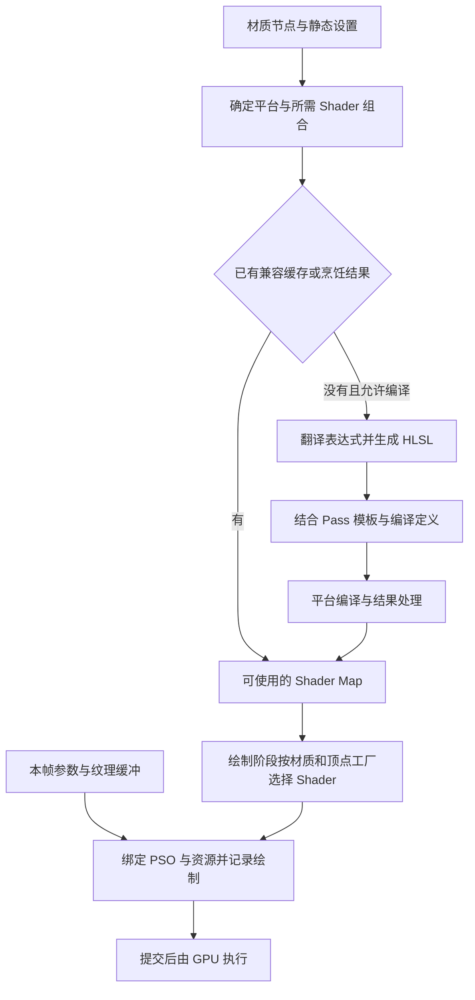
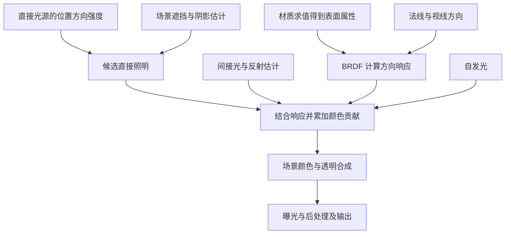

# 第 04 章：Shader、材质与光照基础

[返回目录](../README.md) · [上一章：光栅化、深度与混合](03-raster-depth-blending.md) · [本章答案](../appendices/answers/04-shaders-materials-lighting.md)

> **适用基线：**UE 5.7.4，CL 51494982，Windows、D3D12、SM6，桌面延迟渲染，配置 A。传统 Surface／Default Lit 不透明材质，不启用 Substrate、Nanite、Lumen、硬件光追或 MegaLights。透明薄片继续使用第一章的 Unlit／Translucent 材质。完整设置见[配置附录](../appendices/configuration.md)。
>
> **证据边界：**本章源码入口与关键语句已对照本地安装核验。数学算例是声明了输入和省略项的教学模型；编辑器观察步骤尚未实际运行，不提供实测像素值、编译耗时或 GPU 耗时。引用的引擎绝对路径用于本机定位，不能在 GitHub 网页直接打开。

## 4.1 学习目标与前置知识

上一章解决了“哪些三角形覆盖这里、哪个表面留下来、颜色怎样混合”。但知道 P 看见红色方块，还不能知道 P 应当输出多亮的红色。本章补上表面和光相遇之后的计算。

学完后，应能解释：

1. Shader、材质、着色模型和渲染阶段分别是什么，为什么一个材质不等于一个像素 Shader。
2. 材质节点怎样成为 GPU 可执行代码，哪些修改改变参数，哪些修改可能产生新编译任务。
3. 光照计算为什么需要法线、光线方向、视线方向以及距离。
4. Base Color、Metallic、Specular、Roughness 分别控制什么，为什么金属在缺少环境光时可能很暗。
5. 如何把简单反射公式与 UE 的材质求值、GBuffer、延迟光照连接起来，并认出教学模型遗漏了什么。

前置知识是第 02 章的空间与向量，以及第 03 章的插值、深度测试和透明混合。不需要先懂微积分。本章会把积分解释为“把来自许多方向的贡献相加”，再用只有一个方向的光源完成手算。

贯穿案例保持不变：P 是红方块上未被蓝色薄片覆盖的可见位置，Q 是薄片与方块重叠的位置；金属球用于观察镜面反射。P、Q 是观察位置标签，改变相机后必须重新确认对应表面。

## 4.2 先分清四种容易混在一起的东西

### 4.2.1 Shader 是程序，不是某种固定的光照效果

**着色器（Shader）**是按照 GPU 接口规定执行的程序。名字里有“着色”，但它不必产生最终颜色：它可以变换顶点、写材质属性、生成深度、筛选数据或处理图像。

本章重点认识三个阶段：

| 阶段 | 英文与简称 | 输入和职责 | 输出与本例关系 |
|---|---|---|---|
| 顶点着色器 | Vertex Shader，VS | 读取顶点及对象、视图数据，计算位置与后续要插值的属性 | 方块顶点的裁剪空间位置、UV、法线等；材质世界位置偏移也可能参与 |
| 像素着色器 | Pixel Shader，PS；其他 API 也常称 Fragment Shader | 对光栅化产生的片元执行计算，使用插值属性和绑定资源 | Base Pass 可写材质属性；延迟光照可计算颜色贡献；透明 PS 可提供混合前颜色 |
| 计算着色器 | Compute Shader，CS | 由 Dispatch 调度线程组，显式读取和写入纹理或缓冲 | 可用于光照、裁剪或后处理计算；不会因为叫 Shader 就自动经历三角形光栅化 |

**Dispatch（分派）**与 **Draw（绘制）**是两类任务入口。Draw 按图形管线处理图元；Dispatch 指定计算线程组数量。CS 的线程组不是游戏线程或渲染线程，它是 GPU 内部对执行工作的组织。

也不要把“每个像素一次 PS”当作严格执行计数。遮挡、透明层、多个 Pass、采样模式和用于导数的辅助执行都会改变实际工作量。同一个屏幕位置在一帧中可能参与多次完全不同的 Shader 计算。

**[源码已确认]** Base Pass 的 C++ 注册把 VS 指向 `BasePassVertexShader.usf` 的 `Main`，把 PS 指向 `BasePassPixelShader.usf` 的 `MainPS`。同处还存在 `MainCS` 的计算 Shader 注册。注册存在不表示本章非 Nanite 方块实际选择了 CS 路径，见[源码证据 S04-01](#s04-01)。

### 4.2.2 材质描述如何得到属性，着色模型解释属性怎样响应光

**材质（Material）**是一份表面计算与渲染设置的描述。它包括节点表达式、纹理和参数引用，以及混合模式、着色模型等设置。节点图里把常量接到 Roughness，描述的是“怎样得到粗糙度”，还没有描述“场景里每盏灯照过来之后总共多亮”。

**着色模型（Shading Model）**规定这些属性如何参与散射或反射计算。Default Lit、Unlit、Clear Coat 等并非只是名字不同，而是需要的数据和光照处理不同。本章只深入传统 Default Lit 的不透明反射，以及用于对照的 Unlit 薄片。

**渲染阶段（Render Pass）**是一次具有明确输入、输出和执行任务的处理。Base Pass、阴影深度、延迟直接光照各有职责；它们可以为同一个物体选择不同 Shader，读取不同材质子表达式。

例如红方块的节点图输出 Base Color，但在基础延迟路径中，Base Pass 先记录表面属性，后面的延迟光照再结合灯光和视线进行计算。阴影深度阶段主要关心几何与必要的遮挡信息，通常不需要把整套最终颜色计算再做一遍。蒙版或位移材质会使某些额外表达式也成为必要输入。

因此正确的关系是：**材质提供表达式和设置，Pass 决定当下任务，Shader 变体把适用部分编译成程序，着色模型参与解释表面对光的响应。**

## 4.3 材质节点怎样变成实际执行的代码

### 4.3.1 一个节点图先是一组表达式

假设给红方块做一个简化材质：纹理提供图案，`Tint` 参数控制整体颜色，另一个参数控制粗糙度。用近似 HLSL 表达为：

```hlsl
// [教学简化] 表示节点之间的关系，不是 UE 导出的完整代码。
float3 baseColor = Texture.Sample(Sampler, uv).rgb * Tint;
float roughness = RoughnessParameter;
```

**HLSL（High-Level Shading Language，高级着色语言）**是描述 Shader 的语言。上面的 `Texture` 是被绑定的纹理资源，`Sampler` 指定采样行为，`uv` 是当前表面的纹理坐标。Shader 中的资源名不会自己到磁盘寻找图片；CPU 侧必须把实际 GPU 资源连接到相应参数位置。

节点图不必逐节点机械转换为一条 GPU 指令。常量运算可能提前计算；没有被当前输出使用的表达式可能移除；一段表达式也可能展开为多条指令。纹理采样有缓存和数据访问成本，不能与普通乘法只按“各有一个节点”比较。

材质求值也不意味着全部表达式必定逐像素执行。与某个绘制共享的参数可能通过统一表达式与常量缓冲提供，顶点阶段所需表达式在相应阶段求值，依赖 UV 的表面采样则可能在像素阶段发生。它们由表达式依赖、Shader 阶段和编译器共同决定。

### 4.3.2 编译准备与每帧使用是两条不同的路线

下面是逻辑图，不是逐函数、严格串行的执行时序。缓存命中时会跳过部分生成或编译工作。

[打开材质编译与绘制静态图](../assets/diagrams/04-shaders-materials-lighting-1.png)



**Shader Map（着色器映射集合）**可以先理解为某个材质在特定编译条件下所需 Shader 的组织结果。这里的 Map 不是贴图；其中可能有适用于多个 Pass、顶点工厂和变体的程序。

**Permutation（编译变体）**是依据离散编译条件形成的程序版本。例如某个功能是否启用，可能决定一部分代码是否存在。材质身份、静态参数、Shader 类型、平台等共同影响编译与缓存标识；并非每个条件都一定直接表现为同一个整数 `PermutationId`。

**顶点工厂（Vertex Factory）**是 UE 连接不同网格数据组织方式与材质 Shader 的机制。普通静态网格与其他几何数据源读取顶点的方法可能不同，因此仅凭“它们使用同一个材质”不能保证使用完全相同的一组 Shader。

**派生数据缓存（Derived Data Cache，DDC）**保存可重新生成的构建结果，用于复用已经完成的工作。**烹饪（Cook）**为指定目标平台准备可发布的资产与 Shader 等数据。Cook 不是把游戏世界先渲染成视频；玩家仍然每帧执行 Shader，只是通常使用已准备好的程序和数据。

**[源码已确认]** `FMaterial::BeginCompileShaderMap` 先调用 `Translate`，成功后配置材质编译环境并调用 `NewShaderMap->Compile`。缓存入口另有已加载、内存复用和 DDC 路径；要求 Cooked Data 的平台不允许从这里任意进行材质源码编译，见 [S04-02](#s04-02)。所以不能描述成“每帧 GPU 都重新编译一次材质节点”。

本章 SM6 的平台编译使用 **DirectX Shader Compiler（DXC，DirectX 着色器编译器）**，形成 **DirectX Intermediate Language（DXIL，DirectX 中间语言）**等结果与资源绑定信息。DXIL 不是可以脱离显卡驱动直接运行的通用硬件机器码；驱动还需要为具体设备准备可执行管线。本地 `DoesShaderModelRequireDXC` 明确将 SM6.0 及以上送往 DXC 分支，见 [S04-13](#s04-13)。这也解释了为什么“Shader 构建结果存在”与“底层 PSO 已经准备好”是不同状态。

### 4.3.3 本版本的翻译器不能照搬一条旧调用链

**[源码已确认]** `FMaterial::Translate` 检查 Shader Map 的 `bUsingNewHLSLGenerator`，并结合 Substrate 是否启用，选择 `Translate_New` 或 `Translate_Legacy`。即使本章关闭 Substrate，也不能仅凭这一点认定新旧翻译器中的哪一个必然被实际选中。

在旧翻译分支中，`FHLSLMaterialTranslator::GetMaterialShaderCode` 使用 `MaterialTemplate.ush` 的模板解析器，填入表达式生成结果。打开原始模板的 `CalcPixelMaterialInputs`，会看到 `%{...}` 占位内容，而不是某一个具体材质已经展开完毕的代码。这些位置用于填充材质计算，最终 Shader 编译时需要的是生成后的内容，见 [S04-03](#s04-03)。

本章解释的是两条分支共同解决的任务：把材质表达式和编译条件变成 Shader 编译输入。新翻译器的内部表示、表达式优化细节以及全部编译调度机制，不能从旧模板的几行代码推导出来。

### 4.3.4 参数、静态开关和运行时选择有何区别

**材质实例（Material Instance）**在父材质基础上提供参数覆盖。把 `Tint` 从红色改成绿色，通常可以继续使用兼容的已编译程序，只改变供它读取的数据；如果父材质没有暴露这个参数，就不能把任意节点结构变化当作一次普通参数更新。

**Static Switch（静态开关）**选择编译时使用的表达式分支。修改后可能需要另一份 Shader Map 或编译结果。若新组合已缓存，未必再次实际编译；如果没有准备对应组合，也不能指望已打包程序在运行时把任意新材质图即时生成出来。

假设有五个互相独立的二值静态开关，理论组合上限是 `2^5=32`，随后还可能关联多种 Pass 和平台条件。真实数量会受依赖和剔除规则影响，不能直接断言产生恰好 32 个 GPU Shader。这个例子只解释为什么无节制地加入静态功能可能增加构建与存储成本。

## 4.4 选到 Shader 之后，为什么还不能立即画出来

### 4.4.1 程序、资源与管线状态缺一不可

假设某个 PS 需要 Tint、粗糙度和一张纹理。程序编译完成只说明“怎么算”已经准备好；这一帧还要提供“使用哪份输入”。**资源绑定（Resource Binding）**把实际纹理、缓冲及参数连接到 Shader 声明的访问位置。

**统一缓冲（Uniform Buffer）**保存一组按约定布局读取的参数，例如材质或视图数据。“统一”表示它们可以被一批执行共享，不等于所有物体只能拥有同一组值。纹理资源、采样器和用于随机读写的资源又有各自的绑定与访问约束。

**管线状态对象（Pipeline State Object，PSO）**组合一次图形绘制所需的重要状态，如 Shader 组合、顶点输入、光栅状态、深度与模板状态、混合方式和目标格式。它让 GPU／驱动知道如何把多个阶段连接起来。

PSO 不等于“把该物体所有内容装进一个对象”：材质参数、实际纹理引用、顶点和索引缓冲等仍需要设置；部分动态状态也在绘制时提供。相同 Shader 用在不同混合方式或目标格式下，可能对应不同 PSO。

### 4.4.2 沿红方块的一次绘制核对三个边界

**[源码已确认]** Base Pass 的处理路径调用 `GetBasePassShaders`，结合材质、顶点工厂和所需 Shader 类型，通过 `Material.TryGetShaders` 获取程序。获得结果后还有深度和透明状态的设置；选择失败会返回，而不是保证任意组合都可绘制，见 [S04-04](#s04-04)。

随后，网格绘制命令的提交路径明确区分了三件事：`SetGraphicsPipelineStateCheckApply` 应用 PSO，`ShaderBindings.SetOnCommandList` 设置 Shader 输入，最后在相应分支调用 `DrawIndexedPrimitive` 或间接绘制。它们记录的是 RHI 工作，不等于 GPU 已经完成像素计算，见 [S04-05](#s04-05)。

现在可以解释两个不同的停顿来源：从 HLSL 产生 Shader 结果属于 Shader 编译；结合程序与状态准备底层管线可能涉及 PSO 创建。看到首次出现材质时停顿，不能只凭现象认定每一帧都在编译节点，或认定一定是 Shader 太复杂。需要分别观察构建任务、PSO 准备与稳定 GPU 执行时间。

## 4.5 光照需要哪些方向与量

### 4.5.1 N、L、V、H 的方向约定

选择 P 对应的世界空间表面点 `x`，本章统一采用以下约定：

| 符号 | 含义 | 如何取得 |
|---|---|---|
| `N` | 着色法线，Normal | 表面的着色朝向，可能经过插值和法线贴图处理 |
| `L` | 指向光源的单位方向，Light direction | 点光使用 `normalize(lightPosition - x)`；方向光使用统一方向 |
| `V` | 指向相机的单位方向，View direction | `normalize(cameraPosition - x)` |
| `H` | 半程向量，Half vector | `normalize(L + V)`，两方向不互为反向且和非零时成立 |

本章的 `L` 从表面指向灯，与真实光从灯传播到表面的方向相反。使用 `reflect` 等函数时尤其需要检查其期望的是入射传播方向还是朝向光源的方向。源码中的 `CameraVector` 也不一定等于本章的 `V`；本地延迟光照有 `V = -CameraVector`，见 [S04-09](#s04-09)。

**归一化（Normalization）**把非零向量除以自身长度，使它只保留方向。`normalize((0,3,4))=(0,0.6,0.8)`。如果把未归一化的 `(0,3,4)` 与 `N=(0,0,1)` 点乘得到 `4`，就不能把它当作余弦。

**点积（Dot Product）**按分量相乘再相加：`a·b=ax*bx+ay*by+az*bz`。两个单位向量的点积等于夹角的余弦，因此 `N·L=1` 表示正对光，`0` 表示掠过表面，负值表示灯在该法线的背面。对本章单面不透明反射，常用 `max(N·L,0)`；双面、透射或次表面模型不能全部套用这一规则。

`H` 不是第三束真实的光。它代表能够把 `L` 方向入射光镜面反射到 `V` 方向的微小镜面所需朝向。`N·H` 用来衡量这种朝向与整体表面有多接近；`V·H` 用于微表面的入射或出射夹角计算。

#### 4.5.1.1 同一空间、切线法线与逆转置

点积比较方向之前，`N`、`L`、`V` 必须处于同一个坐标空间，并按公式要求成为单位向量。把局部空间法线与世界空间灯方向点乘，即使三个分量看起来合理，也是在比较不同坐标轴下的数字。只有把二者转换到共同空间，所得余弦才有明确几何意义。

材质法线贴图常提供**切线空间（Tangent Space）**中的方向。这个空间跟随表面，用切线 `T`、副切线 `B` 和基础法线 `N_base` 作为三个轴，合称 **TBN 基底（Tangent、Bitangent、Normal Basis）**。其中 T、B 大致对应表面的纹理方向；手性、网格切线和 UV 组织会影响其实际构造。法线贴图经正确解码后给出的是该基底下的方向分量，不是可以直接当世界 XYZ 使用的一张彩色图片。

假设三根基轴已经用世界坐标表示，切线法线为 `n_ts=(nx,ny,nz)`，则概念转换为：

```text
n_world = normalize(nx*T + ny*B + nz*N_base)
```

沿用第 02 章的行向量约定，如果 TBN 的三行分别是 `T`、`B`、`N_base`，同一操作也可写为 `normalize(n_ts*TBN)`。它把各轴上的分量重新组合成世界方向；不会给每个纹理像素真的建立新的几何面。插值或基底误差可能使长度改变，所以转换后仍需归一化。

这与另一个问题有关，但不能混为一件事：**几何体受到非均匀缩放时，怎样变换法线才能保持它垂直于变换后的表面？** 对任意非奇异的三维线性变换矩阵 `A`，几何切向量变为 `t'=t*A`；法线必须使用逆转置：

```text
n' = normalize(n*A^-T)
A^-T = transpose(inverse(A))
```

`inverse` 是矩阵求逆，`transpose` 是交换行列。这里讨论的是不含平移的 3×3 线性部分；平移不改变方向。其理由是原来的垂直关系 `t*n^T=0` 应保持成立，而 `t*A*(n*A^-T)^T=t*A*A^-1*n^T=t*n^T`。零尺度会使矩阵不可逆，不能继续无条件使用这个公式。

**[教学简化]**取一个表面切向量 `t=(1,1,0)`、与它垂直的法线方向 `n=(1,-1,0)`，沿 X 轴拉伸两倍，即 `A=diag(2,1,1)`。先暂不归一化，以便看清垂直性：

```text
原始垂直关系：dot(t,n) = 1*1 + 1*(-1) = 0
变换后的切线：t' = t*A = (2,1,0)

错误地按普通方向变换：n_wrong = n*A = (2,-1,0)
dot(t',n_wrong) = 2*2 + 1*(-1) = 3

正确使用逆转置：A^-T = diag(0.5,1,1)
n_correct = n*A^-T = (0.5,-1,0)
dot(t',n_correct) = 2*0.5 + 1*(-1) = 0
normalize(n_correct) ≈ (0.447214,-0.894427,0)
```

最后归一化只改变长度，不会把错误的非垂直方向修好。这就是“缩放后再把法线 normalize 一下”并不足以保证一般几何法线正确的原因。

**[源码已确认]**上述逆转置是一般数学规则，不表示 UE 的普通顶点工厂每个顶点都会显式求 `inverse`。本地 `CalcTangentToWorldNoScale` 使用 `InvNonUniformScale` 去除变换基底中的尺度，再组合切线到世界的表示；材质模板按 `MATERIAL_TANGENTSPACENORMAL` 决定将输入经过 `TangentToWorld` 转换，还是直接把输入当作世界法线归一化，见 [S04-14](#s04-14)。这种着色基底处理不能直接宣称等价于任意剪切或非均匀缩放下的几何法线逆转置。

因此跟读时要同时问两件事：数学上要保持什么关系，具体渲染路径实际采用了什么基底与近似。着色法线还可能被法线贴图有意改变，未必等于变换后三角形的几何法线。P 的光照应使用该路径最终得到的着色 N，与同空间 L、V 配合，而不是把任何名为 Normal 的中间变量直接送进公式。

### 4.5.2 辐照度与辐亮度回答不同问题

**辐照度（Irradiance，E）**表示落到单位表面面积上的辐射功率，单位 `W/m²`。它已经把入射方向对该表面的投影影响考虑进来。

**辐亮度（Radiance，L）**描述沿某个方向传递的光量密度，单位 `W/(m²·sr)`。`sr` 是立体角单位 **球面度（Steradian）**；把周围方向看成单位球面上的区域，整球对应 `4π sr`。这里的字母 `L` 常用于辐亮度，容易与向量 `L` 重名；本章公式用 `Li`、`Lo` 表示入射、出射辐亮度，用加粗语义或上下文区分方向。

材质表面反射后，摄像机接收的是沿视线方向的出射结果；只知道总共多少光落到表面上，还需要知道表面会把光怎样分配到各方向。

UE 灯光界面还使用**流明（Lumen，lm）**、**坎德拉（Candela，cd）**和**勒克斯（Lux，lx）**等光度学单位，它们包含人眼光谱敏感度的加权。不能把界面 `1000 lm` 直接当作本章公式中的 `1000 W/m²`。本章数值案例采用已经定义好的辐射量或线性 RGB 教学量，不承担灯具光谱到屏幕 RGB 的完整转换。

## 4.6 先用 Lambert 解释最简单的漫反射

### 4.6.1 BRDF 把“入射”连接到“朝相机离开”

**双向反射分布函数（Bidirectional Reflectance Distribution Function，BRDF）**记作 `fr`。它描述来自一个方向的一小份入射辐照度，会在观察方向产生多少出射辐亮度，单位可写为 `sr^-1`。

**漫反射（Diffuse Reflection）**是宽广地向许多方向分配反射光的响应；**镜面反射（Specular Reflection）**更强地依赖入射与观察方向。真实粗糙镜面反射也可以很宽，不能仅靠“是否看见一个小白点”判断它属于哪一种。

Lambert 模型是最简单的漫反射：

```text
fr_diffuse = rho / pi
Lo_diffuse = (rho / pi) * E
```

`rho` 是漫反射反照率，表示这部分模型反射的比例；RGB 模型可分别为三个通道提供值。Lambert 的 BRDF 不随观察方向变化，但照在表面上的 `E` 会随灯的方向和强度变化。

为什么除以 `π`？因为出射光分布到整个表面上方半球，计算总反射功率时还要按出射角乘余弦。半球上余弦的积分为 `π`，因此 `rho/π` 才让总反射量等于入射量的 `rho` 倍。不是为了随手把颜色调暗，也不是可以在每个阶段再除一次的“经验系数”。

### 4.6.2 完整数值例一：红方块的一个漫反射贡献

**[教学简化]**只保留一束理想平行白光和纯 Lambert 反射，不含镜面、间接光、曝光、预曝光、色调映射、纹理过滤及 UE 能量修正。所有方向已归一化：

```text
N = (0, 0, 1)
L = (0, 0.8, 0.6)
rho = (0.6, 0.1, 0.05)
E_perp = 10 W/m²
```

`E_perp` 特意表示与光束垂直的接收平面所测到的辐照度，而不是已经照在 P 表面上的 `E`。于是：

```text
NoL = max(dot(N, L), 0) = 0.6
E = E_perp * NoL = 10 * 0.6 = 6 W/m²
Lo = rho * 6 / pi
   ≈ (1.145916, 0.190986, 0.095493) W/(m²·sr)
```

此处用 RGB 三通道作教学分量，忽略光谱与色匹配函数的转换。第一通道大于 1 完全允许，因为它是线性光照计算量，不是 8 位显示编码。

如果输入已经告诉你“P 上实际辐照度为 `6 W/m²`”，则直接乘 `rho/π`。再乘一次 `0.6` 就把角度影响算了两遍。

若一块遮挡物完全阻挡这束光，本例给该直接贡献乘可见性 `s=0`，结果为零；没有遮挡时 `s=1`。若某个过滤后的阴影估计提供 `s=0.25`，这份贡献变成原来的四分之一，但那不意味着材质的 `rho` 被永久改小。阴影改变可到达的照明，材质仍保持原来的反射参数。

**[源码已确认]** `Diffuse_Lambert` 直接返回 `DiffuseColor * (1/PI)`。`DefaultLitBxDF` 的普通漫反射分支使用它，随后乘光源衰减、颜色与 `NoL`；另有 `MATERIAL_ROUGHDIFFUSE` 分支，见 [S04-07](#s04-07)。因此 Lambert 是一个明确可定位的模型，但不是“所有 UE 材质永远只做 Lambert”。

## 4.7 微表面模型怎样产生高光

### 4.7.1 Cook-Torrance 公式中的三个问题

把一个粗糙表面想成许多微小镜面，只是一种统计模型：渲染器通常不会为每块微小镜面真的创建三角形。**微表面（Microfacet）**模型用朝向分布和遮蔽统计来近似它们的整体反射。

常见 Cook-Torrance 镜面 BRDF 写作：

```text
fr_specular = D(N,H) * F(V,H) * G(N,L,V)
              / (4 * max(N·L,0) * max(N·V,0))
```

这个式子只在适用的反射半球与非退化方向下讨论；实际实现要处理分母趋零、法线误差和粗糙度极限。本章不建议把上式未经保护直接粘到实时 Shader。

| 项 | 全称与作用 | 它不是哪种概念 |
|---|---|---|
| `D` | Normal Distribution Function，法线分布函数：有多少合适朝向的微表面能把光送向相机 | 不是物体在屏幕上的三角形数量 |
| `F` | Fresnel，菲涅耳项：一次微表面交互反射多少，随角度及材质变化 | 不是整个光源的距离衰减 |
| `G` | Geometry／Masking-Shadowing，微表面遮蔽项：光是否被其他微表面挡住 | 不是关卡里另一栋建筑产生的阴影贴图 |

分母来自微表面与宏观表面方向、投影关系的换算。UE 中常把 `G` 与这部分分母合并为 `Vis`，因此代码写成 `D * Vis * F` 并不表示漏掉了分母。

### 4.7.2 GGX 与粗糙度不是简单的“颜色亮度旋钮”

**GGX／Trowbridge-Reitz**是一种常见的微表面法线分布。对本章各向同性模型，令 `a` 为微表面分布参数，有：

```text
D_GGX = a² / [pi * ((N·H)² * (a² - 1) + 1)²]
```

**各向同性（Isotropic）**表示绕表面法线转动切线方向不会改变这份分布；拉丝金属的方向性高光则涉及各向异性，本章暂不展开。

较小粗糙度使合适方向的反射更集中，形成更窄的高光；较大粗糙度把贡献铺向更宽的方向。某个像素可能因此变暗，也可能从高光外变成高光内而变亮。不能把 Roughness 从 `0.2` 到 `0.8` 理解为全部像素亮度统一乘某个比例。

**[源码已确认]**传统各向同性 `SpecularGGX` 使用 `a2=Pow4(Roughness)`，对应 `a=Roughness²`、`a2=a²`。`D_GGX` 的形参已是 `a²`，再自行平方一次会改变分布。该函数还处理有限光源的归一化，而进入胶囊／点光积分前可能把 Roughness 限制到 `View.MinRoughness`，见 [S04-08](#s04-08)。

因此“UE 粗糙度平方”应附带所在路径和参数定义。不能把它扩展成所有材质、所有采样算法、所有 Substrate 内部参数都在同一位置只平方一次。

### 4.7.3 Fresnel 与完整数值例二

**正入射反射率（F0）**是光线沿微表面法线入射时的反射比例。非金属常见值约为几个百分点；看得越贴近表面，反射比例通常越强。对于不吸收光的两种介质，正入射 Fresnel 可由折射率近似得到；本章使用常见 `F0=0.04` 的教学输入。

Schlick 近似在掠射反射率取 `1` 时写为：

```text
F = F0 + (1 - F0) * (1 - V·H)^5
```

**[教学简化]**只计算 Fresnel 因子，不计算完整高光像素。设三个通道都是 `F0=0.04`，且 `V·H=0.5`：

```text
t = 1 - 0.5 = 0.5
t^5 = 0.03125
F = 0.04 + 0.96 * 0.03125 = 0.07
```

即该微表面角度下的反射因子为 `7%`。正入射 `V·H=1` 时得到 `4%`；在此近似的掠射极限 `V·H→0` 时趋近 `100%`。`0.07` 不是屏幕的灰度值，仍要结合 `D`、`Vis`、灯光及余弦等才能得到光照贡献。

**[源码已确认]**本地 `F_Schlick(SpecularColor,VoH)` 的两参数重载使用 `F90=saturate(50*SpecularColor.g)`，再组合 `F90*Fc+(1-Fc)*SpecularColor`。本例 `0.04` 使 `F90=1`，因而与上式一致。非常低的输入可能得到不同结果；源码注释中的低反射处理是该实现的约定，不能当成普遍物理定律，见 [S04-08](#s04-08)。

再核对一次尺度：当 `Roughness=0.5`，`N=L=V=H` 且不考虑有限光源修正时，`a=0.25`、`a²=0.0625`，于是 `D≈5.092958`，此时 `G=1`、`Vis=1/4`，`fr_specular≈0.050930 sr^-1`。`D` 峰值大于 1 不表示能量凭空增加，因为分布密度与积分得到的反射比例不是同一种量。

## 4.8 Base Color、Metallic、Specular 与 Roughness 怎样分工

### 4.8.1 同一个 Base Color 在金属与非金属上角色不同

**[源码已确认]**传统材质的基本映射为：

```text
DielectricF0 = 0.08 * Specular
F0 = lerp(DielectricF0, BaseColor, Metallic)
DiffuseColor = BaseColor * (1 - Metallic)
```

其中 `lerp(a,b,t)=a*(1-t)+b*t`。对应实现位于 `ShadingCommon.ush` 的 `DielectricSpecularToF0`、`ComputeF0`，以及 `DeferredShadingCommon.ush` 的表面颜色重建，见 [S04-06](#s04-06)。这是传统基础映射，不替代后续能量权重、特殊着色模型或开发视图覆盖。

对红色非金属方块，`Metallic=0` 时，Base Color 主要决定漫反射颜色；`Specular=0.5` 给出 `0.08*0.5=0.04` 的中性 F0。它不是 `50%` 反射率，也不是“高光颜色乘 0.5”。白光下其高光可以相对偏白，而漫反射保持红色。

对金属球，`Metallic=1` 时，基础漫反射颜色变为零，Base Color 用来提供有颜色的镜面 F0。白色金属与有色金属的镜面响应因此不同。材质中名为 Specular 的标量主要用于传统非金属部分，并不等于控制全部镜面行为的唯一旋钮。

多数均质表面选择清晰的金属或非金属分类。锈蚀区域、混合覆盖或过滤后的边界可能得到中间值，但不能把 `Metallic=0.5` 简单解释为“这个原子有一半金属性”。

### 4.8.2 为什么金属球大片发黑可能是正确结果

基础场景没有 Sky Light、反射捕获、烘焙间接光或 Lumen。金属没有普通非金属那样的漫反射贡献，因此除直接光高光与可获得的 SSR 反射外，其他方向可能缺少入射内容。

把金属 Base Color 从灰色改成白色，相当于提高已有光的反射能力；它不能制造不存在的环境照明。SSR 也只能利用它能够取得的屏幕空间信息，不能保证补齐球体需要的所有反射方向。

观察金属时，至少同时判断三件事：灯是否提供了直射贡献，高光方向是否落在当前观察方向附近，环境反射路径是否有内容。只检查 Base Color 的色块不足以诊断最终颜色。

### 4.8.3 能量守恒为什么不能靠简单相加自动保证

一个非自发光表面不能反射多于它收到的总能量。纯 Lambert 中 `rho≤1` 可以控制这份漫反射反射率；但再额外叠加镜面项，就必须考虑反射层分配和微表面多次散射等问题。

教学中有时把漫反射乘 `(1-F)`，表达已经从表层反射的光不能再次全部用于漫反射。这有助于理解分配，但它不是 UE 本版本所有分支采用的逐行公式，也不能证明任意漫反射加任意镜面模型已经严格守恒。

**[源码已确认]** `DefaultLitBxDF` 包含 `ComputeEnergyPreservation` 与 `ComputeEnergyConservation` 调用；相关实现由 `ShadingEnergyConservation.ush` 中的编译条件控制，包括传统材质能量选项和 Substrate 路径。不能因为调用语句存在就断言配置 A 启用了非平凡的修正，也不能删去这些步骤后声称手算是完整 UE 输出，见 [S04-07](#s04-07)。

跟读源码前可查询 `r.Material.RoughDiffuse` 和 `r.Material.EnergyConservation`，记录当前项目选择。它们在编译环境中分别影响 `MATERIAL_ROUGHDIFFUSE` 和 `LEGACY_MATERIAL_ENERGYCONSERVATION`，不是本章推荐随手热改的普通颜色参数。运行时变量与已准备 Shader 还须一致；本章不实际切换这些项目选项，也不声称未运行的工程已经选择了某个编译分支。

## 4.9 从一盏灯扩展到场景照明

### 4.9.1 渲染方程是在汇总许多入射方向

[打开光照组成静态图](../assets/diagrams/04-shaders-materials-lighting-2.png)

不考虑介质、偏振和波动现象时，表面反射可概括为：

```text
Lo(x,V) = Le(x,V)
          + integral_over_hemisphere[
              fr(x,L,V) * Li(x,L) * max(N·L,0) dOmega
            ]
```

`Le` 是表面自发光，`Li` 是从某方向真正到达表面的入射辐亮度，`dOmega` 表示一小片方向范围。积分相当于把许多方向的“材质响应 × 入射光 × 表面投影”累加起来。

单个理想点光或平行光可用特殊的离散形式处理；把它直接代入普通面积有限的方向积分还需要处理集中分布，本章不要求初学者操作这种数学表示。先前 Lambert 例子改用 `E_perp`，正是为单束光提供定义清楚且可以手算的输入。

如果 `Li` 已经是考虑了遮挡后真正到达的光，不应再无条件重复乘阴影。实时算法也常先计算无遮挡候选灯光，再额外乘可见性估计；两种表达都可用，但必须清楚输入是否已经包含遮挡。



这是依赖关系图，不规定透明合成与全部后处理的唯一固定顺序。不同透明阶段的实际连接仍按第 18～20 章展开。

### 4.9.2 直接光、间接光、着色与阴影不是同义词

**直接光照（Direct Lighting）**来自光源到当前表面的直接照明，例如点光照到 P。**间接光照（Indirect Lighting）**经过其他表面反射后到达 P，例如光先照到红方块，再把红色贡献送向灰地面。

**着色（Shading）**负责结合属性与照明计算响应。**阴影（Shadow）**描述光传播路径上的遮挡。P 即使没有另一物体投下阴影，也可能因 `N·L` 小而暗；这叫表面朝向导致的受光差异，不需要额外生成一张“背光阴影图片”。

镜面反射也不等于间接光：直接照明可以产生镜面高光，间接环境照明也可产生镜面贡献。反过来，漫反射既可响应直接灯光，也可响应其他表面送来的间接照明。把“直接＝漫反射、间接＝高光”写成一张对应表是错误的。

### 4.9.3 点光平方反比与艺术控制范围

理想点光在均匀介质中向外传播，球面面积随半径平方增长，所以在保持方向条件相同的情况下，单位面积照度随 `1/d²` 衰减。距离从 `1 m` 变为 `2 m`，远离近场与截断范围时，理想贡献约变为四分之一。

UE 的 **Attenuation Radius（衰减半径）**提供有限影响范围。真实光不会到半径边缘突然消失，但实时计算需要边界来裁剪不值得处理的区域；引擎也会在边缘施加渐隐。因此靠近边缘时不能仅用 `1/d²` 预测比例。

**[源码已确认]** `GetLocalLightAttenuation` 的平方反比分支先形成半径遮罩；在本章桌面路径里，不应把这个函数误读为已经完成全部 `1/d²`。胶囊／点光的 `CreateAreaLight` 另外计算 `1/(DistSqr+DistBiasSqr)`，并考虑光源形状与角度，再将结果传给 BRDF 积分，见 [S04-09](#s04-09)。

`Source Radius`、`Source Length` 等光源形状参数与 Attenuation Radius 不同。前者参与有限光源的外观和积分近似，后者规定影响范围。离光源非常近、光源有尺寸、边缘渐隐或存在阴影时，观测值都可能偏离简单点光比值。

关闭 `Use Inverse Squared Falloff` 会转入由衰减指数等控制的艺术型衰减，不能再套平方反比。点光强度还必须同时记录单位；本地组件处理明确区分 Candelas、Lumens 等输入。不要仅根据旧注释中的一个流明例子就认定编辑器里所有强度值永远采用流明，见 [S04-09](#s04-09)。

## 4.10 回到 P、Q 与金属球：程序执行后数据去了哪里

| 对象或位置 | 材质阶段提供什么 | 后面的计算做什么 | 不应得到的结论 |
|---|---|---|---|
| P 的红方块表面 | Base Color、法线、Metallic、Specular、Roughness 等 | 基础延迟路径记录表面，再计算适用直接光和其他贡献 | 节点里的红色就是显示 RGB |
| 金属球表面 | 高 Metallic、镜面 F0 和粗糙度 | 根据光源与环境方向形成镜面贡献 | 提高 Base Color 就能照亮缺少光的方向 |
| Q 后面的方块 | 与 P 同类的不透明属性和照明结果 | 先成为透明薄片的背景颜色之一 | 薄片覆盖后就无需计算背景 |
| Q 的蓝色薄片 | Unlit 的 Emissive 与 Opacity | 产生透明颜色，再按适用透明阶段合成 | Unlit 不需要 Shader 或不受曝光影响 |

**[源码已确认]**传统 Base Pass 在 `!SUBSTRATE_ENABLED` 分支读取材质 Base Color、Metallic、Specular 与 Roughness。模板中的相关 getter 还会对普通属性做 `saturate` 等处理；写在节点中的数值与后续传入 BRDF 的实际值之间可能存在限制或变换。延迟直接光照再读取屏幕表面信息并调用 `GetDynamicLighting`，见 [S04-10](#s04-10)。

第一章的蓝色薄片仍取 `Tint=(0.1,0.6,1)`、`EmissiveStrength=300`、`Opacity=0.35`。这个自发光数值是固定观察起点，不是本章 Lambert 算例的灯光输入。在 A 中，薄片能显示自己的颜色不代表它会通过已关闭的 GI 照亮地面。

**[源码已确认]**普通传统透明 Unlit 路径仍求取 Emissive，并把颜色送入预曝光缩放和后续输出链。`BasePassPixelShader.usf` 对普通透明 RGB 乘 `View.PreExposure`，不能因为材质无光照就把它解释为跳过曝光和色调映射，见 [S04-11](#s04-11)。

当曝光保持不变，改变方向光应影响 Q 后面的方块贡献，而薄片的 Emissive 表达式可以保持不变。Q 的最终颜色仍可能改变，因为它包含背景；“透明 Unlit 不响应灯光”不等于“这个屏幕位置不响应灯光”。

配置 B 启用 Substrate 后，材质表示、散射模型组合和 GBuffer 处理存在不同路径。本章关于编译、方向和能量的基本问题仍成立，但不能把上述传统字段公式和函数分支直接替换为 Substrate 的完整实现。第 21 章会单独连接这部分。

## 4.11 动手观察：每次只改变一个原因

> **[尚未验证]**以下步骤是在第一章场景和配置 A 上设计的复现实验。本批未启动编辑器、未编译材质、未录制结果。所有“预期”都需要在你的项目里验证；不要把截图颜色与本章假定输入的辐射量直接做数值相等比较。

### 4.11.1 准备参数与记录方式

在练习项目中保留原始材质，为方块和金属球各建立可恢复的实例。需要观察的父材质输入先暴露为 `BaseColor` 向量参数、`Roughness` 标量参数、`Metallic` 标量参数和 `Specular` 标量参数。不要为了本章切换 Substrate；实例应继续采用配置 A 的传统 Default Lit。

先核对实际 Standalone 相机、手动曝光、灯强度和显示比例。记录修改前后的参数以及观察位置。每组实验结束后恢复基础值；Base Color 等缓冲可视化适合在编辑器检查属性，最终明暗对照仍使用固定的游戏视图。

### 4.11.2 五组观察与预期

| 实验 | 操作 | 预期与应该观察的位置 |
|---|---|---|
| 方块颜色与高光 | 保持 Metallic 为 `0`、Specular 为 `0.5`，只改变 BaseColor 的色相 | 漫反射颜色变化；白光高光不必同样染成该色。必要时移动相机寻找高光，但另行记录取景变化 |
| 粗糙度 | 保持灯和相机不动，把金属球 Roughness 依次设 `0.15`、`0.35`、`0.7` | 直接高光范围和峰值分布变化，不能要求所有像素按同一比例变暗；SSR 也可能随粗糙度变化 |
| 入射方向与阴影 | 暂时只保留方向光贡献，旋转光源，观察 P 与地面阴影 | 表面朝向亮度和投影阴影可能同时变化，应分别识别；恢复点光后才结束本组 |
| Unlit 与背景 | 保持薄片 Emissive、Opacity 和曝光不变，只改变照亮方块的灯强度 | 薄片表达式不变，P 改变；Q 因背景变化也可能改变。不能仅看 Q 就判定薄片接受了直接光 |
| 代码与数据 | 在同一父材质实例里修改普通参数，再在独立试验父材质中增加一个 Static Switch 并切换 | 普通参数修改主要改变数据；新的静态组合可能触发编译，缓存命中也可能很快。两者均不证明稳定 GPU 耗时大小 |

最后一组可打开材质编辑器的 **Platform Stats（平台统计）**查看指定平台的编译信息与错误。这个入口在本地编辑器命令注册中可核对，见 [S04-12](#s04-12)。统计用于理解编译与指令估计，不直接等于运行时 GPU 毫秒数。选择预览平台后仍需确认它与教材 D3D12／SM6 主线一致。

若观察点光距离关系，先关闭方向光并固定表面朝向与曝光，选择远离光源几何尺寸和影响半径边缘的位置。距离改变后，球面高光方向也可能变化，因此用同一平面的漫反射区域观察更容易解释。只比较最终屏幕亮度不能直接验证严格的平方反比，色调映射会改变显示比例。

### 4.11.3 结果不同先查什么

| 现象 | 优先排查 | 为什么 |
|---|---|---|
| 调 Roughness 没变化 | 实例参数是否勾选覆盖、父材质是否连接该参数、Fully Rough 或开发覆盖、当前视图是否能看到反射 | 参数变化必须进入实际表达式和使用分支 |
| 金属全黑或很暗 | 是否存在直接高光、SSR 信息是否可用、是否误以为 A 自带天空环境 | 反射能力不产生入射光 |
| 方块移动后整体自动变亮 | 游戏与编辑器曝光是否一致、PPV 覆盖和相机设置是否正确 | 自动曝光会改变对照前提 |
| Unlit 薄片跟随灯光变色 | 是否实际在观察 Q 的混合结果、是否误换 Lit 材质、曝光是否变化 | 背景、材质与显示转换都可改变最终像素 |
| 新静态开关没有明显等待 | 是否命中缓存、编译是否异步、该组合是否已准备 | 无等待不能证明没有变体概念 |
| 编辑器正常但打包缺材质 | 目标平台、使用标记、静态组合、Cook 和 Shader 完整性 | 运行时不能任意补造所有缺失的编译结果 |

## 4.12 性能成本与常见误区

本章涉及三种不同成本，必须分开观察。第一种是构建成本：节点生成、变体编译、DDC 查询和 Cook 数据。第二种是 CPU／驱动准备成本：选择绘制、更新参数、资源绑定以及 PSO 准备。第三种是 GPU 稳定执行成本：Shader 运算、采样、数据传输、覆盖数量和各 Pass 的调用量。

减少静态开关组合可能缩短构建并减少程序数量，却不保证单个像素更快；减少纹理采样可能减轻 GPU 数据访问，却不保证减少 Draw Call。大面积透明薄片即使只有少量节点，也可能重复处理很多已经计算过的背景位置。应结合第 03 章的覆盖与混合、第 12 章的绘制组织理解它们。

延迟渲染把某些材质求值结果保存下来，使多盏灯能复用表面信息，但仍然存在 GBuffer 读写、光照覆盖与阴影成本。它没有消除材质计算，也没有让一百盏覆盖全屏的灯等价于一盏灯。

最后记住三个边界：BRDF 的 `G` 不代替场景阴影；Roughness 不等于光源尺寸；Unlit 不等于直接向显示器写颜色。每次性能或画面判断先定位自己正在讨论哪份数据、哪个执行阶段，再寻找证据。

## 4.13 源码证据与阅读顺序

以下引用均针对本地 UE 5.7.4，CL 51494982。相对路径以 `Engine/` 为根；冒号后是此次核对的行号。更新引擎后应按符号重新搜索。表中已解释关键语句的用途，阅读时仍需展开其外层条件。

| 阅读问题 | 证据入口 | 已确认的连接 |
|---|---|---|
| 节点怎样进入编译？ | [S04-02](#s04-02)、[S04-03](#s04-03)、[S04-13](#s04-13) | 缓存、表达式翻译、模板和平台编译 |
| 程序怎样用于一次绘制？ | [S04-01](#s04-01)、[S04-04](#s04-04)、[S04-05](#s04-05) | 注册、按条件选择、PSO 与资源绑定 |
| 材质属性怎样影响反射？ | [S04-06](#s04-06)、[S04-07](#s04-07)、[S04-08](#s04-08) | F0、漫反射、GGX 和能量条件 |
| 光源与表面怎样连接？ | [S04-09](#s04-09)、[S04-10](#s04-10) | 光源方向与衰减、阴影、表面求值与延迟照明 |
| 法线怎样进入共同空间？ | [S04-14](#s04-14) | 顶点工厂的去尺度基底、材质切线法线到世界法线 |
| 怎样检查 Unlit 与编译结果？ | [S04-11](#s04-11)、[S04-12](#s04-12) | 自发光及预曝光、平台统计入口 |

<a id="s04-01"></a>

**S04-01：材质 Shader 与入口注册。** [BasePassRendering.cpp:135](G:/UnrealEngineInstalled/UE_5.7/Engine/Source/Runtime/Renderer/Private/BasePassRendering.cpp:135)，相对路径 `Source/Runtime/Renderer/Private/BasePassRendering.cpp`。第 137 行把 `TBasePassVS` 注册为 VS、入口 `Main`；第 141 行把 `TBasePassPS` 注册到 `MainPS`；第 145 行另有 `MainCS`。宏参数说明了程序阶段和入口，不能把文件名中的 Pixel 当成该文件只能服务 PS 的证据。

<a id="s04-02"></a>

**S04-02：缓存、翻译与编译结果。** [MaterialShared.cpp:3546](G:/UnrealEngineInstalled/UE_5.7/Engine/Source/Runtime/Engine/Private/Materials/MaterialShared.cpp:3546)，相对路径 `Source/Runtime/Engine/Private/Materials/MaterialShared.cpp`。第 3565 行生成材质编译输入，第 3573 行由统一表达式建立参数布局，第 3597 行调用 Shader Map 编译；同文件 [2837](G:/UnrealEngineInstalled/UE_5.7/Engine/Source/Runtime/Engine/Private/Materials/MaterialShared.cpp:2837) 起有内联、内存缓存与后续 DDC 分支。[MaterialShader.cpp:2474](G:/UnrealEngineInstalled/UE_5.7/Engine/Source/Runtime/Engine/Private/Materials/MaterialShader.cpp:2474) 按平台、编译标志和网格 Shader 布局组织编译任务；[2733](G:/UnrealEngineInstalled/UE_5.7/Engine/Source/Runtime/Engine/Private/Materials/MaterialShader.cpp:2733) 的 `Compile` 检查 `RequiresCookedData`。后者同在 `Source/Runtime/Engine/Private/Materials/`，约束以条件表达式为准，不把日志里提及 consoles 解释为只限制主机。

<a id="s04-03"></a>

**S04-03：生成代码不是固定只有一个翻译器。** [MaterialShared.cpp:3518](G:/UnrealEngineInstalled/UE_5.7/Engine/Source/Runtime/Engine/Private/Materials/MaterialShared.cpp:3518) 的条件选择新旧翻译；[HLSLMaterialTranslator.cpp:3282](G:/UnrealEngineInstalled/UE_5.7/Engine/Source/Runtime/Engine/Private/Materials/HLSLMaterialTranslator.cpp:3282) 说明旧分支填入模板参数并 `Finalize`。原始模板 [MaterialTemplate.ush:4256](G:/UnrealEngineInstalled/UE_5.7/Engine/Shaders/Private/MaterialTemplate.ush:4256)，相对路径 `Shaders/Private/MaterialTemplate.ush`，可见生成表达式占位符；它不是当前某个方块材质的最终展开结果。

<a id="s04-04"></a>

**S04-04：每次绘制选择所需程序。** [BasePassRendering.cpp:1931](G:/UnrealEngineInstalled/UE_5.7/Engine/Source/Runtime/Renderer/Private/BasePassRendering.cpp:1931) 从网格处理路径取适用 Shader；同目录 [BasePassRendering.h:874](G:/UnrealEngineInstalled/UE_5.7/Engine/Source/Runtime/Renderer/Private/BasePassRendering.h:874) 的模板先整理所需类型，第 911 行调用 `Material.TryGetShaders`，后续取 VS／PS。此处是选择已有程序的接口，不是 Shader 编译器入口。

<a id="s04-05"></a>

**S04-05：管线、绑定与绘制。** [MeshPassProcessor.cpp:1218](G:/UnrealEngineInstalled/UE_5.7/Engine/Source/Runtime/Renderer/Private/MeshPassProcessor.cpp:1218)，相对路径 `Source/Runtime/Renderer/Private/MeshPassProcessor.cpp`。第 1267 行应用 PSO，第 1297 行将 Shader 绑定放到命令列表；第 1320 行在适用分支调用索引绘制，另有间接绘制。状态缓存与 PSO 准备条件可能改变执行，不应画成每个 Draw 都重新创建所有对象。

<a id="s04-06"></a>

**S04-06：传统材质颜色映射。** [ShadingCommon.ush:114](G:/UnrealEngineInstalled/UE_5.7/Engine/Shaders/Private/ShadingCommon.ush:114) 中 `DielectricSpecularToF0` 返回 `0.08*Specular`；[148](G:/UnrealEngineInstalled/UE_5.7/Engine/Shaders/Private/ShadingCommon.ush:148) 中 `ComputeF0` 在非金属 F0 与 Base Color 间插值。[DeferredShadingCommon.ush:1062](G:/UnrealEngineInstalled/UE_5.7/Engine/Shaders/Private/DeferredShadingCommon.ush:1062) 重建镜面与漫反射颜色，第 1069 行应用 `BaseColor-BaseColor*Metallic`。两文件相对路径均在 `Shaders/Private/`；特殊模型和视图覆盖也在附近，不能脱离分支套用。

<a id="s04-07"></a>

**S04-07：漫反射与能量处理。** [BRDF.ush:177](G:/UnrealEngineInstalled/UE_5.7/Engine/Shaders/Private/BRDF.ush:177) 给出 Lambert 的 `1/PI`。[ShadingModels.ush:203](G:/UnrealEngineInstalled/UE_5.7/Engine/Shaders/Private/ShadingModels.ush:203) 的 `DefaultLitBxDF` 在第 249 行区分粗糙漫反射，第 257 行应用光源与角度；第 276 行起取得能量项并修改漫反射和镜面结果。[ShadingEnergyConservation.ush:13](G:/UnrealEngineInstalled/UE_5.7/Engine/Shaders/Private/ShadingEnergyConservation.ush:13) 根据编译条件定义能量处理方式。相对路径均在 `Shaders/Private/`；函数注释标有被 Substrate 替代的旧接口，不表示配置 A 的源码已不存在。

编译开关映射见 [ShaderCompiler.cpp:4006](G:/UnrealEngineInstalled/UE_5.7/Engine/Source/Runtime/Engine/Private/ShaderCompiler/ShaderCompiler.cpp:4006)，相对路径 `Source/Runtime/Engine/Private/ShaderCompiler/ShaderCompiler.cpp`。第 4010 行根据传统材质或 Substrate 选择设置粗糙漫反射定义，第 4028 行设置传统材质能量定义；查询控制变量只能提供配置证据，还不能代替实际 Shader 分支核验。

<a id="s04-08"></a>

**S04-08：GGX、Fresnel 与粗糙度。** [ShadingModels.ush:171](G:/UnrealEngineInstalled/UE_5.7/Engine/Shaders/Private/ShadingModels.ush:171) 包含 `Pow4(Roughness)`、`D_GGX`、`Vis_SmithJointApprox` 与 `F_Schlick`；[BRDF.ush:331](G:/UnrealEngineInstalled/UE_5.7/Engine/Shaders/Private/BRDF.ush:331) 给分布，第 393 行给联合 Smith 近似，第 423 行的两参数 Schlick 包含低 F0 的掠射项处理。[CapsuleLightIntegrate.ush:108](G:/UnrealEngineInstalled/UE_5.7/Engine/Shaders/Private/CapsuleLightIntegrate.ush:108) 在积分入口先应用最低粗糙度，再创建有限光源表示。各文件位于 `Shaders/Private/`。

<a id="s04-09"></a>

**S04-09：方向、点光衰减与阴影。** [DeferredLightingCommon.ush:246](G:/UnrealEngineInstalled/UE_5.7/Engine/Shaders/Private/DeferredLightingCommon.ush:246) 计算朝向灯的单位方向和影响范围；同文件第 324 行为 `V=-CameraVector`，第 353 行获得阴影项，第 448 行进入适用光源积分，第 459 行将阴影与颜色用于累加。[CapsuleLightIntegrate.ush:36](G:/UnrealEngineInstalled/UE_5.7/Engine/Shaders/Private/CapsuleLightIntegrate.ush:36) 的点状分支含距离平方倒数。上述文件在 `Shaders/Private/`。CPU 输入见 [PointLightComponent.cpp:199](G:/UnrealEngineInstalled/UE_5.7/Engine/Source/Runtime/Engine/Private/Components/PointLightComponent.cpp:199)，相对路径 `Source/Runtime/Engine/Private/Components/PointLightComponent.cpp`，同时检查平方反比开关和强度单位。

<a id="s04-10"></a>

**S04-10：材质结果进入基础延迟处理。** [BasePassPixelShader.usf:992](G:/UnrealEngineInstalled/UE_5.7/Engine/Shaders/Private/BasePassPixelShader.usf:992) 在传统分支读取材质属性；[MaterialTemplate.ush:3715](G:/UnrealEngineInstalled/UE_5.7/Engine/Shaders/Private/MaterialTemplate.ush:3715) 的 getter 有取值限制，粗糙度还有 Fully Rough 和开发覆盖条件。[DeferredLightPixelShaders.usf:368](G:/UnrealEngineInstalled/UE_5.7/Engine/Shaders/Private/DeferredLightPixelShaders.usf:368) 读取屏幕表面，第 394 行把表面、视线和灯光交给 `GetDynamicLighting`。相对路径均在 `Shaders/Private/`；完整 GBuffer 编码留给第 14 章。

<a id="s04-11"></a>

**S04-11：Unlit 与曝光边界。** [BasePassPixelShader.usf:1569](G:/UnrealEngineInstalled/UE_5.7/Engine/Shaders/Private/BasePassPixelShader.usf:1569) 获取 Emissive，第 1630 行在非 Thin Translucent 分支加入颜色；[2421](G:/UnrealEngineInstalled/UE_5.7/Engine/Shaders/Private/BasePassPixelShader.usf:2421) 取得预曝光，第 2428 行对普通透明 RGB 缩放。这证明 Emissive 仍进入场景颜色数值链，不代表几行代码足以推出最终显示颜色。

<a id="s04-12"></a>

**S04-12：观察入口。** [MaterialEditorActions.cpp:51](G:/UnrealEngineInstalled/UE_5.7/Engine/Source/Editor/MaterialEditor/Private/MaterialEditorActions.cpp:51)，相对路径 `Source/Editor/MaterialEditor/Private/MaterialEditorActions.cpp`。`TogglePlatformStats` 的注册名称与说明用于定位平台统计及编译错误面板；本批仅核对入口定义，没有执行面板操作。

<a id="s04-13"></a>

**S04-13：SM6 的平台编译。** [ShaderFormatD3D.h:22](G:/UnrealEngineInstalled/UE_5.7/Engine/Source/Developer/Windows/ShaderFormatD3D/Private/ShaderFormatD3D.h:22) 的 `DoesShaderModelRequireDXC` 返回 `ShaderModel>=SM6_0`；同目录 [D3DShaderCompiler.cpp:1541](G:/UnrealEngineInstalled/UE_5.7/Engine/Source/Developer/Windows/ShaderFormatD3D/Private/D3DShaderCompiler.cpp:1541) 依据该判断调用 `CompileAndProcessD3DShaderDXC`。两文件相对目录为 `Source/Developer/Windows/ShaderFormatD3D/Private/`。这是材质翻译之后的平台编译边界，不能把 DXC 与材质节点翻译器混成一个模块。

<a id="s04-14"></a>

**S04-14：法线与切线基底。** [LocalVertexFactory.ush:604](G:/UnrealEngineInstalled/UE_5.7/Engine/Shaders/Private/LocalVertexFactory.ush:604) 的 `CalcTangentToWorldNoScale` 在第 607 行读取 `InvNonUniformScale`，逐行去尺度后与 `TangentToLocal` 相乘；这是实际局部顶点工厂入口，不是一般逆转置公式的原样执行。[MaterialTemplate.ush:4176](G:/UnrealEngineInstalled/UE_5.7/Engine/Shaders/Private/MaterialTemplate.ush:4176) 的非贴花法线转换调用切线向量转换并归一化；[4288](G:/UnrealEngineInstalled/UE_5.7/Engine/Shaders/Private/MaterialTemplate.ush:4288) 在切线法线分支使用它，第 4292 行的另一路直接归一化世界空间输入。[Common.ush:1984](G:/UnrealEngineInstalled/UE_5.7/Engine/Shaders/Private/Common.ush:1984) 明确用 `mul(InTangentVector,TangentToWorld)` 完成基底转换。相对路径均在 `Shaders/Private/`，双面修正等后续条件仍需结合材质设置阅读。

建议按 S04-01 → S04-03 → S04-04 → S04-10 → S04-06 → S04-07／08 阅读；最后用 S04-05 重新理解“代码准备好”与“GPU 开始运行”的差别。官方概念补充使用已经列明版本与读取范围的 [PBR 材质资料](../appendices/references.md#doc-pbr)和[网格绘制管线资料](../appendices/references.md#doc-mesh)。旧版原理可以辅助理解，具体调用与分支以本地源码为准。

## 4.14 本章回顾

材质节点决定属性怎样取得；编译阶段把所需表达式组合成不同 Shader 程序。绘制阶段选择程序，绑定参数、资源与 PSO，再把命令交给后续执行。这个过程没有把每一帧都变成材质图重新编译。

表面反射需要 N、L、V 等方向、入射照明和材质响应。Lambert 用 `rho/π` 表示简单漫反射；微表面镜面模型用 D、F、G 描述朝向分布、Fresnel 和微观遮蔽。它们仍须与光源、宏观阴影和其他方向的照明连接。

传统非金属与金属对 Base Color 的使用不同；Specular `0.5` 对应常见非金属 F0 `0.04`，粗糙度改变方向分布。没有入射内容时，材质参数不能凭空制造环境光。Unlit 自发光提供颜色来源，但仍可能经历透明合成、曝光与后处理。

## 4.15 理解检查

先独立作答，再看[本章参考答案](../appendices/answers/04-shaders-materials-lighting.md)。

1. 同一个红方块材质为什么可能有多个 Shader？把普通 Roughness 参数从 `0.3` 改到 `0.6`，与修改 Static Switch 的代码准备过程有何不同？两者能否直接证明稳定 GPU 执行时间？
2. 设 `N=(0,0,1)`，未归一化的朝光向量为 `(0,3,4)`，`rho=(0.5,0.25,0.1)`，与光垂直接收面的辐照度为 `5 W/m²`。只计算 Lambert，求单位 L、实际 E 和 Lo。若输入已直接给出实际 E，应省去哪一步？
3. 非金属 `Specular=0.5` 时，传统基础映射得到多少 F0？在 `V·H=0.5` 时用本章 Schlick 近似求 F；为什么结果不是屏幕 RGB？
4. 为什么增大 Metallic 后，缺少环境照明的球体可能更暗？为什么粗糙度增大不等于所有像素按比例变暗？解释微表面 G 与阴影贴图的区别。
5. 保持 Unlit 蓝片、Opacity 和曝光不变，只增大照向背景方块的点光强度。P 和 Q 是否可能同时改变？已编译的 Shader 是否还需要绑定资源与 PSO，为什么？

## 下一章

本章多次提到纹理、GBuffer、线性颜色、预曝光和 Shader 输入。下一章会追踪它们怎样保存与读取，解释一个数值为什么不能离开格式和颜色空间来理解，以及上一帧结果怎样成为下一帧的输入。

[上一章：光栅化、深度与混合](03-raster-depth-blending.md) · [下一章：纹理、缓冲区、颜色空间与历史数据](05-resources-color-history.md) · [返回目录](../README.md)
