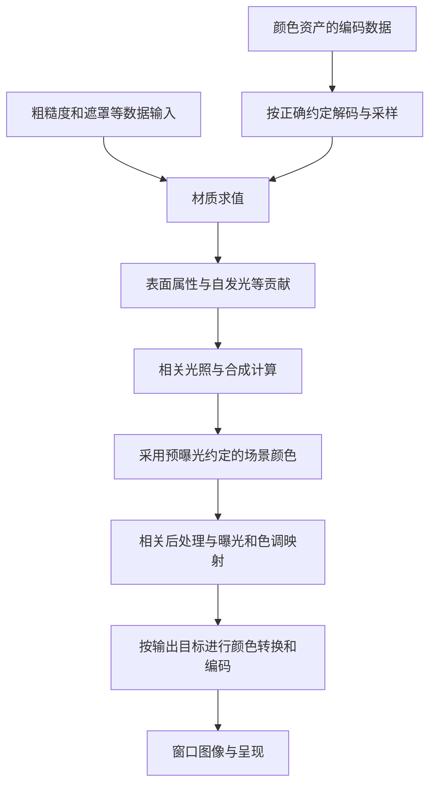
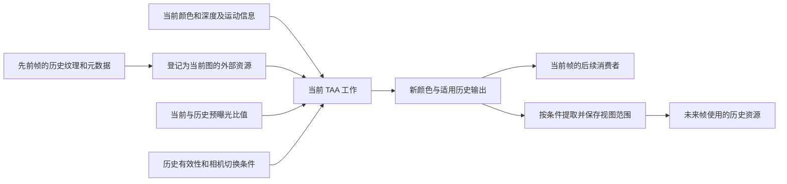

# 第 05 章：纹理、缓冲区、颜色空间与历史数据

[返回目录](../README.md) · [上一章：Shader、材质与光照](04-shaders-materials-lighting.md) · [本章答案](../appendices/answers/05-resources-color-history.md)

> 本章依据 UE 5.7.4，CL 51494982，Windows／D3D12／SM6 的教材配置 A。我们仍观察同一个红方块、金属球、薄片和摄像机。源码证据来自静态阅读；数学算例用于隔离概念；操作练习尚未运行验证。

## 5.1 学习目标与前置知识

前四章建立了从几何体到表面颜色的概念，但真正阅读渲染代码时，函数常常传递的是资源引用、格式和视图参数，而不是一个现成的 RGB 数组。本章要填上这个差距。

学完后，你应该能为一份渲染数据回答：保存的是什么、按什么格式解释、在哪个范围访问、谁产生它、谁消费它，以及它是否需要活到下一帧。

需要掌握第 01 章的像素与中间颜色、第 02 章的屏幕位置、第 03 章的深度与混合，以及第 04 章的 Shader 和材质输入。只需会计算比例与乘方；遇到资源 API 时不要求已经了解 D3D12 内存管理。

本章集中解决五个问题：

1. 同样是纹理，颜色、法线和深度为什么不能按同一规则读取？
2. 图像尺寸、像素格式、采样数和 Mip 层数怎样影响资源成本？
3. 为什么颜色平均要先确认是否处于线性空间？
4. 为什么相同的表面颜色，在不同帧的原始资源里可能数值不同？
5. 为什么当前帧不能盲目复用上一帧相同位置的像素？

## 5.2 先把“存储”“视图”“语义”分开

### 5.2.1 资源是一段按规则使用的数据

**资源（Resource）**是供 GPU 等处理路径读写的数据对象。常见种类有纹理和缓冲区。

**纹理（Texture）**按二维、三维、数组或立方体等维度组织数据，支持相关格式和采样访问。**缓冲区（Buffer）**通常按一段元素或字节数据组织，可用于顶点、索引、结构化记录和其他计算数据。

它们不是“图片”和“非图片”的简单二分：纹理可以保存不可直接显示的法线，缓冲区也可以保存与图像相关的统计信息。选择哪种资源涉及访问方式、格式、硬件功能和算法需求。

CPU 的 `float values[100]` 只是进程地址空间中的数组。GPU 资源还需要底层分配、可用访问形式以及正确的执行和同步条件。一个 C++ 引用存在，不表示 GPU 已经有有效内容可读。

### 5.2.2 资源视图决定怎样访问

这里的**资源视图（Resource View）**不是摄像机 View，而是资源的访问描述。常见缩写包括：

| 名称 | 英文全称 | 在本章中的作用 |
|---|---|---|
| SRV | Shader Resource View | 向 Shader 提供按规定方式读取资源的入口 |
| UAV | Unordered Access View | 为适用 Shader 提供可写资源访问；不自动消除读写冲突 |
| RTV | Render Target View | 将适用纹理作为颜色绘制目标的访问形式 |
| DSV | Depth Stencil View | 将适用资源作为深度／模板目标的访问形式 |

同一底层资源可能具有不同视图，例如只访问某个 Mip 或切片，或者按平台允许的兼容格式访问。它并不因此变成几份完全独立的原始数据。

更不能因为同一个资源能创建读视图和写视图，就在任何 Pass 中无条件同时读写相同位置。数据依赖、状态、读写范围和 API 限制仍然存在；第 09、10 章会解释 RDG 和 RHI 如何参与管理。

### 5.2.3 语义来自生产者和消费者

设某纹理在一个位置的三个分量是 `(0.5, 0.5, 1.0)`。它可能是蓝色，也可能是经过编码的法线方向，或者其他恰好有三个分量的数据。仅看数值无法决定其含义。

**语义（Semantics）**是算法赋予数据的意义：写入时怎样编码，读取时怎样解码，使用哪套坐标、单位和缩放。资源名有帮助，但不能替代生产者与消费者的实际代码。

对像素 P，基础颜色记录回答“方块表面具有什么颜色属性”；场景颜色记录回答“截至当前阶段已经形成了什么颜色贡献”；深度回答“这个可见表面按当前约定位于多深”。把其中一个解释成另一个，即使类型和分辨率完全相同，结论仍然错误。

## 5.3 一个纹理描述里都有什么

### 5.3.1 尺寸、格式、层与采样数

**像素格式（Pixel Format）**决定单个元素或压缩块怎样编码数据，例如每通道使用多少位、是整数还是浮点、是否有符号和是否包含 Alpha。

尺寸说明有多少元素；格式说明每份数据怎样解释。两者必须结合，不能只看到“720p”就算出所有内存。

还需区分：

- **Mip 层（Mip Level）**：同一纹理的不同分辨率层级，用于适当的尺度访问等用途。
- **数组切片（Array Slice）**：同一数组纹理中的不同图像，不是分辨率逐级缩小的关系。
- **多重采样（Multisampling）**：在同一像素范围保留多个样本；采样数增加不是把宽高同比增大。
- **使用标志（Usage Flags）**：说明资源需要支持 Shader 读取、渲染目标或 UAV 等用途。标志允许一种用途，并不证明已经执行过该用途。

**[源码已确认]** `FRDGTextureDesc::Create2D` 接收 `Size`、`Format`、`ClearValue`、`Flags`、`NumMips` 和 `NumSamples`，见 [RenderGraphDefinitions.h:628](G:/UnrealEngineInstalled/UE_5.7/Engine/Source/Runtime/RenderCore/Public/RenderGraphDefinitions.h:628)。函数返回描述，不等于已经向纹理绘制了一幅图像。

其中 **Clear Value（清除值）**描述清除时需要使用的值或相关约定；仍需结合具体清除与附件加载操作判断内容。不能仅看到一个黑色清除值，就断言每次读之前系统都自动清过一遍。

### 5.3.2 几种常见格式的差异

| 示例格式 | 先怎样理解 | 适合说明什么 | 不能怎样推断 |
|---|---|---|---|
| RGBA8 UNORM | 四个 8 位无符号归一化通道，常映射到 0～1 | 有限精度、常规颜色或属性存储 | 不保证其 RGB 已经是 sRGB 编码 |
| RGBA16F | 四个 16 位浮点通道 | 可以存储较宽范围颜色，基础数据为每像素 8 字节 | 不等于四个 32 位 `float`，精度与范围也不同 |
| R11G11B10F | RGB 分别用 11、11、10 位的无符号浮点格式 | 紧凑的正值 HDR 颜色存储，共 32 位 | 没有独立 Alpha，也不能无条件存储负数 |
| 深度／模板格式 | 为深度及可能的模板数据安排位数与访问 | 深度测试和模板测试 | 不等于可按普通四通道颜色任意解释 |
| 块压缩格式 | 一个小区域共享压缩编码 | 节约某些资产纹理的存储与带宽 | 不可直接用“一个像素几个普通字节”描述实际块访问 |

**UNORM（Unsigned Normalized，无符号归一化）**的一个 8 位通道可用整数 0～255 表示 256 个级别，Shader 读取的归一化值通常落在 0～1。**浮点（Floating Point）**使用指数和有效数字表达不同量级，其相邻可表示值间隔不是处处相同。

**[源码已确认]** 本机 D3D12 后端将 `PF_FloatRGBA` 映射到 `DXGI_FORMAT_R16G16B16A16_FLOAT`，`BlockBytes` 为 `8`；`PF_FloatR11G11B10` 对应 `DXGI_FORMAT_R11G11B10_FLOAT`，为 `4` 字节，见 [D3D12RHI.cpp:151](G:/UnrealEngineInstalled/UE_5.7/Engine/Source/Runtime/D3D12RHI/Private/D3D12RHI.cpp:151)。这些映射证明格式含义，不证明当前所有 Scene Color 或历史纹理都用了其中某个固定格式。

### 5.3.3 完整数值例：内存从哪里来

**[教学简化]** 假定有一张无压缩、单样本、无 Mip、无数组层的 RGBA16F 纹理，尺寸为 1280×720。先只计算基础像素数据：

```text
W = 1280 像素
H = 720 像素
B = 4 通道 × 16 位 / 8 = 8 字节/像素

Size = W × H × B
     = 1280 × 720 × 8
     = 7,372,800 字节
     = 7.03125 MiB
```

**MiB（Mebibyte）**使用 `1 MiB = 1,048,576` 字节；常见十进制 MB 使用一百万字节。报告内存时要写清单位，不能把 7.03 MiB 与 7.37 MB 当成矛盾。

如果只把宽高同时减半，基础数据量变成四分之一；如果都翻倍，则变成四倍。3840×2160 相对 1280×720 的像素数是九倍，不是三倍。

如果使用一条理想的完整二维 Mip 链，忽略末端取整，其数据量约为：

```text
1 + 1/4 + 1/16 + ... ≈ 4/3
```

所以 Mip 链不是每一层都再占一份完整原图。反过来，两张全尺寸历史纹理也不能按这个比例算，因为它们不是同一条递减分辨率链。

真实内存还涉及行与资源对齐、压缩、元数据、堆分配、临时复用和实际驻留。上面的 7.03 MiB 是可解释的基础数据量，不是显卡工具一定报告的最终分配字节数。

## 5.4 采样不只是“取数组里的那个数”

### 5.4.1 Texel 和 Pixel 的区别

**Texel（Texture Element，纹理元素）**是纹理网格里的元素。**Pixel（像素）**通常指当前图像网格中的位置。在渲染一个屏幕像素时，可能需要从多张不同大小的纹理读取多个 Texel。

一张 1024×1024 的材质纹理可以贴到远处只占几十个像素的表面上，也可以贴到铺满屏幕的近处地面上。因此“屏幕一个像素对应贴图一个 Texel”不是普遍成立的关系。

### 5.4.2 采样器提供访问规则

**采样器（Sampler）**描述过滤和寻址等规则。过滤决定周围元素如何参与结果；寻址决定坐标越过边界时如何处理，例如重复或夹紧。

**点采样（Point Sampling）**取选定的离散元素；**双线性过滤（Bilinear Filtering）**在一个二维层中按相对位置组合附近四个元素。**三线性过滤（Trilinear Filtering）**在相关情况下还会对相邻 Mip 层的结果进行插值。

这不是说任何读取都会自动过滤。Shader 可以使用按整数坐标直接访问的路径，也可以使用带采样器的采样路径；资源类型和 Shader 调用决定实际行为。

### 5.4.3 完整数值例：双线性过滤

取四个已经处于适合线性插值表示中的标量样本：左上 `0.1`、右上 `0.3`、左下 `0.5`、右下 `0.9`。目标在水平方向的比例为 `u=0.25`，竖直方向为 `v=0.6`。

这里 u、v 是这四个元素之间的局部插值比例，不是未加说明的整张纹理 UV。

```text
Top    = (1-u) × 0.1 + u × 0.3
       = 0.75 × 0.1 + 0.25 × 0.3 = 0.15

Bottom = (1-u) × 0.5 + u × 0.9
       = 0.75 × 0.5 + 0.25 × 0.9 = 0.60

Result = (1-v) × Top + v × Bottom
       = 0.4 × 0.15 + 0.6 × 0.60 = 0.42
```

该算例解释四个数据怎样合成一个结果，不是某种硬件的逐指令实现。法线方向过滤后可能还需要重归一化，深度层级可能需要最大值或最小值而非颜色平均，属性用途不同会改变处理。

### 5.4.4 为什么远处的地面需要较低分辨率信息

当屏幕一个采样区域覆盖了大量高频纹理变化，如果只取一个不稳定点，就可能出现闪烁、锯齿和随相机运动变化的条纹。这属于**混叠（Aliasing）**问题。

Mip 预先提供不同尺度的表示，让采样更接近当前覆盖范围。GPU 可以结合屏幕变化率等信息估计访问尺度；第 03 章的相邻片元导数由此与纹理读取联系起来。

但 Mip 不是通用的“模糊越多越好”。过粗的层级会损失细节，法线与遮罩的预处理也有特定需求。资产生成 Mip、纹理流送驻留哪些层、Shader 当次选择何种采样，是不同问题。

## 5.5 视口坐标与整张缓冲的坐标不是一回事

从第 02 章得到的屏幕位置，要读取某张场景纹理时，还需要确认它对应哪个矩形区域。

**Extent（资源尺寸）**是整张缓冲的宽高。**View Rect（视图矩形）**是当前视图在该缓冲中的有效范围，可以带偏移，也可以比资源本身小。

这在编辑器、多视图、分屏、内部尺寸对齐或动态分辨率中尤其重要。即便只研究一台摄像机，也不要把“场景缓冲有多大”和“我正在观察的区域有多大”写成同一个永远相等的变量。

**[教学简化]** 假定缓冲为 1600×900，当前视图起点为 `(160,90)`，大小为 1280×720。对视图归一化坐标 `(0.25,0.25)`：

```text
PixelInBuffer = ViewRectMin + ViewportUV × ViewSize
              = (160,90) + (0.25,0.25) × (1280,720)
              = (480,270)

BufferUV = PixelInBuffer / BufferSize
         = (480,270) / (1600,900)
         = (0.3,0.3)
```

向纹理直接传 `(0.25,0.25)` 会读到不同位置。这里使用连续坐标，实际按像素中心访问时还要采用对应的半像素与边界约定，不能凭空把这个例子变成所有采样 API 的最终整数公式。

**[源码已确认]** `Common.ush` 中 `SvPositionToViewportUV` 先减去 `ViewRectMin`；`ViewportUVToBufferUV` 先乘视图尺寸、再加矩形偏移、最后乘缓冲尺寸的倒数，见 [Common.ush:1627](G:/UnrealEngineInstalled/UE_5.7/Engine/Shaders/Private/Common.ush:1627) 和 [Common.ush:1641](G:/UnrealEngineInstalled/UE_5.7/Engine/Shaders/Private/Common.ush:1641)。立体相关宏还有单独的 ResolvedView 分支，本书不把普通单视图公式推广到所有视图模式。

对 P、Q 来说，观察目标没变，并不保证改了窗口大小后仍能在旧纹理坐标读到它。先确认视图矩形，再谈“这个像素是哪一个表面”。

## 5.6 颜色空间：为什么直接平均两个字节常常不对

### 5.6.1 颜色空间与传递函数是相关但不同的概念

一种 RGB 颜色空间会约定各分量对应的基色、白点等信息；**传递函数（Transfer Function）**说明线性量与编码量之间的映射。不能把所有颜色空间差异都缩成一句“Gamma 不同”。

本节固定普通 sRGB 相关的 SDR 例子，只研究编码与线性计算之间的转换，不扩展到所有 HDR 显示曲线和广色域转换。

**Gamma（伽马）**常被用来概括非线性编码关系，但准确的 sRGB 不是全范围一个 `pow(x,2.2)`。它在较暗段包含线性部分，其余使用另一段非线性关系。

设 `c_s` 是归一化的 sRGB 编码分量，`c_l` 是对应线性分量，限定在本节正常 0～1 范围：

```text
sRGB 解码到线性：
若 c_s <= 0.04045：c_l = c_s / 12.92
否则：             c_l = ((c_s + 0.055) / 1.055)^2.4

线性编码到 sRGB：
若 c_l <= 0.0031308：c_s = 12.92 × c_l
否则：              c_s = 1.055 × c_l^(1/2.4) - 0.055
```

这里小数是指定传递曲线的常数，不是从当前材质或灯光拟合出来的参数。CPU／Shader 的实现可能使用查表、近似和不同浮点精度，不保证每一末位都与直接手算相同。

### 5.6.2 完整数值例：黑白各占一半

**[教学简化]** 黑色线性值是 0，白色线性值是 1，以相等权重组合，得到线性 `0.5`。将它编码为 sRGB：

```text
c_s = 1.055 × 0.5^(1/2.4) - 0.055
    ≈ 0.735357

8位编码 ≈ round(0.735357 × 255) = 188
```

如果直接平均黑白的编码值，得到编码 `0.5`，约为字节 128；再解码到线性，则约为 `0.214`。这比需要的线性 `0.5` 暗很多。严格把整数 128 除以 255 再解码，会得到约 `0.21586`；这是量化差异，不改变结论。

这里讨论的是线性光量平均，不是人眼主观亮度平均，也不是把两个真实材质放在同一盏灯下后必然出现的截图。

### 5.6.3 数据纹理为什么通常不应做 sRGB 解码

若粗糙度、金属度或遮罩通道中保存的 `0.5` 是线性控制量，把它按 sRGB 解码就会变成约 `0.214`，等于改变了材质输入。

因此常见工作流将颜色纹理与数据纹理分开配置。法线贴图也不能当作普通彩色照片处理，因为它的通道表示的是方向编码。

另一方面，如果一张颜色资产确实以 sRGB 编码存储，却关闭了正确的解码，再把编码值当线性光量计算，也会出错。正确选择来自资产内容和采样解释，不是“开关开了更亮所以更好”。

**[源码已确认]** `UTexture` 的 `SRGB` 属性见 [Texture.h:1529](G:/UnrealEngineInstalled/UE_5.7/Engine/Source/Runtime/Engine/Classes/Engine/Texture.h:1529)，它参与纹理编码空间的设置。具体压缩、采样类型和视图还会影响后端使用，不能仅从该字段推出每种通道都一定做同一变换。

### 5.6.4 Alpha 不要跟着 RGB 无条件做同样转换

在简单覆盖混合中，Alpha 是一个权重，不是一个颜色基色分量。通常应保留其线性权重意义。

**[源码已确认]** `FLinearColor(const FColor&)` 对 RGB 查询 `sRGBToLinearTable`，但 Alpha 直接乘 `1/255`，见 [Color.h:781](G:/UnrealEngineInstalled/UE_5.7/Engine/Source/Runtime/Core/Public/Math/Color.h:781)。`ToFColorSRGB` 也把 RGB 的转换与 Alpha 的归一化量化分开，见 [Color.cpp:251](G:/UnrealEngineInstalled/UE_5.7/Engine/Source/Runtime/Core/Private/Math/Color.cpp:251)。

这解释了类型转换中的一个具体约定，不代表 `FColor` 在所有使用场合都自动带着正确颜色空间标签。`FColor` 只存通道数据，调用者仍需知道这些字节代表什么。

## 5.7 从材质纹理到显示输出，应该怎样画颜色路线

[打开颜色数据路线静态图](../assets/diagrams/05-resources-color-history-1.png)



**[教学简化]** 这张图强调表示关系，不规定预曝光只能在“全部光照之后”集中乘一次。真实代码会在不同写入路径应用相应缩放，保证组合时处于一致表示；不同后处理和输出路径也不保证都使用同一个 Gamma 辅助函数。

对 P，材质 Base Color 在路线前段，最终窗口颜色在末段。对 Q，透明薄片的 Emissive 输出参与自己的着色与合成位置，同样不能绕过后续曝光解释。

**[源码已确认]** `GammaCorrectionCommon.ush` 提供 `LinearToSrgb` 和 `sRGBToLinear` 的具体转换函数，见 [GammaCorrectionCommon.ush:16](G:/UnrealEngineInstalled/UE_5.7/Engine/Shaders/Private/GammaCorrectionCommon.ush:16)。其分支存在不是“每个桌面像素都调用这份函数”的证据；完整色调映射和输出路径在第 20 章按实际分支追踪。

## 5.8 预曝光：数值变了，场景不一定变了

### 5.8.1 为什么需要适合内部存储的量级

渲染需要表达非常暗的表面与强光等很不相同的量级。有限精度资源无法在任意范围内同时提供无限细的分辨能力。

**预曝光（Pre-Exposure）**可以先理解为对内部场景颜色进行一致的曝光相关缩放，使后续计算和存储落在更适合的数值范围。它是表示与计算约定的一部分，不能看成额外一盏真实灯。

记未采用该缩放的某项线性场景颜色为 `C_scene`，预曝光系数为正数 `E_pre`。简化表示关系为：

```text
C_stored = C_scene × E_pre
C_scene  = C_stored / E_pre
```

这两行不是完整 UE 曝光或色调映射公式，只用来解释同一颜色如何因存储尺度变化而改变原始数值。

### 5.8.2 一个表面数值改变的两种完全不同原因

若 `C_scene=100`，第一帧 `E_pre=0.01`，存储值为 `1`；下一帧仍是同一场景颜色，但 `E_pre=0.02`，存储值变成 `2`。

只比较 `1` 与 `2` 就说“灯光亮了一倍”，会把表示变化误判成场景变化。需要先把数值放到同一尺度，再比较真正关心的颜色量。

反过来，如果系数没有变而表面颜色改变，可能确实是照明、材质、遮挡或其他计算变化。预曝光不是解释一切颜色差异的借口。

### 5.8.3 不要把“上一帧曝光”背成所有路径的定律

**[源码已确认]** 本地 `FViewInfo::UpdatePreExposure` 从 [PostProcessEyeAdaptation.cpp:1383](G:/UnrealEngineInstalled/UE_5.7/Engine/Source/Runtime/Renderer/Private/PostProcess/PostProcessEyeAdaptation.cpp:1383) 开始，有视图状态、支持条件与覆盖值等分支。

其中手动曝光路径直接使用当前 `FixedExposure`，自动曝光路径可以读取先前获得的曝光结果，见 [同文件:1456](G:/UnrealEngineInstalled/UE_5.7/Engine/Source/Runtime/Renderer/Private/PostProcess/PostProcessEyeAdaptation.cpp:1456)。后续还组合颜色色调等因素，并将适用的预曝光信息保存到视图历史。

因此本书手动曝光配置不能被描述成“必然总用上一帧自动测光值”。理论模型帮助理解缩放，但具体怎样选择系数必须读取当前版本分支。

## 5.9 当前帧之外还有哪些数据

### 5.9.1 时间处理不是无条件平均两张图片

**历史资源（History Resources）**是某个系统从之前帧保留的结果，用于当前处理。TAA、TSR、一些反射和间接光照系统可能各自维护历史，不是所有系统共用一个万能“上一帧纹理”。

**重投影（Reprojection）**尝试找到当前可见表面在先前视图中的对应位置。它需要当前／历史观察关系，以及适用的运动信息等条件。

**Velocity（速度或运动信息缓冲）**服务于这种时间对应，但其编码与相机运动的结合方式需要看具体算法。不能直接把两个原始通道当成“世界中每秒移动了多少米”。

本章先采用一维屏幕位置的简化例子：某表面本帧投影在第 `104` 列，上一帧在第 `100` 列。若明确把运动定义为“当前位置减去先前位置”，那么运动量是 `+4` 像素，查询历史时应访问 `104-4=100`，而不是上一帧同样的 `104`。

这是我们选择的算例约定，不是宣称 UE Velocity 纹理原始值始终是这个带符号整数。第 19 章会核对编码、解码和视图变换。

### 5.9.2 为什么历史可能没有可用对应

相机移动后，方块旁边可能露出之前被遮住的地面。这叫**去遮挡或新显露区域（Disocclusion）**：过去没有看到的表面，当前才变得可见。

在这个位置硬找一个旧颜色并加大权重，会把方块颜色拖到新露出的地面上，形成**拖影（Ghosting）**。即便运动向量看起来合理，还需要判断几何、颜色或其他一致性。

相机切换、首次渲染、历史尺寸与布局变化等也可能要求重置或重新解释历史。不同算法的判断条件并不完全相同。

### 5.9.3 完整数值例：先对齐曝光，再做历史组合

假定历史存储颜色是 `H_old=1`，当时预曝光为 `E_old=0.01`；当前预曝光为 `E_new=0.02`。先把历史改写到当前尺度：

```text
H_corrected = H_old × E_new / E_old
            = 1 × 0.02 / 0.01
            = 2
```

再假定通过了其他有效性判定，当前颜色为 `C_current=2.4`，历史权重 `w=0.8`：

```text
C_result = w × H_corrected + (1-w) × C_current
         = 0.8 × 2 + 0.2 × 2.4
         = 2.08
```

若漏掉曝光校正，则得到 `0.8×1+0.2×2.4=1.28`。错误不在物体突然变暗，而在混用了两把不同刻度的尺子。

**[教学简化]** 这里的 `w=0.8` 是我们指定的权重，不是 UE TAA 的固定默认值。实际 TAA 还包含采样、重投影、过滤、历史约束和不同质量分支，不能用这一条平均式代替其完整实现。

## 5.10 源码实读：TAA 历史怎样跨过帧边界

这一次我们沿同一函数看输入、创建、参数、输出和保留，不只列出一个“有历史”的函数名。

### 5.10.1 输入区分当前结果与先前历史

**[源码已确认]** `AddTemporalAAPass` 接收 `GraphBuilder`、`View`、`Inputs`、`InputHistory` 和 `OutputHistory`，见 [TemporalAA.cpp:571](G:/UnrealEngineInstalled/UE_5.7/Engine/Source/Runtime/Renderer/Private/PostProcess/TemporalAA.cpp:571)。

`Inputs` 描述当前需要处理的结果与区域；`InputHistory` 提供先前保留的信息；`OutputHistory` 用于登记后续需要保存的结果。三个角色不同，不能把变量名里的 History 看成当前场景颜色的别名。

在 [同文件:590](G:/UnrealEngineInstalled/UE_5.7/Engine/Source/Runtime/Renderer/Private/PostProcess/TemporalAA.cpp:590)，代码把历史无效、`View.bCameraCut` 和该处不支持的数组历史情况纳入相机切换分支判断。这是本条 TAA 路径的真实条件，不是所有时间算法的完整失效列表。

### 5.10.2 创建新资源，并登记旧资源的访问

后续首先选择历史格式，再用 `FRDGTextureDesc::Create2D` 描述新输出。默认局部选择是 `PF_FloatRGBA`；符合特定质量、Alpha 和控制变量条件时可使用 `PF_FloatR11G11B10`，见 [同文件:612](G:/UnrealEngineInstalled/UE_5.7/Engine/Source/Runtime/Renderer/Private/PostProcess/TemporalAA.cpp:612)。

代码按计算或像素绘制路径决定是否加入 UAV 或 RenderTargetable 使用标志。这表明“同一算法的输出颜色”不保证总以同一种 API 使用方式生成。

有效旧历史通过 `GraphBuilder.RegisterExternalTexture` 登记到当前图，见 [同文件:797](G:/UnrealEngineInstalled/UE_5.7/Engine/Source/Runtime/Renderer/Private/PostProcess/TemporalAA.cpp:797)。**External（外部）**在这里指相对于当前图已经由外部生命周期持有的资源，不是网络纹理或外接显卡资源。

### 5.10.3 CPU 参数与 Shader 消费相接

在 [同文件:818](G:/UnrealEngineInstalled/UE_5.7/Engine/Source/Runtime/Renderer/Private/PostProcess/TemporalAA.cpp:818)，CPU 侧写入：

```cpp
// [源码已确认] 省略同一参数块的其他字段。
PassParameters->HistoryPreExposureCorrection =
    View.PreExposure / View.PrevViewInfo.SceneColorPreExposure;
```

分子是当前预曝光，分母是对应历史的场景颜色预曝光。这个方向与上一节“将旧存储值转换到当前尺度”的推导一致，不能随意把比值取反。

在 [TemporalAA.usf:1909](G:/UnrealEngineInstalled/UE_5.7/Engine/Shaders/Private/TemporalAA.usf:1909)，支持 HLSL2021 的分支调用 `CorrectExposure`，其他分支直接把历史 RGB 乘以该系数。辅助函数中的同一乘法见 [同文件:581](G:/UnrealEngineInstalled/UE_5.7/Engine/Shaders/Private/TemporalAA.usf:581)。它们在复杂的历史采样与重建上下文内，这里用于确认系数意义，不代表整个 Shader 只有这项运算。

### 5.10.4 资源怎样留给以后使用

[打开历史资源跨帧静态图](../assets/diagrams/05-resources-color-history-2.png)

完成 Pass 组织后，在可写历史的条件下，代码对适用新纹理调用 `GraphBuilder.QueueTextureExtraction`，保存到 `OutputHistory->RT[i]`，并记录输出矩形和参考缓冲大小，见 [TemporalAA.cpp:980](G:/UnrealEngineInstalled/UE_5.7/Engine/Source/Runtime/Renderer/Private/PostProcess/TemporalAA.cpp:980)。

**Extraction（提取）**将相应结果交给图外持有者，以便之后继续使用；它不是把整张图下载到 CPU，也不是立即写入磁盘图片。

记录矩形与尺寸是必要的：即使纹理引用还有效，也需要知道历史里哪部分属于本视图，以及按什么范围寻找对应。失去这些条件，引用存在也不代表读到的就是正确历史。



**[教学简化]** 图中“先前帧”与“未来帧”是不同批次的数据，图并未表示当前帧可以从自己的未来读取结果。没有画出所有中间目标、质量分支和 GPU 同步，实际执行由 RDG 等系统组织。

## 5.11 回到 P 和 Q：资源相同，含义也可能变化

### P：从属性到颜色，再到带历史的结果

P 的 Base Color 属于材质属性，不能因为存放在纹理中就执行显示颜色的曝光。P 的场景颜色则参与光照与后续处理，并可能采用预曝光表示。

读取上一帧 P 附近颜色时，需要知道它是否仍对应方块表面、相机是否移动、该结果采用什么曝光尺度，以及视图矩形怎样映射。单凭坐标一致或都是 RGBA 格式无法保证可比较。

### Q：不透明背景与透明贡献可能具有不同历史问题

Q 的主不透明深度和 GBuffer 对应背景方块，薄片自己的颜色之后参与合成。如果薄片移动而背景不动，简单使用背景运动信息去解释全部最终颜色就可能不充分。

这也是透明渲染需要考虑专门的运动、合成位置和响应设置的原因。第 18、19 章会按具体路径分析；本章不因为使用了一层简单薄片，就声称一般透明历史问题已经解决。

### 为什么主缓冲可视化不是一个万能诊断答案

查看 Base Color 可以帮助确认属性，却不能证明反射正常；查看 Scene Depth 可以帮助理解主不透明遮挡，却不能单独解释光源阴影；查看某张历史纹理也不能证明它已经按正确区域、尺度和权重被消费。

每次观察都应先写下问题，再选资源。要确认“方块为什么变暗”，首先区分属性改变、光照改变、曝光改变和错误历史，避免对着一张不相关的图得出结论。

## 5.12 成本、优化方向与常见误区

### 5.12.1 带宽可以先做一个量级估算

**带宽（Bandwidth）**在这里指单位时间内可以传输的数据量。假定每帧完整读一遍并写一遍前面的 1280×720 RGBA16F 纹理，以每秒 60 帧处理，逻辑数据量为：

```text
7,372,800 字节 × 2 × 60
= 884,736,000 字节/秒
≈ 0.885 GB/s
```

这是单个简化操作的理论数据量，不是实际显存总线测量。缓存命中、压缩、访问方式、中间数据、多个读源与硬件执行会改变实际成本。

也不要据此认为“GPU 标称几百 GB/s，所以这个 Pass 一定很快”。实际工作还可能受计算、同步、缓存、访问局部性和队列竞争限制。

### 5.12.2 减少像素与降低格式各有什么代价

降低分辨率能减少不少逐像素工作，但可能损失细节或增加重建要求；使用更紧凑格式能减少一部分存储与访问，但可能失去 Alpha、负值、精度或其他必要属性。

去掉历史资源可能降低持续内存，却会改变时序稳定性或算法成立条件；无条件保留所有历史，则浪费内存并可能延长资源生命周期。

优化应先确认资源用途，再研究是否可以缩小、减少、复用或重建。不是看到一张大纹理就删除它，也不是“浮点精度更高”就总是值得。

### 5.12.3 七个需要避免的推论

| 错误推论 | 应该补问什么 |
|---|---|
| 纹理看起来是彩色，所以就是最终颜色 | 它是不是法线、属性或调试映射？ |
| 都是 float4，所以可以直接相加 | 坐标、单位、颜色空间、曝光尺度与 Alpha 语义是否一致？ |
| 输出分辨率没变，所有资源成本就没变 | 内部比例、格式、Mip、样本和历史保留是否改变？ |
| 已创建纹理，所以内容已经有效 | 哪个 Pass 写入，读之前的依赖是否满足？ |
| 历史引用还在，所以它仍可用 | 视图、尺寸、曝光和表面对应是否有效？ |
| Unlit 不受灯光，所以它不受曝光 | 当前 Shader 与输出路径怎样处理自发光？ |
| GPU 原始颜色翻倍，所以实际照明翻倍 | 存储尺度、预曝光与后续映射是否相同？ |

## 5.13 观察练习：一次只改变一个解释条件

> **[尚未验证]** 按 [配置附录](../appendices/configuration.md)建立场景。固定数值比较以 Standalone 为准；使用编辑器缓冲可视化时另行记录视图与曝光条件。本章不提供伪造抓帧或显存测量。

### 练习 A：属性纹理与显示图像

在固定相机下，分别观察 Lit、Base Color、World Normal 和 Scene Depth。先写下每种视图应该回答的问题，再旋转方向光一次并恢复。

预期光照改变对最终受光图像有影响，但不会因此改写模型的基础颜色常量或几何位置。可视化本身可能使用特定显示转换，因此比较的是资源语义，不是要求显示字节完全不变。

若全部视图变化巨大，先检查相机、窗口尺寸和自动曝光是否也变了；若 Lit 完全不变，先确认观察模式和灯光是否影响对象。

### 练习 B：给数据选择正确的颜色解释

本书提供 [固定灰度数据图](../assets/textures/linear-mask-128.png)：64×64，每个像素的 RGB 字节都为 128，Alpha 为 255。它是按已知数值生成的教学输入，不是 UE 运行截图。将它导入自己的工程并复制为两个纹理资产，Virtual Texture Streaming 关闭；Compression Settings 选择本版显示名 **Uncompressed (RGBA8)**，保留普通颜色纹理组。这个小图采用无压缩是为了隔离编码问题，不是建议给整个游戏都使用无压缩资产。

一份关闭 sRGB，对应 Texture Sample 的 Sampler Type 选 **Linear Color**；另一份开启 sRGB，对应类型选 **Color**。在两个其他设置相同的材质副本里，分别取纹理 **R 通道**连接 Roughness，先确认两份材质均编译成功，再比较高光分布。不要取 Alpha，因为它不采用同样的 RGB sRGB 解码；也不要保持 Masks 采样器后强开 sRGB，这种组合可能直接被编译检查拒绝。

按本节语义，原始 R 数据约为 `128/255=0.50196`，错误地当作 sRGB 颜色解码后约为 `0.21586`，因此粗糙度改变。预期观察是高光分布差异，不是要求屏幕拾色得到这两个数。完成后恢复基础材质。实际导入、编译与画面仍属于尚未运行验证的步骤。

**[源码已确认]** 本版无压缩设置显示名见 [TextureDefines.h:400](G:/UnrealEngineInstalled/UE_5.7/Engine/Source/Runtime/Engine/Classes/Engine/TextureDefines.h:400)；颜色／线性颜色采样类型选择见 [MaterialExpressions.cpp:2483](G:/UnrealEngineInstalled/UE_5.7/Engine/Source/Runtime/Engine/Private/Materials/MaterialExpressions.cpp:2483)，Masks／Normal 与 sRGB 的不兼容检查见 [同文件:2736](G:/UnrealEngineInstalled/UE_5.7/Engine/Source/Runtime/Engine/Private/Materials/MaterialExpressions.cpp:2736)。

### 练习 C：内部比例与窗口尺寸

保持窗口 1280×720，记录 100% 屏幕比例，然后临时改为 50%，再恢复。先观察细节与边缘稳定性，再记录实际可获得的场景尺寸信息。

不要因为窗口仍是 720p 就判断内部颜色目标没有变化。不同效果有各自尺寸与重建路径；只凭肉眼图像不能算出实际显存峰值，也不能把所有 Pass 成本一概除以四。

### 练习 D：历史不是当前表面的永久副本

固定物体，缓慢移动相机，让方块边缘后面的地面显露出来。观察新显露区域与稳定区域的差别，再将相机切到一个明显不同的位置。

预期时间处理需要处理失去对应或历史失效的问题。是否出现可见拖影和持续多久取决于当前算法、参数、材质和硬件；没有拖影不表示没有历史处理，出现拖影也不自动证明速度缓冲缺失。

每组记录修改前后的相机、画质、分辨率、参数和观察位置。恢复基础配置后，再进入下一组。

## 5.14 本章源码阅读地图

下列路径均为本地核对入口。每一行只证明所列事项，不宣称完成了该模块的全部行为验证。

| 入口 | 已核对的关键内容 | 应顺着读什么 |
|---|---|---|
| [RenderGraphDefinitions.h:628](G:/UnrealEngineInstalled/UE_5.7/Engine/Source/Runtime/RenderCore/Public/RenderGraphDefinitions.h:628) | 二维纹理描述参数 | 尺寸、格式、Flags、Mip、样本数怎样传给描述对象 |
| [SceneTextures.h:51](G:/UnrealEngineInstalled/UE_5.7/Engine/Source/Runtime/Renderer/Internal/SceneTextures.h:51) | 场景颜色、深度、模板及派生场景资源的不同成员 | 主资源与可选资源，不把注释当“创建即完成光照” |
| [SceneTextures.cpp:480](G:/UnrealEngineInstalled/UE_5.7/Engine/Source/Runtime/Renderer/Private/SceneTextures.cpp:480) | 深度与场景颜色按配置建立 | `Desc`、样本、清除值及目标创建的联系 |
| [D3D12RHI.cpp:151](G:/UnrealEngineInstalled/UE_5.7/Engine/Source/Runtime/D3D12RHI/Private/D3D12RHI.cpp:151) | UE 格式到 D3D12 格式的映射 | `PF_FloatRGBA` 与紧凑 RGB 的字节量差异 |
| [Common.ush:1627](G:/UnrealEngineInstalled/UE_5.7/Engine/Shaders/Private/Common.ush:1627) | 视口和缓冲 UV 转换 | `ViewRectMin`、视图尺寸和缓冲尺寸分别参与哪一步 |
| [Color.h:781](G:/UnrealEngineInstalled/UE_5.7/Engine/Source/Runtime/Core/Public/Math/Color.h:781) | RGB 查表解码与 Alpha 线性归一化 | 类型转换所选择的颜色约定 |
| [GammaCorrectionCommon.ush:16](G:/UnrealEngineInstalled/UE_5.7/Engine/Shaders/Private/GammaCorrectionCommon.ush:16) | Shader sRGB 转换辅助函数 | 分段与分支，不假定所有输出统一调用 |
| [PostProcessEyeAdaptation.cpp:1383](G:/UnrealEngineInstalled/UE_5.7/Engine/Source/Runtime/Renderer/Private/PostProcess/PostProcessEyeAdaptation.cpp:1383) | 预曝光的条件与更新 | 手动、自动、覆盖与视图状态区别 |
| [TemporalAA.cpp:571](G:/UnrealEngineInstalled/UE_5.7/Engine/Source/Runtime/Renderer/Private/PostProcess/TemporalAA.cpp:571) | 历史输入、创建、参数与输出提取 | 按 5.10 节从 CPU 参数继续到 Shader 消费 |
| [TemporalAA.usf:1913](G:/UnrealEngineInstalled/UE_5.7/Engine/Shaders/Private/TemporalAA.usf:1913) | 对历史颜色应用预曝光校正 | 读取上下文，避免把乘法行当作完整 TAA |

资源生命周期的设计说明可补读 [RDG 官方资料及适用限制](../appendices/references.md#doc-rdg)。第 09 章将系统拆解创建、依赖、屏障和提取，第 19 章再完整追踪 TAA／TSR。

## 5.15 概念回顾

资源类型、访问视图、像素格式和算法语义是不同层次。把一个名字或 `float4` 类型当成完整数据说明，是很多错误推理的起点。

内存估算需要尺寸和格式，实际成本还需要访问次数、生命周期与运行条件；过滤需要知道数据表达和尺度，颜色运算则需要先对齐线性与编码空间。

历史资源让算法跨帧使用信息，也带来了位置对应、曝光尺度与失效处理。一个历史引用存在，不代表内容仍然对应当前表面。对 P、Q 的观察，需要贯穿同一套数据解释条件。

## 5.16 理解检查

1. 一张 640×360、单样本、单层、无压缩的 RGBA16F 纹理，其基础像素数据有多少字节、多少 MiB？为什么这个结果不一定等于 GPU 工具报告的最终分配量？
2. 已知一个控制纹理中的归一化数值 `0.5` 表示粗糙度，为什么不能为了让预览更顺眼而随意打开 sRGB 解码？它与一张确实采用 sRGB 编码的 Base Color 纹理有什么区别？
3. 已知缓冲为 2000×1000，视图起点 `(200,100)`，视图大小 1000×500。视口 UV `(0.4,0.6)` 对应什么 Buffer UV？明确使用的是本章连续坐标简化。
4. 历史存储颜色为 `3`，历史预曝光 `0.03`，当前预曝光 `0.02`，当前颜色为 `2.5`。若历史有效且假定权重为 `0.6`，正确组合结果是多少？
5. TAA 代码登记外部历史纹理后，为什么还需要保存视图矩形、检查历史有效性并做曝光校正？`QueueTextureExtraction` 是否表示把颜色下载到 CPU？

参考答案见 [第 05 章答案](../appendices/answers/05-resources-color-history.md)。下一章进入引擎架构：Actor 和 Component 怎样把稳定、可更新的数据交给渲染侧，而不是让 GPU 直接读取游戏对象。
