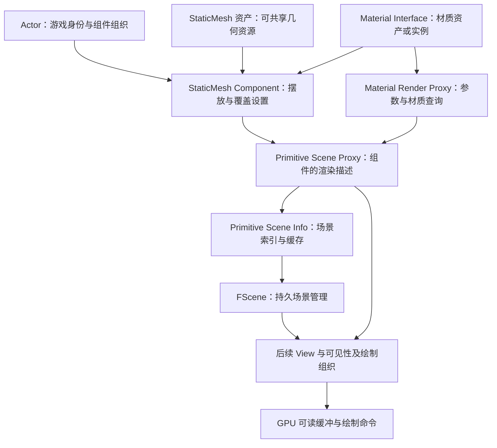
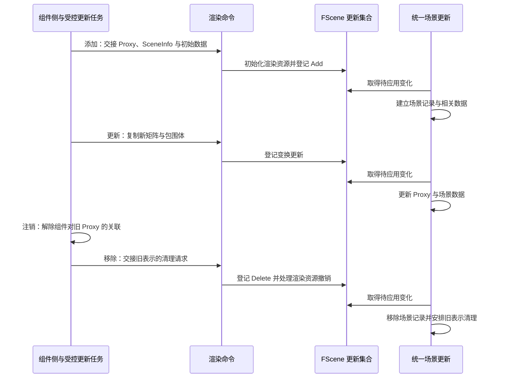

# 第 06 章：Actor、Component 与渲染场景表示

[返回目录](../README.md) · [上一章：资源、颜色与历史](05-resources-color-history.md) · [本章答案](../appendices/answers/06-scene-representation.md)

> **适用基线：**UE 5.7.4，Changelist 51494982，Windows／D3D12／SM6，桌面传统延迟渲染，配置 A。复用地面、红方块、金属球、透明薄片、方向光、点光和相机。设置见[配置附录](../appendices/configuration.md)。
>
> **证据范围：**本章已静态核对本机引擎源码，未启动项目、设置运行断点或测量时间。源码事实标为 **[源码已确认]**，为讲解建立的模型与数字标为 **[教学简化]**，操作和预期标为 **[尚未验证]**。源码函数名表示定位入口，不把跨线程路线当作一条同步调用栈。

## 6.1 学习目标与前置知识

前五章已经解释了点怎样投影、三角形怎样覆盖屏幕、材质怎样响应光，以及结果怎样存进资源。本章换一个问题：游戏代码修改了红方块的位置，渲染器怎么知道？为什么不能在顶点 Shader 里直接读取方块 Actor？

学完后，你应能说明 Actor、Component、Scene Proxy、Scene Info、Scene 的分工；沿注册、更新与注销追踪同一物体；分清游戏对象存活、渲染侧成员关系和 GPU 资源存活；判断一项修改应该增量传递还是重建表示；解释一个 Actor 为什么不等于一个 Draw Call。

需要理解对象、指针、继承、函数调用和数组。第 02 章的世界变换与第 05 章的资源生命周期是前置。这里不要求先掌握任务系统；遇到“排入渲染命令”，先理解为登记一项由后续渲染侧执行的工作，第 08 章再展开调度。

本章持续区分两个位置：P 是不被蓝片覆盖的红方块位置，Q 是蓝片覆盖方块的位置。它们是屏幕观察标签，不是 Actor 或 Component 的编号。

## 6.2 游戏对象的组织，为什么不是渲染器的任务表

### 6.2.1 Actor 是游戏世界中的组织单位

**Actor** 是能存在于关卡中的游戏对象类型，可组织组件、参与游戏逻辑、接收事件，也可能涉及网络复制。一个 Actor 可以代表方块、灯、摄像机、触发器或只负责控制流程的管理对象。

这些用途不都包含可画的表面。一个只保存任务进度的 Actor 没有必要产生三角形；一个角色 Actor 却可能同时具有身体、装备、武器、特效和灯光等组件。把 Actor 列表直接当作绘制列表，会同时漏掉多组件情况和无几何情况。

Actor 的位置通常通过它的**根组件（Root Component）**表达。**[源码已确认]** `AActor::GetActorTransform` 读取根组件的变换；相应模板在没有根组件时返回单位变换。Actor 的游戏身份与根组件的空间变换因此有关联，但不是同一份职责。

**组件（Component）**把功能附着到 Actor。例如静态网格组件提供几何摆放，光源组件提供照明，相机组件提供观察条件。一个 Actor 也可以有不带空间位置的逻辑组件。

### 6.2.2 从通用组件逐层增加能力

| 类型 | 增加的主要能力 | 不能据此推断的事 |
|---|---|---|
| `UActorComponent` | 通用组件生命周期、注册与更新等接口 | 每个组件都能画三角形 |
| `USceneComponent` | 变换、附着父子关系等空间能力 | 只要有位置就会成为可见网格 |
| `UPrimitiveComponent` | 可参与几何呈现及相关场景处理的基础接口 | 一个 primitive 就是一只三角形 |
| `UMeshComponent` | 网格材质槽等共用能力 | 材质槽数量就是整帧绘制次数 |
| `UStaticMeshComponent` | 引用静态网格资产并提供实例摆放和设置 | 网格名称含 Static 就不能移动 |

**[源码已确认]** 本地类声明对应上述继承关系。`UActorComponent::ShouldCreateRenderState` 基类实现返回 false，说明“拥有组件生命周期接口”与“需要创建渲染状态”是两件事。

本章的 **Primitive** 指渲染场景管理中的一个几何对象单位，不是第 03 章图形 API 中“三角形图元”的唯一含义。一个红方块组件对应的 primitive 可以包含多个三角形、多个材质分段和多个细节级别。

光源组件也不能硬塞进这一条网格继承路线。方向光与点光通过自己的灯光代理进入场景；Camera 提供视图参数，不能仅因编辑器画出了相机图标，就认为游戏画面必须绘制一份“相机模型”。编辑器辅助图形另有自己的呈现需求。

### 6.2.3 资产、组件实例与附着关系分别存什么

**资产（Asset）**是可被引用的内容数据。例如 `UStaticMesh` 保存静态网格资源及其相关描述，`UStaticMeshComponent` 引用它并说明这一次摆放的变换、材质覆盖、可见性与阴影设置。

在关卡里放两个相同 Cube，可以共享同一网格资产，但具有不同组件位置、不同材质实例和不同可见性。共享资产有利于复用几何资源，不自动把两个组件变为一次绘制。也不意味着修改一个组件的变换会移动另一个。

**附着（Attachment）**决定子组件如何跟随父组件。常见情形下，子组件的相对变换要与父组件世界变换组合，得到子组件世界变换；Socket、绝对位置／旋转／缩放设置等会进一步影响规则。本章数值例使用普通相对附着，没有这些额外条件。

必须把“谁拥有组件”与“组件附着到谁”分开理解。前者涉及对象组织和生命周期，后者涉及空间关系。一个 Actor 的根节点下面放了三份网格，组件树很整齐，但渲染器仍需分别判断这些几何的范围、材质和适用阶段。

## 6.3 从游戏表示到渲染表示：为什么需要代理

### 6.3.1 直接读取游戏对象会有什么问题

假设渲染线程正在计算方块的绘制数据，游戏线程同时把方块材质从 A 改成 B，并调整它的位置。如果渲染线程随时读取组件的成员，可能先读到旧位置，后读到新材质，又在另一处读到已经被替换的数组。

问题不仅是“值晚一帧”。无同步的并发访问可能造成数据竞争；数组重新分配可能使旧地址失效；对象开始销毁后，指针还可能指向已不再可访问的内存。把一个指针传过去，并没有解决这些问题。

**渲染代理（Scene Proxy）**保存适合渲染侧使用的组件表示。`FPrimitiveSceneProxy` 是几何代理基类，普通非 Nanite 静态网格使用 `FStaticMeshSceneProxy`。它包含或引用绘制所需的变换、包围体、材质相关性和几何资源等信息，不负责运行 Actor 的整个游戏行为。

**[源码已确认]** `FPrimitiveSceneProxy` 的类注释说明它镜像并行渲染 `UPrimitiveComponent` 所需的数据；`GetDynamicMeshElements` 的约定要求把游戏线程状态镜像到代理，避免在渲染线程解引用 UObject 的可变属性。该函数还要求收集描述时不要任意修改代理，所引用内存必须至少与收集器一样长寿。

这里的“镜像”不等于把整个 UObject 深拷贝，也不等于把整个网格缓冲复制一遍。代理可以引用受控共享资源。关键是值在哪里更新、谁能读取、资源何时释放，而不是一律禁止出现任何指针。

### 6.3.2 Scene Proxy、Scene Info、Scene 的分工

| 表示 | 本章对应类型 | 负责回答的问题 |
|---|---|---|
| 游戏组件 | `UStaticMeshComponent` | 游戏里这个方块使用什么资产、放在哪里、应如何修改？ |
| 组件的渲染代理 | `FStaticMeshSceneProxy` | 该几何有哪些渲染属性，怎样提供网格描述？ |
| 场景内部记录 | `FPrimitiveSceneInfo` | 它在渲染场景的索引、缓存、关联关系与管理状态是什么？ |
| 渲染场景 | `FScene` | 当前场景有哪些几何、灯光、空间结构和持久更新数据？ |
| GPU 数据 | 变换、实例数据、顶点与索引等缓冲 | Shader 和绘制命令按什么布局读取所需数值？ |

**场景信息（Scene Info）**是渲染器管理一个 primitive 所需的内部记录。它与该 primitive 的 Scene Proxy 不是前后两份图像。**[源码已确认]** `FPrimitiveSceneInfo` 的注释说明它与 `FPrimitiveSceneProxy` 一一对应；它保存 Proxy、组件标识、场景引用、索引及绘制相关缓存等。

`FPrimitiveSceneProxy` 主要定义在 Engine 模块，`FPrimitiveSceneInfo` 的实现属于 Renderer 模块。这让具体组件提供渲染描述，同时让场景管理结构留在渲染器中。无需把 Renderer 的所有内部数组塞回每个游戏组件。

**[源码已确认]** `UWorld` 保存 `FSceneInterface* Scene`，`FScene` 继承 `FSceneInterface`。游戏侧通过接口提交添加、移除和更新；渲染器负责维护具体数据。`FScene` 既有接收游戏侧请求的入口，也有渲染侧处理函数，不能简单说“任何 FScene 成员函数都只在渲染线程调用”。

一个世界也不是一张屏幕纹理。编辑器世界、PIE 世界和预览场景可能不同；一个渲染场景又可以供多个视图观察。主相机变动通常不要求把全部组件销毁重建。第 07 章将解释持久的 Scene 与每次观察的 View 如何相接。

### 6.3.3 不要把三个编号当成永久 Actor 身份

本地 `FPrimitiveSceneInfo` 至少有三类不同标识：

- `PrimitiveComponentId` 对应组件身份，源码说明其在组件生命周期内保持不变，可跨组件重新注册识别同一组件。
- `PackedIndex` 用于访问场景紧凑数组；加入或移除其他 primitive 后可能变化，不能长期保存为对象身份。
- `PersistentIndex` 在该 primitive 的场景驻留期间稳定，即这次 Proxy／SceneInfo 从 Add 到 Remove 之间；源码明确它还不是跨组件所有重建都永远不变的编号。

一个组件重建代理后仍可以是同一个游戏组件，但已经不是同一个 Proxy 生命周期。P、Q 的屏幕坐标更不属于这些标识。追踪问题时，应先决定要追的是组件身份、当前渲染表示，还是某一帧的像素。

[打开场景表示静态图](../assets/diagrams/06-scene-representation-1.png)



此图是 **[教学简化]** 的职责和数据关系，不是内存中必须逐一包含的对象布局。GPU 使用最后组织出来的资源与命令，不运行 Actor 或 Scene Proxy 的 C++ 方法。

## 6.4 注册：红方块如何成为场景成员

### 6.4.1 创建对象、注册组件、创建渲染状态是不同事件

**注册（Registration）**把组件接入世界及相关系统。创建一个 UObject、把它加入 Actor 的组件组织、给它设置网格，并不自动保证它已经完成注册和渲染侧加入。编辑器与 Actor 的标准创建流程可以代办这些步骤，运行时手动创建组件则应正确使用相应接口。

**渲染状态（Render State）**在这里指组件与渲染侧表示建立关联后的状态，不是 PSO 中的深度测试开关，也不是第 05 章纹理的资源访问状态。

**[源码已确认]** `RegisterComponentWithWorld` 检查组件与世界是否有效、是否重复注册等条件，设置世界引用后进入 `ExecuteRegisterEvents`。后者先执行 `OnRegister`，再检查应用能否渲染、世界是否有 Scene，以及 `ShouldCreateRenderState`，满足后才调用 `CreateRenderState_Concurrent`。物理状态创建另有步骤，不能把物理注册当作已经进入绘制的证据。

基类的 `bRenderStateCreated` 反映组件这一侧的状态。派生类调用基类之后，可能因场景条件或缺少有效代理而没有产生可绘制几何。因此看到该标志为 true，也不能断言这个对象本帧一定出现在 P。

### 6.4.2 沿本版本的八个连接点阅读

**[源码已确认]** 对配置 A 的有效非 Nanite 静态网格，主干连接如下；各步中的批处理和条件不是可省略的运行事实。

1. `UPrimitiveComponent::CreateRenderState_Concurrent` 调用基类，再 `UpdateBounds`，更新供场景管理使用的包围体。
2. `ShouldComponentAddToScene` 判断细节等级、可见用途及其他条件。隐藏但投影阴影等特殊用途可能仍需要加入，不能把条件缩成“屏幕可见才注册”。
3. 有 `FRegisterComponentContext` 时先 `Context->AddPrimitive`；没有时通过 `GetWorld()->Scene->AddPrimitive(this)` 进入普通单项入口。注册上下文可以收集一批组件再提交。
4. `FScene::AddPrimitive` 进入 `BatchAddPrimitivesInternal`。批量重新注册上下文可能另行接管添加／移除，因此 `bBulkReregister` 分支会提前返回。
5. 通过组件接口调用具体 `CreateSceneProxy`。静态网格进入 `FStaticMeshComponentHelper::CreateSceneProxy`，配置 A 对应普通 `FStaticMeshSceneProxy` 创建分支。
6. 若代理有效，分配 `FPrimitiveSceneInfo`，把它关联到代理；收集当前矩阵、世界与局部包围体、附着根位置及适用的先前变换，形成待交接的创建数据。
7. `ENQUEUE_RENDER_COMMAND(AddPrimitiveCommand)` 将这批数据移入命令。命令执行时按顺序调用 Proxy 的 `SetTransform`、`CreateRenderThreadResources`，然后进入 `AddPrimitiveSceneInfo_RenderThread`。
8. 最后这个名字带 Add 的函数先调用 `PrimitiveUpdates.EnqueueAdd`。后续 `FScene::Update` 才统一组织场景增删、变换、绘制缓存和 GPU Scene 等相关更新。

读到第 7 步不能说“已经画出了方块”，读到第 8 步也不能说“GPU 已经完成场景更新”。这里主要是在建立可供后续渲染使用的表示和工作。

### 6.4.3 CreateSceneProxy 为什么允许返回空

**[源码已确认]** 静态网格帮助函数检查网格是否存在、是否仍在编译、RenderData 是否可用且已初始化、LOD 资源是否有效。适用的 PSO 预缓存等待策略还可能延迟代理创建。源码在网格编译未完成分支说明，编译结束后会重建渲染状态。

因此，“Actor 存在但没有 Proxy”可能是合法的准备状态，也可能是资产或配置错误。必须继续判断空代理来自哪个分支。直接在调试器中强行构造一个代理，不能替代完成资产准备。

Nanite 支持、资产数据和回退策略还会改变代理选择；本章 A 明确关闭这些功能，不把普通代理路线写成全部 UE5 几何的唯一实现。

## 6.5 包围体：渲染器为什么不总先检查所有三角形

**包围体（Bounds）**以较简单的形状包住对象，例如轴对齐包围盒与包围球。它用于快速判断对象可能影响的区域，支持可见性、空间组织、阴影及其他筛选，不是用来替代最终表面的精确深度。

**轴对齐包围盒（Axis-Aligned Bounding Box，AABB）**的边与所在空间坐标轴对齐。可用中心、各轴半边长表示。`FBoxSphereBounds` 同时保存盒与球形式的信息；本章只计算理想盒范围。

### 6.5.1 一个可复算的移动与旋转例子

**[教学简化]** 红方块是边长 100 cm 的标准 Cube，组件中心为 `(0,-120,50) cm`，无旋转、无缩放和顶点位移。它的世界包围盒范围是：

```text
X：[-50, 50] cm
Y：[-170, -70] cm
Z：[0, 100] cm
中心：(0,-120,50) cm
半边长：(50,50,50) cm
```

把整个组件沿 Y 移动 +60 cm，新中心为 `(0,-60,50) cm`，Y 范围变成 `[-110,-10] cm`。顶点仍可以保留原来的局部位置，只更新组件变换；世界包围体必须同步变化，否则场景筛选可能仍把它当作位于旧区域。

如果不移动中心，只绕 Z 旋转 45°，世界 AABB 的 X、Y 半边长各变成 `50cos45°+50sin45°≈70.71 cm`。方块本身没变大，轴对齐的外包盒却需要变宽。这说明包围体大小并不总等于模型某条边的长度。

### 6.5.2 为什么包围体过大、过小都不理想

包围体过小可能使真实表面被错误地排除，尤其是材质顶点位移把表面推出原范围时。包围体过大又会降低粗筛效率，让本可忽略的对象参与更多检查，影响阴影和其他空间相关工作。

给 Bounds Scale 随意填一个很大的数，可能暂时掩盖消失现象，却没有解释真实几何范围，也可能扩大处理成本。首先确认网格尺寸、变换、位移上限和父组件设置，再按实际需要处理边界。

**[源码已确认]** `USceneComponent::PropagateTransformUpdate` 更新包围体并标记渲染变换变化；即使变换没变，形状或网格可能变化，源码也存在为发送新包围体而标记更新的路径。`SendRenderTransform_Concurrent` 再取得当前 Bounds 并交给 Scene。这解释了为什么一个“变换更新”请求可能携带不止矩阵。

## 6.6 更新：不是每次修改都拆掉整个代理

### 6.6.1 Dirty 标志表示待同步，不表示立刻完成

**脏标记（Dirty Flag）**表示某类数据已改变，需要在适当阶段刷新。它不是出错标记，也不是渲染线程已经读到了新值的确认。

| 更新类别 | 本地常见入口 | 处理意图 |
|---|---|---|
| 整体渲染状态 | `MarkRenderStateDirty` | 重建代理或相关渲染表示 |
| 变换与范围 | `MarkRenderTransformDirty` | 发送当前矩阵与包围体等 |
| 动态数据 | `MarkRenderDynamicDataDirty` | 由组件专门实现的数据刷新 |
| 实例数据 | `MarkRenderInstancesDirty` | 针对实例数据的更新路线 |

**[源码已确认]** `UActorComponent::DoDeferredRenderUpdates_Concurrent` 优先处理 `bRenderStateDirty`，调用 `RecreateRenderState_Concurrent`；否则分别检查变换、动态数据和实例数据标志。重建会先销毁旧渲染状态，再在仍满足条件时创建新状态。

这种分类允许同一帧内多次修改在适当时机被归并处理。它不保证所有子系统、所有 setter 都只产生一次命令；例如材质参数有自己的命令路线。只看到一个 dirty 布尔值，不能估计整帧命令数量。

### 6.6.2 移动 Movable 方块的增量路径

本章移动实验明确把测试组件的 **Mobility 设为 Movable**。这属于实验前提，不能悄悄把原来 Static 的组件运行时移动行为当成同一条件。

**[源码已确认]** 变换传播标记 dirty 后，帧末更新调用 `SendRenderTransform_Concurrent`；普通 primitive 更新进入 `FScene::UpdatePrimitiveTransformInternal`。在不要求重建 Proxy 的分支，它收集矩阵、包围体、附着根位置等值，单独排命令或加入变换批次。

渲染命令进入 `UpdatePrimitiveTransform_RenderThread` 后，仍先把数据加入 `PrimitiveUpdates`。`FScene::Update` 处理变换集合时更新场景空间关系，必要时记录速度相关的前后变换，再设置 Proxy 变换和场景矩阵数组。相关 GPU 数据上传是后续工作的一部分。

这条路线没有要求游戏线程改写模型的全部顶点。第 02 章的局部到世界变换，正适合复用局部几何、只改变这一次摆放。位置更新成本仍包括通知、场景维护和数据同步，并非零成本。

### 6.6.3 非 Movable 情况会改变路线

**[源码已确认]** 本版本 `UStaticMeshComponent::ShouldRecreateProxyOnUpdateTransform` 返回 `Mobility != Movable`。`UpdatePrimitiveTransformInternal` 检查它，成立时调用 Remove 与 Add，重建代理。

因此不能把“移动网格只更新矩阵”写成所有组件、所有 Mobility 的定律。`Static Mesh` 是网格类型，`Static Mobility` 是组件的移动性；后面的静态绘制缓存又是第三种概念。名字相似不代表三者必须绑定。

同样，`_Concurrent` 不表示函数在 GPU 上执行，也不表示可以在任意线程对同一个组件随意调用。**[源码已确认]** 接口注释允许不同组件并发处理，但同一组件不并发执行；帧末路径区分受控并行组件更新和需要游戏线程处理的更新。基类默认更新允许并行、默认重建要求游戏线程，派生类还可以调整要求。

### 6.6.4 两种材质修改为何走不同路线

**替换组件材质槽**与**修改现有材质实例参数**是两件事。前者可能改变混合模式、着色模型、Shader 选择与相关性；后者在布局兼容时可以保持已有程序，只更新供它读取的数值。

**[源码已确认]** `UMeshComponent::SetMaterial` 检查槽位和值，改变覆盖材质后调用 `PrecachePSOs` 和 `MarkRenderStateDirty`。不要为了每帧改变 Roughness，都重复创建新材质实例并重新 SetMaterial。

**动态材质实例（Material Instance Dynamic，MID）**支持运行时参数覆盖。若父材质已暴露 Roughness，调用同一个 MID 的普通标量 setter，会进入 `SetScalarParameterValueInternal`：查找或新增参数，值有变化才更新；随后 `GameThread_UpdateMIParameter` 按值捕获参数信息与数值，排入命令。

命令调用 `FMaterialInstanceResource::RenderThread_UpdateParameter`，更新渲染侧参数并使统一表达式缓存失效，再请求缓存更新。这条已核对的普通标量路线不调用 primitive 的 `MarkRenderStateDirty`，也不等于重新编译材质。

不过第一次把 MID 赋给网格，仍属于 SetMaterial。改变静态开关、重新编译材质或改变统一缓冲布局，又可能需要重建相关表示。`FMaterialRenderProxy` 注释明确提醒：缓存网格命令会持有统一缓冲引用，重新创建这种缓冲时需要配套材质更新上下文。所谓“参数更新轻量”必须限定具体操作。

## 6.7 材质与灯光也有渲染侧表示

### 6.7.1 材质对象、材质代理和 FMaterial 不是同一层

`UMaterialInterface` 是游戏和资产侧访问材质／材质实例的接口对象。`FMaterialRenderProxy` 是渲染侧查询参数和对应材质的代理，保存统一表达式缓存等资源；`FMaterial` 组织渲染材质的编译信息、Shader Map 和相关属性，`FMaterialResource` 是其派生类型之一。

**[源码已确认]** 本地 MID 使用的 `FMaterialInstanceResource` 继承 `FMaterialRenderProxy`，`UMaterialInstance::GetRenderProxy` 返回其 Resource。代理可以按对应条件查询自身静态变体资源或父级代理提供的 `FMaterial`。它不是“一份材质只有一个 GPU 像素程序”。第 04 章的 Shader 变体与缓存关系仍适用。

用红方块解释：组件知道本次摆放使用哪个材质接口，静态网格代理组织各 Section 的渲染描述，材质代理提供渲染侧参数与材质查询，绘制组织再选择具体 Shader 和 PSO。某个纹理最终绑定到 GPU，需要这些层次共同准备，不能让 Shader 按 UObject 名字自行查找资产。

多个组件可以共享一个 MID。修改该 MID 的 Roughness，所有引用它的适用表面都可能变化。想让红方块与另一个副本独立变化，需要分别持有独立实例；但独立实例数增多也会增加对象和参数管理成本。

### 6.7.2 灯光注册走自己的代理路线

**灯光代理** `FLightSceneProxy` 保存照明所需的方向、颜色强度、范围、阴影设置等数据。`FLightSceneInfo` 进一步保存光源在场景中的索引、管理状态及适用关联。它们不是 `FPrimitiveSceneProxy` 的别名。

**[源码已确认]** `ULightComponent::CreateRenderState_Concurrent` 检查是否影响世界、可见条件与有效强度，再调用 `FScene::AddLight`。后者创建灯光 Proxy，设置初始变换，创建 LightSceneInfo，排入命令；命令先 `SceneLightInfoUpdates->EnqueueAdd`，再由统一更新处理实际场景登记。编辑器不可见 Stationary 灯有额外分支，不能沿用到本例两盏 Movable 灯。

灯光 Proxy 构造从组件复制需要的设置，并按约定转由渲染侧使用。其 `GetLightComponent` 文档明确禁止渲染线程任意解引用游戏线程拥有的 UObject 状态。能拿到组件地址，不代表可以绕过更新接口直接读其每个成员。

### 6.7.3 改亮一盏灯通常不需要重建全部受光物体

**[源码已确认]** `SetIntensity` 经检查后调用 `UpdateColorAndBrightness`。如果灯仍应留在场景中，采用 `UpdateLightColorAndBrightness` 快速路径，把新的颜色亮度和相关强度数值放进更新数据；如果有效强度状态改变、需要加入或移除，则标记灯光渲染状态重建。

第一章点光使用流明：从 800 lm 改为 1200 lm，仍满足正强度条件，适合观察已有代理的增量更新。若改到 0 lm，则可能触发场景成员关系改变。这个结论不能推广为所有单位下“0 都是灭灯”，本地有效强度判断对 EV 单位另有条件。

基础延迟渲染可以让许多灯复用表面数据，不要求每改变一盏灯就重新创建所有方块 Actor。需要更新的范围取决于光源属性、阴影和具体渲染路径，不能又推广成“改灯从来不会影响绘制缓存”。

**[源码已确认]** 灯光注销从 `ULightComponent::DestroyRenderState_Concurrent` 到 `FScene::RemoveLight`。后者先清空组件侧 SceneProxy，再排入删除请求；本章可见灯光进入 `SceneLightInfoUpdates`，由 `UpdateLights` 批量移除并释放对应 Proxy／SceneInfo。编辑器不可见灯光另有命令内直接清理分支。灯光与几何都需要跨阶段清理，但不是共用同一个 primitive 更新集合。

## 6.8 注销与销毁：旧表示为什么不能立刻释放

### 6.8.1 四种操作不能混称为删除

| 操作 | 主要含义 | 仍需进一步判断 |
|---|---|---|
| 隐藏组件 | 改变呈现相关条件 | 是否仍参与隐藏阴影等用途；组件和碰撞是否继续存在 |
| 注销组件 | 使组件退出已注册的世界系统状态 | UObject 是否仍存活，后续是否重新注册 |
| 重建渲染状态 | 撤掉旧渲染表示并建立新表示 | Actor 与组件身份通常仍保持 |
| 销毁 Actor／组件 | 进入对象生命周期的销毁过程 | 渲染命令、代理及资源是否已按协议完成清理 |

**垃圾回收（Garbage Collection，GC）**负责 UObject 等受其管理对象的回收，不等于 C++ 渲染 Proxy 自动受相同扫描规则管理。即使 UObject 的销毁条件已经满足，渲染侧还可能有已排队的工作，必须协调它们的先后。

### 6.8.2 沿普通 primitive 的注销路径逐步阅读

**[源码已确认]** `ExecuteUnregisterEvents` 在存在渲染状态时调用 `DestroyRenderState_Concurrent`。`UPrimitiveComponent` 的实现请求 `World->Scene->RemovePrimitive`，然后清除基类状态。

`FScene::BatchRemovePrimitivesInternal` 取得旧 Proxy 与 SceneInfo，调用 `ReleaseSceneProxy` 解除组件侧关联，再把旧指针与附着计数信息保存到移除命令。`ReleaseSceneProxy` 将组件中的代理指针清空，源码还特意保留某些可能仍被渲染线程引用的共享状态。

后续命令把 SceneInfo 加入删除队列，调用 `DestroyRenderThreadResources` 并递减附着计数。这时只是进入渲染侧移除流程，不能把组件指针为 null 当成旧代理已经完成 `delete`。

`FScene::Update` 汇总删除集合，移除场景中的关联和适用缓存。其后登记一个 setup task，删除旧 Proxy 与 SceneInfo；编辑器 Hit Proxy 引用另移交延迟清理对象处理。相邻旧注释概括“回游戏线程删除”，但实际语句把 Hit Proxy 引用的延迟清理与 Proxy／SceneInfo 的删除分开，阅读时应以当前代码块为准。

**Hit Proxy** 在这里是编辑器拾取关联信息，与为场景绘制提供描述的 Scene Proxy 不同，也不是 GPU 的 ray hit。不能仅凭名字里都有 Proxy 就把它们视为同一层。

### 6.8.3 同一批先加入又删除，未必完整建立可见记录

[打开注册、更新与移除静态图](../assets/diagrams/06-scene-representation-2.png)

**[源码已确认]** 本版本的场景更新分类显式处理同时带 Add 与 Delete 的命令：不把它当作本次正常新增成员，但仍放入最终删除集合。也就是说，某组件可能已经创建 Proxy、排入添加，又在统一应用前撤销，最后没有产生一份正常驻留的可见记录。

这不是“删除命令丢了”。它说明引擎把多项请求汇总为需要的最终变化，同时维护对象清理。也不能据此推导它完全没有成本，前期分配、命令准备和资源生命周期工作已经可能发生。



图表示普通请求的逻辑顺序，没有标注毫秒或固定帧差。图中的多轮取得变化不要求相隔一帧；实际批次可能合并，添加与删除也可能在同一次更新中抵消正常驻留。

### 6.8.4 Fence 保证哪一层完成，必须看类型

**栅栏（Fence）**用于跟踪某一执行边界的完成。`UPrimitiveComponent::BeginDestroy` 在父类销毁处理后调用 `DetachFence.BeginFence`；`IsReadyForFinishDestroy` 检查该 fence；`FinishDestroy` 断言附着计数已经为零。

**[源码已确认]** `FRenderCommandFence::BeginFence` 默认同步深度为 RenderThread。它不能直接证明 GPU 已经不再读取所有相关显存，也不等于第 05 章某个 RDG 资源已经可以由用户任意回收。RHI 资源和 GPU 在途工作还有相应引用与延迟释放机制，第 10 章再展开。

不要为了避免所有不确定性，在每次移动方块后阻塞等待整个渲染流程。正确的增量更新、按值交接和生命周期协议正是为了允许工作重叠。只有明确需要同步的操作，才应选择匹配边界的等待方式。

## 6.9 跨线程数据与所有权

### 6.9.1 一个错误交接的思维实验

**[教学简化]** 假设游戏代码准备一段稍后执行的工作，内容是“到时读取 `Component->GetComponentTransform()`”。排队后，组件又移动或被注销。稍后读取的可能不是发起请求时的变换，甚至组件不再有效。

改为发起请求时取得 Transform、Bounds 等值，交给受控渲染对象在后续命令中使用，能够明确这次更新携带的状态。但仅复制 Proxy 指针仍需要保证 Proxy 活到命令执行之后；命令队列与移除协议负责这种约束，不能靠“地址看起来还没变”证明安全。

本地添加与变换命令正是收集矩阵、范围等具体数据，并依序交接。MID 更新也按值捕获参数信息与数值。这里没有建议读者编写自定义命令来直接修改引擎内部代理；普通游戏代码应先使用组件与材质的公开 setter。

### 6.9.2 所有权不等于每个时刻都只有一个指针

游戏侧创建代理时需要从组件收集状态，渲染侧随后负责使用和更新代理，销毁阶段又需要多个表示配合。一段时间内存在多个指向同一表示的指针，是正常现象；是否能解引用、能修改哪些字段，取决于阶段与接口契约。

`FPrimitiveSceneInfo` 甚至保留名为 `PrimitiveComponentInterfaceForDebuggingOnly` 的接口，注释明确禁止在渲染线程解引用游戏对象状态，并建议用组件 ID 识别。调试时能展开看到某个对象，不代表运行代码可以绕过所有权访问它。

还要区分两种生命周期：组件可能长期存在，而它的 Proxy 因重建而多次更换；网格资产的共享顶点缓冲可能比某一代理活得更久。删除方块的一次摆放，不等于要删除所有使用同一 Cube 资产的其他物体。

## 6.10 Actor 为什么不等于 Draw Call

### 6.10.1 先形成网格描述，再选择哪些描述用于绘制

**网格批次（Mesh Batch）**是提供网格绘制所需信息的一种描述，例如几何范围、材质代理、顶点工厂和绘制元素。它还不是提交到硬件的最终 Draw Call。第 12 章将解释它怎样进入 Mesh Draw Command。

**[源码已确认]** `FStaticMeshSceneProxy::DrawStaticElements` 遍历适用 LOD 与 Section 等信息，构造 Mesh Batch 并交给接收接口。`FPrimitiveSceneInfo` 的静态网格收集代码调用这个方法，把描述保存在场景相关结构中。这不是在注册瞬间把方块像素一次性画好，以后只显示缓存图片。

**Section（网格分段）**划分一份 LOD 中的索引范围与材质等信息。**LOD（Level of Detail，细节级别）**提供不同复杂度的几何表示。注册阶段保存多个 LOD 的候选描述，不表示某个普通视图每帧一定同时绘制全部 LOD。

`DrawStaticElements` 对应可缓存的静态描述路线；`GetDynamicMeshElements` 在适用视图集合下收集动态描述。它们是渲染描述的组织方式，不等于物理是否模拟，也不等于材质中有没有随时间变化的参数。Movable 静态网格不必因能移动就完全失去所有绘制缓存价值。

### 6.10.2 一组数量算例说明为何不能画等号

**[教学简化]** 设一个 Actor 含两个可见网格组件，每个当前选中 LOD 有两个材质 Section；假设每个 Section 在一个指定 Pass 中独立绘制，暂不考虑实例合并、额外覆盖和其他优化，则这一个 Actor 在该 Pass 可以对应：

```text
2 个组件 × 每组件 2 个 Section = 4 次候选绘制
```

如果该几何还参与一个采用同样分段的深度 Pass，示例总数成为 8；再有两个独立阴影视图且都采用相同分段，例子可到 16。这里的数字只是声明条件下的计数练习，UE 实际深度／阴影可能使用合并的索引范围、不同 LOD、缓存或剔除，不能拿这个乘法当成抓帧结果。

反过来，多个实例可能在兼容状态下合入一项绘制，一个被排除的 Actor 本帧也可能没有主视图绘制。屏幕像素数量不参与上述对象计数，透明薄片还可能以很少的绘制命令覆盖很多像素。

“把十个组件放进同一个 Actor”主要改变游戏组织，不会自动把它们合成一个 Section 或一次 Draw。优化时必须继续看兼容材质、几何、实例机制、视图与 Pass，而不是只数 World Outliner 里的行数。

## 6.11 把三条生命周期接回 P、Q 与灯光

先恢复第一章相机 `(-600,0,250) cm`、Pitch `-18°`、水平 FOV 60°、16:9。P 和 Q 仍由相机实际取景选择，不写入任何 SceneInfo 作为永久像素归属。

| 改动 | 游戏侧变化 | 渲染表示变化 | P、Q 的预期含义 |
|---|---|---|---|
| 加入红方块组件 | 组件注册并引用网格和红材质 | 创建几何 Proxy／SceneInfo，加入场景更新 | 为方块的候选表面提供数据，尚未决定具体像素 |
| 移动 Movable 红方块 | 世界变换与 Bounds 改变 | 可走增量变换路径，相关场景数据更新 | 原 P 可能变成背景；Q 的前后重叠也可能变化 |
| 改已有红材质 MID 的 Roughness | 参数覆盖改变 | 材质代理参数与统一表达式缓存更新 | 反射响应可能变化，几何覆盖可以保持 |
| 改点光强度 800→1200 lm | 灯光组件强度改变 | 已存在灯光可走颜色亮度更新 | P 和 Q 的方块背景可改变，薄片表达式保持 |
| 隐藏或注销薄片 | 可见用途或注册状态改变 | 按具体操作更新／移除薄片表示 | Q 可能只剩不透明背景，但操作阶段要分别判断 |
| 销毁红方块 Actor | 组件逐步退出世界并销毁 | 清除场景成员和旧代理，协调资源生命周期 | 以后可见结果重新由其余表面提供 |

薄片材质为 Unlit，不代表它不需要几何 Proxy；它仍要投影、形成覆盖并参与透明阶段。点光有灯光 Proxy，也不代表主画面会直接画出一个“800 lm 的球形网格”。材质、几何和光源都以适合自身职责的表示参加渲染。

## 6.12 动手观察与排查

> **[尚未验证]** 在独立练习关卡副本中进行，先保存第一章基准。移动实验在开始运行前把测试红方块及测试薄片组件设为 Movable；灯光沿用 A 的 Movable 设置。不要把编辑器辅助线数量当作游戏中的 primitive 或 Draw 数量。

### 6.12.1 不写引擎代码的四组观察

1. **对象存在与网格存在。** 放置一个只含普通 Scene 根组件的 Actor，再添加 Static Mesh Component。先不指定网格，之后指定项目中的 Cube 副本。记录 Actor 存在、组件存在、实际可见几何出现这三种条件，不预设它们同时发生。
2. **同 Actor 多组件与共享资产。** 在一个测试 Actor 下放两个 Static Mesh Component，使用同一 Cube 资产和不同相对位置；再与两个各含一个网格的 Actor 比较。预期都能得到两个方块；不能仅凭 Actor 数从二变一就宣布绘制命令减半。
3. **变换与参数分开。** 用同一个 MID 控制红方块 Roughness，在独立步骤中改参数；另一步只改变 Movable 组件位置，保持材质不变。记录“形状覆盖变化”与“表面响应变化”，必要时在缓冲可视化中核对法线、基础颜色和深度，但其显示仍有解释映射。
4. **隐藏与对象存在。** 在蓝图中对测试网格调用 Set Visibility，分别设为 false 和 true，每次只改变可见性。记录组件引用仍然有效、游戏逻辑继续运行，以及几何显示的变化；结合碰撞设置观察碰撞是否仍存在。隐藏不等于注销或销毁，不能只凭外观推断场景成员和生命周期。

运行时创建组件时，可用蓝图提供的组件创建／添加节点，先确认所用节点完成了哪些注册步骤。**本版 `RegisterComponent` 与 `UnregisterComponent` 是普通项目 C++ 可调用的方法，没有直接声明为蓝图 UFUNCTION**，不能要求读者在默认蓝图菜单中寻找同名公共节点，见 [ActorComponent.h：1305](G:/UnrealEngineInstalled/UE_5.7/Engine/Source/Runtime/Engine/Classes/Components/ActorComponent.h:1305)。

可选的项目 C++ 实验可对一个明确保留引用的测试组件，在游戏线程分两次调用 `UnregisterComponent()` 与 `RegisterComponent()`，分别观察后再执行下一次；不需要修改引擎。先确认组件有效且没有处于销毁或重建流程，不把两个调用连在一起后看不出变化作为失败证据。纯蓝图读者完成可见性实验后，沿下一节的只读源码路线比较注销与销毁即可。

材质实验先将父材质输入暴露为参数，再创建并保存 MID 引用；只对已有 MID 修改值，才能观察 6.6 节讨论的更新类型。

### 6.12.2 可选的只读断点路线

若已有可调试的编辑器与符号，可依次在 `CreateRenderState_Concurrent`、静态网格 `CreateSceneProxy`、`BatchAddPrimitivesInternal`、`AddPrimitiveSceneInfo_RenderThread`、`FScene::Update` 观察本例组件。记录组件 ID 与当前 Proxy 指针，避免只按所有同名 Cube 的日志猜测对象身份。

之后移动 Movable 测试组件，查看是走增量变换还是重建分支；更换材质槽，再比较是否进入渲染状态重建。注销时查看组件指针解除关联、删除入队和最终清理的不同位置。

这是读源码的练习入口，不要求读者为了学习编译整个引擎；安装版符号、优化和内联会影响可用断点。停住某一个线程后看到的其他线程状态也不是一份自然运行的性能测量。

### 6.12.3 常见偏差按层定位

| 现象 | 先检查 | 避免的误判 |
|---|---|---|
| Actor 在 Outliner 中但没网格 | 组件、资产有效性、注册、代理创建失败条件 | Actor 存在必然会绘制 |
| 注册标志正常仍无画面 | 是否真的有 Proxy、可见用途、实际视图与包围体 | 组件渲染状态标志等于屏幕可见 |
| 运行时移动无效或路线与预期不同 | Mobility、实际移动的组件、相对／世界变换 | Static Mesh 名字决定全部更新行为 |
| 修改一个 Roughness 后多个方块变化 | 是否共享同一个 MID | 渲染器把对象认错了 |
| 改参数反复触发状态重建 | 是否每次重新创建 MID 或 SetMaterial | 普通参数 setter 天生必须重建几何 |
| 隐藏后阴影还在 | Cast Hidden Shadow、隐藏用途及配置 | 隐藏一定删除所有场景表示 |
| 物体在视野边缘突然消失 | 几何／位移范围与 Bounds、视图剔除条件 | 材质颜色导致注册失败 |
| 注销后调试器仍看到旧 Proxy | 命令是否处理、统一更新和清理是否执行 | 组件指针清空时必须已释放全部内存 |

## 6.13 成本与设计误区

注册大量组件会涉及对象状态、代理分配、描述收集、空间管理和渲染资源准备。批量上下文可以减少某些重复组织工作，但不能使新增几何免费。频繁创建销毁对象还可能产生一批短命代理，即使最终只看见少量物体，也可能有明显 CPU 成本。

增量更新通常保留更多已有结构，但仍需传递数据、更新范围和相关 GPU 表示。只在数值实际变化时调用必要 setter，有助于减少冗余工作；不要用“每帧设置相同值以确保生效”替代正确生命周期。引擎已有部分相同值检查和冗余变换跳过分支，但并不保证覆盖所有自定义逻辑。

重建渲染状态可能使静态描述和缓存重新生成，因此应与简单参数更新区分。减少重建次数能够改善 CPU 组织成本，却不自动减少透明 Q 处的多层像素处理。第 03 章讨论的覆盖成本与本章的场景管理成本发生在不同层次。

共享网格与材质有利于复用资源和兼容状态；合并 Actor 主要影响游戏组织；实例化可能改变几何提交方式。这些措施各自解决不同问题，不能只用“对象数量更少”概括全部性能。也不要为节省一个组件，把本需独立可见性、独立材质参数或独立生命周期的数据混成难以管理的大对象。

最后，渲染侧拥有稳定表示并不意味着每帧必须完全复制场景，也不意味着渲染线程永久落后固定帧数。按需更新和受控同步允许 CPU 与 GPU 重叠；真实等待与延迟需要第 08～10 章的运行证据。

## 6.14 源码阅读地图

以下均为 **[源码已确认]** 的定位；引擎根目录为 `G:/UnrealEngineInstalled/UE_5.7/Engine`。先核对函数的输入、外层条件与下一步交接，不以附近注释替代实际语句。

| 问题 | 本地文件、符号与行号 | 阅读重点 |
|---|---|---|
| Actor 变换从何而来？ | [Actor.h：GetActorTransform，2489](G:/UnrealEngineInstalled/UE_5.7/Engine/Source/Runtime/Engine/Classes/GameFramework/Actor.h:2489) | 根组件变换；无根组件的模板回退 |
| 注册何时创建渲染状态？ | [ActorComponent.cpp：RegisterComponentWithWorld，1923](G:/UnrealEngineInstalled/UE_5.7/Engine/Source/Runtime/Engine/Private/Components/ActorComponent.cpp:1923)；[ExecuteRegisterEvents，2453](G:/UnrealEngineInstalled/UE_5.7/Engine/Source/Runtime/Engine/Private/Components/ActorComponent.cpp:2453) | 世界与组件有效性；CanEverRender、ShouldCreateRenderState |
| `_Concurrent` 的真实约束？ | [ActorComponent.h：接口约定，834](G:/UnrealEngineInstalled/UE_5.7/Engine/Source/Runtime/Engine/Classes/Components/ActorComponent.h:834)；[ActorComponent.cpp：线程要求，2739](G:/UnrealEngineInstalled/UE_5.7/Engine/Source/Runtime/Engine/Private/Components/ActorComponent.cpp:2739) | 不同组件可并发，同一组件不并发；更新与重建要求不同 |
| primitive 如何请求添加？ | [PrimitiveComponent.cpp：CreateRenderState_Concurrent，643](G:/UnrealEngineInstalled/UE_5.7/Engine/Source/Runtime/Engine/Private/Components/PrimitiveComponent.cpp:643)；[ShouldComponentAddToScene，1996](G:/UnrealEngineInstalled/UE_5.7/Engine/Source/Runtime/Engine/Private/Components/PrimitiveComponent.cpp:1996) | 更新 Bounds，检查可见用途，选择直接或批处理入口 |
| 批注册收集在哪里？ | [ActorComponent.cpp：FRegisterComponentContext::AddPrimitive，146](G:/UnrealEngineInstalled/UE_5.7/Engine/Source/Runtime/Engine/Private/Components/ActorComponent.cpp:146)；[Process，230](G:/UnrealEngineInstalled/UE_5.7/Engine/Source/Runtime/Engine/Private/Components/ActorComponent.cpp:230) | 普通批次与异步关卡注册分支 |
| 如何跨到代理？ | [RendererScene.cpp：BatchAddPrimitivesInternal，1343](G:/UnrealEngineInstalled/UE_5.7/Engine/Source/Runtime/Renderer/Private/RendererScene.cpp:1343)；[PrimitiveComponent.cpp：接口 CreateSceneProxy，5512](G:/UnrealEngineInstalled/UE_5.7/Engine/Source/Runtime/Engine/Private/Components/PrimitiveComponent.cpp:5512) | 创建与关联代理，按值收集初始数据，移入渲染命令 |
| 代理创建为何可能失败？ | [StaticMeshComponentHelper.h：CreateSceneProxy，416](G:/UnrealEngineInstalled/UE_5.7/Engine/Source/Runtime/Engine/Public/StaticMeshComponentHelper.h:416)；[StaticMeshSceneProxy.cpp：普通代理分配，2910](G:/UnrealEngineInstalled/UE_5.7/Engine/Source/Runtime/Engine/Private/StaticMeshSceneProxy.cpp:2910) | 资产编译、RenderData、PSO 策略、Nanite 与 LOD 条件 |
| Proxy 与 SceneInfo 分工？ | [PrimitiveSceneProxy.h：类说明，292](G:/UnrealEngineInstalled/UE_5.7/Engine/Source/Runtime/Engine/Public/PrimitiveSceneProxy.h:292)；[PrimitiveSceneInfo.h：类与组件 ID，262](G:/UnrealEngineInstalled/UE_5.7/Engine/Source/Runtime/Renderer/Public/PrimitiveSceneInfo.h:262)；[索引约束，446](G:/UnrealEngineInstalled/UE_5.7/Engine/Source/Runtime/Renderer/Public/PrimitiveSceneInfo.h:446) | 一一对应、组件身份与场景索引不同 |
| Scene 与 World 怎样连接？ | [World.h：Scene，1485](G:/UnrealEngineInstalled/UE_5.7/Engine/Source/Runtime/Engine/Classes/Engine/World.h:1485)；[ScenePrivate.h：FScene，2874](G:/UnrealEngineInstalled/UE_5.7/Engine/Source/Runtime/Renderer/Private/ScenePrivate.h:2874) | 接口与 Renderer 内部场景实现 |
| 添加命令是否立即插入最终数组？ | [RendererScene.cpp：AddPrimitiveSceneInfo_RenderThread，1037](G:/UnrealEngineInstalled/UE_5.7/Engine/Source/Runtime/Renderer/Private/RendererScene.cpp:1037)；[FScene::Update，5244](G:/UnrealEngineInstalled/UE_5.7/Engine/Source/Runtime/Renderer/Private/RendererScene.cpp:5244) | EnqueueAdd 后统一分类与应用 |
| 变换如何标记与发送？ | [SceneComponent.cpp：PropagateTransformUpdate，953](G:/UnrealEngineInstalled/UE_5.7/Engine/Source/Runtime/Engine/Private/Components/SceneComponent.cpp:953)；[PrimitiveComponent.cpp：SendRenderTransform_Concurrent，678](G:/UnrealEngineInstalled/UE_5.7/Engine/Source/Runtime/Engine/Private/Components/PrimitiveComponent.cpp:678) | 变换、子组件与 Bounds 同步 |
| dirty 怎样决定处理类型？ | [ActorComponent.cpp：DoDeferredRenderUpdates_Concurrent，2587](G:/UnrealEngineInstalled/UE_5.7/Engine/Source/Runtime/Engine/Private/Components/ActorComponent.cpp:2587)；[MarkRenderStateDirty，2634](G:/UnrealEngineInstalled/UE_5.7/Engine/Source/Runtime/Engine/Private/Components/ActorComponent.cpp:2634) | 重建优先；否则增量发送 |
| 变换何时重建 Proxy？ | [StaticMeshSceneProxy.cpp：ShouldRecreateProxyOnUpdateTransform，2923](G:/UnrealEngineInstalled/UE_5.7/Engine/Source/Runtime/Engine/Private/StaticMeshSceneProxy.cpp:2923)；[RendererScene.cpp：UpdatePrimitiveTransformInternal，1567](G:/UnrealEngineInstalled/UE_5.7/Engine/Source/Runtime/Renderer/Private/RendererScene.cpp:1567)；[应用新矩阵，5977](G:/UnrealEngineInstalled/UE_5.7/Engine/Source/Runtime/Renderer/Private/RendererScene.cpp:5977) | Mobility 分支、批处理与速度记录 |
| 替换材质与改参数区别？ | [MeshComponent.cpp：SetMaterial，63](G:/UnrealEngineInstalled/UE_5.7/Engine/Source/Runtime/Engine/Private/Components/MeshComponent.cpp:63)；[MaterialInstance.cpp：标量更新，4168](G:/UnrealEngineInstalled/UE_5.7/Engine/Source/Runtime/Engine/Private/Materials/MaterialInstance.cpp:4168)；[参数命令，607](G:/UnrealEngineInstalled/UE_5.7/Engine/Source/Runtime/Engine/Private/Materials/MaterialInstance.cpp:607) | 前者 dirty；后者保留普通参数布局并传值 |
| 材质的几种表示怎样相接？ | [MaterialShared.h：FMaterial 职责，2050](G:/UnrealEngineInstalled/UE_5.7/Engine/Source/Runtime/Engine/Public/MaterialShared.h:2050)；[MaterialInstanceSupport.h：代理派生类，207](G:/UnrealEngineInstalled/UE_5.7/Engine/Source/Runtime/Engine/Private/Materials/MaterialInstanceSupport.h:207)；[MaterialInstance.cpp：GetRenderProxy，2151](G:/UnrealEngineInstalled/UE_5.7/Engine/Source/Runtime/Engine/Private/Materials/MaterialInstance.cpp:2151) | 材质编译表示、运行参数代理和 UObject 不是同一对象 |
| 材质代理怎样刷新？ | [MaterialInstanceSupport.h：RenderThread_UpdateParameter，259](G:/UnrealEngineInstalled/UE_5.7/Engine/Source/Runtime/Engine/Private/Materials/MaterialInstanceSupport.h:259)；[MaterialRenderProxy.h：缓存与重建限制，132](G:/UnrealEngineInstalled/UE_5.7/Engine/Source/Runtime/Engine/Public/Materials/MaterialRenderProxy.h:132) | 使缓存失效与重建统一缓冲不是同一种操作 |
| 灯光怎样注册和更新？ | [LightComponent.cpp：CreateRenderState_Concurrent，926](G:/UnrealEngineInstalled/UE_5.7/Engine/Source/Runtime/Engine/Private/Components/LightComponent.cpp:926)；[UpdateColorAndBrightness，1384](G:/UnrealEngineInstalled/UE_5.7/Engine/Source/Runtime/Engine/Private/Components/LightComponent.cpp:1384)；[RendererScene.cpp：AddLight，2295](G:/UnrealEngineInstalled/UE_5.7/Engine/Source/Runtime/Renderer/Private/RendererScene.cpp:2295)；[UpdateLightColorAndBrightness，3505](G:/UnrealEngineInstalled/UE_5.7/Engine/Source/Runtime/Renderer/Private/RendererScene.cpp:3505) | 成员关系变化与已有代理参数更新分开 |
| 灯光何时解除与释放？ | [LightComponent.cpp：DestroyRenderState_Concurrent，966](G:/UnrealEngineInstalled/UE_5.7/Engine/Source/Runtime/Engine/Private/Components/LightComponent.cpp:966)；[RendererScene.cpp：RemoveLight，3631](G:/UnrealEngineInstalled/UE_5.7/Engine/Source/Runtime/Renderer/Private/RendererScene.cpp:3631)；[UpdateLights，4818](G:/UnrealEngineInstalled/UE_5.7/Engine/Source/Runtime/Renderer/Private/RendererScene.cpp:4818)；[删除对象，3627](G:/UnrealEngineInstalled/UE_5.7/Engine/Source/Runtime/Renderer/Private/RendererScene.cpp:3627) | 可见灯光先登记删除，统一移除；编辑器分支不同 |
| 灯光代理能否任意读组件？ | [LightSceneProxy.h：线程所有权，37](G:/UnrealEngineInstalled/UE_5.7/Engine/Source/Runtime/Engine/Public/LightSceneProxy.h:37)；[GetLightComponent 约定，182](G:/UnrealEngineInstalled/UE_5.7/Engine/Source/Runtime/Engine/Public/LightSceneProxy.h:182) | 构造交接与只读调试地址不等于任意跨线程访问 |
| 注销怎样断开与删除？ | [PrimitiveComponent.cpp：DestroyRenderState_Concurrent，857](G:/UnrealEngineInstalled/UE_5.7/Engine/Source/Runtime/Engine/Private/Components/PrimitiveComponent.cpp:857)；[RendererScene.cpp：BatchRemovePrimitivesInternal，2009](G:/UnrealEngineInstalled/UE_5.7/Engine/Source/Runtime/Renderer/Private/RendererScene.cpp:2009)；[统一分类，5289](G:/UnrealEngineInstalled/UE_5.7/Engine/Source/Runtime/Renderer/Private/RendererScene.cpp:5289)；[最终清理任务，6548](G:/UnrealEngineInstalled/UE_5.7/Engine/Source/Runtime/Renderer/Private/RendererScene.cpp:6548) | 解除组件关联、入队、场景移除、分离清理任务 |
| UObject 销毁等待哪一层？ | [PrimitiveComponent.cpp：BeginDestroy，1890](G:/UnrealEngineInstalled/UE_5.7/Engine/Source/Runtime/Engine/Private/Components/PrimitiveComponent.cpp:1890)；[IsReadyForFinishDestroy，1940](G:/UnrealEngineInstalled/UE_5.7/Engine/Source/Runtime/Engine/Private/Components/PrimitiveComponent.cpp:1940)；[RenderCommandFence.h：默认同步深度，35](G:/UnrealEngineInstalled/UE_5.7/Engine/Source/Runtime/RenderCore/Public/RenderCommandFence.h:35) | 默认 RenderThread fence 不等于全部 GPU 工作完成 |
| 代理怎样提供绘制描述？ | [StaticMeshSceneProxy.cpp：DrawStaticElements，1382](G:/UnrealEngineInstalled/UE_5.7/Engine/Source/Runtime/Engine/Private/StaticMeshSceneProxy.cpp:1382)；[PrimitiveSceneInfo.cpp：收集调用，1550](G:/UnrealEngineInstalled/UE_5.7/Engine/Source/Runtime/Renderer/Private/PrimitiveSceneInfo.cpp:1550)；[PrimitiveSceneProxy.h：动态收集契约，490](G:/UnrealEngineInstalled/UE_5.7/Engine/Source/Runtime/Engine/Public/PrimitiveSceneProxy.h:490) | LOD、Section、缓存描述与实际绘制不能等同 |

官方补充沿用已核验正文范围的[线程渲染资料](../appendices/references.md#doc-threads)与[网格绘制资料](../appendices/references.md#doc-mesh)。较早资料常用单项添加说明原理，本章具体批处理、场景更新队列和异步任务以本地 5.7.4 为准。

## 6.15 本章回顾

Actor 与组件组织游戏世界，Proxy 提供受控的渲染表示，SceneInfo 与 Scene 维护场景内部关系，最终缓冲和命令才是 GPU 使用的数据。共享网格资产、组件身份、当前代理指针和屏幕 P／Q 是不同层次。

注册把有效组件的数据交给渲染侧；更新按变化类型选择增量发送或重建；注销先撤销关联并安排移除，最终释放还要满足相应生命周期条件。函数返回、命令处理、场景应用和 GPU 完成，不能合并成一个时刻。

普通 Movable 静态网格、MID 标量和已有有效灯光都可能保留代理并增量更新，但 setter 与组件类型决定真实行为。一个 Actor 能包含多份几何，一份几何又能参与多个视图和 Pass，因此 Actor 数不能直接代表 Draw Call 数。

## 6.16 理解检查

先写出理由，再核对[第 06 章答案](../appendices/answers/06-scene-representation.md)。

1. 一个 Actor 含普通 Scene 根组件、两个使用同一 Cube 资产的 Static Mesh Component 和一个 Point Light Component。它有哪些不同职责的表示？为什么既不能说只有一个 Proxy，也不能断言刚好三次 Draw Call？
2. 红方块边长 100 cm、中心 `(0,-120,50) cm`，无旋转缩放。把组件沿 Y 移动 +60 cm，求新中心与世界 AABB。为什么只更新矩阵而保留旧 Bounds 可能出错？运行时比较增量变换前要固定哪个 Mobility 条件？
3. 分别讨论：修改已有 MID 的 Roughness 标量；向组件 SetMaterial 一个不同材质；将有效 Movable 点光由 800 lm 改为 1200 lm。哪些可走已核对的增量更新，哪些请求渲染状态重建？为什么不能仅按“都是改参数”判断？
4. 组件注销后，其 SceneProxy 指针已为空，但旧 Proxy 的删除任务尚未执行。这一定是内存泄漏吗？按解除关联、命令、场景更新、最终清理说明；再解释默认 DetachFence 为什么不是所有 GPU 访问结束的证明。
5. 某程序把 PackedIndex 存起来作为永久对象编号，又在渲染回调中用组件指针实时读取材质数组。这有哪两类独立问题？应分别用什么身份与交接思路处理？

[上一章](05-resources-color-history.md) · [下一章：View 与一帧的发起](07-views-frame-entry.md) · [返回目录](../README.md)
