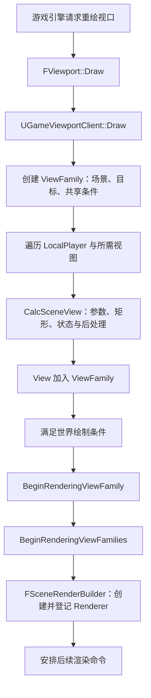
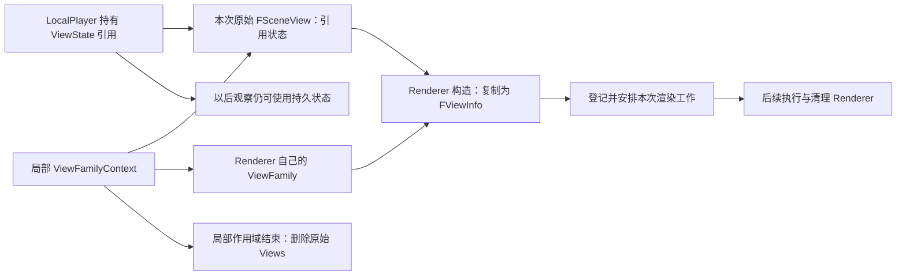

# 第 07 章：View、ViewFamily 与一帧的发起

[返回目录](../README.md) · [上一章：场景的渲染表示](06-scene-representation.md) · [本章答案](../appendices/answers/07-views-frame-entry.md)

> **适用配置：**UE 5.7.4，CL 51494982，Windows／D3D12／SM6，桌面传统延迟渲染的配置 A。继续关闭 Substrate、Nanite、Lumen、VSM 与硬件光线追踪，使用第 01 章场景和[配置附录](../appendices/configuration.md)。A 是选定的教学配置，不是所有新项目的默认配置。
>
> **本章边界：**第 06 章回答场景如何拥有可供渲染的数据；本章回答谁请求一次观察、请求携带什么，以及如何到达场景渲染器。第 08 章展开线程协作，第 09 章展开 RDG。本章涉及它们时只核实交接位置，不提前把全部执行细节压缩成一张调用图。
>
> **证据范围：**实现结论来自指定本地源码的静态核对。算例标明简化条件；全部操作练习尚未运行，没有项目创建、截图、断点命中记录或 GPU 测量。文中的“已创建视图”“已登记渲染”等描述指代码语义，不是报告本机已经运行过该分支。

## 7.1 学习目标与前置知识

到第 06 章为止，我们已经有一个可以更新的渲染场景。但是同一个场景可以从不同位置观察，画到不同目标，采用不同显示设置，并接续不同的历史。**有了场景，不等于已经指定这一张图应该怎样生成。**

学完本章，你应该能回答：

1. Camera Actor、LocalPlayer、Viewport、View 与 ViewFamily 各自解决什么问题。
2. 一个游戏视口怎样从玩家视角得到 `FSceneView`，为什么一个视口可能有多个 View。
3. `FSceneView` 与持久 `ViewState` 为什么需要分开，以及原始 View 退出作用域后后续工作如何继续。
4. UE 5.7 的 `BeginRenderingViewFamilies` 怎样借助 `FSceneRenderBuilder` 创建、登记与安排 Renderer。
5. 为什么进入一个名为 `Render` 的函数，不能直接证明 GPU 已完成一帧，也不能证明正在画主游戏窗口。

前置知识是第 02 章的视图与投影矩阵、第 05 章的视图矩形与历史资源，以及第 06 章的 `UWorld`、场景组件与渲染场景表示。这里出现的**上下文（Context）**指完成一项工作所需的相关条件集合，例如场景、相机、目标矩形、时间和显示规则，不是一种神秘的额外渲染阶段。

我们继续观察 **P**：方块上不受透明薄片覆盖的位置；以及 **Q**：方块与蓝色薄片投影重叠的位置。相机改变之后应重新选择它们；不能把某个固定屏幕整数坐标永久称为方块表面的 P。

## 7.2 先分清五个经常被叫作“视图”的对象

### 7.2.1 Camera Actor 不是正在执行的渲染器

Camera Actor 是游戏世界中的相机对象。它提供位置、方向、视场角、投影和相机后处理等信息，但场景里存在三台 Camera Actor，不意味着每帧自动渲染三张主画面。

普通玩家观察哪台相机，由玩家控制器及相机管理逻辑决定。第 01 章通过 `Set View Target with Blend` 把案例 Camera 指定为玩家当前观察目标。另一台没有被使用的相机仍是场景对象，却不因此成为一个需要独立渲染的主视图。

反过来，生成视图也不要求场景中一定有一台独立 Camera Actor。编辑器自由视口、某些自定义观察和场景捕获可以用其他来源构造相机参数。因此“找到全部 Camera Actor”不是统计全部渲染视图的可靠方法。

### 7.2.2 LocalPlayer 连接本地玩家与观察布局

**LocalPlayer（本地玩家）**表示本机的一个玩家上下文，不是“关卡中每一个角色”，也不是一个三角形对象。它与 PlayerController 配合，参与取得玩家视角，并保存玩家在窗口中的布局与跨帧视图状态。

普通单人游戏常有一个 LocalPlayer，但本地分屏可以有多个。远程联网角色并不会只因为出现在场景中，就各自变成本机一个 LocalPlayer 或各自占一块屏幕。双目显示又可能让同一个本地玩家需要多个眼睛视图，这说明“玩家数”和“View 数”并非永久相等。

### 7.2.3 Viewport、View、ViewFamily 的分工

| 名称 | 本章中的职责 | 不是哪一种东西 |
|---|---|---|
| `FViewport`，视口 | 提供可绘制区域、尺寸、相关目标与客户端连接 | 不是一个固定的相机矩阵 |
| `UGameViewportClient`，游戏视口客户端 | 组织游戏世界在该视口中的显示，遍历本地玩家、构造视图族 | 不是 GPU 线程 |
| `FSceneView`，场景视图 | 描述一次从场景到二维区域的观察及该 View 的条件 | 不是上一帧的整张图，也不是一项 Draw Call |
| `FSceneViewFamily`，视图族 | 组织一组相关 View 及共享场景、目标、显示标记、时间等 | 不是“一帧”的唯一同义词 |
| `FSceneViewStateInterface`，持久视图状态接口 | 连接需要跨次观察保留的状态与历史 | 不是当前相机变换的另一种命名 |

`FViewport` 与相应客户端的职责分离，让游戏视口和编辑器视口能共用部分底层绘制机制，却采用不同的视图构造逻辑。阅读调用链时，应看实际客户端类型，不能只看一个 `Draw` 函数名。

**[源码已确认]** [SceneView.h：FSceneView](G:/UnrealEngineInstalled/UE_5.7/Engine/Source/Runtime/Engine/Public/SceneView.h:1421) 将其描述为从场景空间到二维区域的投影，并分别保存 `Family` 与 `State`。[FSceneViewFamily 成员](G:/UnrealEngineInstalled/UE_5.7/Engine/Source/Runtime/Engine/Public/SceneView.h:2307) 则列出 `Views`、`RenderTarget`、`Scene`、`EngineShowFlags`、时间与帧编号。数据成员的分布正对应上表中的不同责任。

## 7.3 一份 ViewFamily 共享什么，每个 View 又保留什么

### 7.3.1 为什么不能只传一个相机矩阵

只传视图投影矩阵，可以告诉渲染器怎样投影位置，却不能说明结果应画到哪个区域、是否按线框显示、是否处于相机切换、当前后处理用什么设置、该复用哪份历史。矩阵是必要数据之一，不是完整请求。

ViewFamily 提供这组观察共享的环境。例如两位本地玩家在同一个窗口分屏，可以观察同一个 `Scene`、画到同一目标，但分别采用自己的视角和矩形。每个 View 可以有不同的隐藏对象集合、最终后处理设置和历史状态；族级显示标记则具有共享性质，不能当作每个 View 独立的一份任意开关集合。

在本章单摄像机主线中，可先把 ViewFamily 理解为“这一组玩家观察的请求容器”，里面只有一个 View。这个数量是配置的结果，不是类定义对数量的限制。

### 7.3.2 RenderTarget 指去向，不等于全部中间图像

游戏视口构造 ViewFamily 时传入 `InViewport` 作为目标。这表达这组观察最终服务于哪个绘制目标，不表示深度、GBuffer、场景颜色、TAA 历史从此都成为同一张后备缓冲。

Renderer 仍可能建立内部资源，再在适用后续阶段得到目标所需的结果。`RenderTarget` 是请求层面的去向，内部纹理格式与生命周期要看场景纹理和各 Pass。第 05 章的“资源、视图、语义”在这里仍然适用。

### 7.3.3 时间也是观察上下文的一部分

ViewFamily 还携带时间信息。世界时间可以受到暂停和时间缩放影响，真实时间有不同用途。材质动画、抖动序列、历史更新等若需要时间或帧计数，必须知道读取的是哪一种量。

**[源码已确认]** [SceneView.h：ConstructionValues](G:/UnrealEngineInstalled/UE_5.7/Engine/Source/Runtime/Engine/Public/SceneView.h:2223) 的构造参数包含目标、场景和显示标记，并提供 `SetTime`、`SetRealtimeUpdate`、`SetResolveScene` 等选项。其中 Realtime 是对这组观察的更新性质的描述，不表示“GPU 已实时完成”，也不是对任何机器帧率的保证。

一个 ViewFamily 共享时间，不等于所有 GPU 工作都在同一瞬间发生。时间值是参与计算的数据；真正的任务执行与资源可用顺序是另一个问题。

## 7.4 主游戏窗口的请求从哪里来

### 7.4.1 从游戏引擎到视口客户端

先明确范围：下面追踪普通 `UGameEngine` 游戏视口的相关路径，不用这条链替代编辑器全部调度。省略与本章无关的加载、截图、统计等分支后，入口关系如下。

[打开游戏视图入口静态图](../assets/diagrams/07-views-frame-entry-1.png)



图中每条实线表示本章选定路径中的职责衔接，不表达 GPU 持续时间。创建多个 View 的循环被压缩为一组节点；编辑器、捕获和跳过渲染等分支后面另讲。

**[源码已确认]** [GameEngine.cpp：RedrawViewports](G:/UnrealEngineInstalled/UE_5.7/Engine/Source/Runtime/Engine/Private/GameEngine.cpp:775) 先布局玩家，然后在游戏视口存在时调用 `GameViewport->Viewport->Draw(bShouldPresent)`。同文件 [2001 行](G:/UnrealEngineInstalled/UE_5.7/Engine/Source/Runtime/Engine/Private/GameEngine.cpp:2001) 的调用条件排除了专用服务器、相关空闲／挂起等情况。不能因此把“一次引擎 Tick”直接定义为“一次必定完成的场景渲染”。

[UnrealClient.cpp：FViewport::Draw](G:/UnrealEngineInstalled/UE_5.7/Engine/Source/Runtime/Engine/Private/UnrealClient.cpp:1707) 在普通绘制分支创建 `FCanvas`，再于 [1796 行](G:/UnrealEngineInstalled/UE_5.7/Engine/Source/Runtime/Engine/Private/UnrealClient.cpp:1796) 调用 `ViewportClient->Draw(this, &Canvas)`。对于本节的游戏客户端，这就进入 `UGameViewportClient::Draw`。

`Canvas` 在这里是组织绘图相关操作的接口对象，不是“屏幕 RGB 已经算完”的证明。上层最终还安排结束视口绘制等工作；`bShouldPresent` 也只表达该调用相关的呈现意图，不能据此推算显示器实际扫描到该帧的时刻。

### 7.4.2 GameViewportClient 先建立族，再建立成员

**[源码已确认]** [GameViewportClient.cpp：1411 行](G:/UnrealEngineInstalled/UE_5.7/Engine/Source/Runtime/Engine/Private/GameViewportClient.cpp:1411) 是游戏视口绘制入口。它取得 `UWorld`，世界不存在时提前返回，然后在 [1463 行](G:/UnrealEngineInstalled/UE_5.7/Engine/Source/Runtime/Engine/Private/GameViewportClient.cpp:1463) 建立：

```cpp
// [源码已确认] 该处的构造表达式；保留此版本的相关条件变量。
FSceneViewFamilyContext ViewFamily(FSceneViewFamily::ConstructionValues(
    InViewport,
    MyWorld->Scene,
    EngineShowFlags)
    .SetRealtimeUpdate(true)
    .SetRequireMobileMultiView(bRequireMultiView));
```

这段代码此时还没有给 P 算出红色。它先确定：观察哪个渲染场景，服务于哪个目标，以及使用哪组显示条件。配置 A 不启用移动多视图，保留该参数是为了如实呈现接口，而不是暗示本例正在做双目显示。

随后代码收集有效的 View Extension，并调用它们的 `SetupViewFamily`。**View Extension（视图扩展）**是允许系统在指定阶段参与设置视图的机制，例如部分显示与扩展功能会使用它。对于初学者，先知道“相机参数与项目设置之后仍可能有扩展介入”，不必立即编写插件。

### 7.4.3 一个玩家也可能进入多次视图构造

在 [GameViewportClient.cpp：1668 行](G:/UnrealEngineInstalled/UE_5.7/Engine/Source/Runtime/Engine/Private/GameViewportClient.cpp:1668)，代码遍历当前世界的本地玩家。普通单视图分支的每位玩家产生一次计算请求；立体等条件会改变所需 View 数，再逐个调用 `LocalPlayer->CalcSceneView`，调用位置在 [1687 行](G:/UnrealEngineInstalled/UE_5.7/Engine/Source/Runtime/Engine/Private/GameViewportClient.cpp:1687)。

返回值可能为空，所以源码检查 `if (View)`。不能根据 LocalPlayer 对象存在，就断言本帧一定建立了可渲染 View。成功的 View 还会用于流送观察位置、可见玩家映射等相关工作；视角数据的用途不只有最终颜色。

最后，在 [1967 行](G:/UnrealEngineInstalled/UE_5.7/Engine/Source/Runtime/Engine/Private/GameViewportClient.cpp:1967)，没有禁用世界渲染、存在有效玩家视图映射、平台允许渲染等条件共同决定是否调用 Renderer 模块。否则进入跳过 Renderer 的清理路径。空白画面排查因此应先判断有没有产生有效观察请求，再进入材质或光照。

## 7.5 LocalPlayer 怎样把相机信息变成 FSceneView

### 7.5.1 先问“这个玩家现在通过哪里看世界”

**[源码已确认]** [LocalPlayer.cpp：GetViewPoint](G:/UnrealEngineInstalled/UE_5.7/Engine/Source/Runtime/Engine/Private/LocalPlayer.cpp:704) 在普通具有 PlayerCameraManager 的条件下读取相机缓存视图、FOV，并通过 PlayerController 取得玩家视点。这里还存在锁定视图和扩展修改等条件。

因此，改变 Camera Actor 的位置后没有看到主画面变化，首先应该检查当前 View Target，而不是认定顶点投影公式失效。玩家可能仍通过另一台相机观察，也可能被游戏逻辑在之后重新切换了目标。

相机缓存里的 `FMinimalViewInfo` 包括这次观察需要的基本相机信息，但它还不是完整 `FSceneView`。后面还要加入目标矩形、视图状态、隐藏对象和最终显示条件。

### 7.5.2 初始化前先验证是否能形成有效区域

[CalcSceneView](G:/UnrealEngineInstalled/UE_5.7/Engine/Source/Runtime/Engine/Private/LocalPlayer.cpp:872) 创建 `FSceneViewInitOptions`，先调用 [CalcSceneViewInitOptions](G:/UnrealEngineInstalled/UE_5.7/Engine/Source/Runtime/Engine/Private/LocalPlayer.cpp:750)。后者检查 PlayerController、Viewport 与本地玩家区域尺寸，并取得投影数据；无有效矩形时返回失败。

“宽度等于零”不是一种神奇的极窄相机，它意味着这里没有有效可绘制区域。类似地，玩家控制器未准备好时，不应要求 Renderer 猜测一个正确相机。前置条件的失败会沿返回值传播，调用者可以跳过该观察。

### 7.5.3 Origin 与 Size 将本地玩家分配到窗口区域

[GetProjectionData](G:/UnrealEngineInstalled/UE_5.7/Engine/Source/Runtime/Engine/Private/LocalPlayer.cpp:1130) 用 LocalPlayer 的归一化 `Origin`、`Size` 与视口尺寸构造初始矩形。例如横向并排的两个玩家，可以分别占左半和右半。

**[教学简化]** 假设窗口客户区域为 1280×720，视口初始偏移为零，不考虑宽高比约束和取整误差。右半玩家的布局为：

```text
Origin = (0.5, 0)
Size   = (0.5, 1)

起点 = Origin × (1280,720) = (640,0) 像素
尺寸 = Size   × (1280,720) = (640,720) 像素
矩形 = Min(640,0), Max(1280,720)
```

`Origin` 和 `Size` 是无单位比例；乘法逐分量进行。这里矩形采用右、下边界不包含的约定，因此宽为 `1280-640=640`，不是 641。原始视口和后续矩形都需要明确坐标原点。

这个计算只决定观察占哪块区域，还不能决定使用什么 FOV 或应该怎样保持画面宽高比。源码随后使用 `FMinimalViewInfo::CalculateProjectionMatrixGivenView` 计算投影，并可能施加宽高比约束，见 [LocalPlayer.cpp：1262 行](G:/UnrealEngineInstalled/UE_5.7/Engine/Source/Runtime/Engine/Private/LocalPlayer.cpp:1262)。矩形与投影共同决定映射，改变分屏布局可能改变构图，不能视为把原画面随意裁掉一半。

### 7.5.4 把当前参数、状态引用与可见性条件放在一起

在取得有效投影之后，初始化代码选择当前 `ViewIndex`，确保 `ViewStates` 数组够大，并在需要时分配状态，见 [LocalPlayer.cpp：835 行](G:/UnrealEngineInstalled/UE_5.7/Engine/Source/Runtime/Engine/Private/LocalPlayer.cpp:835)。[856 行](G:/UnrealEngineInstalled/UE_5.7/Engine/Source/Runtime/Engine/Private/LocalPlayer.cpp:856) 将状态接口和当前 View Target 等放进选项。

`CalcSceneView` 继续填写相机信息与 `ViewFamily`，构建该玩家的隐藏组件集合，然后创建 `new FSceneView(ViewInitOptions)`，并把它加入 `ViewFamily->Views`，见 [919 行](G:/UnrealEngineInstalled/UE_5.7/Engine/Source/Runtime/Engine/Private/LocalPlayer.cpp:919)。

隐藏集合意味着两个 View 即使位于同一相机位置，也可能看到不同对象。View 并不拥有一份独立复制的全部场景；它引用共同场景，再携带属于此次观察的筛选条件。第 11 章会继续解释这些条件怎样参与可见性工作。

源码还明确注释，这条路径会在投影与后续填充中取得不止一次视点信息。调试时看到 `GetViewPoint` 命中两次，不能立即认定场景被 GPU 画了两遍。它只是构造过程中的函数调用计数，不是 Draw Call 或 GPU Pass 的计数。

## 7.6 最终观察条件是怎样汇合的

### 7.6.1 相机后处理不是唯一输入

同一台相机、同一张材质，有时在不同位置会有不同曝光、景深或颜色效果。这不一定是 Renderer 丢失了设置，而可能来自多个后处理来源的组合。

**[源码已确认]** [LocalPlayer.cpp：931 行](G:/UnrealEngineInstalled/UE_5.7/Engine/Source/Runtime/Engine/Private/LocalPlayer.cpp:931) 从当前相机位置开始建立最终后处理设置；后面组合相机管理器缓存的不同混合层、相机自身的 `PostProcessSettings` 与权重等，在 [989 行](G:/UnrealEngineInstalled/UE_5.7/Engine/Source/Runtime/Engine/Private/LocalPlayer.cpp:989) 调用 `EndFinalPostprocessSettings`。

本章不推导所有覆盖优先级，只从调用关系得到一个直接结论：**项目中的原始设置、某个 PPV 上的设置、最终 View 使用的设置，是不同层次的数据。** 第 01 章让普通 Camera 的 Post Process Blend Weight 为 0，并采用唯一 Unbound PPV，就是为了减少互相覆盖的来源。

对 Q，薄片保持 Unlit 并不能绕过这套最终观察条件。它不受普通表面光照计算，不等于结果不经过曝光。沿用 `Tint=(0.1,0.6,1)`、`EmissiveStrength=300`、Opacity 为 0.35，以及约 EV100=9.9 的固定曝光，只提供控制变量一致的起点，不保证任意显示路径的输出字节相同。

### 7.6.2 ShowFlags 与功能是否可用不是一回事

**Engine Show Flags（引擎显示标记）**描述本次观察希望显示哪些类别或采用哪些可视化条件，例如是否进行正常 Rendering、是否为 Wireframe 或 Hit Proxies 等。

它们与项目级功能支持、Shader 编译、资源准备及后处理选择互相关联，但不能互相替代。打开一个显示标记不会凭空补齐项目没有编译的能力；某个功能允许使用，也不证明这一帧实际创建了对应工作。

同样，编辑器将画面切到某种缓冲可视化时，不只是“给最终图加一层文字”。它可能改变该 ViewFamily 的显示条件，从而改变实际渲染分支。要比较 P 的材质属性与最终颜色，应记录模式，而不是把两种截图当成完全相同条件下的颜色测量。

### 7.6.3 视图扩展在不同阶段接收不同完整度的数据

本章已经见到 `SetupViewFamily`。`LocalPlayer::GetViewPoint` 中存在视点扩展，`CalcSceneView` 结束前还调用 `SetupView`，见 [LocalPlayer.cpp：992 行](G:/UnrealEngineInstalled/UE_5.7/Engine/Source/Runtime/Engine/Private/LocalPlayer.cpp:992)。后面 Renderer 创建前还会调用 `BeginRenderViewFamily`。

这些名字包含 View，不代表它们处在相同时间和线程。对本章这条游戏路径，前述参数准备和 Renderer 创建发生在游戏侧；具体 RenderThread 回调另有明确边界。扩展顺序也解释了为什么只检查最初相机参数不足以证明最终 View 一模一样。

没有扩展插件的配置 A 也不需要手动清空所有内部扩展。教学目标是知道可修改位置，并在排查时检查参与者；不是要求读者通过删除引擎机制来获得“纯净矩阵”。

## 7.7 当前 View、持久 ViewState 与 Renderer 副本

### 7.7.1 当前描述与跨帧状态需要不同生命周期

`FSceneView` 主要描述这次观察。下一次观察可能改变相机、矩形、时间或显示条件，重新构造当前 View 是合理的。但是 TAA、遮挡历史、曝光等又可能需要继续使用过去的数据，所以还需要更持久的状态。

**[源码已确认]** [SceneManagement.h：FSceneViewStateInterface](G:/UnrealEngineInstalled/UE_5.7/Engine/Source/Runtime/Engine/Public/SceneManagement.h:128) 将其定位为持久视图状态接口。LocalPlayer 的 [ViewStates 成员](G:/UnrealEngineInstalled/UE_5.7/Engine/Source/Runtime/Engine/Classes/Engine/LocalPlayer.h:240) 和前文按需分配代码说明，这份状态不是每创建一个 `FSceneView` 就无条件销毁重建。

不要把持久状态等同于“保存上一台 Camera Actor”。普通主视图在同一个 LocalPlayer 中切换观察目标，可能继续引用同一视图状态对象，而其中的历史是否仍适用，需要相机切换标记和具体算法判定。第 05 章已经说明：历史引用存在，不等于历史对应关系有效。

`FSceneView::State` 还允许为空，源码注释举了缩略图等例子。没有持久 ViewState 并不表示不能形成任何图像；它表示需要持久状态的功能必须有适用分支或回退。不能拿一次性缩略图与连续游戏视口对历史功能作无条件类比。

### 7.7.2 为什么两个同时存在的 View 不应随便共用状态

假设左玩家看到方块正面，右玩家看到方块背面。如果让两者任意写同一份视图历史，下一帧不知道某个结果来自哪个观察，遮挡与时序数据就可能失去正确归属。

**[源码已确认]** [FSceneRenderer 构造中的检查](G:/UnrealEngineInstalled/UE_5.7/Engine/Source/Runtime/Renderer/Private/SceneRendering.cpp:2663) 会检查同族不同 View 的非空 State 是否唯一，注释指出遮挡查询机制依赖这个条件。这不是鼓励读者绕过检查，而是表明“共享场景”和“共享全部视图状态”是两件事。

某些功能存在显式共享原点或专门共享曝光的机制，也不能据此把所有历史合并成一个对象。共享需要遵循具体设计，不是看两个指针类型相同就让它们指向同一份内存。

### 7.7.3 ViewFamilyContext 退出之后，数据为什么没有丢

[打开视图生命周期静态图](../assets/diagrams/07-views-frame-entry-2.png)

`UGameViewportClient::Draw` 中的 `ViewFamily` 是局部 `FSceneViewFamilyContext`。这个类在退出作用域时删除它管理的原始 Views，见 [SceneView.cpp：3135 行](G:/UnrealEngineInstalled/UE_5.7/Engine/Source/Runtime/Engine/Private/SceneView.cpp:3135)。如果后续渲染还无条件使用那些原始 View 地址，就会出现生命周期错误。

真正的交接发生在 Renderer 构造中。**[源码已确认]** [SceneRendering.cpp：2645 行](G:/UnrealEngineInstalled/UE_5.7/Engine/Source/Runtime/Renderer/Private/SceneRendering.cpp:2645) 的 `FSceneRenderer` 构造函数复制 `ViewFamily`，并明确检查 `IsInGameThread()`。随后逐个创建 Renderer 自己的 `FViewInfo`，将新族中的 View 指针重新指向这些对象，见 [2679 行](G:/UnrealEngineInstalled/UE_5.7/Engine/Source/Runtime/Renderer/Private/SceneRendering.cpp:2679)。

`FViewInfo` 继承 `FSceneView`，添加 Renderer 内部所需的数据；其从 `FSceneView*` 初始化的构造见 [893 行](G:/UnrealEngineInstalled/UE_5.7/Engine/Source/Runtime/Renderer/Private/SceneRendering.cpp:893)。这里复制观察描述，不意味着把整个世界、所有纹理和全部历史都深拷贝一遍。场景、持久状态与资源引用仍由各自的生命周期规则管理。

这个区别尤其重要：**Renderer 是用于安排渲染的对象，不代表它必须在名字叫“渲染线程”的地方才创建。** 当前路径先在游戏侧创建持有后续工作数据的对象，再把工作安排给渲染侧。



图中两个持有关系与后续执行并不表示各对象拥有同样寿命。持久状态可被后续观察继续使用；Renderer 管理本次工作；局部 Context 管理构造侧的原始 Views。图没有表示所有资源都在最后一个方框立即释放，也没有表示 C++ 对象清理等于 GPU 使用已经结束。

## 7.8 BeginRenderingViewFamilies 先做哪些交接准备

### 7.8.1 单数入口包装复数入口

**[源码已确认]** [SceneRendering.cpp：5034 行](G:/UnrealEngineInstalled/UE_5.7/Engine/Source/Runtime/Renderer/Private/SceneRendering.cpp:5034) 的 `BeginRenderingViewFamily` 把单个族包装为数组视图，调用 [5039 行](G:/UnrealEngineInstalled/UE_5.7/Engine/Source/Runtime/Renderer/Private/SceneRendering.cpp:5039) 的 `BeginRenderingViewFamilies`。

所以看到两种名字，不要误以为引擎在同一位置把完整场景画了两遍。前者是方便调用的包装，后者处理一批相关 ViewFamily。这批输入会检查它们引用同一个 Scene；这不是任意多个世界混在同一个调用中的通用入口。

### 7.8.2 场景更新要先与请求对齐

在 Scene 与 World 存在的分支，函数调用 `World->SendAllEndOfFrameUpdates()`，见 [5060 行](G:/UnrealEngineInstalled/UE_5.7/Engine/Source/Runtime/Renderer/Private/SceneRendering.cpp:5060)。注释说明，要在发起视图族渲染之前保证相关渲染代理更新已经送出。

这是第 06 章场景表示与本章观察请求的连接：方块移动既要影响场景的渲染表示，又要有一个相机请求看它。只更新了游戏对象但没有正确交接，不能要求 Renderer 自动绕过代理读取所有实时 UObject 字段。

“送出更新”也不是 GPU 已完成全部新数据处理的同义词。这里的代码建立必要的组织和命令关系；第 08 章再区分线程可见性与执行顺序，第 10 章区分 GPU 提交与完成。

### 7.8.3 Flush_GameThread 不能直接翻译为等 GPU 空闲

函数于 [5094 行](G:/UnrealEngineInstalled/UE_5.7/Engine/Source/Runtime/Renderer/Private/SceneRendering.cpp:5094) 调用 `Canvas->Flush_GameThread()`。这要求按 Canvas 的契约处理已积累的工作，不是看到单词 Flush 就能断言“此处等待 GPU 把当前所有帧都画完”。

不同层的 Flush 含义不同：提交积累的逻辑工作、把命令交给下一层、等待任务完成或等待 GPU 栅栏，可以是不同操作。源码阅读应跟到具体接口，再谈等待成本。本章只确定 Canvas 工作与场景请求之间存在这次交接。

### 7.8.4 不同 Frame 编号有不同计数边界

在 [5099 行](G:/UnrealEngineInstalled/UE_5.7/Engine/Source/Runtime/Renderer/Private/SceneRendering.cpp:5099)，当前批次满足首个相关 ViewFamily 条件时会增加 Scene 帧编号，并填入各个 `ViewFamily->FrameNumber`。之后还从 `GFrameCounter` 填写 `FrameCounter`。

**[源码已确认]** [SceneView.h：2332 行](G:/UnrealEngineInstalled/UE_5.7/Engine/Source/Runtime/Engine/Public/SceneView.h:2332) 注释说明 `GFrameCounter` 按引擎 Tick 增加。同一个引擎 Tick 的多个观察可以拥有相同的这个计数，而场景请求相关编号还有自身递增条件。

因此，“Frame 100”需要说明是引擎 Tick、场景编号、某份历史索引，还是分析工具的捕获帧。编号可用来关联记录，不能不看定义就当成跨所有视口、场景和设备的统一时钟。对 P／Q 的历史诊断，也应记录对应 View 和状态，不能只记录一个整数。

## 7.9 UE 5.7 的 FSceneRenderBuilder 主调度

### 7.9.1 先处理可能影响主渲染器构造的请求

**[源码已确认]** 在存在 Scene 的分支，[SceneRendering.cpp：5167 行](G:/UnrealEngineInstalled/UE_5.7/Engine/Source/Runtime/Renderer/Private/SceneRendering.cpp:5167) 创建 `FSceneRenderBuilder SceneRenderBuilder(Scene)`。随后在非 Hit Proxy 的条件下处理待更新 SceneCapture，再创建主视图相关的 Renderer。

这里的先后顺序有具体原因：源码注释说明，延迟更新的捕获可能提供 Custom Render Pass，需要在主 SceneRenderer 构造时可用。不能把这段只概括为“先画捕获，后画主画面”，因为此时仍在建立与登记工作，而且捕获还存在不同实现分支。

### 7.9.2 Renderer 的选择在构建器处理器中发生

`CreateLinkedSceneRenderers` 于 [SceneRendering.cpp：5176 行](G:/UnrealEngineInstalled/UE_5.7/Engine/Source/Runtime/Renderer/Private/SceneRendering.cpp:5176) 接收这批 ViewFamily。它转到构建器的创建接口，再进入内部处理器，真实选择位置在 [SceneRenderBuilder.cpp：472 行](G:/UnrealEngineInstalled/UE_5.7/Engine/Source/Runtime/Renderer/Private/SceneRenderBuilder.cpp:472)。

处理器先取得 Scene 的 Feature Level 对应的 `EShadingPath`，调用各扩展的 `BeginRenderViewFamily`，再选择 `FDeferredShadingSceneRenderer` 或 `FMobileSceneRenderer`，见 [496 行](G:/UnrealEngineInstalled/UE_5.7/Engine/Source/Runtime/Renderer/Private/SceneRenderBuilder.cpp:496)。构造之后还给扩展 `PostCreateSceneRenderer` 的机会。

配置 A 的 Windows／SM6 桌面场景落在前一种场景渲染器类别。这里必须谨慎读类名：**[源码已确认]** [SceneUtils.h：30 行](G:/UnrealEngineInstalled/UE_5.7/Engine/Source/Runtime/Engine/Public/SceneUtils.h:30) 按 Feature Level 将 SM5 及以上归为名叫 Deferred 的路径类别。这个分类本身没有读取项目 Forward Shading 开关，所以只看到 `FDeferredShadingSceneRenderer` 的类名，还不足以证明项目关闭了桌面前向着色。A 的传统延迟结论要结合配置附录的实际设置。

同理，是否启用 Nanite、Substrate、Lumen 等功能，还要在相应条件和后续阶段判断。主 Renderer 类型不会替读者回答全部功能路径问题。

### 7.9.3 AddRenderer 登记的是函数，不是完成的图像

在 [SceneRendering.cpp：5204 行](G:/UnrealEngineInstalled/UE_5.7/Engine/Source/Runtime/Renderer/Private/SceneRendering.cpp:5204)，调用者将 Renderer、事件名称与一个函数对象交给构建器。函数对象里调用 `RenderViewFamily_RenderThread`，但**写下函数体和马上执行函数体是两件事**。

```cpp
// [源码已确认] 摘录登记工作时的函数体，外层 AddRenderer 调用见链接。
[] (FRDGBuilder& GraphBuilder, const FSceneRenderFunctionInputs& Inputs)
{
    RenderViewFamily_RenderThread(GraphBuilder, Inputs.Renderer, Inputs.SceneUpdateInputs);
    return true;
}
```

输入中不仅有 Renderer，还可能有这一批工作需要消费的 Scene 更新信息。构建器因此不只是把几个名字排成列表，它还参与组织相关 Renderer、更新与清理的衔接。本章不把这些策略推导成“所有 Scene 更新对任意视图永远只执行一次”。

同一入口随后登记视图族清理，再在 [5217 行](G:/UnrealEngineInstalled/UE_5.7/Engine/Source/Runtime/Renderer/Private/SceneRendering.cpp:5217) 调用 `SceneRenderBuilder.Execute()`。这是对这组已登记工作发起执行安排，仍不是完整物理屏幕呈现的完成通知。

### 7.9.4 两个 Execute 处于两种层次

**[源码已确认]** [SceneRenderBuilder.cpp：1079 行](G:/UnrealEngineInstalled/UE_5.7/Engine/Source/Runtime/Renderer/Private/SceneRenderBuilder.cpp:1079) 的构建器 Execute 调用内部处理器。处理器对 Render 类型操作在 [829 行](G:/UnrealEngineInstalled/UE_5.7/Engine/Source/Runtime/Renderer/Private/SceneRenderBuilder.cpp:829) 使用 `ENQUEUE_RENDER_COMMAND(SceneRenderBuilder_Render)` 登记渲染命令。

进入这条命令后，它在 [872 行](G:/UnrealEngineInstalled/UE_5.7/Engine/Source/Runtime/Renderer/Private/SceneRenderBuilder.cpp:872) 创建 `FRDGBuilder`，在 Rendering 显示条件允许时调用先前登记的函数，然后在 [915 行](G:/UnrealEngineInstalled/UE_5.7/Engine/Source/Runtime/Renderer/Private/SceneRenderBuilder.cpp:915) 调用 `GraphBuilder.Execute()`。

| 名称 | 本章看到的责任 | 不能据此宣称 |
|---|---|---|
| `FSceneRenderBuilder::Execute` | 处理已登记的场景渲染操作，并组织后续命令 | GPU 已完成所有场景像素 |
| 登记函数中的 `Renderer->Render` | 由对应 Renderer 组织其渲染工作，使用收到的 RDG Builder | 所有 Pass 已在调用返回前执行到物理屏幕 |
| `FRDGBuilder::Execute` | 执行 RDG 所负责的构图结果与相关工作组织 | 等于交换链 Present，或等于整帧只有这一张图 |

`RenderViewFamily_RenderThread` 自身也有明确分支：Hit Proxies 时调用 `RenderHitProxies`，否则调用普通 `Render`，见 [SceneRendering.cpp：4895 行](G:/UnrealEngineInstalled/UE_5.7/Engine/Source/Runtime/Renderer/Private/SceneRendering.cpp:4895)。Hit Proxy 用于编辑器选择相关标识，不是本书 P／Q 的正常光照结果。

到这里，本章完成了“请求怎样到达渲染器”的主线。下一章继续展开游戏、渲染、RHI 线程和 GPU 如何重叠，第 09 章再追踪 RDG 的依赖与资源，而不是在此把二者合并为一条同步 CPU 调用栈。

## 7.10 矩形在什么阶段确定：窗口尺寸不是内部 ViewRect

### 7.10.1 三个相似名字对应三个问题

| 名称 | 先怎样理解 | 单位与注意事项 |
|---|---|---|
| `UnconstrainedViewRect` | 未施加相机宽高比约束等条件时的观察范围 | 像素区域；仍需确认所属目标 |
| `UnscaledViewRect` | 对应最终目标的观察区域，可带相机宽高比约束形成的留边 | 像素区域；Unscaled 不是“没有任何视图条件” |
| Renderer 中的 `FViewInfo::ViewRect` | 适用内部渲染阶段使用的矩形，可能经过屏幕比例、取整与布局调整 | 像素区域；不能机械照抄最终窗口坐标 |

**[源码已确认]** 前两个字段的注释在 [SceneView.h：1455 行](G:/UnrealEngineInstalled/UE_5.7/Engine/Source/Runtime/Engine/Public/SceneView.h:1455)。Renderer 的 `FViewInfo` 初始化时先把内部 `ViewRect` 置为零，见 [SceneRendering.cpp：904 行](G:/UnrealEngineInstalled/UE_5.7/Engine/Source/Runtime/Renderer/Private/SceneRendering.cpp:904)；稍后 [PrepareViewRectsForRendering](G:/UnrealEngineInstalled/UE_5.7/Engine/Source/Runtime/Renderer/Private/SceneRendering.cpp:3245) 才根据屏幕比例接口等条件计算。

因此，如果在 `FViewInfo` 刚创建的断点看到零矩形，不应立即判定“视口宽高丢了”。要看所处阶段：未缩放范围已经存在，内部矩形还等待渲染准备。调试一个字段，必须同时记录字段在生命周期的哪一步被读取。

### 7.10.2 一个带留边与内部缩放的完整算例

**[教学简化]** 输出客户区域改为 1280×800，摄像机要求 16:9 的画面，并假设居中保留上下黑边。只应用主屏幕比例 `s=0.75`，次比例为 1；无动态分辨率、额外 Overscan 或镜头畸变。忽略硬件对齐与尺寸量化对结果的细小修改。

```text
有效输出高度 = 1280 ÷ (16/9) = 720 像素
上下各留边   = (800-720)/2 = 40 像素

UnscaledViewRect = Min(0,40), Max(1280,760)
内部有效尺寸    = (1280,720)×0.75 = (960,540) 像素
```

UE 的适用矩形准备路径会将内部布局向缓冲左上移动，最终后处理再按未缩放矩形输出到目标位置，见 [SceneRendering.cpp：3402 行](G:/UnrealEngineInstalled/UE_5.7/Engine/Source/Runtime/Renderer/Private/SceneRendering.cpp:3402)。所以不能把最终目标上方的 40 像素留边直接当成每张内部场景纹理也必须浪费的 40 行。

假设内部矩形起点为 `(0,0)`，在本例所用资源中有效尺寸是 960×540。取某个代表 P 的连续 ViewportUV 为 `(0.25,0.5)`，得到：

```text
最终目标连续位置 = (0,40) + (0.25,0.5)×(1280,720)
                 = (320,400) 像素

内部连续位置     = (0,0) + (0.25,0.5)×(960,540)
                 = (240,270) 像素
```

UV 是无单位比例，坐标单位是对应网格的像素间距。这里为解释映射使用连续位置，未处理实际像素中心和采样重建，不是在保证某个整数样本与最终像素严格一对一。

再假设承载这个内部区域的纹理因分配条件而为 1024×576，则：

```text
BufferUV = (240,270)/(1024,576) = (0.234375,0.46875)
```

这里的资源尺寸是额外给定条件，不是声称本机 UE 一定分配 1024×576。它展示三个不同的数：ViewportUV、内部坐标、BufferUV。对 Q 也需做同类映射；同一观察语义不保证不同资源里使用相同整数坐标。

### 7.10.3 同族多 View 也不意味着像素总数必然翻倍

一张 1280×720 目标被左右两块 640×720 区域恰好分满时，两 View 的有效像素总数仍是 `2×640×720=921600`，等于原来的目标面积。

但是这两个 View 具有不同相机，需要各自的可见性、历史和适用渲染工作。几何、阴影、固定调度成本与资源组织不会只因为有效像素数相同就保持不变。反过来，立体路径可能有共享与优化，也不能简单宣布任何双 View 都严格花两倍时间。

要评估成本，先分别统计 View 数、各 View 尺寸、所属族、额外 Renderer 与历史，再看实际工作复用条件。只数窗口数量或最终分辨率会漏掉决定成本的因素。

## 7.11 编辑器视口与 SceneCapture：相似目标，不同请求来源

### 7.11.1 编辑器自由视口不等于 LocalPlayer 主视图

**[源码已确认]** [EditorViewportClient.cpp：4564 行](G:/UnrealEngineInstalled/UE_5.7/Engine/Source/Editor/UnrealEd/Private/EditorViewportClient.cpp:4564) 有自己的 Draw。它构造 ViewFamily，选择时间、编辑器显示标记与实时更新条件，复制编辑器 `ExposureSettings`，再使用自己的 `CalcSceneView`，最后于 [4756 行](G:/UnrealEngineInstalled/UE_5.7/Engine/Source/Editor/UnrealEd/Private/EditorViewportClient.cpp:4756) 进入同一个 Renderer 模块入口。

共享后端入口不意味着前端条件一致。编辑器可能有选择标识、网格线、可视化、曝光覆盖、DPI 与实时刷新规则。Pilot 到案例 Camera 有助于对齐观察位置，却不会自动把整个编辑器视口变成 Standalone 游戏视口。

PIE 也不应只按它“显示在编辑器里”来分类。它可以运行游戏世界与游戏视口逻辑，而编辑器旁边其他窗口仍可能渲染编辑场景或预览场景。记录观察时应写清是在自由编辑视口、PIE 游戏视图还是独立游戏窗口，尤其不要把不同世界中的同名 Actor 当成同一个运行对象。

### 7.11.2 普通 SceneCapture 产生自己的观察目标

**SceneCapture（场景捕获）**请求把场景从某个视角渲染到纹理等目标。它可以用于画中画、监视器、材质效果或离线观察；它不是拿主窗口已经完成的图像随意裁一块就必然得到的东西。

普通独立 SceneCapture 使用自己的位置、投影、目标尺寸、Capture Source 和显示条件。**[源码已确认]** [SceneCaptureRendering.cpp：878 行](G:/UnrealEngineInstalled/UE_5.7/Engine/Source/Runtime/Renderer/Private/SceneCaptureRendering.cpp:878) 为该路径构造 ViewFamily，设置捕获目标、Scene 和捕获显示标记，随后建立 View 并于 [1002 行](G:/UnrealEngineInstalled/UE_5.7/Engine/Source/Runtime/Renderer/Private/SceneCaptureRendering.cpp:1002) 请求创建 Renderer。

如果主窗口已经看到 Q，捕获从侧面观察时可能根本不再存在“薄片盖住方块”的重叠关系。同一个字母 Q 只是我们在主画面选定的位置，不应被拿去索引捕获纹理的同一坐标。

捕获输出类型也有区别：Scene Color HDR、最终颜色、深度或其他属性不是同一种资源语义。不能看到两张图不同，就立即认定渲染不确定；应先对齐摄像机、Capture Source、后处理、格式与历史条件。

### 7.11.3 UE 5.7 不能把所有捕获都描述成独立 Renderer

**[源码已确认]** `USceneCaptureComponent2D` 提供 `bRenderInMainRenderer`，声明见 [SceneCaptureComponent2D.h：141 行](G:/UnrealEngineInstalled/UE_5.7/Engine/Source/Runtime/Engine/Classes/Components/SceneCaptureComponent2D.h:141)。在允许条件下，某些捕获类型可以作为主 Renderer 中的额外工作。实际判断位于 [SceneCaptureRendering.cpp：1253 行](G:/UnrealEngineInstalled/UE_5.7/Engine/Source/Runtime/Renderer/Private/SceneCaptureRendering.cpp:1253)，它同时检查总开关和 `ShouldRenderInMainRenderer()`。

因此，本节前面的“普通独立捕获”限定不能省略。额外观察并不总是与一个全新独立 Renderer 一一对应；统计请求、族、View、Renderer 和 Pass 时，要跟实际分支。也正因为这条能力，主入口会在主 Renderer 构造前先处理适用的待更新捕获。

### 7.11.4 捕获何时更新，是否保留历史，是另一组条件

捕获可以每帧更新，也可以由显式 `CaptureScene` 等请求更新。**[源码已确认]** [SceneCaptureComponent.cpp：817 行](G:/UnrealEngineInstalled/UE_5.7/Engine/Source/Runtime/Engine/Private/Components/SceneCaptureComponent.cpp:817) 的显式捕获创建构建器、登记捕获内容并 Execute；如果同时启用了每帧捕获，该函数还会提示重复更新的低效用法。

API 中“立即捕获”的表述是相对延迟更新请求而言，不能理解为函数返回时 GPU 像素已经读回 CPU。更新目标纹理、读取 CPU 像素和把文件写到磁盘，仍是不同操作。

[GetViewState](G:/UnrealEngineInstalled/UE_5.7/Engine/Source/Runtime/Engine/Private/Components/SceneCaptureComponent.cpp:403) 根据 `bCaptureEveryFrame` 与 `bAlwaysPersistRenderingState` 等条件分配或释放捕获状态。一次性捕获与持续捕获因此可能有不同历史条件。保留状态是支持某些历史功能的条件之一，不保证长时间不更新后所有历史仍然正确。

## 7.12 用 P、Q 串起一次请求

回到配置 A 的固定主相机。请求开始时，Scene 已有红方块、金属球和薄片的渲染表示。游戏视口选择这个 Scene 和窗口目标，LocalPlayer 取得相机参数、矩形与状态，形成当前 View。此时 P／Q 对应什么几何关系已经能由投影推理，但它们的最终颜色还没有在 CPU 上被逐像素求出。

Renderer 收到的 View 携带同样的观察条件，并在后续准备内部矩形、可见性与渲染工作。P 会走不透明表面与后续颜色形成的相关路径；Q 还需要透明薄片与背景的关系。View 并不把 P 标记为“永远不透明”、把 Q 标记为“永远透明”，这些是我们依据当前场景挑选的观察位置。

现在把相机向左移动少许：Scene 内的方块可以完全不动，但新 View 的观察矩阵改变，P 的屏幕位置与 Q 的重叠范围也会改变。持久 ViewState 帮助接续历史，实际时序算法还要处理重投影、去遮挡和状态失效。第 05 章的历史问题由此与本章的 View 来源接上。

再增加一台没有被选中的 Camera Actor：主 View 不必改变。换成一台每帧更新的普通 SceneCapture，则出现实际额外观察工作。二者表面上都“多了一台相机”，对渲染调度的意义却不同。

**[教学简化]** 若主图有效区域为 1280×720，新增独立捕获为 512×512，而且两者都做一次我们单独假设的全区域颜色处理，那么逻辑像素处理数从 `921600` 增为 `921600+262144=1183744`，约增加 28.44%。这只是这项假设操作的面积计数，不是全帧 GPU 时间会增加 28.44%，更不表示捕获的所有 Pass 与主图完全相同。

## 7.13 观察练习与故障排查

> **[尚未验证]** 以下步骤供读者在自己的专用练习项目实施。作者没有创建或运行项目。先完成配置 A 与第 01 章的固定 Camera、唯一 PPV、Standalone 视图目标设置，再做每一组。操作完成后恢复原始设置；任何截图或记录都写清当前属于哪一种视口。

### 练习 A：场景里有相机，不等于正在通过它看

1. 保留案例相机 A，在关卡中复制一台 B，只改变 B 的位置与方向，使它能从不同一侧看见方块。保持两台普通 Camera 的后处理权重为 0，沿用同一 PPV。
2. 先保持关卡 BeginPlay 只将玩家 View Target 设为 A，进入 Standalone。预期画面仍来自 A，B 的存在不自动增加一个主窗口区域。
3. 停止后，在已有关卡蓝图中将流程设为：BeginPlay → 指定 A → Delay 3 秒 → 指定 B，两个 `Set View Target with Blend` 的 Blend Time 均为 0。再次运行，确认画面在约 3 秒后切到 B。
4. 记录切换前后 P／Q 应如何重新选择。这里验证观察来源变化，不要求凭肉眼判断 `bCameraCut` 或 ViewState 地址；精确状态应另用日志、调试器或捕获证据核对。

如果没有切换，先检查 Get Player Controller 的目标玩家、蓝图是否运行，以及项目是否有后续逻辑不断覆盖 View Target。如果切换后亮度变化，先检查是否只是方块朝向和可见表面变化，再检查相机后处理与 PPV，不能把所有差异归给历史。

### 练习 B：区分输出留边与内部比例

1. 恢复固定相机 A。为这次对照显式设置其宽高比为 16:9，并开启 Constrain Aspect Ratio；停止后再修改，避免与上一组计时切换同时发生。
2. 在 Standalone 控制台使用 `r.SetRes 1280x800w`，保持 `r.SecondaryScreenPercentage.GameViewport 100`、动态分辨率关闭，确认相机仍是 A。预期有效画面可能按约束留边。
3. 分别设置 `r.ScreenPercentage 100` 与 `r.ScreenPercentage 75`，等待相关历史重新稳定后观察。记录窗口客户区域没有因为主比例改变而自动变成 960×540。
4. 恢复 `r.SetRes 1280x720w` 与 `r.ScreenPercentage 100`，并将相机宽高比约束恢复到练习前设置。

这组不要求用截图边框证明内部缓冲分配。Windows DPI、窗口边框与捕获软件缩放都会影响外部图片尺寸；内部 ViewRect 与资源 Extent 应以后续工具实际记录为准。若比例设置没有产生预期变化，检查查询到的当前值、动态分辨率、实际视口和屏幕比例接口条件。

### 练习 C：识别编辑器视口的独立条件

停止游戏，在编辑器中 Pilot 到相机 A，记录该视口的视角与曝光显示设置，再与独立游戏窗口比较。保留普通 Lit 模式，避免同时切线框或缓冲可视化。

预期可以对齐部分构图，但不能因为位置相同就省略曝光与屏幕比例核验。若想观察编辑器显示标记如何改变请求，可只切换 Wireframe 一次并恢复；这属于编辑器观察，不把它的时间或最终颜色与基础 Standalone 结果合并统计。

### 练习 D：增加一次明确的独立捕获

此组只在编辑器观察，避免与 Standalone 的固定数值比较混淆。创建一个 512×512 的 Texture Render Target 2D 资产，放置 SceneCapture2D，指向能看到方块的位置，把它的 Texture Target 指向该资产。选择 `Final Color (LDR) in RGB` 作为 Capture Source，并保持 Render In Main Renderer 关闭。先开启 Capture Every Frame，保持编辑器实时视口更新，打开目标资产预览来检查是否出现对应观察结果。

目的只是确认捕获有自己的观察与输出：它是方形目标，不能因为主游戏窗口 16:9 就预期完全相同构图。曝光、捕获后处理与资源预览还可能使颜色不同，本组不做逐像素色值比较，也不把目标预览自身的刷新当成主窗口渲染次数。

完成后关闭 Capture Every Frame 与 Capture On Movement，并停止主动更新，或移除这组练习捕获以恢复基础场景。不要在每帧捕获开启时再给 Tick 接 `CaptureScene`。如果目标不更新，依次检查 Texture Target 是否设置、组件可见性、捕获视角、编辑器实时更新与捕获开关；不要只因为相机图标存在就断言请求已经执行。

捕获类型显示名在 [EngineTypes.h：531 行](G:/UnrealEngineInstalled/UE_5.7/Engine/Source/Runtime/Engine/Classes/Engine/EngineTypes.h:531) 定义；显式捕获的重复更新条件见前文源码。这里不要求创建显示捕获纹理的场景材质，因而也不引入监视器拍到自身造成的额外反馈问题。

### 练习 E：在源码里建立带条件的短记录

不启动调试器也能完成一次静态阅读。按下面顺序，每个入口只记“收到什么、填了什么、交给谁、在哪个条件下交接”：

| 入口 | 建议记录 |
|---|---|
| `UGameViewportClient::Draw` | Scene／目标／ShowFlags 的来源，玩家循环与最终是否调用 Renderer |
| `ULocalPlayer::CalcSceneView` | 参数失败返回、状态引用、原始 View 创建与后处理组合 |
| `FRendererModule::BeginRenderingViewFamilies` | Scene 更新、待捕获处理、构建器与登记函数 |
| `FSceneRenderProcessor::CreateSceneRenderers` | 路径分类、扩展回调与具体 Renderer 构造 |
| 构建器 Render 操作 | 入队边界、RDG Builder 创建、登记函数与 RDG Execute |

读到 `new FSceneView` 时，不把笔记写成“生成像素”；读到 `AddRenderer` 时，不写成“GPU 已画完”；读到 `GraphBuilder.Execute` 时，不写成“显示器立即刷新”。本章最重要的实践，是让每个动词与代码实际责任一致。

## 7.14 成本与常见误区

| 常见说法 | 应该怎样修正 |
|---|---|
| 关卡多一台 Camera Actor，就多一遍全场景绘制 | 先查是否有玩家、捕获或其他系统实际请求这个观察 |
| 窗口只有一个，所以只有一个 View | 分屏、双目、捕获与预览等需要按实际请求统计 |
| ViewFamily 就是一个 Draw Call | 它是观察上下文的组织单位，后续可能产生很多 Pass 和绘制 |
| Renderer 必须在渲染线程创建 | 本章路径的构造显式检查游戏线程，后续执行另行安排 |
| 原始 View 删除了，历史必定也被删除 | 持久状态具有不同生命周期，历史有效性还需单独判定 |
| 相机位置没变，两张图就一定一样 | 显示标记、后处理、矩形、投影、隐藏集合、历史和输出目标都可能不同 |
| `FDeferredShadingSceneRenderer` 证明所有现代功能都关闭 | 类别选择不能替代项目配置和后续条件检查 |
| 调用 BeginRenderingViewFamily 返回，GPU 就空闲了 | 请求构造、排队、执行、完成与呈现属于不同边界 |

性能上应留意“看不见的观察工作”。不显示在主窗口里的 SceneCapture 仍可能更新；同时打开的编辑器预览也可能产生工作。另一方面，某个固定 Camera Actor 没有被请求观察，就不能按同样方式计入每帧渲染成本。

多 View 不仅增加像素工作，还可能增加可见性、各视图状态、不同投影的阴影需求和调度开销。共享 Scene 能减少数据复制，不代表每个 View 所需的图像结果都可直接复用。是否共享某项工作，要看具体算法，不用一句“同一个世界”作性能结论。

需要测量时，先明确所用世界、视口类型、有效 View／Renderer 数、矩形、捕获更新频率与功能设置，然后再看 CPU／GPU 记录。构造函数的 CPU 耗时和场景 GPU 毫秒不是同一个量；本批未进行这些运行测量。

## 7.15 本章源码阅读地图

以下入口均已按本地 UE 5.7.4 静态核对；同名函数在其他版本中可能移动或经过不同调度层。表格保留主线与边界问题，不要求一口气通读整个文件。

| 本章问题 | 已核对入口 | 继续阅读时注意 |
|---|---|---|
| 游戏视口由谁请求重绘？ | [GameEngine.cpp：775](G:/UnrealEngineInstalled/UE_5.7/Engine/Source/Runtime/Engine/Private/GameEngine.cpp:775)、[UnrealClient.cpp：1796](G:/UnrealEngineInstalled/UE_5.7/Engine/Source/Runtime/Engine/Private/UnrealClient.cpp:1796) | 游戏引擎路径与客户端动态类型；正常绘制和 Hit Proxy 调用不可混用 |
| 族和玩家 View 怎样建立？ | [GameViewportClient.cpp：1463](G:/UnrealEngineInstalled/UE_5.7/Engine/Source/Runtime/Engine/Private/GameViewportClient.cpp:1463)、[LocalPlayer.cpp：872](G:/UnrealEngineInstalled/UE_5.7/Engine/Source/Runtime/Engine/Private/LocalPlayer.cpp:872) | 检查失败条件、矩形、状态与后处理，不只抄 `new` |
| 当前与持久数据怎样分开？ | [SceneView.h：1424](G:/UnrealEngineInstalled/UE_5.7/Engine/Source/Runtime/Engine/Public/SceneView.h:1424)、[LocalPlayer.cpp：835](G:/UnrealEngineInstalled/UE_5.7/Engine/Source/Runtime/Engine/Private/LocalPlayer.cpp:835) | State 引用与当前相机参数属于不同寿命 |
| 原始 View 怎样交给 Renderer？ | [SceneRendering.cpp：2645](G:/UnrealEngineInstalled/UE_5.7/Engine/Source/Runtime/Renderer/Private/SceneRendering.cpp:2645)、[SceneView.cpp：3135](G:/UnrealEngineInstalled/UE_5.7/Engine/Source/Runtime/Engine/Private/SceneView.cpp:3135) | Renderer 复制观察描述；Context 删除的是自己管理的原始 Views |
| 当前版本的主请求入口？ | [SceneRendering.cpp：5039](G:/UnrealEngineInstalled/UE_5.7/Engine/Source/Runtime/Renderer/Private/SceneRendering.cpp:5039) | 5167 行后进入构建器，不用旧版本调用图替代 |
| Renderer 在哪里选择？ | [SceneRenderBuilder.cpp：472](G:/UnrealEngineInstalled/UE_5.7/Engine/Source/Runtime/Renderer/Private/SceneRenderBuilder.cpp:472) | 扩展调用、Feature Level 分类与构造；类名不能概括全部功能 |
| 入队怎样到达 RDG？ | [SceneRenderBuilder.cpp：829](G:/UnrealEngineInstalled/UE_5.7/Engine/Source/Runtime/Renderer/Private/SceneRenderBuilder.cpp:829) | 872 行构建 RDG，891 行调用登记函数，915 行 Execute |
| 内部矩形何时准备？ | [SceneRendering.cpp：3245](G:/UnrealEngineInstalled/UE_5.7/Engine/Source/Runtime/Renderer/Private/SceneRendering.cpp:3245) | 初始零值、比例、量化与内部平移是不同阶段 |
| 编辑器为何不同？ | [EditorViewportClient.cpp：4564](G:/UnrealEngineInstalled/UE_5.7/Engine/Source/Editor/UnrealEd/Private/EditorViewportClient.cpp:4564) | 它有自己的时间、显示、曝光与 View 构造 |
| 捕获为何需要限定路径？ | [SceneCaptureRendering.cpp：878](G:/UnrealEngineInstalled/UE_5.7/Engine/Source/Runtime/Renderer/Private/SceneCaptureRendering.cpp:878)、[1253 行](G:/UnrealEngineInstalled/UE_5.7/Engine/Source/Runtime/Renderer/Private/SceneCaptureRendering.cpp:1253) | 独立 Renderer 和并入主 Renderer 的工作不可混称 |

## 7.16 本章回顾

Scene 提供场景表示，View 提供一次观察的条件，ViewFamily 组织相关观察的共享条件。Camera Actor 是可能的相机信息来源，LocalPlayer 与游戏视口逻辑负责把玩家观察接到具体请求。

当前 View 可以重新构造，持久 ViewState 为跨次观察保留状态。Renderer 在游戏侧复制观察描述为 `FViewInfo`，不需要让局部 ViewFamilyContext 永远存活；但复制描述也不表示复制整个场景或无条件拥有所有外部资源。

UE 5.7 的主线由 `BeginRenderingViewFamilies` 创建并使用 `FSceneRenderBuilder`，先创建 Renderer、登记回调，再安排渲染命令。命令中的 RDG 工作与最终 GPU 完成仍有后续层次。编辑器和捕获能够进入相关后端，却带来不同来源、目标与功能条件。

P／Q 的含义属于某次观察。读源码或看缓冲时，应同时追踪“哪个 Scene、哪个 View、哪块矩形、哪份状态、什么显示条件”，然后再解释像素结果。

## 7.17 理解检查

1. 场景中有三台 Camera Actor，一位 LocalPlayer 当前只看相机 A，没有额外捕获。为什么不能直接断言有三个主 View？如果启用双目或添加独立 SceneCapture，这个推理需要怎样调整？
2. 1920×1080 的视口初始偏移为零，一个 LocalPlayer 的 `Origin=(0.5,0.5)`、`Size=(0.5,0.5)`。忽略宽高比约束、取整、动态分辨率和布局优化，求初始矩形；主屏幕比例为 0.5 时，内部有效尺寸是多少？为什么不能仅据此确定资源 Extent？
3. 某同事担心：`UGameViewportClient::Draw` 返回时局部 ViewFamilyContext 被销毁，渲染线程稍后必定访问悬空 `FSceneView`。请沿本章真实构造代码指出缺失的一步，并说明为什么这不等于把所有历史资源深拷贝了一份。
4. `SceneRenderBuilder.AddRenderer`、`SceneRenderBuilder.Execute`、登记回调中的 `Renderer->Render`、`GraphBuilder.Execute` 分别做哪一层事情？其中哪一个调用能仅凭名称证明屏幕已经显示这一帧？
5. 某张 SceneCapture 图与主游戏窗口颜色和历史稳定性不同。已确认 Camera 位置一样，仍应检查哪些观察条件？如果 Capture Every Frame 已开启，又每次 Tick 调用 CaptureScene，会发生什么问题？为什么关闭持续捕获后还需要考虑持久状态设置？

[查看本章答案](../appendices/answers/07-views-frame-entry.md)。[下一章：游戏线程、渲染线程、RHI 线程与 GPU](08-threads-and-gpu.md)。
