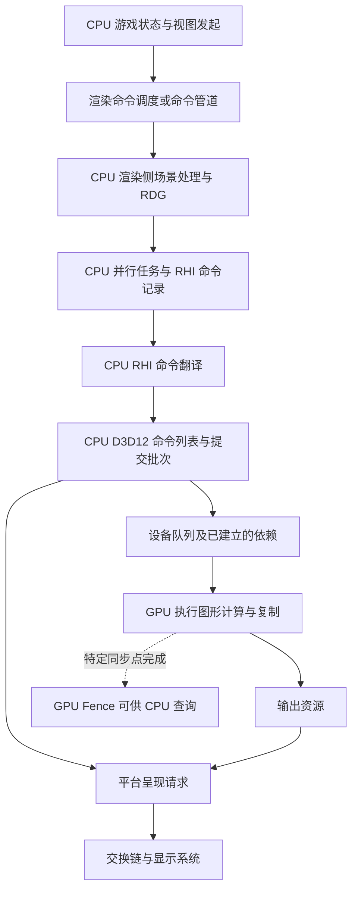
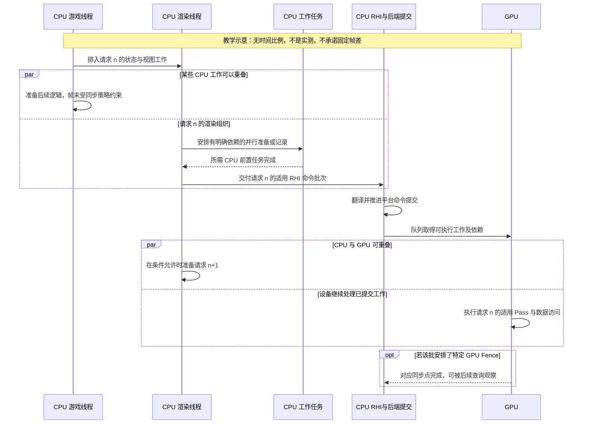

# 第 08 章：游戏线程、渲染线程、RHI 线程与 GPU

[返回目录](../README.md) · [本章答案](../appendices/answers/08-threads-and-gpu.md) · [一帧总览](00-frame-overview.md)

> **版本与范围：**UE 5.7.4，CL 51494982，Windows、D3D12、SM6、桌面延迟渲染，沿用[配置 A](../appendices/configuration.md)。本章讲解线程与执行组织，不改变材质、光照或阴影配置。不同线程模式按条件分开解释，不声称每台机器必定运行同样数量的线程。
>
> **证据边界：**源码结论已对照本地文件与上下文；两张图是教学示意，数值时间线是人为给定的模型。未启动 UE、未抓取 Trace、未测量输入延迟或 GPU 时间，观察步骤均待运行验证。下一章将专门讲解 RDG 的内部组织。

## 8.1 学习目标与前置知识

前面已经讨论了游戏对象怎样形成渲染表示，以及 View、ViewFamily 如何发起一帧工作。但游戏线程调用了渲染入口，并不表示它亲手完成了每个像素，也不表示返回时 GPU 已经画完。

本章要建立一条有明确边界的因果链：**游戏状态更新 → CPU 侧渲染工作 → RHI 命令 → 平台命令与提交 → GPU 执行 → 输出与呈现。** 每个箭头都要知道传递什么、谁负责、何时允许继续。

学完后应该能回答：

1. `ENQUEUE_RENDER_COMMAND` 排入的是什么，为什么不等于提交一次 GPU Draw？
2. 渲染线程、工作线程、RHI 专用线程和 RHI 任务模式如何分工？
3. `FRHICommandList` 的记录与执行、D3D12 命令列表的记录与队列提交有什么区别？
4. Render Fence、RHI 提交完成、GPU Fence 和交换链同步分别证明什么？
5. 为什么 CPU 可以处理下一份状态，而 GPU 还在处理之前的任务；怎样保持数据和对象的生命周期正确？

需要理解基础 C++ 函数、对象、指针和值拷贝，以及前几章的 Shader、缓冲和场景代理。不要求先掌握操作系统调度或无锁算法；本章会解释必要概念。P 仍表示红方块未被薄片覆盖的像素位置，Q 表示蓝色透明薄片覆盖方块的位置。

## 8.2 “一帧”跨越了不止一条执行线

### 8.2.1 CPU 线程与 GPU 不是同一类事物

**线程（Thread）**是操作系统和运行时组织 CPU 执行的单位。多个 CPU 线程可共享进程中的内存，并可能在多个处理器核心上同时运行。**任务（Task）**是一段由调度系统安排的工作；很多短任务可以先后借用同一条工作线程执行。

**GPU 队列（GPU Queue）**则接收供图形设备执行的命令。GPU Shader 中的线程或线程组是设备内部执行概念，不是操作系统里的 GameThread，也不是 RHIThread。

| 名称 | 在哪里工作 | 主要职责 | 本例中的典型数据 |
|---|---|---|---|
| 游戏线程，Game Thread，GT | CPU | 游戏逻辑、对象状态、视图发起，以及按引擎规则发布渲染更新 | 方块变换、灯光状态、摄像机取景 |
| 渲染线程，Render Thread，RT | CPU | 消费渲染侧状态，组织场景渲染、RDG 与相关绘制工作 | 场景代理、视图、Pass 参数和资源关系 |
| 工作线程，Worker Threads | CPU | 执行可并行的任务，受依赖与线程访问规则约束 | 可见性、绘制准备、并行命令记录或翻译等适用任务 |
| RHI 工作 | CPU | 将引擎 RHI 命令转换为后端操作，组织适用的提交 | 命令列表、平台上下文、提交批次 |
| GPU 执行 | 图形设备 | 顶点处理、光栅化、Shader、复制和其他设备任务 | 深度、GBuffer、颜色、历史纹理 |

**渲染硬件接口（Render Hardware Interface，RHI）**是 UE 连接底层图形后端的接口层。RHI 工作可放在专用线程、任务线程，或在没有独立 RHI 执行模式时由渲染侧承接。所以表中写“RHI 工作”，而没有先假定一定存在名为 RHIThread 的独立操作系统线程。

### 8.2.2 “帧 n”是教学标签，不是所有系统唯一共享的计数器

假设游戏逻辑在某次更新中把方块向右移动，随后为一个视图组织渲染。我们把与这次观察请求相关的工作简称为“帧 n”。实际代码同时存在游戏帧、渲染统计帧、GPU 事件和呈现计数，不能只看名字里带 Frame 的整数就认定它们一一相等。

一个游戏更新可能涉及主视图、场景捕获、编辑器窗口或多个 ViewFamily。一个 RDG 也不等于整个应用的一帧。线程时序研究必须先确定正在追踪哪份状态、哪个视图和哪次输出，而不是把所有活动压进一组固定编号。

## 8.3 先建立六个“完成”的层次

本章最重要的习惯是：看到函数返回或事件完成时，补问一句“完成到了哪里”。

| 层次 | 此刻已经发生什么 | 此刻还不能推出什么 |
|---|---|---|
| 渲染更新已发布 | CPU 已把适用的状态或更新任务交给后续执行机制 | 渲染侧已经使用新状态 |
| 渲染命令已执行 | 对应 C++ 回调已经运行，可能组织了图或记录了 RHI 命令 | GPU 已执行它所安排的工作 |
| RHI 命令已翻译 | CPU 已将记录重放到后端上下文，形成平台工作 | 平台队列已执行完这些工作 |
| 提交已推进 | 已把适用批次交给后端提交机制或设备队列，边界须按具体接口核对 | GPU 完成、显示器显示 |
| GPU Fence 已满足 | 对应同步范围内、在该信号之前建立依赖的 GPU 工作达到完成点 | 全部设备队列空闲、之后的工作也完成 |
| 呈现相关事件发生 | 应用或平台推进了交换链显示流程 | 用户眼睛在同一瞬间看见整张新图 |

这里特意把“RHI 提交完成”与“原生队列调用完成”也留出区分空间：D3D12 后端可能有自己的提交线程，后文会追踪。因此在没有读到具体实现前，不能让一个叫 `Submit` 的返回值自动代表最底层完成。

[打开命令层次静态图](../assets/diagrams/08-threads-and-gpu-1.png)



**[教学简化]**图表示职责与数据依赖，没有按比例表示时间，也没有承诺所有步骤都使用独立物理线程。指向呈现请求的箭头表示输出工作与呈现之间需要建立正确关系，不表示 CPU 必须先等待 GPU 完成整张输出才可调用 Present。

## 8.4 ENQUEUE_RENDER_COMMAND 到底排入了什么

### 8.4.1 排入的是 CPU 回调，不是 GPU 机器指令

游戏代码或引擎模块需要把某项渲染相关操作放到适用执行位置时，会使用 `ENQUEUE_RENDER_COMMAND`。概念示例：

```cpp
// [教学简化] ApplySnapshot 和目标句柄是示意接口，不是 UE 可直接编译示例。
// 前提：目标由其所有者保留到回调结束，Payload 不引用即将失效的游戏侧内存。
ENQUEUE_RENDER_COMMAND(UpdateTeachingScene)(
    [Target, Payload](FRHICommandListImmediate& RHICmdList)
    {
        Target->ApplySnapshot(Payload);
    });
```

括号中的 Lambda 是 C++ 回调。执行它的仍然是 CPU；里面可以更新渲染状态、分配或组织数据，也可以进一步调用 RHI。它没有天然对应一个 Draw，更不等于 GPU 已经运行一个 Shader。

`UpdateTeachingScene` 用作命令标识，有助于统计和跟踪；`Payload` 表示为消费方准备的数据；`RHICmdList` 是供需要的操作继续记录或执行 RHI 工作的接口。回调即使完全没有 Draw，也仍可以是一条有意义的渲染命令。

### 8.4.2 5.7 的宏入口已经包含命令管道

**[源码已确认]**本地 `RenderingThread.h` 第 1167 行的宏转到 `FRenderCommandDispatcher::Enqueue`。默认重载检查当前线程是否正在记录 `FRenderCommandList`；如果是，可以先记录到该列表，否则继续交给 `FRenderThreadCommandPipe`，见 [S08-01](#s08-01)。

**线程局部存储（Thread-Local Storage，TLS）**让每条 CPU 线程持有自己的上下文引用。此处它用于识别“当前是否处在收集渲染命令的上下文中”，不表示场景数据都自动成为线程私有副本。

**命令管道（Command Pipe）**把一组 CPU 渲染命令按约定组织、调度和重放。它与 RHI 命令列表、GPU 队列是不同层次。宏的另一些重载接受显式 `FRenderCommandPipe`，可以在适用条件下安排异步管道；不能仅凭看到宏就断言 Lambda 必定单独作为一个新任务运行在主渲染线程。

本地 `r.RenderCommandPipeMode` 注册了三种配置：`0` 为逐条任务方式，`1` 为主渲染线程命令管道，`2` 支持声明的各条管道。实际允许模式还会结合线程支持、Bypass 和平台等条件转换。注册默认值 `2` 不是本次未经运行的项目状态报告。

### 8.4.3 为什么有时入队，有时直接执行

**[源码已确认]** `FRenderThreadCommandPipe::Enqueue` 先检查调用者是否已经处在渲染线程，以及是否应交给渲染线程处理。需要转交时，启用管道则走 `EnqueueAndLaunch`，否则走 `TGraphTask<TRenderCommandTask<...>>`；适用的直接执行分支则立即调用 Lambda，见 [S08-02](#s08-02)。

因此“Enqueue”描述接口用途，不保证每次调用都经历一次跨线程切换。已经在合适执行上下文内，或关闭独立渲染线程时，路径可能不同。

这种差异也解释了一个调试陷阱：代码在单线程方式下看似正常，不证明它在异步调度时也正确。错误地捕获局部引用时，立即执行碰巧还来得及读取，延迟执行却可能读取已失效的数据。

## 8.5 TaskGraph、渲染线程和工作线程怎样协作

### 8.5.1 任务依赖决定“可以开始”，不等于“同时开始”

**任务图（Task Graph）**描述 CPU 任务之间的先后依赖。任务 B 需要 A 产生的数据，就要等待 A 的完成事件或其他明确同步关系。没有依赖的任务可以并行，但是否真的同时执行，还取决于可用核心、调度优先级及机器负载。

UE 源码会同时出现 TaskGraph 接口和 `UE::Tasks` 等任务工具。读者不需要在本章掌握全部调度内部实现，但要认出三种信息：任务想在哪种线程或上下文执行，依赖哪些先行任务，完成后谁可以继续。

**[源码已确认]**逐命令 TaskGraph 路径的 `GetDesiredThread` 返回渲染线程标识，`DoTask` 再调用 Lambda。`RenderingThreadMain` 把实际渲染线程注册到 TaskGraph，并进入 `ProcessThreadUntilRequestReturn`，见 [S08-02](#s08-02)。所以“渲染线程”并不是一个自己每帧从头扫描全部 Actor 的孤立循环，它在任务系统中消费已安排的工作。

### 8.5.2 主渲染线程仍可把工作交给其他 CPU 核心

如果每项可见性或绘制准备都由一个 CPU 核心顺序完成，很容易形成瓶颈。渲染系统可把适用工作拆为任务，组织依赖，之后合并结果或提交命令列表。

这里的“可并行”附带数据条件。例如两个任务可以分别记录到各自的命令列表；它们不能未经保护同时向同一个可变数组任意追加，也不能因为函数名含 Render 就安全地读取所有游戏对象。

**竞态（Race）**是执行结果依赖未受约束的访问时序。一个线程修改变换，另一个线程同时读取相同内存，可能读到不一致状态。对 C++ 普通共享对象发生未同步的冲突访问还可能构成数据竞争，并导致未定义行为。避免竞态需要明确数据归属、快照、同步和生命周期，不能仅靠“两个线程通常不在同一毫秒碰到”。

主渲染线程等待工作任务结束也未必是性能错误。若它确实需要这些结果，等待是依赖所要求的；性能问题在于是否存在可缩短的关键任务、过细的调度、负载不均或本可重叠却被提前等待的工作。

### 8.5.3 RDG 在此处属于 CPU 组织层

第 07 章的场景发起最终连接到场景渲染器。**[源码已确认]** `SceneRenderBuilder.cpp` 的渲染命令内部创建 `FRDGBuilder`，调用相应场景回调，之后 `GraphBuilder.Execute()`，见 [S08-03](#s08-03)。

RDG 是 **Render Dependency Graph，渲染依赖图**。构图时 CPU 描述 Pass、资源和依赖；执行图时又会组织实际工作，包括 Pass 的命令记录与任务安排。名称 `Execute` 是这个软件对象的执行入口，不是 GPU 设备完成通知。

一条渲染命令可能安排许多 Pass，某些工作又可交给并行任务。下一章会区分 RDG 构图、编译和执行，本章只要求你把它放在 CPU 组织层，而不把它画成 GPU 内部的另一条线程。

## 8.6 RHI 命令列表：把“现在要做什么”保存下来

### 8.6.1 FRHICommandList 是一层引擎命令表示

当 Base Pass 已经选定 Shader、资源和绘制参数，CPU 可以调用 `RHICmdList.DrawIndexedPrimitive(...)`。它不一定立刻进入 D3D12。

**[源码已确认]**该接口在 `Bypass()` 为假时使用 `ALLOC_COMMAND(FRHICommandDrawIndexedPrimitive)` 保存操作及参数；命令结构记录索引缓冲引用、起始位置、图元数和实例数等信息。在 Bypass 分支则直接调用上下文的对应接口，见 [S08-04](#s08-04)。

**记录（Recording）**就是把将来需要执行的操作组织到可消费的表示中。保存整数参数不等于复制整个索引缓冲；资源引用所指向的对象必须继续满足后续使用的生命周期契约。不能看见参数被“放入命令”就推导它依赖的全部数据都已深拷贝。

`FRHICommandListImmediate` 中的 Immediate 也不保证每个方法同步完成 GPU 工作。它承担立即命令列表和提交组织的特定职责；“立即”不是消除所有内部队列、驱动记录和设备异步的承诺。

### 8.6.2 RHI 的 Execute 首先是 CPU 重放

**[源码已确认]** `FRHICommandListBase::Execute` 遍历记录的命令，并调用各自的 `ExecuteAndDestruct`。索引绘制命令的 `Execute` 再连接到后端上下文的 `RHIDrawIndexedPrimitive`，见 [S08-05](#s08-05)。

这里销毁的是适用的 CPU 命令记录对象，不是宣称索引缓冲、平台命令列表和 GPU 绘制结果可以一起立刻释放。不同层次的对象由不同所有者和同步机制管理。

**翻译（Translation）**在这段执行链中是把引擎命令重放为平台后端操作，不是第 04 章把 HLSL 编译成 DXIL 的 Shader 编译。帧捕获里看到 `RHI_Translate`，应首先想到命令转换工作，而非“每帧重新编译全部材质”。

### 8.6.3 记录和翻译可以是两个不同的并行阶段

一些工作线程先各自记录 RHI 命令列表；随后适用列表又可并行翻译。**并行记录**回答“谁准备引擎命令”，**并行翻译**回答“谁把这些命令变成后端工作”。它们需要不同能力和依赖，不能用一个“多线程开关”概括全部情况。

**[源码已确认]** RHI 执行器分出 Dispatch、Translate 与 Submit 任务组织；翻译阶段调用命令列表 `Execute`，提交阶段收集已完成的平台命令列表并交给 `RHISubmitCommandLists`。并行翻译还要检查平台能力和控制变量，见 [S08-06](#s08-06)。

注意这里的 Dispatch 是 CPU 侧命令调度阶段名称，不一定是计算 Shader 的 `Dispatch`。同一个英文词出现在不同层次，必须看调用者、参数和消费对象。

## 8.7 RHI 线程可以有三种执行模式

### 8.7.1 专用线程、任务线程和无独立 RHI 执行

**[源码已确认]**本地启动渲染线程的路径根据平台支持和目标模式，选择 `DedicatedThread`、`Tasks` 或 `None`。这三种模式的全局标识也分别设置，见 [S08-07](#s08-07)。

| 模式 | CPU 工作怎样运行 | 读源码时怎样识别 | 容易误解之处 |
|---|---|---|---|
| 专用 RHI 线程 | 建立独立物理线程承接串行 RHI 工作，适用翻译仍可并行 | SeparateThread 与 DedicatedThread 为真 | 不代表所有 RHI 相关函数只会出现在一个线程 |
| RHI 任务模式 | 逻辑 RHI 工作由工作线程执行，并由任务依赖保持需要的顺序 | SeparateThread 为真、TaskThread 为真，DedicatedThread 为假 | `SeparateThread=true` 不保证存在一条固定物理 RHIThread |
| 无独立 RHI 模式 | 相应工作由渲染侧任务／调用上下文承接 | SeparateThread 为假 | 不等于 CPU 与 GPU 变成一个处理器，也不自动等于 Bypass |

任务模式尤其值得展开：`FTaskPipe::FTask` 保留逻辑线程标识，但把原本面向 RHIThread 的实际执行目标改为高优先级工作线程。源码注释明确任务仍以 RHI 标记执行，并通过依赖保持顺序。日志或分析工具中看到工作线程名称，不代表 RHI 逻辑消失了。

### 8.7.2 哪些工作必须按顺序，哪些可以分开

普通串行 RHI 提交管道需要保持其状态与命令顺序；支持并行翻译时，独立上下文中的适用列表可以先分别准备，再等待其完成条件并提交。

本地 `GetTranslateTaskPipe` 在不允许并行时选择渲染线程局部任务队列；允许并行但该批次不可并行时选择 RHI 管道；适用并行批次则使用工作任务。提交任务又根据独立 RHI 模式选择位置。不能把所有翻译任务都画到一个固定 RHI 条形上，也不能把工作任务数量当成 GPU 队列数量。

`r.RHICmd.ParallelTranslate.Enable` 表示允许使用该能力，并不保证当前每个命令列表都被并行翻译。列表属性、平台支持、配置和调试捕获条件也可能约束它。关闭功能进行对照可以帮助定位行为，但它本身不是“必定优化”或“必定更准确”的设置。

### 8.7.3 Bypass 跳过哪一层

**Bypass（旁路）**让一些 RHI API 调用直接进入后端上下文，省去通常的命令记录与随后重放。它可以让调试调用栈更直接，但并没有跳过 D3D12 命令列表，更没有让 GPU 在 C++ 调用返回前完成全部工作。

**[源码已确认]** `LatchBypass` 的实际选择结合当前线程、`r.RHICmdBypass` 与是否存在独立 RHI 执行模式；它不是只读取一个控制变量就无条件应用，见 [S08-08](#s08-08)。因此“关 RHI 线程”与“开 Bypass”是不同操作，不能使用同一个标签记录实验配置。

线程模式切换需要处理尚未完成的工作和所有权，因此可产生一次性的同步停顿。切换时卡了一次，不等于稳定帧耗时变差；切换后画面暂时正常，也不能证明之前的竞态已经修复。

## 8.8 D3D12 记录、提交与 GPU 执行仍然分开

### 8.8.1 调用 DrawIndexedInstanced 仍在 CPU 上记录

**[源码已确认]**本地 D3D12 的 `RHIDrawIndexedPrimitive` 检查参数和缓冲，准备绘制状态，再调用图形命令列表的 `DrawIndexedInstanced`，见 [S08-09](#s08-09)。

D3D12 命令列表是平台层的命令记录。它与 `FRHICommandList` 名字相近，但位于不同层次：前者给底层 API 和设备队列使用，后者给 UE 跨后端接口与调度使用。

CPU 记录到 `DrawIndexedInstanced` 后可以继续记录后面的工作；GPU 不会因为这个 C++ 方法返回就已执行到该 Draw。命令列表需要按规则关闭，并通过队列提交机制进入设备执行流程。

### 8.8.2 后端还可能有 RHISubmissionThread

**[源码已确认]** D3D12 后端 `SubmitPayloads` 将提交载荷排队。如果存在 SubmissionThread 就唤醒它，否则在调用线程上处理提交队列；`InitializeSubmissionPipe` 根据配置、平台和捕获工具支持决定是否创建该线程，见 [S08-10](#s08-10)。

**提交载荷（Submission Payload）**是后端为提交组织的一批工作及其关联信息，不一定刚好是一张图或一个 Pass。多个引擎命令列表可能形成一个提交批次，一个较大的渲染流程也可能分多批提交。

这说明“RHIThread 调用 Submit 返回”还需要结合后端定义解读。某些工作可能已交给另一条 CPU 提交线推进。最终 `ProcessSubmissionQueue` 会把适用的已关闭 D3D12 命令列表分批交给队列的 `ExecuteCommandLists`。

GPU 在队列顺序、同步依赖、资源状态和设备调度允许时执行工作。异步计算或复制队列能增加重叠机会，但共享硬件资源、带宽和数据依赖仍会限制并行；多个队列不是几张无限独立的显卡。

### 8.8.3 资源屏障不是让整个 CPU 停下来

**资源屏障（Resource Barrier）**表达资源使用方式、可见性和必要执行关系的转换，例如先写入某纹理，再让后续计算按正确方式读取。跨 GPU 队列还可能需要队列间同步点。

这些约束可以先由 CPU 记录，再由 GPU 在执行到相关位置时遵守。它们与 CPU 线程阻塞等待不是同一种操作。把“光照需要 Base Pass 结果”理解为“游戏线程必须在这里等待 GPU 画完 Base Pass”会失去大量本可存在的重叠。

同样，任意并行记录不能自动建立资源依赖。RDG 可以根据正确声明组织许多关系；使用原始 RHI 或外部资源时，还须满足相应接口契约。没有声明正确读写关系，增加线程并不会让顺序自动正确。

## 8.9 用一段示意时序看清跨帧重叠

[打开跨帧协作静态图](../assets/diagrams/08-threads-and-gpu-2.png)

下面只画一种可能关系。RHI 列合并表示逻辑 RHI 和适用 D3D12 提交工作；真实 Trace 可能拆成多条线程。图中的 `n` 与 `n+1` 是两份相邻的教学渲染请求，不是所有内部帧计数的保证。



### 8.9.1 重叠需要稳定数据，不是读取未来

游戏线程开始下一份逻辑时，渲染线程和 GPU 应使用各自已经获得且仍有效的表示。比如方块在游戏世界继续移动，之前请求的绘制不能突然在一半顶点处改读另一份变换。

这不要求每个对象每帧完整深拷贝。引擎可使用渲染代理、增量更新、双缓冲或多缓冲、受约束共享、帧分配区以及引用持有等机制。共同要求是：每个消费者使用的数据版本、修改时机和失效时机明确。

本章不是在宣称 UE 每个组件都恰好有两份副本。CPU 渲染表示、RHI 参数和 GPU 资源可能采用不同存储策略；“双缓冲”只是解决生产者和消费者重叠的一类办法。

### 8.9.2 吞吐率与单帧延迟不是一个数字

**吞吐率（Throughput）**表示稳定运行时单位时间能完成多少份工作；**延迟（Latency）**表示某次输入从发生到对应结果到达某个观察点花了多久。把帧率翻倍，不自动意味着输入到显示的全部延迟减半。

**[教学简化]**设四个完全独立、每份数据按顺序通过的阶段：游戏处理 `2 ms`、渲染准备 `3 ms`、后端处理 `1 ms`、GPU `6 ms`。忽略调度、资源争用和呈现，没有进一步分批；每个阶段一次只处理一份工作。

```text
完全串行处理一份：2 + 3 + 1 + 6 = 12 ms
充分填满流水后的理想完成间隔：max(2,3,1,6) = 6 ms
理想稳定吞吐率：1000 / 6 ≈ 166.7 份/秒
第一份结果在该模型中的最早完成时间仍为 12 ms
```

重叠提高的是不同请求之间的利用率，没有消除同一请求的数据依赖。真实程序还有任务间等待、阶段共享 CPU 核心、GPU 队列争用、显示同步和缓冲限制，不能用这四个假定数字预测实际 FPS。

## 8.10 帧末同步怎样限制生产者跑得太远

### 8.10.1 允许落后不等于必定落后一整帧

如果 CPU 一直比 GPU 快而不加限制，提交队列可能积累很多旧状态。即使帧率很高，玩家看到的也可能离当前输入越来越远。控制在途工作的数量能限制资源占用和延迟，但等待过早又可能降低重叠。

**[源码已确认]** `FFrameEndSync::Sync` 管理渲染线程 Fence，以及更深层的流水 Fence。`r.OneFrameThreadLag` 与 `r.GTSyncType` 影响何时等待、同步到哪个深度，见 [S08-11](#s08-11)。

该路径中，允许重叠时会保留一份渲染线程 Fence，以约束游戏线程与前一份渲染工作的关系；不允许时会等待更近的完成点。这描述的是该同步逻辑的边界，不表示每个时刻 RT 都必须比 GT 少处理恰好一帧。

GPU 可能比两者落后更多或更少，输入到显示还包含采样时刻、CPU 调度、设备队列与交换链。不能把 `r.OneFrameThreadLag=1` 翻译为“最终画面固定延迟一帧”，也不能把设为 `0` 翻译为“整个系统零延迟”。

### 8.10.2 r.GTSyncType 的本地实现需要结合外层条件

当允许重叠、没有进入强制线程同步时，本版本有以下组织方式：

| 选择 | 流水 Fence 的目标 | 本章应怎样理解 |
|---|---|---|
| `r.GTSyncType<=0` | RHI 深度，保留数量按 `2+(-值)` 计算 | 给 RHI 流水更大重叠空间，同时仍有独立的 RT 约束 |
| `r.GTSyncType=1` | RHI 深度，保留一份流水 Fence | 更紧地约束此前 RHI 翻译与提交的推进 |
| `r.GTSyncType>=2` 的实现分支 | 请求 Swapchain 深度，保留一份 | 平台支持和 VSync 等条件影响实际同步目标 |

表格是源码条件解释，不是建议初学者用极端负值扩张队列。完整同步路径会改用零重叠；Swapchain 模式在 `r.VSync=0` 时回退到 RHI 深度，部分平台还不支持相应交换链追踪。

因此阅读控制变量时应同时记录请求值与实际运行环境。只看一个默认注册值，既不能确认线程是否存在，也不能确认观察到的 Frame 时间由哪个阶段决定。

## 8.11 Fence、Flush 和 Wait：等待的边界必须写清楚

### 8.11.1 FRenderCommandFence 有明确同步深度

**栅栏（Fence）**在本章表示一个可追踪的完成边界。它不是把所有线程永久锁住的物理墙；它让需要结果的消费者知道某个范围的工作是否已经到达约定位置。

**[源码已确认]** `FRenderCommandFence::BeginFence` 默认深度是 `RenderThread`。本地头文件定义了三种深度，而不是“Render Fence 永远只支持一种等待”，见 [S08-12](#s08-12)。

| 深度 | 信号依据 | 不能据此声称 |
|---|---|---|
| `RenderThread` | 渲染侧命令到达标记，必要的管道先行任务也纳入完成关系 | GPU 已画完；此后不再有新命令 |
| `RHIThread` | 此前适用的并行翻译与提交工作达到完成点 | 所有提交的 GPU 工作已经执行完成 |
| `Swapchain` | 依据平台交换链 Flip 的推进触发 | 任意纹理读回就绪；显示器所有像素已在同一时刻发光 |

`BeginFence` 用于放置追踪点，`IsFenceComplete` 用于查询，`Wait` 让调用方等待该完成关系。默认 RenderThread Fence 常用于判断此前分离或释放渲染侧引用的命令是否已消费。

Fence 能保证的是它所覆盖的先行关系。如果另一线程随后又排入对同一对象的访问，这不在一个更早 Fence 的保护范围内。多个生产者和异步管道需要正确的停止生产、依赖和销毁协议，不能在任意位置放一个 Fence 就宣布全部共享访问安全。

### 8.11.2 FRHIGPUFence 关注 GPU 达到某个同步点

**GPU Fence**用来观察设备端工作是否达到约定边界。例如 CPU 希望读取某个 GPU 计算结果，必须先安排向可读回资源的复制，并确保复制完成后才读取。

**[源码已确认]** `FRHIGPUFence::Poll` 的契约要求 Fence 已插入并被 GPU 信号满足。本地 D3D12 实现查询对应 SyncPoint 是否完成，没有同步点时返回 false；写 Fence 会建立相应的 GPU／CPU 同步点，并在 RHI 命令执行时向上下文安排信号，见 [S08-13](#s08-13)。

一个 Fence 默认只代表它覆盖的资源依赖、队列位置及 GPU 范围。其他无依赖队列的工作或信号之后的命令仍可能运行。CPU 想读 P 的最终颜色时，还须确认读回的资源、格式、区域和复制阶段正确；GPU 已完成一份深度复制不等于最终颜色也可读。

不要把 `while (!Fence->Poll()) {}` 当成便宜的等待。接口注释明确指出某些平台需要 RHI 线程继续推进提交才能让信号到达，忙等可能阻断所需进展。需要阻塞时使用符合线程要求的等待接口，但通常更应在未完成时继续有用工作，稍后再查。

### 8.11.3 异步读回把“以后再取”做成明确协议

**读回（Readback）**是把 GPU 结果转到 CPU 可读取的资源或内存。**暂存缓冲（Staging Buffer）**承担适用的数据转移，而不是让 CPU 直接解引用显存纹理对象。

**[源码已确认]** `FRHIGPUBufferReadback::EnqueueCopy` 先调用 `CopyToStagingBuffer`，再 `WriteGPUFence`。`FRHIGPUMemoryReadback::IsReady()` 检查适用的待写命令计数和 Fence；之后 `Lock` 取得可读数据，见 [S08-14](#s08-14)。这里选取缓冲读回作为同步协议例子，不把它直接当作纹理 P 像素的完整 API。

概念上的工作协议是：安排请求 → 让命令提交与 GPU 复制继续推进 → 稍后检查就绪 → 读取并完成解锁 → 按约定复用或释放。每次查询不会自动保证结果属于当前游戏帧；应给请求带上自身标识或记录来源视图，避免把旧结果误认成新状态。

### 8.11.4 FlushRHIThread 并不等于 GPU 空闲

**Flush（推进并按范围清理待办）**是容易被名字误导的词。不同 Flush 操作可能等待任务、推进提交、回收适用对象或等待 CPU RHI 流水；必须看枚举与实现，不能统称“清空 GPU”。

**[源码已确认]** `ImmediateFlush` 根据模式设置提交标志：`WaitForOutstandingTasksOnly` 只等待适用任务；较深模式加入 `FlushRHIThread` 或资源删除标志，再调用 RHI 提交执行器。执行器等待的 CompletionEvent 属于其 CPU 流水完成关系，见 [S08-15](#s08-15)。这不同于对目标 GPU 工作写 Fence 后等待它满足。

`FlushRenderingCommands` 本地实现还会停止相应管道记录、安排 RHI 刷新与资源处理，并通过 `FFrameEndSync` 做线程同步。它比一条默认 Render Fence 涉及更多 CPU 清理工作，但仍不能不看资源后端与同步契约就断言“整块显卡从此没有任何工作”。

遇到生命周期错误时，在每次 Tick 加一次全局 Flush 可能让现象消失，却也可能只是把原本重叠的访问强制串行。应修正对象归属和完成边界，而不是把大量阻塞作为正常每帧协议。

## 8.12 对象生命周期：函数返回不意味着消费者用完

### 8.12.1 值快照与指针捕获有不同含义

设游戏线程希望把方块的位置和颜色交给渲染侧。把可复制的小结构按值捕获，能保留这些数值；把 `this` 或裸指针按值捕获，仅复制一个地址，不会自动延长目标对象的生命周期，也不会让它的成员变成线程安全。

更危险的是捕获栈上临时数据的引用：

```cpp
// [教学简化：错误示例] 回调可能在该函数返回后才执行。
LocalPayload Payload = BuildPayload();
EnqueueLater([&Payload] { Consume(Payload); });
```

当回调执行时，`Payload` 可能已经销毁。改成值捕获只解决这个局部结构自身的问题；如果结构里还保存指向临时数组的裸指针，底层数组仍可能失效。需要拥有实际数据或满足清晰的外部保留契约。

**悬空引用（Dangling Reference）**指向已结束生命周期的对象。**使用已释放内存（Use After Free）**可能表现为偶发崩溃、错误颜色或只在快速切场景时失败。它与 Shader 数学错误完全不同，增加材质精度不会修复这种问题。

### 8.12.2 游戏对象、渲染表示和 GPU 资源分别退出

玩家删除方块时，至少要区分三个事实：游戏不再把它当作活动对象；渲染侧不再安排它的新工作；此前已经记录或提交的工作不再访问相应资源。三者不必在同一个时刻发生。

**[源码已确认]** `UPrimitiveComponent::BeginDestroy` 放置 `DetachFence`，`IsReadyForFinishDestroy` 把 Fence 是否完成纳入销毁完成条件，见 [S08-16](#s08-16)。源码注释明确它跟踪场景分离命令的消费。这是对象销毁协议中的一个环节，不表示组件等待所有 GPU 队列整体空闲后才可回收。

适用的 `FRenderResource` 通过 `BeginReleaseResource` 安排渲染侧释放；函数返回时，释放回调可能尚未执行。调用方必须保持资源对象活到对应回调可以安全完成。某些调用采用批量释放，进一步说明“开始释放”和“内存立即消失”不能混用。

**[源码已确认]** RHI 资源还有 `MarkForDelete` 与待删除队列；D3D12 资源也有后端延迟删除入口，见 [S08-17](#s08-17)。具体显存复用时机由资源类型、后端和 GPU 同步关系决定。本章不把某个 CPU 引用计数降为零的时刻直接当作所有底层内存立刻可复用的时刻。

### 8.12.3 保留数据、保留对象与禁止修改是三件事

持有引用可以帮助对象存活，但不能保证读取期间内容不被另一个线程修改。加锁可以限制并发访问，但锁本身不会自动延长锁外引用的对象寿命。等待一个任务完成也只覆盖该任务与已声明的先行关系，不会取消后来发生的访问。

因此设计一次跨线程更新要回答：谁拥有数据，谁允许修改，怎样交给消费者，消费者完成由什么事件证明，何时停止产生新访问，最后由谁释放。第 06 章的场景代理与更新机制就是在这样的约束下工作，而不是一份为了起名好看而复制的 Actor。

## 8.13 回到 P、Q：同时发生并不等于数据可以混用

### 8.13.1 方块移动时，消费者各自读到了什么

把一次移动后的适用状态记为 `Transform_n`。游戏线程整理或标记更新后，渲染侧通过其更新机制取得它；CPU 绘制准备使用该请求所需的渲染表示；GPU 再从绑定的场景数据与参数获得位置。

如果游戏线程随后产生 `Transform_n+1`，它不应无约束覆盖 GPU 仍在读取的同一段参数。引擎需要通过适用的缓冲和同步策略保护在途读取。P 可能在不同请求中看到不同表面位置，但一份结果内部不能因为 CPU 更新抢先而随意混入不一致变换。

材质 Tint 也有同样问题。透明 Q 还包含背景和薄片的组合：背景属于适用视图的颜色结果，薄片数据也必须遵循该渲染工作的资源关系。CPU 开始下一次逻辑不意味着可把正在合成的背景纹理随意复用成另一张图。

### 8.13.2 三个实际提问方式

| 观察或需求 | 应追踪的证据 | 不够充分的证据 |
|---|---|---|
| 点光强度已改，但画面尚未反映 | 游戏状态发布、渲染更新消费、对应视图、GPU 与呈现推进 | 游戏 setter 已返回 |
| 想从 CPU 读取 Q 的颜色 | 确定输出阶段与格式，复制到读回资源，等待该复制的 GPU 完成 | 默认 Render Fence 完成 |
| 删除方块后准备释放数据 | 停止新访问，场景分离消费，适用 CPU 与 GPU 资源生命周期契约 | 当前屏幕肉眼已看不到方块 |

这些问题不是要求所有代码都逐像素带一套 Fence。绝大部分常规对象应使用现有组件、代理和资源 API 的生命周期管理。本章让你理解这些 API 为什么存在，以及什么时候需要继续向下一层核查。

## 8.14 动手观察：读时间线而不是背帧差

> **[尚未验证]**本节只提供观察方法。源码确认了所列查询和 Trace 入口，但没有在本机执行这些命令，也没有生成真实性能结论。实验使用开发或编辑器环境；裁剪过的打包配置可能缺少相应命令或跟踪事件。

### 8.14.1 先只读记录当前模式

进入配置 A 的 Standalone 游戏，在同一会话中逐行查询：

```text
r.RHIThread.Enable
r.RenderCommandPipeMode
r.RHICmdBypass
r.RHICmd.ParallelTranslate.Enable
r.OneFrameThreadLag
r.GTSyncType
r.VSync
rhi.UseSubmissionThread
```

`r.RHIThread.Enable` 在本版本是控制台命令：不带参数时报告用法及当前模式；带 `0`、`1`、`2` 才请求修改。其他所列项目主要为控制变量查询。`rhi.UseSubmissionThread` 在本地注册为只读配置，不在本章热切换它。

记录引擎版本、平台、当前模式、VSync、画质和观察场景。查询值只能说明一部分配置，仍需通过实际线程与事件判断执行位置；特别是任务模式下，缺少一条物理 RHIThread 并不表示功能关闭。

### 8.14.2 记录短 Trace 并找出有意义的关系

**Unreal Insights**是 UE 的性能与事件分析工具；**Trace（跟踪记录）**保存时间范围内的事件。这里用文件跟踪，避免把操作步骤写成外部服务连接。先停止已有不需要的跟踪，再启动本次记录；如果正在进行其他诊断，应保持其会话并单独安排实验。

```text
Trace.File cpu,frame,bookmark,rendercommands,rhicommands
Trace.Bookmark Chapter08_Begin
```

`Trace.File` 可省略路径，由运行环境选择默认输出位置；按日志报告找到实际文件，不假定所有机器写入同一个绝对路径。本地已将旧 `Trace.Start` 标为弃用入口，本章使用 `Trace.File`，见 [S08-18](#s08-18)。

让静止场景运行一小段，随后在游戏中移动相机，再结束：

```text
Trace.Bookmark Chapter08_End
Trace.Stop
```

在 Unreal Insights 打开日志报告的 `.utrace` 文件，找到两个书签之间的 CPU 时间范围。查看游戏线程、渲染线程、工作线程以及可见的 RHI／提交线程，搜索 `SceneRenderBuilder_Render`、`RHI_Translate`、`RHI_SubmitToGPU` 或渲染命令管道相关事件。

事件是否出现受编译配置、通道、分支和工具显示设置影响。这里记录的是 CPU 事件；**没有开启或取得 GPU 跟踪时，不能凭 CPU 的 Draw／Submit 时间段推断 GPU 精确开始和结束时间。** GPU 队列分析留到性能实践章节按设备支持与跟踪设置执行。

先回答三个具体问题：主渲染线程是否等待工作任务，RHI 翻译发生在哪些线程，CPU 提交事件与下一份游戏工作是否存在时间重叠。时间线上的空白可能是等待、没有记录事件或线程未执行本任务，需要结合通道与调用栈，而不能立即解释为机器空闲。

### 8.14.3 只改一个同步设置做可恢复对照

保持场景、相机运动、曝光与分辨率不变，先记录原始 `r.OneFrameThreadLag`。单独设为 `0`，待切换后的运行稳定，再记录同样一段 CPU Trace；完成后恢复原值。不要同时关闭 RHI 线程、打开 Bypass 又更改 VSync，否则很难确定变化来自哪里。

预期是适用帧末同步关系变化，可能减少 CPU 超前，也可能增加等待、降低吞吐。它不保证肉眼延迟降低某个固定毫秒数，更不代表 GPU 所有工作从此与游戏线程同步完成。比较等待位置和工作重叠，比只比较一张 FPS 截图更有解释力。

**本章不要求初学者编写每帧阻塞读回或全局 Flush 实验。**这些操作会直接改变所研究的流水状态。需要研究读回时，应采用前述异步协议并记录请求到就绪的关系，而不是先把所有工作强制等待完再把结果称为正常延迟。

### 8.14.4 观察失败时怎样排查

| 现象 | 优先检查 | 解释边界 |
|---|---|---|
| 看不到 RHIThread | 当前模式是否为 Tasks／None，轨道是否隐藏 | 物理线程名不是逻辑职责的唯一证据 |
| 看不到渲染命令事件 | RenderCommands 通道、构建配置、实际执行路径 | 没记录不等于没执行 |
| Submit 很短但画面很慢 | GPU 跟踪、队列等待、呈现节奏、是否观察了正确进程 | CPU 交付快不保证设备完成快 |
| GT 有大段等待 | 等待目标、帧末策略、工作任务与后台负载 | 等待可能是下游慢的结果，而非 GT 自身计算慢 |
| 切模式瞬间卡顿 | 是否发生线程重启、Flush 或资源准备 | 一次性切换成本不代表稳定帧成本 |
| 关并行后崩溃消失 | 共享访问、引用生命周期和依赖关系 | 串行化可隐藏竞态，不是正确性证明 |
| Readback 尚未就绪 | 请求是否提交，GPU 是否推进，查询是否过早 | 默认 Render Fence 不能替代复制的 GPU Fence |

## 8.15 性能判断：先找关键依赖，再谈增加线程

**关键路径（Critical Path）**是完成目标前必须依次完成的那串约束与工作。很多核心同时忙碌也可能有一条长关键路径；某条线程耗时很长，也可能主要在等待另一条路径。

如果 GPU 已饱和，给 CPU 侧再加很多绘制准备任务未必提高帧率，甚至可能增加超前队列和资源压力。如果 CPU 准备慢而 GPU 等待输入，减少任务调度开销、改善分批和缓存才可能让设备保持工作。应先从时间线确认瓶颈位置，再选择优化方向。

任务太细会增加调度、分配和依赖管理成本；任务太粗会导致负载不均，让其他核心提前空闲。并行翻译阈值、命令合并和串行批次之间也存在这种权衡。控制变量帮助进行有证据的对照，不能作为跨项目通用的一组“最高性能值”。

不要把 Game、Draw、RHI 与 GPU 的耗时相加当成最终帧耗时。它们可能重叠、包含等待，统计窗口和计数也未必完全对应同一份请求。FPS、GPU 时间、CPU 工作量和输入到显示延迟分别回答不同问题。

## 8.16 源码证据表与跟读顺序

以下为本地 UE 5.7.4、CL 51494982 的静态核对入口。`Source/...` 相对路径以 Engine 为根；链接冒号后的数字是核对时行号。升级后按符号重新查找。链接用于本机阅读，GitHub 不能直接访问你的引擎安装目录。

| 想验证的问题 | 入口 | 已确认的内容 |
|---|---|---|
| 渲染命令到哪执行？ | [S08-01](#s08-01)、[S08-02](#s08-02)、[S08-03](#s08-03) | 宏、管道、TaskGraph、渲染线程与 RDG 边界 |
| RHI 命令怎样变成平台操作？ | [S08-04](#s08-04)、[S08-05](#s08-05)、[S08-06](#s08-06) | 保存参数、CPU 重放、翻译与提交任务 |
| 是否必定有一条 RHI 线程？ | [S08-07](#s08-07)、[S08-08](#s08-08) | 三种模式、逻辑任务与 Bypass 条件 |
| D3D12 方法返回是否代表 GPU 完成？ | [S08-09](#s08-09)、[S08-10](#s08-10) | 平台记录、后端提交线程与队列交付 |
| Fence 和 Flush 等到了哪里？ | [S08-11](#s08-11) 至 [S08-15](#s08-15) | 帧末策略、同步深度、GPU 完成与读回 |
| 释放与观察有何依据？ | [S08-16](#s08-16) 至 [S08-18](#s08-18) | 组件销毁、资源释放与 Trace 命令 |

<a id="s08-01"></a>

**S08-01：宏与命令管道。** [RenderingThread.h:1167](G:/UnrealEngineInstalled/UE_5.7/Engine/Source/Runtime/RenderCore/Public/RenderingThread.h:1167)，相对路径 `Source/Runtime/RenderCore/Public/RenderingThread.h`。宏展开到 `FRenderCommandDispatcher::Enqueue`；[1081](G:/UnrealEngineInstalled/UE_5.7/Engine/Source/Runtime/RenderCore/Public/RenderingThread.h:1081) 的默认重载先检查 TLS 记录上下文，第 1091 行进入主线程管道；第 1095 行起另有显式管道重载。相应模式注册及允许条件在 [RenderingThread.cpp:109](G:/UnrealEngineInstalled/UE_5.7/Engine/Source/Runtime/RenderCore/Private/RenderingThread.cpp:109)，相对路径 `Source/Runtime/RenderCore/Private/RenderingThread.cpp`。不要继续把本版本宏描述成已弃用的 `TEnqueueUniqueRenderCommandType` 固定调用链。

<a id="s08-02"></a>

**S08-02：直接执行、任务与主渲染线程。** [RenderingThread.h:594](G:/UnrealEngineInstalled/UE_5.7/Engine/Source/Runtime/RenderCore/Public/RenderingThread.h:594) 检查执行上下文和管道模式，第 609 行创建 TaskGraph 任务，第 615 行是直接 Lambda 分支；同文件 [539](G:/UnrealEngineInstalled/UE_5.7/Engine/Source/Runtime/RenderCore/Public/RenderingThread.h:539) 指定目标渲染线程，第 563 行执行回调。[RenderingThread.cpp:226](G:/UnrealEngineInstalled/UE_5.7/Engine/Source/Runtime/RenderCore/Private/RenderingThread.cpp:226) 的 `RenderingThreadMain` 注册命名线程，第 260 行处理任务。相对目录同 S08-01。

<a id="s08-03"></a>

**S08-03：渲染命令中的 RDG。** [SceneRenderBuilder.cpp:829](G:/UnrealEngineInstalled/UE_5.7/Engine/Source/Runtime/Renderer/Private/SceneRenderBuilder.cpp:829)，相对路径 `Source/Runtime/Renderer/Private/SceneRenderBuilder.cpp`。排入的 CPU Lambda 在第 872 行建立 `FRDGBuilder`，第 891 行在适用分支调用场景回调，第 915 行 `GraphBuilder.Execute`。这把场景发起与图执行连起来，不是 GPU 完成证据。

<a id="s08-04"></a>

**S08-04：RHI 索引绘制记录。** [RHICommandList.h:3973](G:/UnrealEngineInstalled/UE_5.7/Engine/Source/Runtime/RHI/Public/RHICommandList.h:3973)，相对路径 `Source/Runtime/RHI/Public/RHICommandList.h`。Bypass 分支直接调用上下文；普通分支保存 `FRHICommandDrawIndexedPrimitive`。命令数据结构在同文件 [1841](G:/UnrealEngineInstalled/UE_5.7/Engine/Source/Runtime/RHI/Public/RHICommandList.h:1841)，可看到保存的是绘制参数与资源地址，不是整份 GPU 内容拷贝。

<a id="s08-05"></a>

**S08-05：CPU 命令重放。** [RHICommandList.cpp:518](G:/UnrealEngineInstalled/UE_5.7/Engine/Source/Runtime/RHI/Private/RHICommandList.cpp:518)，相对路径 `Source/Runtime/RHI/Private/RHICommandList.cpp`。第 547 行执行并销毁记录对象；[RHICommandListCommandExecutes.inl:148](G:/UnrealEngineInstalled/UE_5.7/Engine/Source/Runtime/RHI/Public/RHICommandListCommandExecutes.inl:148) 将索引绘制连接到上下文，后者位于 `Source/Runtime/RHI/Public/`。所谓 Execute 在此处仍是 CPU 调用。

<a id="s08-06"></a>

**S08-06：RHI Dispatch、Translate 与 Submit。** [RHICommandList.cpp:771](G:/UnrealEngineInstalled/UE_5.7/Engine/Source/Runtime/RHI/Private/RHICommandList.cpp:771) 组织调度任务，第 785 行选择翻译任务位置，第 814 行安排提交任务；[1054](G:/UnrealEngineInstalled/UE_5.7/Engine/Source/Runtime/RHI/Private/RHICommandList.cpp:1054) 的翻译第 1097 行重放命令；[1247](G:/UnrealEngineInstalled/UE_5.7/Engine/Source/Runtime/RHI/Private/RHICommandList.cpp:1247) 把完成的平台列表交给 RHI 后端。第 1392 行附近还检查并行翻译平台与配置条件，第 1483 行安排依赖翻译结果的提交。相对目录同 S08-05。

<a id="s08-07"></a>

**S08-07：三种 RHI 模式。** [RenderingThread.cpp:585](G:/UnrealEngineInstalled/UE_5.7/Engine/Source/Runtime/RenderCore/Private/RenderingThread.cpp:585) 分别设置 DedicatedThread、Tasks 和 None 标志；[1434](G:/UnrealEngineInstalled/UE_5.7/Engine/Source/Runtime/RenderCore/Private/RenderingThread.cpp:1434) 定义 `r.RHIThread.Enable` 参数和无参查询行为。[RHICommandList.cpp:562](G:/UnrealEngineInstalled/UE_5.7/Engine/Source/Runtime/RHI/Private/RHICommandList.cpp:562) 在任务模式将逻辑 RHIThread 映射到实际工作线程，第 570 行注释明确没有物理专用 RHI 线程。相对路径分别见 S08-01 与 S08-05。

<a id="s08-08"></a>

**S08-08：Bypass 的实际选用。** [RHICommandList.cpp:1736](G:/UnrealEngineInstalled/UE_5.7/Engine/Source/Runtime/RHI/Private/RHICommandList.cpp:1736) 的 `LatchBypass` 第 1754 行结合线程和独立 RHI 状态计算选择；同文件 [52](G:/UnrealEngineInstalled/UE_5.7/Engine/Source/Runtime/RHI/Private/RHICommandList.cpp:52) 为变量注册，第 64 行为并行翻译开关。配置值、实际生效与最终性能需分别核验。

<a id="s08-09"></a>

**S08-09：D3D12 绘制记录。** [D3D12Commands.cpp:1270](G:/UnrealEngineInstalled/UE_5.7/Engine/Source/Runtime/D3D12RHI/Private/D3D12Commands.cpp:1270)，相对路径 `Source/Runtime/D3D12RHI/Private/D3D12Commands.cpp`。检查资源后，第 1295 行准备状态，第 1297 行 `DrawIndexedInstanced` 记录到图形命令列表。这是 CPU 调用底层记录接口。

<a id="s08-10"></a>

**S08-10：后端提交并非只有一条固定线程。** [D3D12Submission.cpp:153](G:/UnrealEngineInstalled/UE_5.7/Engine/Source/Runtime/D3D12RHI/Private/D3D12Submission.cpp:153)，相对路径 `Source/Runtime/D3D12RHI/Private/D3D12Submission.cpp`。第 174 行可创建 `RHISubmissionThread`；[332](G:/UnrealEngineInstalled/UE_5.7/Engine/Source/Runtime/D3D12RHI/Private/D3D12Submission.cpp:332) 的 `SubmitPayloads` 在专用提交线程和调用线程处理之间分支；[827](G:/UnrealEngineInstalled/UE_5.7/Engine/Source/Runtime/D3D12RHI/Private/D3D12Submission.cpp:827) 把适用批次交给队列。第 19 行的 `rhi.UseSubmissionThread` 注册为只读配置，捕获工具支持还会影响线程启用。

<a id="s08-11"></a>

**S08-11：帧末限制重叠。** [RenderingThread.cpp:2431](G:/UnrealEngineInstalled/UE_5.7/Engine/Source/Runtime/RenderCore/Private/RenderingThread.cpp:2431) 注册两项同步变量；[2476](G:/UnrealEngineInstalled/UE_5.7/Engine/Source/Runtime/RenderCore/Private/RenderingThread.cpp:2476) 的 `FFrameEndSync::Sync` 根据完整同步、GTSyncType 和 VSync 选择 Fence 深度与保留数量。第 2515 行管理 RT Fence，第 2566 行放流水 Fence，第 2579 行等待。相对路径见 S08-01；参数约束不能解释成固定端到端延迟。

<a id="s08-12"></a>

**S08-12：Render Fence 深度。** [RenderCommandFence.h:17](G:/UnrealEngineInstalled/UE_5.7/Engine/Source/Runtime/RenderCore/Public/RenderCommandFence.h:17)，相对路径 `Source/Runtime/RenderCore/Public/RenderCommandFence.h`。定义三种深度，第 35 行默认 RenderThread。实现 [RenderingThread.cpp:978](G:/UnrealEngineInstalled/UE_5.7/Engine/Source/Runtime/RenderCore/Private/RenderingThread.cpp:978) 将适用管道事件纳入依赖；第 1037 行请求 Flip 事件，第 1044 行把 RHI 提交完成加入前置，第 1048 行触发渲染侧事件。`Wait` 在第 1258 行等待这份任务关系，而不是统一轮询一个 GPU Fence。

<a id="s08-13"></a>

**S08-13：GPU Fence 的完成契约。** [RHIResources.h:2396](G:/UnrealEngineInstalled/UE_5.7/Engine/Source/Runtime/RHI/Public/RHIResources.h:2396)，相对路径 `Source/Runtime/RHI/Public/RHIResources.h`，说明 Poll 与忙等限制；第 2428 行说明 Wait 的线程与停顿边界。[D3D12DirectCommandListManager.cpp:26](G:/UnrealEngineInstalled/UE_5.7/Engine/Source/Runtime/D3D12RHI/Private/D3D12DirectCommandListManager.cpp:26) 查询 SyncPoint，未插入时返回 false；[56](G:/UnrealEngineInstalled/UE_5.7/Engine/Source/Runtime/D3D12RHI/Private/D3D12DirectCommandListManager.cpp:56) 创建并安排信号。后者位于 `Source/Runtime/D3D12RHI/Private/`。

<a id="s08-14"></a>

**S08-14：复制后再写 Fence 的读回例子。** [RHIGPUReadback.cpp:38](G:/UnrealEngineInstalled/UE_5.7/Engine/Source/Runtime/RHI/Private/RHIGPUReadback.cpp:38)，相对路径 `Source/Runtime/RHI/Private/RHIGPUReadback.cpp`。第 52 行安排缓冲复制，第 53 行写 GPU Fence，后面的 Lock 通过暂存接口读取。[RHIGPUReadback.h:32](G:/UnrealEngineInstalled/UE_5.7/Engine/Source/Runtime/RHI/Public/RHIGPUReadback.h:32) 给出无参 `IsReady` 的检查，位于 `Source/Runtime/RHI/Public/`。此处只说明缓冲读回协议，不保证任意纹理格式都能照搬该调用。

<a id="s08-15"></a>

**S08-15：Flush 的等待范围。** [RHICommandList.cpp:1573](G:/UnrealEngineInstalled/UE_5.7/Engine/Source/Runtime/RHI/Private/RHICommandList.cpp:1573) 根据 FlushType 构造提交标志；[1497](G:/UnrealEngineInstalled/UE_5.7/Engine/Source/Runtime/RHI/Private/RHICommandList.cpp:1497) 根据标志决定等待 CPU CompletionEvent。[RenderingThread.cpp:1272](G:/UnrealEngineInstalled/UE_5.7/Engine/Source/Runtime/RenderCore/Private/RenderingThread.cpp:1272) 的全局刷新另含管道、资源与线程同步。这些代码不提供“GPU 上所有工作完成”的通用保证。

<a id="s08-16"></a>

**S08-16：组件分离与销毁完成。** [PrimitiveComponent.cpp:1890](G:/UnrealEngineInstalled/UE_5.7/Engine/Source/Runtime/Engine/Private/Components/PrimitiveComponent.cpp:1890)，相对路径 `Source/Runtime/Engine/Private/Components/PrimitiveComponent.cpp`。第 1903 行 `DetachFence.BeginFence` 跟踪场景分离消费；[1940](G:/UnrealEngineInstalled/UE_5.7/Engine/Source/Runtime/Engine/Private/Components/PrimitiveComponent.cpp:1940) 要求 Fence 完成后才允许后续销毁完成。不能把对象销毁的这层判断代替 GPU 内存生命周期管理。

<a id="s08-17"></a>

**S08-17：多层资源释放。** [RenderResource.cpp:369](G:/UnrealEngineInstalled/UE_5.7/Engine/Source/Runtime/RenderCore/Private/RenderResource.cpp:369)，相对路径 `Source/Runtime/RenderCore/Private/RenderResource.cpp`，在适用分支排入 `ReleaseResource`，还支持批量释放。[RHIResources.cpp:46](G:/UnrealEngineInstalled/UE_5.7/Engine/Source/Runtime/RHI/Private/RHIResources.cpp:46) 把标记删除的 RHI 对象送入待处理队列。[D3D12RHIPrivate.h:242](G:/UnrealEngineInstalled/UE_5.7/Engine/Source/Runtime/D3D12RHI/Private/D3D12RHIPrivate.h:242) 为后端延迟删除入口。后两者相对目录分别为 `Source/Runtime/RHI/Private/` 和 `Source/Runtime/D3D12RHI/Private/`；完整删除时机须继续追踪具体资源类型，本章不做未经核实的统一帧数承诺。

<a id="s08-18"></a>

**S08-18：观察命令与事件通道。** [TraceAuxiliary.cpp:1591](G:/UnrealEngineInstalled/UE_5.7/Engine/Source/Runtime/Core/Private/ProfilingDebugging/TraceAuxiliary.cpp:1591)，相对路径 `Source/Runtime/Core/Private/ProfilingDebugging/TraceAuxiliary.cpp`，注册 `Trace.File [Path] [ChannelSet]`，两参数允许省略；第 1602 行为 Stop，第 1665 行为 Bookmark，旧 Start 的说明位于第 1583 行。CPU RenderCommands 通道注册见 [RenderingThread.cpp:46](G:/UnrealEngineInstalled/UE_5.7/Engine/Source/Runtime/RenderCore/Private/RenderingThread.cpp:46)，RHICommands 通道见 [RHICommandList.cpp:33](G:/UnrealEngineInstalled/UE_5.7/Engine/Source/Runtime/RHI/Private/RHICommandList.cpp:33)。通道存在不代表本批已经记录过事件。

建议按 S08-01／02 → S08-03 → S08-04／05／06 → S08-09／10 跟一次命令，再按 S08-12／13／14 对照完成语义。官方补充材料见[线程渲染资料](../appendices/references.md#doc-threads)；旧资料中的结构图用于理解职责，具体宏展开和帧末逻辑以本版本源码为准。

## 8.17 本章回顾

游戏线程与渲染线程之间传递的是受生命周期约束的数据与 CPU 工作。渲染侧可以使用任务系统并行准备；RHI 又可以记录、翻译并组织提交，D3D12 后端还可能有独立提交线程。GPU 最后按队列与资源依赖执行，不能把任何一个上游 C++ 返回当成最终完成。

跨帧重叠提高利用率，但要求各消费者使用稳定的数据版本。帧末同步限制超前程度，允许落后不表示固定落后。判断延迟需要明确起点、终点、视图和计数，而不是只看一个线程名称。

Render Fence、RHI 提交完成、GPU Fence 和交换链事件分别覆盖不同边界。生命周期错误应通过正确的数据归属、依赖和释放协议解决，GPU 读回应按复制与完成关系取结果；全局等待不是免费修复。

## 8.18 理解检查

1. 游戏线程调用 `ENQUEUE_RENDER_COMMAND` 返回后，能否说回调已经执行、RHI 已提交、GPU 已画完？列出至少两种该宏在本版本中可能走的执行组织方式。
2. RHI 命令列表的 `Execute`、D3D12 `DrawIndexedInstanced` 与队列 `ExecuteCommandLists` 分别位于哪一层？RHI 任务模式为什么可以没有专用物理 RHIThread？
3. 默认 `FRenderCommandFence` 已完成，CPU 能否立即读取 Q 的最终颜色？给出正确读回所需的步骤，并解释为什么不能无限忙等 `Poll`。
4. 在本章 `2/3/1/6 ms` 的理想模型中，第一份完成需要多久，稳定理想完成间隔是多少？为什么 `r.OneFrameThreadLag=0` 不能保证输入到屏幕零延迟？
5. 按值捕获一个裸 `this` 指针是否保证异步回调安全？删除方块时，游戏对象、渲染表示和 GPU 资源的生命周期为什么不能统一为“函数返回后立即释放”？

答案见[第 08 章参考答案](../appendices/answers/08-threads-and-gpu.md)。[下一章讲 RDG](09-rdg.md)：CPU 如何把资源读写声明变成有依赖的 Pass，并把它们衔接到本章的记录、提交与执行层。

[返回目录](../README.md) · [本章答案](../appendices/answers/08-threads-and-gpu.md)
