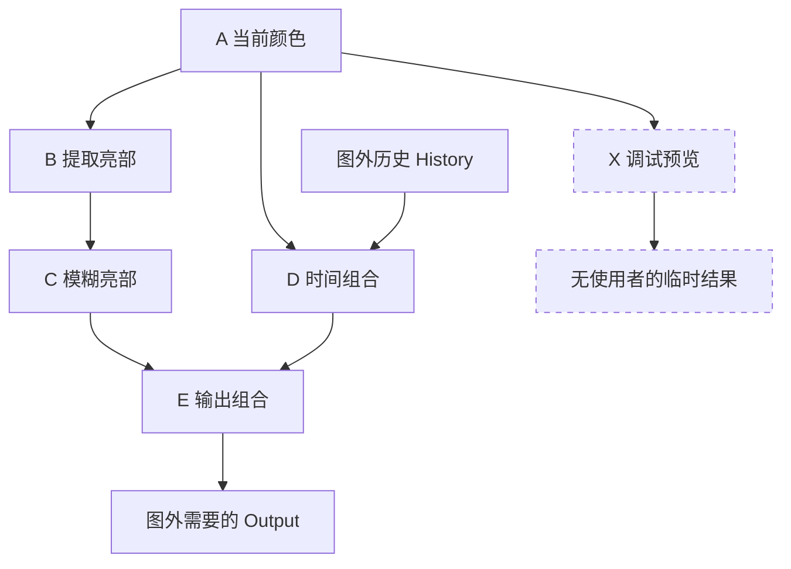
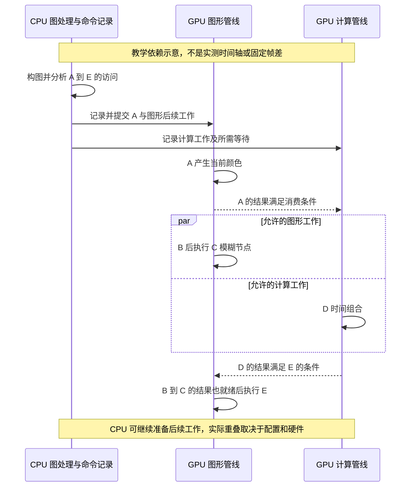

# 第 09 章：RDG 的构图、依赖、资源生命周期与执行

前几章已经把“谁拥有场景数据”和“谁在执行工作”分开。现在还有一个实际问题：深度、GBuffer、阴影、场景颜色和历史纹理相互依赖，怎样保证每个使用者读到正确结果，又不为每张临时纹理永久占用显存？

**渲染依赖图（Render Dependency Graph，RDG）**用渲染任务及其资源访问描述这些关系。在 UE 中，Renderer 等模块提出具体工作，RenderCore 中的 RDG 处理图，RHI 承接生成的命令。本章研究这条连接，不要求你已经掌握每种光照算法。

适用版本仍为 UE **5.7.4，CL 51494982**；运行配置采用 Windows、D3D12、SM6、桌面延迟渲染配置 A。**[源码已确认]**表示静态阅读结果；本章没有 UE 运行观察或 GPU 抓帧，图和时间算例均为**[教学简化]**。

## 9.1 学习目标与前置知识

完成本章后，你应能够：

1. 从 Pass 的参数结构判断它可能读取和写入什么资源。
2. 区分构图、编译图、执行 CPU 回调、RHI 提交和 GPU 完成。
3. 解释无用 Pass 为什么会被裁剪，以及资源寿命怎样影响显存复用。
4. 沿一个实际 TAA 计算 Pass，从输入参数走到 Shader 调度，再走到历史提取。
5. 判断某种“并行”发生在 CPU 还是 GPU，并说明同步所保护的具体依赖。

前置知识是第 05 章的纹理、缓冲、SRV、UAV 和历史，以及第 08 章的线程与命令概念。这里重申：**着色器资源视图（Shader Resource View，SRV）**用于按声明方式读取资源；**无序访问视图（Unordered Access View，UAV）**允许 Shader 按规则读写资源。它们描述访问方式，不能仅凭“都是一张纹理”互换。

不需要事先学习图论。这里的**节点（Node）**代表一项工作，**有向边（Directed Edge）**代表一个方向的先后约束。若 A 的结果被 B 使用，画 `A → B`。沿依赖回到自己会形成循环；同一次图执行中的生产消费关系必须避免无法满足的循环。时间历史通过外部资源连接不同次执行，而不是令本帧结果在产生前先读取自己。

## 9.2 没有依赖描述时，需要人工记住什么

假设我们先画红方块，之后做一种读取深度的屏幕效果，最后把场景颜色交给 TAA。只按函数名写出三行调用，并不能回答下面的问题：

- 深度是否已经由前面的 GPU 工作写好？这次读取应该使用哪一层、哪个 Mip？
- 刚才还是写入目标的资源，现在是否可以作为 Shader 输入？
- GPU 计算队列是否仍在使用某张纹理？图形队列能否覆盖它？
- 这个效果已经被后面的条件分支放弃，前面为它准备的工作还有没有用途？
- 临时结果最后一次被读完以后，底层存储能否服务下一张纹理？

**资源屏障（Resource Barrier）**用于表达访问顺序、可见性、状态转换以及特定资源复用要求。它不只是 C++ 层面的互斥锁，也不意味着 CPU 必须等待整个 GPU 空闲。具体由哪些 API 屏障、队列等待和缓存操作实现，要继续进入 RHI 和 D3D12，本章先建立为什么需要它们。

RDG 所解决的核心问题是：让使用者把必要信息集中写在 Pass 的资源声明中，使系统能据此分析。系统无法从一句自然语言“这个 Pass 会处理方块”推导访问，更无法通读任意回调函数猜测所有隐藏的指针和副作用。

因此“RDG 管理资源”有明确前提：**访问必须被正确声明，调用者还必须选择正确的算法、参数、资源内容和执行条件。** 给错了曝光参数，RDG 不会知道画面不符合物理意义；遗漏了输入声明，也不能期待 RDG 补出正确依赖。

## 9.3 三种经常被叫作 Pass 的东西

**渲染阶段（Rendering Stage）**是教材的语义划分，例如阴影或后处理；它可以包含许多不同算法。

**RDG Pass**是加入一个 `FRDGBuilder` 的工作节点，包含名字、参数、标志和执行回调。一个阶段通常添加多个节点；一个节点也可能记录多个 Draw 或 Dispatch。

**RHI Render Pass**描述图形绘制的一段附件使用范围，例如颜色和深度目标及其加载、保存方式。计算 Shader Pass 不因名称中有 Pass 就必须执行一次图形 `BeginRenderPass`。

| 名称 | 关注的问题 | 不能由它直接推出什么 |
|---|---|---|
| “Base Pass 阶段” | 哪些表面属性在哪里产生 | 固定只有一个 RDG 节点 |
| 一个 RDG Raster Pass | 本节点访问哪些资源，回调记录什么 | 只有一次绘制调用 |
| 一段 RHI Render Pass | 图形附件的开始、使用和结束 | 与教材章节一一对应 |
| 一次 Draw / Dispatch | 按当前绑定发起一次绘制或计算调度 | 每次只影响一个像素或一个物体 |

**[源码已确认]** `FRDGBuilder::ExecutePassPrologue` 根据 Raster、SkipRenderPass 等条件调用 `BeginRenderPass`，尾部相应处理 `EndRenderPass`，见 [S09-08](#s09-08)。这说明两个层次相关，但不是同一个对象。

本版还存在合并兼容 Raster Pass 的逻辑，然而是否启用受平台等条件限制。`IsRenderPassMergeEnabled` 明确检查 `RHIHasTiledGPU` 等条件。不能看见合并代码，就断言本书桌面 D3D12 配置一定在合并所有连续绘制。

## 9.4 先亲手构造一张只有六项工作的图

### 9.4.1 用生产和消费关系表达需要

**[教学简化]**下面用六个虚构节点研究依赖，它们不是 UE 延迟渲染器的实际 Pass 名称或完整顺序。这里暂时把不透明光照和透明合成之后的结果统称 `CurrentColor`；真实透明合成的位置与用途仍须按配置展开。

| 节点 | 读取 | 写入 | 本例意义 |
|---|---|---|---|
| A：准备当前颜色 | 本例已有的场景输入 | `CurrentColor` | 给 P 与 Q 提供当前图像 |
| B：提取亮部 | `CurrentColor` | `Bright` | 准备演示用辉光输入 |
| C：模糊亮部 | `Bright` | `Blurred` | 演示一次中间图像处理 |
| D：时间组合 | `CurrentColor`、外部 `History` | `StableColor` | 演示历史消费，省略真实 TAA 的其他输入 |
| E：输出组合 | `StableColor`、`Blurred` | 外部 `Output` | 图外需要的结果 |
| X：调试预览 | `CurrentColor` | `UnusedPreview` | 本例没有任何使用者 |

[打开依赖与裁剪静态图](../assets/diagrams/09-rdg-1.png)



图中箭头表示本例的数据依赖，不是 CPU 与 GPU 逐项同步的时间轴。B 与 D 都读取 A 的结果，彼此没有本例声明的数据依赖；但这只是允许考虑重叠的必要条件之一，还不能证明运行时一定并行。

### 9.4.2 裁剪是从有用输出向前找

**Pass 裁剪（Pass Culling）**移除对图外可观察输出没有贡献的工作。它与根据相机删除屏幕外物体的可见性裁剪不同：前者处理工作图，后者处理场景几何体或实例。

假设 E 的 Output 是图外需要的结果，分析从 E 开始：E 需要 C 和 D，C 需要 B，B 和 D 都需要 A；D 还需要外部历史。因此 A、B、C、D、E 必须保留。X 的输出既不进入任何被保留节点，也没有提取或显式保留理由，本例中可以被裁掉。

这里不能说“没有下一条箭头的节点都删除”。外部输出、提取资源和 `NeverCull` 标志会产生保留理由；一些无参数 Pass 也采用不会裁剪的约定。还要考虑同一资源被多次访问以及隐含访问模式，不能用这张六节点图代替全部算法。

**[源码已确认]** `AddPassDependency` 维护消费者的生产者集合，并记录跨管线关系；`FlushCullStack` 将需要的节点标为未裁剪，再将它们的生产者压栈。`Compile` 对裁剪结果处理资源引用数，见 [S09-04](#s09-04)。这对应的是真正的数据结构和遍历，不是“系统觉得这个效果看不出来就不画”。

### 9.4.3 “无用”由声明决定，不能靠隐藏的 CPU 副作用

假设 X 的回调中除了画预览，还写了一个普通 C++ 全局变量。RDG 参数没有表达这个全局变量是必要输出，X 仍可能不执行。业务逻辑不能依赖这种隐藏副作用。

反过来，为了让调试计数继续变化而给每个节点添加 `NeverCull`，会把原本可删除的资源链保留下来。正确做法是先问副作用是否真的属于渲染 Pass，并使用符合其用途的接口及生命周期，而不是先禁止一切优化。

## 9.5 添加一个 Pass 时，究竟交出了哪些信息

### 9.5.1 参数结构既是接口，也是可分析的访问说明

下面是**[教学简化]**的 C++ 风格伪代码，展示接口形状；`FBookFilterCS` 和 `AddBookFilter` 是为本章虚构的名字，不是引擎已有函数，也不是可以直接编译的完整插件：

```cpp
BEGIN_SHADER_PARAMETER_STRUCT(FParameters, )
    SHADER_PARAMETER(FIntPoint, OutputSize)
    SHADER_PARAMETER_RDG_TEXTURE(Texture2D, InputColor)
    SHADER_PARAMETER_RDG_TEXTURE_UAV(RWTexture2D<float4>, OutputColor)
END_SHADER_PARAMETER_STRUCT()

FRDGTextureRef AddBookFilter(FRDGBuilder& Graph, FRDGTextureRef Input)
{
    FRDGTextureRef Output = Graph.CreateTexture(OutputDesc, TEXT("Book.Filter"));
    auto* Params = Graph.AllocParameters<FBookFilterCS::FParameters>();
    Params->OutputSize = OutputDesc.Extent;
    Params->InputColor = Input;
    Params->OutputColor = Graph.CreateUAV(Output);
    FComputeShaderUtils::AddPass(
        Graph, RDG_EVENT_NAME("BookFilter"), Shader, Params, GroupCount);
    return Output;
}
```

逐项看它交出的信息：

1. `OutputSize` 是普通数值参数，告诉程序边界或计算范围；它本身不是资源依赖。
2. `InputColor` 使用 RDG 纹理参数宏，使系统可以枚举这个输入及相应访问。
3. `OutputColor` 是 RDG UAV，使系统知道本节点对这项资源存在相应读写访问。UAV 不能一概理解为只写，实际 Shader 是否读旧值仍需检查。
4. `CreateTexture` 建立图内描述对象，包含尺寸、格式、标志和调试名，不是“立即计算并返回整张图像”。
5. `AllocParameters` 让参数对象具有与图执行相适应的 CPU 生命周期。
6. `AddPass` 登记回调；一般模式下回调稍后才运行。返回的 Output 是图中资源引用，后续节点可以继续声明读取它。

**[源码已确认]** `RenderGraphBuilder.h` 明确规定传入后的参数结构应保持不变，Lambda 捕获必须假设延迟执行；`CreateTexture` 的内联实现先校验、调整描述，再在图资源容器中分配 `FRDGTexture`，见 [S09-01](#s09-01)、[S09-02](#s09-02)。

### 9.5.2 CPU 指针存活，不等于底层纹理处处可用

`FRDGTextureRef` 是指向图资源对象的引用。这个 CPU 对象在图处理期间存在，不等于对应 RHI 纹理已经分配，也不等于任何回调都可以绕过声明读取它。

常见错误是：在构图函数的局部变量中保存一个数组，再用引用捕获把它交给稍后执行的 Lambda。构图函数已经返回，数组已经销毁，回调却还准备读取它。另一种错误是添加 Pass 后继续修改同一 Params，导致较早添加的 Pass 也看见新参数。

应根据实际接口使用图分配器、稳定的值捕获或有明确寿命的对象；图外资源也必须保持有效。值捕获一个悬空指针不会让它指向的数据自动存活。多线程执行还要求不能未经同步写入共享对象。

### 9.5.3 为什么 Shader 不用的参数要清掉

第 04 章说明了 Shader 变体。同一个参数结构可能覆盖多个变体，而当前选中程序只使用其中一部分资源。如果仍把所有非空项都交给依赖分析，就可能保存不必要的依赖和寿命。

`ClearUnusedGraphResources` 根据实际 Shader 绑定信息清理不使用的图资源参数。它不是把纹理的像素清为黑色，而是调整 CPU 参数结构中的资源引用，使声明与当前程序匹配。

**[源码已确认]** TAA 在选好计算 Shader 后先调用这个函数，再通过 `FComputeShaderUtils::AddPass` 添加节点，工具内部也会做相应清理，见 [S09-10](#s09-10)。因此观察参数时，应明确自己停在清理之前还是之后，不能把某个参数变成空直接当作资源丢失。

## 9.6 依赖为什么不只是“先写后读”

### 9.6.1 三种访问冲突

设同一资源 R 被不同工作访问：

| 类型 | 顺序需求 | 如果不保证会发生什么 |
|---|---|---|
| 写后读，Read After Write，RAW | 读取者必须看见所需写入结果 | 读到旧内容或未完成数据 |
| 读后写，Write After Read，WAR | 后来的覆盖必须避开尚未结束的读取 | 读者中途读到被替换的数据 |
| 写后写，Write After Write，WAW | 多次写入的预期顺序必须成立 | 最终内容可能来自错误的一次写入 |

两个只读访问一般没有这些写入冲突，但仍需满足资源状态、跨队列支持和使用范围约束。一个 UAV Pass 的名字叫“生成颜色”，也不能说明它没有读取 UAV 原值。

同一纹理还有**子资源（Subresource）**：例如不同 Mip、数组层以及深度与模板的相关访问范围。只改 Mip 2 与只读 Mip 0，在算法和 API 支持下可能不冲突；把所有情况都概括成“资源名字相同，所以整张纹理完全串行”会过粗。反过来，错误声明访问范围会使系统遗漏实际冲突。

**[源码已确认]** `AddCullingDependency` 除了追踪写入生产者，也显式处理另一管线上最近的读取与新写入之间的依赖。代码还考虑跳过某些 UAV 屏障的特殊规则，见 [S09-04](#s09-04)。本书不建议初学者手动跳过屏障；应先读懂默认访问关系。

### 9.6.2 顺序、资源状态与队列等待分开理解

当 B 把资源写为 UAV，E 后来把它当纹理读取，至少要问：B 的写入对 E 是否可见，资源当前访问状态是否合适，以及两者是否在不同执行队列。

如果在同一队列，命令顺序与所需屏障共同落实正确访问。如果跨图形与计算队列，则还需要让消费者遵守生产完成条件。CPU 通常记录相应命令和同步要求，无须每个 Pass 都调用“等 GPU 完成再继续”。

这里的“完成条件”针对必要生产工作；把所有资源转换都解释成全 GPU 停顿，会丢失现代调度的重要区别。屏障依然可能产生明显成本，因为依赖限制了可重叠区域，状态和缓存处理也不是免费操作。

## 9.7 资源的三个寿命，以及显存复用的算例

### 9.7.1 图对象、底层资源和使用区间

**图对象寿命**是 CPU 上 `FRDGTexture` 等描述何时有效。**底层资源寿命**是 RHI 纹理、缓冲及其存储何时存在。**有效使用区间**则覆盖所有需要正确保留其内容的工作，包括跨队列尚未完成的使用。

RDG 根据保留的 Pass 引用分析分配和释放需求。**瞬态资源（Transient Resource）**适合有界的使用区间；**内存别名复用（Memory Aliasing）**让不同资源在不冲突的时间使用同一底层存储区域。资源池也可以复用兼容资源对象，但“池复用”和“多个逻辑资源共享底层区域”不是完全相同的策略。

**[源码已确认]** `CollectAllocateTexture` 记录首次使用，并将分配操作送入瞬态或池化处理集合；`CollectDeallocateTexture` 减去引用数、记录各管线最后使用，达到条件才收集释放操作，见 [S09-07](#s09-07)。这些是图处理中的计划与管理步骤，不意味着走到该 C++ 行时 GPU 正好处理到那个像素。

### 9.7.2 完整数值例：相同尺寸不代表可立即复用

**[教学简化]**考虑按 A、B、C、D、E 顺序执行的另一张小图，两个中间纹理 U 和 V 都为 `1280×720`、RGBA16F，每像素 8 字节。

```text
A 写 U
B 读 U，写一个独立的小结果 R
C 不再访问 U
D 写 V，读取 R
E 读 V，写外部结果

U 使用区间：A 至 B
V 使用区间：D 至 E
```

单张基础像素数据量为 `1280*720*8=7,372,800` 字节，即 `7.03125 MiB`。两张分别长期保留，合计为 `14.0625 MiB`。如果底层分配兼容、两个区间确实不重叠且同步正确，二者的基础存储可能由一份约 `7.03125 MiB` 的区域轮流承担。

这不是本场景实测显存，也不是保证节约精确的 7.03125 MiB：还没有计入对齐、平台分配、压缩元数据、其他同时存活资源和分配策略。

现在改变一条关系：让 D 还读取 U。U 的内容必须一直保留到 D 读完，而 D 同时写 V，二者不能按上面的独立读写模型直接覆盖同一份数据。再假设 B 在异步计算队列运行，CPU 已经记完 B 的命令也不能证明 B 已停止读取 U；寿命必须考虑真实依赖所约束的执行范围。

### 9.7.3 提取不是把图片下载到 CPU

**资源提取（Resource Extraction）**将图内产生的资源作为图外可持有引用保留下来，常用于时间历史。`QueueTextureExtraction` 只是先登记要求；它会把输出引用置空，标记资源被提取，登记目标引用地址，并使相应生产链成为裁剪分析需要保留的对象。

**[源码已确认]**执行处理到提取步骤时，把图资源的 `RenderTarget` 赋给外部持有者，见 [S09-03](#s09-03)、[S09-06](#s09-06)。这个赋值不是读回像素，也不是 JPEG 导出，更不是 GPU 已完成所有写入的证明。CPU 读回需要专门的复制、同步与映射流程。

外部保存者的地址必须活到提取发生；不能把一个即将返回的局部 `TRefCountPtr` 地址交出去。下一次图使用历史时调用 `RegisterExternalTexture` 建立本次图的跟踪。保存一个旧 `FRDGTextureRef` 到下一帧不能替代这一步。

本版还区分允许瞬态提取的特殊标志与普通提取，不应断言“所有提取资源一定具有完全相同的底层分配”。初学阶段先关注引用、访问和内容连续性，具体策略见源码条件。

## 9.8 一次 Execute 内部究竟发生什么

### 9.8.1 五层事件不要合并成一个词

| 事件 | 谁负责 | 主要结果 |
|---|---|---|
| 构图 | CPU 上的渲染代码及允许的准备任务 | 节点、资源描述、参数、依赖信息 |
| 编译与准备图 | CPU，可能使用任务并行 | 裁剪、使用区间、屏障与命令执行安排 |
| 执行 Pass 回调 | CPU 渲染线程或工作任务 | 设置管线与资源、记录 Draw / Dispatch 等 RHI 工作 |
| 翻译和提交 | RHI 路径及底层图形 API | 原生命令列表、队列提交和同步 |
| GPU 执行 | GPU 的相应队列与硬件单元 | 纹理与缓冲内容实际改变 |

这里的**编译图（Graph Compilation）**是在分析渲染任务关系；不是把 HLSL 编译成 GPU 程序。第 04 章的 Shader 编译是另一件事。名称都叫 Compile，输入和输出却完全不同。

**[源码已确认]** `FRDGBuilder::Execute` 建立图尾节点，等待必要的准备任务，在普通模式下调用 `Compile`，组织资源与屏障处理，然后执行或收集各 Pass 的命令列表，最后处理提取和回调，见 [S09-05](#s09-05)、[S09-06](#s09-06)。本版的一部分准备与依赖工作可提前异步开展，所以不能把 `Execute` 前的所有工作理解成只是在一个数组尾部添加名字。

### 9.8.2 回调里发起的到底是什么

`ExecutePass` 的真实骨架是：切换所需管线，执行前置处理，调用 `Pass->Execute(RHICmdListPass)`，再执行后置处理。前后处理负责相应的屏障、图形 Render Pass 边界和作用域。

Pass 的 C++ Lambda 在 CPU 上运行。里面的 `DispatchComputeShader` 描述需要调度的 GPU 工作，不是 C++ 在 CPU 上模拟每个 Shader 线程。绘制回调同理，不会因为它处理一个屏幕 Pass 就变成 GPU 上的 C++ 函数。

**[源码已确认]**在普通流程的提交位置可以看到 `QueueAsyncCommandListSubmit` 和 `ImmediateFlush(DispatchToRHIThread)`；只有额外调试条件下才出现逐 Pass `SubmitCommandsAndFlushGPU` 与 `BlockUntilGPUIdle`，见 [S09-06](#s09-06)。因此不能把正常 `Execute()` 返回当成全 GPU 空闲。

### 9.8.3 两种“立即”同样不能混淆

RDG 的逐项声明接口可以在 C++ 中自然地边计算边添加 Pass，但通常仍延迟执行回调。调试用 **Immediate Mode** 则让添加阶段附近执行回调，便于保留出错时的构图调用栈；它改变裁剪、并行和寿命相关行为。

Immediate Mode 不等于每条 GPU 指令同步完成。另一个 `r.RDG.Debug.FlushGPU` 才明确要求逐 Pass 刷新并等待 GPU，并会干扰异步计算与并行执行。不能拿开启这些诊断选项时的耗时当正常配置性能。

## 9.9 CPU 并行与 GPU 异步计算各解决什么问题

### 9.9.1 并行记录可以服务仍有 GPU 依赖的工作

假设两个 Pass 在 GPU 上必须先后执行。CPU 仍可能在独立命令列表上并行准备它们，只要记录过程本身的数据和生命周期条件允许，并在提交与执行时落实依赖。

所以“CPU 同时记录了 B 和 C”不等于“GPU 同时使用了还没写好的输入”。RDG 的 Parallel Setup、Parallel Compile、Parallel Execute 分别涉及准备任务、图处理任务和回调记录工作，不能看到 Parallel 就把它们全部画到 GPU 时间线上。

### 9.9.2 Async Compute 是另一条资源受限的执行路径

[打开异步依赖示意静态图](../assets/diagrams/09-rdg-2.png)

**异步计算（Asynchronous Compute，Async Compute）**允许合适计算工作经相应管线与图形工作调度重叠。计算与图形仍共享部分执行、缓存、带宽等硬件资源，它不是免费增加一块 GPU。

**[教学简化]**回到 9.4 的 A、B、C、D、E 图，假设 A 已完成，B→C 需要 `1+2=3 ms`，D 需要 `2 ms`，E 需要 `1 ms`。若全部串行且忽略其他开销，A 之后需要 `1+2+2+1=6 ms`。若 B→C 和 D 能理想重叠，则需要 `max(3,2)+1=4 ms`。

`4 ms` 是这个假定模型的理想值，不能称为把本场景开启 Async Compute 后的结果。同步开销、共享资源争用和其他依赖都可能使收益降低，甚至使总时间变长。



图中 B、C、D、E 均沿用 9.4 节的教学节点名。这个示意将 D 放到计算管线只是解释模型，**不表示本版桌面 TAA 默认标记为 AsyncCompute**。

**[源码已确认]** `IsAsyncComputeSupported` 同时检查策略、Immediate Mode、Render Pass 合并条件、硬件效率能力、深度模板复制支持和 GPU Profile 状态。`Compile` 为异步区域计算 graphics fork/join 并组织同步，见 [S09-09](#s09-09)。只设置一个 CVar 并不足以证明某个 Pass 实际进入计算队列。

## 9.10 真正沿一次 TAA Pass 穿过 RDG

第 05 章已经解释 TAA 历史保存什么。本节复用同一个实际入口，专门追“一个请求如何成为命令”，避免用虚构的全屏滤波器冒充 UE 实现。

### 9.10.1 它是什么，为什么需要这个节点

这里的 **TAA（Temporal Anti-Aliasing，时间抗锯齿）**节点使用当前图像、相关深度与速度、先前历史等信息生成时间处理结果。本章配置 A 选择 TAA；完整重投影、拒绝历史和质量算法留到第 19 章。

从 RDG 角度，它是具有多个输入和新输出的计算工作。只提供一张颜色结果而不把读取与写入登记到图中，前面的生产、后面的消费与历史保存就失去了可分析关系。

### 9.10.2 输入和参数怎样汇合

**[源码已确认]** `AddTemporalAAPass` 接收图、View、TAA 输入和历史相关数据。公共参数结构中声明当前颜色、历史数组、深度、速度、曝光和视图信息；计算参数结构再加入输出 UAV，见 [S09-10](#s09-10)。

函数创建 `NewHistoryTexture`，为可用历史调用 `RegisterExternalTexture`，填充当前帧权重与历史曝光修正等参数，然后选择当前 Shader 变体。本章只追桌面计算分支，不能把后面 `check(IsMobilePlatform(...))` 的像素 Shader 分支混进来。

有的变体不使用所有历史项，摄像机切换或历史无效也会改变输入。判断实际资源集合应查看条件处理和清理后的参数，不是照抄结构体全部成员名。

### 9.10.3 从 AddPass 走到 Dispatch

在计算分支，函数通过 `AllocParameters<FTemporalAACS::FParameters>` 准备参数，`CreateUAV` 把新历史资源接到 `OutComputeTex`，选择 `FTemporalAACS`，清理未使用资源，再调用 `FComputeShaderUtils::AddPass`。

这次调用使用没有显式 PassFlags 的重载。**[源码已确认]**该重载传入 `ERDGPassFlags::Compute`；后续工具函数向 GraphBuilder 加入捕获 Shader、参数和线程组数的 Lambda，见 [S09-11](#s09-11)。普通 `r.RDG.AsyncCompute=1` 只允许已标记的异步工作，所以不要把“Compute Shader”自动写成“异步计算”。强制策略和支持条件另论。

执行该 Lambda 时，`FComputeShaderUtils::Dispatch` 先准备计算管线，设置 Shader 参数，再调用：

```cpp
RHICmdList.DispatchComputeShader(GroupCount.X, GroupCount.Y, GroupCount.Z);
```

这里的三个数是**线程组数（Thread Group Count）**，不是材质数量或像素 RGBA。**线程组（Thread Group）**是一组共同调度且可在支持规则下共享组内数据的 Shader 调用；每组尺寸来自 Shader 的 `numthreads` 声明。

### 9.10.4 线程组的完整数值例

本版 `GTemporalAATileSizeX=8`，相应编译定义和 Shader 声明把计算与组尺寸接起来。**[教学简化]**假设有效目标矩形正好 `1280×720`，采用 `8×8×1` 组尺寸，则：

```text
GroupCountX = ceil(1280 / 8) = 160
GroupCountY = ceil(720 / 8) = 90
GroupCountZ = 1
总组数 = 160*90 = 14,400
对应调用数 = 14,400*8*8 = 921,600
```

`ceil` 表示向上取整。如果教学目标改为 `1279×719`，仍需要 `160×90` 个组，不能把余数像素漏掉。Shader 必须对超出有效范围的写入做相应处理；也不能在存在组内同步时随意让部分调用提前退出。

**[源码已确认]** `TemporalAA.usf::MainCS` 根据调度线程编号计算视口 UV，执行 `TemporalAASample`，形成输出，再由 `PixelPos` 与 `OutputViewportRect` 的范围关系限制相应写入，见 [S09-12](#s09-12)。这是真实的索引、计算、写入连接。组数乘积只描述调用覆盖，不能由此推导每个调用固定花多少时间。

### 9.10.5 输出、条件和历史接续

TAA 返回的当前输出可供后续后处理节点使用；满足视图历史可写和当前变体使用等条件时，函数对新历史调用 `QueueTextureExtraction`，并保存视图范围和参考尺寸。图处理最后把外部引用交给视图历史，下一次图再登记。

这同时涉及两种消费者：本次图的后处理，以及未来一次图的历史读取者。把后者写成当前 C++ 局部纹理的永久指针，会破坏图生命周期。

这个 Pass 是否出现取决于抗锯齿选择、视图和渲染路径。改成 TSR，不能期待同一 TAA 节点继续承担主时间重建；改成移动路径，不能照搬本节的计算分支。其主要 GPU 成本来自像素处理和多项资源采样，CPU 成本还包括参数、变体、图节点和命令组织。

**常见误区：**“历史没有被提取，所以 TAA 一定没输出当前帧”并不成立；当前输出与未来历史持有是相关但不同的用途。也不能用本节节点的 CPU Lambda 耗时替代它在 GPU 上的耗时。

## 9.11 回到 P 与 Q：依赖描述不替代像素语义

P 位于红方块表面，不受蓝色薄片覆盖。到 TAA 输入时，它已是当前场景颜色中的一部分，深度、速度和历史是否对应当前表面仍需算法判断。RDG 保证的是声明关系得到处理，不会替 TAA 判断某个历史样本是否来自被遮住的地面。

Q 同时关联方块背景和透明薄片。第 03 章说明透明覆盖可能不写主深度；因此当前颜色的贡献者与主深度记录的最近不透明表面，不必完全相同。即使 TAA 的所有资源访问都同步正确，也仍可能需要专门的透明与历史处理来应对画面问题。

如果薄片在所选配置下使用独立颜色或合成阶段，实际图中就会多出相关资源与消费节点。不能因为我们在 9.4 节画了一个 `CurrentColor`，就断言所有透明内容固定在同一位置进入所有时间效果。

这说明读图应同时保留两张清单：**资源从哪里来**，以及**这个资源中的数值代表什么**。前者帮助定位依赖错误，后者帮助定位算法或配置错误。

## 9.12 一帧为什么可能有多个 RDG

`FRDGBuilder` 管理一次图的描述和处理范围，不等于整台机器上的唯一帧对象。主场景渲染、额外视图、窗口 UI 或其他工作可以拥有各自图。

**[源码已确认]**本版 `FSceneRenderBuilder` 的渲染节点处理路径创建局部 GraphBuilder，调用渲染函数，再 `Execute`。Slate 窗口渲染也创建自己的 GraphBuilder，并有分批处理窗口的流程，见 [S09-13](#s09-13)。因此“整帧只有一次 GraphBuilder.Execute”不是可靠的源码阅读前提。

图外资源在图之间承接结果。重新注册一个外部纹理不是复制整张图片，也不是自动得到另一张图的全部内部依赖；状态、引用和命令提交顺序需要由实际外部接口及调度契约衔接。

同一图内的优化视野也有边界。若把许多结果都提取到图外，或者把相关工作拆到不同图中，图内寿命和裁剪的自由度会改变。这不意味着“图越大越好”：不同模块的所有权、线程安排和使用场景同样影响合理边界。

## 9.13 观察练习：先读声明，再做有限的诊断对照

### 练习 A：不启动 UE 也能完成的参数追踪

打开 [TAA 参数声明](G:/UnrealEngineInstalled/UE_5.7/Engine/Source/Runtime/Renderer/Private/PostProcess/TemporalAA.cpp:108)，为当前颜色、深度、速度、历史、输出 UAV 分别写一行“生产者、用途、消费者”。再跳到同文件 868 行，跟踪参数赋值和资源清理。

**预期：**你能把多个输入接到一个计算节点，再把新输出分成当前消费与历史提取两条用途。排查时先确认自己是否选中计算分支，以及 Shader 变体是否使某个参数被清理。静态阅读能确认代码关系，不能证明正在运行的项目采用了同一变体。

### 练习 B：只查询当前设置

**[尚未验证]**在可用的编辑器开发配置中打开 Output Log，逐条输入变量名，不附赋值，记录当前值和命令响应：

```text
r.RDG.ImmediateMode
r.RDG.Validation
r.RDG.CullPasses
r.RDG.AsyncCompute
r.RDG.ParallelExecute
```

这些名字及注册在本地源码中已核对；调试项是否出现在你的可执行程序中取决于编译条件。若提示未知命令，先查该构建是否包含 `RDG_ENABLE_DEBUG` 支持，再查拼写与运行版本，不能把未知命令当成“系统默认为零”。

| 设置 | 本地注册初值或政策 | 读数解释与条件 |
|---|---|---|
| `r.RDG.ImmediateMode` | `0` | 调试宏内；影响回调时机与优化条件 |
| `r.RDG.Validation` | `1` | 调试宏内；校验接口与参数依赖 |
| `r.RDG.CullPasses` | `1` | 允许裁掉无用输出链，不是裁掉所有看不见的物体 |
| `r.RDG.AsyncCompute` | `1` | 允许被标记工作；还要满足硬件、模式和具体 Pass 条件 |
| `r.RDG.ParallelExecute` | `2` | 支持时允许并行和异步任务；不是直接开启 GPU 计算队列 |

以上是**注册依据，不是本项目实测值**。这些项属于相应运行与诊断设置，通常不需要为改值重编材质 Shader；其生效还受当前图构建和控制变量处理时机影响。不同于项目材质系统开关，不能把所有 CVar 都理解成需要重启和全量 Shader 编译。

### 练习 C：用纸面依赖检查一次裁剪

复制 9.4 节的资源表，先圈出外部 Output，再逆向标记所有必要节点。随后增加“把 UnusedPreview 提取供图外使用”这项要求，重新做一遍。

**预期：**第二次 X 也必须保留。P 与 Q 的最终主图像可能完全相同，但工作与资源寿命发生变化。若认为“没有改变主图像就不会执行”，说明遗漏了图外消费者。

### 练习 D：调试条件不能当正常性能

**[尚未验证]**仅在需要诊断回调或生命周期问题时，在自己的可恢复测试环境记录原值，再一次只改变一个 RDG 调试选项，并恢复原值。`r.RDG.Debug.FlushGPU=1` 会强烈改变调度，本章不要求为看画面而开启它，也不提供虚构的前后耗时。

若改变 Immediate Mode 或延长资源寿命后问题消失，只能认为时机或寿命值得进一步排查；还需检查遗漏参数、引用捕获、跨图持有和真实资源访问。诊断开关让错误暂时不出现，不等于已经修复。

## 9.14 源码证据与阅读地图

核对日期：2026-09-07。下列路径相对引擎根目录，链接包含核对时的真实定位行号。它们支持相邻说明，不把文件存在或行号有效等同于运行验证。

<a id="s09-01"></a>
**S09-01：图的契约。** `Source/Runtime/RenderCore/Public/RenderGraphBuilder.h`，[FRDGBuilder 说明](G:/UnrealEngineInstalled/UE_5.7/Engine/Source/Runtime/RenderCore/Public/RenderGraphBuilder.h:42)定义图处理范围；[AddPass 契约](G:/UnrealEngineInstalled/UE_5.7/Engine/Source/Runtime/RenderCore/Public/RenderGraphBuilder.h:200)说明参数不可变与回调延迟；[AllocParameters](G:/UnrealEngineInstalled/UE_5.7/Engine/Source/Runtime/RenderCore/Public/RenderGraphBuilder.h:175)给出参数寿命。

<a id="s09-02"></a>
**S09-02：创建与添加。** `Source/Runtime/RenderCore/Public/RenderGraphBuilder.inl`，[CreateTexture](G:/UnrealEngineInstalled/UE_5.7/Engine/Source/Runtime/RenderCore/Public/RenderGraphBuilder.inl:41)建立图资源描述；[模板 AddPass](G:/UnrealEngineInstalled/UE_5.7/Engine/Source/Runtime/RenderCore/Public/RenderGraphBuilder.inl:311)把参数元数据与回调交给内部处理。注意区别 CPU 描述对象与 RHI 存储。

<a id="s09-03"></a>
**S09-03：图外引用。** [QueueTextureExtraction](G:/UnrealEngineInstalled/UE_5.7/Engine/Source/Runtime/RenderCore/Public/RenderGraphBuilder.inl:447)登记输出地址、提取标记和保留理由；[RegisterExternalTexture](G:/UnrealEngineInstalled/UE_5.7/Engine/Source/Runtime/RenderCore/Private/RenderGraphBuilder.cpp:1070)登记外部持有的纹理，均在 RenderCore 模块。

<a id="s09-04"></a>
**S09-04：依赖与裁剪。** `Source/Runtime/RenderCore/Private/RenderGraphBuilder.cpp`，[AddPassDependency](G:/UnrealEngineInstalled/UE_5.7/Engine/Source/Runtime/RenderCore/Private/RenderGraphBuilder.cpp:1149)、[AddCullingDependency](G:/UnrealEngineInstalled/UE_5.7/Engine/Source/Runtime/RenderCore/Private/RenderGraphBuilder.cpp:1189)、[FlushCullStack](G:/UnrealEngineInstalled/UE_5.7/Engine/Source/Runtime/RenderCore/Private/RenderGraphBuilder.cpp:1299)、[Compile](G:/UnrealEngineInstalled/UE_5.7/Engine/Source/Runtime/RenderCore/Private/RenderGraphBuilder.cpp:1316)可顺着读。先辨认访问状态，再看遍历，不能仅背“拓扑排序”。

<a id="s09-05"></a>
**S09-05：执行的准备部分。** 同文件 [Execute](G:/UnrealEngineInstalled/UE_5.7/Engine/Source/Runtime/RenderCore/Private/RenderGraphBuilder.cpp:1755)建立尾节点与准备条件，随后调用 Compile、组织屏障和资源集合。准备任务可以并行，应连同任务依赖阅读。

<a id="s09-06"></a>
**S09-06：命令与提取。** 同文件 [ExecutePasses 区域](G:/UnrealEngineInstalled/UE_5.7/Engine/Source/Runtime/RenderCore/Private/RenderGraphBuilder.cpp:2036)组织并行列表与串行节点；[逐 Pass 等 GPU 的调试分支](G:/UnrealEngineInstalled/UE_5.7/Engine/Source/Runtime/RenderCore/Private/RenderGraphBuilder.cpp:2151)不能当正常流程；[提取引用赋值](G:/UnrealEngineInstalled/UE_5.7/Engine/Source/Runtime/RenderCore/Private/RenderGraphBuilder.cpp:2192)发生在必要任务等待之后。

<a id="s09-07"></a>
**S09-07：寿命分析。** 同文件 [CollectAllocateTexture](G:/UnrealEngineInstalled/UE_5.7/Engine/Source/Runtime/RenderCore/Private/RenderGraphBuilder.cpp:3615)、[CollectDeallocateTexture](G:/UnrealEngineInstalled/UE_5.7/Engine/Source/Runtime/RenderCore/Private/RenderGraphBuilder.cpp:3656)记录使用与分配操作；[IsTransientInternal](G:/UnrealEngineInstalled/UE_5.7/Engine/Source/Runtime/RenderCore/Private/RenderGraphBuilder.cpp:526)说明不是所有资源无条件采用同一分配方式。

<a id="s09-08"></a>
**S09-08：一次回调两侧。** 同文件 [ExecutePassPrologue](G:/UnrealEngineInstalled/UE_5.7/Engine/Source/Runtime/RenderCore/Private/RenderGraphBuilder.cpp:3395)、[ExecutePassEpilogue](G:/UnrealEngineInstalled/UE_5.7/Engine/Source/Runtime/RenderCore/Private/RenderGraphBuilder.cpp:3428)、[ExecutePass](G:/UnrealEngineInstalled/UE_5.7/Engine/Source/Runtime/RenderCore/Private/RenderGraphBuilder.cpp:3482)展示屏障、图形 Render Pass 边界及用户工作的位置。

<a id="s09-09"></a>
**S09-09：并行与异步条件。** [RenderGraphPrivate.h 的模式判断](G:/UnrealEngineInstalled/UE_5.7/Engine/Source/Runtime/RenderCore/Private/RenderGraphPrivate.h:226)包含合并与 Async Compute 限制；[Compile 的异步同步区域](G:/UnrealEngineInstalled/UE_5.7/Engine/Source/Runtime/RenderCore/Private/RenderGraphBuilder.cpp:1551)计算 fork/join；[RenderGraphPrivate.cpp 的调试选项](G:/UnrealEngineInstalled/UE_5.7/Engine/Source/Runtime/RenderCore/Private/RenderGraphPrivate.cpp:12)、[AsyncCompute 政策](G:/UnrealEngineInstalled/UE_5.7/Engine/Source/Runtime/RenderCore/Private/RenderGraphPrivate.cpp:211)、[ParallelExecute](G:/UnrealEngineInstalled/UE_5.7/Engine/Source/Runtime/RenderCore/Private/RenderGraphPrivate.cpp:327)分别核对注册值与行为。

<a id="s09-10"></a>
**S09-10：真实 TAA 节点。** `Source/Runtime/Renderer/Private/PostProcess/TemporalAA.cpp`，[公共参数](G:/UnrealEngineInstalled/UE_5.7/Engine/Source/Runtime/Renderer/Private/PostProcess/TemporalAA.cpp:108)、[输出 UAV 参数](G:/UnrealEngineInstalled/UE_5.7/Engine/Source/Runtime/Renderer/Private/PostProcess/TemporalAA.cpp:284)、[AddTemporalAAPass](G:/UnrealEngineInstalled/UE_5.7/Engine/Source/Runtime/Renderer/Private/PostProcess/TemporalAA.cpp:571)、[计算参数与 AddPass](G:/UnrealEngineInstalled/UE_5.7/Engine/Source/Runtime/Renderer/Private/PostProcess/TemporalAA.cpp:868)、[条件提取](G:/UnrealEngineInstalled/UE_5.7/Engine/Source/Runtime/Renderer/Private/PostProcess/TemporalAA.cpp:980)形成一条可连续跟读的链。

<a id="s09-11"></a>
**S09-11：工具函数落实命令。** `Source/Runtime/RenderCore/Public/RenderGraphUtils.h`，[默认 Compute 重载](G:/UnrealEngineInstalled/UE_5.7/Engine/Source/Runtime/RenderCore/Public/RenderGraphUtils.h:626)、[添加回调](G:/UnrealEngineInstalled/UE_5.7/Engine/Source/Runtime/RenderCore/Public/RenderGraphUtils.h:550)、[Dispatch](G:/UnrealEngineInstalled/UE_5.7/Engine/Source/Runtime/RenderCore/Public/RenderGraphUtils.h:491)、[PrepareDispatch](G:/UnrealEngineInstalled/UE_5.7/Engine/Source/Runtime/RenderCore/Public/RenderGraphUtils.h:461)连接到管线、参数绑定与 RHI 计算调度。

<a id="s09-12"></a>
**S09-12：调度进入 Shader。** [TemporalAA.cpp 编译定义与入口注册](G:/UnrealEngineInstalled/UE_5.7/Engine/Source/Runtime/Renderer/Private/PostProcess/TemporalAA.cpp:391)连接 `FTemporalAACS` 与 `Shaders/Private/TemporalAA.usf`；[MainCS](G:/UnrealEngineInstalled/UE_5.7/Engine/Shaders/Private/TemporalAA.usf:2317)使用线程编号计算样本并在范围判断内写入输出。

<a id="s09-13"></a>
**S09-13：多图边界。** [SceneRenderBuilder.cpp 渲染节点图](G:/UnrealEngineInstalled/UE_5.7/Engine/Source/Runtime/Renderer/Private/SceneRenderBuilder.cpp:872)与 [SlateRHIRenderer.cpp 窗口图](G:/UnrealEngineInstalled/UE_5.7/Engine/Source/Runtime/SlateRHIRenderer/Private/SlateRHIRenderer.cpp:1087)分别位于 Renderer 与 SlateRHIRenderer 模块。它们证明存在多个图的架构路径，不证明每帧固定有某个数量。

补充阅读：[官方 RDG 文档与版本限制](../appendices/references.md#doc-rdg)。

## 9.15 概念回顾与常见误区

- RDG 将 Pass 参数中的资源访问转成可处理的关系；它不推测遗漏的访问，也不替代着色算法。
- 构图时取得的是资源描述和工作引用；执行回调通常仍是 CPU 记录 RHI 工作。
- 裁剪从必要输出保留生产链；提取、外部输出和显式保留都会影响结果。
- 生命周期必须覆盖实际使用依赖；跨帧历史需要图外持有与重新登记。
- CPU 并行记录、GPU 异步计算和多图调度属于不同层次。
- 多个 RDG Pass 不必等于多个 RHI Render Pass，也不必等于相同数量的 Draw Call。

性能分析应把 CPU 图处理、命令记录、资源占用、同步限制和 GPU 算法成本分别归因。减少 Pass 数量不一定减少总开销：合并后可能扩大资源寿命、增加无用工作或降低并行机会；过度细分也可能增加图管理和命令开销。先看数据关系，再用实际工具判断。

## 9.16 理解检查

先完成推理，再核对 [第 09 章答案](../appendices/answers/09-rdg.md)。

1. 9.4 节中哪些节点会因外部 Output 保留？为什么 X 可能被裁掉？如果把 UnusedPreview 提取到图外，答案怎样改变？
2. `CreateTexture`、`AddPass`、`Execute()` 返回、GPU 写入完成分别意味着什么？为什么捕获构图函数中的局部数组引用可能错误？
3. U、V 都是 `640×360` RGBA16F。使用区间分别为 A～B、D～E，其他条件允许时，两张基础存储由两份改为一份可能节约多少字节和 MiB？若 D 仍读取 U，为什么不能按原模型直接复用？
4. 一个计算 Pass 使用默认 `FComputeShaderUtils::AddPass` 重载，项目查询到 `r.RDG.AsyncCompute=1`。能否断言它在异步计算队列执行？CPU 并行记录又是否能证明 GPU 并行？
5. 采用 `8×8` 线程组处理 `1001×601` 的教学目标，需要多少个组？最后一组的多余调用怎样避免非法写入？为什么提取输出纹理不等于已经把所有像素读回 CPU？

下一章：第 10 章将沿 RHI 与 D3D12 继续追踪，从抽象命令到原生命令列表、队列和同步。

[返回目录](../README.md) · [回顾资源基础](05-resources-color-history.md) · [配置附录](../appendices/configuration.md)
