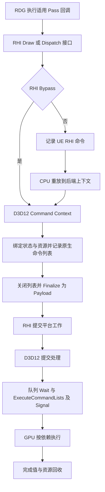
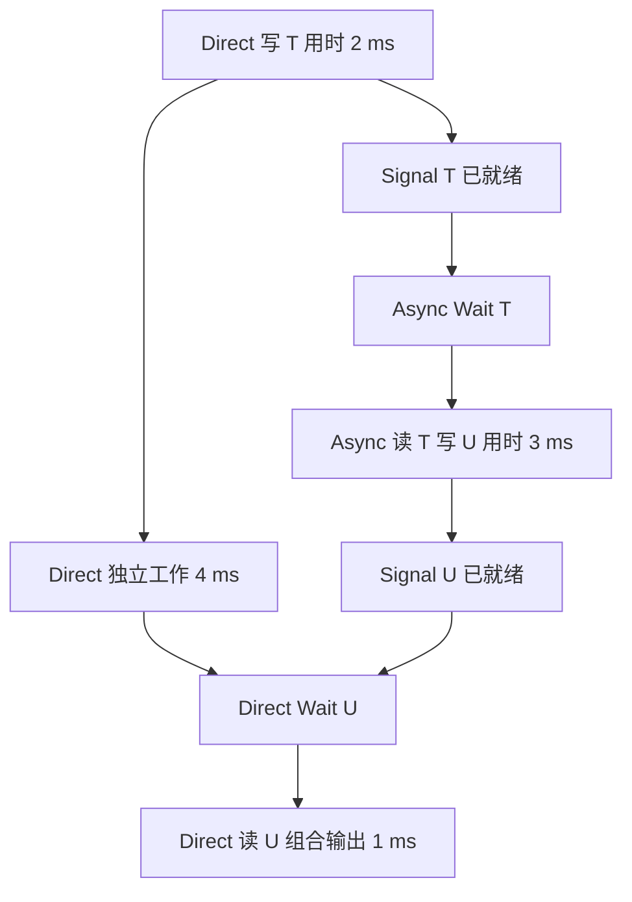

# 第 10 章：从 RHI 命令到 D3D12 队列与呈现

[返回目录](../README.md) · [本章答案](../appendices/answers/10-rhi-d3d12.md) · [一帧总览](00-frame-overview.md)

> **版本与范围：**UE 5.7.4，CL 51494982，Windows、D3D12、SM6，沿用[配置 A](../appendices/configuration.md)的传统桌面延迟渲染。Substrate、Nanite、Lumen、VSM 与硬件光线追踪关闭；这是本书选定的条件，不是对引擎默认配置的声明。
>
> **证据边界：**本章进行了本地源码静态核对，没有启动编辑器、抓取 GPU 帧或测量性能。`[源码已确认]`指本版本可定位的实现，`[教学简化]`指人为约定的模型，`[尚未验证]`指待运行确认的具体分支与观察结果。

## 10.1 学习目标与前置知识

第 08 章把游戏线程、渲染线程、RHI 工作与 GPU 执行分开；第 09 章说明 RDG 如何根据资源声明组织工作。接下来要回答：图中的依赖怎样成为图形 API 操作，一条“绘制方块”的命令又怎样进入设备队列？

学完本章，你应能完成五件事：

1. 区分 UE 的 RHI 命令列表、D3D12 上下文、原生命令列表与设备队列。
2. 沿一次索引绘制或计算调度找到实际记录入口，以及后续提交入口。
3. 分别解释资源状态、屏障、跨队列等待和 GPU Fence 的职责。
4. 说明描述符、根签名与 PSO 怎样共同决定 GPU 运行时使用什么数据和规则。
5. 判断 Present、GPU 完成与显示器实际显示之间能够证明的关系。

前置知识是第 03 章的深度与混合、第 04 章的 Shader、第 05 章的资源和视图，以及第 08、09 章的命令和依赖。这里不要求你能编写一个 D3D12 程序，也不要求记住全部 API 枚举值。

仍然观察红方块、金属球、地面、方向光与点光，以及蓝色 Unlit Translucent 薄片。P 是方块未被薄片覆盖的位置，Q 是两者重叠的位置。它们是观察标签，不是某个一直不变的像素坐标、对象 ID 或显存地址。

## 10.2 把同名的“命令列表”拆成不同对象

### 10.2.1 RHI 是后端接口，不是另一台 GPU

**渲染硬件接口（Render Hardware Interface，RHI）**给上层提供跨图形后端的资源与命令接口。本章选择 D3D12 后端，因此会进入 `D3D12RHI` 模块；换成其他后端，RDG 的很多组织方式仍可复用，底层命令结构和同步细节则可能改变。

RHI 层的 `DrawIndexedPrimitive` 表达“使用当前适用的状态和资源，进行这次索引绘制”。它不表达“画一个 Actor”，也不指定某一个输出像素最后应该是什么颜色。上层已经选好要画的几何、Shader 与参数，后端继续把这些要求落实到平台 API。

| 对象 | 主要保存或管理什么 | 本章最容易误读的地方 |
|---|---|---|
| `FRHICommandList` 等 RHI 列表 | UE 命令、参数、上下文与执行组织 | `Execute` 仍是 CPU 重放或翻译过程 |
| `FD3D12CommandContext` | 后端记录状态、当前列表、屏障与待提交工作 | Context 不是设备队列，也不是一个 GPU 核心 |
| `FD3D12CommandList` | UE 对 D3D12 命令列表的封装 | 与 RHI 列表处于不同层次 |
| D3D12 原生命令列表 | 交给图形 API 的记录结果 | 调用 Draw 记录接口不等于 GPU 已画完 |
| `FD3D12Payload` | 某个 GPU 节点、某类队列的工作与同步要求 | 一个载荷可含多张列表和等待、信号 |
| D3D12 Command Queue | 接收列表与队列同步操作 | CPU 提交函数返回不等于队列完成 |

**上下文（Context）**可以先理解为“正在为哪种后端工作记录命令，以及目前已经准备了哪些状态”。**载荷（Payload）**则是本版提交系统中的工作包。它们都是 UE 管理对象；最终设备接口是 D3D12 的命令列表、队列、资源和 Fence 等对象。

### 10.2.2 一对一关系通常不能凭名字假设

一个 Actor 可以产生多次绘制；一个 RDG Pass 可以记录多个 Draw；一个 RHI 列表也可以生成多项平台工作。后端还可能因同步点、记录规模和队列类型等原因关闭或拆分列表，再把适用列表批量提交。

因此统计表中的“RDG Pass 数”“Draw 数”“原生命令列表数”“ExecuteCommandLists 调用数”是不同量。它们之间有因果关系，却没有通用的固定换算系数。优化时应该先判断自己想减少的是 CPU 组织成本、状态切换、提交开销，还是 GPU 工作量。

[打开 RHI 到 GPU 的静态图](../assets/diagrams/10-rhi-d3d12-1.png)



**[教学简化]**图只表示职责连接，不按时间比例绘制；Bypass 只绕过适用的 RHI 命令记录与重放，没有绕过 D3D12 命令列表或设备队列。实际提交还要处理驻留、查询、资源转换修正等工作，本图不将其逐项展开。

## 10.3 跟踪一次红方块的索引绘制

### 10.3.1 记录下来的主要是操作与参数

**[源码已确认]** `FRHICommandList::DrawIndexedPrimitive` 检查 `Bypass()`：旁路时直接调用上下文接口；否则分配 `FRHICommandDrawIndexedPrimitive` 命令，保存索引缓冲、顶点偏移、起始实例、图元数等参数，见 [S10-01](#s10-01)。

这份记录并不会把方块所有纹理、顶点和 Shader 重新逐字节复制进命令对象。资源本身有另外的存储、引用和生命周期协议；命令表达对资源的使用。传入一个对象指针也不是让 GPU 将 CPU 指针当作纹理地址解引用。

之后，命令的 `Execute` 把这次调用转交后端上下文。这里的执行是 CPU 执行 C++ 代码：它解析引擎命令、取得平台资源、准备状态，并继续调用图形 API。第 08 章讨论的翻译任务可以让这些 CPU 工作在适用条件下并行，但每个上下文仍必须遵守自己的记录规则。

### 10.3.2 到 D3D12 后，仍然先检查和准备

**[源码已确认]** `FD3D12CommandContext::RHIDrawIndexedPrimitive` 取得后端索引缓冲，检查尺寸和有效资源，根据图元类型计算索引数，检查索引访问范围，调用 `SetupDraw`，最后记录 `DrawIndexedInstanced`，见 [S10-02](#s10-02)。

`DrawIndexedInstanced` 的名称揭示两件事：几何由索引引用顶点，可以按实例重复处理。它没有限定“实例一定是几个 Actor”；实例数据来自怎样的上层组织，要回到网格提交路径确认。

**[教学简化]**假设使用一个完整方块网格，三角形列表拓扑，每面两个三角形，共六面，并且这次 Draw 绘制整个网格的一份实例：

```text
三角形数 = 6 × 2 = 12
索引数   = 12 × 3 = 36
若每个索引为 16 bit，这段索引数据占 36 × 2 = 72 byte
```

若以同样参数绘制四个实例，提交的图元实例总量为 `12 × 4 = 48`，并不意味着索引缓冲必须扩成四倍。也不能据此计算最终 Pixel Shader 调用数：裁剪、遮挡、屏幕尺寸、深度测试、多重采样与硬件执行策略都会影响实际工作。

这里的 72 byte 只计算该索引范围的原始数据，不包括资源分配对齐、顶点缓冲、实例缓冲或其他资产信息。真实 Cube 资产的 Section、LOD 与顶点拆分应检查资产和捕获结果，不能由六个面推定全部缓冲布局。

### 10.3.3 Dispatch 走另一种工作形状

计算调度也有 RHI 记录与后端执行两层。**[源码已确认]** `DispatchComputeShader` 在适用分支记录命令；D3D12 后端的实现经过 `SetupDispatch` 后调用原生命令列表的 `Dispatch`，见 [S10-01](#s10-01)、[S10-02](#s10-02)。

Draw 让管线根据几何和图形状态产生工作，Dispatch 则给出线程组数量。计算 Shader 的每组线程数由 Shader 声明决定。传入 `(120,68,1)` 是线程组维度，不能直接说“只有 8160 个线程”，更不能只凭函数名判断它必定提交到异步计算队列。

## 10.4 记录一张原生命令列表需要什么

### 10.4.1 Command List 与 Command Allocator 不同

**命令分配器（Command Allocator）**管理记录命令所需的底层存储。命令列表对象提供记录接口，分配器支撑记录使用的内存。两个对象相关，但生命周期约束不能混为一谈。

**[源码已确认]** `OpenCommandList` 在上下文没有分配器时向设备取得一个，再取得命令列表，将列表加入当前 Payload 的执行集合。图形上下文还通知描述符缓存开启列表，以便建立需要的 Heap 绑定，见 [S10-03](#s10-03)。

如果 CPU 为下一批工作复用了对象，不代表它已经可以覆盖仍被 GPU 使用的命令存储。D3D12 对命令列表对象重置、Allocator 重置和设备仍在使用的记录有不同要求。UE 使用对象池与完成协议安排复用，本章不把“对象已经回到某个池”统一解释为“相关显存都空闲”。

### 10.4.2 Close 是结束记录，Finalize 是汇总工作

**[源码已确认]** `CloseCommandList` 先刷新累计的资源屏障，再关闭当前命令列表，处理查询记录。图形上下文还把状态缓存标为新列表需要重新设置，见 [S10-03](#s10-03)。

`Close` 意味着这份记录不再继续追加，尚不表示已经调用队列提交。`Finalize` 进一步关闭待处理列表，收集等待和信号，将命令分配器的后续释放责任挂到末尾 Payload，并把 Payload 集合移出上下文。

从调用者看，上下文已经整理好一批平台工作，可以交给提交系统；从 GPU 看，它们可能还没有进入设备队列。分清这两个视角，才能正确解释“CPU 这一段已经结束，GPU 为什么还没有对应事件”。

## 10.5 Payload 如何进入设备队列

### 10.5.1 载荷不只保存 Draw

**[源码已确认]** `FD3D12PayloadBase` 的注释将它定义为特定 GPU 节点和队列类型上的工作单元。字段包括等待的 SyncPoint、等待的队列 Fence、待执行命令列表、待发送信号、提交事件、完成值，以及待回收 Allocator，见 [S10-04](#s10-04)。

这些内容解释了为什么不能只看 Draw 参数来理解一次提交。消费者可能需要先等待其他队列的生产者；完成后还需要发出信号，让后续队列或 CPU 知道何时继续。

同步点可能尚未对应一个最终原生 Fence 数值。提交处理在掌握队列顺序后解析这些关系，因此上层可以用逻辑同步点表达依赖，而不必在记录时为每次跨队列工作手算全局数值。

### 10.5.2 RHI Submit 与后端 Submit 之间还有组织工作

**[源码已确认]** `RHIFinalizeContext` 调用上下文的 `Finalize`，按 RHI Pipeline 输出平台命令集合。`RHISubmitCommandLists` 将集合交给 `SubmitCommands`，后者收集 Payload，再调用 `SubmitPayloads`，见 [S10-05](#s10-05)。

`SubmitPayloads` 将工作排入提交队列。有专用 SubmissionThread 时唤醒该线程；没有时在调用线程中受锁保护地推进提交。是否创建专用线程还受配置、GPU 条件和捕获工具支持影响，因此不能把“D3D12 提交”固定画在一条永远存在的 RHIThread 上。

### 10.5.3 最终提交也可以分批

**[源码已确认]** 提交代码收集同一目标队列中适用 Payload 的已关闭命令列表，按批量限制等条件调用 `FD3D12Queue::ExecuteCommandLists`。Windows 的队列包装再选择驻留管理路径或原生队列调用，见 [S10-06](#s10-06)。

**驻留（Residency）**关注设备执行时需要的资源存储是否在适用的可访问内存中。它与“这张纹理现在作为 SRV 还是 RTV 使用”是不同问题；资源有正确状态，也仍然需要正确的内存管理。

在队列中安排命令后，CPU 通常仍能继续做其他工作。若 CPU 因节流、分配器不足、显式等待或呈现条件而阻塞，要定位实际等待点，不能把所有停顿都归因于 `ExecuteCommandLists` 的名字。

## 10.6 描述符：资源存在，还要说明怎样访问

### 10.6.1 资源、视图与描述符是三个层次

第 05 章说过，一张纹理可以有不同的访问视图。到了 D3D12，**描述符（Descriptor）**保存 API 所需的资源视图或采样器描述，使 GPU 操作能按指定格式、范围与方式使用资源。

| 概念 | 可以理解为 | 不包含的保证 |
|---|---|---|
| Resource | 保存纹理或缓冲数据的底层资源 | 不自动指定本次使用哪个 Mip |
| SRV / UAV / RTV / DSV | 对资源的一种读取或写入视图 | 不自动使前次 GPU 写入完成 |
| Descriptor | 平台表达相应视图或采样器的信息 | 不替代屏障、Fence 或资源寿命管理 |
| Descriptor Heap | 按 D3D12 规则容纳描述符的集合 | 不是纹理全部像素数据的存储集合 |

SRV 可供 Shader 读取纹理或缓冲；UAV 支持相应的 Shader 读写；RTV 和 DSV 参与图形输出附件；CBV 描述常量缓冲访问；Sampler 描述过滤和寻址等采样规则。它们不是“同一种指针换个名字”。

D3D12 的 Shader 可见描述符 Heap 主要是 CBV/SRV/UAV 与 Sampler 两类；RTV、DSV 使用不同的绑定方式。CPU Handle 与 GPU Handle 也有不同用途。教材中把 Handle 画成箭头，是为了表示引用关系，不能由此把整数随意转换成 C++ 指针读取。

### 10.6.2 绑定可以更新引用，数据未必被重新上传

如果两个材质实例使用不同的 Base Color 纹理，绑定阶段可能选择不同描述符或索引；这不意味着每次 Draw 都重新上传整张纹理。反过来，材质参数变化也可能主要更新参数数据，而不是创建一套新的所有平台对象。

**[源码已确认]** 描述符缓存包含 `SetDescriptorHeaps`、图形和计算 Root Descriptor Table 的设置，以及 Root Constant Buffer View 的路径，见 [S10-07](#s10-07)。这些操作共同把已经选好的资源访问连接到 Shader 所期待的位置。

描述符本身也受生命周期约束。GPU 尚未消费一份记录时，CPU 不能随意覆盖它将读取的描述符槽，让同一个索引悄悄指向另一张纹理。纹理还活着、C++ 指针没有空值，都不足以证明这次更新符合 GPU 时间关系。

本版还存在 Bindless 资源绑定路径，即通过 Shader 可使用的资源索引访问较大的描述符集合。它仍需要 Heap、有效索引和资源管理，并不意味着“无需绑定任何东西”。本章没有运行确认配置 A 的实际 Bindless 选择，阅读捕获结果时应先核对 Shader 与后端配置。

## 10.7 根签名与 PSO 分别决定什么

### 10.7.1 根签名说明参数怎样进入 Shader

**根签名（Root Signature）**规定 Shader 可通过哪些根参数、描述符表等途径访问资源和常量。可以把它理解为平台层的参数布局契约，但不能把它当作材质节点图本身。

同样是“给 Shader 一个颜色”，实现可以涉及常量缓冲或根常量等形式；纹理访问则需要匹配相应资源绑定声明。具体布局由 Shader 编译结果、绑定约定和后端实现共同确定，不是按照材质编辑器中节点的左右位置生成槽位。

**[源码已确认]** 状态缓存按图形或计算管线分别设置 Root Signature，设置之后把相关 SRV、UAV、Sampler、CBV 与根常量标记为需要更新，见 [S10-08](#s10-08)。只换根签名而继续假定旧参数含义完全相同，会破坏这份契约。

### 10.7.2 PSO 把相互关联的管线配置组合起来

**管线状态对象（Pipeline State Object，PSO）**保存供一类图形或计算工作使用的管线配置。对于传统图形 Draw，关联内容包括 Shader、根签名、输入布局、光栅化、深度模板、混合、输出格式和采样数等。

**[源码已确认]** D3D12 图形 PSO 描述构造函数从 `FGraphicsPipelineStateInitializer` 取得这些适用字段，并复制 Shader 字节码等信息，见 [S10-09](#s10-09)。具体字段受编译分支影响，不能把一个简化结构当作所有扩展管线的完整格式。

PSO 不是一帧画面，也不保存每个像素的最终颜色。纹理内容、材质参数、视口和具体绘制参数等还需另行提供。若红方块仅把同一材质实例的颜色参数从红改绿，通常不能据此推断一定新建图形 PSO；若改成透明混合或改变 Shader 静态分支，可能影响 Shader 和管线组合，需要按实际编译与缓存路径判断。

第 03 章中的深度比较与混合因子并未停留在教材公式里：它们通过 RHI 状态对象进入相应图形管线配置。GPU 后续按已提交配置执行。因此 Q 的透明合成错误可能来自错误混合状态，也可能来自输入颜色、排序或合成阶段，不能看到“蓝色不对”就直接归因于 PSO。

### 10.7.3 状态缓存减少重复设置，但不会替你理解画面

**[源码已确认]** `ApplyState` 根据条件设置描述符 Heap、根签名与 PSO；`InternalSetPipelineState` 比较当前对象与待使用对象，在需要时调用 `SetPipelineState`，见 [S10-08](#s10-08)。

因此两次 RHI 状态设置不一定产生两次原生设置调用。缓存减少的是重复操作，并不改变程序要求的结果。新命令列表开始、绑定布局变化或资源 Heap 切换后，需要重建的状态依然必须记录。

首次遇到某种管线组合时的 CPU 创建或等待，和该 PSO 在 GPU 上运行耗时是两个问题。只看到第一次经过某处发生卡顿，尚不足以证明 PSO 编译是原因；应结合创建、缓存命中及等待事件验证，而不是依据“首次出现”四个字直接下结论。

## 10.8 资源状态：这次允许怎样使用资源

### 10.8.1 同一张纹理在一帧中可以换用途

假设某个光照阶段把结果写入 Scene Color，之后一个计算效果读取它，再将结果写入另一张纹理。数据流很简单，但访问方式发生了变化：颜色附件写入、Shader 读取和 UAV 写入具有不同的平台要求。

**资源状态（Resource State）**在传统 D3D12 屏障模型中表达资源允许的使用类别。它不等于纹理的颜色值，也不等于“资源已加载”或“Actor 当前可见”。改变使用状态通常是安排同步和必要的设备内部处理，不是在做一次红色到蓝色的颜色转换。

| 教学访问需求 | 传统 D3D12 状态的典型对应 | 注意事项 |
|---|---|---|
| 写颜色附件 | `RENDER_TARGET` | 仍要绑定正确 RTV |
| 写深度附件 | `DEPTH_WRITE` | 与深度比较函数是不同概念 |
| 计算 Shader 读取 | `NON_PIXEL_SHADER_RESOURCE` | SRV、范围及资源内容也要正确 |
| UAV 访问 | `UNORDERED_ACCESS` | 连续 UAV 工作可能仍有写后读依赖 |
| 复制源、复制目标 | `COPY_SOURCE`、`COPY_DEST` | 状态转换本身不复制像素 |
| 交换链呈现用途 | `PRESENT` | 进入该用途不等于已经显示 |

这是用于入门的对应表，不是建议调用者直接给任意资源套状态。读状态可以有适用组合，深度纹理有特殊关系，Mip、数组层和 Plane 可能需要分别处理。

**[源码已确认]** 本版传统实现的 `GetD3D12ResourceState` 会结合访问标志、队列类型和资源描述进行转换。尤其 `SRVGraphics` 在 Direct 队列上可映射到 Pixel 与 Non-Pixel Shader 读取状态的组合，并非只映射 Pixel 状态，见 [S10-10](#s10-10)。

### 10.8.2 创建标志、视图与状态必须共同有效

把一个没有所需创建能力的资源临时标为 UAV，不会凭空赋予它完整 UAV 支持；给错误格式建立视图，也不会靠多插一个屏障修好。资源创建、视图解释、当前访问和同步是需要一起满足的条件。

例如读取 P 的深度，首先要确认读的是哪份深度资源、哪次渲染和哪种编码，再确认使用匹配的读取视图和访问关系。若把反向 Z 值当作线性米数，GPU 同步完全正确也会得到错误解释。平台正确性与图像语义正确性需要分别检查。

## 10.9 屏障维护访问依赖，不是全局暂停键

### 10.9.1 三类经典问题

**资源屏障（Resource Barrier）**告诉设备，某些访问需要满足状态转换、先后顺序、写入可见性或存储复用等条件。传统 D3D12 模型常见三类：

1. **Transition Barrier：**从一种合法使用状态转换到另一种，例如颜色附件写入后改为 Shader 读取。
2. **UAV Barrier：**处理适用 UAV 访问之间的先后与可见性要求，即使资源仍处于 UAV 状态。
3. **Aliasing Barrier：**处理不同资源复用重叠底层存储时的相关访问边界。

这解释了三个容易混淆的现象：状态名称没变仍可能需要同步；同一队列中仍可能需要屏障；两张不同名字的临时纹理也可能因复用同一片内存而需要建立关系。

它们都不表示 CPU 必须停下来等待整个 GPU。相应 API 调用通常先把要求记录进命令列表，设备在执行时落实必要约束。具体代价受前后工作、资源布局与硬件等影响，不能给“一个 Barrier”指定跨场景不变的耗时。

### 10.9.2 从 RDG 的访问声明到后端屏障

第 09 章的 RDG 分析资源生产和消费关系，组织 RHI Transition。**[源码已确认]** 本版 D3D12 的 `RHIBeginTransitions` 和 `RHIEndTransitions` 将工作交给选定屏障实现，传统实现累计屏障并在刷新时调用 `ResourceBarrier`，见 [S10-11](#s10-11)。

所以 `RDG Pass A → Pass B` 并不是一根直接画到显卡上的线。它可能导致状态转换、某个管线上的同步点，以及跨队列等待。后端还能合并适用屏障、处理首次使用状态等细节，不能把图中每一条边机械计为一次原生 Barrier 调用。

最危险的错误之一，是回调隐藏读取某张纹理，却没有在图参数或约定路径中声明。RDG 未掌握完整访问，就可能无法安排所需转换和寿命。到后端追加一个无差别的“等 GPU 空闲”可能暂时改变症状，却不能代替修正资源声明和拥有关系。

### 10.9.3 本版有传统与增强两套实现

**增强屏障（Enhanced Barriers）**将同步范围、访问类别和纹理布局等信息更明确地分开表达。理解它时可分别问：前后哪些工作需要排序，哪些读写需要可见性，纹理布局是否需要变化。

**[源码已确认]** 本版源代码存在两种实现，增强路径最终调用 `GraphicsCommandList8()->Barrier`。但 `GPreferredBarrierImplementation` 的源码初始值是 `1`，对应 Legacy；最终选择还经过构建能力、驱动支持、偏好与工厂创建，并输出 `Chosen Barrier Implementation` 日志，见 [S10-12](#s10-12)。

SM6 只是本书的 Shader 平台条件之一，不能拿它证明增强屏障已经启用。这里用传统状态解释入门概念，同时保留增强实现的源码入口；本次没有运行记录，配置 A 的实际选择仍为 `[尚未验证]`。

## 10.10 队列之间需要明确的等待与信号

### 10.10.1 多队列不是三个互不相干的 GPU

D3D12 支持 Direct、Compute、Copy 等命令队列类型。UE 此处使用 Direct、Async、Copy 的后端分类。Direct 队列能够执行适用的图形、计算和复制工作；Dispatch 出现在 Direct 队列中并不奇怪。

不同队列上的命令不会因为 CPU 先调用了生产者的提交函数，就自动为消费者建立完整依赖。生产者写纹理、消费者在另一个队列读纹理，需要通过适当的同步点、队列等待和资源转换保持先后关系。

**[源码已确认]** 两套屏障实现都包含跨 Pipeline 的 `WaitSyncPoint` 路径；上下文将等待与信号写入 Payload，提交代码最终调用设备队列 `Wait` 和 `Signal`，见 [S10-13](#s10-13)。

这里的队列 `Wait` 让目标队列后续工作等待对应 Fence 条件，不等于调用它的 CPU 线程必须一直阻塞。CPU 若要等待 GPU，则使用另外的完成查询或事件机制。它们可以关联同一进度点，但阻塞发生在哪里不同。

### 10.10.2 用一个可计算的依赖图理解重叠

**[教学简化]**下面人为给定四项 GPU 工作，不是配置 A 的实际 Pass，也不是实测时间：Direct 队列先用 2 ms 产生纹理 T，再有 4 ms 与 T 的消费者无关的工作；Async 队列读取 T，用 3 ms 产生 U；最后 Direct 队列读取 U，组合输出需要 1 ms。

[打开双队列依赖静态图](../assets/diagrams/10-rhi-d3d12-2.png)



若全部串行，时间为 `2 + 4 + 3 + 1 = 10 ms`。若资源、队列和设备允许理想重叠，前 2 ms 结束后，两段独立工作一起推进，末尾组合开始时间为：

```text
Direct 独立工作结束 = 2 + 4 = 6 ms
Async 生成 U 结束   = 2 + 3 = 5 ms
组合开始           = max(6, 5) = 6 ms
完成               = 6 + 1 = 7 ms
```

不是 `max(2,4,3,1)=4 ms`，因为 T 的生产和最终组合仍位于依赖链上。若错误地让 Direct 队列在那 4 ms 独立工作之前等待 U，就会放弃这段可重叠机会，模型可能重新接近串行的 10 ms。

真实设备还存在执行单元、带宽与缓存竞争，异步重叠可能改变每项工作的实际耗时。图能证明依赖是否允许重叠，不能证明一定节省 3 ms，更不能仅凭创建了 Compute 队列就宣称性能提升。

## 10.11 Fence、完成事件与资源回收

### 10.11.1 Fence 数值记录的是某个进度关系

**栅栏（Fence）**可理解为队列进度的同步对象。UE 为队列安排递增完成值，将逻辑 SyncPoint 解析到对应 Fence 与数值，再用它表达“到达这个点后才能继续”。数值 42 不是“第 42 个像素”，也不天然等于游戏第 42 帧。

**[教学简化]**假设同一队列为三批相关工作依次安排完成值 41、42、43。CPU 查询已完成值为 42，则可认为该队列由此同步协议覆盖、位于 42 信号之前的工作已经达到完成点；不能推出 43 已完成，不能推出另一个无依赖队列空闲，也不能推出交换链已经显示该结果。

### 10.11.2 UE 如何把设备完成传回 CPU

**[源码已确认]** `FD3D12SyncPoint` 分为 `GPUOnly` 与 `GPUAndCPU`：后一种包含可让 CPU 查询或等待的 Graph Event，前一种不支持这种 CPU 完成查询，见 [S10-14](#s10-14)。

提交系统在 GPU 完成检查路径查询 `GetCompletedValue`，比较 Payload 的完成值；条件满足后派发相关 SyncPoint 的 CPU 事件，再删除完成的 Payload。其析构将挂载的 Allocator 交回设备，见 [S10-14](#s10-14)。

这条路径解释了第 10.4 节留下的问题：CPU 结束记录后，Allocator 的回收仍可保留到 GPU 完成关系满足。不要把这种具体回收协议推广成“所有资源统一延迟两帧释放”；不同资源还有引用、别名、描述符和平台回收策略。

### 10.11.3 等待之前，先说清要保护什么

如果只是让 CPU 知道某批后端提交已推进，应看提交事件。若 CPU 要读取 GPU 刚复制到读回存储的数据，应确保对应 GPU 工作完成，并遵守读回接口的准备、查询和访问协议。若目的是等渲染线程消费组件分离，则回到第 06、08 章的 Render Fence。

**[源码已确认]** `FlushCommands` 明确区分 `WaitForSubmission` 与 `WaitForCompletion`：前者创建 Submission Event，后者创建 `GPUAndCPU` SyncPoint 并等待，见 [S10-15](#s10-15)。这不是只换一个函数名字，而是在等待不同层次的完成。

Fence 也不会自动将任意纹理变成 CPU 可直接读取的数组。读回仍要选择支持的复制与读回资源，并处理格式、行跨度和范围。即使成功读到 P 的数值，也应标明它来自哪一阶段，不能把 HDR Scene Color 与显示编码后的后缓冲混为一张图。

## 10.12 从输出纹理到 Present，再到显示器

### 10.12.1 Scene Color 通常不是最终后缓冲

**后缓冲（Back Buffer）**是交换链管理、用于准备呈现的图像资源。渲染中的深度、GBuffer、HDR Scene Color、后处理临时纹理和历史纹理，通常是不同资源。它们可以经过读取、组合、复制或绘制，最终形成适合目标输出的后缓冲内容。

所以“Q 已写进 Scene Color”不等于“Q 已交给显示器”。蓝色薄片的 Emissive 与 Opacity 先参与相应材质和合成过程，曝光、色调映射、颜色编码以及 UI 等适用工作还可能改变最终输出。不能把材质的 Tint `(0.1, 0.6, 1)` 直接当作屏幕上一定读到的 RGB。

P 与 Q 到这里也不再携带一个可由显示器识别的“来自红方块”身份。显示系统收到的是完成指定输出流程的图像。若需要追溯原物体，应使用引擎中的专用可视化、ID 输出或 GPU 捕获数据，不能从一般后缓冲颜色可靠反推对象。

### 10.12.2 本版 Present 前等待的是什么

**[源码已确认]** `RHIEndDrawingViewport` 根据 `bPresent` 调用视口 `Present`。`FD3D12Viewport::Present` 在允许呈现时刷新资源屏障，并调用 `FlushCommands(WaitForSubmission)`；随后经 `PresentChecked` 进入适用的原生呈现路径，见 [S10-16](#s10-16)。

源码明确说明这里需要先让提交线程处理完前面的命令，以建立呈现所需的提交顺序。它没有在这一句选择 `WaitForCompletion`，因此不能解释为“CPU 每次必须先等当前整帧 GPU 完成，才允许调用 Present”。

这也不意味着该函数整条路径绝不等待 GPU。Windows 原生 Present 可能因 GPU 进度与交换链空间阻塞；视口结束路径还根据配置管理帧完成事件。应区分某个参数的语义与完整调用链可能发生的等待，不能用前者否定后者。

`PresentChecked` 还处理 Custom Present 等条件，本章采用普通 Windows 交换链作为讲解主线，不声称每种插件、头显或窗口输出都调用同一条原生呈现路径。

### 10.12.3 Present 返回不证明整屏已经发光

**[源码已确认]** Windows 路径调用 `SwapChain1->Present(SyncInterval, Flags)`；是否允许 Tearing 结合同步间隔、窗口模式与能力条件决定，见 [S10-17](#s10-17)。这证实了引擎到 DXGI 呈现 API 的连接，但源码调用本身没有测量面板的物理响应。

之后还涉及操作系统合成、交换链模式、刷新节奏、扫描输出与显示设备响应。垂直同步、可变刷新率以及窗口模式会改变时序关系。成功返回主要说明 API 请求按其契约处理，不能当作“用户在同一瞬间看到所有新像素”的通知。

**[教学简化]**若假定固定 60 Hz、只有离散呈现机会，机会位于 0、16.67、33.33 ms，并暂时忽略合成排队等细节，那么 18 ms 才准备好的输出已经错过 16.67 ms，下一次机会是约 33.33 ms。这个算例只说明截止时刻的重要性，不能当作当前项目的实际输入延迟。

即便进入同一次扫描，也不表示面板所有行同时完成显示。需要端到端延迟时，应采用能够联系输入、提交、扫描与物理显示的测量方案；CPU Present 区间和 GPU 总时长只能分别提供其中一部分证据。

## 10.13 动手观察与排查路线

### 10.13.1 先建立可复现的记录表

**[尚未验证]**以下为未来运行步骤，本次没有对应截图或捕获。使用独立练习副本，保持配置 A 的场景、相机与曝光，记录引擎版本、显卡驱动、窗口模式、分辨率和同步设置。薄片维持 Tint `(0.1,0.6,1)`、EmissiveStrength `300`、Opacity `0.35`，手动 EV100 约 `9.9`。

先在启动日志确认 D3D12 与目标 Shader 平台，再查 `Chosen Barrier Implementation`，将实际选择填入记录。不要在程序运行中随意切换本版标为只读的屏障或提交线程配置，也不要把变量的源码初值当作此次进程的最终生效值。

若使用兼容的 GPU 捕获工具，选择稳定后的普通一帧。捕获工具可能影响提交线程、调度和性能，所以先用捕获解释资源和命令，再在适用的非捕获运行中测量性能；两种运行的条件必须分别记清。

### 10.13.2 按资源和调用层次检查一个 Draw

从方块的一次实际绘制出发，记录对应事件、索引缓冲范围、实例数、图形 PSO、输入资源和输出附件。确认它属于哪个阶段，再看该阶段之后资源怎样被使用。不要把某次阴影 Draw 当成最终写入 P 颜色的 Base Pass Draw。

在源码调试中，可依次放置只读断点：`DrawIndexedPrimitive`、RHI 命令 `Execute`、D3D12 `RHIDrawIndexedPrimitive`、`RHIFinalizeContext`、`RHISubmitCommandLists` 和队列包装入口。若没有命中某一项，先核查 Bypass、间接绘制、剔除、实例化和实际路径，而不是立即判定渲染失效。

断点会改变线程时序，不能把逐步执行时看到的排队间距当作正常运行的性能结果。对某个对象地址的观察也只在该次运行及其生命周期内有效，重启或重新注册后应重新定位。

### 10.13.3 给症状匹配证据

| 症状 | 优先需要核对的证据 | 不足以单独证明原因的现象 |
|---|---|---|
| 方块颜色错误 | 所处阶段、绑定纹理或参数、曝光与输出解释 | PSO 对象非空 |
| 透明重叠错误 | 合成阶段、排序、深度与混合状态 | Draw 已经提交 |
| 跨队列结果偶发错误 | 生产消费声明、屏障、Signal 与 Wait、寿命 | CPU 提交顺序看起来正确 |
| 首次出现明显停顿 | Shader 或 PSO 准备、资源上传与实际等待事件 | 只在首次出现 |
| CPU Present 区间很长 | 交换链空间、同步节奏、GPU 进度和帧限制 | 某个 Shader 很复杂 |
| 删除对象后异常 | CPU 对象、RHI 资源、描述符和 GPU 使用期 | C++ 引用计数曾经归零 |

观察的目标是补齐因果链。先说清资源在哪里被谁读写，再判断同步与绑定；先区分 CPU 等待和 GPU 执行，再讨论耗时。这样才能把问题交给真正拥有该行为的层次。

## 10.14 概念回顾与下一章衔接

RHI 命令表达引擎要做什么；D3D12 上下文把它们组织为平台状态和命令列表；Payload 汇总列表与同步关系，提交系统再推进设备队列。描述符和根签名连接资源与 Shader，PSO 确定适用管线规则，屏障与 Fence 保护访问和生命周期。

到达 Present 只完成了引擎向显示系统推进输出的重要一步。GPU 完成、API 呈现请求和物理显示仍有各自边界。沿这条路线继续研究深度、Base Pass、光照与后处理时，应该同时追踪“写出了什么”与“哪一层已经完成”。

下一章将回到[场景更新、GPU Scene 与可见性](11-scene-visibility.md)，解释 Shader 所需场景数据怎样更新，以及哪些 primitive 和实例值得继续组织绘制。深度、阴影及表面数据的生产随后分章展开。需要复习职责划分时，返回[第 08 章](08-threads-and-gpu.md)；需要解释哪些资源应建立依赖时，返回[第 09 章](09-rdg.md)。

## 10.15 理解检查

1. 按先后与职责区分 RHI 命令 `Execute`、原生 `DrawIndexedInstanced`、`Finalize`、`ExecuteCommandLists`、GPU Fence 满足和 Present。哪些步骤通常仍是 CPU 组织或记录？
2. 教学方块有 12 个三角形，使用三角形列表、16 bit 索引，以四个实例绘制整个网格。每实例索引数、基础索引范围字节数和图元实例总量分别是多少？为什么不能由这些量直接推出 Pixel Shader 调用数？
3. 一张纹理先作为颜色附件写入，再被计算 Shader 读取；随后两次 UAV 调度存在写后读依赖。分别说明描述符、状态转换和 UAV 同步的作用。若消费发生在另一个队列，还缺少哪一类关系？
4. 在 10.10 节的四项工作模型中，将 Direct 独立工作从 4 ms 改为 1 ms，其余不变。理想重叠时最终完成时间是多少？Direct 在组合前要等待多久？为什么创建第二条队列并不保证实测达到该值？
5. 有人说：“已经设置正确 PSO，`WaitForSubmission` 返回，Present 也返回成功，所以纹理肯定已经安全读回，且屏幕已完整显示。”请指出这段推论缺失的证据，并说明本版如何确认所用屏障实现。

答案见[本章答案](../appendices/answers/10-rhi-d3d12.md)。

## 10.16 源码证据索引

下列入口均对照本地 UE 5.7.4 静态核对；链接行是阅读起点，结论需要结合相邻条件。引擎升级后应重新定位，不将行号当成稳定 API。

<a id="s10-01"></a>
**S10-01：RHI 记录与转发。** [RHICommandList.h:3973](G:/UnrealEngineInstalled/UE_5.7/Engine/Source/Runtime/RHI/Public/RHICommandList.h:3973) 为索引绘制入口，3976 附近检查 Bypass，3981 记录命令；同文件 [2929](G:/UnrealEngineInstalled/UE_5.7/Engine/Source/Runtime/RHI/Public/RHICommandList.h:2929) 是计算调度。转发实现见 [RHICommandListCommandExecutes.inl:148](G:/UnrealEngineInstalled/UE_5.7/Engine/Source/Runtime/RHI/Public/RHICommandListCommandExecutes.inl:148) 与 226。相对目录均为 `Source/Runtime/RHI/Public/`。

<a id="s10-02"></a>
**S10-02：后端记录 Draw 与 Dispatch。** [D3D12Commands.cpp:1270](G:/UnrealEngineInstalled/UE_5.7/Engine/Source/Runtime/D3D12RHI/Private/D3D12Commands.cpp:1270) 检查缓冲、计算索引数并准备 Draw，1297 调用 `DrawIndexedInstanced`；[140](G:/UnrealEngineInstalled/UE_5.7/Engine/Source/Runtime/D3D12RHI/Private/D3D12Commands.cpp:140) 的计算路径在 146 调用 `Dispatch`。相对路径为 `Source/Runtime/D3D12RHI/Private/D3D12Commands.cpp`。

<a id="s10-03"></a>
**S10-03：列表记录与上下文结束。** [D3D12CommandContext.cpp:351](G:/UnrealEngineInstalled/UE_5.7/Engine/Source/Runtime/D3D12RHI/Private/D3D12CommandContext.cpp:351) 取得 Allocator 和列表，364 加入执行集合；[378](G:/UnrealEngineInstalled/UE_5.7/Engine/Source/Runtime/D3D12RHI/Private/D3D12CommandContext.cpp:378) 刷新屏障并关闭列表；[419](G:/UnrealEngineInstalled/UE_5.7/Engine/Source/Runtime/D3D12RHI/Private/D3D12CommandContext.cpp:419) 汇总同步和回收责任，458 移出 Payload。相对目录为 `Source/Runtime/D3D12RHI/Private/`。

<a id="s10-04"></a>
**S10-04：Payload 的实际内容。** [D3D12Submission.h:192](G:/UnrealEngineInstalled/UE_5.7/Engine/Source/Runtime/D3D12RHI/Private/D3D12Submission.h:192) 的定义与注释说明队列工作单元；244 是命令列表集合，248 是信号集合，249 是完成值，251 是提交事件，257 是待回收 Allocator。相对路径为 `Source/Runtime/D3D12RHI/Private/D3D12Submission.h`。

<a id="s10-05"></a>
**S10-05：RHI 到提交系统。** [D3D12Submission.cpp:222](G:/UnrealEngineInstalled/UE_5.7/Engine/Source/Runtime/D3D12RHI/Private/D3D12Submission.cpp:222) 实现 `RHIFinalizeContext`；[261](G:/UnrealEngineInstalled/UE_5.7/Engine/Source/Runtime/D3D12RHI/Private/D3D12Submission.cpp:261) 接收 RHI 提交；[332](G:/UnrealEngineInstalled/UE_5.7/Engine/Source/Runtime/D3D12RHI/Private/D3D12Submission.cpp:332) 排队并按是否存在 SubmissionThread 分支。线程创建条件在同文件 153 起，174 创建专用线程。相对目录同 S10-04。

<a id="s10-06"></a>
**S10-06：平台列表进入设备队列。** [D3D12Submission.cpp:764](G:/UnrealEngineInstalled/UE_5.7/Engine/Source/Runtime/D3D12RHI/Private/D3D12Submission.cpp:764) 收集列表，788 要求已关闭，803 起处理批量限制，827 调用队列包装。[WindowsD3D12Device.cpp:2297](G:/UnrealEngineInstalled/UE_5.7/Engine/Source/Runtime/D3D12RHI/Private/Windows/WindowsD3D12Device.cpp:2297) 根据驻留管理条件进入相应路径，2320 是直接调用原生队列的分支。后者相对目录为 `Source/Runtime/D3D12RHI/Private/Windows/`。

<a id="s10-07"></a>
**S10-07：描述符绑定。** [D3D12DescriptorCache.cpp:71](G:/UnrealEngineInstalled/UE_5.7/Engine/Source/Runtime/D3D12RHI/Private/D3D12DescriptorCache.cpp:71) 选择并设置 Heap，141 调用 `SetDescriptorHeaps`；[278](G:/UnrealEngineInstalled/UE_5.7/Engine/Source/Runtime/D3D12RHI/Private/D3D12DescriptorCache.cpp:278) 与 282 设置图形或计算描述符表；[742](G:/UnrealEngineInstalled/UE_5.7/Engine/Source/Runtime/D3D12RHI/Private/D3D12DescriptorCache.cpp:742) 与 746 设置 Root CBV。相对路径为 `Source/Runtime/D3D12RHI/Private/D3D12DescriptorCache.cpp`。

<a id="s10-08"></a>
**S10-08：根签名与状态缓存。** [D3D12StateCache.cpp:370](G:/UnrealEngineInstalled/UE_5.7/Engine/Source/Runtime/D3D12RHI/Private/D3D12StateCache.cpp:370) 设置相应根签名并标记相关绑定；[413](G:/UnrealEngineInstalled/UE_5.7/Engine/Source/Runtime/D3D12RHI/Private/D3D12StateCache.cpp:413) 检查并设置 PSO；[432](G:/UnrealEngineInstalled/UE_5.7/Engine/Source/Runtime/D3D12RHI/Private/D3D12StateCache.cpp:432) 的 `ApplyState` 在 523 起连接 Heap、根签名和 PSO，之前含 Bindless 条件。相对目录同 S10-07。

<a id="s10-09"></a>
**S10-09：图形 PSO 描述。** [D3D12PipelineState.cpp:62](G:/UnrealEngineInstalled/UE_5.7/Engine/Source/Runtime/D3D12RHI/Private/D3D12PipelineState.cpp:62) 从初始化器构造低层描述：70 起为适用混合、光栅化与深度字段，80 为输出格式，82 为采样，85 为输入布局，92 起复制适用 Shader。相对路径为 `Source/Runtime/D3D12RHI/Private/D3D12PipelineState.cpp`。

<a id="s10-10"></a>
**S10-10：传统资源状态映射。** [D3D12LegacyBarriers.cpp:213](G:/UnrealEngineInstalled/UE_5.7/Engine/Source/Runtime/D3D12RHI/Private/D3D12LegacyBarriers.cpp:213) 转换访问要求；233 起处理常见写状态，287 起按队列和读标志组合状态。它不是所有平台共享的固定一对一表。相对路径为 `Source/Runtime/D3D12RHI/Private/D3D12LegacyBarriers.cpp`。

<a id="s10-11"></a>
**S10-11：转换转发与传统屏障刷新。** [D3D12Commands.cpp:176](G:/UnrealEngineInstalled/UE_5.7/Engine/Source/Runtime/D3D12RHI/Private/D3D12Commands.cpp:176) 与 181 调用屏障实现。[D3D12LegacyBarriers.cpp:795](G:/UnrealEngineInstalled/UE_5.7/Engine/Source/Runtime/D3D12RHI/Private/D3D12LegacyBarriers.cpp:795) 附近构造 UAV 屏障，838 构造 Transition，852 起构造 Aliasing，919 将适用批次记录到原生命令列表。相对目录同 S10-10。

<a id="s10-12"></a>
**S10-12：屏障实现的选择边界。** [D3D12Adapter.cpp:84](G:/UnrealEngineInstalled/UE_5.7/Engine/Source/Runtime/D3D12RHI/Private/D3D12Adapter.cpp:84) 为偏好初值，86 注册只读变量；[1167](G:/UnrealEngineInstalled/UE_5.7/Engine/Source/Runtime/D3D12RHI/Private/D3D12Adapter.cpp:1167) 起处理能力、偏好和工厂选择，1206 输出最终选择。[D3D12EnhancedBarriers.cpp:2169](G:/UnrealEngineInstalled/UE_5.7/Engine/Source/Runtime/D3D12RHI/Private/D3D12EnhancedBarriers.cpp:2169) 为增强屏障原生记录入口。相对目录为 `Source/Runtime/D3D12RHI/Private/`。

<a id="s10-13"></a>
**S10-13：跨队列同步。** [D3D12LegacyBarriers.cpp:1565](G:/UnrealEngineInstalled/UE_5.7/Engine/Source/Runtime/D3D12RHI/Private/D3D12LegacyBarriers.cpp:1565) 与 [D3D12EnhancedBarriers.cpp:2743](G:/UnrealEngineInstalled/UE_5.7/Engine/Source/Runtime/D3D12RHI/Private/D3D12EnhancedBarriers.cpp:2743) 处理跨 Pipeline 等待。[D3D12CommandContext.cpp:252](G:/UnrealEngineInstalled/UE_5.7/Engine/Source/Runtime/D3D12RHI/Private/D3D12CommandContext.cpp:252) 与 262 记录等待和信号；[D3D12Submission.cpp:754](G:/UnrealEngineInstalled/UE_5.7/Engine/Source/Runtime/D3D12RHI/Private/D3D12Submission.cpp:754) 为队列 Wait，870 为队列完成 Fence 的 Signal。相对目录同 S10-12。

<a id="s10-14"></a>
**S10-14：完成值、CPU 事件与回收。** [D3D12Submission.h:29](G:/UnrealEngineInstalled/UE_5.7/Engine/Source/Runtime/D3D12RHI/Private/D3D12Submission.h:29) 区分两类 SyncPoint，67 起说明逻辑时间点，107 检查 CPU 查询条件。[D3D12Submission.cpp:1151](G:/UnrealEngineInstalled/UE_5.7/Engine/Source/Runtime/D3D12RHI/Private/D3D12Submission.cpp:1151) 读取完成值，1160 比较目标；[1303](G:/UnrealEngineInstalled/UE_5.7/Engine/Source/Runtime/D3D12RHI/Private/D3D12Submission.cpp:1303) 起派发 CPU 事件并删除 Payload，1341 起回收其 Allocator。相对目录同 S10-12。

<a id="s10-15"></a>
**S10-15：两种 Flush 等待。** [D3D12CommandContext.cpp:603](G:/UnrealEngineInstalled/UE_5.7/Engine/Source/Runtime/D3D12RHI/Private/D3D12CommandContext.cpp:603) 的 `FlushCommands` 在 623 检查 GPU 完成等待，在 629 检查提交等待，641 与 646 分别等待对应对象。相对路径见 S10-03。

<a id="s10-16"></a>
**S10-16：视口呈现连接。** [D3D12Viewport.cpp:753](G:/UnrealEngineInstalled/UE_5.7/Engine/Source/Runtime/D3D12RHI/Private/D3D12Viewport.cpp:753) 按条件结束与呈现视口；[598](G:/UnrealEngineInstalled/UE_5.7/Engine/Source/Runtime/D3D12RHI/Private/D3D12Viewport.cpp:598) 的 Present 在 618 等待提交，622 调用 PresentChecked。后者的 Custom Present 分支在同文件 553，562 为适用的原生路径。相对目录为 `Source/Runtime/D3D12RHI/Private/`。

<a id="s10-17"></a>
**S10-17：Windows 原生 Present。** [WindowsD3D12Viewport.cpp:352](G:/UnrealEngineInstalled/UE_5.7/Engine/Source/Runtime/D3D12RHI/Private/Windows/WindowsD3D12Viewport.cpp:352) 处理 SyncInterval 与 Tearing 条件，365 注释说明可能等待 GPU 进度和交换链空间，388 调用 `SwapChain1->Present`。相对路径为 `Source/Runtime/D3D12RHI/Private/Windows/WindowsD3D12Viewport.cpp`。这里只确认 API 连接，没有物理显示测量结论。
