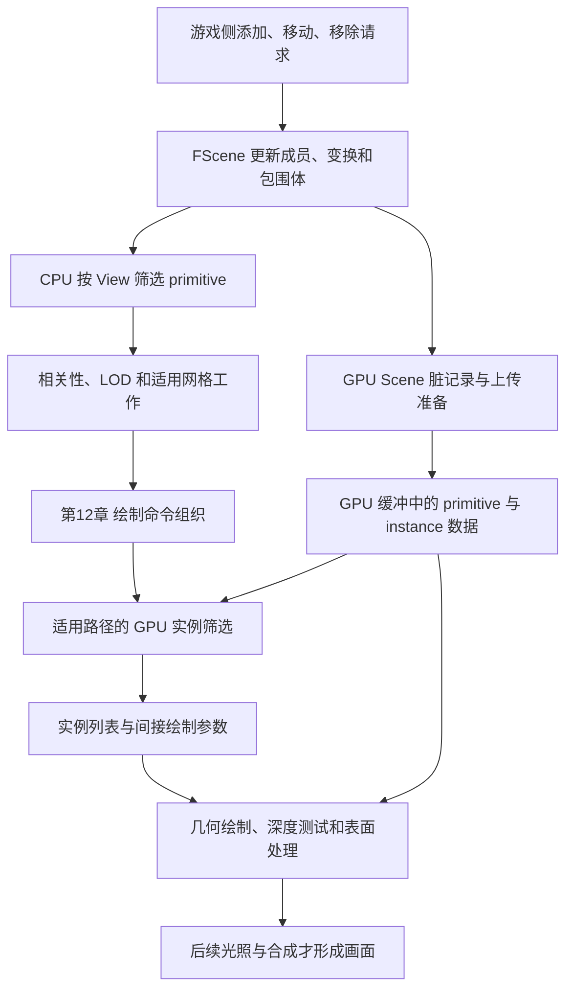
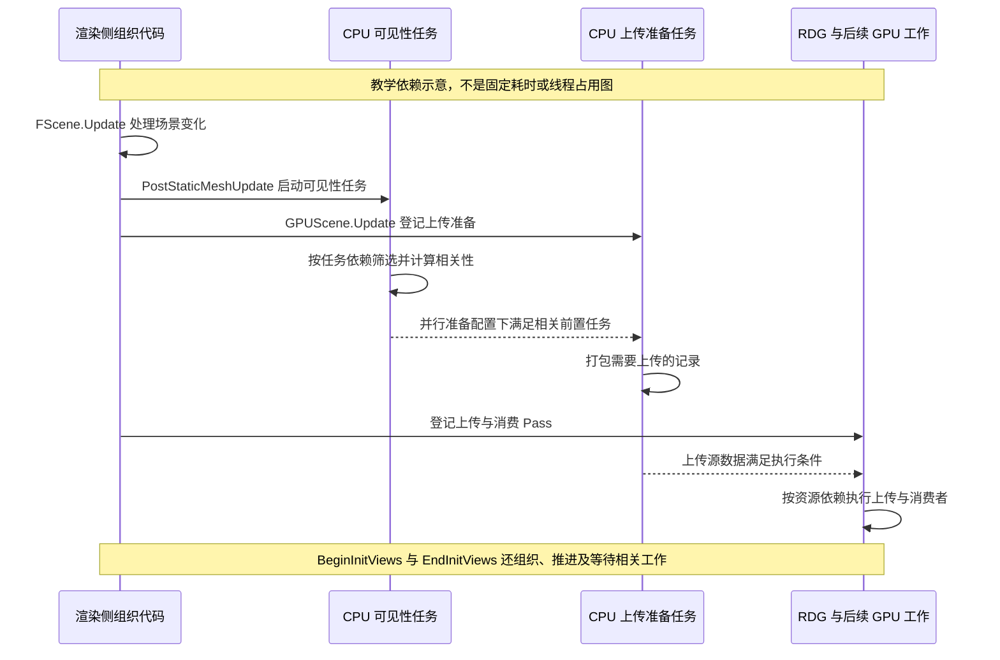

# 第 11 章：场景更新、GPU Scene 与可见性

[返回目录](../README.md) · [回顾场景表示](06-scene-representation.md) · [本章答案](../appendices/answers/11-scene-visibility.md)

> **适用基线：**UE 5.7.4，Changelist 51494982，Windows／D3D12／SM6，桌面传统延迟渲染，配置 A。使用既定的红方块、金属球、地面、透明薄片、方向光、点光和相机，设置见[配置附录](../appendices/configuration.md)。
>
> **证据范围：**本章静态核对本机源码，没有启动配套项目、设置运行断点或抓取 GPU 帧。源码结论标为 **[源码已确认]**，数学模型与虚构数据标为 **[教学简化]**，观察步骤及其预期标为 **[尚未验证]**。任务图表示必要关系，不是实测时序。

## 11.1 学习目标与前置知识

第 06 章把红方块从游戏组件追到了渲染场景，第 07～10 章说明了视图、线程、RDG 和命令提交。现在从一帧开始时重新发问：场景里有一万个物体，我们真的需要把每个物体的全部三角形都交给 GPU 吗？方块移动以后，Shader 又在哪里找到更新后的变换？

完成本章后，你应能够区分场景成员、GPU Scene 记录、视图候选集合与最终像素；沿一次变换更新找到脏记录和上传路径；用包围体计算视锥、距离判定；解释遮挡历史为什么需要失效处理；说明视图相关性、LOD 与实例筛选怎样继续缩小工作范围。

前置知识是包围盒、矩阵变换、深度、SRV／UAV，以及“CPU 登记工作不等于 GPU 已执行”。不会位运算也可以阅读：**位图（Bit Map）**在本章只是一个用单个二进制位记录 true／false 的紧凑数组。例如第 7 位为 true，表示当前编号为 7 的对象仍在某一候选集合中。

本章不深入 Mesh Draw Command 的缓存、合并和状态排序，也不展开 HZB 的具体生成算法。它们分别是第 12、13 章的主题。先明确输入集合和数据来源，再研究如何组织绘制、怎样获得遮挡证据。

## 11.2 四个看似相近、实际不同的问题

考虑红方块离开画面右侧。它仍属于世界，也可能继续运动和投下阴影。主相机暂时没有必要直接画它，并不表示可以销毁它的 Scene Proxy，或者删掉 GPU 上所有相关记录。

| 问题 | 对应结果 | 结果的有效范围 |
|---|---|---|
| 它是否已加入渲染场景？ | `FScene` 的 primitive 成员与内部记录 | 场景成员关系 |
| Shader 从哪里读它的变换、标志和实例？ | GPU Scene 的缓冲与索引 | 当前有效的资源及索引范围 |
| 这个 View 是否仍可能需要它？ | View 的可见性、相关性和 LOD 数据 | 指定 View 与相应处理阶段 |
| 它最终影响了哪些像素？ | 绘制、深度、材质、光照与合成结果 | 具体 Pass 和像素 |

前三项都不是最终颜色图。即使一个 primitive 保留在候选集合中，它的三角形仍可能全部被后续裁剪或深度测试拒绝。反过来，一个物体不直接出现在主相机图像中，也可能通过阴影、反射或其他视图影响画面。

这里的**可见性（Visibility）**首先是“这项工作是否仍有必要考虑”的筛选结果。要读懂一次 true，必须补上限定：在哪个 View、哪个粒度、经过哪些检查、还要交给什么消费者。

[打开场景数据与可见性静态图](../assets/diagrams/11-scene-visibility-1.png)



**[教学简化]**图中箭头表示数据流；上传准备、CPU 可见性与其他任务允许在依赖满足时交错进行。它没有声称每个普通方块都经过一次完整 GPU 遮挡测试，更没有把 Nanite 的簇级筛选画成这条普通网格路线。

## 11.3 阶段一：让渲染场景兑现已经收到的修改

### 11.3.1 八维定位

| 维度 | 本阶段的回答 |
|---|---|
| 作用 | 把待处理的添加、更新和移除应用到渲染场景 |
| 原因 | 后续筛选、缓存和 GPU 数据必须建立在有效场景状态上 |
| 输入 | primitive 更新队列、已有 SceneInfo／Proxy、变换和实例修改等 |
| 过程 | 整理变化集合，更新成员及相关数组，维护包围体、缓存和 GPU 脏状态 |
| 输出 | 可供后续任务读取的 CPU 场景状态，以及需要继续更新的数据集合 |
| 实现 | `FSceneRenderer::OnRenderBegin`、`FScene::Update` 及任务和回调 |
| 条件 | 有场景更新输入时走对应更新路径；不同修改触发不同分支 |
| 成本与误区 | 成本来自变化量、缓存维护和任务依赖；不是每帧重建所有 UObject |

第 06 章已经说明，组件上的调用先把变化送到渲染侧。这里的“收到”与“应用到内部场景结构”仍是两个时刻。多个修改可能先集中到更新集合，再由 `FScene::Update` 统一处理。

**[源码已确认]**本版 `FScene::Update` 整理 `PrimitiveUpdates`，在变换处理部分将新变换交给 `PrimitiveSceneProxy->SetTransform`，并更新按场景索引组织的变换数组，见 [S11-01](#s11-01)。它还处理实例分配、静态网格缓存以及不同场景系统的更新。读源码时不能只看一个 `LocalToWorld` 赋值，就认为一次移动的全部成本只有复制矩阵。

### 11.3.2 相机移动和物体移动影响不同数据

相机移动改变 View 的观察条件。即使所有物体都没有发生新的游戏侧变换，视锥结果、距离、屏幕大小和遮挡历史的可信度也可能改变。因此静止场景仍需要为新的观察进行可见性工作。

物体移动则改变该 primitive 的变换和范围，可能连带影响速度、阴影缓存、距离场或其他适用系统。主相机不动，也不能继续无条件使用物体移动前的包围体。

本章移动实验继续将红方块组件设为 **Movable**。第 06 章核对过，非 Movable 静态网格的变换更新可能要求重建 Proxy；“修改位置”不是对所有 Mobility 都完全相同的增量路径。渲染数据更新类型也不由资产名字里的 Static 一词决定。

需要保留上一变换时，“当前矩阵已经更新”还不够。当前与上一变换配对不正确，几何位置可能看似正确，运动信息却已经出错。GPU Scene 结构同时提供相关历史字段，但历史字段正确与否仍取决于上游如何维护它们，第 19 章继续追踪。

### 11.3.3 本版任务组织不是一条串行清单

**[源码已确认]** `FSceneRenderer::OnRenderBegin` 设置 `PostStaticMeshUpdate` 回调。回调准备视图状态并启动 `LaunchVisibilityTasks`；并行准备条件下，还把相关性计算任务加入 GPU Scene 更新的前置依赖。随后 `FScene::Update` 的相应位置调用 `GPUScene.Update`，见 [S11-02](#s11-02)。

因此不能把本版写成“CPU 先等 GPU Scene 所有上传在 GPU 上完成，然后才进入 InitViews 计算可见性”。这些函数既涉及 CPU 场景准备，也涉及任务发布和 RDG 登记；函数名中的先后不等于 GPU 执行完成的先后。

[打开更新任务依赖静态图](../assets/diagrams/11-scene-visibility-2.png)



`BeginInitViews` 会提前开始动态网格收集，并处理需要渲染线程参与的任务；`EndInitViews` 调用可见性任务的 `Finish`。**[源码已确认]**这两个入口见 [S11-03](#s11-03)。旧注释中出现 `ComputeViewVisibility` 不等于本版仍以这个名字作为唯一同步入口，应继续查真实调用和任务对象。

## 11.4 GPU Scene：为 Shader 准备可索引的场景数据

### 11.4.1 GPU Scene 不是一张三维颜色图

**GPU Scene**是 Renderer 中管理一组 GPU 可访问场景数据的系统。名字中的 Scene 容易让人误以为它保存了“已经画好的整个世界”，实际上本章主要关心的是结构化记录：变换、范围、标志、primitive 与 instance 的关联，以及其他供渲染使用的数据。

**[源码已确认]** `FGPUSceneResourceParameters` 声明 primitive、instance、instance payload、lightmap 和 light 数据的缓冲入口，见 [S11-04](#s11-04)。它们通过 SRV 等方式提供给 Shader。顶点缓冲、索引缓冲和材质纹理仍有自己的资源与访问路径；不能把全部几何和全部纹理都说成已经塞进这几个记录缓冲。

**Primitive 记录**描述一个渲染 primitive 的相关属性。**Instance 记录**描述其某一次实例摆放和对应属性。普通单体网格也可能有一条实例数据；一份 Instanced Static Mesh 组件则可能关联很多实例。因此 primitive 数量、实例数量和三角形数量是三个计数。

| 数据层次 | 举例 | 主要联系 |
|---|---|---|
| Primitive 数据 | 当前与上一变换、对象范围、标志、自定义数据、实例起点与数量 | 可以找到本 primitive 的实例范围 |
| Instance 数据 | 实例变换、所属 PrimitiveId、局部范围、更新帧号、有效标志 | 可以回到共享 primitive 数据 |
| Instance Payload | 按标志和布局保存的扩展数据，例如适用的实例自定义信息 | 通过偏移和步长定位 |
| 几何资源 | 网格顶点、索引及相关属性 | 由对应绘制和 Vertex Factory 路径访问 |

**[源码已确认]** Shader 侧的 `FPrimitiveSceneData` 和 `FInstanceSceneData` 定义了上述联系，见 [S11-05](#s11-05)。表格是字段用途归纳，不是承诺每个变体都加载所有字段，也不是一份可以直接拿来序列化的 UObject 布局。

### 11.4.2 编号怎样把 CPU 与 GPU 数据接起来

回忆第 06 章的三种编号：ComponentId 标识组件，PackedIndex 定位当前 CPU 场景紧凑数组，PersistentIndex 在本 primitive 的场景驻留期内稳定。它们不能互换，更不能把屏幕上的 P、Q 当作其中任意一种 ID。

**[源码已确认]** GPU Scene 的场景数据适配器用 PersistentIndex 收集上传项目，再通过 `Scene.GetPrimitiveIndex` 找当前 CPU 数组项。它把持久索引用作相应 GPU primitive 记录的 ID；Shader 的 `GetPrimitiveData` 用这个 ID 定位数据，见 [S11-06](#s11-06)。因此 CPU 数组因场景成员变化重新排列，并不要求 Shader 使用同一套紧凑数组下标来识别 primitive。

这并不让 PersistentIndex 成为永久资产身份。primitive 移除后，槽位能够被复用；同一组件重建 Proxy 也有生命周期边界。动态收集的数据还存在对应的分配范围，不能把来自不同上下文或不同有效期的整数混用。

**[教学简化]**若一个 primitive 的实例起点为 200、数量为 3，则它关联的简单连续范围是 200、201、202。另一个实例记录里保存 `PrimitiveId=17`，表示回读编号为 17 的 primitive 数据，不表示使用第 17 个 Actor，也不表示屏幕横坐标为 17。

越界 ID 不只是“画错对象名称”。它可能使 Shader 读取错误变换、错误范围或错误 payload，并进一步影响绘制位置、筛选和材质数据。读取 GPU 数据之前，索引的来源和有效期就是算法输入的一部分。

### 11.4.3 打包布局是 C++ 与 Shader 之间的协议

**[源码已确认]**本版 `PRIMITIVE_SCENE_DATA_STRIDE` 为 44，`FPrimitiveSceneShaderData` 用它定义以 float4 为单位的记录步长。C++ 的 `Setup` 将矩阵和字段写到约定位置，Shader 的 `GetPrimitiveData` 按同一布局还原；双方源码都提醒布局必须匹配，见 [S11-07](#s11-07)。

部分整数以位表示打包进同一存储，不表示它们在语义上变成小数。矩阵也经过约定的存储与转置处理；不能把四个连续 float4 一概看成一张原样复制的 `FMatrix`。大世界坐标的高位与相对坐标处理同样属于约定，第 02 章的精度问题在这里落实为具体字段。

**[教学简化]**只按这版 primitive 记录的基础有效载荷估算，每个 float4 为 16 字节：

```text
每条 primitive 记录 = 44*16 = 704 字节
10,000 条记录 = 7,040,000 字节 = 6.7138671875 MiB
100 条记录 = 70,400 字节 = 0.067138671875 MiB
```

这些数字不包括实例、payload、光源、上传索引、缓冲容量空洞、对齐和临时资源。不能据此宣称“一万个物体只占 6.71 MiB 显存”，也不能用 704 乘实例数替代实例布局计算。共享记录减少重复数据的机会与全部场景显存是两个问题。

## 11.5 阶段二：脏记录怎样变成 GPU 缓冲中的新内容

### 11.5.1 八维定位

| 维度 | 本阶段的回答 |
|---|---|
| 作用 | 使 GPU Scene 中需要变化的记录反映新场景状态 |
| 原因 | Shader 不能直接读取游戏线程上不断变化的 UObject |
| 输入 | 待更新 primitive 索引、脏标志、CPU 代理及实例数据、已有 GPU 缓冲 |
| 过程 | 收集与去重，处理分配，打包上传数据，登记散布写入及适用的 GPU 更新 |
| 输出 | 后续 Pass 可以按依赖读取的 primitive／instance 等缓冲内容 |
| 实现 | `AddPrimitiveToUpdate`、`UpdateInternal`、`UploadGeneral`、散布上传工具与 Shader |
| 条件 | `UseGPUScene` 支持当前平台与特性级别；变化类型、动态收集和调试设置影响上传 |
| 成本与误区 | CPU 打包、上传源管理、GPU 写入和带宽；脏更新不等于只复制一个修改过的 float |

### 11.5.2 Dirty 表示需要维护，不表示资源已经损坏

**脏状态（Dirty State）**记录数据需要更新。`RequestGPUSceneUpdate` 在 primitive 仍属于有效场景时，将请求送到 `AddPrimitiveToUpdate`。后者只在原先没有脏状态时把同一 primitive 加入待更新列表，再合并新的标志，见 [S11-08](#s11-08)。

**[教学简化]**方块同一处理周期先改变位置，再改变一项需要重传的场景属性。系统可以保留一次“更新这个 primitive”的列表项，同时累计需要处理的变化类型。不能因此假定两次游戏逻辑调用一定对应两个 GPU Dispatch，也不能反过来认为前一次修改必然被忽略。

删除也参与状态管理。源码在移除时处理 Added 标志，在 `UpdateInternal` 中过滤失效 ID 和已移除且未重新加入的项目，并清理需要失效的实例范围。复用槽位时必须把“上一位使用者的记录”与“当前有效记录”区别开。

增量更新不保证任何情况下只传变化项目。**[源码已确认]** `r.GPUScene.UploadEveryFrame` 的注册初值为 0；打开调试开关或设置 `bUpdateAllPrimitives` 会重建全量待更新集合，实例布局变化也会触发全量更新，见 [S11-09](#s11-09)。CVar 注册初值仍不是读者项目当前有效值。

### 11.5.3 从 UploadGeneral 继续追到真正的写入

**散布上传（Scatter Upload）**把一组连续准备的上传内容，按目的索引写入目标缓冲的不同位置。这里的 Scatter 描述目的位置不必连续，不是让记录随机落到显存里。

**[教学简化]**假设只有 primitive 3、17、90 变化，CPU 准备三份新记录及目的 ID。上传算法按 ID 将它们写入对应记录区间，其他未变记录可以继续留在原缓冲中。前提是缓冲分配、容量和资源访问都允许这样处理。

**[源码已确认]** `UploadGeneral` 先统计需要上传的 primitive 与实例数据，取得上传器，再添加有前置任务的 `AddCommandListSetupTask`。任务读取代理、生成 `FPrimitiveSceneShaderData` 和实例记录，并填充上传存储。是否用 `ParallelFor` 取决于线程条件、阈值与数量，见 [S11-10](#s11-10)。

随后调用上传缓冲的 `End`。这个名字不表示 GPU 已完成：`FRDGAsyncScatterUploadBuffer::End` 登记名为 `ScatterUpload` 的计算 Pass，选择 `FRDGScatterCopyCS`；它注册到 `ByteBuffer.usf::ScatterCopyCS`，Shader 根据上传索引把源值写到目标位置，见 [S11-11](#s11-11)。这条路线把 CPU 数据、RDG 访问和 GPU 实际写入连了起来。

GPU Scene 更新函数返回后，CPU 可以继续构图。消费者仍须通过图内资源依赖和相应访问规则读到正确数据。不要为了“保证更新完成”在每个 primitive 后人为加入一次全 GPU 等待；也不要跳过正常声明后假定所有消费者自然同步。

### 11.5.4 更新粒度决定估算边界

只看本章 primitive 基础有效载荷，上一节的 100 条比全量 10,000 条少传 `7,040,000-70,400=6,969,600` 字节，减少 99%。这是固定假设下的有效载荷差值，不是实际帧时间减少 99%。

一个带一万实例的 primitive 被更新，不能仅按“一条 primitive”判断成本。实例变换、扩展数据和分配可能远大于共享记录。相反，只读取场景的相机移动，不自动要求把所有静态物体的新位置从 CPU 上传一遍。

还存在动态 primitive 收集与 GPU 计算更新实例的接口。**[源码已确认]** `UploadDynamicPrimitiveShaderDataForView` 和 `UpdateInternal` 中的 GPU writer 路径分别处理相关输入，见 [S11-12](#s11-12)。因此“GPU Scene 的所有数据只能由 CPU 每帧 memcpy 产生”也不成立。

## 11.6 保守筛选：为什么包围体比真实几何更大

视锥筛选先使用第 06 章的包围体，省去读取全部顶点再逐三角形判断的成本。**轴对齐包围盒（Axis-Aligned Bounding Box，AABB）**由中心 C 与三个半尺寸 E 表示；包围球由中心 C 和半径 r 表示。

**保守（Conservative）**在这里指：当现有证据还不能可靠排除贡献时，继续保留候选。包围盒与视锥有重叠，并不证明真实网格有表面覆盖屏幕；包围盒完全在视锥外，才可能用来排除其完整包含的几何。

保守性依赖包围体真的包含所需范围。如果材质的 World Position Offset 把顶点推出记录的范围，筛选可能把仍有可见部分的几何提前删除。动画、实例和程序化网格也必须维护适合其变化的范围。

扩大 Bounds 可以帮助验证“范围太小”的怀疑，却不是无成本的修复。范围越松，越难被视锥与遮挡筛掉，也可能影响阴影等其他使用者。对于横跨街区的巨大组件，整体包围体可能与视锥相交很久，而实际只需要其中一小部分几何。

保守几何测试与基于历史的遮挡预测还要分开。前者可在边界正确的数学前提下保证不误删；后者使用过去证据，必须依靠有效性规则、范围扩张与重测降低错误风险，不能被描述为对任意运动都无条件正确的证明。

## 11.7 阶段三：CPU 为每个 View 形成 primitive 候选集合

### 11.7.1 八维定位

| 维度 | 本阶段的回答 |
|---|---|
| 作用 | 及早排除当前 View 不需直接考虑的 primitive，并准备后续相关性信息 |
| 原因 | 提前省掉网格收集、命令组织及部分 GPU 工作 |
| 输入 | 场景包围体、View 的视锥和裁剪设置、隐藏集合、距离、适用的遮挡资料 |
| 过程 | 根据配置进行隐藏、视锥、距离、预计算可见性和遮挡处理，再计算相关性 |
| 输出 | `PrimitiveVisibilityMap`、相关性记录、LOD 与网格筛选等每视图数据 |
| 实现 | `LaunchVisibilityTasks`、视图任务包、`FrustumCull`、遮挡任务及 relevance 任务 |
| 条件 | ShowFlags、ViewState、场景资料、平台与任务调度选项会改变路径 |
| 成本与误区 | CPU 数组扫描、范围测试、任务及历史读取；true 仍不是最终像素可见 |

**[源码已确认]** `FVisibilityViewPacket::BeginInitVisibility` 为该 View 初始化 primitive 位图、网格可见性数据和相关性记录。任务包按 primitive 范围衔接视锥、预计算／动态遮挡和相关性处理，见 [S11-13](#s11-13)。批次可以交错推进，不能要求整张表都结束后下一阶段才能启动任意一项。

### 11.7.2 隐藏集合回答的是策略，不是几何

View 可以指定 HiddenPrimitives，也可以使用 ShowOnlyPrimitives。前者排除指定组件，后者仅允许列出的组件进入相应处理。**[源码已确认]** `IsPrimitiveHidden` 通过场景中的 ComponentId 查询这些集合，见 [S11-14](#s11-14)。

因此一个方块即使处在视锥中央、没有被挡住，也可能因为视图策略不参与显示。这不是包围体算法计算错了。Scene Capture、编辑器与主游戏 View 的显示条件也可能不同，不能只检查世界中一个通用 Visible 复选框。

### 11.7.3 用一个平面亲手算一次视锥排除

**视锥裁剪（Frustum Culling）**使用观察体积的边界排除范围外对象。透视相机可以先按左右、上下和近远边界理解，但实际无限远投影、附加裁剪面与视图条件会影响有效平面集合，不要求永远恰好六个有限平面。

**[教学简化]**为推导方便，本节规定平面内侧满足 `n·X+d >= 0`，n 指向内部且长度为 1。这个符号约定用于本节，不应直接套到引擎任意 `FPlane::PlaneDot` 比较上。

对于 AABB，令：

```text
s = n·C + d
r = abs(nx)*Ex + abs(ny)*Ey + abs(nz)*Ez

s+r < 0       整个盒子在这个平面外，可排除
s-r >= 0      整个盒子在这个平面内
其他情况       盒子跨过或接触边界，继续保留
```

s 是中心到平面的有符号距离；r 是盒子沿法线方向的投影半径。判断任意一个有效边界就能证明整体在外时，可以停止剩余测试。全部平面都没有排除，只表示通过这套保守测试；并不等于精确求出了几何与视锥交集。

设右边界为 `x<=300 cm`，故 `n=(-1,0,0)`、`d=300 cm`。盒子半尺寸 `E=(20,30,40) cm`，中心先为 `C=(330,0,100) cm`：

```text
s = -330+300 = -30 cm
r = 20 cm
s+r = -10 cm < 0，整个盒子位于右边界之外
```

把中心移到 `C=(310,0,100)`，得到 `s=-10`、`s+r=10`，无法排除。此时中心仍在边界外，但盒子左侧已经进入，因此“中心不在画面里就裁掉物体”是错误规则。

**[源码已确认]** `IsPrimitiveVisible` 可先做自定义检查或球测试，再走 `IntersectBox8Plane` 或 `ViewCullingFrustum.IntersectBox`；这些选择受标志控制，见 [S11-14](#s11-14)。源码注册的 UseOctree 与 SphereTestFirst 初值均为 false，不能想当然地说本版所有 primitive 默认先查八叉树、再查球。

### 11.7.4 距离裁剪不一定量到中心

**距离裁剪（Distance Culling）**按绘制距离策略停止考虑太远或太近的对象。它不同于视锥测试：一个小物体完全位于画面中央，也可能因设置的最大绘制距离而被排除。

**[源码已确认]**本版 `r.DistanceCullToSphereEdge` 注册初值为 true。`ComputeDistances` 计算相机到包围球最近和最远距离的平方，`FrustumCull` 在相应路径以最近距离判断过远、最远距离判断过近，见 [S11-15](#s11-15)。

**[教学简化]**设中心距相机 `D=1000 cm`、半径 `r=100 cm`，最大绘制距离 `Dmax=950 cm`；关闭渐隐影响，比例为 1，忽略其他限制：

```text
最近距离 = max(D-r,0) = 900 cm
最远距离 = D+r = 1100 cm
中心距离规则：1000 > 950，会因过远排除
球边缘规则：900 > 950 为 false，仍保留
```

若中心移到 1100 cm，最近距离变为 1000 cm，就满足过远条件。若相机位于包围球内部，最近距离为 0，不能把负的 `D-r` 直接平方再假装它是实际最近距离。

真实路径还涉及最大距离比例、无限距离约定、最小距离、HLOD 和渐隐处理。渐隐是避免突然消失的一种过渡，会令阈值附近行为比上面的单次布尔测试复杂。应先固定这些条件，再比较观察结果。

## 11.8 遮挡：视锥内仍可能没有贡献

### 11.8.1 预计算数据与动态证据不同

**遮挡裁剪（Occlusion Culling）**试图排除被前方遮挡物完整挡住的候选。视锥回答“可能落入观察范围吗”，遮挡继续回答“落在观察范围里，却是否仍被已有前景挡住”。二者不是同一检查。

**预计算可见性（Precomputed Visibility）**使用事先构建的资料。**[源码已确认]** `PrecomputedOcclusionCull` 只有在 View 获得相关数据且 primitive 具备适用标志时，才读取预计算位并清除可见性位，见 [S11-16](#s11-16)。我们的简单教学场景没有声称已构建此类资料，不能把这步写成所有关卡必经的有效裁剪。

动态路径则使用运行过程中产生的遮挡证据，例如硬件查询、HZB 相关结果或反馈。**层次深度缓冲（Hierarchical Z-Buffer，HZB）**以层次化的深度摘要帮助快速测试屏幕范围，第 13 章会解释生成和判定。它不是完整 RGB 历史，也不是一个“遮住了谁”的 Actor 列表。

**[源码已确认]**本版 `r.HZBOcclusion` 的 C++ 注册初值为 0，虽然同一 CVar 的帮助文字把值 1 描述为“default”。不能只读帮助字符串推断当前路径。即使普通 HZB 遮挡没有由这个开关选择，SSR、SSAO、Lumen、Nanite 或其他视图管线条件仍可能要求生成 Furthest HZB；“建了 HZB”也不等于“所有 primitive 都使用 HZB 遮挡”，见 [S11-26](#s11-26)。

### 11.8.2 CPU 在本帧消费的未必是本帧刚生成的证据

如果要求 CPU 给每个对象提交查询后立即等待 GPU 回答，再决定下一个对象，会产生大量等待。渲染器因此需要缓存、批处理和跨帧证据，但历史不是现在画面的全知答案。

**[源码已确认]** `FGPUOcclusionPacket::OcclusionCullPrimitive` 查询 primitive 遮挡历史，按分支消费反馈、有效 HZB 测试结果或 `GetQueryForReading` 返回的过去查询。硬件查询分支中，查询成功且样本数为 0 时判定遮挡；读取失败有保留路径，没有适用查询时还存在沿用状态或近期可见性策略，见 [S11-17](#s11-17)。

因此这段实现不能简化为“没有本帧结果一律可见”，也不能简化为“永远只读前一帧”。源码还传入缓冲帧数与回读容忍条件，实际读取哪一份历史与运行配置有关。

不要进一步推出“使用历史就绝不等待”。该硬件查询分支调用 `RHIGetRenderQueryResult` 时带有等待请求；历史与缓冲策略旨在避免不必要停顿，但不是所有状态下均零等待的保证。第 10 章区分了提交与完成，在这里仍然适用。

### 11.8.3 不可信历史需要重新考虑

相机突然切到墙的另一侧，上一观察位置“被墙完全挡住”的结论可能立即失效。物体移动、离开观察很久、查询范围变化，也会影响过去证据的意义。

**[源码已确认]**视图准备代码在首次观察、时间重置、相机切换、强制可见性重置或足够大的相机移动等条件下设置 `bIgnoreExistingQueries`。遮挡处理中还有范围扩张、近裁剪面附近的保留与新查询登记，见 [S11-18](#s11-18)。这些规则说明历史需要管理，而不是把上一帧的位图机械复制到本帧。

并非所有 primitive 都允许走同样的遮挡路径。普通静态网格代理的 `CanBeOccluded` 检查材质禁用深度测试、特定透明阶段、Custom Depth 和虚拟纹理专用等条件，见 [S11-19](#s11-19)。把 `r.AllowOcclusionQueries` 打开，不能保证全部物体都建立普通查询。

本章只确定数据从哪里来、结果交给谁。深度预通道、查询绘制、HZB 建立及其在一帧中的位置，需要在第 13 章按实际路径相接。`HZBOcclusion.usf` 使用带有 Nanite 名称的通用裁剪辅助代码，见 [S11-26](#s11-26)，也不能据此推断普通网格已经启用 Nanite。不能在 CPU 可见性任务名称旁边凭空插入一个“GPU 已经画完整帧深度”的同步点。

## 11.9 保留下来以后：相关性与 LOD 还要决定怎么处理

### 11.9.1 Relevance 回答适用哪些工作

**视图相关性（View Relevance）**是 primitive 对当前 View 各类工作的适用信息。一个对象具有 Draw Relevance，并不代表它应进入每一种深度、材质、透明和阴影工作。

**[源码已确认]**相关性计算调用 `PrimitiveSceneProxy->GetViewRelevance(&View)`，得到静态、动态、绘制、阴影、透明等信息，然后进一步处理网格和 Pass 条件。`FStaticMeshSceneProxy::GetViewRelevance` 综合显示条件、主 Pass／深度设置、阴影条件和材质相关性，见 [S11-19](#s11-19)、[S11-20](#s11-20)。

不要把 `bStaticRelevance` 理解成物体本帧绝对没有运动。这里的静态／动态涉及网格描述和收集路径，和组件 Mobility 有联系但不是同一个布尔值。编辑器的 Bounds、碰撞或其他调试显示也可能改变普通静态网格的相关性分支。第 12 章会追静态缓存与动态收集的实际后果。

红色不透明方块与蓝色透明薄片可能都通过视锥，却因材质相关性进入不同工作。相关性是组织这些工作的条件，不能把二者都写进 GBuffer 后才临时根据颜色决定谁透明。

### 11.9.2 LOD 改变细节量，通常不改变物体是否存在

**细节级别（Level of Detail，LOD）**为不同观察尺度提供不同的几何细节。物体变小后，较少三角形可能已足以表达轮廓，继续处理最高细节会浪费工作。

距离不是唯一因素。相同距离下，大物体占据更多屏幕范围；缩小 FOV 会放大投影；强制 LOD、可用 LOD、缩放策略与渐变过渡也会影响选择。因此“离相机每增加 100 米就固定降低一级”不是本版通用算法。

**[源码已确认]**普通静态网格相关性路径调用 `ComputeLODForMeshes`，并保存 `FLODMask`。该类型可以表达过渡或范围，不应假定永远只保存一个数字。`ComputeBoundsScreenSize` 采用投影矩阵比例、包围球半径和距离形成屏幕尺寸度量，见 [S11-20](#s11-20)、[S11-21](#s11-21)。

**[教学简化]**取透视投影 `M00≈1.73205`、`M11≈3.07920`，与本书水平 FOV 60°、16:9 的理想投影比例一致。对中心距相机 600 cm、半径 50 cm 的演示包围球，忽略其他缩放：

```text
ScreenMultiple = max(0.5*M00,0.5*M11) ≈ 1.53960
ScreenSize = 2*ScreenMultiple*50/600 ≈ 0.25660
中心距离加倍到 1200 cm：ScreenSize ≈ 0.12830
```

这里的 ScreenSize 是选择细节用的度量，不是物体精确像素面积，不是已经栅格化的直径，也不是“25.66% 的所有屏幕像素被覆盖”。真实选择还会比较网格提供的阈值；本例没有提供这些阈值，因此不能凭两个数字断言具体选中 LOD0 或 LOD1。

**HLOD（Hierarchical Level of Detail，层次细节级别）**可用组合代理表达更大范围内容。它与单个网格的 LOD、实例筛选及 Nanite 簇选择都有关联，但不能把这几个层次统一叫“换低模”。

## 11.10 阶段四：适用路径在 GPU 上继续筛选实例

### 11.10.1 八维定位

| 维度 | 本阶段的回答 |
|---|---|
| 作用 | 在适用绘制范围内筛选实例，并产生后续绘制所需列表和数量 |
| 原因 | 一个通过 CPU 整体范围测试的 primitive，仍可能包含很多无须绘制的实例 |
| 输入 | 绘制描述、实例范围、GPU Scene 数据、视图数据及可选遮挡资源 |
| 过程 | 根据模式检查实例，组织保留 ID，更新间接参数；需要时保序压缩 |
| 输出 | 实例 ID 等数据与间接绘制参数缓冲 |
| 实现 | `FInstanceCullingContext`、`BuildRenderingCommands` 与实例筛选计算 Shader |
| 条件 | GPU Scene、上下文、处理模式、CVar 和有效历史资源共同决定 |
| 成本与误区 | GPU 数据读取、范围计算、原子操作与压缩；并非每个实例必做 HZB 遮挡 |

### 11.10.2 CPU 粒度与 GPU 粒度为什么可以互补

假设将同一网格的 1000 次摆放放入一个实例组件。组件整体包围盒覆盖很大范围，即使只有其中 20 个实例接近屏幕，这个整体盒子仍可能通过 CPU 视锥检查。GPU 上按实例处理可以继续缩小实际绘制集合。

这不意味着 CPU 阶段毫无意义。如果整个组件已经明显位于 View 后方，CPU 提前排除可以省掉后续准备；若大部分组件都在视锥内，细粒度实例处理更有机会减少 GPU 几何工作。选择组件划分与实例组织时，应同时考虑更新量、筛选粒度和绘制组织成本。

**[源码已确认]** `FInstanceCullingManager` 的启用状态与 GPU Scene 相接；`FInstanceCullingContext::BuildRenderingCommandsInternal` 可选择延迟批处理或当前处理路径，创建实例数据及间接参数，并向 RDG 添加相关计算 Pass，见 [S11-22](#s11-22)。因此不要把某处 `BuildRenderingCommands` C++ 调用返回当成 GPU 已计算出可见数量。

### 11.10.3 从实例记录到输出列表

在适用计算变体中，`BuildInstanceDrawCommands.usf` 从 InstanceId 读取 `FInstanceSceneData`，再通过其中的 PrimitiveId 读取共享数据。`IsInstanceVisible` 结合有效标志、范围、视图、距离和屏幕尺寸条件处理实例，并在适用条件下执行视锥和遮挡测试，见 [S11-23](#s11-23)。

**[教学简化]**候选实例为 `[0,1,2,3,4,5,6,7]`，假设当前路径最终保留 `{1,3,6}`。其核心输出语义是“接下来只需要这些实例，数量为 3”。真实输出可能同时打包 View 等标志；采用原子方式写列表时，也不能仅凭这个集合保证顺序一定是 `[1,3,6]`。

源码在相应非保序分支用原子加法增加间接参数中的实例数量，并将实例写入输出；需要保序的路径还会使用后续压缩。**间接绘制（Indirect Draw）**允许 GPU 从参数缓冲读取绘制数量等参数，CPU 无须先把最终数量读回再逐项发出直接绘制请求。

数量从 8 变成 3，不等于 GPU Scene 永久删掉了另外 5 个实例。它们可能对另一个 View 可见，下帧也可能重新出现。筛选输出描述这次工作，场景存储保存仍有生命周期的数据。

### 11.10.4 Compute、实例筛选、实例遮挡不是同一个开关

**[源码已确认]**本版 `r.CullInstances` 注册初值为 1，而 `r.InstanceCulling.OcclusionCull` 初值为 0。后者启用还不足以使用 HZB：对应路径检查 `PrevHZB.IsValid()`，不同处理模式和 Shader 变体继续决定哪些测试执行，见 [S11-24](#s11-24)。

单实例可以落入 `UnCulled` 桶，C++ 选择变体时据此关闭相应实例裁剪逻辑。因此在本书只有少量普通网格的场景中，不应承诺红方块一定单独经历一次完整 GPU 实例遮挡测试。

同样，`r.InstanceCulling.OcclusionCull=0` 不表示 CPU primitive 遮挡被关闭，更不表示 Nanite 的遮挡全部关闭。Shader 使用部分带 Nanite 名字的视图和共用裁剪辅助结构，也不能证明被处理的网格已经启用 Nanite。第 22 章才进入其层次与簇级路线。

## 11.11 回到贯穿场景中的 P 与 Q

先保持相机、红方块和薄片静止。P 对应方块无遮片覆盖的位置，Q 对应方块与薄片投影重叠的位置。此时 CPU 不会从 P 和 Q 两个像素“反向挑选应该注册哪两个物体”；它首先依据场景和 View 数据准备候选及相关性，后续几何绘制才产生各像素贡献。

红方块可以同时通过视锥、距离与遮挡判断，并选中一个可用 LOD。它在 CPU 上被标为候选后，仍要经历第 12 章的绘制组织与第 13、14 章的深度和表面处理。P 最终记录方块，不代表该方块每个三角形都写入了深度。

蓝片与方块在 Q 重叠，也不能把蓝片自动当成能完全遮挡方块的普通不透明遮挡物。本书透明配置保留背景颜色贡献，而且没有承诺它写主不透明深度。是否参与某一遮挡资源必须看对应 Pass 和材质条件；只根据“蓝片离相机更近”就删除整个方块，会破坏 Q 的背景，甚至错误影响 P。

**[教学简化]**如果另放一面足够大的不透明墙，把方块的全部相关投影范围挡住，动态遮挡才有机会证明主视图不必直接画方块。移动墙后，需要新的几何和历史条件；不能继续把旧遮挡状态当成永远成立的结论。

再把方块移出主视锥。它可以继续留在 FScene 与 GPU Scene 中。方向光的阴影视图、反射或其他消费者可能仍需要它，主视图位图不代表全场景的最终生死表。阴影与光线追踪等路径拥有自己的条件，不能直接套用主相机的所有筛选结论。

## 11.12 怎样理解筛选成本，而不是只数“裁掉多少”

可见性本身也消耗时间。CPU 需要读包围体、访问位图、组织任务和检查历史；GPU 实例处理需要读场景数据、做计算、写列表及间接参数。便宜的小对象或极小场景可能节省不了足以覆盖这些成本的工作。

**[教学简化]**设某种筛选平均对每个候选花费 `0.08 微秒`，下游每个保留候选的平均处理为 `1 微秒`，共有 10,000 个候选，最终保留 30%。忽略并行、任务开销和不同对象复杂度：

```text
不筛选的下游工作 = 10,000*1 微秒 = 10 ms
筛选自身 = 10,000*0.08 微秒 = 0.8 ms
筛选后下游 = 3,000*1 微秒 = 3 ms
合计 = 3.8 ms，模型节省 6.2 ms
```

如果保留 98%，则合计 `0.8+9.8=10.6 ms`，比不筛选还贵。真实机器不能把 CPU 与 GPU 时间如此直接相加；这个单执行资源模型只用于说明“排除的工作必须足够贵，收益才成立”。它不是 UE 的微秒测量。

实际分析至少要分清：场景更新成本、CPU 可见性成本、绘制组织成本、GPU 实例筛选成本、最终几何和像素成本。减少三角形可能不改善受像素着色限制的帧；降低 Draw Call 也不保证减少上传量。相机移动、内容新增与材质变更应分别记录，避免把所有变化都归到 InitViews。

计数同样要对齐粒度。CPU 裁掉 100 个 primitive 与 GPU 裁掉 100 个 instance，既可能覆盖完全不同数量的三角形，也可能发生在不同 View。一个全场景统计数字不能自动解释 P 为什么消失。

## 11.13 可以自行执行的观察练习

以下全部为 **[尚未验证]** 的操作与预期。本章没有执行这些命令，没有生成性能结论。先记录实际版本、配置 A、分辨率、相机和 CVar 当前值；在适合调试的构建中逐项操作，实验后恢复原值。

| 查询项 | 本版源码注册初值 | 本实验关注的区别 |
|---|---|---|
| `r.GPUScene.UploadEveryFrame` | 0 | 按变化维护与调试全量更新 |
| `r.GPUScene.ParallelUpdate` | 2048 | 超过相关数量阈值时是否允许并行准备，不是 GPU 队列数 |
| `r.DistanceCullToSphereEdge` | true | 到球边缘与到中心的距离度量 |
| `r.Visibility.FrustumCull.Enabled` | true | CPU 视锥相关筛选控制 |
| `r.CullInstances` | 1 | 适用 GPU 实例筛选策略 |
| `r.InstanceCulling.OcclusionCull` | 0 | 适用实例路径的额外遮挡测试 |

初值来自 [S11-09](#s11-09)、[S11-15](#s11-15)、[S11-24](#s11-24)，不代表项目配置或平台覆盖后的当前值，也不建议把整张表作为一组新的性能设置。

1. 固定相机，移动 Movable 红方块。沿 Component 到 `FScene::Update`、GPU 脏记录和上传准备定位；记录哪些数据变化。断点打到上传准备，只证明 CPU 走过该代码。
2. 固定所有物体，只转动相机。观察每 View 的候选和相关性；预期视图结果可变，而非所有 primitive 都必然重新上传。检查结果前，确认没有额外动画或编辑器修改。
3. 查看对象包围体，缓慢将方块移到画面边缘。关注“中心已离开但盒子仍跨边界”的情况。可在适用构建查询并使用 `r.VisualizePrimitiveBBoxes`，确认显示的是扩张前还是扩张后范围。
4. 给演示对象设置明确的最大绘制距离，关闭实验中不需要的过渡因素，对照球边缘距离模型。记录半径与单位，不能只记 Actor 位置。
5. 加入能完整遮挡方块的不透明墙，等待稳定后移动相机，再切换视角。可在适用构建使用 `r.VisualizeOccludedPrimitives` 辅助观察，并检查历史失效条件；不要仅凭一次突然显隐判定是哪种遮挡算法。
6. 复制较多实例，检查对应绘制是否进入 GPU 实例筛选、是否具备历史资源，再比较输出实例数。不要从 CVar 值直接宣布 `CullInstances` 的某个 Shader 变体已执行。

**[源码已确认]**包围体可视化选项的注册与说明见 [S11-25](#s11-25)。这类选项还可能使可见性调度退回渲染线程路径。可视化适合解释范围与分支，关闭后再做正常配置性能比较；不要把调试显示增加的成本归给物体本身。

遇到“方块不见了”，建议顺着本章的数据顺序定位：成员是否存在、范围是否正确、View 策略是否允许、哪个位在何处变为 false、相关性是否允许目标 Pass、实例列表是否仍保留它。仍有记录而没有最终像素时，再进入绘制状态、深度、材质和后处理检查。每一步都应先确定具体对象、View 与帧上下文。

## 11.14 源码证据与跟读顺序

以下路径以 `Engine` 为根，行号对应本章基线。先沿 CPU 数据变化读，再读 GPU 存取和可见性；不要把不相邻的分支拼成一次必经调用栈。

<a id="s11-01"></a>
**S11-01：场景更新。** `Source/Runtime/Renderer/Private/RendererScene.cpp` 的 [FScene::Update](G:/UnrealEngineInstalled/UE_5.7/Engine/Source/Runtime/Renderer/Private/RendererScene.cpp:5244)、[变化分类](G:/UnrealEngineInstalled/UE_5.7/Engine/Source/Runtime/Renderer/Private/RendererScene.cpp:5289)与[变换应用](G:/UnrealEngineInstalled/UE_5.7/Engine/Source/Runtime/Renderer/Private/RendererScene.cpp:5977)连接请求和内部场景状态。

<a id="s11-02"></a>
**S11-02：任务从场景更新发起。** [FSceneRenderer::OnRenderBegin](G:/UnrealEngineInstalled/UE_5.7/Engine/Source/Runtime/Renderer/Private/SceneRendering.cpp:3913)设置回调；[可见性启动与上传前置任务](G:/UnrealEngineInstalled/UE_5.7/Engine/Source/Runtime/Renderer/Private/SceneRendering.cpp:4058)连接两类准备；[回调调用](G:/UnrealEngineInstalled/UE_5.7/Engine/Source/Runtime/Renderer/Private/RendererScene.cpp:6504)与[GPUScene.Update](G:/UnrealEngineInstalled/UE_5.7/Engine/Source/Runtime/Renderer/Private/RendererScene.cpp:6541)给出本版组织位置。

<a id="s11-03"></a>
**S11-03：InitViews 的推进与完成。** `Source/Runtime/Renderer/Private/SceneVisibility.cpp` 的 [BeginInitViews](G:/UnrealEngineInstalled/UE_5.7/Engine/Source/Runtime/Renderer/Private/SceneVisibility.cpp:5852)开始动态收集、处理渲染线程任务；[EndInitViews](G:/UnrealEngineInstalled/UE_5.7/Engine/Source/Runtime/Renderer/Private/SceneVisibility.cpp:6000)调用可见性任务 Finish。

<a id="s11-04"></a>
**S11-04：GPU Scene 资源入口。** [GPUScene.h 参数结构](G:/UnrealEngineInstalled/UE_5.7/Engine/Source/Runtime/Renderer/Private/GPUScene.h:53)声明各类缓冲；[RenderUtils.cpp::UseGPUScene](G:/UnrealEngineInstalled/UE_5.7/Engine/Source/Runtime/RenderCore/Private/RenderUtils.cpp:1636)给出平台与特性级别条件。

<a id="s11-05"></a>
**S11-05：Shader 侧语义。** `Shaders/Private/SceneData.ush` 的 [FPrimitiveSceneData](G:/UnrealEngineInstalled/UE_5.7/Engine/Shaders/Private/SceneData.ush:77)与 [FInstanceSceneData](G:/UnrealEngineInstalled/UE_5.7/Engine/Shaders/Private/SceneData.ush:235)定义 primitive／instance 关联及相关字段。

<a id="s11-06"></a>
**S11-06：索引桥接。** [GPUScene.cpp 场景上传适配器](G:/UnrealEngineInstalled/UE_5.7/Engine/Source/Runtime/Renderer/Private/GPUScene.cpp:439)连接 PersistentIndex 与 CPU 场景索引；[PrimitiveSceneInfo.h 的索引寿命约定](G:/UnrealEngineInstalled/UE_5.7/Engine/Source/Runtime/Renderer/Public/PrimitiveSceneInfo.h:446)区分紧凑下标和驻留期索引。

<a id="s11-07"></a>
**S11-07：打包与还原。** [SceneDefinitions.h 的 44 个 float4 步长](G:/UnrealEngineInstalled/UE_5.7/Engine/Shaders/Shared/SceneDefinitions.h:85)、[PrimitiveSceneShaderData.h](G:/UnrealEngineInstalled/UE_5.7/Engine/Source/Runtime/Engine/Public/PrimitiveSceneShaderData.h:14)、[C++ Setup](G:/UnrealEngineInstalled/UE_5.7/Engine/Source/Runtime/Engine/Private/PrimitiveUniformShaderParameters.cpp:122)与 [Shader GetPrimitiveData](G:/UnrealEngineInstalled/UE_5.7/Engine/Shaders/Private/SceneData.ush:359)构成布局协议。

<a id="s11-08"></a>
**S11-08：脏集合。** [PrimitiveSceneInfo.cpp::RequestGPUSceneUpdate](G:/UnrealEngineInstalled/UE_5.7/Engine/Source/Runtime/Renderer/Private/PrimitiveSceneInfo.cpp:2268)提交请求；[GPUScene.cpp::AddPrimitiveToUpdate](G:/UnrealEngineInstalled/UE_5.7/Engine/Source/Runtime/Renderer/Private/GPUScene.cpp:1951)负责去重与状态合并。

<a id="s11-09"></a>
**S11-09：增量、全量与分配。** [GPUScene.cpp 调试 CVar](G:/UnrealEngineInstalled/UE_5.7/Engine/Source/Runtime/Renderer/Private/GPUScene.cpp:84)、[UpdateInternal](G:/UnrealEngineInstalled/UE_5.7/Engine/Source/Runtime/Renderer/Private/GPUScene.cpp:883)与 [UpdateBufferAllocations](G:/UnrealEngineInstalled/UE_5.7/Engine/Source/Runtime/Renderer/Private/GPUScene.cpp:1031)连接变化集合和资源维护。

<a id="s11-10"></a>
**S11-10：上传准备。** [GPUScene.cpp::UploadGeneral](G:/UnrealEngineInstalled/UE_5.7/Engine/Source/Runtime/Renderer/Private/GPUScene.cpp:1266)统计数量、取得上传器并加入准备任务；[上传 End 调用](G:/UnrealEngineInstalled/UE_5.7/Engine/Source/Runtime/Renderer/Private/GPUScene.cpp:1603)继续连接 RDG。

<a id="s11-11"></a>
**S11-11：散布上传执行。** `Source/Runtime/RenderCore/Private/UnifiedBuffer.cpp` 的 [FRDGAsyncScatterUploadBuffer::End](G:/UnrealEngineInstalled/UE_5.7/Engine/Source/Runtime/RenderCore/Private/UnifiedBuffer.cpp:981)添加计算 Pass；[Shader 注册](G:/UnrealEngineInstalled/UE_5.7/Engine/Source/Runtime/RenderCore/Private/UnifiedBuffer.cpp:264)连接到 [ByteBuffer.usf::ScatterCopyCS](G:/UnrealEngineInstalled/UE_5.7/Engine/Shaders/Private/ByteBuffer.usf:174)。

<a id="s11-12"></a>
**S11-12：其他数据来源。** [GPUScene.cpp 动态 View 上传入口](G:/UnrealEngineInstalled/UE_5.7/Engine/Source/Runtime/Renderer/Private/GPUScene.cpp:1993)和[实例 GPU writer](G:/UnrealEngineInstalled/UE_5.7/Engine/Source/Runtime/Renderer/Private/GPUScene.cpp:1006)说明持久 CPU primitive 上传之外还有其他路径。

<a id="s11-13"></a>
**S11-13：每 View 的任务与位图。** [SceneVisibility.cpp::LaunchVisibilityTasks](G:/UnrealEngineInstalled/UE_5.7/Engine/Source/Runtime/Renderer/Private/SceneVisibility.cpp:462)、[任务包连接](G:/UnrealEngineInstalled/UE_5.7/Engine/Source/Runtime/Renderer/Private/SceneVisibility.cpp:3675)与 [BeginInitVisibility](G:/UnrealEngineInstalled/UE_5.7/Engine/Source/Runtime/Renderer/Private/SceneVisibility.cpp:3773)是可见性源码入口。

<a id="s11-14"></a>
**S11-14：视锥与隐藏。** [IsPrimitiveVisible](G:/UnrealEngineInstalled/UE_5.7/Engine/Source/Runtime/Renderer/Private/SceneVisibility.cpp:599)、[IsPrimitiveHidden](G:/UnrealEngineInstalled/UE_5.7/Engine/Source/Runtime/Renderer/Private/SceneVisibility.cpp:625)与[视锥选项](G:/UnrealEngineInstalled/UE_5.7/Engine/Source/Runtime/Renderer/Private/SceneVisibility.cpp:331)对应几何和策略条件。

<a id="s11-15"></a>
**S11-15：距离度量。** [球边缘设置](G:/UnrealEngineInstalled/UE_5.7/Engine/Source/Runtime/Renderer/Private/SceneVisibility.cpp:63)、[ComputeDistances](G:/UnrealEngineInstalled/UE_5.7/Engine/Source/Runtime/Renderer/Private/SceneVisibility.cpp:670)与[实际距离比较](G:/UnrealEngineInstalled/UE_5.7/Engine/Source/Runtime/Renderer/Private/SceneVisibility.cpp:895)共同限定数值例适用条件。

<a id="s11-16"></a>
**S11-16：预计算可见性。** [SceneVisibility.cpp::PrecomputedOcclusionCull](G:/UnrealEngineInstalled/UE_5.7/Engine/Source/Runtime/Renderer/Private/SceneVisibility.cpp:3496)检查数据和标志，消费预计算位。

<a id="s11-17"></a>
**S11-17：动态遮挡历史。** [OcclusionCullPrimitive](G:/UnrealEngineInstalled/UE_5.7/Engine/Source/Runtime/Renderer/Private/SceneVisibility.cpp:2676)读取历史并登记后续测试；[查询读取及回退](G:/UnrealEngineInstalled/UE_5.7/Engine/Source/Runtime/Renderer/Private/SceneVisibility.cpp:2785)不能简化为统一固定帧差。

<a id="s11-18"></a>
**S11-18：历史与边界条件。** [忽略旧查询的条件](G:/UnrealEngineInstalled/UE_5.7/Engine/Source/Runtime/Renderer/Private/SceneVisibility.cpp:5505)和[近裁剪面附近的处理](G:/UnrealEngineInstalled/UE_5.7/Engine/Source/Runtime/Renderer/Private/SceneVisibility.cpp:2913)说明过去证据不是无条件复用。

<a id="s11-19"></a>
**S11-19：静态网格代理的判断。** [CanBeOccluded](G:/UnrealEngineInstalled/UE_5.7/Engine/Source/Runtime/Engine/Private/StaticMeshSceneProxy.cpp:2361)与 [GetViewRelevance](G:/UnrealEngineInstalled/UE_5.7/Engine/Source/Runtime/Engine/Private/StaticMeshSceneProxy.cpp:2372)给出材质、显示、阴影及收集路径条件。

<a id="s11-20"></a>
**S11-20：相关性进入网格与 LOD。** [SceneVisibility.cpp 相关性读取](G:/UnrealEngineInstalled/UE_5.7/Engine/Source/Runtime/Renderer/Private/SceneVisibility.cpp:1493)和 [ComputeLODForMeshes 调用](G:/UnrealEngineInstalled/UE_5.7/Engine/Source/Runtime/Renderer/Private/SceneVisibility.cpp:1531)连接 View 结果与网格工作。

<a id="s11-21"></a>
**S11-21：屏幕尺寸度量。** `Source/Runtime/Engine/Private/SceneManagement.cpp` 的 [ComputeBoundsScreenRadiusSquared](G:/UnrealEngineInstalled/UE_5.7/Engine/Source/Runtime/Engine/Private/SceneManagement.cpp:894)、[ComputeBoundsScreenSize](G:/UnrealEngineInstalled/UE_5.7/Engine/Source/Runtime/Engine/Private/SceneManagement.cpp:927)及 [ComputeLODForMeshes](G:/UnrealEngineInstalled/UE_5.7/Engine/Source/Runtime/Engine/Private/SceneManagement.cpp:1105)展示尺寸与选择的联系。

<a id="s11-22"></a>
**S11-22：GPU 实例工作组织。** [InstanceCullingManager 构造](G:/UnrealEngineInstalled/UE_5.7/Engine/Source/Runtime/Renderer/Private/InstanceCulling/InstanceCullingManager.cpp:25)、[BuildRenderingCommandsInternal](G:/UnrealEngineInstalled/UE_5.7/Engine/Source/Runtime/Renderer/Private/InstanceCulling/InstanceCullingContext.cpp:698)与[数据绑定及输出](G:/UnrealEngineInstalled/UE_5.7/Engine/Source/Runtime/Renderer/Private/InstanceCulling/InstanceCullingContext.cpp:794)连接 CPU 描述和 GPU 参数。

<a id="s11-23"></a>
**S11-23：GPU 实例筛选。** `Shaders/Private/InstanceCulling/BuildInstanceDrawCommands.usf` 的 [IsInstanceVisible](G:/UnrealEngineInstalled/UE_5.7/Engine/Shaders/Private/InstanceCulling/BuildInstanceDrawCommands.usf:116)、[计算入口](G:/UnrealEngineInstalled/UE_5.7/Engine/Shaders/Private/InstanceCulling/BuildInstanceDrawCommands.usf:235)与[实例数据读取](G:/UnrealEngineInstalled/UE_5.7/Engine/Shaders/Private/InstanceCulling/BuildInstanceDrawCommands.usf:295)展示实际算法和输出。

<a id="s11-24"></a>
**S11-24：实例条件与变体。** [InstanceCullingContext.cpp CVar](G:/UnrealEngineInstalled/UE_5.7/Engine/Source/Runtime/Renderer/Private/InstanceCulling/InstanceCullingContext.cpp:28)、[有效历史检查](G:/UnrealEngineInstalled/UE_5.7/Engine/Source/Runtime/Renderer/Private/InstanceCulling/InstanceCullingContext.cpp:856)及[桶和变体选择](G:/UnrealEngineInstalled/UE_5.7/Engine/Source/Runtime/Renderer/Private/InstanceCulling/InstanceCullingContext.cpp:887)限定测试是否执行。

<a id="s11-25"></a>
**S11-25：观察会影响执行条件。** [SceneVisibility.cpp 包围体可视化选项](G:/UnrealEngineInstalled/UE_5.7/Engine/Source/Runtime/Renderer/Private/SceneVisibility.cpp:138)与[调度回退条件](G:/UnrealEngineInstalled/UE_5.7/Engine/Source/Runtime/Renderer/Private/SceneVisibility.cpp:3541)用于区分调试画面与正常性能观察。

<a id="s11-26"></a>
**S11-26：HZB 的选择与用途。** [SceneVisibility.cpp 的 HZB 遮挡 CVar](G:/UnrealEngineInstalled/UE_5.7/Engine/Source/Runtime/Renderer/Private/SceneVisibility.cpp:119)给出注册初值；[DeferredShadingRenderer.cpp 的 FurthestHZB 条件](G:/UnrealEngineInstalled/UE_5.7/Engine/Source/Runtime/Renderer/Private/DeferredShadingRenderer.cpp:1340)说明多个消费者；[HZBOcclusion.usf 引用的通用辅助代码](G:/UnrealEngineInstalled/UE_5.7/Engine/Shaders/Private/HZBOcclusion.usf:4)不代表被处理网格必属 Nanite。

## 11.15 概念回顾与常见误区

- 场景更新维护当前渲染状态；GPU Scene 提供 Shader 可索引的数据；每 View 的可见性输出决定相应工作候选，它们都不是最终图像。
- Primitive、instance、三角形和像素属于不同粒度；同一个整数也必须说明是哪类 ID。
- 视锥与距离测试使用包围体和明确度量；中心离开画面不等于整个对象应被删除。
- 遮挡历史来自过去的观察证据；相机切换和查询状态会影响其有效性，帧差与等待不是统一常量。
- Relevance 决定适用工作，LOD 决定相应细节；GPU 实例筛选还能继续减少某次绘制的实例集合。
- 省掉的下游工作必须与筛选、更新和调度成本一起分析；候选数下降不能单独证明帧时间下降。

## 11.16 理解检查

先自行解释因果，再核对[第 11 章答案](../appendices/answers/11-scene-visibility.md)。

1. 相机转动使红方块离开主视锥，是否应该删除它的 SceneInfo 和 GPU Scene 记录？主视图位图为 true 又是否保证方块至少贡献一个最终像素？请分别说明原因。
2. 采用本章 44 个 float4 的 primitive 记录布局。场景有 8000 条记录，本次仅上传 250 条。只计 primitive 基础有效载荷，分别需要多少字节，减少百分之多少？为什么不能由此直接得到显存总量和性能提升百分比？
3. 沿用平面内侧 `x<=300 cm`、盒子半尺寸 `E=(20,30,40) cm`。中心分别在 x=325 与 x=315 时，是否会被该平面排除？另有中心距离 1200 cm、球半径 150 cm、最大绘制距离 1100 cm 的对象，按本章球边缘规则会因过远被排除吗？忽略其他条件。
4. `r.CullInstances=1`、`r.InstanceCulling.OcclusionCull=0` 是否说明所有遮挡裁剪关闭？把后者设为 1 是否保证普通红方块逐实例执行 HZB 测试？某次列表从 8 个实例缩为 3 个，又是否意味着另外 5 个实例已从场景删除？
5. 为什么不能把本版写成“GPU Scene 上传在 GPU 上全部完成，CPU 才开始计算可见性”？相机突然切换时又为什么不能机械复用旧遮挡位图？请指出 CPU 任务依赖、GPU 资源依赖与历史有效性各自保护什么。

下一章：第 12 章从本章留下的网格工作继续，解释 Mesh Batch、Mesh Draw Command、缓存、排序与绘制组织。

[返回目录](../README.md) · [回顾 RDG](09-rdg.md) · [配置附录](../appendices/configuration.md)
