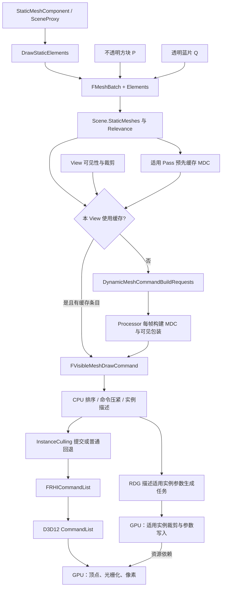
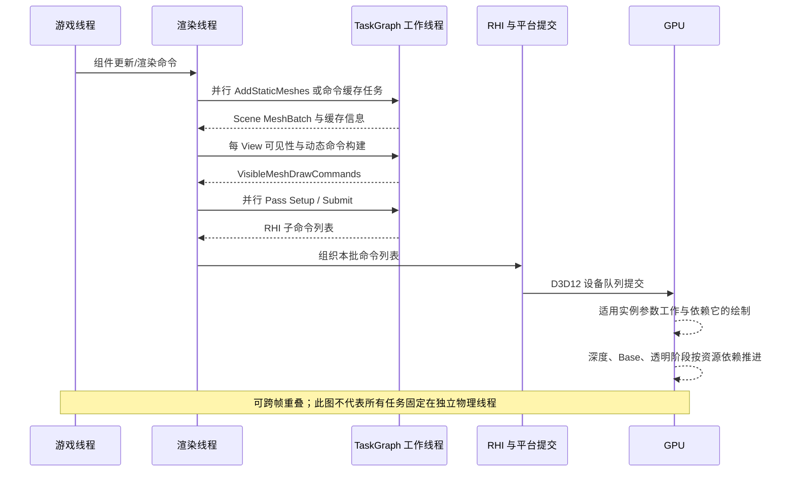

# 第 12 章：Mesh Batch、Mesh Draw Command 与绘制组织

[返回目录](../README.md) · [本章答案](../appendices/answers/12-mesh-draw-commands.md)

> **版本与范围：**UE 5.7.4，CL 51494982，Windows、D3D12、SM6、桌面延迟渲染，沿用配置 A。普通静态网格关闭 Nanite；本章重点是传统 Mesh Pass 的 CPU 组织与 RHI 绘制。Nanite 的簇命令路径在第 22 章单独对照。
>
> **证据边界：**本地源码链接和行号已静态核对；文中标为“源码已确认”的结论来自该版本源码。伪代码和图是教学简化，未启动 UE、未抓取 RenderDoc 或 Unreal Insights，也没有把示意数量当成实测性能。

## 12.1 学习目标与前置知识

上一章说明了 P（红方块上没有被蓝片覆盖的像素）和 Q（透明蓝片覆盖红方块的像素）如何经过可见性判断进入不同 Pass。本章继续追踪一个更具体的问题：**当渲染器决定“要画这个网格”时，为什么不直接调用一次 Draw，而要经过 Mesh Batch、Mesh Pass Processor、Mesh Draw Command、可见命令列表和提交阶段？**

读完本章，你应能解释：

1. `FMeshBatch` 保存了哪些几何、材质和实例信息，为什么它不是 GPU 命令。
2. 静态网格代理何时创建 Batch，何时把 Batch 放入 Scene，何时缓存每个 Mesh Pass 的命令。
3. `FMeshPassProcessor::BuildMeshDrawCommands` 如何把顶点工厂、材质、Shader、光栅化、深度和混合状态组合成一个可复用命令。
4. 可见性阶段怎样从缓存命令和动态构建请求中生成 `FVisibleMeshDrawCommand`。
5. 排序、动态实例化、实例裁剪和并行命令列表如何减少 CPU/GPU 状态切换，同时保持 P/Q 的正确遮挡和透明顺序。

前置知识是第 03 章的三角形、深度测试和混合，第 06 章的 `FPrimitiveSceneInfo` 与 Scene Proxy，第 11 章的可见性结果和 GPU Scene。这里的“命令”首先指 CPU 内存中的描述，不要直接理解成 GPU 已经执行的机器指令。

本章先补齐几个将反复出现的词。**顶点工厂（Vertex Factory）**把不同网格的顶点格式接到 Shader 所需的输入；**网格分段（Section）**是 LOD 中可分别选材质和索引范围的一部分；**细节层级（Level of Detail，LOD）**用不同几何精度适应观察距离。**管线状态对象（Pipeline State Object，PSO）**组合 Shader、顶点输入、光栅化、深度模板和混合等绘制规则；本章还会区分最小 PSO 描述和带 Render Target 格式的完整状态。**Shader 绑定（Shader Bindings）**把程序所需的参数槽连接到具体资源或参数数据，绑定一个纹理不是计算这个纹理的所有像素。

P 和 Q 始终是我们追踪的两个屏幕采样位置；方便起见，“P 的方块”指提供 P 背景表面的红方块，“Q 的薄片”指覆盖 Q 的蓝色透明薄片。它们不是 UE 自动生成的特殊物体类型。

## 12.2 先建立五层对象模型

### 12.2.1 Mesh Batch：一次“可供某个 Pass 处理”的输入描述

**网格批次（Mesh Batch）**是 `FMeshBatch`。它把可以共享材质和顶点工厂的一组元素组织起来；每个 **Mesh Batch Element** 再提供索引缓冲、首索引、图元数、实例数、Primitive Uniform Buffer 等具体范围。源码的注释直接说明：一个 Batch 的所有元素共享材质和顶点缓冲 [MeshBatch.h：368 行](G:/UnrealEngineInstalled/UE_5.7/Engine/Source/Runtime/Engine/Public/MeshBatch.h:368)。

可以把它类比成一张“绘图申请单”：申请单写清使用哪套几何接口、哪种材质、从索引缓冲的哪一段取三角形，但申请单还没有决定 Base Pass 或 Depth Pass 的完整 GPU 状态。`FMeshBatch` 的核心字段包括 `VertexFactory`、`MaterialRenderProxy`、`Elements`，以及 `CastShadow`、`bUseForMaterial`、`bUseForDepthPass` 等 Pass 资格标记，见 [MeshBatch.h：370-412 行](G:/UnrealEngineInstalled/UE_5.7/Engine/Source/Runtime/Engine/Public/MeshBatch.h:370)。

### 12.2.2 Mesh Pass：同一类输出需求的批处理边界

**网格渲染 Pass（Mesh Pass）**按输出和状态组织绘制，例如 `DepthPass`、`BasePass`、`Velocity`、`TranslucencyStandard`，以及阴影深度类别中的 `CSMShadowDepth` 等。一个红方块可能为主相机观察产生深度和 Base Pass 命令，又作为投影物参与灯光的阴影视图；透明蓝片通常进入透明 Pass，而不是普通不透明 GBuffer Base Pass。

Pass Processor 负责回答“这个 Batch 是否适合本 Pass”。它会检查材质混合模式、着色模型、顶点工厂能力、光照策略和 Pass 状态。通过检查并不表示已经提交 GPU，只表示可以建立该 Pass 的命令。

### 12.2.3 Mesh Draw Command：绑定状态和绘制参数的紧凑描述

**网格绘制命令（Mesh Draw Command，MDC）**是 `FMeshDrawCommand`。它比 `FMeshBatch` 更接近一次真正的绘制：包含图元类型、顶点流、Shader 参数绑定、最小管线状态的 ID、索引范围和实例数。**注意字段归属：**排序键与某个 Primitive 的 ID 等信息主要放在缓存信息或可见命令包装中，MDC 只记录 Primitive ID 输入流的槽位等公共规则。这样一份公共命令才能被不同 Primitive 引用。定义见 [MeshPassProcessor.h：1222 行](G:/UnrealEngineInstalled/UE_5.7/Engine/Source/Runtime/Renderer/Public/MeshPassProcessor.h:1222)。

### 12.2.4 Visible Mesh Draw Command：加入本视图之后的实例

静态命令可以跨帧缓存，但每个 View 的可见性不同。因此需要 **可见网格绘制命令（Visible Mesh Draw Command）**，记录某个视图真正要执行的命令、Primitive ID、裁剪/实例信息和排序键。一个缓存的 `FMeshDrawCommand` 可以被多个 View 引用，也可以因视图矩阵、实例裁剪或反向剔除生成不同的可见包装。

### 12.2.5 Submit：把可见命令写成 RHI Draw

最后进入命令提交处理。当前桌面 GPU Scene 主线由 `FInstanceCullingContext::SubmitDrawCommands` 组织实例参数，并调用 `SubmitDrawBegin/End`；不启用该上下文的回退路径可以进入 `SubmitMeshDrawCommandsRange` 和 `SubmitDraw`。两者最终设置必要状态和资源并记录 RHI Draw。**Submit 在本章函数名中表示向 RHI 记录绘制，不能等同于 D3D12 设备队列提交。**GPU 还要等待底层命令翻译、提交与资源依赖。

## 12.3 总体数据流：从 P/Q 网格到 RHI

以下图把静态网格主线和透明动态分支放在一起。图中的“缓存”表示可重用的 CPU 命令描述，不表示 GPU 资源被复制。

[打开绘制命令主线静态图](../assets/diagrams/12-mesh-draw-commands-1.png)



**[教学简化]**真实代码还包含 Nanite、GPU Scene、不同 Feature Level、多个 View、并行任务和多种特殊 Pass。图只保留传统静态网格最容易跟踪的主干。

下面再给出一张时序示意，强调“缓存建立”和“每帧可见列表”并不是同一个时间点。它是逻辑关系图，不是某台机器的时间测量。

[打开命令准备与设备执行静态图](../assets/diagrams/12-mesh-draw-commands-2.png)



图中箭头表示依赖。若某个任务没有数据依赖，它可能和另一任务并行；若任务访问同一个可变容器，则仍需由所有权或同步规则约束。GPU 的执行常与 CPU 的下一帧重叠，不能把图读成严格的“RT 等 GPU 完再开始下一步”。

## 12.4 第一阶段：Scene Proxy 生成 Mesh Batch

### 它是什么

Scene Proxy 是渲染侧可读的组件表示。静态网格代理的 `GetMeshElement` 根据 LOD、Section、材质和顶点工厂填充一个 `FMeshBatch`。它把“这个 Section 的三角形在哪里、使用什么顶点输入和材质”转换为渲染器通用格式。

### 为什么需要它

游戏侧 `UStaticMeshComponent` 包含编辑、物理和蓝图状态，渲染器不应在每个 Pass 中反复访问 UObject。Proxy 预先保存渲染需要的资源和变换，使后续任务可以在渲染线程或工作线程读取稳定数据。没有 Batch，Pass Processor 无法统一处理静态网格、骨骼网格和程序生成网格。

### 输入

输入包括 LOD 资源、Section 三角形数和索引缓冲、材质接口、顶点工厂、反向剔除设置以及组件的选择/编辑状态。P 的立方体可能有多个 Section；每个 Section 都可能对应不同材质。Q 的透明薄片通常有自己的材质渲染代理和混合模式。

### 处理过程

`FStaticMeshSceneProxy::GetMeshElement` 先取得指定 LOD、顶点工厂数组和 Section；三角形数为零时直接返回 false。随后从 LOD 信息取得材质代理，选择普通或覆盖颜色的顶点工厂，计算是否使用反向索引，并调用 `SetMeshElementGeometrySource` 填充几何范围，见 [StaticMeshSceneProxy.cpp：733-809 行](G:/UnrealEngineInstalled/UE_5.7/Engine/Source/Runtime/Engine/Private/StaticMeshSceneProxy.cpp:733)。

简化伪代码：

```cpp
bool GetMeshElement(LOD, Section, OutBatch)
{
    if (Section.NumTriangles == 0) return false;
    OutBatch.MaterialRenderProxy = Section.Material->GetRenderProxy();
    OutBatch.VertexFactory = SelectVertexFactory(LOD, colorOverride);
    SetMeshElementGeometrySource(Section, IndexBuffer, OutBatch);
    OutBatch.CastShadow = ProxyCastsShadow;
    return OutBatch.Elements[0].NumPrimitives > 0;
}
```

### 输出

输出是可被多个 Pass Processor 读取的 `FMeshBatch`。它引用资源，不拥有全部资源内容。`FMeshBatchDynamicPrimitiveData` 的数组视图还要求数据至少存活到渲染线程本帧结束，源码注释见 [MeshBatch.h：116-122 行](G:/UnrealEngineInstalled/UE_5.7/Engine/Source/Runtime/Engine/Public/MeshBatch.h:116)。

### UE 如何实现与条件

静态几何会在 `DrawStaticElements` 中被收集；动态网格则可能每帧通过 `GetDynamicMeshElements` 产生 Batch。静态网格的 `DrawStaticElements` 由 `FPrimitiveSceneInfo::AddStaticMeshes` 以并行任务调用，见 [PrimitiveSceneInfo.cpp：1537-1557 行](G:/UnrealEngineInstalled/UE_5.7/Engine/Source/Runtime/Renderer/Private/PrimitiveSceneInfo.cpp:1537)。材质隐藏、Section 隐藏或零三角形会跳过。

### 性能与误区

Batch 数量增加会扩大 Pass Processor 和排序工作，但一个 Batch 不等于一个最终 Draw Call：它可能被缓存、合并、实例化，或在多个 Pass 中复用。反过来，多个 Section 即使共享材质，也不一定能合并，因为索引范围、顶点工厂或 Primitive 数据不同。

### 用六个索引理解一次绘制范围

**[教学简化]**设薄片由两组三角形组成，局部顶点编号是 `0,1,2,3`，索引为 `[0,1,2, 0,2,3]`。若这六个索引位于索引缓冲第 24 项开始，元素可表达 `FirstIndex=24`、`NumPrimitives=2`、`BaseVertexIndex=100`、`NumInstances=1`。在三角形列表中，需要读取 `2×3=6` 个索引；索引 0 对应所选顶点输入中的第 100 个顶点，索引 3 对应第 103 个顶点。

`FirstIndex` 的单位是索引项，不是字节：若索引为 16 位，第 24 项的字节偏移为 `24×2=48`；若是 32 位则为 96 字节。`NumPrimitives` 是图元数，本例图元为三角形，不能把它直接当成索引数。`NumInstances=3` 表示重复使用同样几何输入三份实例，并通过实例数据区分变换等条件，不表示新增三角形索引内容。

这些字段来自 [MeshBatch.h：269 行](G:/UnrealEngineInstalled/UE_5.7/Engine/Source/Runtime/Engine/Public/MeshBatch.h:269)。该版本注释还明确 `NumPrimitives=0` 可表示从 `IndirectArgsBuffer` 读取参数。因此在调试器看到零值时，先检查是否是间接绘制，不能立即判定“空网格”。**间接绘制（Indirect Draw）**是 Draw 参数来自 GPU 可读缓冲的方式；参数可以由 CPU 上传，也可以由前面的 GPU 计算更新。

## 12.5 第二阶段：把 Batch 注册进 Scene 并缓存命令

### 它是什么

场景更新把代理生成的静态 Mesh Batch 放进 `Scene->StaticMeshes`，记录 `FStaticMeshBatchRelevance`，随后为支持缓存的 Mesh Pass 构建命令。缓存让相机移动但几何、材质和管线状态不变时，不必每帧重新执行全部 Processor 逻辑。

### 为什么需要它

如果每帧对每个静态 Section 重新解析材质、选择 Shader 和填充绑定，CPU 成本会随场景规模线性增长。缓存把“长期不变的命令结构”和“本视图变化的可见性、Primitive ID、View 参数”分开。

### 输入与处理

`AddStaticMeshes` 将每个 `FStaticMeshBatch` 放进稀疏数组并赋予 `Mesh.Id`，同步保存 Relevance，见 [PrimitiveSceneInfo.cpp：1561-1579 行](G:/UnrealEngineInstalled/UE_5.7/Engine/Source/Runtime/Renderer/Private/PrimitiveSceneInfo.cpp:1561)。若允许缓存，接着调用 `CacheMeshDrawCommands` 和 Nanite 材质 bin 缓存，见 [1590-1594 行](G:/UnrealEngineInstalled/UE_5.7/Engine/Source/Runtime/Renderer/Private/PrimitiveSceneInfo.cpp:1590)。

`CacheMeshDrawCommands` 按批次拆分 SceneInfo，跳过不支持缓存的网格，然后遍历 `EMeshPass`。对有 `CachedMeshCommands` 标志的 Pass 创建 Processor，调用 `AddMeshBatch`，从上下文取得 `FCachedMeshDrawCommandInfo`，写入 `StaticMeshCommandInfos`，见 [PrimitiveSceneInfo.cpp：583-676 行](G:/UnrealEngineInstalled/UE_5.7/Engine/Source/Runtime/Renderer/Private/PrimitiveSceneInfo.cpp:583)。最后按 Pass 位图压紧命令索引，见 [684-727 行](G:/UnrealEngineInstalled/UE_5.7/Engine/Source/Runtime/Renderer/Private/PrimitiveSceneInfo.cpp:684)。

### P/Q 案例

方块对应的不透明 Base Pass、Depth Pass 和适用阴影 Mesh Pass 命令可被缓存；这仍需满足网格与 Pass 条件。**[源码已确认]**本版本标准透明、After DOF 等注册项只有 `MainView` 标志，没有 `CachedMeshCommands`，而 BasePass 同时具有两者，见 [BasePassRendering.cpp：2718 行](G:/UnrealEngineInstalled/UE_5.7/Engine/Source/Runtime/Renderer/Private/BasePassRendering.cpp:2718)。所以即使 Q 的薄片几何来自静态 Batch，标准透明 Pass 仍走每帧命令构建。不能把“静态几何”“静态 Batch”“缓存 MDC”当成同一件事。

### 执行条件：不是所有 Batch 都能缓存

**[源码已确认]** [PrimitiveSceneProxy.cpp：147 行](G:/UnrealEngineInstalled/UE_5.7/Engine/Source/Runtime/Engine/Private/PrimitiveSceneProxy.cpp:147) 的基本判定要求：Batch 恰好一个 Element、没有 `bViewDependentArguments`、Vertex Factory 类型支持缓存。带 Feature Level 的重载还排除特定外部纹理表达式，因为相应不可变采样器可以参与 PSO，而媒体资源初始化会改变实际状态。`CacheMeshDrawCommands` 又跳过使用体积透明自阴影的代理，因为相关 Uniform Buffer 属于单帧数据。

由此可以推理：一个包含两个 Element 的 Batch 能被动态 Processor 处理，不意味着它能进入这条静态缓存路径；材质是 Opaque 也只是相关条件之一。缓存建立时 Processor 的 View 参数为 `nullptr`，见前文 `CreateMeshPassProcessor` 调用。这是一个非常实用的检查：若你新写的缓存 Pass 无条件读取 `ViewIfDynamicMeshCommand`，就与该调用上下文不兼容。

### 输出、成本与生命周期

本阶段输出 Scene 中的缓存命令或状态桶，以及 Primitive 侧定位它们的 `StaticMeshCommandInfos`。下游可见性任务使用这些索引，不会逐个重做材质筛选。缓存节省稳定帧的 CPU 组织成本，却消耗内存，并把一部分开销集中到场景加入或失效重建时；大量对象同时加入仍可能形成峰值。

某个命令未生成不一定是故障。Processor 可能认定它与 Pass 无关；因此某个缓存分支命中但找不到对应条目时，代码不会自动强制产生一条 Draw。这与“本次选择不使用缓存，从静态 Batch 动态重建”是两个分支。读者应同时记录缓存资格、Pass 是否接受和最终命令数。

## 12.6 第三阶段：Mesh Pass Processor 组装绘制命令

### 它是什么

`FMeshPassProcessor` 是某一 Pass 的规则执行者。Base Pass Processor 会根据材质是否 Masked、Translucent、Shading Model 和 LightMap Policy 选择对应 Shader 与状态。它不是 Shader 本身，而是把高层 Batch 变成底层命令的适配器。

这里 **Masked（遮罩）**是按阈值丢弃部分覆盖的材质方式，**Translucent（半透明）**使用相应透明组合规则，**Shading Model（着色模型）**决定表面怎样响应光照。**LightMap Policy（光照贴图策略）**是源码组织不同预计算光照条件的策略类型；配置 A 不使用烘焙光照，读到这个模板参数不等于实际绑定了一张烘焙 Lightmap。

### 为什么需要它

不同 Pass 的目标不同：Depth Pass 可能只需要位置；Base Pass 需要写 GBuffer；透明 Pass 需要颜色、深度读取和 Blend。若每个 Scene Proxy 自己拼装全部状态，会产生大量重复和不一致。Processor 统一决定哪些网格进入该 Pass。

### 输入、处理与输出

Base Pass 的 `Process` 取得 Vertex Factory，调用 `GetBasePassShaders`；若没有适用 Shader 则返回 false。随后创建 `FMeshPassProcessorRenderState`，并在满足条件时调用 `BuildMeshDrawCommands`，源码入口见 [BasePassRendering.cpp：1908-1946 行](G:/UnrealEngineInstalled/UE_5.7/Engine/Source/Runtime/Renderer/Private/BasePassRendering.cpp:1908)。

`BuildMeshDrawCommands` 先创建共享命令，设置图元类型、顶点声明、绑定 Shader、光栅化状态、Blend State、Depth-Stencil State 和可变速率着色条件，见 [MeshPassProcessor.inl：50-118 行](G:/UnrealEngineInstalled/UE_5.7/Engine/Source/Runtime/Renderer/Public/MeshPassProcessor.inl:50)。然后为顶点、像素和几何 Shader 填充共享绑定；对每个 Batch Element 再填充元素级 Shader 参数、Primitive ID、实例和索引范围，见 [MeshPassProcessor.inl：135-203 行](G:/UnrealEngineInstalled/UE_5.7/Engine/Source/Runtime/Renderer/Public/MeshPassProcessor.inl:135)。

可以把命令抽象成：

```text
CommandAndVisibleInfo = {
  VertexStreams, VertexShader, PixelShader,
  RasterizerState, DepthStencilState, BlendState,
  PrimitiveType, IndexBufferRange, PrimitiveId, SortKey
}
```

这不是 UE 的结构定义：它有意把 MDC 和可见包装放在一起展示。`PrimitiveId`/实例 ID 与 GPU Scene 数据的索引关系让 Shader 找到对应变换和适用的逐 Primitive 数据；普通材质纹理、材质参数绑定还有自己的材质资源，不能把所有 Material Instance 参数都说成保存在同一张 Primitive 表。Q 的透明命令也需要几何与材质输入，但其颜色会按透明路径参与 Scene Color 合成。

### 执行条件、性能与误区

Processor 只在 Pass 标志允许、材质兼容、Shader 已可用且 Batch 元素有效时生成命令。一个常见误区是把“缓存命令”理解为已经绑定了本帧 View 常量。View 矩阵、屏幕比例和部分实例数据通常在提交或 Shader 参数阶段按视图补充。

命令创建的成本主要来自材质/顶点工厂组合、Shader 绑定填充和分配。PSO 预缓存可以提前完成适用的管线创建工作，但不消除材质变体数量。不同 Blend、Depth、Cull 状态会产生不同管线状态，过度碎片化会降低排序和批处理收益。

还要区分“选不到当前材质 Shader”和“没有任何可画结果”。`FBasePassMeshProcessor::AddMeshBatch` 会从材质代理取得 Shader Map，尝试 `TryAddMeshBatch`，不成功时继续 `GetFallback`，见 [BasePassRendering.cpp：2058 行](G:/UnrealEngineInstalled/UE_5.7/Engine/Source/Runtime/Renderer/Private/BasePassRendering.cpp:2058)。本章不能把所有暂时缺失 Shader 的情况都描述成物体消失。

## 12.7 第四阶段：可见性把缓存命令变成本 View 的命令

### 它是什么

上一章的裁剪和遮挡结果提供 Primitive 可见性。`FDrawCommandRelevancePacket::AddCommandsForMesh` 根据 Pass、可见性和缓存条件，把命令追加到某 View 的 `VisibleMeshDrawCommands`；无法缓存的 Batch 则追加到 `DynamicMeshCommandBuildRequests`。源码入口见 [SceneVisibility.cpp：1174-1218 行](G:/UnrealEngineInstalled/UE_5.7/Engine/Source/Runtime/Renderer/Private/SceneVisibility.cpp:1174)。

### 为什么需要它

缓存列表是“这个物体理论上能画什么”，而 View 只需要“本次哪些候选需要继续绘制”。方块通过相机可见性后，加入适用的 Depth/Base 命令；若整个候选被裁掉，可省去对应主视图工作。薄片覆盖 Q 下方的方块区域且自身可见时，会进入透明 Pass，并使用相应深度测试和混合状态。

### 处理过程

1. 读取 Primitive 的 Relevance，判断该 Mesh Pass 是否启用。
2. 检查 `bUseCachedMeshDrawCommands` 与该网格是否有对应缓存。
3. 本次使用缓存且确有该 Pass 条目时，创建 `FVisibleMeshDrawCommand`，填入命令指针、Primitive ID、Cull/Fill 模式、排序键和实例裁剪负载。找不到对应条目时不追加命令。
4. 不可缓存时，记录 `FStaticMeshBatch*` 到动态请求列表，之后由 Processor 在本帧生成命令。
5. 多 View 或立体渲染时，每个 View 保持自己的列表和矩形。

**[源码已确认]**相关代码按 Pass 逐项调用 `AddCommandsForMesh`，包括 DepthPass、BasePass 和多个 Translucency Pass；列表来自可见性任务的每视图输出。源码枚举与调用位置可从 [SceneVisibility.cpp：1636-1817 行](G:/UnrealEngineInstalled/UE_5.7/Engine/Source/Runtime/Renderer/Private/SceneVisibility.cpp:1636) 追踪。

### 静态 Batch 为什么进入 DynamicMeshCommandBuildRequests

**[源码已确认]** `GenerateDynamicMeshDrawCommands` 有两组输入：当前收集到的动态 Mesh Elements，以及需要本帧构建的静态 Mesh Batch 请求。两组最后都调用 Processor 的 `AddMeshBatch`，见 [MeshDrawCommands.cpp：595 行](G:/UnrealEngineInstalled/UE_5.7/Engine/Source/Runtime/Renderer/Private/MeshDrawCommands.cpp:595)。后者若有 `bViewDependentArguments`，还先复制 Batch，再由代理执行 `ApplyViewDependentMeshArguments(View, Copy)`，这样不会把本 View 的参数直接写坏共享静态描述。

例如 Q 的静态薄片进入标准透明 Pass，属于“静态 Batch 动态建命令”；它不因此变成骨骼动画网格，也不代表顶点缓冲每帧重建。动态一词必须补全它所修饰的对象：动态几何、动态参数和动态命令生成解决不同问题。

**输出与性能。**这一阶段输出当前 View/Pass 的可见命令和待构建请求，供 Pass Setup 任务使用。不可见对象可以节省后续命令与像素工作，但裁剪本身也要花 CPU/GPU 时间；少量对象的教学场景不适合用 FPS 测出稳定收益。可见命令尚未证明每个实例最终可见，实例裁剪可以在后面继续减少设备工作。

### P/Q 的深度关系

在启用适用深度预通道的基础观察中，P 所属方块先写深度。Q 的透明命令通常测试已有不透明深度，颜色可写入 Scene Color 或透明中间目标后再合成；透明物体不自动形成普通不透明 GBuffer 条目。这里的排序不是几何是否可见的最终证明，最后仍有光栅化和逐样本深度测试。**顺序无关透明（Order-Independent Transparency，OIT）**尝试用额外存储/合成解决透明排序问题；启用排序三角形或特定 OIT 时，动态索引或排序数据可能改变命令元素，本章基础算例保持普通 Alpha 混合。

## 12.8 第五阶段：排序、动态实例化与并行提交

### 排序是什么

每个可见命令带有 `FMeshDrawCommandSortKey`。排序可以把相同 PSO、材质或状态的命令放在一起，减少 `SetPipelineState` 和 Shader 绑定切换；透明 Pass 还要满足深度相关的绘制顺序或采用明确 OIT 方案。排序键优化的是状态与顺序，不改变材质 Shader 逻辑。

### 动态实例化是什么

**动态实例化（Dynamic Instancing）**把本次可见、状态兼容的多个绘制安排为实例化工作，减少重复命令。`MatchesForDynamicInstancing` 比较 Pipeline ID、Stencil Ref、Shader Bindings、顶点流、Primitive ID 流槽、索引缓冲、FirstIndex、图元数、实例数，以及直接/间接参数，见 [MeshPassProcessor.h：1274 行](G:/UnrealEngineInstalled/UE_5.7/Engine/Source/Runtime/Renderer/Public/MeshPassProcessor.h:1274)。它检查的是兼容命令，不仅是材质资产名称。

这个比较为状态复用提供条件，不能据此断言“每对匹配命令都会合并”。真实主线还涉及相邻状态桶、实例顺序要求、批次容量以及裁剪标记。P 的方块与金属球即使临时使用同一材质，索引缓冲、顶点流和索引范围也不同，不能由此合并成同一份几何的实例。

### 并行提交是什么

**[源码已确认]**本版本 `FParallelMeshDrawCommandPass::Dispatch` 接受 `FRDGDispatchPassBuilder`，根据工作线程数、`r.RHICmdWidth` 和每列表最小 Draw 数决定任务划分，并用 `CreateCommandList` 创建命令列表，见 [MeshDrawCommands.cpp：1765 行](G:/UnrealEngineInstalled/UE_5.7/Engine/Source/Runtime/Renderer/Private/MeshDrawCommands.cpp:1765)。它把 Pass Setup 的完成事件作为前置依赖，交给 `FDrawVisibleMeshCommandsAnyThreadTask`。

任务根据实际可见命令数重算范围，调用 `InstanceCullingContext.SubmitDrawCommands`，完成后 `FinishRecording`，见 [MeshDrawCommands.cpp：1595 行](G:/UnrealEngineInstalled/UE_5.7/Engine/Source/Runtime/Renderer/Private/MeshDrawCommands.cpp:1595)。这是当前主线应跟踪的入口。文件中的旧 `DispatchDraw` 仍可搜索到，但不能因为网络教程常引用它就替换本地调用者实际使用的 `Dispatch`。

**输入与输出。**输入是排序/压紧后的可见列表、最小 PSO 集合、实例数据偏移以及已声明的 Pass 资源；输出是已记录的 RHI 子命令列表。并行命令记录不会替你解决全局资源竞争：RDG/RHI 仍需保证深度、GBuffer 和实例参数之间的设备依赖。没有足够命令时，拆出更多 CPU 任务只会增加调度和重复状态初始化成本。

### 性能与误区

命令数量减少不等于 GPU 像素成本按同样比例减少；实例化主要降低 CPU 提交和状态切换，顶点/像素工作仍取决于实例数和覆盖面积。相反，过度排序可能增加内存移动或破坏透明正确性。应分别观察可见命令数、实际 Draw 数、三角形数、像素覆盖和 GPU Pass 时间。

### 12.8.1 状态桶与缓存失效

在使用 GPU Scene 的路径中，多个 Primitive 可以共享一个状态桶（State Bucket）。`FinalizeCommandCommon` 先为 Pipeline State 取得持久 ID，再写入 `FMeshDrawCommand`；启用 GPU Scene 时，命令按哈希放入状态桶，多个 Primitive 只保留各自的 Primitive ID 和实例信息，见 [MeshPassProcessor.cpp：1966-2071 行](G:/UnrealEngineInstalled/UE_5.7/Engine/Source/Runtime/Renderer/Private/MeshPassProcessor.cpp:1966)。这样做的意义是把“材质/Shader/顶点流相同”与“世界变换不同”拆开。

缓存不是永久不变。Shader Map、顶点声明、绑定资源的身份、索引范围或 Pass 资格改变时，需要按对应更新路径重建相关命令。**[源码已确认]** `UpdateStaticMeshes` 在带有 `RasterCommands` 标志时调用 `RemoveCachedMeshDrawCommands`，在要求重新加入时再缓存，见 [PrimitiveSceneInfo.cpp：2050 行](G:/UnrealEngineInstalled/UE_5.7/Engine/Source/Runtime/Renderer/Private/PrimitiveSceneInfo.cpp:2050)。移除过程会减少共享状态桶引用计数，而非直接销毁所有其他物体仍使用的状态，见 [791 行](G:/UnrealEngineInstalled/UE_5.7/Engine/Source/Runtime/Renderer/Private/PrimitiveSceneInfo.cpp:791)。

数据内容变化却不必一概重建。例如沿正确更新路径改变同一 GPU Scene 条目的变换，并不等于每次都换掉材质 Shader 或索引缓冲。需要区分“资源对象不变，内容更新”和“绑定或管线结构改变”。命令内存在的资源地址也不是所有权承诺，替换、释放资源须遵守第 08 章的生命周期契约。

### 12.8.2 透明排序为什么是另一类问题

不透明 P 只要深度测试/写入和 GBuffer 输出正确，前后绘制顺序通常不改变最终遮挡。Q 采用 Alpha Blend 时，源颜色与目标 Scene Color 的组合依赖顺序，因此渲染器使用 View 的 `TranslucentSortPolicy`、排序轴和相机位置更新透明排序键。`FMeshDrawCommandPassSetupTask` 在透明 Pass 中调用 `UpdateTranslucentMeshSortKeys`，之后统一排序，见 [MeshDrawCommands.cpp：1119-1149 行](G:/UnrealEngineInstalled/UE_5.7/Engine/Source/Runtime/Renderer/Private/MeshDrawCommands.cpp:1119)。

例如额外加入第二张薄片时，适用的距离排序可以让远处先混合、近处后混合。但按 Primitive 中心排序不能解决所有相交三角形，优先级和排序轴也可能改变结果；开启特定 OIT 后还可能改变排序方向。本章只保留原有的一张薄片，不借这个例子假定透明几何已得到完美的逐像素排序。

### 12.8.3 GPU Scene 主线如何组织实例与间接参数

**[源码已确认]** Pass Setup 任务生成动态命令、应用 View 覆盖、更新透明排序键并排序之后，在 `bUseGPUScene` 分支调用 `InstanceCullingContext.SetupDrawCommands`，见 [MeshDrawCommands.cpp：1152 行](G:/UnrealEngineInstalled/UE_5.7/Engine/Source/Runtime/Renderer/Private/MeshDrawCommands.cpp:1152)。这个函数先在 CPU 上处理可见命令与实例范围，不能把名字里的 Culling 直接理解成 GPU 已裁掉实例。

它扫描已排序命令；当允许压紧，且相邻命令拥有有效且相同的 `StateBucketId` 与裁剪标记时，把实例挂到同一条保留命令。带顺序保持要求的间接实例和某些 Uniform Buffer View 模式会限制合并。间接 Draw 的选择也有具体条件，例如实例数、实例范围、强制实例裁剪和从 Scene 获取实例数量，见 [InstanceCullingContext.cpp：1490 行](G:/UnrealEngineInstalled/UE_5.7/Engine/Source/Runtime/Renderer/Private/InstanceCulling/InstanceCullingContext.cpp:1490)。

结果包含两类东西：CPU 上保存的 Draw 说明，以及随后供 GPU 消费的候选实例与参数槽。前者告诉提交函数要在哪个偏移读取参数，后者让 GPU 继续判断实例是否需要出现在该 View。**压紧（Compaction）**是把保留项收集到连续区域；它既可以指 CPU 压紧相同命令，也可以指 GPU 压紧可见实例，阅读时要明确对象。

**为什么需要这一步？**假设临时对照场景放了 100 个同网格、同材质方块。CPU 如果先读回全部 GPU 遮挡结果再记录准确实例数，会增加等待。间接参数让 CPU 提前记录“从这个缓冲取实例数”，GPU 则在依赖满足后填写实际数量。原场景只有一个方块也能走相关框架，但不保证每个单实例都需要完整的遮挡分支；源码有 `UnCulled` 单实例处理模式。

### 12.8.4 CPU 描述任务，GPU 写入 Draw 参数

`BuildRenderingCommands` 使用 RDG 描述构建实例参数的工作。它可以把上下文加入延迟处理的批次，也可在对应分支准备独立任务；没有裁剪命令时则使用适用的空参数或默认绑定，见 [InstanceCullingContext.cpp：698 行](G:/UnrealEngineInstalled/UE_5.7/Engine/Source/Runtime/Renderer/Private/InstanceCulling/InstanceCullingContext.cpp:698)。延迟在这里是组织任务的方式，不等于一定延后一个显示帧。

Shader 参数明确包含 GPU Scene、View ID、Draw 描述、裁剪负载，以及输出 `InstanceIdsBufferOut`、`DrawIndirectArgsBufferOut`；适用遮挡分支还使用 HZB。C++ 参数结构与入口注册见 [InstanceCullingContext.cpp：569 行](G:/UnrealEngineInstalled/UE_5.7/Engine/Source/Runtime/Renderer/Private/InstanceCulling/InstanceCullingContext.cpp:569)。注册将 `FBuildInstanceIdBufferAndCommandsFromPrimitiveIdsCs` 连接到 `/Engine/Private/InstanceCulling/BuildInstanceDrawCommands.usf` 的 `InstanceCullBuildInstanceIdBufferCS`。

在非立体、非顺序压紧的适用 Shader 分支中，可以直接读到这组行为，见 [BuildInstanceDrawCommands.usf：323 行](G:/UnrealEngineInstalled/UE_5.7/Engine/Shaders/Private/InstanceCulling/BuildInstanceDrawCommands.usf:323)：

```text
对当前候选实例和 View：
    bVisible = IsInstanceVisible(...)
    若 bVisible：
        原子增加这个 Draw 参数槽的实例计数，取得自己的输出位置
        把实例数据/标识写入对应输出位置
```

**原子加（Atomic Add）**让多个 GPU 执行线程竞争同一计数器时，每个可见实例仍能拿到唯一输出位置。源码中 `InterlockedAdd` 修改间接参数的实例计数项，`WriteInstance` 写入相应实例输出。启用保持顺序的压紧时，会先走额外临时存储/压紧过程；不能把上面几行当成全部 permutation 的唯一实现。

这里输入是“有待判断的实例”，输出是“Draw 可以读取的实例列表与数量”，没有产生 P 的 GBuffer 颜色。GPU 必须完成这些输出所要求的资源写入和屏障后，依赖它们的 Draw 才能消费；CPU 的记录任务可以先完成而无需读回计数。遮挡也不是无条件执行：本地代码检查 `PrevHZB.IsValid()` 与相应启用条件，另有实例裁剪和单实例处理开关，见 [InstanceCullingContext.cpp：856 行](G:/UnrealEngineInstalled/UE_5.7/Engine/Source/Runtime/Renderer/Private/InstanceCulling/InstanceCullingContext.cpp:856)。

**成本与误区。**实例参数生成增加计算 Shader、缓冲读写和原子操作成本，换来减少无效实例或降低 CPU 组织成本的机会。开启它不意味着小场景一定更快；CPU 的可见命令数量、GPU 最终可见实例数和 API Draw 次数是三个不同统计量。原例 Q 的薄片即使只有一个实例，也仍需正确的实例/Primitive 数据，不能因为没有大量实例就省掉其数据来源。

## 12.9 第六阶段：从 Mesh Pass 提交到 D3D12

### 它是什么

提交阶段把 `FVisibleMeshDrawCommand`、最小 PSO 集合、Pass 资源与实例参数变成 `FRHICommandList` 调用。它解决的是“本次 Draw 应如何绑定和记录”，缺少这一步，CPU 即使建立了完整可见列表，也不会凭空在设备队列中产生绘制。

**[源码已确认]**正常 Base Pass 的并行分支先填 `View`、`BasePass` Uniform Buffer、Render Targets 和实例参数，调用 `Pass->BuildRenderingCommands`，再以 `GraphBuilder.AddDispatchPass` 登记 `Pass->Dispatch`，见 [BasePassRendering.cpp：1608 行](G:/UnrealEngineInstalled/UE_5.7/Engine/Source/Runtime/Renderer/Private/BasePassRendering.cpp:1608)。非并行分支可通过 `AddPass` 回调调用 `Pass->Draw`，见 [1700 行](G:/UnrealEngineInstalled/UE_5.7/Engine/Source/Runtime/Renderer/Private/BasePassRendering.cpp:1700)。两者都必须具备有效 Pass、View 条件和依赖资源。

### 处理过程

GPU Scene 主线的 `FInstanceCullingContext::SubmitDrawCommands` 为每条命令选择实例数据偏移，并按 `bUseIndirect` 填写间接参数缓冲/偏移或直接实例倍率。然后调用 `SubmitDrawBegin` 设置状态与绑定，成功后 `SubmitDrawEnd` 发出 Draw，见 [InstanceCullingContext.cpp：1688 行](G:/UnrealEngineInstalled/UE_5.7/Engine/Source/Runtime/Renderer/Private/InstanceCulling/InstanceCullingContext.cpp:1688)。这里消费裁剪所需的输出资源引用，CPU 不会逐个重新计算 GPU 实例可见性。拆成多个批次时，同一保留 MDC 还可能多次调用 End，因此 MDC 数量不必等于最终 API Draw 数量。

当实例上下文未启用时，才进入 `SubmitMeshDrawCommandsRange` 等普通回退。**本地版本该函数明确 `checkSlow(!bDynamicInstancing)` 并关闭该路径的动态实例化**，随后遍历命令调用 `SubmitDraw`，见 [MeshPassProcessor.cpp：1616 行](G:/UnrealEngineInstalled/UE_5.7/Engine/Source/Runtime/Renderer/Private/MeshPassProcessor.cpp:1616)。不能从函数还保留一个 `bDynamicInstancing` 参数，就推断它是当前实例合并的实现主体。

以**直接索引绘制分支**为例，RHI 继续把 `DrawIndexedPrimitive` 交给 D3D12 后端，后端 `RHIDrawIndexedPrimitive` 设置状态并向原生命令列表记录 `DrawIndexedInstanced`，见 [D3D12Commands.cpp：1270 行](G:/UnrealEngineInstalled/UE_5.7/Engine/Source/Runtime/D3D12RHI/Private/D3D12Commands.cpp:1270)。间接 Draw 则进入不同 RHI 接口，不能硬接到同一个直接绘制函数。两者在 C++ 调用时都仍处于设备命令的 CPU 组织阶段；GPU 执行属于后续边界。

### 输出与执行条件

输出是 RHI 绘制记录，随后翻译为平台命令。若没有可见命令，可以提前返回；其他空 Pass 是否保留由具体工作和 RDG 决定。材质不适用或没有适用回退可以不产生命令；绑定资源必须有效，不能把资源初始化不满足契约一概当成正常跳过。`r.RHICmdBypass` 只改变 RHI 记录层，不能让 GPU 同步执行。

### 12.9.1 一次 SubmitDraw 的字段变化

可把 `SubmitDraw` 拆成四个可检查的动作：

1. **管线状态检查：**`SubmitDrawBegin` 比较 `CachedPipelineId` 和状态缓存，变化时应用 Rasterizer、Depth-Stencil、Blend 及绑定 Shader；若 PSO 仍在预缓存，且策略允许跳过，则可能返回 false。
2. **顶点流绑定：**遍历 `VertexStreams`。使用 GPU Scene 时，Primitive ID 流可能被替换成当前 View 的实例缓冲和偏移。
3. **Shader 参数绑定：**把已准备的 Shader Bindings 设置到 RHI 命令列表；这些绑定可能包含纹理、Uniform Buffer、Primitive 数据和 View 数据。
4. **绘制调用：**`SubmitDrawEnd` 根据是否有索引缓冲、是否使用间接参数，选择 `DrawIndexedPrimitive`、`DrawPrimitive` 或对应的 Indirect 版本，见 [MeshPassProcessor.cpp：1302-1355 行](G:/UnrealEngineInstalled/UE_5.7/Engine/Source/Runtime/Renderer/Private/MeshPassProcessor.cpp:1302)。

这些动作解决的是“如何记录一次正确 Draw”。它们不负责决定 P 是否在视锥内，那是可见性阶段的输入；也不负责计算每个像素的最终光照，那是后续 Shader 在 GPU 上的工作。

**最小 PSO 为什么还要补充？**缓存的 `FGraphicsMinimalPipelineStateInitializer` 主要描述可复用状态；当前 Pass 的颜色/深度附件及格式在提交上下文中才能确定。`SubmitDrawBegin` 调用 `AsGraphicsPipelineStateInitializer`，然后 `RHICmdList.ApplyCachedRenderTargets(GraphicsPSOInit)`，见 [MeshPassProcessor.cpp：1232 行](G:/UnrealEngineInstalled/UE_5.7/Engine/Source/Runtime/Renderer/Private/MeshPassProcessor.cpp:1232)。所以缓存 MDC 不意味着它拥有一张永不变化的 GBuffer 纹理，也不意味着已有任意目标格式可直接复用的完整平台 PSO。

### 12.9.2 状态缓存的收益与边界

`FMeshDrawCommandStateCache` 记住上一条命令已经设置的 PSO、顶点流、Stencil Ref 和 Shader Bindings。如果相邻命令相同，就可以跳过重复设置。排序的价值之一正是让相邻命令更容易命中缓存。状态缓存只存在于本次命令列表处理上下文，不能跨越不兼容的 Render Pass 或随意跨帧共享。

一个常见误区是把“同一材质”当成“同一 PSO”。Cull Mode、Blend Mode、Depth Write、Vertex Factory、顶点声明、Primitive Type 或 Shader permutation 任一不同，都可能形成不同管线状态。反过来，同一 PSO 也不代表两个物体可以安全实例化，因为索引范围、顶点流和 Shader 绑定仍要满足匹配条件。

## 12.10 贯穿案例：红方块 P 与透明蓝片 Q

固定场景含地面、红色不透明方块、金属球、透明蓝片、可移动方向光和点光源，沿用第 01 章相机与材质。P 位于未被蓝片覆盖的方块表面，Q 位于薄片覆盖方块的屏幕区域。下面用“P 的命令”“Q 的命令”指相关物体的几何工作，并不表示 CPU 为每个像素单独建一条 MDC。

1. **代理阶段：**方块和蓝片的组件分别拥有 Scene Proxy。P 的每个静态 Section 生成 `FMeshBatch`；Q 也生成 Batch，但材质渲染代理标记为透明。此时没有任何屏幕像素。
2. **场景注册：**P 的方块 Batch 被放入 Scene 静态网格数组，并为适用 Depth/Base/阴影 Pass 缓存命令。Q 的薄片也可保留静态 Batch，但本版本标准透明 Pass 在每帧构建 MDC。
3. **可见性：**本视图中方块与薄片都可见。方块进入适用 Depth/Base 列表；薄片进入透明列表。若以后某个遮挡处理判定方块完整不可见，相应主 View 候选可以减少；透明薄片本身不会仅因覆盖像素就作为普通不透明遮挡物把后面的方块去掉。
4. **绘制方块：**在本小节额外假设预通道包含方块的条件下，GPU 先写入其深度；随后 Base Pass 使用不透明输出状态，像素 Shader 写入 GBuffer。P 和 Q 下方背景的方块表面都有适用的材质数据，后续光照形成背景颜色。没有预通道时应继续检查 Base Pass 深度写入路径，不把当前说明套到全部 Early Z 配置。
5. **绘制薄片：**透明 Pass 测试已有场景深度并形成源颜色，通过混合单元或适用透明中间目标合成参与 Q 的颜色。普通 Alpha 混合并不要求透明像素 Shader 自己采样目标颜色；目标颜色可以由附件混合逻辑读取。薄片不会因此覆盖方块的不透明 GBuffer，具体合成位置由透明 Pass 与功能条件决定。
6. **像素追踪：**P 保留方块颜色主线；Q 先有方块背景，再参与透明合成。单独用一组**[教学简化]线性颜色**演算，令源 Alpha 为 `a=0.25`、薄片已经着色的源颜色 `C_s=(0.1,0.4,1.0)`、Q 下方背景 `C_d=(0.8,0.2,0.1)`，普通非预乘源混合 `C=a*C_s+(1-a)*C_d` 得到 `(0.625,0.25,0.325)`。这些数值不替换原场景材质参数，也不是 sRGB 截图采样值；之后还需按当前透明位置连接适用后处理。

把这条路径映射回命令字段：方块命令的 `IndexBuffer`、`FirstIndex` 和 `NumPrimitives` 选择立方体 Section；`VertexStreams` 提供位置、法线、UV 等输入；`CachedPipelineId` 连接不透明 Base Pass 状态；Primitive/实例数据与材质绑定分别提供相关参数。薄片的索引缓冲可能完全不同，而 Blend、Depth 和 `TranslucencyStandard` 等 Pass 分类又决定它怎样参与颜色结果。

若相机向右移动，只让方块的一部分离开屏幕，不能据此删除整个方块的绘制命令：剩余部分仍然需要光栅化，具体可见性粒度由代理和几何路径决定。整个方块不再满足本 View 的可见性时，才可省去适用的主视图候选，而其缓存可以继续保留。改变薄片组件的透明排序优先级会改变排序输入；当前标准透明命令本来就按帧建立，不应说它因此获得不透明式跨帧缓存。把薄片改为 Opaque 则需要检查材质编译、代理更新和新的 Pass 分类，旧透明绑定不能直接沿用。

## 12.11 常见误区与性能检查

| 误区 | 正确理解 |
|---|---|
| 一个 `FMeshBatch` 就是一次 Draw Call | Batch 是输入描述，可能生成多个 Pass 命令，也可能被缓存或实例化 |
| `FMeshDrawCommand` 已经在 GPU 上执行 | 它是 CPU 命令对象；Submit 后还要经 RHI、API 队列和 GPU |
| 静态网格每帧都重新生成全部命令 | 支持缓存的 Pass 可跨帧复用；材质、资源、状态改变会使缓存失效或重建 |
| 透明 Q 可以直接加入不透明 GBuffer | 透明通常走独立 Translucency Pass，按 Blend/Depth 规则覆盖 Scene Color |
| 命令排序越多越好 | 需要在状态切换收益、透明正确性、CPU 排序成本之间平衡 |
| 动态实例化会减少所有 GPU 工作 | 主要减少提交和状态切换，实例的顶点/像素工作仍可能存在 |
| 并行 Draw 任务等于多个 GPU 队列 | 并行通常是 CPU 命令列表记录；后端提交和 GPU 队列另有规则 |

排查性能时建议同时记录：每个 Mesh Pass 的可见命令数、缓存命令命中率、动态构建请求数、实例化前后命令数、三角形数和 Pass GPU 时间。仅看到 Draw Call 数下降，不能推断 P/Q 的像素成本或阴影成本同步下降。

## 12.12 源码阅读路线与观察练习

建议按以下顺序阅读：

1. [StaticMeshSceneProxy.cpp：733](G:/UnrealEngineInstalled/UE_5.7/Engine/Source/Runtime/Engine/Private/StaticMeshSceneProxy.cpp:733)：看 Section 如何填充 Batch。
2. [PrimitiveSceneInfo.cpp：1537](G:/UnrealEngineInstalled/UE_5.7/Engine/Source/Runtime/Renderer/Private/PrimitiveSceneInfo.cpp:1537)：看静态元素如何进入 Scene。
3. [PrimitiveSceneInfo.cpp：583](G:/UnrealEngineInstalled/UE_5.7/Engine/Source/Runtime/Renderer/Private/PrimitiveSceneInfo.cpp:583)：看缓存按 Pass 建立命令。
4. [MeshPassProcessor.inl：50](G:/UnrealEngineInstalled/UE_5.7/Engine/Source/Runtime/Renderer/Public/MeshPassProcessor.inl:50)：看 PSO、Shader 和元素绑定怎样写入 Draw Command。
5. [SceneVisibility.cpp：1174](G:/UnrealEngineInstalled/UE_5.7/Engine/Source/Runtime/Renderer/Private/SceneVisibility.cpp:1174)：看可见 View 如何选择缓存或动态命令。
6. [InstanceCullingContext.cpp：1442](G:/UnrealEngineInstalled/UE_5.7/Engine/Source/Runtime/Renderer/Private/InstanceCulling/InstanceCullingContext.cpp:1442)：看已排序命令如何组织实例，接着读 698 行的 RDG 工作和 1688 行的提交分支。
7. [BasePassRendering.cpp：1608](G:/UnrealEngineInstalled/UE_5.7/Engine/Source/Runtime/Renderer/Private/BasePassRendering.cpp:1608)：从实际调用者追踪 `AddDispatchPass`、`Dispatch` 和提交任务，最后读 `SubmitDrawBegin/End`。

> **[尚未验证] 练习。** 以下步骤是阅读和运行建议，作者未在本地启动项目。

### 练习 A：缓存命令与每 View 工作

沿用配置 A、唯一固定曝光和同一 Standalone 视图，等待 Shader 编译结束。按第 08 章方式记录短 CPU Trace，保留静止观察，再只移动相机。若原场景使用固定 View Target，相机运动要通过那个实际相机进行，不要只移动未被选中的编辑器相机。观察 `CacheMeshDrawCommands`、`MeshDrawCommandPassSetupTask` 和 `DrawVisibleMeshCommandsAnyThreadTask` 等适用事件，具体名称是否出现取决于构建的统计/Trace 支持。

预期静态方块不会仅因连续相机运动而每次重建全部跨帧缓存，但可见列表、动态透明命令和 View 参数仍有工作。没有看到某个事件不能单独证明它未发生，还要检查所采集通道、构建配置与采样范围。本练习观察 CPU 组织，不能根据这些条带推断 GPU 正好在同一时刻完成 Q。

### 练习 B：一次只切换一个命令组织变量

先在控制台只输入变量名，记下运行值，再进行 A/B 对照。以下注册值已核对，**并非本项目运行值**；这些变量控制 CPU 路径，源码注册没有要求重启或 Shader 重编译。测试时仍应避开加载和编译阶段，并在结束后恢复查询到的原值。

| 变量 | 本地注册值 | 单项对照与预期 |
|---|---|---|
| `r.MeshDrawCommands.UseCachedCommands` | 1 | 改为 0 后，适用静态 Batch 走动态命令构建；不代表释放全部已有缓存 |
| `r.MeshDrawCommands.ParallelPassSetup` | 1 | 改为 0，改变命令准备的 CPU 并行选择；GPU Shader 算法本身不随之替换 |
| `r.MeshDrawCommands.CacheMultithreaded` | 1 | 影响缓存建立并行方式，静止场景若没有重新缓存可能几乎无可见差异 |

来源为 [SceneRendering.cpp：160 行](G:/UnrealEngineInstalled/UE_5.7/Engine/Source/Runtime/Renderer/Private/SceneRendering.cpp:160)、[MeshDrawCommands.cpp：22 行](G:/UnrealEngineInstalled/UE_5.7/Engine/Source/Runtime/Renderer/Private/MeshDrawCommands.cpp:22)、[PrimitiveSceneInfo.cpp：50 行](G:/UnrealEngineInstalled/UE_5.7/Engine/Source/Runtime/Renderer/Private/PrimitiveSceneInfo.cpp:50)。并行准备还检查线程性能策略和 `GIsThreadedRendering`，不能只记录控制变量等于 1 就宣称运行任务已并行。

保持输出、材质、灯光和相机路径相同，分别采集基线与单项修改后的短记录。不要期待只有一个方块就测出稳定的毫秒收益；目标是检查任务职责和命令分类。若变化不符，先确认使用传统网格路径、运行变量值、是否在同一个 View 中，并检查有没有材质或场景更新干扰。

阅读源码时可建立一张“生产者/消费者”表：

| 数据 | 生产者 | 消费者 | 生命周期提示 |
|---|---|---|---|
| `FMeshBatch` | Scene Proxy 的静态或动态元素函数 | Mesh Pass Processor | 动态数组视图至少活到渲染线程本帧使用结束 |
| `FMeshDrawCommand` | `BuildMeshDrawCommands`/缓存上下文 | 可见性列表、Submit | 静态缓存受资源和 Shader 变更影响 |
| `FVisibleMeshDrawCommand` | 可见性包或动态生成器 | 排序、实例裁剪、Submit | 按 View 和 Pass 分开保存 |
| `FRHICommandList` Draw | SubmitDraw | RHI 翻译与后端 | 记录完成不等于 GPU 完成 |

这张表能帮助定位悬空指针：如果一个动态 Batch 的 `Elements` 数组在工作线程执行前已经释放，问题出在生产者生命周期，而不是 GPU Shader。若命令正确但 P 没画，先检查可见性和 Pass Relevance；若 P 有深度但颜色异常，再检查 Base Pass 的 Shader 绑定、GBuffer 目标和材质参数。

## 12.13 本章回顾

`FMeshBatch` 描述几何和材质输入，`FMeshPassProcessor` 按 Pass 规则生成 `FMeshDrawCommand`，可见性与动态构建组织每 View 的 `FVisibleMeshDrawCommand`。GPU Scene 主线继续通过实例上下文、RDG 参数生成工作和 `SubmitDrawBegin/End` 记录 RHI 绘制；普通 Range 提交属于需分开阅读的回退。D3D12 的直接 `DrawIndexedInstanced` 仍是 CPU 记录动作，GPU 执行和显示有更后面的同步边界。

P 的不透明路径重点是 Depth、Base/GBuffer 和光照；Q 的透明路径重点是独立 Blend、深度测试、排序和 Scene Color 合成。两者可以共享 Scene Proxy 与命令组织框架，但不能因为都叫 Mesh 就假定拥有相同 Pass、缓存条件或输出资源。

## 12.14 理解检查

1. `FMeshBatch` 与 `FMeshDrawCommand` 各自保存什么？为什么从前者到后者需要 `FMeshPassProcessor`？
2. 静态 P 的相机位置改变但材质和几何不变，哪些数据可以复用，哪些数据仍需每 View 重新建立？
3. Q 的透明材质为什么通常不能直接套用 P 的不透明 GBuffer 命令？请指出至少三个状态或输出差异。
4. UE 5.7 桌面 GPU Scene 主线是否必定经过 `SubmitMeshDrawCommandsRange`？如果某次提交确实从该回退函数返回，哪些层次已推进，哪些层次仍不能证明完成？
5. 两个 Batch 使用同一材质但一个使用不同 Vertex Factory，为什么不一定能动态实例化？

[查看本章答案](../appendices/answers/12-mesh-draw-commands.md)。
