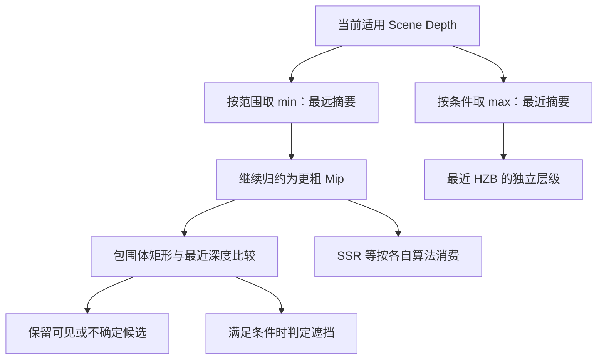
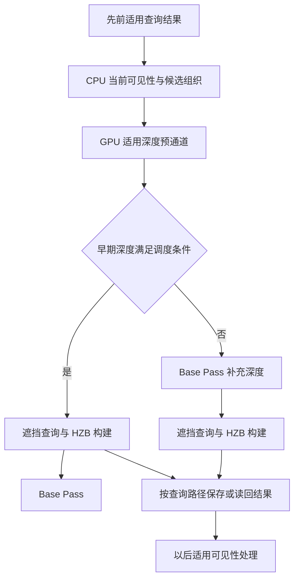

# 第 13 章：深度预通道、HZB 与遮挡

到这里，渲染器已经知道场景中有什么、从哪里观察，也能把候选网格组织成命令。但“有一份可绘制描述”仍不等于“值得为它计算完整材质”。本章研究三项相关而不同的工作：先建立深度、把深度压成多层范围信息、利用这些信息减少被挡住的工作。

适用 UE **5.7.4，CL 51494982**，Windows、D3D12、SM6、桌面延迟渲染。主线使用配置 A 的普通网格、传统材质、SSR、TAA；Nanite 的特有几何调度留到第 22 章。下面会明确补充深度相关观察条件，不把功能开关的请求值当作最终路径。

本章依据本地源码静态核验。图、深度矩阵和成本算例为 **[教学简化]**；练习均 **[尚未验证]**，没有 UE 截图、抓帧或毫秒测量。

## 13.1 学习目标与前置知识

本章完成后，你应能够解释：

1. 深度预通道、硬件 Early-Z 与遮挡剔除分别处理什么。
2. 为什么某些不透明物体能用很便宜的深度 Shader，Masked 和顶点位移却不能随意省略。
3. 反向 Z 下最远层级深度为什么取最小值，为什么它不能用普通颜色 Mip 的平均值替代。
4. HZB 构建、HZB 遮挡测试和历史结果消费为什么是三个事件。
5. 为什么 `r.EarlyZPass=0` 或 `r.HZBOcclusion=0` 不足以证明某项 GPU 工作不存在。

前置知识是第 03 章的覆盖、深度测试与透明混合，第 09 章的 RDG，以及第 11～12 章的可见性和绘制组织。本章继续用 P 追红方块的不透明表面，用 Q 追蓝色薄片覆盖方块的区域。薄片保持 Translucent、Unlit，不进入普通不透明主深度路线。

**深度缓冲（Depth Buffer）**保存各采样位置的深度编码。它不保存 Actor 名称，也不直接保存世界 Z 高度。本书反向 Z 的典型透视简化为 `d=n/z`：`n` 为近面距离，`z` 为沿相机前向的距离；较近表面编码较大，清除到远处为 0。实际矩阵、正交视图和特殊深度处理仍按相应路径判断。

## 13.2 三种“提前不画”分别发生在哪里

| 机制 | 粒度与位置 | 主要结果 |
|---|---|---|
| 深度预通道，Depth Prepass | 一个或多个渲染 Pass，先绘制适用几何 | 给后续工作准备深度 |
| Early-Z，提前深度测试 | GPU 光栅化相关执行中的样本判断 | 在语义允许时避免某些像素 Shader 工作 |
| 遮挡剔除，Occlusion Culling | 场景对象、实例或其他范围的候选工作筛选 | 省掉已判定不需要的绘制或后续处理 |

Prepass 需要绘制几何，它不是“不画”的免费步骤。Early-Z 可以使用前面已存在的深度，即使没有专门 Prepass，也仍可能发挥作用。遮挡剔除则可能在真正提交复杂几何之前，通过简化范围判断它有没有必要参与。

**遮挡者（Occluder）**是挡住其他表面的对象；**被测对象（Occludee）**是正在判断是否被挡住的对象。一个方块可以同时具有两种角色：遮住后面的球，又被前面的墙遮住。

这些机制共同减少浪费，但适用粒度、输入与成本不同。把它们全部称为 Z Culling，会掩盖“到底省了顶点处理，还是只省了像素着色”的区别。

## 13.3 深度预通道：是什么，为什么值得先画一次

### 13.3.1 它在一帧中的位置与作用

**深度预通道（Depth Prepass）**在适用 Base Pass 工作之前，先把候选不透明及相应 Masked 几何的深度写入主深度资源。它通常不产生完整 GBuffer 或最终受光颜色。

本章选定一个明确的主要观察条件：**配置 A 保持 DBuffer Decals 启用，先不放置任何贴花；Early Z-pass 使用项目选择的默认政策；Mask material only in early Z-pass 关闭；Velocity Pass 先选 Write during base pass。** 这补齐了影响深度主线的条件，不代表全部 UE5 项目默认都必须如此。

**[源码已确认]** `ShouldForceFullDepthPass` 包含 DBuffer、Nanite、虚拟纹理、部分 AO 和其他功能条件。启用适用 DBuffer 支持本身即可要求完整预通道，不要求关卡里已经放了一张贴花。选择 Base Pass 输出速度，可让本章先使用不由速度 Pass 补齐深度的完整不透明模式；其他速度配置在 13.7 节说明。

这里的“完整”仍受可见性、材质与 Pass 资格等条件约束，不是让整个世界每个对象都无条件画一遍。透明薄片仍不能加入普通不透明深度集合。

### 13.3.2 为什么需要它，缺少会怎样

假设一个屏幕样本被四层不透明表面覆盖，真正最终可见的是最近一层。如果完整材质很昂贵，而提交顺序或其他条件使较远表面也先完成了着色，就会产生**过度绘制（Overdraw）**：多个候选覆盖重复投入工作，最终只有部分结果保留。

先用较便宜的深度处理确定适用最近表面，后面的 Base Pass 就有机会更早拒绝被遮挡样本。完整深度还可供 DBuffer 等在 Base Pass 前需要表面位置的算法使用。

缺少 Prepass 不一定导致画面错误。Base Pass 可以在适用模式下自己测试和写入深度；只是后续阶段可能需要调整时序，某些功能又会强制预通道。应区分“性能选择”和“当前功能的必需前置”。

### 13.3.3 成本先做一个声明条件的算例

**[教学简化]**对一个被四层覆盖的样本，假设每层廉价深度工作为 10 单位，完整材质工作为 120 单位。进一步假设没有预通道时四层都进行了完整材质计算，有预通道后 Base Pass 只着色最近一层：

```text
无 Prepass 的本例成本 = 4*120 = 480 单位
有 Prepass 的本例成本 = 4*10 + 120 = 160 单位
```

160 不是实测 GPU 周期；这里还省略了顶点重复处理、Draw 组织、深度带宽、屏障等。若原本就按近到远顺序、Early-Z 已有效拒绝大量像素，或者几何开销远大于材质开销，预通道收益会改变。不能从这个算例宣布任意场景都快三倍。

## 13.4 深度预通道的输入、处理与输出

### 13.4.1 输入不只是一个顶点位置数组

输入包含视图矩阵与范围、适用网格绘制描述、顶点和索引数据、实例变换、当前深度目标及其加载状态，还包括决定表面真实覆盖和位置的材质信息。

对没有位移、每个覆盖样本都有效的普通不透明网格，可以减少材质相关工作。**Position-only（仅位置）**路线使用适用的简化顶点输入和 Shader 组合。它不意味着三角形不需要索引、实例变换、投影或深度测试。

**Masked（遮罩裁剪材质）**通过不透明度遮罩决定哪些覆盖应保留。若洞口本应被 `clip` 丢弃，预通道却把整个三角形当实心写深度，就会错误遮住洞后的背景。

**世界位置偏移（World Position Offset，WPO）**改变顶点位置。**像素深度偏移（Pixel Depth Offset，PDO）**在适用像素处理中调整深度。前者不能由一套完全忽略位移的顶点位置替代，后者可能要求像素 Shader。是否实际采用它们，要看材质和 primitive 的组合判断。

### 13.4.2 CPU 选择候选与程序，GPU 产生深度

本版本普通深度路线可以分成以下步骤：

1. 前面的可见性和绘制组织为适用视图准备 DepthPass 的候选描述。
2. `FDepthPassMeshProcessor` 检查网格是否用于深度、遮挡用途、材质域和混合方式等。
3. 根据每像素覆盖、WPO、顶点工厂能力等，决定是否能使用默认材质与 Position-only 路线。
4. 选择深度 VS 与必要 PS，准备禁用颜色写入、允许深度测试和写入的状态。
5. `RenderPrePass` 为视图准备 RDG 参数与实例剔除绘制参数，采用并行 Dispatch Pass 或普通 Raster Pass 记录绘制。
6. GPU 对实际提交几何进行顶点处理、裁剪、覆盖与深度处理，Mask/PDO 等适用逻辑在所选 Shader 中参与。
7. 深度结果被后续 Base Pass、贴花、遮挡或其他声明该资源的任务消费。

以上是职责顺序，CPU 第 5 步记录命令时不需要逐像素等待第 6 步。实际执行依赖由第 09～10 章的资源与命令机制落实。

### 13.4.3 用 P 和 Q 看输出实际保存什么

P 处主深度记录红方块适用最近不透明表面的深度。假设某一条射线还经过地面，深度测试决定哪个表面离相机更近，不能靠 Actor 创建顺序决定。

Q 处蓝色薄片不在本章的普通不透明 Prepass 中。即使薄片比方块更近，主深度仍可能是方块背景的值。后面透明绘制会用这个深度判断自己是否被不透明物挡住，并在适用颜色资源上混合。

因此，Prepass 结束后“Q 的深度仍是方块”不是薄片丢了。深度资源的语义本来就由生产路径限定。把 Opacity 调为 1，也不能自动把 Translucent 材质改为普通不透明深度参与者。

深度／模板资源可能同时保存 Stencil 分类；普通深度流程中禁用颜色写入，也不代表所有模板位都始终不变。LOD 抖动、第一人称等扩展应按额外分支解释。

## 13.5 对照源码读 Prepass，而不是只看函数名

### 13.5.1 Processor 先判断能否简化

**[源码已确认]** `FDepthPassMeshProcessor::ShouldRender` 对普通 Opaque、非 Masked-only 模式、支持 Position-only、没有网格位置修改且写满覆盖等条件选择简化路线。其他可参与情况仍可能使用默认材质，但保留完整顶点输入。

`TryAddMeshBatch` 外层排除普通透明材质，并检查 primitive 的深度资格与材质域。进入简化路线时，它把有效材质代理切到默认表面材质，再根据原材质和网格计算相关光栅化覆盖设置。见 [S13-03](#s13-03)。

这个替换不把红方块在最终画面改成默认灰色。深度阶段只需要正确几何覆盖与深度，后面的 Base Pass 仍用实际红材质求属性。

`AddMeshBatch` 还有遮挡用途、动态网格屏幕尺寸、移动性与速度写深度等条件。因此不能拿材质为 Opaque 作为参与这个 Pass 的唯一充分条件。

### 13.5.2 深度 Pass 不总是没有像素 Shader

**[源码已确认]** `GetDepthPassShaders` 在适用 Position-only 分支选没有 PS 的管线；完整分支根据 `WritesEveryPixel`、PDO、透明写 CustomDepth 等条件决定是否需要 `FDepthOnlyPS`，见 [S13-04](#s13-04)。

同一深度 Shader 选择工具还服务相关深度用途，所以读到透明 CustomDepth 条件不能反推普通主 Prepass 接纳所有透明几何。必须把工具函数与调用方过滤条件一起读。

深度 VS 取得顶点工厂中间数据和位置，求材质顶点参数，应用 WPO，再乘当前视图相关矩阵输出 `SV_POSITION`。源码特别保持某些位置计算一致性，避免同一表面在不同 Pass 中因计算变化产生自身深度冲突。

深度 PS 在相应变体中求材质输入、处理 PDO、按覆盖逻辑丢弃样本。代码末尾的 `OutColor=0` 不表示主 Scene Color 被涂黑：还要结合无颜色写入的状态和本次绑定目标。这是第 04 章“Shader 输出与管线状态共同决定结果”的实际例子。

### 13.5.3 RenderPrePass 组织的是一组可能分支

**[源码已确认]** `SetupDepthPassState` 设置 `TStaticBlendState<CW_NONE>` 与允许深度写入的 `CF_DepthNearOrEqual`。反向 Z 下的具体比较方向由 RHI 约定落实，不要把 Near 机械翻译成数值更小。

`RenderPrePass` 按视图处理深度任务，调用 `BuildRenderingCommands` 准备实例相关参数，然后在适用并行条件下使用 `AddDispatchPass`，否则使用 `AddPass` 和绘制回调。见 [S13-05](#s13-05)。

函数还包括 HMD 区域、Stencil LOD 抖动、第二阶段深度和编辑器相关分支。本书普通相机与静态基础场景不把这些全部拼成必经步骤；但它们解释了为什么实际捕获中可能不只有一个叫 DepthPass 的事件。

## 13.6 Base Pass 如何使用已经建立的深度

Prepass 写好深度后，后面的同一可见表面通常会再次投影。Base Pass 可以使用已有深度限制着色，并在适用完整预通道配置下避免重复写深度。它仍要输出材质属性，并没有因为表面已经画过深度就完全免于顶点和图形处理。

**[源码已确认]** `FScene::GetDefaultBasePassDepthStencilAccess` 在桌面延迟路径、强制完整深度成立且 `r.BasePassWriteDepthEvenWithFullPrepass=0` 时采用 `DepthRead_StencilWrite`。这是访问与写入权限选择，不是深度比较函数选择，见 [S13-02](#s13-02)。

**[源码已确认]** `SetupBasePassState` 的普通路线使用 `CF_DepthNearOrEqual`，根据访问权限决定是否写深度。`SetDepthStencilStateForBasePass` 在本版的早期 Mask 条件 `(IsMasked 或抖动 LOD) && MaskedInEarlyPass` 下选择 `CF_Equal`，强制 Stencil 抖动分支也会选择 Equal；其他接收贴花标记分支使用 `CF_GreaterEqual`。本章关闭早期 Mask 专用模式、使用普通不透明方块，因此不能仅凭完整 Prepass 就把这次 Base Pass 写成 Equal。见 [S13-06](#s13-06)。

反向 Z 下，普通 NearOrEqual 对应较大或相等的编码通过。只读深度仍然会测试深度，也可能写入允许的 Stencil 位。无完整预通道或明确要求继续写深度时，Base Pass 又可采用相应写入状态；这三个维度应分开记录。

相等测试也解释了位置一致性为何重要。如果 Prepass 和 Base Pass 对同一顶点算出不同位置，或 Mask 在两个阶段使用不同判断，可能出现破洞、闪烁或重复覆盖。排查应看 Shader 变体和深度状态，不能只增加材质颜色亮度。

## 13.7 配置条件、成本与常见误区

### 13.7.1 请求的 Early Z 模式可以被功能要求覆盖

**[源码已确认]** `r.EarlyZPass` 注册初值为 3，其帮助文字给出关闭、较好遮挡者、Opaque 与 Masked、默认政策等含义。实际 `FScene::GetEarlyZPassMode` 先根据该值选择候选模式，再检查 `ShouldForceFullDepthPass`。

当强制完整深度成立，代码直接检查 `DepthPassCanOutputVelocity`：它要求 `r.VelocityOutputPass=0` 的请求且默认 MSAA 采样数不大于 1。成立时选择 `DDM_AllOpaqueNoVelocity` 并令 Early-Z 的 Movable 标志为 false，将适用工作交给后续写深度与速度的阶段；否则选择 `DDM_AllOpaque` 并令该标志为 true。因此 DBuffer 强制的是完整早期深度需求，不承诺全部深度都由同一个普通 DepthPass 绘制列表一次写完。见 [S13-02](#s13-02)。

本章主要对照设置让速度在 Base Pass 输出；改用另一种设置时，要跟踪补齐深度的工作，不能直接把预通道中暂时没有某个对象写成渲染缺陷。

`ShouldForceFullDepthPass` 的真实条件包括适用 Nanite、计算 AO、DBuffer、虚拟纹理、Stencil LOD 抖动、Early-Z Masking、桌面前向和选择性 Base Pass 输出。只关闭其中一个条件，不保证结果为 false。

### 13.7.2 项目设置与重启要求

| 本章选项 | 项目设置／控制变量 | 采用值与操作边界 |
|---|---|---|
| DBuffer 支持 | Rendering：DBuffer Decals；`r.DBuffer` | 本章主观察启用；修改后重启，等待所需 Shader 编译 |
| 预通道政策 | Rendering：Early Z-pass；`r.EarlyZPass` | 先保留默认政策 3，并检查最终强制条件；本地帮助明确不作为运行时随意切换项 |
| 仅在早期计算 Mask | Mask material only in early Z-pass；`r.EarlyZPassOnlyMaterialMasking` | 本章关闭；本版只读设置，修改需重启及相应 Shader 编译 |
| 速度输出位置 | Velocity Pass；`r.VelocityOutputPass` | 本章 Write during base pass；改后重启并完成相应 Shader 准备，后续第 19 章单独对照 |

设置显示名与映射见 [S13-01](#s13-01)。这些是本章要求读者在工程中明确记录的条件，没有在本机执行设置。控制变量注册值、配置缓存值和最终模式不是同一层事实。

### 13.7.3 性能与误区

预通道增加几何提交、顶点处理和深度流量，可能降低后面复杂材质的重复计算。Masked 的采样与裁剪可能让深度处理并不便宜；WPO 也可能在多个 Pass 重复求值。

只看 Prepass 毫秒上升不能直接得出总帧变慢，应同时检查 Base Pass 和依赖它的功能。反过来，Base Pass 变快也不能忽略新增前置工作。性能判断必须在场景、分辨率、相机和其他配置相同的情况下进行，本书没有替读者预先给出测量结果。

## 13.8 HZB：是什么，为什么把一张深度变成许多层

### 13.8.1 它解决大区域判断成本

**层级深度缓冲（Hierarchical Z Buffer，HZB）**用逐层变小的纹理表示较大区域的深度摘要。如果判断一个远处方块可能覆盖的 64×64 区域，逐个检查 4096 个深度值开销较大；适当的层级摘要可以用少量采样完成保守测试。

这里的摘要不是图片缩略图。颜色 Mip 常用过滤后的平均色，HZB 则需要保留特定深度极值。到底取最近还是最远，必须结合深度编码和消费者所需证明。

**最远 HZB（Furthest HZB）**保存对应范围内最远的相关深度；**最近 HZB（Closest HZB）**保存最近深度。本版分开保存二者，避免只需要一种的消费者仍承担另一种数据的缓存成本。

### 13.8.2 为什么反向 Z 下最远取 min

在反向 Z 中，近面编码较大，远处较小。对四个值 `(0.5,0.25,0.4,0.3)`：最远编码是 `min=0.25`，最近编码是 `max=0.5`。

如果待测物体连它自己的最近点都位于这片区域最远遮挡深度之后，并且该区域完整覆盖、投影和时序条件正确，才有依据说它被已有表面挡住。选择最远摘要可以避免用局部最近的墙错误代表整个范围。

若范围中有清除值 0，意味着该采样位置没有本路径已写入的不透明遮挡面。最远摘要为 0，会让大范围测试更难证明对象完全被挡住。这是保守测试保留更多候选的结果，不能为了剔除更多而任意换成平均值或最大值。

## 13.9 HZB 的输入、归约与完整数值例

### 13.9.1 输入是指定视图、指定阶段的深度

普通主场景 `RenderHzb` 输入当前适用深度和 `ViewRect`；调用 `BuildHZB` 时可要求最远以及条件性的最近结果。Nanite 的一些专门调用还可输入可见性缓冲，本章普通路线传空，不能混为一种输入。

如果 HZB 在 Base Pass 前生成，它反映的是当时已完成的深度生产关系；后来额外写入深度不可能无条件出现在已生成的旧摘要中。建立 HZB 的位置要按主调度和消费者条件核对。

### 13.9.2 一个 4×4 深度矩阵怎样归约

**[教学简化]**以下数值已是反向 Z 编码，不是厘米。按不重叠 2×2 块取最小值：

```text
输入深度：
0.50  0.50 | 0.10  0.10
0.50  0.25 | 0.10  0.00
----------+-----------
0.40  0.40 | 0.20  0.20
0.40  0.40 | 0.20  0.20

最远摘要 2×2：        最近摘要 2×2：
0.25  0.00           0.50  0.10
0.40  0.20           0.40  0.20

继续归约的最远 1×1：0.00
继续归约的最近 1×1：0.50
```

假设待测包围体只覆盖左上块，其最近点编码 `d_object=0.15`。它小于该块最远编码 `0.25`，在本例所声明条件下可以判为遮挡。

若改为覆盖右上块，最远编码为 0，`0.15>=0`，不能证明完全遮挡。若粗暴使用全图最近值 0.5，就会把右上角没有遮挡的开口也当作被墙覆盖，得出错误结论。

粗层级把许多不同位置压成一个摘要，因而可能保留本来已经完全挡住的对象。**保守（Conservative）**在这里意味着宁可保留不确定候选，也不在给定正确输入与边界前提下过度剔除。跨帧历史误差、错误 Bounds 和错误投影仍可能破坏这些前提，不能说真实时序遮挡永不出错。

[打开 HZB 数据关系静态图](../assets/diagrams/13-depth-prepass-hzb-1.png)



图中 min/max 约定针对本书反向 Z；箭头表示数据关系，不是每一层必定对应一个独立 Dispatch。

### 13.9.3 UE 的尺寸不是简单把窗口除以二就结束

**[源码已确认]** `BuildHZB` 默认把 ViewRect 各轴向上取到二次幂后再右移一位，最小为 1；特殊 `bLevel0Unscaled` 分支不同。常规 `1280×720` 视图因此得到分配尺寸 `1024×512` 的 HZB 第 0 层，而不是直接把分配尺寸写成 `640×360`。

这并不把相机画面任意拉伸成另一种比例。Shader 参数仍携带源尺寸、视图边界和坐标变换，视图有效区域与整张分配的尺寸应分别理解。

本版 `NumMips=max(floor(log2(max(HZBSize))),1)`，这里得到 10 层，即索引 0～9，最后为 `2×1`。它没有按常见完整 Mip 链公式再加一。因此 13.9.2 的 1×1 小矩阵用于说明归约数学，不声称本版每张实际 HZB 都一定归约到 1×1。

这是一个直接体现“先看算法，再核对实现”的例子：通用图形学里的完整 Mip 链记忆不能替代本函数真实描述。

## 13.10 HZB 的源码、输出、条件与成本

### 13.10.1 CPU 准备 Mip 视图，GPU 批量归约

**[源码已确认]** `SceneTextureReductions.cpp::BuildHZB` 创建资源描述，决定计算或像素路径，准备父层 SRV 与每个目标 Mip 的 UAV。计算路线可在一个批次输出最多四层，第一批可同时输出最近与最远，后续分别从各自父层继续，见 [S13-08](#s13-08)。

它用 Shader 变体表明当前输出哪类极值、多少层、是否存在特殊可见性缓冲和额外功能。是否采用 AsyncCompute 来自相应参数和 RDG 支持条件；`Compute` 本身不等于异步队列。

**[源码已确认]** `HZB.usf` 从父纹理取得覆盖范围的深度，在普通路线求 `MinDeviceZ` 和 `MaxDeviceZ`，写入对应输出。后续层在适用组内共享数据与同步基础上继续归约，见 [S13-09](#s13-09)。最近结果还有与 FP16 保守表示相关的向上舍入处理，不能把实际结果要求为无限精度实数。

本章没有逐行展开 Froxel 等额外输出。它们是特定功能对归约任务的扩展，本书配置 A 主线不启用 VSM，也不会把这些额外分支冒充所有 HZB 的必经计算。

### 13.10.2 谁使用输出，是否一定保存到下一帧

`RenderHzb` 将最远结果放入当前 View 的 HZB 引用，条件下保存最近结果。当前图中的 SSR、AO 或其他消费者可使用相应资源。历史提取还另有条件。

**[源码已确认]**本版对主最远 HZB 的历史提取检查 Nanite 或实例遮挡相关条件。关闭这些功能时，可能清空对应历史引用；不能因为本帧构建 HZB，就保证它被永久保存到下一帧。见 [S13-07](#s13-07)。

普通 `FHZBOcclusionTester` 保存的 GPU 测试结果读回，又是另一类历史数据。它不是必须让 CPU 下载整个 HZB 才能做下一次可见性分类。

### 13.10.3 r.HZBOcclusion=0 为什么仍可能看到 BuildHZB

**[源码已确认]**主调度把 Furthest HZB 的需求与普通 HZB 遮挡、Nanite、SSAO、SSR、SSGI、Lumen 等条件组合。配置 A 使用 SSR，因而关闭普通 HZB 遮挡并不自动移除 HZB 构建。

需要分别问：谁要求这张资源、谁构建它、哪些消费者实际使用它。功能名字相近，不代表一个控制变量包办全部关系。

### 13.10.4 HZB 也不是免费数据

主要成本来自读取深度或父层、写入各层、任务调度、资源与同步。层级数量增加的数据量通常小于同尺寸多张完整图像，但向二次幂调整、最近／最远双份、多个视图和特殊输出仍会增加占用。

较粗层级减少采样次数，却扩大不确定区域，可能保留更多对象。较精细检查更贵，却可能节省后面的工作。只看 HZB Pass 自身时间不足以判断整个遮挡方案是否划算，还要看它实际剔除了多少昂贵候选。

## 13.11 遮挡测试：输入深度不等于立刻知道所有对象可见性

### 13.11.1 两种普通查询路线与一个 GPU 实例分支

**硬件遮挡查询（Hardware Occlusion Query）**通过 GPU 对简化范围的覆盖与深度测试，取得是否存在通过样本等查询结果。它是光栅化相关查询，不是硬件光线追踪；本书关闭 HWRT 不影响这类名称的使用。

**HZB 遮挡测试**把包围体投影为屏幕范围，选择合适 HZB 层级和采样覆盖，比较包围体最近深度与遮挡摘要。CPU primitive 可见性路径可以稍后读回测试结果。

**GPU 实例剔除**则在相应 GPU 工作中筛选实例并组织可见实例或间接参数，可能使用 HZB，但不同于 CPU 读取每个 primitive 查询结果。Nanite 又有自己的层次和调度。三者不能因为都出现 HZB 就合并为同一个 Pass。

### 13.11.2 普通硬件查询解决什么，怎样执行

输入为候选范围、视图、适用深度与查询对象。概念步骤是：围住被测几何，以廉价范围代替完整材质；关闭无关颜色输出，按适用深度规则绘制；将通过测试的样本信息记入查询；之后在查询结果可用时用于可见性决策。

一个包围盒可见不等于盒内真实表面必然可见，所以查询存在保留额外候选的空间。相机在 Bounds 内、近面相交、历史失效或不适用对象等条件需要特殊处理，不能对所有候选只投一个中心点。

**[源码已确认]** `RenderOcclusion` 在适用硬件查询条件下准备查询集合，按条件下采样深度，设置相关深度绑定，然后添加 `BeginOcclusionTests` Raster Pass。该节点带 `NeverCull`，因为查询结果这类图外用途不能只靠普通颜色输出链判断，见 [S13-10](#s13-10)。

这里的小深度处理与最远 HZB 不是同一个资源，也不使用完全相同的过滤约定。读源码应按各自消费者理解，不能从一个函数里的 Max 自动反驳另一条 HZB 路线里的 min。

### 13.11.3 HZB 测试具体如何比较包围体

**[源码已确认]** `FHZBOcclusionTester::Submit` 把候选中心和半边长写入参数纹理，准备 `HZBResultsGPU`，以 `FHZBTestPS` 运行全屏测试，并安排结果读回。这里输出图的一个位置代表一个被测范围，不是主画面的 P 像素本身。

`HZBOcclusion.usf::HZBTestPS` 读取 Bounds、使用视图相关变换构造裁剪数据；可见且没有跨近面等条件满足时，构造屏幕矩形并调用 `IsVisibleHZB`。辅助函数在 `Nanite/NaniteHZBCull.ush` 中，**文件目录含 Nanite 不表示本次普通方块已经启用 Nanite**，这是共享实现的调用。

辅助函数选层级、覆盖矩形需要的样本，取最小深度，再使用 `Rect.Depth >= MinDepth` 判断是否仍可能可见，见 [S13-11](#s13-11)。这对应 13.9.2 的反向 Z 算例；实际代码还处理矩形边界与不同采样形式，不是只比较中心坐标。

### 13.11.4 输出怎样成为下一次可见性的输入

GPU 产生结果，CPU 不能在刚登记 Pass 时就直接读取。`Submit` 末尾安排 Copy Pass，将结果转到读回资源；后续可见性处理通过 `MapResults` 和 `IsVisible` 消费适用编号的结果，随后解除映射。

**[源码已确认]** `MapResults` 的锁定可能等待先前 GPU 查询结果，源码将其计入 WaitingForGPUQuery；没有有效结果时采用相应保守回退。`IsVisible` 根据块布局和 RowPitch 索引结果，不能把纹理看作无填充的简单线性数组。见 [S13-12](#s13-12)。

历史消费的目标是避免每个候选都让 CPU 与 GPU 立即往返，但仍可能有等待。相机快速转动、物体移动或查询无效时，需要调整历史信任与重新测试。不要把“使用先前结果”背成所有情况固定延迟恰好一帧。

## 13.12 真实调度：查询可能在 Base Pass 前，也可能在后

逻辑上，测试需要可用深度；运行时，CPU 先消费适用历史组织当前候选，再为后续 GPU 测试安排工作。不能画成“CPU 已知道所有本帧遮挡 → GPU 才第一次生成本帧深度”而不解释历史来源。

**[源码已确认]**普通最终颜色路径中，`bOcclusionBeforeBasePass` 根据 `DDM_AllOccluders` 或完整早期深度条件决定。在成立时先调用相应遮挡/HZB 工作；否则在 Base Pass 后调用。还有 DepthPrepassOnly 等输出分支，不能混入正常最终颜色时序。见 [S13-13](#s13-13)。

[打开遮挡与 Base Pass 调度静态图](../assets/diagrams/13-depth-prepass-hzb-2.png)



图是本章普通主线的依赖示意，不是实测时间轴，也没有展开所有并行任务。GPU 实例的同帧多阶段或 Nanite 自身 HZB 处理另看对应章节。

## 13.13 贯穿案例：同一个 Q 为什么有三种不同观察

观察 Scene Depth，Q 可以显示方块深度，因为蓝片不写普通主深度。观察 HZB，Q 对应位置可能与周围深度合为一个范围极值，不能再要求它精确等于那一个方块样本。观察 HZB 测试结果纹理，其中某个像素又代表一个 Bounds 测试结果，不是主视图 Q 的颜色。

这三种纹理都和“深度或遮挡”有关，却使用不同坐标与语义。调试器里同样看到数值 0，也可能分别表示远处清除值、最远摘要包含空洞、或者查询判定不可见，必须看生产者解释。

为了观察完整遮挡，可在独立实验中复制一个不透明 Cube 当遮挡墙，放到摄像机与金属球之间，使球及其 Bounds 被完整遮住。不要使用蓝片当普通不透明遮挡墙，也不要只挡住球中心却露出其边缘。

墙增加后，主深度产生新的近表面，适用查询再逐步更新对球的判断。首次出现、移开墙、快速转镜头和静止稳定状态不应混成同一组证据。移开墙后必须允许历史更新与重新测试，不能用一个静态查询值作为永久可见性。

## 13.14 观察练习与排查

### 练习 A：先记录配置与深度语义

**[尚未验证]**按 13.7 节项目设置准备，重启并等待 Shader 编译结束，恢复配置 A 的固定相机、手动曝光与 1280×720。先只记录 `r.EarlyZPass`、`r.DBuffer`、`r.VelocityOutputPass`、`r.HZBOcclusion`、`r.AllowOcclusionQueries` 和 `r.SceneDepthHZBAsyncCompute` 的查询响应。

在编辑器缓冲可视化中选择 Scene Depth，确认 P 与 Q 对应的不透明表面关系。主深度预览可能做可视化映射，不能用显示灰度直接要求等于 `n/z`；若在 Standalone 做内部资源检查，应按工具实际支持选择入口，不把编辑器菜单当游戏窗口必有功能。

预期蓝片不因肉眼可见就写入普通主深度。结果不同先检查其 Blend Mode、是否改用 Masked、是否观察了 Custom Depth，以及是否来自另一个视图。

### 练习 B：让算法在纸面上跑一次

对 13.9.2 的矩阵分别手算 min 与 max 的 2×2 结果，再问左上块 `d_object=0.15` 是否可剔除。把右上角 0 改成 0.1，重新计算全图最远值，并说明哪些大区域判断可能变得更有把握。

这项练习无须运行 UE，能验证的是算法推理。不能把手算矩阵当成已经从本场景捕获的深度。

### 练习 C：遮挡开关与 HZB 生产者分开看

**[尚未验证]**在相同相机和场景下保留 SSR，先记录原始 `r.HZBOcclusion`，一次只在 0 与 1 之间对照，并恢复原值。用实际 GPU 抓帧或后续性能工具查看是否出现 BuildHZB 与 TestHZB 等工作；仅凭最终图像不变不能判定它们都没执行。

本地 `GHZBOcclusion` 初值为 0，但同一注册帮助文字把 1 写为 default。**[源码已确认]**两者在指定文件中确实不同，本教材采用实际初始化值解释注册，仍要求查询运行值。不要为了凑成一致而改写事实。

预期保留 SSR 时，即使不使用普通 HZB 遮挡，仍可能存在 HZB 构建。若看不到相应事件，先检查实际反射方法、质量、视图条件与工具事件范围，不直接给出“UE 改了算法”的结论。

### 练习 D：深度预通道开关需要整体条件

**[尚未验证]**仅在关卡与项目副本中做对照。保留本章 DBuffer 支持，修改 Early Z 请求后重启，再确认最终路径是否仍为完整深度。这个对照用于理解功能强制条件，不期待“选择关闭就必然没有 Prepass”。

要研究无完整 Prepass 的独立配置，必须逐项排查 13.7.1 的强制条件，并记录材质、Shader、速度和贴花等变化。不要为了完成练习在一个已有生产项目里盲目关闭全部功能；本书不提供未经核查的一键组合。

### 练习 E：区分视锥排除与遮挡排除

使用 13.13 节的额外遮挡墙，先保持被测球在视锥内，只让墙挡住它；再移开墙；最后把相机转到球完全出视锥。记录每次改变的是深度遮挡关系还是视锥范围。

预期两类操作都可能减少主画面可见球体，但原因不同。若要证明实际剔除了某次绘制，须检查可见性记录、查询或抓帧，不能只说“屏幕没看见，所以 GPU 没做任何工作”。阴影视图或捕获仍可能需要那个球。

## 13.15 源码阅读地图

以下为 UE 5.7.4 的静态定位，核对日期 2026-09-07；引擎相对路径在链接内保留。先按问题进入代码，再沿真实条件展开。

<a id="s13-01"></a>
**S13-01：设置。** [RendererSettings.h：Early Z 与 DBuffer](G:/UnrealEngineInstalled/UE_5.7/Engine/Source/Runtime/Engine/Classes/Engine/RendererSettings.h:887)、[Velocity Pass](G:/UnrealEngineInstalled/UE_5.7/Engine/Source/Runtime/Engine/Classes/Engine/RendererSettings.h:915)给出界面映射与重启元数据；[RendererScene.cpp：Early Z 注册](G:/UnrealEngineInstalled/UE_5.7/Engine/Source/Runtime/Renderer/Private/RendererScene.cpp:127)说明请求值和 Mask 相关限制。

<a id="s13-02"></a>
**S13-02：最终深度模式。** [RenderUtils.cpp：ShouldForceFullDepthPass](G:/UnrealEngineInstalled/UE_5.7/Engine/Source/Runtime/RenderCore/Private/RenderUtils.cpp:650)组合功能条件；[RendererScene.cpp：GetDefaultBasePassDepthStencilAccess 与 GetEarlyZPassMode](G:/UnrealEngineInstalled/UE_5.7/Engine/Source/Runtime/Renderer/Private/RendererScene.cpp:4313)说明默认访问和模式覆盖；[VelocityRendering.cpp：DepthPassCanOutputVelocity](G:/UnrealEngineInstalled/UE_5.7/Engine/Source/Runtime/Renderer/Private/VelocityRendering.cpp:793)检查速度输出请求与 MSAA。调用 `UpdateEarlyZPassMode` 不等于 GPU 已执行预通道。

<a id="s13-03"></a>
**S13-03：网格资格与简化。** [DepthRendering.cpp：ShouldRender](G:/UnrealEngineInstalled/UE_5.7/Engine/Source/Runtime/Renderer/Private/DepthRendering.cpp:949)、[TryAddMeshBatch](G:/UnrealEngineInstalled/UE_5.7/Engine/Source/Runtime/Renderer/Private/DepthRendering.cpp:990)、[AddMeshBatch](G:/UnrealEngineInstalled/UE_5.7/Engine/Source/Runtime/Renderer/Private/DepthRendering.cpp:1036)依次核对位置、材质与候选过滤。

<a id="s13-04"></a>
**S13-04：Shader。** [DepthRendering.cpp：GetDepthPassShaders](G:/UnrealEngineInstalled/UE_5.7/Engine/Source/Runtime/Renderer/Private/DepthRendering.cpp:163)、[DepthOnlyVertexShader.usf：Main](G:/UnrealEngineInstalled/UE_5.7/Engine/Shaders/Private/DepthOnlyVertexShader.usf:32)、[DepthOnlyPixelShader.usf：Main](G:/UnrealEngineInstalled/UE_5.7/Engine/Shaders/Private/DepthOnlyPixelShader.usf:16)连接程序选择与真正位置、覆盖、深度处理。

<a id="s13-05"></a>
**S13-05：状态与 RDG。** [DepthRendering.cpp：SetupDepthPassState](G:/UnrealEngineInstalled/UE_5.7/Engine/Source/Runtime/Renderer/Private/DepthRendering.cpp:516)、[RenderPrePass](G:/UnrealEngineInstalled/UE_5.7/Engine/Source/Runtime/Renderer/Private/DepthRendering.cpp:525)展示深度状态、各视图参数与两类记录方式。

<a id="s13-06"></a>
**S13-06：Base Pass 接续。** [BasePassRendering.cpp：SetDepthStencilStateForBasePass](G:/UnrealEngineInstalled/UE_5.7/Engine/Source/Runtime/Renderer/Private/BasePassRendering.cpp:499)在 507 计算早期 Mask 条件，512、525 和 530 为 Equal 分支，516 与 520 是相应 GreaterEqual 分支；[SetupBasePassState](G:/UnrealEngineInstalled/UE_5.7/Engine/Source/Runtime/Renderer/Private/BasePassRendering.cpp:534)在 560 与 564 区分写入权限，但都使用 NearOrEqual。模板的第一个布尔值最终控制深度写入，不能被局部形参名 `bDepthTest` 误导。

<a id="s13-07"></a>
**S13-07：HZB 需求和去向。** [DeferredShadingRenderer.cpp：RenderHzb](G:/UnrealEngineInstalled/UE_5.7/Engine/Source/Runtime/Renderer/Private/DeferredShadingRenderer.cpp:487)、[各功能的 HZB 需求](G:/UnrealEngineInstalled/UE_5.7/Engine/Source/Runtime/Renderer/Private/DeferredShadingRenderer.cpp:1332)连接当前 View、SSR 等消费者与条件历史提取。

<a id="s13-08"></a>
**S13-08：HZB 图构建。** [SceneTextureReductions.cpp：BuildHZB](G:/UnrealEngineInstalled/UE_5.7/Engine/Source/Runtime/Renderer/Private/SceneTextureReductions.cpp:118)计算尺寸、层数和输出描述；[首批和后续归约](G:/UnrealEngineInstalled/UE_5.7/Engine/Source/Runtime/Renderer/Private/SceneTextureReductions.cpp:309)说明父层输入与分批输出。

<a id="s13-09"></a>
**S13-09：极值的设备计算。** [HZB.usf：计算入口](G:/UnrealEngineInstalled/UE_5.7/Engine/Shaders/Private/HZB.usf:215)、[min/max 归约](G:/UnrealEngineInstalled/UE_5.7/Engine/Shaders/Private/HZB.usf:256)、[最近值舍入](G:/UnrealEngineInstalled/UE_5.7/Engine/Shaders/Private/HZB.usf:76)区分实际深度摘要与颜色过滤。

<a id="s13-10"></a>
**S13-10：硬件查询组织。** [SceneOcclusion.cpp：RenderOcclusion](G:/UnrealEngineInstalled/UE_5.7/Engine/Source/Runtime/Renderer/Private/SceneOcclusion.cpp:1445)、[BeginOcclusionTests](G:/UnrealEngineInstalled/UE_5.7/Engine/Source/Runtime/Renderer/Private/SceneOcclusion.cpp:1227)说明查询集合、深度输入和图外结果用途。

<a id="s13-11"></a>
**S13-11：HZB 测试。** [SceneOcclusion.cpp：FHZBOcclusionTester::Submit](G:/UnrealEngineInstalled/UE_5.7/Engine/Source/Runtime/Renderer/Private/SceneOcclusion.cpp:946)、[HZBOcclusion.usf：HZBTestPS](G:/UnrealEngineInstalled/UE_5.7/Engine/Shaders/Private/HZBOcclusion.usf:13)、[NaniteHZBCull.ush：IsVisibleHZB](G:/UnrealEngineInstalled/UE_5.7/Engine/Shaders/Private/Nanite/NaniteHZBCull.ush:195)形成参数上传、设备测试、结果产生的链。

<a id="s13-12"></a>
**S13-12：结果消费。** [SceneOcclusion.cpp：MapResults](G:/UnrealEngineInstalled/UE_5.7/Engine/Source/Runtime/Renderer/Private/SceneOcclusion.cpp:840)、[IsVisible](G:/UnrealEngineInstalled/UE_5.7/Engine/Source/Runtime/Renderer/Private/SceneOcclusion.cpp:882)、[SceneVisibility.cpp：历史测试结果](G:/UnrealEngineInstalled/UE_5.7/Engine/Source/Runtime/Renderer/Private/SceneVisibility.cpp:2776)说明等待、布局与适用编号；[r.HZBOcclusion 注册](G:/UnrealEngineInstalled/UE_5.7/Engine/Source/Runtime/Renderer/Private/SceneVisibility.cpp:119)应将初始化与帮助文字分开读。

<a id="s13-13"></a>
**S13-13：主帧中的位置。** [DeferredShadingRenderer.cpp：遮挡调用闭包](G:/UnrealEngineInstalled/UE_5.7/Engine/Source/Runtime/Renderer/Private/DeferredShadingRenderer.cpp:2613)、[Base Pass 前条件](G:/UnrealEngineInstalled/UE_5.7/Engine/Source/Runtime/Renderer/Private/DeferredShadingRenderer.cpp:2682)、[Base Pass 后调用](G:/UnrealEngineInstalled/UE_5.7/Engine/Source/Runtime/Renderer/Private/DeferredShadingRenderer.cpp:2984)按互斥条件理解，不能画成两次都必然执行。

## 13.16 概念回顾

深度预通道先支付几何和深度成本，建立适用表面深度，服务后续着色与其他功能。Early-Z 是硬件样本处理机制，遮挡剔除则可以避免更大粒度的候选工作。

HZB 用有语义的极值归约替代逐像素大范围检查；反向 Z 下最远取 min，最近取 max。它的构建、测试、历史保留与结果读回属于不同步骤，不能由一个开关或一张纹理推导全部发生。

P 与 Q 的深度受材质路径限制，查询结果图也不使用主画面像素语义。真实执行需要同时看最终深度模式、View、资源生成阶段、消费者和历史有效性。

## 13.17 理解检查

1. 深度 Prepass、Early-Z 与 primitive 遮挡剔除分别可能节省哪类工作？没有专门 Prepass，是否就没有深度测试？
2. 为什么无位移 Opaque 方块可能使用默认深度材质，而带洞 Masked 网格不能无条件省掉遮罩求值？Q 的普通主深度为什么可能仍是方块？
3. 对反向 Z 四值 `(0.8,0.6,0.4,0)` 求最远与最近摘要。一个最近点深度为 0.3 的物体覆盖整个范围，能否仅凭该最远摘要判定它完全遮挡？
4. 按本章本地 `BuildHZB` 的默认尺寸与层数公式，对 `1920×1080` 视图求 HZB 第 0 层尺寸和 NumMips。为什么不能直接使用完整 Mip 链的加一公式？
5. 设置 `r.HZBOcclusion=0` 但保留 SSR，为什么可能仍看到 BuildHZB？设置 `r.EarlyZPass=0` 但 DBuffer 启用，为什么可能仍存在完整深度预通道？解释请求、最终条件和工作之间的区别。

[第 13 章答案](../appendices/answers/13-depth-prepass-hzb.md) · [返回目录](../README.md)。下一章将深入 Base Pass、GBuffer 与贴花，把深度位置连接到表面属性。
