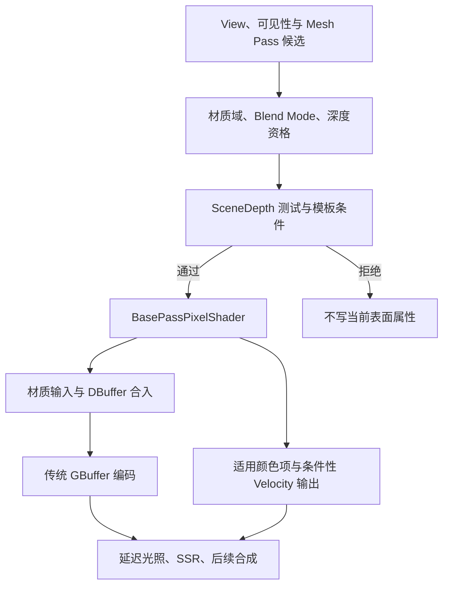
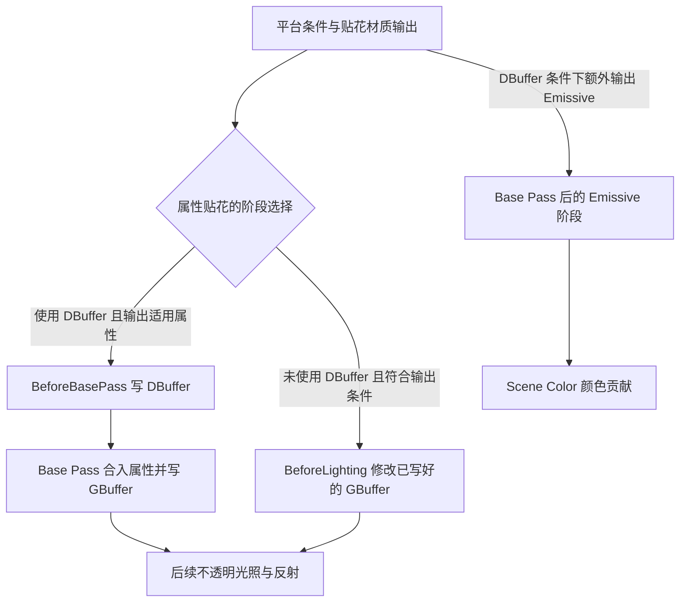

# 第 14 章：Base Pass、GBuffer 与贴花

[返回目录](../README.md) · [本章答案](../appendices/answers/14-base-pass-gbuffer-decals.md) · [一帧总览](00-frame-overview.md)

> **版本与范围：**UE 5.7.4，CL 51494982，Windows、D3D12、SM6，桌面延迟渲染配置 A。配置 A 关闭 Substrate、Nanite、Lumen、VSM 与硬件光线追踪，使用传统材质、普通网格、传统 GBuffer、DBuffer Decals、SSR 与 TAA。第 21 章再研究 Substrate；不要把本章通道布局推广到配置 B。
>
> **证据边界：**本章依据本地源码静态阅读，没有启动 UE、捕获帧或测量 GPU 时间。`[源码已确认]`是当前源码可定位的行为，`[教学简化]`是可计算示意，`[尚未验证]`表示需要在工程中运行确认。

## 14.1 学习目标与前置知识

第 13 章建立了主深度，并解释了反向 Z、Prepass 和 HZB。本章沿着 P（红方块未被薄片覆盖的位置）和 Q（蓝色透明薄片覆盖方块的位置）继续追踪：通过深度测试的表面如何进入 Base Pass，材质属性如何拆到 GBuffer，DBuffer 贴花如何在不直接改写最终颜色的情况下影响这些属性。

完成本章后应能回答：

1. Base Pass 输入、处理和输出分别是什么，为什么“写 GBuffer”不等于“已经得到最终颜色”。
2. 传统 GBuffer 的法线、颜色、金属度、粗糙度和 Shading Model ID 怎样被编码。
3. DBuffer Decal 与 Base Pass 后的 GBuffer Decal、Emissive Decal 各在什么时候工作。
4. 为什么 Q 的透明薄片不会自动成为主不透明 GBuffer 的一行数据。
5. 如何区分配置 A 传统布局与 Substrate 的材质表达和 DBuffer 语义。

需要掌握第 03～05 章的材质和资源、第 09 章的 RDG 依赖、第 13 章的深度状态。这里不要求记住每个通道的位宽，但要求能够从源码和捕获中核对自己的解释。

本章延续第 13 章的实验条件：DBuffer 开启，Masked 不强制只在早期深度阶段计算裁剪，Velocity 在 Base Pass 输出；初始关卡不放贴花，后续练习才添加。项目关闭静态光照，动态全局光照方法为 None，因此“Base Pass 可以处理间接光”是能力边界，不表示配置 A 已经启用所有间接光分支。任何一次比较都应先检查这些条件是否仍成立。

| 观察角度 | 本章要建立的判断 |
|---|---|
| 目的 | 把当前可见表面的材质属性交给后续光照 |
| 原因 | 几何与材质先求一次，再让多个延迟消费者读取 |
| 输入 | 网格、View、深度、材质、适用的 DBuffer 与光照资源 |
| 过程 | 组织命令、光栅覆盖、材质求值、贴花响应、属性编码 |
| 输出 | GBuffer、适用颜色项、条件性的深度/模板与 Velocity |
| 实现 | CPU Mesh Processor、RDG Raster Pass 与生成的 Shader 编解码 |
| 条件 | Shading Path、Blend Mode、Shading Model、布局与项目开关 |
| 成本 | 像素材质计算、MRT 带宽、贴花覆盖、额外读取与排列数量 |

P 和 Q 是帮助追踪的屏幕观察位置，并不是引擎存储的永久像素编号。移动相机后必须重新确认它们对应的几何表面。尤其在 Q，同一个屏幕坐标先经历不透明方块的深度和属性写入，之后才出现蓝色薄片的透明颜色，不能把这一串事件压缩为“Q 属于蓝片”。

## 14.2 Base Pass 先问“可见哪个表面”

Base Pass 不是把场景中所有材质都逐像素计算一遍。CPU 先依据 View、可见性、材质域、Mesh Pass 资格和深度策略组织候选。GPU 再对三角形进行投影、覆盖、深度测试，并执行通过测试的像素 Shader。

在 P，通常是红方块的不透明表面通过深度条件；Base Pass 为它求材质输入、应用适用 DBuffer 数据，并把属性写入 GBuffer。Q 的主深度可能仍由方块提供，因为蓝片是 Translucent；Q 的透明合成属于后续透明路线，不能把透明材质当作普通不透明 Base Pass 的另一层 GBuffer。

Base Pass 可能计算部分间接光、预计算光照或前向路径颜色，但在本章配置 A 的延迟主线，核心输出仍是 GBuffer 属性供后续光照读取。源码中 `BasePassPixelShader.usf` 同时存在 GBuffer 编码和颜色输出分支，需结合 Shading Path、材质域与宏判断。

### 14.2.1 深度访问和比较必须分开

第 13 章已经说明：在配置 A 的完整 Prepass、普通非调试视图下，Base Pass 采用 `DepthRead_StencilWrite`；Shader Complexity、Debug View PS、Wireframe、Light Map Density 等条件会改变这一选择。但深度只读不等于深度比较函数必定为 Equal。普通配置 A 的 `SetupBasePassState` 使用 `CF_DepthNearOrEqual`；早期 Mask 或抖动等条件才进入 `CF_Equal` 分支。DepthRead 表示访问权限，Compare Function 表示测试规则，两者不可混为一个结论。

深度通过后，像素 Shader 仍需执行法线、Base Color、Metallic、Roughness、Opacity Mask 等材质逻辑。深度只减少被拒绝的样本，不会让顶点、插值或通过样本的 GBuffer 写入凭空消失。

[打开 Base Pass 数据流静态图](../assets/diagrams/14-base-pass-gbuffer-decals-1.png)



**[教学简化]**图表示数据依赖，不保证每种 Shader 都采用同一硬件执行顺序。图中的“通过”是样本级结果，不是说一个 Draw 的全部像素同时通过。一个三角形可能只有部分覆盖通过深度，另一些样本被 Early-Z 或深度测试拒绝。`SceneDepth` 也只是其中一个条件，模板、材质裁剪和视图遮罩可能继续改变覆盖。Velocity 来自运动信息，图中没有把它归因于贴花颜色混合。

### 14.2.2 CPU 的 Mesh Pass 与 GPU 的像素工作

`FBasePassMeshProcessor::TryAddMeshBatch` 负责判断材质是否适合当前 Base Pass；它会检查材质域、透明性和受光路径，再由 `Process` 选择 Shader、状态和绘制命令。CPU 这一步决定“候选命令如何组织”，不能被解释成“CPU 计算了每个像素的 Base Color”。

GPU 执行时，顶点 Shader 产生屏幕位置和插值数据，光栅化阶段生成覆盖样本，像素 Shader 才会读取纹理、求材质输入并写 MRT。遮挡、剪裁和深度测试可能让像素 Shader 少运行一些，但不能从 Draw 数量直接推出实际像素 Shader 调用数。

同一个 Mesh Batch 还可能因为静态网格、实例、移动性、Velocity、材质排列或平行命令组织进入不同列表。捕获时应先定位具体 Mesh Pass 和材质 Shader permutation，再看它写了哪些 Render Target。

**[源码已确认]**CPU 侧还有一个不可跳过的资源步骤：`RenderBasePass` 通过 `SceneTextures.GetGBufferRenderTargets` 取得附件，配置深度/模板目标，再把不透明 Base Pass Uniform Buffer 和这些附件交给 RDG Pass 参数。Uniform Buffer 的创建包含 DBuffer 输入。随后构建绘制命令，通过 Raster Pass 调度或绘制，见 [S14-08](#s14-08)。这才把“Shader 想写一个字段”连接到“GPU 正在写哪张纹理”。

把这条链拆开读会更容易定位问题：Mesh Processor 回答这个网格是否有命令；Pass 参数回答命令获得哪些纹理和常量；Pixel Shader 回答如何求出字段；Render Target 绑定和格式回答字段最后落在哪个附件。四层中任一条件不满足，都可能出现“材质参数已修改，画面却没有变化”。不要在看到材质节点正确以后，就省略对绑定资源的检查。

### 14.2.3 配置 A 的输入清单

| 输入 | 在 Base Pass 中的作用 | P/Q 关注点 |
|---|---|---|
| View 与 SceneDepth | 投影、深度测试、屏幕坐标 | Q 的透明薄片不自动写主不透明深度 |
| Mesh 顶点/索引/实例 | 产生当前表面的覆盖和插值 | P 的方块几何决定法线和 UV |
| Material 参数与纹理 | 计算 Base Color、粗糙度、法线等 | P/Q 的不透明背景都读方块材质；薄片稍后单独处理 |
| DBuffer 纹理与 Mask | 对受影响表面修改材质输入 | P 若落在贴花投影内会被修改 |
| 光照与预计算输入 | 可能形成部分颜色或间接光项 | 最终动态光照仍在后续阶段读取 GBuffer |

## 14.3 传统 GBuffer：把表面属性拆开存

### 14.3.1 为什么不用一张“材质颜色图”

延迟渲染把几何覆盖与材质属性先存下来，之后用屏幕空间光照逐像素读取。这样一个光源可以遍历已经写好的 GBuffer，而不必对每种材质重新投影完整网格。代价是显存带宽、MRT 写入和属性编码复杂度。

**GBuffer**是一组纹理的语义集合，不是固定只有三张图，也不是每张纹理永远对应同一通道。速度、预计算阴影因子、切线和可选字段会改变布局。配置 A 的传统布局可从当前平台绑定与 Shader 编码共同确认。

### 14.3.2 本版传统编码的入门视图

在普通桌面布局、非 Unlit 的简化说明中，可以先用下表建立索引。实际布局还受 GBuffer 格式、速度和切线配置影响，因此下表是教学入口，不是对所有平台的 ABI 保证。

| 目标 | 传统编码中常见承载 | 典型语义 |
|---|---|---|
| GBuffer A | RGBA | World Normal 与 Per-Object GBuffer Data |
| GBuffer B | RGBA | Metallic、Specular、Roughness、Shading Model ID/Mask |
| GBuffer C | RGB/Alpha | Base Color，以及 AO 或其他布局字段 |
| GBuffer D/E | 可选 | Shading Model Custom Data、预计算阴影因子等 |
| Velocity | 独立或按配置插入 | 当前与上一帧的屏幕运动信息 |

**[源码已确认]**当前 Base Pass 生效的调用是 `EncodeGBufferToMRT`：`GBufferInfo.cpp` 定义字段与目标布局，`ShaderGenerationUtil.cpp` 根据 `FGBufferInfo` 生成对应编码函数，Shader 再调用它写 MRT。文件里保留的旧 `EncodeGBuffer` 调用位于该处 `#if 1` 的 `#else` 分支，不能把旧辅助函数当成本版实际执行入口。传统布局将法线放到 A 的 RGB，Metallic、Specular、Roughness 分别放到 B 的 R/G/B，Base Color 放到 C 的 RGB。见 [S14-02](#s14-02)、[S14-03](#s14-03)。

法线通常需要归一化和范围映射，Base Color 还可能利用 sRGB Render Target 给暗部提供更多精度。读取时必须使用对应 Decode 函数；把 GBuffer A 的 RGB 当作未编码世界坐标，或把 Base Color 通道直接当作最终显示 RGB，都会得出错误结论。

在当前传统布局定义中，默认法线目标为 10/10/10/2；强制 8 bit 或提高法线精度会选择不同格式。B/C 默认采用四通道 8 bit，高精度条件又可能改变它们。因此 A 的“RGBA”只说明逻辑通道，不保证每个通道都有 8 bit。C 在适用格式下带 sRGB 标志，而 Metallic 和 Roughness 属于数值属性，不能任意套用颜色的传递函数。Alpha 还可能承载控制位或遮蔽信息，名称中有 Alpha 不代表它就是表面透明度。

以法线为例，Shader 可以先把有符号方向映射到非负范围，目标格式再把浮点数压到有限的可表示值。读取后即使做逆映射，也无法完全恢复被量化舍弃的小数。提高精度可以减轻某些误差，但会增加存储或带宽成本；它不会修复错误的法线贴图空间、UV 或材质计算。比较格式时应让相机、灯光和材质保持一致，先确认伪影确实来自量化。

### 14.3.3 Shading Model ID 是控制字段

Shading Model ID 让后续光照知道这一像素应采用 Default Lit、Subsurface、Clear Coat 等哪类分支。它不是材质资产名称，也不是物体 ID。若把 B 的 Alpha 当普通透明度，会把控制字段误读成颜色输入。

Unlit 也有专门处理：当前生成编码调用后存在 `SHADINGMODELID_UNLIT` 条件，对输出进行清空和控制字段设置。观察到某通道为 0，必须先确认 Shading Model 和布局，不能立即断言材质没有数据。它也不意味着存在一套适用于普通透明薄片的完整不透明 GBuffer。

传统定义会把 Shading Model ID 与 Selective Output Mask 分别打包在控制字节的低四位和高四位。读取时需要先按约定还原整数位域，再解释模型和可选输出；把这一通道用线性插值缩放后当连续数值，可能破坏控制信息。它回答的是“这一像素按什么规则解释”，而不是“该像素有百分之多少属于某个模型”。

### 14.3.4 P 的一组教学编码

**[教学简化]**假设 P 的传统 GBuffer 使用 8 bit RGBA 目标，并忽略量化误差、AO 和额外字段：

```text
WorldNormal = (0, 0, 1)  -> EncodeNormal = (0.5, 0.5, 1.0)
BaseColor   = (1, 0, 0)  -> 线性输入经目标格式编码后存入 C 的 RGB
Metallic    = 0.0        -> B.R
Roughness   = 0.4        -> B.B
```

这不是本场景捕获值。真实红方块法线、材质参数和格式由资产与运行设置决定。预曝光作用于适用的颜色输出，不会把法线、Roughness 或 Base Color 属性整体乘上曝光倍率。这个例子只帮助你理解“属性先编码，再由光照 Shader 解码”。

### 14.3.5 从 GBuffer 读取时还要带上坐标和布局

后续光照通常按纹理 UV 或整数像素坐标读取 GBuffer。`DeferredShadingCommon.ush` 明确要求整数入口的坐标相对于整个 Render Target，UV 入口也使用 GBuffer 纹理空间，而非任意视口局部空间。调用方必须完成适用的坐标换算。若在半分辨率、动态分辨率或多视图条件下直接把输出窗口坐标当纹理坐标，可能取到错误的表面。

解码还需要知道当前 GBuffer Layout。读取入口在 `GBUFFER_REFACTOR` 条件下走生成的解码函数，保留的旧读取分支也不能不看宏就当成唯一实现。速度、切线、预计算阴影因子等可选字段必须与编码端匹配；同一通道在不同格式设置下可能是 8 bit、10 bit 或 16 bit。调试工具中看到的“GBuffer B.R=0.4”只有在确认通道和解码规则后才有意义。

P 的法线可以被光照作为 N，粗糙度作为微表面分布输入，Base Color 经金属度分解得到漫反射和 F0。Q 的透明阶段若读取 Scene Color 或 Scene Depth，应遵守透明 Pass 的采样和排序规则；它并不会从一个不存在的“薄片 GBuffer”中取得最终蓝色。

## 14.4 BasePassPixelShader 的处理顺序

### 14.4.1 从材质输入到 GBuffer 结构

**[源码已确认]** `BasePassPixelShader.usf` 在传统分支读取 `GetMaterialBaseColor`、`GetMaterialMetallic`、`GetMaterialRoughness` 等输入；随后根据材质模型设置 GBuffer，并计算 `DiffuseColor`、`SpecularColor` 等供后续路径使用，见 [S14-01](#s14-01)。

在配置 A，P 的红色 Base Color 不是“已经渲染好的红色最终像素”。它参与漫反射、镜面反射、间接光和曝光链。若只查看 GBuffer C，看到的是材质属性编码，不是经过光源和色调映射的颜色。

### 14.4.2 DBuffer 如何被 Base Pass 消费

DBuffer Decal 在 Base Pass 前把贴花数据写入 DBuffer A/B/C。Base Pass 读取屏幕位置对应的 Mask，再调用 `GetDBufferData` 和 `ApplyDBufferData`，把允许的 Base Color、Normal、Roughness、Metallic 等修改合入当前材质输入。没有贴花时，DBuffer 的默认值表示“不改变原材质”。

**[源码已确认]**这里的外层条件包含 `USE_DBUFFER && !MATERIALBLENDING_ANY_TRANSLUCENT && !MATERIAL_SHADINGMODEL_SINGLELAYERWATER`。在普通接收路径中还检查 Primitive 是否接收贴花、视图是否显示贴花，并把屏幕位置的 DBuffer Target Mask 与 `MATERIALDECALRESPONSEMASK` 相交；有效时调用传统 `GetDBufferData` 和 `ApplyDBufferData`。这说明“贴花影响属性”发生在材质写入 GBuffer 之前，而不是把一张颜色图直接覆盖到最终 Scene Color。见 [S14-01](#s14-01)、[S14-04](#s14-04)。

若 P 落在贴花投影范围且响应允许，Base Color 或 Normal 可能变化，后续光照自然产生不同结果。Q 的背景方块也可以收到同一贴花；本场景蓝片为 Translucent，明确不进入上述自动 DBuffer 应用分支。蓝片后来遮在前面，不会追溯地把背景的 GBuffer 改成薄片材质。

这里有三个不同的开关层级。贴花材质的输出连接决定它提供什么；接收方 Surface 材质的 `Decal Response (DBuffer)` 决定接收哪类属性；Primitive 的 `Receives Decals` 决定组件是否接收。只在贴花材质接上 Normal，并不能强制所有接收方改变法线。反过来，接收方允许 Normal，而贴花没有写相应数据，也不会凭空出现法线变化。Roughness、Metallic、Specular 在传统 DBuffer 应用中属于同一属性组，分析响应时不要把它们误认为三张独立贴花纹理。

### 14.4.3 Base Pass 输出不止“几张纹理”

在传统延迟主线，Base Pass 常见输出包括 GBuffer MRT、适用的 Scene Color 颜色项、条件性的 Scene Depth 深度/模板写入和 Velocity。传统延迟 Base Pass 本身就能把自发光及启用时的间接光等贡献写入 MRT0，并非只有前向或特殊材质才写颜色。源码中材质自发光进入颜色累积，GBuffer 编码则提供另一类输出；不能将两者合并成“所有光照已经完成”。透明、前向、延迟和 Substrate 分支的附件解释仍需分别核对。

配置 A 关闭静态光照和动态 GI，阅读预计算间接光、天空光等代码时仍须检查各自条件。代码中存在一个光照函数，只能证明引擎支持这一路径。P 在 Base Pass 后的 Scene Color 与 GBuffer C 可以不同：前者是当时已经累积的适用颜色贡献，后者是供后续计算的材质 Base Color。蓝片的强自发光则在后续透明路线贡献，不能提前放到 Q 的不透明 Base Pass 结果中。

在写颜色时还会处理预曝光。这个缩放帮助颜色缓冲工作在合适的数值范围，后续曝光与色调映射再把场景颜色转为显示结果。判断数值是否预曝光，必须明确读的是颜色附件还是属性附件；如果给法线或 Roughness 也除以 `PreExposure`，反而会人为制造错误。本文对 P 的法线编码例子不包含曝光步骤，原因就在这里。

因此排查时要先记下 Shading Path、Blend Mode、GBuffer Layout、是否有 Velocity，以及当前 Pass 的 Render Targets。只看到资源名含 `GBuffer`，不能断言它拥有完整的法线、粗糙度和 Base Color。

### 14.4.4 输出目标的加载、清除和写入掩码

Base Pass 创建或取得 Render Targets 时，还要决定每个目标的 Load/Store 行为、是否清除、是否允许独立颜色写入。DBuffer 的有效通道 Mask、Unlit 的特殊编码以及硬件颜色写入掩码属于不同层面，需要分别核对。一个目标在 Shader 中被赋值，并不保证它最终写入了附件：Blend State、Render Target Write Mask 和 Pass 参数仍会参与。

例如深度预通道关闭颜色写入，Shader 中的 `OutColor=0` 也不会把 Scene Color 涂黑；类似地，GBuffer 的某个 MRT 为 0 可能是 Unlit 或布局不提供该字段。观察结果要同时记录 Shader 输出结构和硬件 Render Pass 状态。

## 14.5 贴花的三条时间线

### 14.5.1 DBuffer Decal：Base Pass 前修改输入

传统 DBuffer Decal 的目标是 DBuffer A/B/C（平台还可能有 Mask）。它通常在 Base Pass 前绘制，需要已经存在的深度来限制投影到表面。Base Pass 随后读取 DBuffer，把贴花参数混合到表面属性，再编码到 GBuffer。

**[源码已确认]** `ProcessBeforeBasePass` 检查 DBuffer 条件并调用 `AddDeferredDecalPass`；`PostProcessDeferredDecals.cpp` 明确断言 Base Pass 前只能使用 DBuffer 贴花。见 [S14-05](#s14-05)。

### 14.5.2 GBuffer Decal：Base Pass 后修改属性

Base Pass 已经写好 GBuffer 后，BeforeLighting 阶段可以对 GBuffer 目标做贴花修改。此时贴花读取已有表面属性或深度，直接改变后续光照将读取的结果。它不会重新执行原材质的完整 Pixel Shader，也不能恢复已经被深度拒绝的表面。

**[源码已确认]**这不是普通贴花组件上可任意选择的时间按钮。`FinalizeBlendDesc` 根据平台是否使用 DBuffer 和材质输出等条件确定阶段：有适用属性输出且平台使用 DBuffer 时选择 BeforeBasePass；否则符合条件的属性输出选择 BeforeLighting。当前配置 A 已启用 DBuffer，常规属性贴花走前一条路线，不能假设把同一材质的某个“Render Stage”选项改一下就会进入后一条。见 [S14-09](#s14-09)。

### 14.5.3 Emissive Decal：颜色贡献的不同位置

发光贴花不一定适合修改 Base Color 或 Normal。在使用 DBuffer 的条件下，如果材质还输出 Emissive，阶段描述会另外加入 Emissive 阶段；这个阶段的目标模式为 Scene Color。同一个贴花因而可能提供 Base Pass 前的属性修改，再提供 Base Pass 后的发光颜色贡献。它影响颜色贡献，不等于把 GBuffer Base Color 改成自发光颜色。

### 14.5.4 贴花阶段图

[打开贴花阶段静态图](../assets/diagrams/14-base-pass-gbuffer-decals-2.png)



**[教学简化]**图显示条件分支，不表示每个贴花都连续执行两次属性修改。BeforeLighting 分支所需的 GBuffer 仍由该配置下的 Base Pass 先产生，图中省略了这条常规场景输入。图还省略 AO、Substrate 特殊阶段、透明和后处理分支；实际是否添加节点由贴花可见性、材质输出、接收响应和项目功能决定。

### 14.5.5 贴花投影不是屏幕颜色贴图

Deferred Decal 的几何通常是一个投影体。`DeferredDecal.usf` 从 `SvPosition` 读取当前深度，把它变换到 decal local space，再用 `clip` 丢弃投影体外的像素；通过的样本求贴花材质参数和 Coverage。这个过程解释了为什么同一贴花不会无条件覆盖整张屏幕，也解释了为什么 P 与 Q 是否命中需要看深度和投影范围。

DBuffer 的三个目标具有不同的默认值和编码：A 承载颜色与相应的剩余权重，B 承载编码法线及权重，C 承载 Metallic、Specular、Roughness 及该组权重。传统解码结构使用 `PreMulColor`、`ColorOpacity` 等名称；其中 `ColorOpacity` 的 1 表示保留接收材质，0 表示该项完全被贴花覆盖。它不是把 Scene Color 直接做透明合成的最终系数。

接收方材质的 Decal Response Mask 还可以拒绝某一类属性。例如接收方只响应 Base Color 时，不应通过这条自动应用路径改变法线；只看 DBuffer A 的可视化不能宣布 Roughness 也发生变化。P 的实验应分别改变响应通道，比较 GBuffer 解码值和最终光照，而不是只比较一张最终截图。

### 14.5.6 两层贴花如何留下原材质的权重

**[教学简化]**只讨论常规 Translucent 混合的 DBuffer 颜色组。令接收方原始线性 Base Color 为 `C0`，DBuffer 累积的预乘颜色为 `D`，接收方剩余权重为 `T`。初始没有贴花时，`D=(0,0,0)`、`T=1`。新贴花颜色 `C`、透明度 `a` 到来时，RGB 的混合与 Alpha 的混合分别对应：

```text
D_new = C * a + D_old * (1-a)
T_new = T_old * (1-a)
BaseColor_after = C0 * T + D
```

这里的 `a` 是当前这一层的覆盖程度，`T` 是所有已经累积的层为原始接收材质留下的权重。它们含义相反，不能把采样得到的 DBuffer Alpha 再直接当成新贴花的 Opacity。该示意对应本章传统混合状态；AlphaComposite 等模式使用不同源因子，需要单独读混合状态，不能套用同一组推导。

设 P 的原材质为红色，先画四分之一覆盖的绿色贴花，再画一半覆盖的蓝色贴花：

```text
C0 = (1,0,0)
第一层：C1=(0,1,0)，a1=0.25
    D1 = (0,0.25,0)，T1=0.75
第二层：C2=(0,0,1)，a2=0.50
    D2 = (0,0.125,0.50)，T2=0.375
BaseColor_after = (1,0,0)*0.375 + (0,0.125,0.50)
                = (0.375,0.125,0.50)
```

结果仍含原材质的红色，因为两个贴花都没有完全覆盖。这里全部使用线性颜色，忽略 sRGB 存储、量化、衰减与材质额外逻辑，算出的也只是送入后续处理的 Base Color，不是灯光照射后的显示色。把两层顺序交换，颜色通常会不同，因为后画的一层会衰减前一层已经累积的贡献。

法线不能照抄颜色例子。传统 `ApplyDBufferData` 会把剩余原法线与贴花法线项相加，再进行归一化；直接把两个方向混合后当作单位法线，会改变后续点积含义。Roughness、Metallic 和 Specular 则在共同的响应组内各自按剩余权重混合。这个差异解释了为什么“一张有透明度的贴图”不足以描述整个 DBuffer 过程。

### 14.5.7 排序、投影范围与对象边界

**[源码已确认]**普通贴花列表的排序先比较 `SortOrder`，之后还会按法线写入、混合描述、材质等条件组织。相同 `SortOrder` 不应当作稳定的作者层级顺序。需要明确的覆盖关系时，应让排序意图可检查；大量不同排序值又可能限制按状态聚合的机会。见 [S14-10](#s14-10)。

投影体的屏幕覆盖面积会影响需要处理多少片元。一个很大的投影盒即使纹理大半透明，仍可能让大量屏幕样本进入投影、深度重建和材质判断；透明区域不等于无需工作。反过来，小贴花数量多，也可能增加绘制、状态和排序成本。因此“只减少贴花数量”不是唯一有效观察，投影尺寸、重叠层数和 Shader 复杂度都需要同时记录。

还要区分贴花组件的体积投影与 Mesh Decal 等几何入口。本节重建深度并裁剪投影体的说明针对常规 Deferred Decal 投影路径，不能无条件推广到所有以贴花材质渲染的几何。P 若靠近方块边缘，投影可能同时落到地面；是否出现这种覆盖要用深度和投影空间检查，不能仅凭贴花 Actor 与方块距离接近来判断接收关系。

## 14.6 P 与 Q 的统一观察表

| 观察位置 | 主深度 | 传统 GBuffer | DBuffer 贴花 | 后续颜色 |
|---|---|---|---|---|
| P：方块未被薄片覆盖 | 红方块不透明表面 | 保存方块属性，可能已合入贴花 | 贴花投影命中时修改输入 | 后续光照、SSR、曝光形成颜色 |
| Q：薄片覆盖方块 | 通常仍是方块主深度 | 先保存方块背景属性 | 背景方块可接收；蓝片不进入常规自动应用分支 | 透明阶段把薄片颜色与背景合成 |

Q 的 GBuffer 不是“蓝色薄片的 GBuffer”。普通 Translucent 材质通常不写延迟不透明 GBuffer，因为它需要按透明排序和混合规则使用背景。薄片的 Tint、EmissiveStrength 和 Opacity 是透明材质输入，不应从 GBuffer C 倒推。

如果把薄片改成 Masked，深度与 Base Pass 资格可能改变；改变的是 Blend Mode，Material Domain 可以仍为 Surface。通过 Opacity Mask 的样本按遮罩后的不透明覆盖处理，被裁掉的样本不产生这一表面。薄片原先的 Shading Model 是 Unlit，改 Blend Mode 不会自动变成 Default Lit，仍须检查其特殊输出。调试时分别记录这三个材质属性、是否写 Custom Depth 和所在 View。

## 14.7 配置 A 与 Substrate：相同名词，不同边界

配置 A 关闭 Substrate，传统 GBuffer 字段与当前生成的 `EncodeGBufferToMRT` 是本章主线。配置 B 或第 21 章开启 Substrate 后，材质可能以更丰富的层和 BSDF 表达进入专用编码与解码路径，GBuffer Format、DBuffer 应用阶段和可用 Decal Stage 都可能变化。

**[源码已确认]** `BasePassPixelShader.usf` 在文件开头包含 Substrate 与 DBuffer 相关条件，后续又有传统 GBuffer 输出及特定条件下的 Substrate Material Export 等代码。旧 `EncodeGBuffer` 保留在不生效的替代分支，不是区分两套体系的现行入口。应沿当前宏条件、生成布局和目标绑定核对，不能因为同一文件名就把所有输出解释成同一个 MRT 布局。

DBuffer 也不是“Substrate 永远禁止”。源码注释说明 Substrate DBuffer Pass 可能在不同阶段处理，`ProcessBeforeBasePass` 会根据 `Substrate::IsDBufferPassEnabled` 改变调用条件。第 21 章将以实际配置 B 的项目格式和材质响应重新核对，不在本章 A 线提前下结论。

## 14.8 成本、带宽与错误解释

GBuffer 增加 MRT 写入、格式转换、带宽和后续读取成本。多一张高精度目标不只是多一个 Shader 变量；它可能影响 Render Target 创建、带宽、缓存和光照采样。DBuffer 还要写入专用目标，并让 Base Pass 读取与混合。

**[教学简化]**假设 1920×1080、4 个 RGBA8 GBuffer 目标，不计压缩、对齐和其他目标：

```text
像素数 = 1920 × 1080 = 2,073,600
每像素字节 = 4 × 4 = 16
单次 MRT 写入量 ≈ 2,073,600 × 16 = 33,177,600 B ≈ 31.64 MiB
```

这是一次全屏理想写入量，不是 Base Pass 的实际显存流量。真实场景有深度、Velocity、DBuffer、压缩、读改写、过度绘制和多个视图；也不能从该数值推出 GPU 毫秒。

常见错误包括：把 GBuffer Base Color 当最终显示色；把 DBuffer 当颜色叠加层；把 GBuffer Decal 当 DBuffer；把透明 Q 当不透明 GBuffer；把 A 配置通道解释套到 Substrate；把 `Out.MRT[0]` 在所有材质域中当同一资源。

### 14.8.1 一个属性变化的因果链

**[教学简化]**假设贴花只改变 P 的 Roughness，从 `0.4` 覆盖到 `0.8`，不改变 Base Color、Normal 和 Metallic。可按以下链条核对：

```text
贴花投影命中 P
 -> DBuffer C 写入 Roughness 与 Coverage
 -> Base Pass 读取 C 并按 Coverage 合入材质 Roughness
 -> GBuffer B 写入新的 Roughness
 -> 光照按新的微表面分布计算高光宽度
 -> SSR/反射和曝光继续影响最终显示
```

如果最终高光没有变化，可能是贴花未命中、Response Mask 禁止 Roughness、DBuffer 未生成、GBuffer 读取的并非该 P，或后续光照路径覆盖了观察。不能只看贴花 Draw 已提交就断定属性一定改变。

### 14.8.2 为什么 GBuffer 可视化仍需谨慎

可视化工具可能对法线做 `*0.5+0.5`、对深度做线性化、对粗糙度做灰度映射，也可能在显示前经过曝光或色域转换。工具中一块“红色”可能是法线可视化的颜色，而不是 Base Color。

应记录所选可视化模式、采样的 SceneTexture、是否使用当前 View 的 SceneTextureScale 和是否显示预曝光值。P/Q 对照的价值在于同一工具、同一帧、同一坐标语义下比较变化，而不是把屏幕截图的 RGB 当作原始 MRT 字节。

## 14.9 动手观察与排查

**[尚未验证]**在独立练习关卡副本中保留配置 A，先不放贴花，再复制一个普通贴花材质，单独调整 Base Color、Normal 和 Roughness 响应。记录窗口、分辨率、曝光、Blend Mode、DBuffer 设置、GBuffer Format 和 Velocity 输出位置。

推荐按以下顺序核对：

1. 在 P 查看 Scene Depth 和 GBuffer A/B/C，确认它们代表不透明方块而非最终颜色。
2. 在 P 的投影范围放置 DBuffer Decal，比较贴花前后 Base Color、Normal、Roughness 和光照结果。
3. 在 Q 观察薄片的透明合成，确认主深度和 GBuffer 仍对应背景不透明表面。
4. 源码对照 `FinalizeBlendDesc` 的 DBuffer 开关分支，追踪 BeforeLighting 的目标模式。若另建关闭 DBuffer 的工程配置进行比较，应重启并完成相应 Shader 编译后记录新条件；它已经不是当前 A 的原样捕获。
5. 使用 GPU 捕获确认 Render Targets、材质域、GBuffer Layout 和 Shader Permutation；未捕获时不要根据资源名字猜测通道。

### 14.9.1 源码断点路线

可按 `FDeferredShadingSceneRenderer::RenderBasePass`、`FBasePassMeshProcessor::Process`、`BasePassPixelShader.usf` 的材质输入与 `EncodeGBufferToMRT`、`ProcessBeforeBasePass`、`AddDeferredDecalPass` 依次阅读。编码函数的定义要继续到 `ShaderGenerationUtil.cpp` 与 `GBufferInfo.cpp` 查生成来源。断点和捕获会改变时序，不能把调试下的 Draw 数或缓存命中当性能结论。

### 14.9.2 一份可复查的观察记录

先给 P/Q 标出当前 View 内位置，再记录它们在附件中的实际像素坐标。对每个位置分别保留主深度、解码后的 GBuffer 属性、Base Pass 结束时的 Scene Color 和透明合成后的颜色。这样才能辨认“属性已经改变，但光照效果不明显”与“贴花根本没有进入接收路径”。最终截图只能提供最后一层证据。

检查 DBuffer 时，先确认绘制阶段有该贴花命令，再确认投影覆盖当前深度，随后确认对应目标数据与接收方响应。最后沿 Base Pass 的读取和 GBuffer 输出查看。若开始就检查最终颜色，曝光、高光角度、透明覆盖和后处理会把多个原因混在一起。尤其 Q 的蓝片自发光很强，背景属性变化即使存在，也可能在最终显示上不容易辨认。

材质只改 Roughness 的练习应选择能看到高光变化的位置，并保持光源和相机不动。若 GBuffer B 中 Roughness 确已改变，高光差异很小也可能是该角度对变化不敏感，不应立刻把原因归到贴花失效。对 Normal 的练习同样要先看解码方向，再看光照，避免把法线可视化的颜色误认成贴花 Base Color。

**[尚未验证]**本章没有生成上述运行记录，也没有取得编译后的具体材质 Shader 或捕获附件。源码证据给出的是可追踪的条件和函数，运行验证需要填写实际工程设置、贴花材质输出、附件格式与采样值。若看到与本章不同的格式或阶段，先核对配置和 Shader permutation，再判断是否属于版本或平台差异。

## 14.10 本章回顾

Base Pass 把通过可见性和深度条件的表面属性写成后续阶段可读取的数据。传统 GBuffer 以多张目标编码法线、颜色、金属度、粗糙度、Shading Model 和可选字段；解码方必须知道布局和格式。DBuffer 在 Base Pass 前保存贴花参数，由 Base Pass 合入材质输入；GBuffer Decal 和 Emissive Decal 则位于后续阶段。

P 通常能在 GBuffer 中观察方块属性，Q 的 GBuffer 仍首先描述不透明背景，透明薄片在后续合成。配置 A 的传统布局与 Substrate 的层化表达必须分开验证。

## 14.11 理解检查

1. 为什么 Base Pass 写入 GBuffer 后还不能说 P 已得到最终显示颜色？至少列出两个后续消费者或变换。
2. 在教学传统布局中，GBuffer A 记录法线，B 记录 Metallic/Specular/Roughness，C 记录 Base Color。若 P 的法线为 `(0,0,1)`、Metallic `0.0`、Roughness `0.4`，写入前分别会怎样编码？指出哪些数值只是教学假设。
3. DBuffer Decal、GBuffer Decal、Emissive Decal 的阶段和主要影响分别是什么？为什么 DBuffer 能影响 Base Pass 读取的材质输入？
4. 在 1920×1080、4 个 RGBA8 MRT 的简化模型中，单次完整写入约多少 MiB？为什么这不是 GPU 时间，也不是实际显存流量？
5. P 与 Q 都落在同一贴花投影范围内。为什么 P 的 GBuffer 可能改变，而 Q 的主 GBuffer 仍描述方块背景？将薄片改成 Masked 后需要重新检查哪些条件？

答案见[本章答案](../appendices/answers/14-base-pass-gbuffer-decals.md)。

## 14.12 源码证据索引

<a id="s14-01"></a>
**S14-01：Base Pass 像素处理。** [BasePassPixelShader.usf:994](G:/UnrealEngineInstalled/UE_5.7/Engine/Shaders/Private/BasePassPixelShader.usf:994)读取材质输入；[1089](G:/UnrealEngineInstalled/UE_5.7/Engine/Shaders/Private/BasePassPixelShader.usf:1089)排除透明与 Single Layer Water；[1096](G:/UnrealEngineInstalled/UE_5.7/Engine/Shaders/Private/BasePassPixelShader.usf:1096)检查接收与显示条件；[1112](G:/UnrealEngineInstalled/UE_5.7/Engine/Shaders/Private/BasePassPixelShader.usf:1112)读取并应用传统 DBuffer；[1138](G:/UnrealEngineInstalled/UE_5.7/Engine/Shaders/Private/BasePassPixelShader.usf:1138)设置 Shading Model；[1630](G:/UnrealEngineInstalled/UE_5.7/Engine/Shaders/Private/BasePassPixelShader.usf:1630)累加适用自发光；[2289](G:/UnrealEngineInstalled/UE_5.7/Engine/Shaders/Private/BasePassPixelShader.usf:2289)写 MRT0；[2428](G:/UnrealEngineInstalled/UE_5.7/Engine/Shaders/Private/BasePassPixelShader.usf:2428)处理适用颜色的预曝光。

<a id="s14-02"></a>
**S14-02：现行生成编码与解码入口。** [BasePassPixelShader.usf:2307](G:/UnrealEngineInstalled/UE_5.7/Engine/Shaders/Private/BasePassPixelShader.usf:2307)的 `#if 1` 选择 [2319](G:/UnrealEngineInstalled/UE_5.7/Engine/Shaders/Private/BasePassPixelShader.usf:2319)的 `EncodeGBufferToMRT`；[ShaderGenerationUtil.cpp:769](G:/UnrealEngineInstalled/UE_5.7/Engine/Source/Runtime/Engine/Private/ShaderCompiler/ShaderGenerationUtil.cpp:769)生成对应函数。[DeferredShadingCommon.ush:128](G:/UnrealEngineInstalled/UE_5.7/Engine/Shaders/Private/DeferredShadingCommon.ush:128)给出法线编码；[1123](G:/UnrealEngineInstalled/UE_5.7/Engine/Shaders/Private/DeferredShadingCommon.ush:1123)与 [1172](G:/UnrealEngineInstalled/UE_5.7/Engine/Shaders/Private/DeferredShadingCommon.ush:1172)说明读取坐标与生成解码分支。

<a id="s14-03"></a>
**S14-03：绑定与格式。** [GBufferInfo.cpp:344](G:/UnrealEngineInstalled/UE_5.7/Engine/Source/Runtime/RenderCore/Private/GBufferInfo.cpp:344)定义默认法线格式与覆盖条件；[362](G:/UnrealEngineInstalled/UE_5.7/Engine/Source/Runtime/RenderCore/Private/GBufferInfo.cpp:362)设置 Lighting 和 GBuffer 目标；[424](G:/UnrealEngineInstalled/UE_5.7/Engine/Source/Runtime/RenderCore/Private/GBufferInfo.cpp:424)起建立法线和属性绑定；[452](G:/UnrealEngineInstalled/UE_5.7/Engine/Source/Runtime/RenderCore/Private/GBufferInfo.cpp:452)打包模型 ID 与 Mask；[SceneTextures.cpp:708](G:/UnrealEngineInstalled/UE_5.7/Engine/Source/Runtime/Renderer/Private/SceneTextures.cpp:708)起按绑定创建纹理。

<a id="s14-04"></a>
**S14-04：传统 DBuffer 读取和应用。** [DBufferDecalShared.ush:51](G:/UnrealEngineInstalled/UE_5.7/Engine/Shaders/Private/DBufferDecalShared.ush:51)取得目标 Mask；[362](G:/UnrealEngineInstalled/UE_5.7/Engine/Shaders/Private/DBufferDecalShared.ush:362)定义传统结构及剩余权重语义；[427](G:/UnrealEngineInstalled/UE_5.7/Engine/Shaders/Private/DBufferDecalShared.ush:427)读取传统 A/B/C；[494](G:/UnrealEngineInstalled/UE_5.7/Engine/Shaders/Private/DBufferDecalShared.ush:494)应用预乘颜色、法线与数值属性。[DBufferTextures.cpp:35](G:/UnrealEngineInstalled/UE_5.7/Engine/Source/Runtime/Renderer/Private/DBufferTextures.cpp:35)定义格式和清除值。该 Shader 文件更早的同名读取属于 Substrate 分支，不能混为配置 A 的实现。

<a id="s14-05"></a>
**S14-05：贴花阶段约束。** [CompositionLighting.cpp:541](G:/UnrealEngineInstalled/UE_5.7/Engine/Source/Runtime/Renderer/Private/CompositionLighting/CompositionLighting.cpp:541)处理 Base Pass 前阶段；[575](G:/UnrealEngineInstalled/UE_5.7/Engine/Source/Runtime/Renderer/Private/CompositionLighting/CompositionLighting.cpp:575)添加 DBuffer Decal Pass；[594](G:/UnrealEngineInstalled/UE_5.7/Engine/Source/Runtime/Renderer/Private/CompositionLighting/CompositionLighting.cpp:594)处理 Base Pass 后阶段；[PostProcessDeferredDecals.cpp:670](G:/UnrealEngineInstalled/UE_5.7/Engine/Source/Runtime/Renderer/Private/CompositionLighting/PostProcessDeferredDecals.cpp:670)断言 Base Pass 前只支持 DBuffer。

<a id="s14-06"></a>
**S14-06：传统与 Substrate 条件。** [BasePassPixelShader.usf:61](G:/UnrealEngineInstalled/UE_5.7/Engine/Shaders/Private/BasePassPixelShader.usf:61)与 67 附近定义相关条件；[2363](G:/UnrealEngineInstalled/UE_5.7/Engine/Shaders/Private/BasePassPixelShader.usf:2363)是前述 `#else` 内保留的旧 `EncodeGBuffer` 调用；[2506](G:/UnrealEngineInstalled/UE_5.7/Engine/Shaders/Private/BasePassPixelShader.usf:2506)为特定条件下的 Substrate Material Export。贴花阶段条件见 [PostProcessDeferredDecals.cpp:101](G:/UnrealEngineInstalled/UE_5.7/Engine/Source/Runtime/Renderer/Private/CompositionLighting/PostProcessDeferredDecals.cpp:101)。

<a id="s14-07"></a>
**S14-07：Base Pass 深度状态。** [DeferredShadingRenderer.cpp:2027](G:/UnrealEngineInstalled/UE_5.7/Engine/Source/Runtime/Renderer/Private/DeferredShadingRenderer.cpp:2027)起按完整早期深度和调试视图条件选择 Base Pass 深度只读或可写；[BasePassRendering.cpp:499](G:/UnrealEngineInstalled/UE_5.7/Engine/Source/Runtime/Renderer/Private/BasePassRendering.cpp:499)的 `SetDepthStencilStateForBasePass` 选择 Equal 或 GreaterEqual；[534](G:/UnrealEngineInstalled/UE_5.7/Engine/Source/Runtime/Renderer/Private/BasePassRendering.cpp:534)的 `SetupBasePassState` 设置 NearOrEqual 与访问权限。需结合第 13 章解释。

<a id="s14-08"></a>
**S14-08：CPU 资格与 RDG 绘制。** [BasePassRendering.cpp:2213](G:/UnrealEngineInstalled/UE_5.7/Engine/Source/Runtime/Renderer/Private/BasePassRendering.cpp:2213)检查材质与主 Pass 资格；[1908](G:/UnrealEngineInstalled/UE_5.7/Engine/Source/Runtime/Renderer/Private/BasePassRendering.cpp:1908)进入 Mesh Processor 的 `Process`；[1150](G:/UnrealEngineInstalled/UE_5.7/Engine/Source/Runtime/Renderer/Private/BasePassRendering.cpp:1150)取得目标；[1611](G:/UnrealEngineInstalled/UE_5.7/Engine/Source/Runtime/Renderer/Private/BasePassRendering.cpp:1611)创建含 DBuffer 的不透明 Uniform Buffer；[1621](G:/UnrealEngineInstalled/UE_5.7/Engine/Source/Runtime/Renderer/Private/BasePassRendering.cpp:1621)与 [1702](G:/UnrealEngineInstalled/UE_5.7/Engine/Source/Runtime/Renderer/Private/BasePassRendering.cpp:1702)添加 Raster 绘制路径。

<a id="s14-09"></a>
**S14-09：贴花阶段、目标和混合。** [DecalRenderingCommon.cpp:25](G:/UnrealEngineInstalled/UE_5.7/Engine/Source/Runtime/Renderer/Private/DecalRenderingCommon.cpp:25)的 `FinalizeBlendDesc` 在 [76](G:/UnrealEngineInstalled/UE_5.7/Engine/Source/Runtime/Renderer/Private/DecalRenderingCommon.cpp:76)选择属性阶段，并在 [86](G:/UnrealEngineInstalled/UE_5.7/Engine/Source/Runtime/Renderer/Private/DecalRenderingCommon.cpp:86)加入适用 Emissive 阶段；[258](G:/UnrealEngineInstalled/UE_5.7/Engine/Source/Runtime/Renderer/Private/DecalRenderingCommon.cpp:258)选择目标模式；[340](G:/UnrealEngineInstalled/UE_5.7/Engine/Source/Runtime/Renderer/Private/DecalRenderingCommon.cpp:340)给出颜色与剩余权重的传统混合因子。

<a id="s14-10"></a>
**S14-10：投影、排序与接收方。** [DeferredDecal.usf:127](G:/UnrealEngineInstalled/UE_5.7/Engine/Shaders/Private/DeferredDecal.usf:127)起读取深度、变换到投影体并裁剪；[DecalRenderingShared.cpp:419](G:/UnrealEngineInstalled/UE_5.7/Engine/Source/Runtime/Renderer/Private/DecalRenderingShared.cpp:419)排序贴花；[Material.h:465](G:/UnrealEngineInstalled/UE_5.7/Engine/Source/Runtime/Engine/Public/Materials/Material.h:465)起分别定义 Material Domain、Blend Mode 和 DBuffer Response；[PrimitiveComponent.h:440](G:/UnrealEngineInstalled/UE_5.7/Engine/Source/Runtime/Engine/Classes/Components/PrimitiveComponent.h:440)定义组件接收标志。
