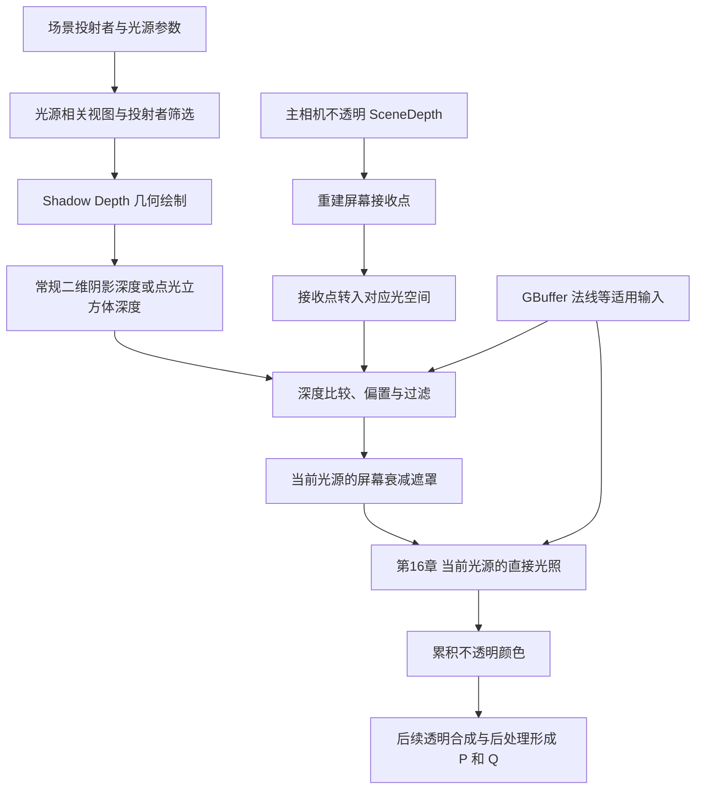
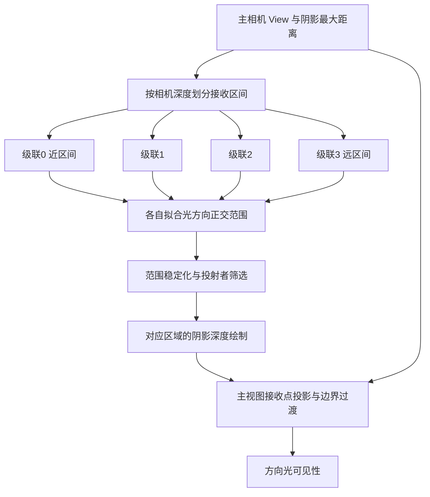

# 第 15 章：阴影生成与使用

[返回目录](../README.md) · [回顾 Base Pass](14-base-pass-gbuffer-decals.md) · [本章答案](../appendices/answers/15-shadows.md)

> **适用基线：**UE 5.7.4，Changelist 51494982，Windows／D3D12／SM6，桌面传统延迟渲染，配置 A。本章使用常规阴影贴图与方向光 CSM；`r.Shadow.Virtual.Enable=0`。Substrate、Nanite、Lumen、硬件光线追踪和 MegaLights 均按[配置附录](../appendices/configuration.md)关闭。
>
> **证据范围：**本章静态核对本机源码，没有运行配套项目或抓取 GPU 帧。实现结论标为 **[源码已确认]**，人为选定的坐标、纹理尺寸与示意数据标为 **[教学简化]**，操作及预期标为 **[尚未验证]**。图中的箭头是数据与依赖关系，不是实测 GPU 时间线。

## 15.1 学习目标与前置知识

第 13 章的 SceneDepth 回答“相机沿这个像素方向首先遇到什么”，第 14 章的 GBuffer 补充这个表面的材质属性。它们还没有回答另一个问题：方向光能否照到该表面，还是光线在途中已经遇到了红方块？阴影系统要提供的正是这类光源可见性信息。

完成本章后，你应能从接收阴影的表面出发，解释为什么需要光源视角的深度；手算一次坐标变换、深度比较与 PCF；区分阴影贴图的生成和屏幕空间投影；说明 CSM 如何分配精度，以及点光为什么需要立方体六面；沿源码找到阴影初始化、绘制、比较和光照消费之间的联系。

前置知识是世界／观察／裁剪空间、齐次除法、深度测试、纹理采样、Mesh Draw Command 和 RDG。本章会再次说明涉及的深度约定。请特别留意：**主相机使用反向 Z，不代表所有阴影贴图也使用相同的存储和比较规则。**

贯穿场景保持红方块、金属球、地面、蓝色透明薄片、方向光、点光与相机。两个光源均设为 **Movable** 并启用 Cast Shadows；方向光的 Dynamic Shadow Distance MovableLight 为 `2000 cm`，不用烘焙光照。这个距离是教学配置值，不是引擎的组件默认值。后面的四级 CSM、分布指数和纹理分辨率是分别声明的算例参数，也不冒充实际项目查询结果。

## 15.2 光照方向与观察方向是两件事

假设相机看见地面上的位置 R，但方向光照向 R 的途中先遇到红方块。对相机而言，R 没被遮住；对方向光而言，R 被方块挡住。这不矛盾，因为它们沿不同方向观察。

**投射者（Shadow Caster）**是能阻挡该光源的几何体，**接收者（Shadow Receiver）**是当前需要查询光源可见性的表面。一个方块可以同时是两者：它为地面投影，也可能让自己的背面或凹处落在遮挡中。投射者并不一定在主相机画面里；画面外的物体仍可能把阴影投进画面。

**阴影贴图（Shadow Map）**首先是一张从光源相关视图生成的深度图。对某个纹素，记录该光源视线首先碰到的有效投射表面。接收者转到相同空间后，与这份最近遮挡证据比较。如果接收者更远，就存在一个位于它前面的阻挡表面。

这里的“从光源看”是几何解释。方向光没有需要摆放在场景某个位置的有限灯泡；UE 为有限接收区域建立与光方向对齐的正交视图。点光则从光源位置向周围六个方向建立透视视图。它们都不能直接把主相机 SceneDepth 当作自己的阴影贴图。

| 资源或量 | 它描述什么 | 不能据此直接得出什么 |
|---|---|---|
| 主视图 SceneDepth | 相机可见的不透明表面的深度 | 光源到表面之间是否有其他物体 |
| 光源阴影深度 | 指定光源视图里的最近投射表面 | 表面的颜色、粗糙度或最终亮度 |
| 屏幕空间阴影因子 | 某个可见接收点对当前光源的遮挡结果 | 所有光源、反射、自发光合成后的最终颜色 |
| 级联分段距离 | 主相机观察深度上的接收区间 | 阴影贴图某一纹素的光空间深度 |

[打开阴影生产与使用静态图](../assets/diagrams/15-shadows-1.png)



**[教学简化]**图把同一光源的必要关系放在一起。实际可以有多个级联、多个光源、缓存复用与多个投影 Pass。阴影深度生产者通常不需要先读取主视图 GBuffer；屏幕投影消费者则需要当前接收表面的信息。

## 15.3 阶段一：建立阴影视图、选择投射者、安排存储

### 15.3.1 八维定位

| 维度 | 本阶段的回答 |
|---|---|
| 作用 | 为需要阴影的光源建立有效的投影、候选集合和深度目标 |
| 原因 | 光源种类、接收范围、可见性、材质与缓存状态共同决定要生成什么 |
| 输入 | Light Scene Proxy、View、primitive 包围体和相关性、阴影设置与已有缓存 |
| 过程 | 判断光源资格，建立投影，筛选投射者，收集网格，决定分辨率、图集与缓存模式 |
| 输出 | `FProjectedShadowInfo`、阴影网格工作和分配／复用的阴影深度目标 |
| 实现 | `BeginInitDynamicShadows`、各类 WholeScene 创建路径、Gather 与 Allocate 路径 |
| 条件 | 光源及 primitive 允许投影、光源与 View 相关、平台支持且质量与尺寸等条件满足 |
| 成本与误区 | 多光源、多级联和候选数量增加 CPU 工作；主相机不可见不是全局排除条件 |

### 15.3.2 创建一个阴影描述，不等于已经画出一张图

**[源码已确认]**本版在阴影初始化中根据光源是否允许静态／动态阴影、适用遮挡类型以及各 View 中是否相关等条件筛选。局部光源进入 `CreateWholeSceneProjectedShadow` 一类路径，方向光则经 `AddViewDependentWholeSceneShadowsForView` 建立依赖 View 的 WholeScene 阴影，见 [S15-01](#s15-01)。

`FProjectedShadowInfo` 描述一次投影所需的矩阵、范围、分辨率、级联设置、缓存模式、接收与投射集合等。它是渲染侧工作描述，不是 GPU 上的像素数组。多个描述可以共用图集中的不同矩形；缓存模式还可能让一次逻辑阴影对应静态部分与可移动部分的组合。

函数名中的 **WholeScene** 表示这类阴影的组织范围，与只围绕特定对象建立的 per-object shadow 相区别。它不保证“场景所有物体、无论距离和相关性都重新画一遍”。方向光 CSM 仍只处理选定范围及可能影响它的投射者。

初始化也不是一个不可拆分的同步函数。`BeginInitDynamicShadows` 发起收集，`FinishInitDynamicShadows` 完成相关收集，之后还要完成阴影 Mesh Pass 的设置，见 [S15-02](#s15-02)。这里 Finish 的对象是相应 CPU 准备工作，不是 GPU 已经填好所有阴影像素。

### 15.3.3 筛选范围要沿光方向延伸

为地面某片区域生成阴影时，只收集位于该接收区域内部的物体会漏影。一个高处物体可以不在地面附近，却位于光源通向地面的途中。需要考虑沿光方向延伸后的潜在遮挡范围，再用包围体、光源影响范围、阴影相关性与其他策略继续筛选。

**[源码已确认]**方向光级联的收集代码先做围绕光方向轴线的范围测试，再与 `CascadeSettings.ShadowBoundsAccurate` 的凸体进行包围盒相交测试；随后考虑屏幕尺寸、缓存模式、光源是否影响该 primitive 等条件，最终加入阴影 subject 集合，见 [S15-03](#s15-03)。这与“直接复制主视图可见 primitive 位图”不是同一个算法。

因此画面外的方块能否投影，要继续问：它是否仍在有效光空间覆盖与投射者集合中，是否允许 Cast Shadow，材质是否适用，尺寸策略是否保留它。不要由“它不在主相机里”直接推断阴影应当消失，也不要反过来承诺任意远的屏外物体一定会进入有限阴影范围。

### 15.3.4 图集、边界与分辨率

**图集（Atlas）**把多个阴影矩形放在较大的纹理里。此时本地阴影 UV 还要加上子矩形的位置和缩放，不能把每个级联都当成覆盖整张资源的 `[0,1]²`。过滤会访问邻近纹素，因此有效区域和分配区域之间还涉及边界。

**[源码已确认]** `AllocateCSMDepthTargets` 按分辨率及两侧 Border 布局；适用路径将级联合入图集，并创建可作为深度目标和 Shader 资源使用的 `PF_ShadowDepth` 纹理。`GetScreenToShadowMatrix` 随后把 Tile 位置、大小、Border 和整张纹理大小编入变换，见 [S15-04](#s15-04)、[S15-11](#s15-11)。

阴影分辨率也不等于游戏窗口分辨率。局部光源的预期分辨率会受光源投影尺寸、缩放、上限与缓存等因素影响；CSM 建立路径读取对应的最大 CSM 分辨率并扣除边界，见 [S15-01](#s15-01)、[S15-16](#s15-16)。把游戏窗口从 1280×720 改大，不能据此计算“每级阴影必然同比变成某个尺寸”。

## 15.4 先手算一张光空间深度图

本节使用一个明确的正交教学模型，先不加入图集、裁剪、偏置和过滤。定义光空间横坐标 x、纵坐标 y，以及**沿光源观察方向递增**的距离 d。覆盖区域取：

```text
x ∈ [-200, 200] cm，y ∈ [-100, 300] cm
有效深度区间 n=10 cm，f=410 cm
u = (x+200)/400
v = 1-(y+100)/400
z = (d-n)/(f-n)
```

这里 v 翻转是本节选择的纹理纵轴约定；它不改变“变到一致空间再比较”的原则。z 越小表示越靠近光源。全部数值均为 **[教学简化]**，不是红方块 P、Q 的实测坐标，也不是直接抄写 UE 最终矩阵系数。

设接收点 `R=(x=0,y=0,d=210)`：

```text
u=0.5，v=0.75，zR=(210-10)/400=0.5
```

同一光源射线上若有投射表面 `d=110`，它的深度为 `0.25`。阴影深度测试保留较近值，因此贴图里是 `0.25`，接收点 `0.5` 在它后面，判为遮挡。

若改为查询 `d=90` 的接收点，深度为 `0.2`，它比现有遮挡记录更近，查询返回受光。完整且一致的几何绘制通常也会让一个参与投影的近表面写入自己的深度；这里用固定贴图查询不同点，是为了单独练习比较关系。

对于一张 1024×1024 的独立贴图，`(u*1024,v*1024)=(512,768)` 是连续纹素坐标，不自动等于某个纹素中心。中心位置还涉及 `i+0.5`，过滤也会读取周围区域。不要把这两个整数当作“GPU 必然只读取索引 [512,768]”的证明。

理想硬比较可写为：

```text
V(R) = 1，若 zR <= D(u,v)
V(R) = 0，若 zR >  D(u,v)
```

V 表示这一个光源的可见性，1 为不遮挡，0 为遮挡。等号对应自表面应可受光的理想情况，实际会有精度误差与比较实现差异。此公式采用“近小远大”约定，不能原样搬去点光反向 Z 贴图。

## 15.5 阶段二：从光源相关视图绘制投射者深度

### 15.5.1 八维定位

| 维度 | 本阶段的回答 |
|---|---|
| 作用 | 将有效投射者变成可比较的光空间深度记录 |
| 原因 | 屏幕接收点需要知道光源方向上已有的最近阻挡表面 |
| 输入 | 阴影视图矩阵、投射者几何、位置修改与遮罩等材质信息、深度目标及可复用缓存 |
| 过程 | 清理或准备已有深度，组织绘制，执行顶点处理、光栅化、裁剪和深度测试 |
| 输出 | 阴影二维图集或点光立方体中当前有效的深度内容 |
| 实现 | `RenderShadowDepthMaps`、`FProjectedShadowInfo::RenderDepth`、ShadowDepth Shader 与 Mesh Processor |
| 条件 | 对应阴影分配并保留了待画工作；缓存复用等分支可能减少或省去本次绘制 |
| 成本与误区 | 多次处理几何、Masked/WPO 与深度带宽均有成本；不输出表面颜色不等于免费 |

### 15.5.2 方块不是再计算一次完整的红色光照

第 12 章的 Mesh Batch 和 Mesh Draw Command 同样服务于阴影绘制。顶点需要经过物体变换和光源投影，三角形要被光栅化，深度测试负责保留该光空间样本的有效近表面。这里通常不需要计算方块最终的红色漫反射或金属球的完整高光。

但“只画深度”仍可能需要材质信息。Masked 材质上的洞要通过透明度遮罩剔除；World Position Offset 改了顶点位置，阴影也应依据适用的位置修改形成。只画资产原始三角形外壳会使树叶孔洞或顶点动画的阴影形状出错。

**[源码已确认]** `UseDefaultMaterialForShadowDepth` 对每像素都写入且不修改位置的材料允许使用默认材质；`GetShadowDepthPassShaders` 按 Vertex Factory 支持、位置修改、阴影类型等条件选择 Shader。满足相应条件的路径可使用 PositionAndNormalOnly 流，或不绑定像素 Shader；其他路径保留所需的 ShadowDepth PS，见 [S15-07](#s15-07)。

“只用位置”是常见口语，读本版代码时要看到实际特性名中还有 Normal，因为斜率偏置等工作可能需要法线。不能把“无完整 Base Pass 材质着色”进一步推成“没有法线输入、没有像素阶段、没有纹理访问”。

ShadowDepth 像素 Shader 中可见材质求值和 `GetMaterialClippingShadowDepth`。对需要透视校正的二维阴影变体，还会从插值数据计算最终深度并写 `SV_DEPTH`，见 [S15-06](#s15-06)。不同灯型、材质和 Vertex Factory 不应被压成唯一 Shader 程序。

### 15.5.3 本版常规二维阴影与点光的深度规则不同

**[源码已确认]** `SetStateForShadowDepth` 关闭颜色写入后，常规非点光阴影使用 `CF_LessEqual`；OnePassPoint 使用 `CF_DepthNearOrEqual`，并明确注释它走反向 Z。CSM 纹理的 Clear Value 为 `DepthOne`，点光立方体为 `DepthFar`，见 [S15-04](#s15-04)、[S15-05](#s15-05)、[S15-19](#s15-19)。

| 本章路径 | 深度含义与保留方向 | 清理值 | 阅读时的关键限制 |
|---|---|---|---|
| 常规二维方向光／CSM | 适用编码下近值更小，`LessEqual` 保留近表面 | 1 | 不是把主 SceneDepth 的比较符号照搬过来 |
| OnePassPoint 立方体 | 各面透视投影的反向 Z，NearOrEqual 保留近表面 | 反向 Z 的远值 0 | 不是直接存到灯中心的线性距离 |
| VSM | 本章不沿该深度写入机制展开 | 依具体资源机制 | 单独进入第 23 章，不套前两行的完整实现 |

普通方向光的 `SetShadowDepthOutputs` 使用光源矩阵生成位置，再按 `1 - OutPosition.z*InvMaxSubjectDepth` 加上适用偏置写深度。对应投影 Shader 也进行匹配的编码转换，见 [S15-06](#s15-06)、[S15-11](#s15-11)。这里出现 `1-z` 并不能单凭一个表达式判断最终是反向 Z；必须同时核对矩阵、深度写法、清理值、测试函数和采样比较。

### 15.5.4 深度清理、缓存复制和绘制是不同工作

新鲜深度需要合适初值；缓存路径则可能从已有静态深度开始，叠加当前需要处理的可移动几何。`RenderDepth` 的深度绑定使用 Load，不表示阴影从未清过。清理可能已由外层图集／立方体 Pass 安排；缓存模式还可能先复制有效深度。

**[源码已确认]** `FProjectedShadowInfo::RenderDepth` 设置深度资源与 Pass 参数，在适用缓存模式复制已有深度，调用 `ShadowDepthPass.BuildRenderingCommands`，再按并行配置添加 Raster Pass 或 Dispatch Pass，见 [S15-08](#s15-08)。其中的回调在执行时设置视口及绘制状态并提交网格工作。

CPU 执行到 `RenderDepth` 返回，证明相应工作已被组织／登记，不能证明 GPU 的阴影纹素已经全部写好。第 09、10 章的 RDG 依赖、命令提交和 GPU 完成概念在此完全适用。

## 15.6 深度偏置：修正误差，也引入取舍

理想情况下，同一表面从光源绘制出的深度与从主视图重建后得到的深度应一致。实际存在有限纹素覆盖、插值、量化、矩阵精度和倾斜表面采样误差，可能把表面误判为躲在自己后面，形成**阴影痤疮（Shadow Acne）**。

继续使用“近小远大”教学约定。假设同一表面在阴影图中为 `0.4000`，重建后比较深度为 `0.4002`。直接测试 `0.4002 <= 0.4000` 失败，自表面错误变暗。给记录加入 `0.0005` 的正偏置后：

```text
偏置后的记录 = 0.4000+0.0005 = 0.4005
0.4002 <= 0.4005，判为受光
```

在同一线性比较模型中，把接收深度减去相同偏置具有等效比较结果。但真实实现可以在绘制或投影阶段施加不同类型偏置，单位和归一化也不同，不能认为编辑器里填入 `0.5` 就是往每张图的归一化深度加 `0.5`。

若真正投射者深度是 `0.3000`，同样偏置后仅为 `0.3005`，接收者 `0.4002` 仍处于遮挡。可一旦偏置大到 `0.11`，记录变成 `0.41`，真实遮挡也可能被放过。阴影会与物体接触处分离，常称 **Peter Panning**，还可能使薄墙附近漏光。

倾斜表面跨过一个纹素时，光空间深度变化更大，固定常数偏置未必足够。因此还有**斜率偏置（Slope Bias）**和接收者相关偏置。它们按表面与光方向的关系调整容差，同时限制极端值，避免接近掠射角时无限增长。

**[源码已确认]** ShadowDepth VS 从法线与光方向计算斜率项，进行最大斜率限制，再与常量项组合。C++ 的 `UpdateShaderDepthBias` 对方向光考虑有效深度范围、级联分辨率和 Cascade Bias Distribution；点光采用另一套分辨率与用户偏置缩放，见 [S15-06](#s15-06)、[S15-12](#s15-12)。

本版点光投影 Shader 还明确说明：点光偏置在投影时处理，依据接收法线与光方向计算相应斜率项。因而不能把方向光“向存储深度加偏置”的具体 Shader 行号当成点光也会执行的证据，见 [S15-20](#s15-20)。调节偏置时应先定位当前阴影类型，再谈数值大小。

## 15.7 过滤比较结果：PCF 与阴影边缘

一张有限分辨率的阴影图把连续投射形状离散成纹素。接收像素移动时，采样位置可能突然跨过“有遮挡”和“无遮挡”的纹素边界，形成锯齿和闪动。

**PCF（Percentage-Closer Filtering，百分比渐近过滤）**在周围多个位置进行深度比较，再对比较结果加权。它回答“邻域里有多大比例的样本支持受光”。这是过滤可见性，不是先把深度当颜色模糊，再只比较一次。

**[教学简化]**接收深度取 `0.6`，四个等权深度样本为 `[0.2, 0.2, 0.8, 0.8]`，忽略偏置：

```text
逐样本比较：0.6 <= D → [0, 0, 1, 1]
PCF 可见性：(0+0+1+1)/4 = 0.5

先平均深度：(0.2+0.2+0.8+0.8)/4 = 0.5
再比较一次：0.6 <= 0.5 为 false → 0
```

两者结果不同，因为比较不是可以随意与平均交换顺序的线性操作。V=0.5 是该过滤模型的中间可见性，不表示贴图准确恢复了一个面积光源上每条真实光线的几何遮挡。

实际实现也不一定每次比较都严格返回 0 或 1。**[源码已确认]** `ShadowFilteringCommon.ush::CalculateOcclusion` 的普通分支在相应过渡尺度下使用 `saturate((ShadowmapDepth-SceneDepth)*TransitionScale+1)`，随后 PCF 组合这些结果。`ManualPCF` 按质量选择不滤波或不同核大小，见 [S15-13](#s15-13)。本节二值例解释原则，不能替代该 Shader 的逐行数值结果。

Gather 可以一次返回多个相关样本，硬件比较采样也能完成比较及过滤。因此“3×3 核”不等于 Shader 源码必然发出九条独立纹理采样指令。核覆盖、采样指令数、缓存访问与最终带宽属于不同层次的成本。

增大过滤范围往往使边缘更平滑，也会模糊细节，并扩大跨过深度不连续处的机会。它不会补出原图根本没记录的小投射者。**PCSS**进一步估计遮挡者距离并变化过滤范围，用于近似接触处较硬、远处较软的阴影；本版 `r.Shadow.FilterMethod` 注册初值为 0，即 Uniform PCF，1 的说明为实验性 PCSS，见 [S15-13](#s15-13)。本章不能把 PCSS 当成 A 的必经默认步骤。

## 15.8 CSM：把近处的精度单独分配出来

### 15.8.1 为什么不只用一张覆盖很远的方向光图

方向光的正交阴影图在光空间横向均匀分配纹素，而透视相机的近处物体在屏幕上占得更大。一张覆盖很远范围的图，可能把太多纹素分给画面上很小的远处区域，近处接触边缘却分辨不清。

**级联阴影贴图（Cascaded Shadow Maps，CSM）**沿主相机观察深度划分接收区间。每个区间拟合一套方向光投影并拥有相应深度区域。近级联覆盖较小世界范围，能在相同纹理边长下获得更细的空间采样；远级联覆盖更大范围，接受较粗精度。

分段依据是主相机观察深度，而不是“到方向光位置的距离”，也不是不加说明的欧氏距离。方向光本来就没有一个需要按距离衰减的灯中心。某个接收点使用哪些级联及如何过渡，由其所在范围和投影处理决定。

[打开级联范围与投影静态图](../assets/diagrams/15-shadows-2.png)



**[教学简化]**图的四级来自下面的算例。中间合流只表示各级执行同类工作，不表示它们共用同一光源投影矩阵。重叠过渡区也意味着级联并非四个完全互斥的几何盒子。

### 15.8.2 本版级联分段的可计算公式

常见图形学文章会给出不同的 split 公式。理解通用原理以后，仍需回到当前引擎实现。**[源码已确认]**本版 `ComputeAccumulatedScale` 使用几何权重 `1,E,E²,...`，以累计权重占总权重的比例分配主相机深度范围；`GetSplitDistance` 将这个比例映射到 Near 与 CSM 最大距离之间，见 [S15-14](#s15-14)。

设 N 为近级联数，E 为有效 Cascade Distribution Exponent，n 为相机近裁剪距离，f 为本次有效 CSM 最大距离。对第 i 个名义边界：

```text
w_k = E^k，k = 0,...,N-1
s_i = n + (f-n) * (w_0+...+w_(i-1)) / (w_0+...+w_(N-1))
s_0 = n，s_N = f
```

这不是 `n+(f-n)*(i/N)^E`，也不是把线性与对数 split 加权混合的另一种常见公式。参数名都有 Exponent，不代表算法相同。

**[教学简化]**选 `N=4、E=2、n=10 cm、f=2000 cm`，先不加过渡扩展。权重为 `1,2,4,8`，总和 15，待分配距离为 1990 cm：

| 边界 i | 累计权重比例 | 相机观察深度 s_i |
|---|---|---|
| 0 | 0 | 10 cm |
| 1 | 1/15 | 142.667 cm |
| 2 | 3/15 | 408 cm |
| 3 | 7/15 | 938.667 cm |
| 4 | 15/15 | 2000 cm |

每段长度分别约为 `132.667、265.333、530.667、1061.333 cm`。若 E 改为 1，每段长度为 497.5 cm，边界变成 `10、507.5、1005、1502.5、2000 cm`。较大的 E 把更短的近区间单独分出来，但也让远区间增长更快，并非对全部距离同时增精度。

实际 f 还涉及方向光距离设置和 `r.Shadow.DistanceScale`；有效级联数量受组件值、View 的 MaxShadowCascades 等限制，见 [S15-14](#s15-14)。名义边界也没有计入下一节的范围拟合和淡化扩展，所以不能用这张表直接裁出引擎阴影图的四个精确世界空间盒子。

本版某些参数分支使用 `IsPrecomputedLightingValid`。名字很容易让人误以为“没烘焙就必进预览阴影参数”。实际该函数对没有静态阴影的光源也可返回有效，见 [S15-15](#s15-15)。本章的 Movable 光源不应仅因未烘焙，就被写成固定使用未构建光照回退的级联数和指数。

### 15.8.3 接收分段怎样变成光源投影

**[源码已确认]** `GetShadowSplitBoundsDepthRange` 从主相机分段的八个视锥角点拟合包围球，并构造阴影裁剪范围。`GetViewDependentWholeSceneProjectedShadowInitializer` 根据该范围设置预平移、光方向变换和缩放，形成正交投影所需的初始化信息，见 [S15-16](#s15-16)。

由此可以区分三种范围：相机里希望接收阴影的分段、从该分段拟合出的光空间 XY 覆盖、以及沿光方向扩展后可能遮挡它的投射者范围。它们相互关联，却不是同一盒子。同一个大型投射物还可能与多个级联相关，造成几何被重复处理。

相机移动会改变分段在世界中的位置。若每次都让投影连续细微滑动，静止物体也会不断穿过阴影纹素边界，使边缘看起来抖动。稳定化的目的，是让部分投影变化受控，而不是每个极小相机变化都重新划一套完全不同的采样网格。

**[源码已确认]**初始化处把包围球半径向上取整；`SetupWholeSceneProjection` 的方向光分支还把相关光空间位置按 InSnapResolution 与下采样因素进行吸附，见 [S15-17](#s15-17)。把它概括为“投影网格稳定化”合理，把本版说成“永远只按恰好一个最终纹素移动”则过于具体。稳定化也不保证运动几何、分辨率切换或所有边界问题都消失。

### 15.8.4 重叠、淡化与远端消失

相邻级联的分辨率、投影与偏置不同，硬切换可能在分段边界露出明显接缝。CSM 使用过渡区域混合相关结果，让变化更加平滑，但重叠也会增加覆盖与计算。

**[源码已确认]** `GetShadowSplitBounds` 以区间长度乘过渡比例计算 FadeExtension。非最后级联可把 SplitFar 向外延伸；当最后一级没有静态阴影接管时，则把开始淡出的平面向近处移动，而不是任意延长整个动态阴影距离。投影 Shader 再根据 FadePlaneOffset 和长度生成混合因子，见 [S15-18](#s15-18)。

本章没有静态光照接管，动态阴影在末端逐渐淡出可能是有限范围的预期行为，不必先归因于材质坏了。实际过渡还受设置与当前条件影响，不能只拿组件里填的 2000 cm 去要求最终像素在那一条线两边瞬间切换。

## 15.9 点光：六面透视图，而不是方向光的一张图

点光从有限位置照向周围。在三维空间里，单张有限视角透视图不能覆盖完整球面，所以常规点光阴影采用立方体的六个面，沿六个轴向覆盖周围。每面使用约 90° 的完整视场角，相邻面在方向覆盖上接合。

**[源码已确认]** `FPointLightSceneProxy::GetWholeSceneProjectedShadowInitializer` 以光源位置设置 PreShadowTranslation 和影响范围，并标记 OnePassPoint。`SetupWholeSceneProjection` 建立六组方向及投影矩阵，使用 `FReversedZPerspectiveMatrix`，深度目标由立方体分配路径创建，见 [S15-19](#s15-19)。

接收点先相对光源确定采样方向。Shader 选出主要坐标对应的面，将该点乘相应 ShadowViewProjectionMatrix，用 `ShadowPosition.z/ShadowPosition.w` 形成比较深度，并施加相应投影偏置。源码专门注明这不是线性深度，见 [S15-20](#s15-20)。

因此点光半径与接收点到光源的距离用于影响范围判定等计算，但不能把 `Distance/Radius` 当成该图实际存储的比较值。立方体采样方向、面选择约定、矩阵朝向与比较采样器要成套理解，不能只改一个符号。

本版 `CubemapHardwarePCF` 随阴影质量使用适用的比较采样组合，并在函数末尾处理反向 Z 所需的结果翻转，输出后续使用的遮挡因子。最终仍按“0 遮挡、1 不遮挡”的表面语义使用，不是把原始反向 Z 数字当作亮度。

**One Pass** 也不表示只处理一面，或任意点光只需一条 Draw Call。它是这条立方体阴影组织路径的名字。几何仍要覆盖六个面；本版在没有适用 GPU Scene 实例支持的绘制中还可进行六次主机侧面复制，其他条件使用相应分层／实例机制，见 [S15-21](#s15-21)。精确的原生 Draw 数量需要结合具体网格、平台、筛选与抓帧结果。

方向光的 CSM 主要解决相机近远处的精度分配，点光六面主要解决从一个位置观察整个球面的覆盖。二者都可能有多次几何工作，但形成多张图的原因不同，不能把六面叫作“六个距离级联”。

## 15.10 Movable、静态几何与阴影缓存

光源 Mobility 为 Movable，表示它允许运行时改变并使用适用动态光照路径。它不要求灯每帧真的移动，也不要求所有静止投射者每帧都以同样方式重新生成完整深度。

常规局部光阴影可以缓存静态部分，在投影仍有效时复用，再处理当前移动部分。场景里的“可移动组件”与“本帧真的产生了变换”也不是同一个条件；引擎的缓存分类还可能依据 Proxy 的几何移动特性。

**[源码已确认]** `ComputeWholeSceneShadowCacheModes` 对适用局部光源检查缓存初始化参数、资源有效性和尺寸等条件。有效缓存可进入 MovablePrimitivesOnly；投影不兼容时会失效并重新安排。点光分配路径还明确允许在没有要叠加的 subject 时，直接投影已有静态缓存而跳过该次深度绘制，见 [S15-22](#s15-22)。

移动灯会改变光源与投射者的空间关系，旧图不能无条件继续表示新投影。新增物体、位置修改、顶点动画、分辨率变化与预算也可能影响复用或更新。仅凭“灯的 Mobility 是 Movable”或“现在没动”都无法完整预测本帧缓存工作量。

方向光 CSM 有独立缓存开关。**[源码已确认]**本版 `r.Shadow.CSMCaching` 的构造注册值是 0；紧接的帮助文本却把 1 标为 default，二者不一致。这里按实际构造值记录，并要求观察时查询当前值，见 [S15-22](#s15-22)。不能把局部光缓存逻辑和 CSM 缓存直接当成同一个开关控制的相同实现。

## 15.11 阶段三：把阴影深度投影到屏幕接收点

### 15.11.1 八维定位

| 维度 | 本阶段的回答 |
|---|---|
| 作用 | 为主视图可见表面求当前光源的遮挡／衰减信息 |
| 原因 | 光照计算需要表面到该光源的可见性，而阴影深度存储在另一视图中 |
| 输入 | 主视图 SceneDepth、阴影深度、ScreenToShadow 等变换、适用 GBuffer 信息和偏置／过滤参数 |
| 过程 | 确定接收区域，重建接收点，变到光空间，比较、过滤、级联过渡并写遮罩 |
| 输出 | 适用通道编码的屏幕空间 Light Attenuation／Shadow Mask |
| 实现 | `RenderDeferredShadowProjections`、各类 `RenderProjection` 与 ShadowProjection Shader |
| 条件 | 当前光源有需要投影的有效阴影；点光、CSM 和其他阴影种类采用不同分支 |
| 成本与误区 | 接收像素覆盖、过滤核、级联重叠与光源数增加成本；遮罩不是最终 SceneColor |

### 15.11.2 从主相机像素回到光空间

在 P 读取主 SceneDepth，可以重建它对应的不透明世界表面。接着撤去主视图相关变换并施加阴影的预平移、光源投影、深度归一化和图集映射，得到可用于阴影查询的数据。

数学上可以先重建世界位置，再变到光空间；实现上也能预组合成矩阵，减少逐像素工作。**[源码已确认]** `GetScreenToShadowMatrix` 将主视图 ScreenToClip、逆变换、PreViewTranslation、PreShadowTranslation 和光源投影、图集映射串起来，见 [S15-11](#s15-11)。预平移不仅是坐标管理细节，也关系到远离世界原点时的数值精度。

投影像素 Shader 的 `Main` 读取 `CalcSceneDepth`，构造相应 ScreenPosition，乘 `ScreenToShadowMatrix`，按当前编码取得阴影比较深度并进行纹理坐标除法。普通不透明路径把比较深度上限限制到略小于 1，确保未写入而清为 1 的区域可以按预期视为不遮挡，见 [S15-11](#s15-11)。

这里 `CalcSceneDepth` 的输出并不是把原始 SceneDepth 纹理反向 Z 数字直接当作厘米使用；它遵循主视图深度还原接口。完整追踪时必须分别标注 DeviceZ、视图深度、世界位置和光空间比较深度，不能因为它们都叫 Depth 就互换。

### 15.11.3 投影 Pass 写什么，光照怎样读取

**[源码已确认]** `RenderShadowProjections` 为各 View 绑定场景纹理与输出目标，按阴影类型进入普通投影或点光立方体投影。`RenderDeferredShadowProjections` 把它放入不透明表面的阴影投影组织中，见 [S15-23](#s15-23)。实际还包含范围、深度／模板等裁剪策略，因此不能把每个阴影都估成无条件全屏执行相同 Shader。

输出是衰减数据。普通延迟投影 Shader 组织表面与透射等因素到对应通道，CSM 过渡还会使用混合所需的数据；点光路径对通道另有写法。不要看到一张 RGBA 纹理，就宣布四通道都等于同一个阴影值。

`LightRendering.cpp` 创建清理值为白色的屏幕阴影遮罩，在处理对应光源时清理／更新它，调用阴影投影，再将该遮罩传给 `RenderLight`。这一资源还可以涉及 Light Function 等衰减贡献，并非永久存下“整帧全部光源总阴影”的一张灰度图，见 [S15-24](#s15-24)。

**[源码已确认]**延迟光照 Shader 读取 Light Attenuation，`GetShadowTermsBase` 按光源与适用条件组织表面阴影项，动态光照累积将对应光颜色乘表面阴影因子后加入当前光源贡献，见 [S15-25](#s15-25)。BRDF、法线与能量计算留给第 16 章，本章只追踪可见性怎样进入它。

**[教学简化]**某接收点的方向光直接贡献原为线性 `(8,2,1)`，其可见性为 `0.25`，该贡献变成 `(2,0.5,0.25)`。点光的贡献需要用点光自己的可见性处理，再与其他适用项累积。不能把已经包含点光、自发光、反射的全部 SceneColor 统一乘 `0.25`。

## 15.12 本版生成与消费的调度关系

章节顺序用来组织理解，不是强制 GPU Pass 顺序。阴影深度主要依赖投射者和光源视图，屏幕投影则需要有效接收深度以及某些表面信息；它们有不同的最早可开始条件。

**[源码已确认]** `RenderShadowDepthMaps` 完成阴影 Mesh Pass 准备后，分别组织常规图集与立方体工作；VSM 有独立分支。桌面渲染器的 `r.shadow.ShadowMapsRenderEarly` 注册初值为 0，非 VSM 条件下可选择提前生成；默认的相应后续调用位于主 Base Pass 调用之后，见 [S15-09](#s15-09)、[S15-10](#s15-10)。

所以“阴影图一定在 Base Pass 之前”不是本版配置 A 的可靠源码结论；“阴影图逻辑上不依赖所有 GBuffer 结果”也不等于代码必须把它放在最前。实际安排还考虑任务准备、资源与调度收益。

另一方面，读取阴影图的投影不能在其所需内容有效之前使用它。RDG 通过资源读写依赖组织正确顺序，不要求 CPU 每加一个 Pass 就等待 GPU 完成上一个 Pass。缓存使用的有效历史内容也属于需要追踪的资源来源。

`CheckShadowDepthRenderCompleted` 一类名称检查渲染器本帧的组织状态，不是让 CPU 读取硬件 Fence 并等待 GPU，见 [S15-09](#s15-09)。把这个检查与第 10 章的 GPU 完成事件混为一谈，会错误解释线程停顿和阴影渲染耗时。

## 15.13 回到贯穿场景的 P 与 Q

P 是红方块上没有薄片覆盖的像素。主视图深度与 GBuffer 标识该不透明表面，方向光与点光分别查询自己的阴影数据。方块的 Base Color 仍是红色；受到遮挡改变的是相关光源的可见直接光贡献，不是阴影 Pass 把它的材质资产改黑。

不能仅凭“方块是投射者”认定 P 一定处于阴影。P 所在面朝向、光源位置、其他几何和自遮挡共同决定结果。背向光的表面还可能因 BRDF 中的几何关系没有该直接光贡献，这与“有一块外部物体挡在光源前”需要区分。

Q 是薄片覆盖方块的屏幕位置。本书蓝片为 Unlit、Translucent、Two Sided，Opacity 为 0.35，不启用折射。**当前不透明阴影投影读取的主 SceneDepth 对应 Q 下方的不透明接收者；它不会仅因片子在相机前面，就自动改成查询片子的普通不透明表面。**

先得到下方方块在各光源下的背景颜色，后续透明路径再把薄片的自发光贡献与背景合成。因为薄片是 Unlit，不应把本章的直接光阴影因子当成它自身颜色的必乘项。阴影能通过改变下方背景影响 Q，但不能据此宣称蓝片已经获得了普通受光透明材质的阴影。

同样，Opacity=0.35 不是“向不透明 Shadow Map 写入 35% 遮挡”的通用指令。普通二维 Shadow Depth Mesh Processor 检查适用材质范围，专门的透明阴影／体积透射等属于其他路径，见 [S15-07](#s15-07)。本章不把本书透明薄片自动升级为有物理彩色透射阴影的玻璃。第 18 章继续解释透明表面的生成和合成条件。

## 15.14 精度与成本怎样一起变化

**[教学简化]**若正交覆盖宽度为 `800 cm`、有效横向分辨率为 1024，则约有：

```text
世界空间宽度 / 横向纹素数 = 800/1024 = 0.78125 cm/texel
```

覆盖宽度翻倍而分辨率不变，横向采样间隔增为 `1.5625 cm/texel`；覆盖不变而边长翻倍到 2048，间隔减半，但二维纹素总量变成四倍。实际透视投影、方向、边界和拟合会影响屏幕精度，这个式子只解释正交横向分配。

再假设四级各有 1024² 个有效样本，一个点光也使用六面 1024²，深度存储暂按每样本 4 字节计算：

```text
四级 CSM = 4*1024*1024*4 B = 16 MiB
一个点光立方体 = 6*1024*1024*4 B = 24 MiB
合计 = 40 MiB
```

这是容量模型。每样本 4 字节是此处假设，不能用来宣布某平台 `PF_ShadowDepth` 的真实物理格式和完整显存账单。实际还可能有 Border、图集空隙、静态缓存、资源对齐及其他额外存储；有些目标也可能复用。

GPU 成本至少分为投射者深度生成与接收者投影。前者对几何数量、覆盖次数、位置动画、Masked 求值和深度带宽敏感；后者对受影响的屏幕像素、过滤质量、级联重叠和光源覆盖敏感。点光半径扩大可能同时引入更多投射物和更多接收像素。

提高阴影分辨率可能改善空间锯齿，却不会修复无效投射者、错误矩阵、漏失的缓存更新或材质路径不匹配。增大 Bias 可能压住 Acne，却可能扩大接触分离；扩大 CSM 距离提高覆盖，却可能稀释现有纹素密度。每种调整都应针对已经定位的误差来源。

CPU 还有光源筛选、范围拟合、subject 收集和网格命令组织成本。主相机只见一个方块，并不意味着阴影也只处理它的一次 Draw。性能记录要区分光源数、级联数、面数、投射者数、有效分辨率和缓存更新量，不能仅用一个“阴影质量高低”解释所有变化。

## 15.15 配置 B 的边界：VSM 留到第 23 章

配置 B 选择虚拟阴影贴图，意味着阴影资源的分配、页需求、缓存和绘制组织发生变化。对方向光也不能继续把本章有限数量的常规 CSM 图集当作完整的现代路径描述。

仍然成立的基础是：光源可见性与主相机可见性不同，接收点需要和光源侧遮挡证据建立对应，有限采样与动态变化需要成本和误差管理。改变的是大量资源与执行细节，不能把 VSM 理解成“只把 Shadow Map 分辨率数字调得特别大”。

**[源码已确认]**本章核对的 `SetStateForShadowDepth`、`RenderShadowDepthMaps` 及视图相关阴影创建处都有独立 VSM 分支，见 [S15-01](#s15-01)、[S15-05](#s15-05)、[S15-09](#s15-09)。这也是本章为何反复标明配置 A。VSM 具体的数据结构与流程在第 23 章展开，硬件光线追踪阴影则按第 25 章条件讨论。

## 15.16 可以自行执行的观察练习

以下全部为 **[尚未验证]**。先按配置附录运行固定相机和分辨率的 Standalone 场景，记录实际 CVar 当前值、光源与对象设置；不要把注册初值当成项目运行值。一次只改一个因素，保存对照记录后恢复。

| 查询或设置位置 | 本章核对到的内容 | 观察时的用途 |
|---|---|---|
| `r.Shadow.Virtual.Enable` | 配置 A 要求为 0 | 确认正在研究常规阴影路线 |
| `r.Shadow.FilterMethod` | 注册初值 0，Uniform PCF | 区分普通 PCF 与实验性 PCSS |
| `r.shadow.ShadowMapsRenderEarly` | 注册初值 0 | 对照深度生成的组织位置 |
| `r.Shadow.CSMCaching` | 构造注册值 0，帮助文字有不一致 | 排除只依据文字推测缓存默认行为 |
| 方向光的级联数、距离、Distribution Exponent | 组件值与 View／可扩展性限制共同生效 | 记录手算输入与有效结果的差异 |

1. 保持点光与方向光都存在，逐个切换某一光源的 Cast Shadows，并观察地面和方块。预期受影响的是该光源的遮挡项，不是所有来源的颜色一起乘黑。
2. 将能投影的物体移到主相机之外、但仍可能向可见地面投影的位置，记录阴影 subject 与覆盖条件。主视图不画它而地面仍有阴影，是两个可见性问题不同的证据；没有阴影时继续查范围和策略。
3. 固定光源与几何，缓慢移动相机，观察近远级联细节及边界过渡。分别记录级联参数、有效分辨率、Bias 和过滤，避免把一次画质档切换归因给某一个参数。
4. 在相同位置测试小幅 Bias 调整。观察 Acne 与接触分离的取舍，记录点光与方向光走的路径；不要用极大偏置“证明阴影已经正确”。
5. 检查 GPU 抓帧中的 `WholeSceneShadowmap`、`CubeShadowDepthZ` 等对应资源，记录真实尺寸、层数和深度约定。灰度显示本身可能误导，采样值及比较方式更关键；名称也不能代替资源描述。
6. 沿 `RenderShadowDepthMaps`、`RenderDepth`、`RenderDeferredShadowProjections` 和当前光源的 `RenderLight` 定位，分别记录 CPU 登记与 GPU Pass。CPU 断点命中不是 GPU 完成证据；调度实验不预先宣称性能更快。

若阴影缺失，先确认配置分支、光源是否允许阴影、投射者是否进入集合、资源是否有有效深度，再检查接收点变换、比较和光照消费。若阴影存在但形状不对，则检查几何／材质、投影范围、分辨率和偏置。这个顺序能把“没有生产证据”和“消费证据时出错”分开定位。

## 15.17 源码证据与跟读顺序

以下路径以 `Engine` 为根，行号对应本章基线。先读创建和深度生成，再把相同矩阵与资源追到投影和光照；不同条件分支不要拼成一条必经调用栈。

<a id="s15-01"></a>
**S15-01：光源资格与阴影创建。** `Source/Runtime/Renderer/Private/ShadowSetup.cpp` 的[光源条件](G:/UnrealEngineInstalled/UE_5.7/Engine/Source/Runtime/Renderer/Private/ShadowSetup.cpp:6227)、[CreateWholeSceneProjectedShadow](G:/UnrealEngineInstalled/UE_5.7/Engine/Source/Runtime/Renderer/Private/ShadowSetup.cpp:4125)与 [AddViewDependentWholeSceneShadowsForView](G:/UnrealEngineInstalled/UE_5.7/Engine/Source/Runtime/Renderer/Private/ShadowSetup.cpp:5471)区分局部光和 View 相关方向光。

<a id="s15-02"></a>
**S15-02：初始化任务。** [BeginInitDynamicShadows](G:/UnrealEngineInstalled/UE_5.7/Engine/Source/Runtime/Renderer/Private/ShadowSetup.cpp:6671)、[FinishInitDynamicShadows](G:/UnrealEngineInstalled/UE_5.7/Engine/Source/Runtime/Renderer/Private/ShadowSetup.cpp:6686)和 [FinishDynamicShadowMeshPassSetup](G:/UnrealEngineInstalled/UE_5.7/Engine/Source/Runtime/Renderer/Private/ShadowSetup.cpp:6704)连接准备阶段。

<a id="s15-03"></a>
**S15-03：投射者范围与加入。** `ShadowSetup.cpp` 的[方向光范围筛选](G:/UnrealEngineInstalled/UE_5.7/Engine/Source/Runtime/Renderer/Private/ShadowSetup.cpp:4978)、[进一步条件](G:/UnrealEngineInstalled/UE_5.7/Engine/Source/Runtime/Renderer/Private/ShadowSetup.cpp:5046)和 [AddSubjectPrimitive](G:/UnrealEngineInstalled/UE_5.7/Engine/Source/Runtime/Renderer/Private/ShadowSetup.cpp:1969)说明候选不等同于主视图直接可见集合。

<a id="s15-04"></a>
**S15-04：CSM 图集与清理约定。** [AllocateCSMDepthTargets](G:/UnrealEngineInstalled/UE_5.7/Engine/Source/Runtime/Renderer/Private/ShadowSetup.cpp:5977)安排带边界的矩形；[PF_ShadowDepth 与 DepthOne](G:/UnrealEngineInstalled/UE_5.7/Engine/Source/Runtime/Renderer/Private/ShadowSetup.cpp:6023)声明资源属性；[RHI.cpp 的清理常量](G:/UnrealEngineInstalled/UE_5.7/Engine/Source/Runtime/RHI/Private/RHI.cpp:129)定义 DepthOne 和 DepthFar。

<a id="s15-05"></a>
**S15-05：阴影深度测试状态。** [ShadowDepthRendering.cpp::SetStateForShadowDepth](G:/UnrealEngineInstalled/UE_5.7/Engine/Source/Runtime/Renderer/Private/ShadowDepthRendering.cpp:738)区分 VSM、OnePassPoint 与其他常规阴影；[ERHIZBuffer 近远值](G:/UnrealEngineInstalled/UE_5.7/Engine/Source/Runtime/RHI/Public/RHIDefinitions.h:303)与 [NearOrEqual 映射](G:/UnrealEngineInstalled/UE_5.7/Engine/Source/Runtime/RHI/Public/RHIDefinitions.h:420)明确本版反向 Z 约定。

<a id="s15-06"></a>
**S15-06：深度 Shader。** [ShadowDepthVertexShader.usf::SetShadowDepthOutputs](G:/UnrealEngineInstalled/UE_5.7/Engine/Shaders/Private/ShadowDepthVertexShader.usf:51)包含位置与偏置处理；[ShadowDepthPixelShader.usf::Main](G:/UnrealEngineInstalled/UE_5.7/Engine/Shaders/Private/ShadowDepthPixelShader.usf:51)包含材质遮罩及适用深度输出。

<a id="s15-07"></a>
**S15-07：材质与绘制变体。** [UseDefaultMaterialForShadowDepth](G:/UnrealEngineInstalled/UE_5.7/Engine/Source/Runtime/Renderer/Private/ShadowDepthRendering.cpp:538)、[GetShadowDepthPassShaders](G:/UnrealEngineInstalled/UE_5.7/Engine/Source/Runtime/Renderer/Private/ShadowDepthRendering.cpp:548)、[Null PS 条件](G:/UnrealEngineInstalled/UE_5.7/Engine/Source/Runtime/Renderer/Private/ShadowDepthRendering.cpp:634)与 [TryAddMeshBatch](G:/UnrealEngineInstalled/UE_5.7/Engine/Source/Runtime/Renderer/Private/ShadowDepthRendering.cpp:2125)限定材质和 Shader 路径。

<a id="s15-08"></a>
**S15-08：登记深度绘制。** [FProjectedShadowInfo::RenderDepth](G:/UnrealEngineInstalled/UE_5.7/Engine/Source/Runtime/Renderer/Private/ShadowDepthRendering.cpp:1080)绑定资源、处理缓存；[BuildRenderingCommands 及 Pass 登记](G:/UnrealEngineInstalled/UE_5.7/Engine/Source/Runtime/Renderer/Private/ShadowDepthRendering.cpp:1145)连接绘制组织和 RDG。

<a id="s15-09"></a>
**S15-09：深度生成总入口。** [RenderShadowDepthMaps](G:/UnrealEngineInstalled/UE_5.7/Engine/Source/Runtime/Renderer/Private/ShadowDepthRendering.cpp:1678)处理本帧状态、Mesh Pass 准备、常规图集与立方体，以及独立 VSM 分支；[SceneRendering.h 的完成状态检查](G:/UnrealEngineInstalled/UE_5.7/Engine/Source/Runtime/Renderer/Private/SceneRendering.h:2653)读取 CPU 组织标志。

<a id="s15-10"></a>
**S15-10：延迟路径里的位置。** `DeferredShadingRenderer.cpp` 的[提前开关](G:/UnrealEngineInstalled/UE_5.7/Engine/Source/Runtime/Renderer/Private/DeferredShadingRenderer.cpp:287)、[可选提前调用](G:/UnrealEngineInstalled/UE_5.7/Engine/Source/Runtime/Renderer/Private/DeferredShadingRenderer.cpp:2843)、[主 Base Pass](G:/UnrealEngineInstalled/UE_5.7/Engine/Source/Runtime/Renderer/Private/DeferredShadingRenderer.cpp:2905)和[后续深度生成](G:/UnrealEngineInstalled/UE_5.7/Engine/Source/Runtime/Renderer/Private/DeferredShadingRenderer.cpp:3130)给出本版组织依据。

<a id="s15-11"></a>
**S15-11：屏幕点转入阴影空间。** [ShadowRendering.cpp::GetScreenToShadowMatrix](G:/UnrealEngineInstalled/UE_5.7/Engine/Source/Runtime/Renderer/Private/ShadowRendering.cpp:1761)组合主视图、光源及图集变换；[ShadowProjectionPixelShader.usf::Main](G:/UnrealEngineInstalled/UE_5.7/Engine/Shaders/Private/ShadowProjectionPixelShader.usf:108)读取接收深度并计算相应比较值。

<a id="s15-12"></a>
**S15-12：各类偏置。** [ShadowRendering.cpp::UpdateShaderDepthBias](G:/UnrealEngineInstalled/UE_5.7/Engine/Source/Runtime/Renderer/Private/ShadowRendering.cpp:1855)按光源和阴影类型处理分辨率、范围与用户偏置参数。

<a id="s15-13"></a>
**S15-13：比较与过滤。** [ShadowFilteringCommon.ush::CalculateOcclusion](G:/UnrealEngineInstalled/UE_5.7/Engine/Shaders/Private/ShadowFilteringCommon.ush:151)、[Manual3x3PCF](G:/UnrealEngineInstalled/UE_5.7/Engine/Shaders/Private/ShadowFilteringCommon.ush:244)与 [ManualPCF](G:/UnrealEngineInstalled/UE_5.7/Engine/Shaders/Private/ShadowFilteringCommon.ush:352)展示比较及核选择；[FilterMethod 注册](G:/UnrealEngineInstalled/UE_5.7/Engine/Source/Runtime/Renderer/Private/ShadowRendering.cpp:187)区分 PCF／PCSS。

<a id="s15-14"></a>
**S15-14：级联数量、距离与分段。** `DirectionalLightComponent.cpp` 的[数量限制](G:/UnrealEngineInstalled/UE_5.7/Engine/Source/Runtime/Engine/Private/Components/DirectionalLightComponent.cpp:674)、[GetCSMMaxDistance](G:/UnrealEngineInstalled/UE_5.7/Engine/Source/Runtime/Engine/Private/Components/DirectionalLightComponent.cpp:694)、[ComputeAccumulatedScale](G:/UnrealEngineInstalled/UE_5.7/Engine/Source/Runtime/Engine/Private/Components/DirectionalLightComponent.cpp:735)与 [GetSplitDistance](G:/UnrealEngineInstalled/UE_5.7/Engine/Source/Runtime/Engine/Private/Components/DirectionalLightComponent.cpp:766)限定算例对应的算法。

<a id="s15-15"></a>
**S15-15：预计算有效性名字的边界。** [LightSceneInfo.cpp::IsPrecomputedLightingValid](G:/UnrealEngineInstalled/UE_5.7/Engine/Source/Runtime/Renderer/Private/LightSceneInfo.cpp:272)还考虑光源是否具有静态阴影，不能由“没有烘焙”简单判定分支。

<a id="s15-16"></a>
**S15-16：接收区间拟合与投影创建。** [GetShadowSplitBoundsDepthRange](G:/UnrealEngineInstalled/UE_5.7/Engine/Source/Runtime/Engine/Private/Components/DirectionalLightComponent.cpp:798)从视锥构造范围；[方向光初始化](G:/UnrealEngineInstalled/UE_5.7/Engine/Source/Runtime/Engine/Private/Components/DirectionalLightComponent.cpp:472)生成光源变换；[CSM 分辨率建立](G:/UnrealEngineInstalled/UE_5.7/Engine/Source/Runtime/Renderer/Private/ShadowSetup.cpp:5563)结合分辨率上限与边界。

<a id="s15-17"></a>
**S15-17：范围稳定化。** [半径取整](G:/UnrealEngineInstalled/UE_5.7/Engine/Source/Runtime/Engine/Private/Components/DirectionalLightComponent.cpp:478)和 [SetupWholeSceneProjection 的方向光吸附](G:/UnrealEngineInstalled/UE_5.7/Engine/Source/Runtime/Renderer/Private/ShadowSetup.cpp:1039)是本版稳定化依据。

<a id="s15-18"></a>
**S15-18：级联过渡。** [GetShadowSplitBounds 的 FadeExtension](G:/UnrealEngineInstalled/UE_5.7/Engine/Source/Runtime/Engine/Private/Components/DirectionalLightComponent.cpp:900)区分中间与最后级联；[投影 Shader 的 Fade Plane](G:/UnrealEngineInstalled/UE_5.7/Engine/Shaders/Private/ShadowProjectionPixelShader.usf:265)计算相应混合因子。

<a id="s15-19"></a>
**S15-19：点光六面初始化与目标。** [PointLightComponent.cpp 初始化](G:/UnrealEngineInstalled/UE_5.7/Engine/Source/Runtime/Engine/Private/Components/PointLightComponent.cpp:72)、[ShadowSetup.cpp 六面与反向 Z 投影](G:/UnrealEngineInstalled/UE_5.7/Engine/Source/Runtime/Renderer/Private/ShadowSetup.cpp:1091)和[立方体深度分配](G:/UnrealEngineInstalled/UE_5.7/Engine/Source/Runtime/Renderer/Private/ShadowSetup.cpp:6038)构成资源生产路径。

<a id="s15-20"></a>
**S15-20：点光比较与偏置。** [ShadowProjectionCommon.ush::CubemapHardwarePCF](G:/UnrealEngineInstalled/UE_5.7/Engine/Shaders/Private/ShadowProjectionCommon.ush:151)使用面投影 `Z/W`；[ShadowProjectionPixelShader.usf 的点光入口](G:/UnrealEngineInstalled/UE_5.7/Engine/Shaders/Private/ShadowProjectionPixelShader.usf:423)包含接收法线偏置及衰减输出。

<a id="s15-21"></a>
**S15-21：OnePassPoint 的几何组织。** [ShadowDepthRendering.cpp::Process](G:/UnrealEngineInstalled/UE_5.7/Engine/Source/Runtime/Renderer/Private/ShadowDepthRendering.cpp:2058)在适用条件下按六面复制绘制工作，不保证一个光源只有一个原生 Draw。

<a id="s15-22"></a>
**S15-22：缓存和复用。** [ComputeWholeSceneShadowCacheModes](G:/UnrealEngineInstalled/UE_5.7/Engine/Source/Runtime/Renderer/Private/ShadowSetup.cpp:3711)检查局部光缓存；[点光无新 subject 的复用](G:/UnrealEngineInstalled/UE_5.7/Engine/Source/Runtime/Renderer/Private/ShadowSetup.cpp:6047)可省去对应深度绘制；[CSMCaching 注册](G:/UnrealEngineInstalled/UE_5.7/Engine/Source/Runtime/Renderer/Private/ShadowSetup.cpp:404)需区分初值和帮助文字。

<a id="s15-23"></a>
**S15-23：投影组织。** [ShadowRendering.cpp::RenderShadowProjections](G:/UnrealEngineInstalled/UE_5.7/Engine/Source/Runtime/Renderer/Private/ShadowRendering.cpp:2082)选择普通及点光分支；[RenderDeferredShadowProjections](G:/UnrealEngineInstalled/UE_5.7/Engine/Source/Runtime/Renderer/Private/ShadowRendering.cpp:2362)连接不透明表面的遮罩生成。

<a id="s15-24"></a>
**S15-24：遮罩与当前光源。** `LightRendering.cpp` 的[屏幕遮罩分配](G:/UnrealEngineInstalled/UE_5.7/Engine/Source/Runtime/Renderer/Private/LightRendering.cpp:1779)、[阴影投影调用](G:/UnrealEngineInstalled/UE_5.7/Engine/Source/Runtime/Renderer/Private/LightRendering.cpp:2236)和 [RenderLight 输入](G:/UnrealEngineInstalled/UE_5.7/Engine/Source/Runtime/Renderer/Private/LightRendering.cpp:2309)连接生成与直接光照消费。

<a id="s15-25"></a>
**S15-25：表面阴影项进入光照。** [DeferredLightPixelShaders.usf 的衰减读取](G:/UnrealEngineInstalled/UE_5.7/Engine/Shaders/Private/DeferredLightPixelShaders.usf:133)、[DeferredLightingCommon.ush::GetShadowTermsBase](G:/UnrealEngineInstalled/UE_5.7/Engine/Shaders/Private/DeferredLightingCommon.ush:94)和[光照累积](G:/UnrealEngineInstalled/UE_5.7/Engine/Shaders/Private/DeferredLightingCommon.ush:459)表明阴影作用于对应光源的适用贡献。

## 15.18 概念回顾与常见误区

- 主相机深度与光源阴影深度回答不同可见性问题；屏外投射者仍可能影响屏内接收者。
- 阴影深度生成是几何工作，屏幕投影是接收者查询；二者拥有不同输入、成本和执行条件。
- 深度比较必须与光源矩阵、编码、清理值及偏置一致。本版常规二维图和点光立方体不能共用一条未经转换的深度规则。
- PCF 过滤比较结果，不是先平均深度。偏置、分辨率和过滤解决的问题不同，也各自带来取舍。
- CSM 按主相机深度分配方向光精度，点光六面覆盖空间方向；级联边界不是光空间深度。
- Movable 不是“每帧所有投射者都重画”的保证；缓存有效性和当前任务需要继续确认。
- 阴影遮罩参与当前光源的直接光照，不是把最终 SceneColor 统一乘黑，也不会自动为 Unlit 透明片增加受光模型。

## 15.19 理解检查

先独立写出推理，再打开[本章答案](../appendices/answers/15-shadows.md)。

1. 相机看见地面 R，一个方块不在主相机画面内，但处于方向光照向 R 的途中。为什么 SceneDepth 不足以判断 R 的阴影？该方块是否必然被主视图不可见性排除出阴影？
2. 按“近小远大”的教学编码，阴影记录为 `0.4200`，自表面接收深度为 `0.4203`。无偏置与向记录加 `0.0004` 时分别怎样判断？若真实投射者为 `0.4000`，偏置增为 `0.03` 又会发生什么？能否把这些加法直接当成点光 Shader 的实际公式？
3. 接收深度为 `0.55`，四个等权深度样本为 `[0.2,0.6,0.7,0.8]`，忽略偏置。逐个硬比较后平均的 PCF 值是多少？先平均深度再比较会得到什么？
4. 使用本版累计几何权重算法，取 `N=3、E=2、n=10 cm、f=710 cm`，求全部名义边界。如果正交覆盖宽度 800 cm、边长 1024，改为同覆盖的 2048 后，横向采样间隔与二维样本数怎样变化？
5. 有人说：“一个 Movable 点光是 One Pass，所以只需一面一条 Draw；它每帧重画所有物体，`RenderDepth` 返回就能证明 GPU 完成，阴影值最后乘整张 SceneColor。”逐条指出这些判断的问题，并说明它与方向光 CSM 的核心区别。

下一章进入[延迟直接光照](16-direct-lighting.md)：阴影已经提供对应光源的可见性，接下来结合 GBuffer、光源参数和材质响应，计算应加入不透明颜色的直接光贡献。
