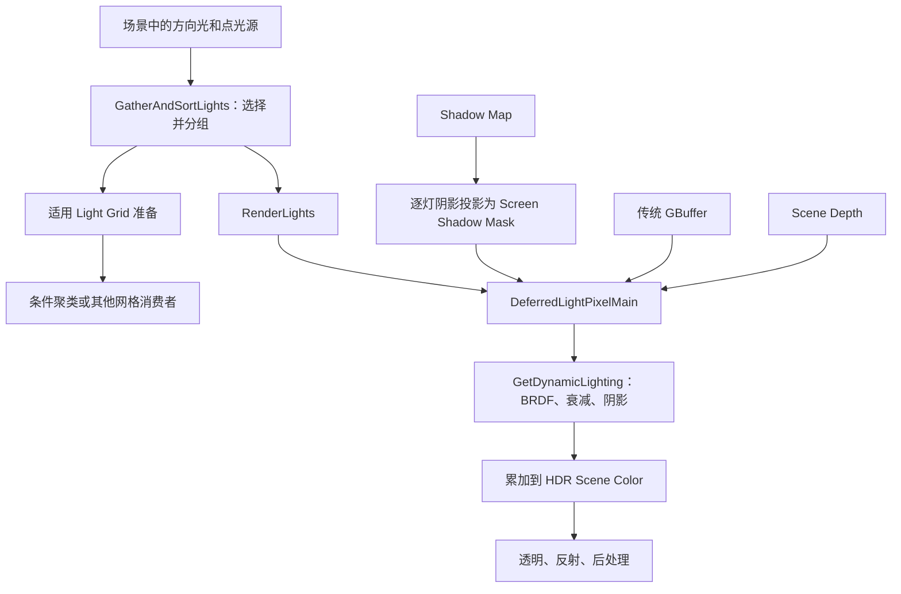
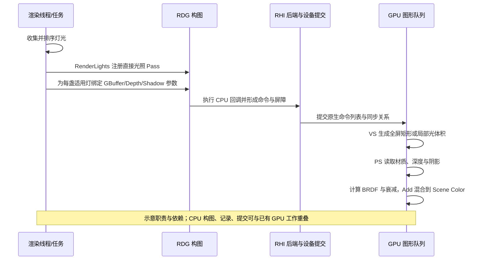

# 第 16 章：延迟直接光照

[返回目录](../README.md) · [本章答案](../appendices/answers/16-direct-lighting.md)

> **版本与范围：**UE 5.7.4，CL 51494982，Windows、D3D12、SM6、桌面延迟渲染。本章以配置 A 的传统材质、传统 GBuffer、普通 Shadow Maps、关闭 Lumen／VSM／硬件光追／MegaLights 为主线；配置 B 只在分支处说明 Substrate、VSM、Lumen 或聚类光照怎样改变输入和调用条件。
>
> **证据边界：**本章源码链接来自本地引擎静态阅读。标为“源码已确认”的内容对应链接中的实现；公式、像素数量和耗时是“教学简化”，没有运行 UE、RenderDoc 或 GPU 时间戳。源码中存在更多光源类型、头发、云和光追分支，本章先把普通不透明 P 与透明 Q 的主线讲清楚。

## 16.1 学习目标与前置知识

读完本章，你应能够：

1. 解释延迟光照（Deferred Lighting）为什么把“表面材质写入”和“逐灯计算”分开。
2. 从传统 GBuffer、Scene Depth、阴影结果和灯光参数恢复一个像素的受光条件。
3. 区分方向光的全屏绘制、点光源／聚光灯的体积几何绘制，以及聚类／分块路径。
4. 沿 UE 5.7 的 `GatherAndSortLights → RenderLights → RenderLight → DeferredLightPixelMain → GetDynamicLighting` 追踪代码和 Shader。
5. 说明 P 为什么在直接光照后得到受光颜色，而 Q 的透明薄片仍不走普通不透明 GBuffer 光照。

前置知识是第 03 章的深度测试和混合、第 04 章的 Lambert 与 GGX、第 09 章的 RDG、第 12 章的 Mesh Draw Command，以及第 13～15 章的深度、HZB 和阴影。这里继续使用同一场景：地面、红色不透明方块、金属球、蓝色 Unlit 半透明薄片、可移动方向光和点光源。P 是没有被薄片覆盖的方块像素，Q 是薄片覆盖方块的位置。

**延迟光照（Deferred Lighting）**指先在较早的几何阶段保存表面属性，再在后续光照阶段按屏幕像素读取这些属性。它使几何、材质求值和灯光遍历不必绑定为同一种工作组织，并能在主表面确定后按光源范围计算。前向渲染也可以在一次材质 Shader 中遍历多盏灯，所以不能用“前向必定每盏灯重画全部网格”来论证延迟的优势。**直接光照（Direct Lighting）**指光源经过一次可见传播直接到达表面的贡献；它不包括环境反弹等间接光照。

## 16.2 先建立一条可检查的整体链

在教学上，可以把配置 A 的直接光照理解成下面的数据关系。为了固定首次观察，本章在 A、B 主线均保持 `r.UseClusteredDeferredShading_ToBeRemoved=0`，聚类作为单独分支阅读；这个名字和弃用状态由 5.7 源码确认，见 16.4.3。两盏灯保持 Cast Shadows，Contact Shadow Length 为 0，不使用 Light Function、IES 光型文件或非默认 Lighting Channel。

[打开直接光照数据流静态图](../assets/diagrams/16-direct-lighting-1.png)



图中的箭头表达数据依赖，不表示 CPU、图形队列和 GPU 必须以一条串行时间线工作。渲染线程可以在构图时安排任务，光源排序也可能先于某些 GPU Pass 完成；`DeferredLightPixelMain` 只有在所需 GBuffer、深度和阴影资源的 GPU 访问依赖满足后才能正确读取。

### 16.2.1 CPU 与 GPU 各自做什么

| 工作 | 主要执行者 | 结果 |
|---|---|---|
| 维护 `FScene` 中的灯光代理 | 游戏线程与渲染线程交接 | `FLightSceneInfo`、Proxy、包围范围和灯光 ID |
| 判断光源是否适合当前 View、是否有阴影／Light Function | CPU 渲染任务 | `FSortedLightSetSceneInfo` 及排序范围 |
| 准备 Light Grid 或 ForwardLightData | CPU 构图加 GPU Compute，取决于配置 | 分块／聚类消费者可索引的灯光记录 |
| 创建每盏灯的 RDG Raster Pass 与参数 | 渲染线程 | 资源读写声明、Shader permutation、绘制回调 |
| 恢复世界位置、读取 GBuffer、计算 BRDF | GPU Pixel Shader | 每个受影响像素的直接光照贡献 |
| 写入 HDR Scene Color | GPU 光栅化与混合 | 后续反射、透明和后处理的场景颜色 |

**[教学简化]**如果场景只有一个方向光和一个点光源，CPU 可以把它们放入两个排序项；GPU 则可能执行一个全屏方向光 Pass 和一个点光体积 Pass。实际 UE 会把不带附加要求的灯归入便于连续绘制的范围；这里的 BatchedLights 标签不保证多个普通灯合为一次 Draw。聚类支持和启用时才会改走相应消费者。

### 16.2.2 P 与 Q 在这条链中的位置

- P 的方块表面在 Base Pass 已写入传统 GBuffer，在深度中有方块的设备深度；直接光照 Pixel Shader 用 P 的屏幕坐标读取它们，计算方向光和点光源贡献，再累加到 Scene Color。
- Q 的主不透明深度和 GBuffer 仍描述后方方块。蓝色薄片使用 Translucent、Unlit，不应被当成普通不透明 GBuffer 表面再次执行同一套延迟直接光照。它在透明阶段提供自己的颜色和 Opacity，由混合或后续合成组合背景；普通无折射薄片的 Pixel Shader 不需要直接采样背景纹理。

因此“一个屏幕像素执行一次光照”只是便于入门的说法。一个像素可能被方向光、多个点光源、阴影、环境遮蔽和后续效果多次读写；透明 Q 还会在背景之后追加自己的覆盖。

## 16.3 为什么要先筛选和排序光源

### 16.3.1 是什么、为什么需要

`GatherAndSortLights` 是 CPU 侧把 Scene 中的灯光变成当前 View 可处理集合的步骤。它不是光照计算本身，而是决定哪些灯、以什么类别和顺序进入后续 Pass。没有这一步，渲染器就必须让每个 Pass 重新检查所有场景灯光，且难以把状态相似的灯放在一起。

**光源函数（Light Function）**是调制灯光空间分布的材质，例如使照明出现变化的图案；它不是直接贴在方块上的表面贴图。**照明通道（Lighting Channels）**是灯光和表面的位掩码，交集决定是否允许对应照明关系。**IES 光型文件（IES Light Profile）**描述实际灯具的方向性分布。这些都能改变逐灯求值或资源准备，所以排序必须记录它们。本例先保持默认通道且没有函数或 IES，之后每次单独添加对照。

**[源码已确认]** `FSceneRenderer::GatherAndSortLights` 先按 View 检查 `ShouldRenderLight`，为灯光填入类型、阴影、Light Function、Lighting Channel 等排序字段；随后按 `Packed` 排序，并扫描出 `SimpleLightsEnd`、`ClusteredSupportedEnd`、`UnbatchedLightStart` 和 `MegaLightsLightStart` 等范围。[打开实现](G:/UnrealEngineInstalled/UE_5.7/Engine/Source/Runtime/Renderer/Private/LightRendering.cpp:1301)

缺少筛选的结果不是“画面一定黑”，而是更多无效工作、错误的多 View 处理或不适合的 Shader 路径。一个灯被排除可能是它不影响当前 View，也可能是 Show Flag、反射覆盖或功能条件拒绝；不能只看灯光是否存在于关卡。

### 16.3.2 输入、处理、输出和条件

| 八维问题 | 本步骤的回答 |
|---|---|
| 是什么 | CPU 建立当前 View 的排序灯光集合 |
| 为什么 | 统一筛选和状态分类，减少后续重复检查与切换 |
| 输入 | `Scene->Lights`、Simple Lights、Views、Show Flags、灯光 Proxy |
| 处理 | 可见性检查，读取阴影／Light Function／通道能力，生成排序键并分段 |
| 输出 | `FSortedLightSetSceneInfo`，包含排序数组与各范围边界 |
| UE 实现 | `FSceneRenderer::GatherAndSortLights` 与 `FLightSceneInfo::ShouldRenderLight` |
| 条件 | DirectLighting Show Flag、View、动态阴影质量、Light Function、MegaLights 许可等 |
| 成本与误区 | CPU 扫描和排序有成本；“排序”不是 GPU 已经按该顺序完成光照 |

配置 A 中关闭 MegaLights 后，方向光和点光源仍由传统延迟路径处理。B 也保持 MegaLights 关闭。只有第 25 章独立实验改变许可和适用灯设置时，排序键才可能把相应灯放入该范围。

### 16.3.3 一个具体排序例子

**[教学简化]**假设只有方向光 D、点光源 L 和一个不影响当前 View 的灯 X：

```text
遍历 Scene->Lights：D -> ShouldRenderLight=true，加入；
                  L -> true，加入；
                  X -> false，跳过。
排序结果：D（方向、带阴影）可能进入 unbatched；
          L（点、无阴影）可能进入 clustered-supported 或批量范围。
```

这不是承诺 D、L 的最终数组下标。真实排序键还包含灯光类型、阴影、Lighting Channel、Light Function 和其他位；同样的两个灯在改变功能开关后可能进入不同范围。

## 16.4 光源组织的三条 GPU 路径

### 16.4.1 方向光：全屏覆盖但用深度和材质判断

方向光的光线方向在场景范围内近似相同，因此无需为每个像素绘制一个有限球体。`InternalRenderLight` 对方向光绑定 `FDeferredLightVS`，使用 `DrawRectangle` 覆盖当前 View Rect，像素 Shader 再通过深度和 GBuffer 判断该像素是否是可受光表面。[源码已确认](G:/UnrealEngineInstalled/UE_5.7/Engine/Source/Runtime/Renderer/Private/LightRendering.cpp:2669)

全屏并不等于每个像素都做昂贵光照。Shader 先检查 GBuffer 的 ShadingModelID；天空、Unlit 或不适用像素会跳过主要计算。深度仍用于从屏幕位置恢复世界位置，阴影遮罩决定光能是否被挡住。

### 16.4.2 点光源和聚光灯：局部几何减少像素范围

对于点、聚光和矩形光，`InternalRenderLight` 选择 radial permutation，并绑定代表光源范围的顶点参数。若相机在光源几何内部，光栅化状态需要绘制相应面；若相机在外部，则用几何体的背面／正面和深度关系限制受影响区域。源码还设置深度模板和可选 Depth Bounds，以跳过不会被该局部光影响的样本。[源码已确认](G:/UnrealEngineInstalled/UE_5.7/Engine/Source/Runtime/Renderer/Private/LightRendering.cpp:2700)

把这个过程说得更具体：**[源码已确认]**相机位于光源范围内部或足够接近时，渲染背面并选择 `CF_Always`，否则渲染前面并使用 `CF_DepthNearOrEqual`；两者都不写主深度，实际剔除方向还结合 View 的反向剔除标志。参见[范围光栅状态](G:/UnrealEngineInstalled/UE_5.7/Engine/Source/Runtime/Renderer/Private/LightRendering.cpp:2434)与[深度状态](G:/UnrealEngineInstalled/UE_5.7/Engine/Source/Runtime/Renderer/Private/LightRendering.cpp:2486)。

从外面观察时，若不透明表面比光源体积最前侧还靠近相机，它不在该体积内部，深度比较便能提前排除。相机在体积内部时，最前侧可能已在近裁剪面之外，需要换用背面覆盖与更宽松的深度判断，随后靠 Shader 的局部衰减排除不受影响表面。这是一次光照范围绘制，不是在 Scene Depth 中添加一个看得见的球。

**深度范围测试（Depth Bounds Test，DBT）**进一步判断已有深度是否在选定范围内。源码通过光源 Bounds、视图投影和设备支持准备它，仍不能把它当作所有 D3D12 硬件都无条件执行的阶段。相机与近裁剪面的关系也使真实范围比简单的球心距离判断更保守。

**为什么点光源不能简单画一个屏幕圆？**光照衰减取决于像素恢复出的世界位置到光源中心的距离，投影轮廓在透视相机下也不总是一个简单二维圆。绘制光源体积提供了保守覆盖，Pixel Shader 仍会计算真实距离、方向和衰减。

### 16.4.3 Clustered Deferred：先把灯写入屏幕分块

**分块延迟光照（Tiled Deferred）**把屏幕分成二维小块；**聚类延迟光照（Clustered Deferred）**还按深度切成多个层。每个 tile 或 cluster 保存可能影响它的灯光索引，像素 Shader 只遍历自己的短列表。

**[源码已确认]**在 `RenderLights` 中，若平台支持 `ShouldUseClusteredDeferredShading` 且 `AreLightsInLightGrid()` 为真，渲染器把 `StandardDeferredStart` 移到 `ClusteredSupportedEnd`，并调用 `AddClusteredDeferredShadingPass`；否则保留传统逐灯或批量路径。[源码](G:/UnrealEngineInstalled/UE_5.7/Engine/Source/Runtime/Renderer/Private/LightRendering.cpp:1577)

**本版边界需要单独记录。**[ClusteredDeferredShadingPass.cpp:34](G:/UnrealEngineInstalled/UE_5.7/Engine/Source/Runtime/Renderer/Private/ClusteredDeferredShadingPass.cpp:34) 把旧名 `r.UseClusteredDeferredShading` 标为 5.7 弃用别名，实际变量为 `r.UseClusteredDeferredShading_ToBeRemoved`，C++ 初值 0，帮助说明未来将移除该实现。只读项目支持变量 `r.ClusteredDeferredShading.EnableForProject` 初值为 1；运行函数还要求 FeatureLevel 至少 SM6 和平台支持 VSM。后一个判断是平台能力，不等同于当前已经启用 `r.Shadow.Virtual.Enable=1`。帮助文字仍提 SM5，精确条件应以 [ShouldUseClusteredDeferredShading:57](G:/UnrealEngineInstalled/UE_5.7/Engine/Source/Runtime/Renderer/Private/ClusteredDeferredShadingPass.cpp:57) 为准。

它不是本书现代配置 B 的自动替换项，也不是观察到 `ForwardLightData` 就能证明正在执行的路线。Light Grid 可以供多个系统使用；桌面延迟渲染器调用 `PrepareForwardLightData`，不意味着项目改成了 Forward Shading。源码在[主调度](G:/UnrealEngineInstalled/UE_5.7/Engine/Source/Runtime/Renderer/Private/DeferredShadingRenderer.cpp:2705)准备数据后才设置 `bAreLightsInLightGrid`。

**[教学简化]**假设屏幕 1280×720，tile 为 16×16，则二维 tile 数为 `ceil(1280/16) × ceil(720/16) = 80×45 = 3600`。若每个 tile 的列表平均含 4 盏灯，总列表项约为 14,400；这不是只有 14,400 次像素光照，每个有效像素仍要按自己的列表求值。完全覆盖情况下，遍历数量可按 `921,600×4=3,686,400` 作理想化估算。若全场景有 100 盏灯，直接遍历完整列表则为 `92,160,000`；真实性能还取决于构表、重叠、分支和存储成本。

16 像素是这个算例自选的尺寸。本版 [LightGridInjection.cpp:65](G:/UnrealEngineInstalled/UE_5.7/Engine/Source/Runtime/Renderer/Private/LightGridInjection.cpp:65) 为 `r.Forward.LightGridPixelSize` 登记初值 64，为 `r.Forward.LightGridSizeZ` 登记初值 32。真实 Grid 还涉及视图范围、深度分布和层级构建，不能把二维示意直接当 UE 运行布局。网格保存灯光索引，灯光参数本体在另一组可索引记录中；格子不是为所有相交灯提前算好一个固定颜色。

### 16.4.4 路径对照与直接光照八维定位

| 路径 | 输入 | 主要处理 | 输出与限制 |
|---|---|---|---|
| 全屏方向光 | GBuffer、深度、阴影、灯光 Uniform | 每像素恢复位置并算一次方向光 | 覆盖大，需跳过天空／Unlit |
| 局部光体积 | 光源包围范围、GBuffer、深度、阴影 | 光源几何限制像素，再算距离衰减 | 光源多时逐灯 Pass 数可能增加 |
| Clustered Deferred | Light Grid、GBuffer、深度、阴影 | 每像素索引所在 cluster 的灯列表 | 适合大量兼容局部灯；带特殊阴影／Light Function 的灯可能回退 |

路径选择不是材质 Base Color 的结果，而是灯光能力、平台和控制变量共同决定。不能看到 `AddClusteredDeferredShadingPass` 就断言本章配置 A 的两个灯一定使用聚类。

| 八维问题 | 直接光照阶段 |
|---|---|
| 是什么 | 在已有不透明表面描述上求适用灯光直接贡献 |
| 为什么 | 材质属性尚未包含当前灯光、视角和遮挡；跳过会缺少这些贡献 |
| 输入 | GBuffer、主深度、View、灯参数、阴影／通道；条件 Light Grid |
| 处理 | 确定覆盖范围、恢复表面位置、解码属性、求衰减和 BRDF、累加 |
| 输出 | 与已有颜色同尺度的 HDR Scene Color；不替换方块的 GBuffer |
| 实现 | 下文的 RenderLights、参数绑定、RDG Raster 和 Shader 求值链 |
| 条件 | 主延迟光照门槛、DirectLighting Show Flag、每灯及每像素适用性 |
| 成本与误区 | CPU 组织、GPU 覆盖与 BRDF／阴影采样、附件读写；无屏幕贡献不等于无执行成本 |

带阴影的局部光是否能参与聚类也有明确证据：[DeferredShadingRenderer.cpp:2257](G:/UnrealEngineInstalled/UE_5.7/Engine/Source/Runtime/Renderer/Private/DeferredShadingRenderer.cpp:2257)要求聚类已选中、VSM One Pass Projection 启用且 VSM Array 有效，才设置 `bShadowedLightsInClustered`。A 不满足这些条件。方向光本身也被聚类兼容判断排除，不需要把一个无限方向光写进每个有限格子。

## 16.5 一个灯光 Pass 如何从 RDG 走到 Shader

### 16.5.1 `RenderLights` 的阶段入口

在 `DeferredShadingRenderer.cpp` 中，渲染器先启动 `GatherAndSortLights` 任务；待需要的 CPU 结果可用后，将 `SortedLightSet` 传给 `RenderLights`。[源码已确认](G:/UnrealEngineInstalled/UE_5.7/Engine/Source/Runtime/Renderer/Private/DeferredShadingRenderer.cpp:3312)

`RenderLights` 建立 `DirectLighting` 与 `BatchedLights` 等 RDG 事件范围。配置 A 的核心直观路线是：无阴影或可批处理灯可能共享相关目标绘制；带阴影的灯先获得屏幕阴影遮罩，再在 Unbatched 区域调用 `RenderLight`。**RDG 事件名字是调试组织，不等于一个事件只对应一个 GPU Draw。**

第 15 章的阴影深度与这里的阴影投影必须分开。深度记录从光源观察哪些表面较近；`RenderDeferredShadowProjections` 把这些证据转换为主 View 的衰减。A 的 Unbatched 路径先调用[阴影投影:2236](G:/UnrealEngineInstalled/UE_5.7/Engine/Source/Runtime/Renderer/Private/LightRendering.cpp:2236)，再将当前灯的遮罩送进[RenderLight:2309](G:/UnrealEngineInstalled/UE_5.7/Engine/Source/Runtime/Renderer/Private/LightRendering.cpp:2309)。没有实际写过的遮罩会被置空，参数绑定改用白色占位输入，避免把无效内容当阴影。下一盏灯可能复用适用存储，但上一使用者必须按资源依赖先读完。

因此逐灯路线可能呈现“灯 D 的投影 → 灯 D 光照 → 灯 L 的投影 → 灯 L 光照”。不能把全帧写成唯一的“所有阴影相关 Pass 一次结束，之后完全不再出现阴影处理”。阴影几何生成、屏幕投影和最终着色是三种不同工作。

[打开参数到 GPU 执行静态图](../assets/diagrams/16-direct-lighting-2.png)



### 16.5.2 Pass 参数真正读了什么

`RenderLight` 为 `FRenderLightParameters` 填充 Vertex Shader 与 Pixel Shader 参数。关键输入包括：

| 输入 | 作用 |
|---|---|
| `SceneTextures.Color.Target` | 作为当前 HDR Scene Color 的读写目标，常见为加载已有颜色后 Add |
| `SceneTextures.Depth.Target` | 重建世界位置、深度测试和局部光体积限制 |
| `SceneTextures.UniformBuffer` | 统一提供 Scene Textures，包括传统 GBuffer |
| `ScreenShadowMaskTexture` | 普通阴影投影或屏幕阴影遮罩 |
| `LightingChannelsTexture` | 让灯只影响匹配 Lighting Channel 的表面 |
| `DeferredLight` | 方向、颜色、半径、衰减、光源类型等灯光常量 |
| `VirtualShadowMapUniformBuffer` | 仅适用 VSM 分支；A 为无效或不注册的分支 |

**[源码已确认]**非 Substrate 的 `FDeferredLightPS` permutation 在 `RenderLight` 中读取传统 `GetDeferredLightPSParameters`，再通过 `InternalRenderLight` 注册 RDG Raster Pass；Substrate 开启时还会注册多类 tile 参数。[实现入口](G:/UnrealEngineInstalled/UE_5.7/Engine/Source/Runtime/Renderer/Private/LightRendering.cpp:2839)

### 16.5.3 为什么 Scene Color 能被多盏灯累加

对不透明 P，Base Pass 已产生初始场景颜色或可供光照的目标。**[源码已确认]** `GetDeferredLightPSParameters` 在[第 2600 行](G:/UnrealEngineInstalled/UE_5.7/Engine/Source/Runtime/Renderer/Private/LightRendering.cpp:2600)以 `ELoad` 绑定 Scene Color，保留此前结果；`SetupLightGraphicsPSOState` 的 A 分支在[第 2633 行](G:/UnrealEngineInstalled/UE_5.7/Engine/Source/Runtime/Renderer/Private/LightRendering.cpp:2633)设置 `BO_Add`、源因子 `BF_One` 和目标因子 `BF_One`。Shader 输出乘一，已有颜色乘一，两者相加。这就是累加，而不是一次光照又从黑色清除。

颜色附件的目标加载和硬件混合会消费原有颜色，不要求当前 Pixel Shader 显式对同一 Scene Color 采样。RDG 的参数声明必须覆盖附件读写；混合这种依赖不能因为 HLSL 中没有 `SceneColor.Sample` 就省略。

**[教学简化]**若 P 的当前线性 Scene Color 为 `(0.02,0.01,0.01)`，方向光贡献为 `(0.30,0.10,0.04)`，点光贡献为 `(0.05,0.02,0.01)`，则累加后为：

```text
(0.02,0.01,0.01) + (0.30,0.10,0.04) + (0.05,0.02,0.01)
= (0.37,0.13,0.06)
```

本算例明确把三个输入都放在同一线性、预曝光后的场景尺度上。它们是给定的阶段输入，和第一章光强／曝光设置不是一组实测对应值。后续曝光补偿、色调映射与输出编码仍会影响显示值。

**[源码已确认]** [DeferredLightPixelShaders.usf:404](G:/UnrealEngineInstalled/UE_5.7/Engine/Shaders/Private/DeferredLightPixelShaders.usf:404) 在输出前把 RGBA 乘 `GetExposure()`，这个函数在[第 121 行](G:/UnrealEngineInstalled/UE_5.7/Engine/Shaders/Private/DeferredLightPixelShaders.usf:121)返回 `View.PreExposure`。所以新灯贡献必须与已有场景颜色使用同一尺度，不能一个乘过预曝光、另一个没有乘就相加。这里 Alpha 也有专门的非镜面亮度等用途，不能当作该不透明表面的 Opacity。

### 16.5.4 从灯光代理追到 Uniform Buffer

**统一参数缓冲（Uniform Buffer）**集中提供一组 Shader 常量。名字中的 Uniform 不表示画面中每个像素最终颜色相同，而是一次绘制读取同一组灯光参数；各像素的位置和法线仍不同。

**[源码已确认]** [GetDeferredLightParameters:623](G:/UnrealEngineInstalled/UE_5.7/Engine/Source/Runtime/Renderer/Private/LightRendering.cpp:623)调用 `LightSceneInfo.Proxy->GetLightShaderParameters`，再通过 `MakeShaderParameters` 处理观察坐标与曝光相关输入，添加阴影距离渐变、通道和接触阴影等字段。关闭静态光照时，预计算阴影通道掩码被清零。局部光的屏幕距离渐隐也能缩放光色，所以编辑器面板上的强度并非到 Shader 入口仍完全未经处理的数字。

随后 [CreateDeferredLightUniformBuffer:2533](G:/UnrealEngineInstalled/UE_5.7/Engine/Source/Runtime/Renderer/Private/LightRendering.cpp:2533)在 GraphBuilder 中分配参数并建立缓冲。C++ 的 [FDeferredLightPS Shader 注册:1144](G:/UnrealEngineInstalled/UE_5.7/Engine/Source/Runtime/Renderer/Private/LightRendering.cpp:1144)把类型接到 `DeferredLightPixelShaders.usf` 的 `DeferredLightPixelMain`。Shader 内的 [InitDeferredLightFromUniforms:9](G:/UnrealEngineInstalled/UE_5.7/Engine/Shaders/Private/LightDataUniforms.ush:9)还原位置、InvRadius、颜色、方向与来源形状等，组成 `FDeferredLightData`。

这样能把“游戏里的点光源有一个半径”落实为跨层数据路线：Proxy 参数 → 转成适用 Shader 参数 → RDG Uniform Buffer → `InvRadius` → 每像素局部衰减。单看某个 C++ 函数名，无法替代这条字段追踪。

## 16.6 Shader 内部：从屏幕坐标到 BRDF

### 16.6.1 恢复 P 的世界位置

传统 `DeferredLightPixelShaders.usf` 的 [DeferredLightPixelMain:233](G:/UnrealEngineInstalled/UE_5.7/Engine/Shaders/Private/DeferredLightPixelShaders.usf:233) 首先取得像素位置、Screen UV 和 Screen Vector；随后 `CalcSceneDepth` 将主深度按接口转换为所需场景深度，[GetDerivedParams:97](G:/UnrealEngineInstalled/UE_5.7/Engine/Shaders/Private/DeferredLightPixelShaders.usf:97)通过 `View.ScreenToTranslatedWorld` 或方向光的屏幕向量恢复 Translated World Position。这是**[源码已确认]**的两个关联入口，不能把设备反向 Z 的原值未经转换直接乘一个世界射线。

恢复过程的教学式写法是：

```text
depth = SceneDepth(UV)
worldPosition = ReconstructFromInverseProjection(UV, depth)
V = normalize(CameraPosition - worldPosition)
L = normalize(LightPosition - worldPosition)   // 本例局部光，方向由表面指向灯
```

真实 Shader 使用反向 Z、Translated World、投影类型和 Uniform Buffer 中的矩阵；不要把上面的伪代码当作可直接替换的 HLSL。

### 16.6.2 读取 GBuffer 和选择材质模型

配置 A 的 Shader 在 `SUBSTRATE_ENABLED==0` 分支调用 `GetScreenSpaceData`，取得含 GBuffer 解码结果和相关屏幕 AO 的结构。法线、Diffuse、Specular、Roughness 与 ShadingModelID 属于表面描述；屏幕 AO 和材质 AO 需分别追踪，不能说它们必定是同一通道。若 ShadingModelID 不适用，跳过主要直接光照。源码分支见 [DeferredLightPixelShaders.usf:368](G:/UnrealEngineInstalled/UE_5.7/Engine/Shaders/Private/DeferredLightPixelShaders.usf:368)。

这里的“读取 GBuffer”不等于把一张图复制到 CPU。Pixel Shader 按当前屏幕样本和纹理采样规则从 GPU 资源读取，之后立即进行计算。材质的原始节点图也不会在这个阶段重新执行一遍；Base Pass 已把当前配置所需的结果编码进可读取资源。

### 16.6.3 光源衰减与阴影

Shader 初始化 `FDeferredLightData`，传统路线在后续累加函数里对局部光调用 `GetLocalLightAttenuation`；入口通过 `GetLightAttenuationFromShadow` 取得阴影相关衰减输入。配置 A 中该函数返回屏幕阴影遮罩的值；配置 B 的适用 VSM 分支可从 `ShadowMaskBits` 读取光源对应的掩码。[源码](G:/UnrealEngineInstalled/UE_5.7/Engine/Shaders/Private/DeferredLightPixelShaders.usf:133)

**阴影不是把颜色改成黑色的独立材质。**它通常作为 `0～1` 的可见性因子或更复杂的遮挡／软阴影权重参与光能；完全遮挡时近似 0，无遮挡时近似 1，半影可能处于中间值。接触阴影、光源函数、云透射和光追遮挡还会继续修改这个因子。

先区分**物理距离衰减**和**有限影响半径的淡出**。理想点光源的能量会随距离平方减少；引擎还需要把有限半径以外的贡献逐渐降到零，才能给可见性和 Light Grid 一个有限范围。

**[源码已确认]** [GetLocalLightAttenuation:246](G:/UnrealEngineInstalled/UE_5.7/Engine/Shaders/Private/DeferredLightingCommon.ush:246)用 `ToLight = LightPosition - SurfacePosition` 得到方向与距离平方。在 inverse-squared 分支，本处计算的主要范围因子可写为：

```text
x = DistanceSquared * InvRadiusSquared = (distance / radius)^2
RangeMask = saturate(1 - x^2)^2
```

距离为半径一半时，`x=0.25`，范围因子为 `(1-0.0625)^2=0.87890625`；到达半径时为 0。这里只解释范围淡出，不能误以为它已经包括完整 `1/distance²`。

**[源码已确认]**非矩形光随后使用 Capsule 形状参数，[CapsuleLightIntegrate.ush:36](G:/UnrealEngineInstalled/UE_5.7/Engine/Shaders/Private/CapsuleLightIntegrate.ush:36)在适用点状分支准备 `rcp(DistSqr+DistBiasSqr)` 等 Falloff，再按 inverse-squared 条件使用它。Source Length 和 Source Radius 非零时还涉及线／球形光源近似。有限半径、光源形状和数值稳定项说明真实实现并不是一条没有条件的理想反平方公式。

阴影遮罩也不是“RGBA 都是同一可见性”。[GetShadowTermsBase:94](G:/UnrealEngineInstalled/UE_5.7/Engine/Shaders/Private/DeferredLightingCommon.ush:94)在 `ShadowedBits` 分支内区分：普通局部光的表面遮挡主要读 `.z`，方向光的全场景动态遮挡读 `.x`，再叠加距离渐变与 `.z` 中的适用贡献；透射有自己的通道。A 关闭静态光照时 `StaticShadowing=1`，并不意味着动态阴影也为 1。

AO 同样不能在最终颜色上无条件再乘一次。传统累加函数先以 AmbientOcclusion 初始化 `SurfaceShadow`，随后 `GetShadowTerms` 会在具体灯光阴影分支覆盖或调整它；本例带阴影的局部灯和方向灯应按上面的通道逻辑解释。第 17 章会继续区分屏幕 AO 的独立合成、直接光照的参数消费以及环境反射遮蔽。

### 16.6.4 BRDF 的最小数学模型

对配置 A 的 Default Lit，先用一个简化的直接光照式理解：

```text
L_o = (DiffuseColor / π) * LightColor * NoL * Shadow
    + SpecularBRDF(N, V, L, Roughness) * LightColor * NoL * Shadow
```

- `L_o`：离开表面的直接光照辐射亮度（教学量）。
- `DiffuseColor`：GBuffer 中的非金属漫反射颜色。
- `N`：GBuffer 法线；`V`：表面指向相机；`L`：表面指向光源。
- `NoL=max(dot(N,L),0)`：入射光与法线夹角的余弦。
- `Shadow`：阴影和其他衰减的乘积。
- `SpecularBRDF`：由粗糙度、视线和半角向量决定的镜面响应；UE 采用 GGX 相关函数，而不是一个常数高光。

**[源码已确认]** `DeferredLightPixelShaders.usf` 的传统分支调用 `GetDynamicLighting`；它经 `GetDynamicLightingSplit`、`AccumulateDynamicLighting`、适用光源形状的 `IntegrateBxDF`，最后由 ShadingModelID 选择 `DefaultLitBxDF`。中间并非直接跳转：光源形状积分、局部衰减、阴影和能量项分别承担不同责任。[累加入口](G:/UnrealEngineInstalled/UE_5.7/Engine/Shaders/Private/DeferredLightingCommon.ush:317)、[包装函数](G:/UnrealEngineInstalled/UE_5.7/Engine/Shaders/Private/DeferredLightingCommon.ush:472)、[模型分派](G:/UnrealEngineInstalled/UE_5.7/Engine/Shaders/Private/ShadingModels.ush:1073)、[Default Lit](G:/UnrealEngineInstalled/UE_5.7/Engine/Shaders/Private/ShadingModels.ush:203)。

在普通漫反射变体中使用 Lambert；`MATERIAL_ROUGHDIFFUSE` 则选粗糙漫反射近似。Default Lit 也有各向异性、矩形光与能量修正分支，所以前面的公式是入门关系式，不是声称所有 Default Lit 都只有两项原样相加。这些传统函数带有被 Substrate 取代的 5.7 弃用注释，但配置 A 的关闭 Substrate 路线仍在本版源码中引用它们。

#### GGX 的三个因子怎样落到代码

**微表面（Microfacet）**模型把表面统计性地看成许多微小镜面。它不是让 GPU 真的为每个像素生成那些微小三角形，而是用粗糙度和方向关系计算它们的统计响应。

- `D`：法线分布函数（Normal Distribution Function），描述有多少微表面朝向半角方向。
- `Vis`：几何可见性和归一化组合，考虑微表面彼此遮挡并包含 BRDF 分母的相关处理。
- `F`：菲涅耳（Fresnel）项，描述反射比例怎样随观察角度变化。

半角向量 `H=normalize(V+L)` 是视线与光线的中间方向。`NoH=dot(N,H)`、`NoV=dot(N,V)`、`VoH=dot(V,H)` 是源码中的简写，须使用约定归一化向量与适用截断。

**[源码已确认]**各向同性 [SpecularGGX:171](G:/UnrealEngineInstalled/UE_5.7/Engine/Shaders/Private/ShadingModels.ush:171)先令 `a2=Roughness^4`，再计算 `D_GGX(a2,NoH)`、`Vis_SmithJointApprox(a2,NoV,NoL)`、`F_Schlick(SpecularColor,VoH)`，返回 `(D*Vis)*F`，并考虑有限光源的能量归一化。不能误把 `a2` 当成 Roughness 本身。

**[教学简化]**为拆开公式，取点状光、正对观察与入射，令 `N=V=L=H`，Roughness 为 0.5，非金属 `F0=(0.04,0.04,0.04)`，暂令光源能量归一化为 1，不计后续能量修正：

```text
a2 = 0.5^4 = 0.0625
NoH = NoV = NoL = VoH = 1
D = a2 / (π * (NoH²*(a2-1)+1)²) = 16/π ≈ 5.092958
Vis = 0.25
F = F0 = 0.04
SpecularBRDF ≈ 5.092958 * 0.25 * 0.04 = 0.050930 每通道
```

公式来自 [D_GGX:331](G:/UnrealEngineInstalled/UE_5.7/Engine/Shaders/Private/BRDF.ush:331)、[Vis_SmithJointApprox:393](G:/UnrealEngineInstalled/UE_5.7/Engine/Shaders/Private/BRDF.ush:393)、[F_Schlick:423](G:/UnrealEngineInstalled/UE_5.7/Engine/Shaders/Private/BRDF.ush:423)。`D` 大于 1 不是“反射了五倍总能量”：它是方向分布密度，尖锐分布在少量方向可以取较高数值。总能量涉及方向积分和模型组合。

最终 [DefaultLitBxDF:276](G:/UnrealEngineInstalled/UE_5.7/Engine/Shaders/Private/ShadingModels.ush:276)还会取得能量项，对漫反射作能量保留修正，对镜面作微表面多次散射修正。这也说明本小节手算只负责把核心因子拆开；它不是绕开实际能量策略得到的引擎真值。

#### 数值例子：P 的方向光

**[教学简化]**设 `DiffuseColor=(0.8,0.1,0.05)`、`LightColor=(1,1,1)`、`NoL=0.5`、`Shadow=0.8`，暂时忽略镜面项：

```text
Diffuse = (0.8,0.1,0.05)/π * 1 * 0.5 * 0.8
       ≈ (0.1019, 0.0127, 0.0064)
```

如果之后点光源为 `(0.05,0.02,0.01)`，则 RGB 逐通道相加。真实 UE 还使用光强、单位、预曝光、能量守恒、材质模型和色调映射，不能把这个简化数值直接与屏幕截图比较。

### 16.6.5 Substrate 分支怎样改变读取方式

配置 B 选定 **Blendable GBuffer**。源码在 `SUBSTRATE_GBUFFER_FORMAT==0` 时关闭从 Material Container 加载的宏，在 Substrate 分支读取屏幕 GBuffer，再通过 `SubstrateReadGBufferBSDF` 构造 BSDF，交给 `SubstrateDeferredLighting`。其他 Substrate 配置才可能从 Material Texture Array 读取 Pixel Header 和多个闭包，不能将它作为 B 的固定流程。[宏与输入约定](G:/UnrealEngineInstalled/UE_5.7/Engine/Shaders/Private/DeferredLightPixelShaders.usf:30)、[分支读取](G:/UnrealEngineInstalled/UE_5.7/Engine/Shaders/Private/DeferredLightPixelShaders.usf:262)、[BSDF 与求值](G:/UnrealEngineInstalled/UE_5.7/Engine/Shaders/Private/DeferredLightPixelShaders.usf:324)。

**双向散射分布函数（Bidirectional Scattering Distribution Function，BSDF）**是描述反射和透射等散射关系的更一般术语；前面的 BRDF 只关注反射。**闭包（Closure）**在这里是供求值的一份散射描述，不是 C++ Lambda 的闭包。具体材质表示及可组合关系见第 21 章。

本章不把 Substrate 的存储布局、tile 类型和混合闭包展开成另一条主线；第 21 章会单独解释。可先记住：**直接光照阶段的“读取表面描述→按光源求贡献”关系仍在，但表面描述的编码和可选工作集发生变化。**

## 16.7 P 与 Q 的完整追踪

### 16.7.1 P：不透明方块表面

1. A 的完整预通道已准备方块的主深度；Base Pass 用方块材质求出 Base Color、Metallic、Roughness、Normal 和 ShadingModelID，按已有深度关系写入传统 GBuffer，不把本例误读成 Base Pass 再无条件写一次主深度。
2. `GatherAndSortLights` 发现方向光 D 与点光源 L 对当前 View 有效，把它们分入适用范围。
3. 在本章关闭聚类、两灯均带普通动态阴影的 A 中，`RenderLights` 先准备对应灯的屏幕阴影投影，再为 D 注册全屏方向光 Pass，为 L 注册局部光体积 Pass。
4. P 的 Pixel Shader 读取方块深度，恢复世界位置；从 GBuffer 取红色漫反射、法线和金属参数；从阴影遮罩取 D/L 的可见性。
5. Default Lit BRDF 计算漫反射和镜面贡献，通过 Add 混合写入 HDR Scene Color。
6. 在本章追踪的直接光照累加完成点，P 仍是预曝光的线性 HDR 中间结果；标准不透明反射合成与最终 TAA／色调映射尚未完成。其他配置的部分间接照明工作可以已经开始，不能把全帧所有准备工作都排到这个点之后。

### 16.7.2 Q：透明薄片覆盖处

1. 不透明几何阶段先让后方方块写入 Q 位置的深度和 GBuffer；Q 的背景因此可被直接光照。
2. 透明薄片没有作为普通不透明表面参加这套传统 GBuffer 直接光照。它的 Translucent、Unlit 材质在透明阶段产生自己的蓝色 Emissive 与 Opacity，混合或后续合成再组合背景；无需把背景采样写进这个材质的 Shader。
3. 把源色和背景放在同一线性尺度，简单透明合成可以写成 `C_out = C_src*α + C_dst*(1-α)`。本节另取教学源色 `C_src=(0.1,0.6,1.0)`、`α=0.35`、背景 `C_dst=(0.37,0.13,0.06)`；它不是第一章 Emissive 300 在固定曝光下已经测得的值。得到：

```text
C_out = (0.1,0.6,1)*0.35 + (0.37,0.13,0.06)*0.65
      = (0.2755, 0.2945, 0.389)
```

这是单层、非预乘输入颜色的线性混色；如果中间目标保存预乘颜色，合成端需按其约定使用。透明排序和合成时机也影响真正的输入背景。Q 的结果不能反推为“薄片修改了方块的 GBuffer”。

### 16.7.3 主调度为何把 AO 和间接合成放在不同位置

**[源码已确认]** [DeferredShadingRenderer.cpp:3254](G:/UnrealEngineInstalled/UE_5.7/Engine/Source/Runtime/Renderer/Private/DeferredShadingRenderer.cpp:3254)的光照区域先调用 `RenderDiffuseIndirectAndAmbientOcclusion` 的非“仅常规 Lumen 合成”路线，之后处理适用间接阴影及透明光照体积准备，再调用 `RenderLights`。随后可调用 MegaLights、透明光照体积，再调用“仅常规 Lumen 合成”路线，最后进入不透明反射与天空光合成。

这不是本书把章节顺序写错。教学先讲直接光照，使第 17 章可以解释“还缺什么贡献”；真实调度则根据数据与重叠机会安排工作。配置 A 没有 Lumen，两个同名函数的调用也不意味着它计算了两遍 Lumen。必须继续看 `bCompositeRegularLumenOnly`、视图方法和函数体中的早退条件。

在 A 的普通无自发光不透明表面上，Base Pass 没有烘焙或天空间接颜色时，先对已有 Scene Color 作 AO 调制不一定产生明显变化。不能从“画面没变暗”推断 AO 根本没有运行，更不能为了得到预期效果偷偷加 Sky Light 后仍称完全相同配置。

## 16.8 阶段开关、性能与常见误区

### 16.8.1 执行条件

- `ViewFamily.EngineShowFlags.DirectLighting` 关闭时，直接光照主路径可能被跳过；不要只看场景里有无灯。
- 外层 `bRenderDeferredLighting` 还要求 Lighting／DeferredLighting 显示标志、适用特性级别、GBuffer 与无光追覆盖显示，见 [DeferredShadingRenderer.cpp:2208](G:/UnrealEngineInstalled/UE_5.7/Engine/Source/Runtime/Renderer/Private/DeferredShadingRenderer.cpp:2208)。它与具体灯的 DirectLighting 标志分属不同门槛。
- 灯光必须通过 `ShouldRenderLight`，且当前 View、反射覆盖、灯光范围和 Show Flags 满足条件。
- 动态阴影质量、Light Function、Lighting Channels、灯光类型和光源特性会改变排序范围与 Shader permutation。
- 聚类／分块需要平台支持、有效 Light Grid 和兼容光源；带特殊阴影或函数的灯可能回退到逐灯。
- Substrate、VSM、光追阴影、MegaLights 会改变参数和工作分支；配置 A 不执行这些替代路径。
- 若场景没有有效不透明 GBuffer（例如纯天空或某些 Unlit 区域），Pixel Shader 会跳过相应材质模型。

### 16.8.2 性能来自哪里

1. CPU 侧来自灯光扫描、排序、阴影信息准备和可能的 Light Grid 构建。
2. GPU 侧来自受光像素数量、每像素灯光列表长度、GBuffer／深度读取、阴影采样和 BRDF 复杂度。
3. 方向光全屏 Pass 的像素数近似为 View Rect 面积；点光源数量增加会增加体积覆盖和光照遍历。
4. 聚类降低“每像素检查所有灯”的浪费，但 Light Grid 构建、列表容量和同步本身也有成本。
5. 金属球粗糙度低时，镜面 BRDF 和后续反射会使画面变化明显；这不等于直接光照独自提供完整环境反射。

**[教学简化]**1280×720 的方向光全屏 Pass 有 `921,600` 个屏幕样本上限；若只有 70% 像素属于有效 Lit 表面，理想化主计算样本约 `645,120`。这不是 GPU 执行线程数或时间测量，因为遮挡、Wave、早期测试、分辨率比例和 Shader 分支都会改变实际工作。

### 16.8.3 常见误区

- **“延迟光照意味着每盏灯只执行一次 Shader。”** 实际可能是全屏、局部体积、聚类或批处理等多种提交。
- **“GBuffer 里已经有最终颜色。”** GBuffer 主要保存表面描述；直接光照仍需读取深度、灯光和阴影。
- **“全屏方向光会照亮透明薄片。”** 透明材质是否受灯影响由透明路径和材质模型决定，本例薄片是 Unlit。
- **“关闭 Lumen 就没有任何光。”** 配置 A 仍有直接光照；关闭的是动态间接光照方法。
- **“Shadow=0 就是最终像素完全黑。”** 它至多说明对应直接贡献被抑制；其他光源、发光、间接光照或后续合成仍可能提供颜色。
- **“RenderLights 返回就代表 GPU 已算完。”** 它主要是注册和记录工作，GPU 完成要看命令提交与同步边界。

## 16.9 贯穿案例：只改变方向光方向

保持摄像机、材质、曝光、点光源和所有设置不变，把方向光绕世界 Y 轴旋转 90°。

1. 游戏侧更新灯光组件，渲染侧更新 `FLightSceneInfo` 的 Proxy；场景几何和 GBuffer 不变。
2. 下一帧 `GatherAndSortLights` 仍可能把同一方向光加入，但 `DeferredLight` 中的方向和阴影相关输入改变。
3. P 的 `N` 不变，`L` 改变，`NoL=max(dot(N,L),0)` 变化；红色 Base Color 没有改变。
4. 阴影视图也可能改变，导致 P 的 Shadow 因子变化；点光源仍在其原有范围内贡献。
5. Q 的背景方块先经历同样的直接光照变化，之后透明薄片按自己的颜色和 Opacity 合成，因此 Q 的最终变化不等于薄片材质参数被修改。

这个实验能把“场景数据更新”“灯光筛选”“GBuffer 读取”“光照结果”和“透明合成”串起来。它不能单独证明使用了聚类、VSM 或硬件光追；这些结论必须通过配置和对应源码／可视化检查确认。

## 16.10 源码阅读路线

建议按以下顺序打开本地文件：

1. [DeferredShadingRenderer.cpp：准备并调用 RenderLights](G:/UnrealEngineInstalled/UE_5.7/Engine/Source/Runtime/Renderer/Private/DeferredShadingRenderer.cpp:3254)，先确认直接光照在主渲染调度中的位置。
2. [LightRendering.cpp：GatherAndSortLights](G:/UnrealEngineInstalled/UE_5.7/Engine/Source/Runtime/Renderer/Private/LightRendering.cpp:1301)，记录排序字段和范围边界。
3. [LightRendering.cpp：RenderLights](G:/UnrealEngineInstalled/UE_5.7/Engine/Source/Runtime/Renderer/Private/LightRendering.cpp:1520)，对照 clustered 与 unbatched 分支。
4. [LightRendering.cpp：InternalRenderLight](G:/UnrealEngineInstalled/UE_5.7/Engine/Source/Runtime/Renderer/Private/LightRendering.cpp:2669)，看方向光全屏矩形和局部光体积设置。
5. [DeferredLightPixelShaders.usf：像素入口](G:/UnrealEngineInstalled/UE_5.7/Engine/Shaders/Private/DeferredLightPixelShaders.usf:233)，看深度、GBuffer、阴影和 `GetDynamicLighting` 的关系。
6. [ShadingModels.ush：DefaultLitBxDF](G:/UnrealEngineInstalled/UE_5.7/Engine/Shaders/Private/ShadingModels.ush:203)，继续读 Lambert 与 GGX 的具体函数。

阅读时把每个函数分成三层：CPU 是否在选择工作，RDG 是否在登记资源依赖，Shader 是否在计算像素。不要把其中一层的完成当作另外两层已经完成。

## 16.11 配置 A 实践与排查

### 16.11.1 练习步骤

1. 按第一章和配置附录建立场景，确认方向光、点光源均 Movable，A 中关闭 Lumen、VSM、Substrate、Nanite、MegaLights。
2. 先只保留方向光，使用固定曝光，观察红方块 P 和金属球。记录光源方向改变前后的亮暗面。
3. 恢复点光源，改变其半径和位置；保持方向光不变，观察只在局部区域增加的贡献。
4. 复用第 01、05 章已定位的编辑器 Buffer Visualization 入口，分别观察 Base Color、World Normal 与 Scene Depth，再回 Lit 观察 Q。方向光旋转不应改变方块的材质 Base Color 或主几何深度；Lit 中的背景和 Q 合成颜色可以改变。可视化输出有自己的映射，不是直接读取原始 GPU 数值。
5. 在控制台查询 `r.LightCulling.Quality`、`r.ShadowQuality`、`r.Substrate`、`r.Shadow.Virtual.Enable`、`r.UseClusteredDeferredShading_ToBeRemoved` 和 `r.ClusteredDeferredShading.EnableForProject`，记录实际值。主线把前述聚类运行开关保持 0；只读项目支持不做热修改。不要只根据变量注册初值推断当前路径。

### 16.11.2 预期现象与排查

| 现象 | 首先检查 | 不能直接推出 |
|---|---|---|
| 方向光旋转后 P 变暗 | 光源方向、法线、曝光和 Shadow Map | Base Color 被改写 |
| 点光源只影响附近区域 | 光源半径、衰减和位置 | 使用了 clustered deferred |
| 金属球高光很强或消失 | 粗糙度、视角、SSR 和光源方向 | 直接光照包含完整环境反射 |
| Q 的背景随方向光改变 | 方块背景先被直接光照，再做透明合成 | 薄片进入了不透明 GBuffer |
| 光照可视化与预期不一致 | 当前 View、Show Flags、画质和配置 | 一定是 GPU 算法错误 |

本练习 **[尚未验证]**；表格是针对配置 A 的观察假设。若输出分辨率、曝光、默认后处理或项目模板不同，先记录实际设置，再解释差异。

## 16.12 关键概念回顾

- `GatherAndSortLights` 选择、分类和排序光源；它不是光照计算。
- `RenderLights` 根据能力把光源送入聚类、批量或逐灯路径。
- 方向光通常用全屏矩形；点／聚光灯通常用局部光源几何限制像素。
- `DeferredLightPixelMain` 用深度恢复位置、从 GBuffer 取表面数据、取阴影衰减，再调用直接光照计算。
- Default Lit 的教学模型包含 Lambert 漫反射和 GGX 镜面反射；实际 UE 还包含能量守恒、预曝光和材质分支。
- P 经过不透明 GBuffer 和直接光照；Q 的透明薄片在后续透明路径合成，不能套用普通不透明 GBuffer 结论。
- RDG 注册与 GPU 完成是不同事件；Present 和屏幕显示也仍未发生。

## 16.13 理解检查

1. 为什么方向光可以注册全屏 Pass，而点光源通常还需要局部光源几何？全屏 Pass 是否意味着每个像素都一定执行完整 BRDF？
2. `GatherAndSortLights` 输出的排序范围怎样影响 `RenderLights`？一个带阴影的点光源为什么可能不能进入最简单的 clustered 范围？
3. P 的 GBuffer、Scene Depth、Shadow Mask 分别提供什么？如果只保留 GBuffer 而没有深度，直接光照像素还缺少什么关键输入？
4. 给定 `DiffuseColor=(0.8,0.1,0.05)`、`NoL=0.5`、`Shadow=0.8`，忽略镜面和光色，按 `DiffuseColor/π*NoL*Shadow` 计算漫反射近似值。
5. 为什么 Q 的透明薄片不能用“透明材质参数写入普通 GBuffer，然后再按不透明延迟光照”作为本章配置 A 的默认解释？

本章答案见[配套参考答案](../appendices/answers/16-direct-lighting.md)。
