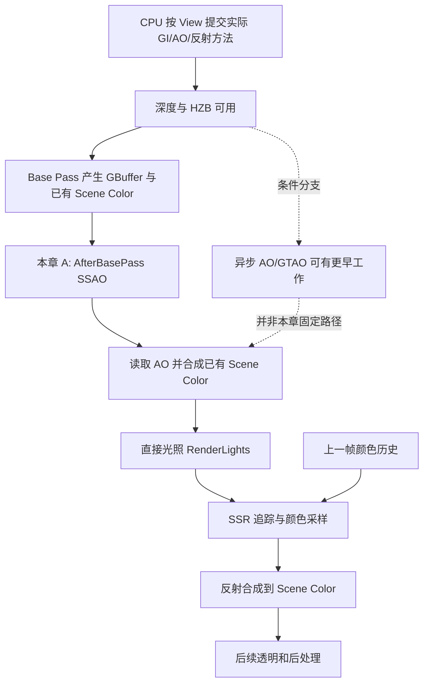
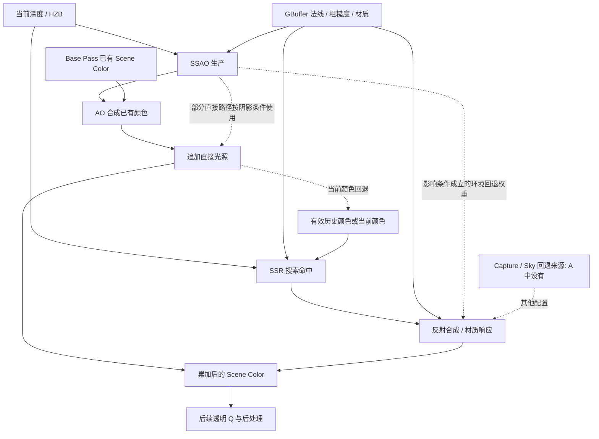

# 第 17 章：间接光照、环境遮蔽与反射

[返回目录](../README.md) · [本章答案](../appendices/answers/17-indirect-ao-reflections.md)

> **版本与范围：**UE 5.7.4，CL 51494982，Windows、D3D12、SM6、桌面延迟渲染。本章以配置 A 的传统 GBuffer 为主线：关闭动态 GI 和烘焙光照，不放置 Sky Light、Reflection Capture 或 Planar Reflection，不启用 Lumen、硬件光追和 Substrate。普通阴影贴图与直接光照沿用前两章。配置 B 只用于说明分支边界，Lumen 软件追踪的完整实现放在第 24 章。
>
> **证据边界：**“源码已确认”指本地文件静态阅读；公式、数值、概念模型标为“教学简化”。本章没有运行 UE，没有采集 GPU 抓帧、截图或耗时，所有观察练习均为 **[尚未验证]**。教材图表达算法与数据关系，不是实测时间线。

## 17.1 学习目标与必要前置知识

读完本章，你应能回答五个问题：

1. 直接光照、漫反射间接光照、镜面间接光照和环境遮蔽分别计算什么？
2. SSAO 怎样使用深度与法线生成遮蔽数据，生成后又由谁读取？
3. 为什么 AO 缓冲有暗区，而配置 A 的最终直接受光区域可能几乎不变？
4. SSR 如何寻找反射命中位置，为什么还可能读取上一帧颜色？
5. 为什么金属球的反射缺失不能只靠提高 SSR 质量解决，Lumen 又增加了什么能力？

前置知识是第 02、03 章的投影和深度，第 04 章的材质与 BRDF，第 05 章的历史数据和线性颜色，第 09 章的 RDG，以及第 13、14、16 章的 HZB、GBuffer 和直接光照。**环境遮蔽（Ambient Occlusion，AO）**是描述表面附近有多少入射方向受到几何遮挡的近似量；**屏幕空间环境遮蔽（Screen Space Ambient Occlusion，SSAO）**从当前视图能提供的深度等数据估计它。两者不是光源，也不会凭空产生照明。

贯穿场景仍是地面、红色不透明立方体、金属球、蓝色 Unlit 透明薄片、可移动方向光和点光源。P 是没有薄片覆盖的立方体像素；Q 是薄片覆盖立方体的屏幕位置。Q 在主不透明 GBuffer 中依然对应后方立方体。下面会增加金属球的观察位置 M，但不更换 P、Q，也不偷偷加入环境照明。

## 17.2 先把“光从哪里来”分清楚

### 17.2.1 一条光路，两个互相独立的分类

**间接光照（Indirect Lighting）**指光经过其他场景表面的反射或散射后，再到达当前表面的贡献。例如方向光照到红色立方体，立方体反射的一部分光照亮旁边地面，地面才可能出现红色串色。关闭直接阴影不会生成这部分反弹；把地面 Base Color 改红也不是计算出串色。

**漫反射（Diffuse Reflection）**与**镜面反射（Specular Reflection）**描述表面对入射光方向的响应分布。前者通常把能量分散到较宽的方向，后者更集中在反射方向附近，粗糙度增大时分布变宽。这与“直接／间接”不是同一维度：方向光可以产生直接漫反射和直接镜面高光；环境中的物体又可以贡献间接漫反射和间接镜面反射。

因此金属球上出现一个点光源高光，不足以证明 SSR 正在工作。前一章的直接光照已经可以计算这个高光。金属球里出现立方体的反射形状，才涉及场景环境提供的镜面方向颜色。日常所谓“关闭反射”常指关闭 SSR 或某种环境反射方法，不意味着删除 BRDF 中全部镜面项。

**[教学简化]**对一个没有透射和次表面散射的表面，可按来源写成：

```text
表面出射颜色 = 发光
             + 直接漫反射 + 直接镜面反射
             + 间接漫反射 + 间接镜面反射
```

这是一份概念账本，不是 `SceneColor` 中存在五个固定独立通道，也不是五个固定 Pass 的清单。UE 会把若干贡献提前合并，并根据材质、平台和功能选择不同计算位置。配置 A 没有 Lumen GI、烘焙和 Sky Light，所以我们不能假定它已有完整的间接漫反射底色；SSR 仍可以为适合的表面提供近似镜面环境贡献。

### 17.2.2 AO 为什么用一个数近似很多方向

一个凹角附近的表面，其上半球方向中有一部分被墙面挡住。若周围各方向照明近似均匀，用“剩下多少可接收光的方向”缩减环境贡献，就能以较低成本表现接触处的层次。

**[教学简化]**用余弦加权的可见率定义一个概念 AO：

\[
A(x)=\frac{1}{\pi}\int_{\Omega^+(n)}V(x,\omega)\max(n\cdot\omega,0)\,d\omega
\]

这里 `x` 是表面点，`n` 是单位法线，`ω` 是指向入射方向的单位向量；`Ω⁺(n)` 是法线上方的半球；`V` 在指定观察距离内没有遮挡时为 1，有遮挡时为 0；`dω` 表示一个小立体角。分母 `π` 使完全可见的半球归一化为 1。实际 AO 方法还会引入距离衰减、艺术强度和滤波，不能把这个式子当成 UE SSAO Shader 的逐行实现。

假设八个等权的示意方向中有两个被挡，可见率就是 `6/8=0.75`。这只是离散教学例子；如果方向不是等权，不能简单按数量相除。AO=1 表示本约定下不衰减，AO 越低通常越遮蔽。名称里有“Occlusion”，却常保存“剩余可见程度”，初学者很容易把黑白意义读反。

AO 省略了真正间接照明中的入射颜色、方向变化和多次反弹。红墙与蓝墙若有同样几何形状，AO 可以相同，但它们的串色不应相同。AO 也不知道方向光的准确位置，不能替代前一章从光源方向判断遮挡的阴影。把 AO 强度调大，只会加强这种近似，不能变成 GI。

## 17.3 先固定路径，再讨论调度

### 17.3.1 本章的补充观察设置

沿用[配置附录](../appendices/configuration.md)中的 A。本章再约定一组便于跟踪源码的会话设置；它们是教学选择，不宣称是项目默认值。

| 项目 | 本章选择 | 目的与生效前提 |
|---|---|---|
| AO 方法 | `r.AmbientOcclusion.Method 0` | 选择传统 SSAO；方法 1 的 GTAO 另作边界对照 |
| AO 执行形式 | `r.AmbientOcclusion.Compute 0` | 选择 Pixel Shader 主线，避免先引入异步 Compute 位置变化 |
| AO 层数 | `r.AmbientOcclusionLevels 1` | 只解释一级全分辨率结果；0 关闭，负值让质量决定，多级另述 |
| PPV 的 Ambient Occlusion | 勾选 Intensity=1、Radius=100、Radius in WorldSpace=true、Static Fraction=1 | 世界空间半径选 100 UE 长度单位；静态比例控制本章 AO 合成权重，不表示启用了烘焙 |
| SSR 方法与质量 | `r.ReflectionMethod 2`、`r.SSR.Quality 3` | PPV 保持 Screen Space 方法、Intensity=100、Quality=100、Max Roughness=0.8 |
| SSR 执行形式 | `r.SSR.Compute 0`、`r.SSR.TiledComposite 0`、`r.SSR.Stencil 0` | 固定普通屏幕 Pixel Shader 分支，暂不使用分块或模板优化 |
| SSR 时间分支 | `r.SSR.Temporal 0`、`r.SSR.ExperimentalDenoiser 0` | 配合既定 TAA，先不额外开启独立 SSR 时间滤波或实验去噪 |

先输入变量名而不带值，记录当前值，再调整；恢复时用记录值。上述会话 CVar 不属于本章必须重启的项目开关，但仍要在目标平台已有 Shader 且编译完成的前提下观察。A 的 Substrate、静态光照、RHI 等项目切换仍按附录要求重启，不能用本表绕过它们。勾选 PPV 属性的 Override 很关键：未覆盖的滑条显示值未必成为当前 `FinalPostProcessSettings`。

**[源码已确认]**AO 的控制变量及注册初值见 [PostProcessAmbientOcclusion.cpp](G:/UnrealEngineInstalled/UE_5.7/Engine/Source/Runtime/Renderer/Private/CompositionLighting/PostProcessAmbientOcclusion.cpp:29)；`Method` 注册在同文件 [第 89 行](G:/UnrealEngineInstalled/UE_5.7/Engine/Source/Runtime/Renderer/Private/CompositionLighting/PostProcessAmbientOcclusion.cpp:89)。后处理属性及显示名见 [Scene.h](G:/UnrealEngineInstalled/UE_5.7/Engine/Source/Runtime/Engine/Classes/Engine/Scene.h:2118)。SSR 注册见 [ScreenSpaceRayTracing.cpp](G:/UnrealEngineInstalled/UE_5.7/Engine/Source/Runtime/Renderer/Private/ScreenSpaceRayTracing.cpp:14)，分块开关见 [ScreenSpaceReflectionTiles.cpp](G:/UnrealEngineInstalled/UE_5.7/Engine/Source/Runtime/Renderer/Private/ScreenSpaceReflectionTiles.cpp:7)，实验去噪见 [IndirectLightRendering.cpp](G:/UnrealEngineInstalled/UE_5.7/Engine/Source/Runtime/Renderer/Private/IndirectLightRendering.cpp:73)。

### 17.3.2 真实代码位置与教学逻辑不是同一件事

[打开配置 A 的 AO 与 SSR 调度静态图](../assets/diagrams/17-indirect-ao-reflections-1.png)



**[源码已确认]**`CommitIndirectLightingState` 为每个 View 选择实际方法：先判 Lumen／SSGI／插件等漫反射间接路径，再决定 AO，反射先判 Lumen 再尝试 SSR。最后把结果写入 `ViewPipelineState`。因此 CVar 表达请求，View 条件决定路径，两者不能互相替代。[打开选择逻辑](G:/UnrealEngineInstalled/UE_5.7/Engine/Source/Runtime/Renderer/Private/IndirectLightRendering.cpp:484)

在 `DeferredShadingRenderer.cpp` 中，`ProcessAfterBasePass` 位于 [3230 行](G:/UnrealEngineInstalled/UE_5.7/Engine/Source/Runtime/Renderer/Private/DeferredShadingRenderer.cpp:3230)，随后 [3265 行](G:/UnrealEngineInstalled/UE_5.7/Engine/Source/Runtime/Renderer/Private/DeferredShadingRenderer.cpp:3265) 安排漫反射间接／AO 合成，[3314 行](G:/UnrealEngineInstalled/UE_5.7/Engine/Source/Runtime/Renderer/Private/DeferredShadingRenderer.cpp:3314) 调用 `RenderLights`，[3339 行](G:/UnrealEngineInstalled/UE_5.7/Engine/Source/Runtime/Renderer/Private/DeferredShadingRenderer.cpp:3339) 调用不透明反射与天空光照处理。其间另一次带 `bCompositeRegularLumenOnly=true` 的调用服务于特定 Lumen 合成时机，不是 A 必定再算一遍 AO。

图表示本章条件下的主要资源依赖，省略阴影等已讲内容。CPU 执行这些函数时主要在准备参数、构造 RDG Pass；GPU 需要等声明的读写依赖满足才能运行 Shader。函数返回不代表对应 GPU 图像已经生成。异步 AO 可在较早阶段准备，整个渲染器也有 `ProcessAfterOcclusion` 和 `ProcessBeforeBasePass` 入口；不能据此把图改写成所有配置共有的绝对时间线。

## 17.4 阶段一：从深度邻域生成 SSAO

### 17.4.1 八个问题先对齐

| 问题 | 本阶段的准确含义 |
|---|---|
| 是什么 | 为屏幕中的可见表面估计附近几何遮蔽，得到屏幕空间 AO 纹理 |
| 为什么需要 | 提供低成本的局部环境遮挡线索；缺少它会失去这份近似，但不会删除直接阴影或 GI 本身 |
| 输入 | Scene Depth、Furthest HZB、当前 View、可用的法线、半径／强度／质量、随机方向纹理；多级时还包括低分辨率 AO |
| 处理 | 恢复位置和法线，在若干屏幕方向取深度样本，估计遮挡角度，累计可见率，按层数进行重建与滤波 |
| 输出 | `SceneTextures.ScreenSpaceAO`，后续间接／AO 合成、部分直接光照及环境反射相关消费者读取 |
| UE 实现 | `FCompositionLighting` 组织时机；`AddAmbientOcclusionPass` 绑定 Shader 与资源；`MainPSandCS` 计算结果 |
| 执行条件 | 实际 AO 方法、Show Flag、强度、半径、受支持消费者、层数和 RTAO 排他条件；不是每个 View 都执行 |
| 成本与误区 | 屏幕分辨率、样本数、层数、访存和滤波有成本；SSAO 只有可见深度信息，不是完整场景追踪 |

### 17.4.2 CPU 怎样判断本帧是否值得生成

`ShouldRenderScreenSpaceAmbientOcclusion` 先检查强度大于 0、Lighting 显示标志、有效半径和非调试像素 Shader，再检查是否存在需要它的用途，例如相关基础 AO、Ambient Cubemap、反射环境、Sky Light、可视化或 Lumen 请求，最后排除光追 AO 路径。[打开条件实现](G:/UnrealEngineInstalled/UE_5.7/Engine/Source/Runtime/Renderer/Private/CompositionLighting/CompositionLighting.cpp:80)

这里名为 `IsReflectionEnvironmentActive` 的辅助判断接受“有 Capture 或 SSR Show Flag 开启”这一宽泛条件。因此 A 没有 Capture，也可能请求 SSAO。这个辅助函数并不证明 SSR 射线 Pass 最终执行；SSR 另有自己的方法和质量检查。不同辅助函数的名字接近，必须读条件，不能只凭名称把它们画成同一个判断节点。

`FCompositionLighting::TryInit` 再计算层数和 GTAO 类型。传统 SSAO 只有在 Furthest HZB 有效且满足异步或前向条件时才选择 BeforeBasePass，否则放到 AfterBasePass。本章明确关闭 Compute、使用桌面延迟，所以跟踪后者，并可以使用 Base Pass 产生的法线。[打开时机选择](G:/UnrealEngineInstalled/UE_5.7/Engine/Source/Runtime/Renderer/Private/CompositionLighting/CompositionLighting.cpp:501)

### 17.4.3 GPU 如何从一张深度图理解“凹角”

第一步是取得当前像素的深度和法线，并用相机参数反投影出观察空间位置。只有屏幕 UV 而没有深度，无法知道同一条视线上表面处于多远；只有深度差而不考虑法线，容易把斜平面误当成凹陷。源码的 `GetDepthFromAOInput`、`GetWorldSpaceNormalFromAOInput`、`ReconstructCSPos` 分别处理这些部分。[打开中心样本读取](G:/UnrealEngineInstalled/UE_5.7/Engine/Shaders/Private/PostProcessAmbientOcclusion.usf:264)

第二步是准备采样半径和方向。世界空间半径需要根据深度、投影关系转换成屏幕偏移：相同 100 单位在近处占更多像素，在远处占更少像素。Shader 会使用法线偏移 Bias 缓解自遮挡，用随机纹理旋转方向，某些质量路径还叠加随时间变化的偏移。这是用较少样本覆盖不同方向，不是物体或 AO 半径真的在每帧乱动。

第三步是对选中的屏幕方向查深度。传统实现中的 `WedgeWithNormal` 同时取当前方向正负两侧的 HZB 深度，重建两个邻居位置，计算它们相对中心的方向，再与中心法线联系起来。`Wedge` 在这里可理解为一条方向截面提供的角度信息。真实代码包含优化分支：有的使用点积与距离平方，有的使用归一化方向及距离权重，不能把所有编译分支写成一个精确公式。[打开双侧样本实现](G:/UnrealEngineInstalled/UE_5.7/Engine/Shaders/Private/PostProcessAmbientOcclusionCommon.ush:237)

第四步是沿同一方向走多个距离，合并较强的地平线遮挡，再跨方向积累。这里的**地平线（Horizon）**指相对于当前表面，邻近几何在某个方向抬高到多大角度，不是场景里的天空地平线。当前像素贴近立方体与地面的接缝时，某些邻居会在法线上方占据较大角度；在开阔平面上，邻居主要沿表面展开，遮挡估计较小。

**[源码已确认]**`MainPSandCS` 的方向循环调用 `WedgeWithNormal` 后，以分量最大值合并多个步长的估计，再累计 `Square(1 - LocalAccumulator.x)` 等可见率项。最后用 `WeightAccumulator.x / WeightAccumulator.y` 归一化。它不是教材中“均匀发射八条真实三角形射线”的实现。[打开累积循环](G:/UnrealEngineInstalled/UE_5.7/Engine/Shaders/Private/PostProcessAmbientOcclusion.usf:331)

第五步是重建、衰减和艺术调整。多级路径可把低分辨率结果上采样，并参考深度和法线降低跨表面混合；远处 AO 可以渐变回 1；Power 与 Intensity 再调整输出。Shader 还包含按深度／法线选择权重的局部平滑分支。因此半径决定考虑的几何尺度，Intensity 决定遮蔽强度，二者不能作为同一种“质量”理解。[打开输出处理](G:/UnrealEngineInstalled/UE_5.7/Engine/Shaders/Private/PostProcessAmbientOcclusion.usf:400)

### 17.4.4 调用、参数和多级路径

本章路径可以沿着下面的短链阅读：

```text
FCompositionLighting::ProcessAfterBasePass
  -> GetSSAOCommonParameters(..., bUseGBuffer=true)
  -> AddPostProcessingAmbientOcclusion
     -> AddAmbientOcclusionFinalPass
        -> AddAmbientOcclusionPass
           -> FAmbientOcclusionPS / MainPS
              -> MainPSandCS
```

`ProcessAfterBasePass` 负责按 View 配置选择传统 SSAO、同步 GTAO 或异步 GTAO 的后续合成；它本身不在 CPU 上逐像素计算 AO。[打开调用分支](G:/UnrealEngineInstalled/UE_5.7/Engine/Source/Runtime/Renderer/Private/CompositionLighting/CompositionLighting.cpp:594) `AddPostProcessingAmbientOcclusion` 根据层数增加 Setup、Step 和最终 Pass；本章选择 1 级，避免先把这些工作都当成必需。[打开多级组织](G:/UnrealEngineInstalled/UE_5.7/Engine/Source/Runtime/Renderer/Private/CompositionLighting/CompositionLighting.cpp:408)

`AddAmbientOcclusionPass` 的参数包含 View Uniform Buffer、SceneTextures、HZB、法线相关输入、低分辨率 AO 与随机化纹理，再按 PS／CS 形式创建 RDG 工作。Shader 注册把 `FAmbientOcclusionPS` 连接到 `PostProcessAmbientOcclusion.usf` 的 `MainPS`。这些参数是 C++ 与 Shader 之间的实际数据合同；只搜到 Shader 文件却不看参数，就无法知道当前分支是否真有 GBuffer 法线。[打开参数绑定](G:/UnrealEngineInstalled/UE_5.7/Engine/Source/Runtime/Renderer/Private/CompositionLighting/PostProcessAmbientOcclusion.cpp:793)，[Shader 注册](G:/UnrealEngineInstalled/UE_5.7/Engine/Source/Runtime/Renderer/Private/CompositionLighting/PostProcessAmbientOcclusion.cpp:724)

多级 AO 的“级”是计算分辨率和重建组织，不等于 HZB 的 mip 数，也不等于漫反射反弹次数。更低分辨率有助于以较低成本估计较大的范围，但最终还要恢复边缘。`ComputeAmbientOcclusionPassCount` 对 Compute／前向限制最多 1 级，传统 PS 可按质量或覆盖值选择多个等级，说明同一个层数控制变量在不同分支下未必产生相同结构。[打开层数策略](G:/UnrealEngineInstalled/UE_5.7/Engine/Source/Runtime/Renderer/Private/CompositionLighting/PostProcessAmbientOcclusion.cpp:236)

### 17.4.5 P、Q 与常见伪影

P 若在立方体中央而远离接触处，可能接近 AO=1；若移动观察位置到立方体下缘，邻近地面可能增加遮蔽。Q 的主深度是立方体，所以普通不透明 SSAO 仍围绕该立方体表面采样。薄片没有因为屏幕上能看见就自动成为这张深度图里的遮挡几何。

典型伪影包括屏幕边缘缺少邻居、遮挡物背面缺失、半径过大带来的轮廓暗晕、低采样带来的噪声，以及滤波跨越深度边界形成的泄漏。增加样本数可以改善采样误差，却不能补回从未进入当前深度表示的墙后几何。性能上应先看输出分辨率和样本预算，再看滤波与多级结构；不能因为它是“后处理”就认为成本只是一张纹理读取。

## 17.5 阶段二：AO 生成后怎样影响画面

### 17.5.1 生产者与消费者必须分开

| 问题 | 本阶段的回答 |
|---|---|
| 是什么 | 读取已生成的 AO，把它按当前方法合成到已有颜色，或提供给后续相关照明 |
| 为什么需要 | 一张 AO 纹理本身不会改变 Scene Color；消费者决定它到底衰减哪份贡献 |
| 输入 | 动态 AO、材料 AO、Static Fraction、当前 Scene Color；其他方法还可有间接照明结果 |
| 处理 | 读取 AO、组合权重、选择乘法／加法／双源混合，把结果写入 Scene Color |
| 输出 | 更新的 HDR Scene Color；AO 资源也可继续供部分直接光照及环境反射相关路径读取 |
| UE 实现 | `RenderDiffuseIndirectAndAmbientOcclusion` 与 `DiffuseIndirectComposite.usf` |
| 执行条件 | View 选择的方法、AO 是否产生、间接结果是否存在、平台混合能力以及合成时机 |
| 成本与误区 | 纹理读取、全屏合成和可能的拷贝有成本；纹理非白不等于最终画面必定明显变暗 |

**[源码已确认]**选择 SSAO 的分支明确读取“之前已经完成的” `ScreenSpaceAO`；若没有产生，则使用 fallback，并把它视为不可写输入。这个函数名同时包含间接光照与 AO，并不意味着它总负责生成 SSAO。[打开已产出资源的读取](G:/UnrealEngineInstalled/UE_5.7/Engine/Source/Runtime/Renderer/Private/IndirectLightRendering.cpp:1239)

在本章对应的非 Lumen Screen Probe Gather 合成分支中，Shader 计算：

```hlsl
FinalAmbientOcclusion = lerp(
    1.0f,
    Material.MaterialAO * DynamicAmbientOcclusion,
    AOMask * AmbientOcclusionStaticFraction);
```

这是小段真实源码。`MaterialAO` 是从当前材质表示读取的 AO，`DynamicAmbientOcclusion` 来自动态 AO 纹理；`AOMask` 由有效材质判断得到；`AmbientOcclusionStaticFraction` 是 CPU 传入的后处理权重。有效表面且比例为 1 时，两份 AO 相乘；比例为 0 时回到不衰减的 1。名称里的 Static 不允许我们忽略真实公式，更不能据此断言没有静态烘焙时这一 Shader 永远不执行。[打开公式上下文](G:/UnrealEngineInstalled/UE_5.7/Engine/Shaders/Private/DiffuseIndirectComposite.usf:374)，[参数传递](G:/UnrealEngineInstalled/UE_5.7/Engine/Source/Runtime/Renderer/Private/IndirectLightRendering.cpp:1324)

### 17.5.2 为什么不能把 AO 画在最终颜色后统一相乘

本章 A 的 AO 合成在直接灯光之前。AO-only 情况使用的混合状态让目标已有颜色乘以源输出系数；存在其他间接结果时，还可采用 `SceneColor * AO + Indirect` 或加法形式。[打开混合状态选择](G:/UnrealEngineInstalled/UE_5.7/Engine/Source/Runtime/Renderer/Private/IndirectLightRendering.cpp:1453)

**[教学简化]**以单个线性颜色通道演算，P 没有发光，也没有预先得到的间接照明：

```text
AO 合成前：已有颜色 C0=0
材质 AO=1，动态 AO=0.4，Static Fraction=1
AO 合成后：C1=0×0.4=0
直接灯光随后追加 D=0.8：C2=0+0.8=0.8
```

若在这个算例中把追加的直接颜色再统一乘 AO，就会得到 `0.8×0.4=0.32`，那不是前述 AO 合成 Pass 的顺序。另设一个只用于理解运算的已有贡献 `C0=0.2`，则结果是 `0.2×0.4+0.8=0.88`。这些数值不代表对场景 P 的实测，也没有擅自给 A 增加环境光。这里 D 是直接光照阶段已经算好的最终追加贡献，并不承诺它的内部计算完全不读 AO。

还要保留一个实现细节：已有 Scene Color 可能含发光或其他较早贡献，所以不能反过来绝对声称 AO 合成“永远只乘物理意义上的间接光”。判断实际影响必须看这个时刻缓冲里已有的内容。本章 A 的普通无发光表面恰好可能没有明显可乘的环境底色。

因此观察 AO 应先看 AO 缓冲，然后看它的消费者和合成时点。只凭最终 Lit 图不变就宣布“SSAO 没运行”，会遗漏已生成但视觉影响有限的情况；只凭 AO 缓冲有图就宣布“整个画面被 AO 乘暗”，同样错误。

### 17.5.3 直接光照还有一个需要看条件的 AO 入口

不能从“AO 合成早于 RenderLights”推导出“所有直接光照 Shader 都不读取 AO”。传统 `DeferredLightPixelShaders.usf` 会把 `ScreenSpaceData.AmbientOcclusion` 传给 `GetDynamicLighting`；其公共实现先把 `Shadow.SurfaceShadow` 初始化为这个 AO，然后调用 `GetShadowTerms`。[打开调用参数](G:/UnrealEngineInstalled/UE_5.7/Engine/Shaders/Private/DeferredLightPixelShaders.usf:394)，[打开初始遮挡项](G:/UnrealEngineInstalled/UE_5.7/Engine/Shaders/Private/DeferredLightingCommon.ush:347)

关键在于后者会继续修改值：`GetShadowTermsBase` 在 `LightData.ShadowedBits` 条件成立时，局部光用 `LightAttenuation.z * StaticShadowing` 覆盖 SurfaceShadow，方向光使用动态／静态阴影混合等信息重新赋值。相应条件不成立时，初始 AO 可能保留下来；接触阴影等后续逻辑也需要结合开关判断。[打开覆盖分支](G:/UnrealEngineInstalled/UE_5.7/Engine/Shaders/Private/DeferredLightingCommon.ush:94)

因此对本章已启用普通动态阴影的教学灯光，应沿实际阴影位与衰减输入解释效果；对后来关闭阴影、切换光照批处理或改用其他材质路径的灯，必须重新检查消费者。正确结论是“AO 没有在最后统一乘整张直接光照图”，而不是“AO 在任何直接光照路径都无效”。这也说明资源数据流图只能画主要消费者，不能拿省略的箭头证明代码中不存在其他读取。

## 17.6 阶段三：SSR 怎样在屏幕里寻找反射

### 17.6.1 它解决的是方向颜色来源

**屏幕空间反射（Screen Space Reflections，SSR）**利用可见表面的深度、法线和已有场景颜色，近似寻找镜面方向上能反射到的场景内容。它不重新完整渲染整个世界，而是在一个有深度的屏幕表示中追踪，再从颜色输入中取样。

| 问题 | 本阶段的回答 |
|---|---|
| 是什么 | 为适合的不透明表面计算屏幕空间反射颜色与可用权重 |
| 为什么需要 | 复用场景已生成数据，补充动态物体的反射；没有它时须依赖其他反射来源，否则相关环境贡献缺失 |
| 输入 | 深度／HZB、GBuffer 法线和粗糙度、View、当前或历史 Scene Color、速度与历史映射参数 |
| 处理 | 筛选表面、建立反射方向、屏幕步进测试、细化命中、重投影颜色坐标、采样并淡出 |
| 输出 | `ScreenSpaceReflections` RGBA 纹理；特定去噪路径另写命中距离 |
| UE 实现 | `RenderScreenSpaceReflections`、`SSRTReflections.usf`、`SSRTRayCast.ush` |
| 执行条件 | 实际反射方法、ViewState、SSR Show Flag、质量／强度、非反射捕获视图和桌面延迟支持 |
| 成本与误区 | 参与像素、射线数、步数、访存、时间处理决定成本；提高质量不能创造屏幕外几何 |

### 17.6.2 CPU 首先选择方法与颜色输入

`ShouldRenderScreenSpaceReflections` 除方法非 None 外，还检查 ViewState、质量大于 0、后处理强度至少 1、Show Flag 等。这里后处理 Intensity 使用 0～100 尺度，不是“必须大于等于 100%”。函数刻意允许在某些其他反射方法因画质而不可用时回退 SSR，所以也不能把它简写成只有 `ReflectionMethod==ScreenSpace` 才可能返回 true。[打开 SSR 条件](G:/UnrealEngineInstalled/UE_5.7/Engine/Source/Runtime/Renderer/Private/ScreenSpaceRayTracing.cpp:130)

配置 A 的不透明入口是 `RenderDeferredReflectionsAndSkyLighting` 中的 SSR 分支。它先选择质量与去噪方式，按开关准备分块，再调用实际 SSR 函数。[打开调用方](G:/UnrealEngineInstalled/UE_5.7/Engine/Source/Runtime/Renderer/Private/IndirectLightRendering.cpp:2068) 该调用方所在函数同时能处理天空和 Capture，函数名并不意味着 A 放置了这些对象。

颜色来源尤其容易被说错。`RenderScreenSpaceReflections` 先以当前 Scene Color 初始化输入，正常质量路径随后按优先级尝试：`CustomSSRInput`、启用且有效的半分辨率历史、有效的 `TemporalAAHistory`。都不满足才保留当前输入。当前深度定位表面，不等于命中颜色一定来自当前帧。[打开实际优先级](G:/UnrealEngineInstalled/UE_5.7/Engine/Source/Runtime/Renderer/Private/ScreenSpaceRayTracing.cpp:994)

**重投影（Reprojection）**是把当前已知位置映射到另一帧／另一视图的采样坐标。这里相机运动、物体运动和历史缓冲尺寸都会影响映射。UE 传入速度与前帧坐标变换，还校正前后帧 Pre-Exposure 的比例；否则同一个物理亮度会因缓冲采用的曝光缩放不同而跳变。使用当前颜色或没有速度时，代码绑定中灰的无速度替代纹理，避免把当前颜色错当历史去重投影。[打开替代速度处理](G:/UnrealEngineInstalled/UE_5.7/Engine/Source/Runtime/Renderer/Private/ScreenSpaceRayTracing.cpp:1051)，[曝光与历史参数](G:/UnrealEngineInstalled/UE_5.7/Engine/Source/Runtime/Renderer/Private/ScreenSpaceRayTracing.cpp:1118)

### 17.6.3 从 M 出发，建立一条反射方向

假设 M 是金属球上一个足够平滑的可见表面点。用深度恢复其三维位置，用 GBuffer 读取世界法线 `N`，再计算指向相机的方向 `V`。理想镜面反射方向为：

\[
R=2(N\cdot V)N-V
\]

`N`、`V` 都是单位向量，`R` 指向我们希望从场景中寻找入射颜色的方向。例如 `N=(0,0,1)`、`V=(0,0,1)` 时，`R=(0,0,1)`；观察者正对平面，反射方向指向前方。这个数值例子只验证向量含义，不代表场景球面所有点法线相同。

粗糙表面由许多微表面方向共同贡献，不能只追一条无限锐利的理想射线。UE 的质量分支选择样本／步数，并可围绕反射方向采样；特定很低粗糙度条件直接使用 `reflect(-V,N)`。Shader 首先根据粗糙度阈值和有效材质筛除不需要 SSR 的表面，随后才支付主要追踪成本。[打开粗糙度淡出](G:/UnrealEngineInstalled/UE_5.7/Engine/Shaders/Private/SSRT/SSRTReflections.usf:45)，[反射与追踪调用](G:/UnrealEngineInstalled/UE_5.7/Engine/Shaders/Private/SSRT/SSRTReflections.usf:283)

### 17.6.4 三维方向怎样变成屏幕深度测试

**射线步进（Ray Marching）**表示沿候选路径取离散位置并检查条件。SSR 先把射线路径转换到屏幕坐标和设备深度表示，再沿路径查 HZB。HZB 的不同 mip 以不同空间尺度提供深度信息，有助于控制采样成本。它不是一份包含任意场景三角形的光追加速结构。

在 `CastScreenSpaceRay` 中，起点与步进量转换成 UV 和设备深度，随后批量采样 HZB，计算候选射线深度与样本深度之差。源码使用容差区间接受近似交会，同时拒绝远平面值；可能的命中还可以做更细的查找。[打开屏幕参数](G:/UnrealEngineInstalled/UE_5.7/Engine/Shaders/Private/SSRT/SSRTRayCast.ush:254)，[批量深度比较](G:/UnrealEngineInstalled/UE_5.7/Engine/Shaders/Private/SSRT/SSRTRayCast.ush:432)

为什么需要容差？深度纹理只给一个可见表面深度，离散步长可能一下走到表面背后；若只要求浮点深度完全相等，几乎永远无法命中。容差让附近的候选样本可能被接受，却也会带来虚假厚度、漏检或穿透感。这里比较的是投影后的深度，不能把某个差值直接说成固定几厘米。第 13 章的 Reversed-Z 和 HZB 极值约定仍然适用，不能把普通整数大小直觉套进去。

**[教学简化]**可以把流程压成以下伪代码来复述，但它不是 UE 原样算法：

```text
读取 M 的深度、法线、粗糙度
如果材质无效或粗糙度超出 SSR 范围：输出无贡献
为每个质量允许的方向：
    投影射线路径到屏幕
    在预算内查深度并寻找容差范围内的候选命中
    如果命中：细化位置，映射到颜色输入坐标，采样颜色
    按有效性和屏幕边缘权重累计
输出反射颜色及其可用权重
```

### 17.6.5 命中深度后，颜色还要从另一个位置取得

命中的 `HitUVz` 先经过 `ReprojectHit` 得到 `SampleUV` 和边缘权重，再由 `SampleScreenColor` 取色。颜色的 UV 不必等于未经变换的当前帧命中 UV。Shader 还进行亮度相关的采样处理、粗糙度淡出和曝光校正，不能把输出精确概括成“把目标像素 RGB 原样拷过来”。[打开命中取色](G:/UnrealEngineInstalled/UE_5.7/Engine/Shaders/Private/SSRT/SSRTReflections.usf:309)

若金属球 M 的反射方向碰到屏幕中可见的红色立方体，SSR 可能用那个命中位置的可用颜色构造红色反射。但是那份颜色原本是从相机方向看到的立方体出射颜色，而严格反射需要的是朝向 M 的出射颜色。对近似漫反射表面这有时可接受；对强烈方向相关的高光和复杂反射，会出现误差。SSR 即使命中正确的深度，也不等于恢复了完整光路。

屏幕边缘淡出是在数据即将不可靠时减少贡献，不能等同于“物体真的渐渐消失”。刚露出的区域可能有当前几何却没有可靠历史颜色；快速运动和错误速度会导致拖影或闪烁。这些问题解释了为什么后续需要时间处理，同时也解释了时间处理的能力边界。

### 17.6.6 使用历史颜色与专用时间滤波不是同一件事

**时间滤波（Temporal Filtering）**把多帧估计结合，以减少低样本噪声或提高稳定性。SSR 从 TAA 历史取色，是它的输入选择；SSR 自己再进行一次时间滤波，是输出处理。两者不能因为都出现 History 一词就混为一个 Pass。

**[源码已确认]**`IsSSRTemporalPassRequired` 在存在 ViewState 时检查：抗锯齿是否不是时间累积方法，或 `r.SSR.Temporal` 是否非零。配合本章 TAA 和该变量 0、实验去噪 0，可以直接使用 SSR 输出，不必再走独立 SSR TAA Pass。若条件选择专用时间滤波，调用方使用的是 `SSRHistory`，与作为颜色输入的 `TemporalAAHistory` 是不同成员。[打开条件](G:/UnrealEngineInstalled/UE_5.7/Engine/Source/Runtime/Renderer/Private/ScreenSpaceRayTracing.cpp:178)，[专用历史调用](G:/UnrealEngineInstalled/UE_5.7/Engine/Source/Runtime/Renderer/Private/IndirectLightRendering.cpp:2112)

去噪分支还要求反射去噪模式可用且 `r.SSR.ExperimentalDenoiser` 非零，不能把“源码中能创建 HitDistance 纹理”推断成 A 每帧都输出它。普通输出是 `PF_FloatRGBA` 的 `ScreenSpaceReflections`，命中距离只在相应去噪输入条件下创建。[打开输出资源创建](G:/UnrealEngineInstalled/UE_5.7/Engine/Source/Runtime/Renderer/Private/ScreenSpaceRayTracing.cpp:1026)

在 C++ 与 GPU 的连接处，`FScreenSpaceReflectionsPS`／CS 的注册把 Shader 类关联到 `SSRTReflections.usf`。本章开关选择 Raster Pass；Compute 路径还要求非分块、未使用 SSR 模板预处理且非单层水，异步请求也要在这份合并条件中判断。RDG 声明并绑定输入后，真正的 Pixel Shader 取样与写纹理由 GPU 执行。[打开 Shader 注册](G:/UnrealEngineInstalled/UE_5.7/Engine/Source/Runtime/Renderer/Private/ScreenSpaceRayTracing.cpp:618)，[执行形式的条件](G:/UnrealEngineInstalled/UE_5.7/Engine/Source/Runtime/Renderer/Private/ScreenSpaceRayTracing.cpp:1154)

## 17.7 阶段四：反射结果怎样接回 Scene Color

### 17.7.1 数据流图与八维解释

[打开 AO 与反射消费关系静态图](../assets/diagrams/17-indirect-ao-reflections-2.png)



| 问题 | 本阶段的回答 |
|---|---|
| 是什么 | 把 SSR 与适用的其他环境来源组合，乘相应材质镜面响应后加入 Scene Color |
| 为什么需要 | SSR 纹理不是最终表面颜色；不同像素有效性、粗糙度和材质响应仍需处理 |
| 输入 | SSR RGBA、GBuffer、AO、View、已有 Scene Color；其他配置还可能有反射 Capture 与 Sky |
| 处理 | 读取反射贡献，计算剩余回退权重，按条件收集环境颜色，应用镜面 BRDF 响应，再累加 |
| 输出 | 更新的 HDR Scene Color，供后续透明和后处理使用 |
| UE 实现 | `AddSkyReflectionPass` 组织参数；`ReflectionEnvironmentPixelShader.usf` 组合来源 |
| 执行条件 | 至少有反射结果、天空或反射环境用途；部分 Lumen 组合已在其他位置完成 |
| 成本与误区 | 全屏／分块处理、资源读取和环境采样；函数叫 ReflectionEnvironment 不代表必有 Capture |

### 17.7.2 SSR Alpha 与回退权重

**反射捕获（Reflection Capture）**是从场景某个位置生成环境表示，并用球形／盒形范围等规则为表面提供近似镜面环境颜色。其常见存储是**立方体贴图（Cubemap）**，用六个方向的纹理表达包围环境。它可以提供当前屏幕外的信息，但空间位置、更新方式和近似投影会带来限制，并不等于每帧从每个表面点追踪完整场景。

`CompositeReflections` 的普通反射输入分支取 `ReflectionInput.rgb`，并把 `1 - ReflectionInput.a` 作为待补足权重。随后 `GatherRadiance` 使用该权重收集适用的 Capture／Sky 环境来源。这里 alpha 是反射可用程度相关权重，不是本章蓝色薄片的 Opacity。[打开普通组合](G:/UnrealEngineInstalled/UE_5.7/Engine/Shaders/Private/ReflectionEnvironmentPixelShader.usf:120)

**[教学简化]**若以 `w` 表示 SSR 有效权重，可写成 `已有SSR贡献 + (1-w)×环境回退贡献`。实际还要考虑材质响应、环境影响范围和遮蔽，SSR RGB 已经过内部权重处理，不能再机械地乘一次 `w`。配置 A 没有 Capture 和 Sky，当 SSR 无法命中时，这些环境来源没有内容可补；金属球部分区域黑或缺少环境细节，可能恰好体现信息缺失。

AO 在这里也有具体作用位置：代码先算 `GBufferAO * AmbientOcclusion`，通过 `GetSpecularOcclusion` 得到镜面遮蔽，再乘到剩余回退 alpha 上，之后才调用 `GatherRadiance`。不能把这一段讲成“SSAO 最后统一乘暗 SSR RGB”。本章没有环境回退来源时，这条 AO 用途也未必造成明显可见差异。[打开遮蔽与环境收集](G:/UnrealEngineInstalled/UE_5.7/Engine/Shaders/Private/ReflectionEnvironmentPixelShader.usf:209)

### 17.7.3 BRDF 与加法合成

同一份环境颜色照到金属与塑料，不应得到同样反射结果。Shader 在普通材质分支用能量项或 `EnvBRDF(SpecularColor, Roughness, NoV)` 调制环境颜色，然后输出。这里 `NoV` 是法线与观察方向点积，反映掠射角等视角因素。[打开材质响应](G:/UnrealEngineInstalled/UE_5.7/Engine/Shaders/Private/ReflectionEnvironmentPixelShader.usf:281)

CPU 侧通常选择加法混合，把该阶段结果加入已有 Scene Color；调试可视化可覆盖写入，不能用调试图推断正常混合模式。即使 `ShouldDoReflectionEnvironment` 因没有注册 Capture 返回 false，只要 `ReflectionsColor` 有效，`bRequiresApply` 仍可要求进行反射合成。[打开合成条件](G:/UnrealEngineInstalled/UE_5.7/Engine/Source/Runtime/Renderer/Private/IndirectLightRendering.cpp:2145)，[正常加法状态](G:/UnrealEngineInstalled/UE_5.7/Engine/Source/Runtime/Renderer/Private/IndirectLightRendering.cpp:1912)，[Capture 环境判断](G:/UnrealEngineInstalled/UE_5.7/Engine/Source/Runtime/Renderer/Private/DistanceFieldAmbientOcclusion.cpp:708)

## 17.8 配置变化时，哪些结论需要重新检查

### 17.8.1 GTAO、SSGI 和距离场 AO

**GTAO（Ground Truth Ambient Occlusion）**是一类以更系统的地平线积分近似环境遮蔽的方法。“Ground Truth”是算法名称的一部分，不表示它获得了场景的完整真实遮挡。UE 的方法 1 可选择非异步、异步地平线搜索或组合空间处理分支，并有时间、空间和上采样阶段。切换方法后必须检查法线、异步能力和所选类型，不能只把原先 SSAO 框换个名字。[打开 GTAO 类型选择](G:/UnrealEngineInstalled/UE_5.7/Engine/Source/Runtime/Renderer/Private/CompositionLighting/PostProcessAmbientOcclusion.cpp:284)

**SSGI（Screen Space Global Illumination，屏幕空间全局光照）**尝试从屏幕数据估计漫反射间接颜色，因此它与只估计遮蔽比例的 SSAO 不同。`CommitIndirectLightingState` 中 SSGI 可同时提供 AO，避免把所有屏幕空间功能都固定叠加为独立必需 Pass。本章 A 的 GI 方法为 None，没有这份颜色生成工作。

**DFAO（Distance Field Ambient Occlusion，距离场环境遮蔽）**使用场景距离场等表示估计遮蔽，并常与可移动 Sky Light 路径关联。它不等于 SSAO 的“高质量档”，需要距离场支持与相关用途。A 不生成用于此教学分支的距离场，也没有 Sky Light，所以不能把 DFAO 或天空漫反射画进 A 的主线。[打开距离场 AO 准备条件](G:/UnrealEngineInstalled/UE_5.7/Engine/Source/Runtime/Renderer/Private/DistanceFieldAmbientOcclusion.cpp:717)

### 17.8.2 Reflection Environment 与 Lumen 的分工

| 路径 | 从哪里寻找环境信息 | 本章应保留的边界 |
|---|---|---|
| SSR | 当前屏幕深度表示与当前／历史颜色 | 屏幕外、遮挡背后和方向相关颜色可能缺失 |
| Reflection Capture | 捕获的环境贴图及影响范围 | 可以包含屏幕外内容，但不是每像素实时全场景追踪 |
| Sky Light | 天空／指定环境源及相关照明参数 | 是照明来源与环境表示，不能只视作把画面统一提亮 |
| Lumen 软件追踪 | 屏幕追踪与场景距离场等表示、缓存照明 | 可以补充屏幕外信息，但仍是多种近似和缓存协作 |
| 硬件光追分支 | 硬件光追加速结构及对应照明路径 | 需要项目、硬件、Shader 和运行条件；开启 API 不等于自动替换所有效果 |

配置 B 的 Lumen 提供漫反射间接照明与反射相关路径，使红色立方体对地面的串色成为可讨论的现象，并能在 SSR 缺信息的位置尝试屏幕外表示。但 Lumen 软件追踪仍由 GPU 上的相关 Shader 执行，不能把“软件”理解为 CPU 逐射线工作。

实际调度还会变化：当 Lumen GI 配合 Lumen 反射，或相关 Lumen GI 与 SSR 组合已经较早合成时，传统 `RenderDeferredReflectionsAndSkyLighting` 中会跳过相应 View；另有独立 Lumen 反射条件分支。本章不把 A 的 SSR 调用顺序原封不动挪到 B。[打开已合成分支判断](G:/UnrealEngineInstalled/UE_5.7/Engine/Source/Runtime/Renderer/Private/IndirectLightRendering.cpp:2044) 第 24、25 章再追踪这些内部表示和追踪流程。

## 17.9 用同一帧重新串联 P、Q 和 M

### 17.9.1 从中间数据走到颜色

| 时刻 | P：立方体可见表面 | Q：薄片覆盖位置 | M：金属球表面 |
|---|---|---|---|
| 深度／GBuffer 就绪 | 保存立方体深度、法线、材质 | 主不透明数据仍是立方体 | 保存球面法线、粗糙度和金属属性 |
| SSAO 生产 | 按立方体与周围几何估计 | 按后方立方体估计，不把薄片当普通深度遮挡 | 球面接近地面的区域可能增加遮蔽 |
| AO 合成 | 作用于此时已有颜色，影响可能有限 | 先处理后方不透明颜色 | 没有环境来源时不保证明显变暗 |
| 直接光照 | 得到方向光／点光源贡献 | 后方立方体照明同样先形成 | 点光源高光可在此出现，与 SSR 无关 |
| SSR 与反射合成 | 是否有明显贡献取决于材质和方向 | 仍以不透明接收表面为依据 | 可在有效命中处取得立方体等屏幕反射 |
| 后续透明 | P 不受薄片覆盖 | 薄片按透明路径合成 | 没有薄片覆盖的位置保持不透明结果 |

如果历史颜色中已经包含透明贡献，SSR 可能采到薄片颜色或产生不准确痕迹，但这不代表薄片被正确加入了不透明深度中的几何求交。把“看到反射里似乎有蓝色”与“正确追踪透明物体”分开，是观察数据时必须保留的区别。

**[教学简化]**沿用第一章混色算例的阶段假设：处理完不透明背景后，线性 RGB 是 `(0.8,0.1,0.05)`，薄片在该混合步骤的假设源颜色是 `(0.1,0.6,1)`，Opacity 保持 0.35。这不是实际材质 Emissive 输入的运行取样，不需要更改场景中 `Tint×300` 的观察设置。忽略本阶段未加入的折射、雾等效果：

```text
Q = 0.35×(0.1,0.6,1) + 0.65×(0.8,0.1,0.05)
  = (0.555,0.275,0.3825)
```

这里输入背景可以已经包含不透明表面的 SSR。薄片自己的蓝色不需要先写入普通 GBuffer 再套一次本章延迟照明。后续 TAA、曝光和色调映射还会改变呈现数值，因此不能把这个线性结果当成截图中的 8 位 RGB。

### 17.9.2 观察练习：先查数据，再评价现象

**验证范围：以下步骤根据配置与源码设计，尚未运行验证。**不要把预期写成“实验已证明”。打开第一章场景，保持分辨率、相机、灯光、手动曝光和现有材质不变，等待所有 Shader 编译完成。

1. 记录本章表中的运行 CVar，确认 A 无 GI、无烘焙、无 Sky Light／Capture。用既有 PPV 勾选 AO 参数覆盖，输入本章会话值。若不确定实际 View 方法，先从最终后处理设置和 `CommitIndirectLightingState` 条件查起。
2. 在视口 Buffer Visualization 中查看 `AmbientOcclusion`，再比较 `WorldNormal`、`SceneDepth` 与 `Roughness`。预期可观察立方体接地和球体接地附近与开阔表面的差别；菜单、缓冲输出和当前分支若不一致，应先检查可视化是否提供对应资源。
3. 单独切换 `r.AmbientOcclusionLevels 0` 与 1，比较 AO 缓冲，再回到 Lit。预期缓冲变化可以明显，而 A 的最终直接受光区域变化可能很小。若 Lit 大幅变化，检查发光、材质 AO、额外环境源、实际 GI、曝光与每灯阴影分支，不要立即否定合成顺序。
4. 恢复 AO。对金属球观察 `r.SSR.Quality 0` 与 3 的差别，其余参数不动。某些直接高光预期仍然存在。没有可见差异时，先检查反射方向能否命中屏幕几何，再检查粗糙度、方法、Show Flag、ViewState、强度和历史是否有效。
5. 恢复质量 3，仅改变相机，使立方体逐渐离开可见屏幕，同时尽量保留球体。预期 SSR 中相关反射可能缺失或淡出，不能保证随着质量提高恢复。完成后恢复相机位置，待历史稳定，再记录结果。

观察 AO 时不要顺手添加 Sky Light 来“让 AO 好看”：那会把照明来源和 AO 消费一起改变。若以后专门做 Sky Light 单项对照，应明确建立新的对照记录、只增加这一个来源、记录相关设置并恢复 A。这里先允许基准画面较暗，才能理解它缺少哪一份输入。

如果要进一步抓帧，建议按 `AmbientOcclusion`、`ScreenSpaceReflections`、`ReflectionEnvironment` 事件和资源查找生产者与消费者。事件名是源码线索，不保证每份抓帧、每种优化配置都出现完全相同的层级；若 RDG 裁剪了无用途工作，也应解释其原因。性能数字必须附带硬件、分辨率、实际方法和捕获条件，本章没有这些数据。

## 17.10 关键概念回顾

间接漫反射需要颜色与传播信息，AO 只提供局部遮挡近似；直接镜面高光与 SSR 环境反射分属不同来源。SSAO 通过当前可见深度邻域估计几何关系，不能恢复隐藏的完整世界。生成 AO、合成 AO 与最后显示 AO 造成的变化，是三个不同问题。

SSR 先在当前屏幕几何表示中寻找命中，再从可能属于历史的颜色输入中取样；独立 SSR 时间滤波又是另外一个条件阶段。最终反射合成还要考虑材质响应和可用回退来源。A 没有 Capture、Sky 和 GI 时，缺失环境反射并不是渲染器必须自动补齐的空白。

阅读源码时，先确定 `ViewPipelineState`，再追生产 Pass、参数、Shader 和消费者。不要从一个 CVar、一张可视化或一个函数名，直接跳到整帧结论。

## 17.11 理解检查题

1. 红色立方体与蓝色立方体形状、位置相同。为什么它们可具有相同 AO，却不应具有相同的漫反射间接串色？直接阴影又与 AO 有什么区别？
2. 有效表面的材质 AO=0.8、动态 AO=0.5、Static Fraction=0.5。按本章真实合成公式算出最终 AO 系数。若 AO 前已有单通道颜色为 0.2，随后直接光照追加 0.9，结果是多少？若已有颜色改为 0，又是多少？
3. 本章保持 TAA，`r.SSR.Temporal=0`，实验去噪关闭。SSR 是否仍可能读取历史颜色？是否必定执行独立 SSR 时间滤波？请分别指出依据。
4. 金属球里红色立方体的反射在立方体移出屏幕后消失，但点光源高光仍在。提高 SSR 质量为什么可能无效？没有 Capture／Sky 的 A 有什么回退限制？
5. Q 的 SSR 输入历史里出现了蓝色薄片痕迹，能否证明 SSR 正确追踪了透明薄片？请从几何输入、颜色输入、后续混合三个方面解释，并计算本章 Q 的混色结果。

下一章进入透明物体、天空、雾与体积效果：解释 Q 怎样在不透明背景之后形成自己的贡献，以及何时需要另外的照明和深度处理。第 19 章再系统说明本章多次用到的速度与时间历史。
