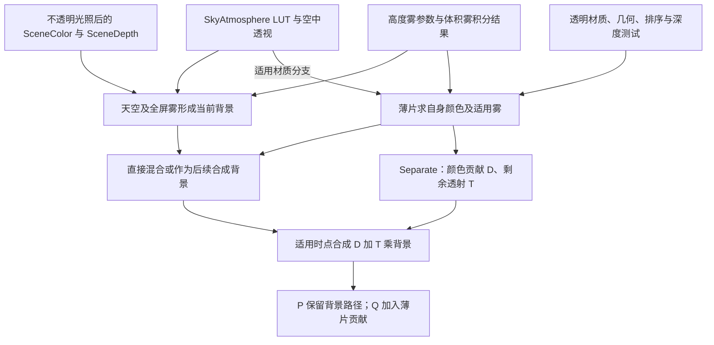
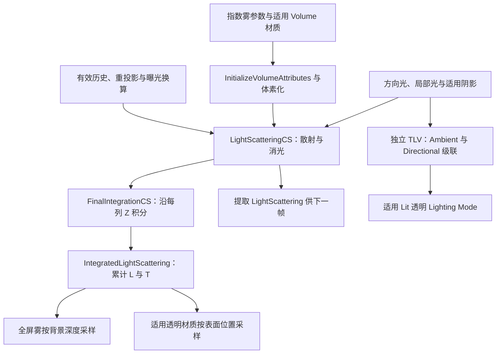

# 第 18 章：透明物体、天空、雾与体积效果

[返回目录](../README.md) · [回顾直接光照](16-direct-lighting.md) · [本章答案](../appendices/answers/18-translucency-sky-fog-volume.md)

> **适用基线：**UE 5.7.4，Changelist 51494982，Windows／D3D12／SM6，桌面传统延迟渲染，配置 A。Substrate、Nanite、Lumen、VSM、硬件光线追踪与 MegaLights 关闭；初始场景不放 SkyAtmosphere 和 ExponentialHeightFog，执行 `r.Fog 0`、`r.VolumetricFog 0`。透明薄片保留为 Unlit、Translucent、Two Sided、Opacity 0.35。本章环境扩展练习在 A 的副本逐项启用天空和雾。
>
> **证据范围：**本章静态核对本机源码，没有启动项目或抓取 GPU 帧。实现结论标为 **[源码已确认]**，手算与示意数据标为 **[教学简化]**，运行步骤及预期标为 **[尚未验证]**。

## 18.1 学习目标：从不透明表面到穿透视线

第 14～16 章把不透明表面的 Base Pass、GBuffer、阴影和直接光照连成一条路径。透明表面改变了这个前提：它不一定把自己的深度写入主不透明 SceneDepth，也不能把自己的颜色简单替换为背景。天空和雾则把“视线中没有普通几何”也变成有颜色、有透射率的结果。

本章回答四个问题：透明几何何时绘制、怎样排序和混合；天空大气怎样从 LUT 与相机空中透视得到颜色；指数高度雾和体积雾有什么区别；这些结果如何与贯穿场景的 P、Q 相遇。配置 A 的关闭条件不是“引擎没有这些系统”，而是为了让前面章节先隔离直接光照。

完成本章后，应能把一个颜色变化分别归因于表面排序、透明混合、表面自身的雾、大气透射或三维介质光照；能从中间纹理的 RGB 与 Alpha 语义推导合成，而不是把每个 Alpha 都叫作 Opacity。前置知识是第 03 章的混合、第 04～05 章的材质与曝光、第 09 章的资源依赖、第 13 章的反向深度，以及第 16、17 章的表面光照。

[打开透明与环境合成静态图](../assets/diagrams/18-translucency-sky-fog-volume-1.png)



**[教学简化]**图概括普通桌面延迟、非水下视图的依赖；直接混合与 Separate 是两种可能路径，图中不表示同一薄片被执行两遍。天空 LUT 可提前生成，AfterDOF 透明也可先画进纹理、后合成。配置 A 的天空与雾节点没有有效贡献，背景继续进入透明路径。它不是在所有透明画完以后统一再涂一次雾，也不表示每条箭头都有 CPU 等待。

### 18.1.1 表面透明与介质透射不是同一参数

表面透明在本章由源色 `Cs` 和不透明度 `a` 控制。介质沿一段视线产生透射率 `T` 与新增散射 `L`，可写成 `Cout=L+T*Cb`。两者形式相近，但前者是当前表面的材质与覆盖近似，后者依赖路径长度、密度、光源和遮挡。Opacity 0.35 不表示空气每走一厘米都吸收 35%，也不能由薄片的 Opacity 直接推导体积雾密度。

**[教学简化]**均匀介质的 Beer-Lambert 透射为 `T=exp(-sigma_t*d)`，其中 `sigma_t` 是消光系数，包含吸收和散射出视线，`d` 是路径长度。`tau=sigma_t*d` 称为光学厚度。若 `sigma_t=0.001/cm`、`d=100 cm`，则 `tau=0.1`、`T≈0.90484`；走两倍距离时 `T≈0.81873`，不是简单减去同一个百分比。空间不均匀时要沿路径积分消光系数。

散射进视线的部分还依赖光到达介质的能量、光源方向、阴影和相函数。相函数描述散射朝不同方向的分布，不是表面法线上的 Lambert 点积。这个区别解释了为何镜头朝向太阳时的雾与背向太阳时不同，也解释了体积光柱为什么需要光照和遮挡信息。后续公式只取足够理解资源语义的近似，不把大气、解析高度雾和体积雾强行视为同一数值模型。

## 18.2 第一阶段：透明材质、排序和目标资源

### 18.2.1 八维定位

| 维度 | 本阶段的回答 |
|---|---|
| 作用 | 确定透明对象的适用 Pass、排序键、深度策略和颜色目标 |
| 原因 | 透明通常不能用不透明深度写入和任意绘制顺序替代 |
| 输入 | 材质 Blend Mode、Opacity、是否受光、View、primitive 包围体和 Pass 类型 |
| 过程 | 选择 Mesh Pass，按策略更新距离键，设置深度测试／模板／混合状态，分配目标 |
| 输出 | 可执行的透明 Mesh Draw Commands 及主场景或独立透明纹理 |
| 实现 | `SetTranslucentRenderState`、`UpdateTranslucentMeshSortKeys`、`RenderTranslucencyViewInner` |
| 条件 | 材质是否透明、是否启用 After DOF／Motion Blur、Separate Translucency 和 OIT 等 |
| 成本与误区 | 透明排序和过度绘制昂贵；透明物体不自动写主深度，也不保证物理正确的层间排序 |

### 18.2.2 Blend Mode 不是一条固定公式

**[源码已确认]**传统 `BLEND_Translucent` 在普通、非 Holdout 透明 Pass 中使用 `SourceAlpha/InverseSourceAlpha`，即接收未预乘的源 RGB，由混合单元乘源 Alpha。AlphaComposite 则使用 `One/InverseSourceAlpha`，假定源颜色已按 Alpha 预乘。这是两种不同的输入约定，见 [S18-01](#s18-01)。

对教学薄片，若源颜色为 `Cs`、不透明度为 `a`、背景为 `Cb`，简单普通透明合成可写成：

```text
Cout = Cs * a + Cb * (1-a)
```

这里的 `Cs` 是未预乘源色，`Cs*a` 才是它在这一层贡献的颜色。若已把源色手工乘过 `a`，又用普通 Translucent 的混合状态，就可能重复乘 Alpha，让边缘偏暗。反过来，把未预乘颜色直接交给 AlphaComposite，也不能期待与普通透明相同。

| 普通非 Holdout 传统模式 | 混合单元的 RGB 因子 | 必须同时检查的 Shader 输出 |
|---|---|---|
| Translucent | 源乘 Alpha，目标乘 1-Alpha | 未预乘 RGB，Alpha 为当前表面 Opacity |
| AlphaComposite | 源乘 1，目标乘 1-Alpha | 源 RGB 按预乘约定提供 |
| Additive | 源乘 1，目标乘 1 | 当前 Shader 已在源 RGB 中乘 Opacity，并输出 Alpha 0 |
| Modulate | 源乘目标颜色，目标乘 0 | 使用相应调制颜色，不能套普通 over 公式 |

**[源码已确认]**Additive 的 `One/One` 不表示材质 Opacity 无效：当前传统像素分支输出 `Color * Fogging.a * Opacity`，见 [S18-13](#s18-13)。因此解释结果必须把 Shader 输出与硬件混合连起来。Substrate 双源混合、有色透射、Holdout 等分支有其他约定；在当前非 Substrate 的状态选择中，`BLEND_TranslucentColoredTransmittance` 会回落到普通透明混合，不能只凭枚举名字声称已经得到有色介质传输。

### 18.2.3 深度测试与深度写入分开

透明 Pass 通常读取不透明 SceneDepth，使用 `CF_DepthNearOrEqual` 检查透明片是否位于已绘制表面前方，但不把透明片深度写回同一深度目标。**[源码已确认]**`SetTranslucentPassDepthStencilState` 的常规分支将深度写入设为 false；如果材质要求禁用深度测试，才使用 `CF_Always`，见 [S18-02](#s18-02)。

所以“透明物体不写深度”与“透明物体完全不看深度”是两句话。Q 的蓝色薄片只有位于已存不透明表面的前方或满足相等条件时才通过常规测试，却不把自己的深度变成主不透明遮挡证据。After Motion Blur 之类 Pass 还会使用不同目标和深度条件；不能把这里的绑定推广到所有透明 Pass。

**[教学简化]**假设 Q 的反向设备深度中，背景方块为 0.2，薄片为 0.5，近处使用较大值，`0.5>=0.2` 通过；背景深度仍是 0.2。把薄片移到方块后方，薄片深度为 0.1，测试拒绝。数字仅表示反向 Z 比较，不是以米计的距离。Custom Depth、透明 Velocity、特殊水或其他专用深度输出需要另查条件；它们不等于普通透明已经写了主不透明 SceneDepth。

### 18.2.4 排序解决的是近似问题

透明混合一般不满足交换律。两个颜色层 A、B 的顺序不同，`A over B` 与 `B over A` 会产生不同结果。引擎按可配置的距离策略排序，再绘制透明 Mesh Commands。

**[源码已确认]**`UpdateTranslucentMeshSortKeys` 用 primitive 包围体中心，支持按到 ViewOrigin 的距离、沿指定轴的投影距离、或 ViewMatrix 变换后的 projected Z 排序，并加入 primitive 的 DistanceOffset。普通距离键为从远到近组织，也有 `bInverseSorting` 分支；静态键还保存组件的透明排序优先级，见 [S18-03](#s18-03)。这是一组排序近似，不是逐像素的完整深度排序。

一个大而弯曲的透明网格、相交的两片玻璃或粒子系统，都可能在同一对象内部出现排序错误。两片面在屏幕左边 A 更近、右边 B 更近时，给每片一个排序数字就不能同时满足两边。Sort Priority 可以表达作者层级，不能补出缺失的逐像素次序。引擎另有三角形排序和 Sorted Pixels OIT 等可选实现，本章普通排序推导不声称涵盖这些分支；开启它们必须同时检查平台、项目和运行开关，见 [S18-24](#s18-24)。

## 18.3 第二阶段：透明 Pass、Separate Translucency 与合成

### 18.3.1 八维定位

| 维度 | 本阶段的回答 |
|---|---|
| 作用 | 在已有不透明背景上绘制透明表面并把结果合成回视图 |
| 原因 | 当前表面需要与背景组合，并遵守深度测试和适用的混合状态 |
| 输入 | 颜色目标及已有内容、SceneDepth、透明 Mesh Commands、适用光照和雾参数 |
| 过程 | 建立目标，绑定深度只读，绘制排序后的透明几何，必要时在独立分辨率纹理中合成 |
| 输出 | 主 SceneColor 的透明结果，或待后续 DOF／Motion Blur 合成的独立纹理 |
| 实现 | `RenderTranslucencyInner`、`RenderTranslucencyViewInner`、`FTranslucencyComposition::AddPass` |
| 条件 | Standard、AfterDOF、AfterMotionBlur、Holdout 和 All 等 Pass 由材质与 View 条件选择 |
| 成本与误区 | 独立透明分辨率可省像素但需要上采样；透明目标不是 GBuffer，不能按不透明材质读取方式理解 |

### 18.3.2 Pass 类型改变时机和资源

UE 维护多个 `ETranslucencyPass`：Standard、StandardModulate、AfterDOF、AfterDOFModulate、AfterMotionBlur、Holdout 和 All。一个材质是否进入这些 Pass，取决于它的 Blend Mode、After DOF／Motion Blur 设置、View 的分离透明能力以及相关开关。

**[源码已确认]**`RenderTranslucencyInner` 依据 Pass 和缩放决定是否使用 Separate Translucency；`RenderTranslucencyViewInner` 建立颜色目标，除 AfterMotionBlur 之外的该处常规路径绑定深度 `DepthRead_StencilWrite`，再组织 Mesh Draw Commands 和 Raster Pass，见 [S18-04](#s18-04)。因此“透明总在后处理最后绘制”不准确。

AfterDOF 尤其容易误读。当前 `IsSeparateTranslucencyEnabled` 的注释明确说明：它可以在帧内更早绘制，先保存在独立纹理，稍后才在景深之后合成。Pass 名称描述它相对于景深的效果位置，不保证几何 Draw 的 GPU 事件一定排在 DOF 后面。配置 A 关闭景深，也仍应记录材质选择了哪个透明 Pass，不能因为 DOF 当前没有模糊就断言两类资源完全相同，见 [S18-14](#s18-14)。

`r.SeparateTranslucencyScreenPercentage` 可以让独立透明目标低于内部场景分辨率，动态透明分辨率也可能参与尺寸选择。当前最近深度邻居上采样还要求有效的高低分辨率深度、发生缩放、比例接近 0.5，以及相应模式开关；不是设成任意百分比都会进入同一分支。该 Shader 根据深度结果选择点采样或双线性采样，见 [S18-15](#s18-15)。低分辨率能减少像素，但细边缘和粒子细节可能丢失；最终窗口 1280×720 不能证明透明 Pass 也处理同样数量的像素。

### 18.3.3 Separate Translucency 不是“另一张最终画面”

独立透明纹理保存某个透明 Pass 的颜色贡献和背景可见性信息。对于本章普通透明、无额外调制的路线，把 RGB 记作 `D`，Alpha 记作 `T`。`T` 是剩余背景透射率，不是累积不透明度；初始空纹理的 `D=0,T=1` 表示没有透明贡献且背景全部可见。

**[源码已确认]**普通 Separate 目标使用 `FClearValueBinding::Black`，其定义是 `(0,0,0,1)`。普通透明混合的 RGB 因子是 `SourceAlpha/InverseSourceAlpha`，Alpha 因子却是 `Zero/InverseSourceAlpha`。因此每画一个源色 `Cs`、Opacity `a` 的片元，得到：

```text
Dnew = Cs*a + Dold*(1-a)
Tnew = Told*(1-a)
最终 Cout = D + T*Cb
```

最后一式对应 `ComposeSeparateTranslucency.usf` 的实际合成；含 Separate Modulation 时，背景项还要乘调制纹理 RGB，见 [S18-16](#s18-16)。这是“未预乘源色经混合形成已累积颜色贡献”的过程。已经存入 D 的贡献不能在最终合成时再乘一次 `1-T`；那会重复衰减。每层的 `a`、目标的 `T` 与显示输出的 Alpha 是不同层次，不能凭通道名互换。

**[教学简化]**单层 `Cs=(0.2,0.8,1)`、`a=0.35`，空目标绘制后 `D=(0.07,0.28,0.35)`、`T=0.65`。对 `Cb=(0.1,0.2,0.4)`，最后合成 `(0.135,0.41,0.61)`，与直接 over 相同。若把存储 Alpha 0.65 当作不透明度再做普通混合，就会得到另一套错误权重。

对蓝片 Q，若它在 Standard 透明 Pass，背景通常已经是 Q 下方不透明方块及雾的当前颜色。薄片输出的 `Cs` 与 `a=0.35` 混合到背景；若它被设为 AfterDOF，则可能进入独立纹理，在景深处理后合成。两种路径都可能合理，但不能把它们的中间纹理直接当作最终显示颜色。

### 18.3.4 材质求色、背景混合与折射要分开

本书蓝片只有 Tint、EmissiveStrength 和 Opacity，且没有折射。普通像素 Shader 可以只算自己的颜色和 Alpha，由固定功能混合单元使用目标已有颜色；无需在材质里显式采样 SceneColor。Separate 的最终 Compose Shader 则确实采样背景纹理。两处都能让蓝片与背景组合，但发生读取的硬件位置不同，不能统一写成“蓝片像素 Shader 先读背景”。

一旦材质启用折射、SceneColor 节点或其他需要屏幕颜色的表达式，就增加了 SceneColor Copy、失真或特殊 Shader 路径。屏幕颜色通常只含某一时刻已生成的结果，不能保证包含所有透明层或屏幕外景物。本章不为无折射薄片引入这些额外读取，也不把透明排序正确等同于折射传播正确。第 19 章还会说明透明运动与历史重建的另一组条件。

### 18.3.5 Unlit 仍可能计算雾

**[源码已确认]**透明雾宏检查材质是否允许透明雾、是否为透明 Blend Mode、是否使用 SceneColor Copy，并按 `MATERIAL_COMPUTE_FOG_PER_PIXEL` 选择顶点或像素雾；它没有把 Unlit 一律排除。体积雾则在适用透明分支按像素采样，因为逐顶点插值体积结果容易失真，见 [S18-17](#s18-17)。因此“Unlit 不执行普通受光材质分支”不能推出“Unlit 的颜色永远不受介质影响”。

当前普通 Translucent 的输出可理解为 `float4(Cs*Tq+Lq,a)`，其中 `Tq,Lq` 是相机到薄片位置的适用雾。混合后为 `a*(Cs*Tq+Lq)+(1-a)*Cb_fogged`。背景方块可按自己的深度先做雾，薄片又按自己的位置形成源贡献；不是拿背景深度给薄片重复涂一遍。若简单材质所有颜色共享同一前段介质，源和背景前段的雾贡献也由 `a` 与 `1-a` 分配，不能忽略这个权重再额外全屏叠一次。

大而稀疏的透明三角形使用逐顶点高度雾时，中间像素来自插值，不等于逐像素重新积分。选择 Compute Fog Per Pixel 可以改变误差和成本。读取 SceneColor Copy 的材质会跳过上述常规透明雾宏，因为背景通常已经有雾；源码注释也说明额外新增颜色未必因此获得正确雾。SkyAtmosphere 空中透视又有像素雾、项目支持、非 Sky 材质和有效资源等条件，见 [S18-18](#s18-18)。

## 18.4 第三阶段：天空大气，从 LUT 到屏幕颜色

### 18.4.1 八维定位

| 维度 | 本阶段的回答 |
|---|---|
| 作用 | 计算没有普通几何背景或远处大气路径的散射与透射颜色 |
| 原因 | 天空和大气不是简单的一张固定天空盒，观察方向和光源会改变结果 |
| 输入 | SkyAtmosphere 组件、太阳／大气参数、相机与 View、可选阴影和 LUT 资源 |
| 过程 | 生成或复用 Transmittance、Multi-Scattered Luminance、SkyView 与 Aerial Perspective LUT，采样并绘制天空 |
| 输出 | 各类大气 LUT、相机空中透视体积及写入 SceneColor 的适用贡献 |
| 实现 | `ShouldRenderSkyAtmosphere`、`RenderSkyAtmosphereLookUpTables`、SkyAtmosphere Shader |
| 条件 | Scene 有 SkyAtmosphere、Atmosphere ShowFlag、平台支持且 `r.SkyAtmosphere` 大于 0 |
| 成本与误区 | LUT 可复用但有分辨率和采样成本；天空颜色不等于曝光后最终 RGB，也不自动等于雾颜色 |

### 18.4.2 天空的几张 LUT 各司其职

**[源码已确认]**天空渲染参数包含 Transmittance LUT、Multi-Scattered Luminance LUT、SkyView LUT 和 3D Camera Aerial Perspective Volume；对应 Compute Shader 分别注册并写入这些资源，见 [S18-05](#s18-05)。

可用教学模型理解它们：Transmittance 近似光穿过大气后的透射，Multi-Scattered Luminance 汇总多次散射近似，SkyView 按观察方向提供天空颜色，Camera Aerial Perspective Volume 为相机射线上的距离切片提供远处大气透视。它们并非四张“最终颜色贴图”。

`ShouldRenderSkyAtmosphere` 检查 Scene 是否有天空大气、Atmosphere ShowFlag、平台支持及 `r.SkyAtmosphere`，见 [S18-06](#s18-06)。关闭任一必要条件都会让天空路径不参与；配置 A 的关闭是实验选择，不应写成该组件不存在。

LUT 的更新频率也不同。当前渲染器按缓存版本判断 Transmittance 与 Multi-Scattered Luminance 是否要重算，再准备每个 View 的相关天空与空中透视资源；并非每个可见像素都独立重新算完全部大气传播。LUT 节省重复积分，同时引入分辨率、参数化、插值和更新开销，见 [S18-19](#s18-19)。

### 18.4.3 大气与指数高度雾的关系

大气散射可以参与天空、太阳光和远处视线的透射。指数高度雾是独立的雾模型，可配置密度、最大不透明度、第二雾层、非方向性／方向性散射颜色。两者可以在适用平台和开关下互相提供参数，但不能把“天空大气启用”简化为“所有雾自动启用”。

相机空中透视体积有深度切片，为有距离的场景位置提供到相机的散射与透射近似；看向没有几何的天空方向，则还需按天空光程与 LUT 等路径处理。两者都不把远处天空变成一块普通深度平面。观察时应分别看天空 Pass、Aerial Perspective 采样和最终颜色。

**[源码已确认]**天空 Shader 的积分中把介质消光乘步长形成光学厚度，再用 `exp(-SampleOpticalDepth)` 计算透射，分别处理 Rayleigh 与 Mie 散射，相函数中可见 Mie 的 Henyey-Greenstein 项和 Rayleigh 项，见 [S18-20](#s18-20)。天空偏蓝、日落色与太阳附近的亮度分布来自这些参数和波长相关衰减，不能把天空系统归结为给屏幕填一张蓝色纹理。

### 18.4.4 天空背景不等于 SkyLight 照亮物体

`RenderSkyAtmosphere` 把现有 SceneColor 作为 Load 目标，并以深度与模板只读方式绑定。当前视图若有 Sky Material，会影响该 Pass 是否绘制天空像素，空中透视仍需按相应条件处理，见 [S18-21](#s18-21)。因此天空来源可能是大气屏幕路径，也可能包含专门天空网格；“无普通几何背景”不意味着引擎所有天空都完全没有网格。

SkyAtmosphere 产生可见天空，并不自动保证红方块获得对应的环境光。环境照明还要看第 17 章的 SkyLight、捕获、间接光与反射路径；配置 A 没有 SkyLight，不能只加一个 SkyAtmosphere 就声称获得完整天空间接光。太阳大气光设置、SkyLight 更新、曝光与天空显示应该分别记录，才有办法区分“背景变亮”和“方块受光改变”。

## 18.5 第四阶段：指数高度雾与屏幕合成

### 18.5.1 八维定位

| 维度 | 本阶段的回答 |
|---|---|
| 作用 | 根据视线距离和高度密度把场景颜色衰减并加入散射颜色 |
| 原因 | 介质会吸收、散射光，远处表面不应与近处表面使用相同透明度 |
| 输入 | SceneDepth、View 雾参数、适用大气／云／局部雾和体积结果；目标保留已有 SceneColor |
| 过程 | 全屏雾 VS/PS 读取深度与参数，计算透过率和 Inscattering，再按混合状态写回颜色 |
| 输出 | 应用高度雾后的 SceneColor 与适用 Alpha／Coverage |
| 实现 | `SetupFogUniformParameters`、`RenderViewFog`、`FDeferredShadingSceneRenderer::RenderFog` |
| 条件 | Scene 有指数高度雾且 View 可渲染；`r.Fog` 和 ShowFlag 等条件共同决定执行 |
| 成本与误区 | 全屏像素、深度边界和体积采样有成本；`r.Fog=0` 不等于关闭天空、云或所有用户雾材质 |

**[源码已确认]**`RenderViewFog` 设置无深度写入的全屏 Raster Pass，按是否支持体积雾、局部雾体积、云采样等选择 Pixel Shader；`RenderFog` 把 SceneColor 作为 Load 目标，并以 SceneDepth 只读／模板写入绑定，见 [S18-07](#s18-07)。

在简化模型中，令 `T(d)` 为视线长度 d 的透过率，`C_f` 为雾散射颜色，`C_s` 为已有表面颜色：

```text
Cout = T(d) * Cs + (1-T(d)) * Cf
```

若存在方向性散射、天空颜色、体积光和最大不透明度，实际 `T` 与 `Cf` 由更多参数组成。公式用于理解“越远通常衰减越多”，不是 UE Shader 的完整逐项实现。

**[教学简化]**若 `Cs=(1,0,0)`、`Cf=(0.2,0.4,1)`、`T=0.75`：

```text
Cout = 0.75*(1,0,0)+0.25*(0.2,0.4,1)
     = (0.80, 0.10, 0.25)
```

这只是线性工作空间示例，不是显示器最终 sRGB 数值，也不包含曝光与色调映射。

### 18.5.2 深度不是直接拿来当米数

**[源码已确认]**`HeightFogPixelShader.usf` 读取设备深度后，先用 `ConvertFromDeviceZ` 转换，再用屏幕射线向量重建相机到表面的相对位置。这个位置进入 `CalculateHeightFog`，并产生体积雾采样坐标，见 [S18-22](#s18-22)。因此不能把反向 Z 的原始 0.2 当成 0.2 米代入衰减公式，也不能只比较两个原始深度的差就认为得到了介质厚度。

主 SceneDepth 在 Q 通常属于方块，全屏雾据此处理背景；薄片没有因此失去自己的几何位置。透明 Shader 另用插值或重建的薄片位置计算适用雾。天空没有普通表面时，Shader 还有设备深度为 0 和只处理已渲染不透明等条件，不能把所有深度空白像素都当作距离为零。

雾 PS 主要输出散射与透射，已有 SceneColor 可由混合单元作为目标参与，不要求该 PS 在所有排列中显式采样 SceneColor。普通不传播输出 Alpha 的路径使用源因子 One、目标因子 SourceAlpha，此时源 Alpha 存透射率；支持 Alpha 传播的路径可改为输出 Coverage，再用 InverseSourceAlpha 得到相同 RGB 背景权重。这再次说明“同一个 Alpha 通道”没有脱离分支的固定含义，见 [S18-07](#s18-07)。

### 18.5.3 指数高度密度与解析积分

“指数高度雾”中的指数先描述密度随高度变化。教学模型可写为 `density(z)=density0*exp(-h*(z-z0))`：`h` 控制高度衰减，`z0` 为参考高度。沿水平和倾斜视线走相同距离，穿过的密度分布不同，因此雾不能只依赖屏幕上的远近排序。

**[源码已确认]**当前 Shader 参数化使用 `exp2`，`CalculateLineIntegralShared` 中包含 `(1-exp2(-Falloff))/Falloff`，接近零时改用 Taylor 展开避免不稳定的除法。第一与适用第二雾层的积分相加，再乘实际射线长度；透射由 `exp2(-ExponentialHeightLineIntegral)` 得到，并受最大雾不透明度等条件约束，见 [S18-23](#s18-23)。这里不能把组件原始 Fog Density 数字不经参数换算就当成前文 Beer-Lambert 例子的每厘米消光系数。

Start Distance 会排除射线前段，Fog Cutoff Distance、第二层、方向散射与最大不透明度也会改变结果。Fog Max Opacity 的限制可以理解为给背景保留一个最低可见权重，而不是把颜色直接 clamp 到该值。解析高度雾用可控密度和颜色模型快速给出沿视线结果，不会逐体素追踪每个局部光和遮挡，所以仅调高 Fog Density 不会自动形成真实的点光阴影光柱。

## 18.6 第五阶段：体积雾，三维网格中的光散射

### 18.6.1 八维定位

| 维度 | 本阶段的回答 |
|---|---|
| 作用 | 在相机视锥的低分辨率三维介质网格中累计雾密度、光散射和透射 |
| 原因 | 体积雾的光照与遮挡沿射线变化，单个全屏二维颜色不足以表示它 |
| 输入 | 指数雾参数、View 近远平面、局部雾体积、方向／局部光、阴影、历史体积 |
| 过程 | 建立 XY×Z 网格，准备介质与光照，计算并时间累积散射，最后沿深度积分 |
| 输出 | 3D LightScattering、IntegratedLightScattering 及消费者所需参数 |
| 实现 | `ShouldRenderVolumetricFog`、`ComputeVolumetricFog`、VolumetricFog Shader 与局部光注入 |
| 条件 | 有指数雾、启用体积雾、距离大于零、ShowFlag 和平台能力满足 |
| 成本与误区 | 体素数量、光源注入和历史重投影有成本；它不是只把全屏雾 Pass 运行得更慢 |

**[源码已确认]**`ShouldRenderVolumetricFog` 要求普通 Fog 可渲染、Scene 存在、全局体积雾开关和 ShowFlag 开启、存在指数雾、组件启用体积雾且 `VolumetricFogDistance>0`，见 [S18-08](#s18-08)。

网格 XY 尺寸由目标视图尺寸除以 `r.VolumetricFog.GridPixelSize` 后向上取整，Z 维由 `r.VolumetricFog.GridSizeZ` 给出；注册初值分别为 16 和 64，见 [S18-09](#s18-09)。以 1280×720、16、64 的教学参数估算，网格约 `80×45×64=230400` 个体素，远小于全分辨率像素的三维展开。

体积雾不是把每个体素都当作实体盒子绘制。它在视锥深度方向使用非均匀、对数相关的分布，使有限 Z 采样覆盖从近处到雾距离的范围；`GetVolumetricFogGridZParams` 会把起始距离与近裁剪面比较后计算深度参数。相机移动后，网格代表的世界空间范围也变化，不能把某个体素索引当作固定世界坐标。

网格资源尺寸与当前 View 的有效网格尺寸还可能不同。动态分辨率、纹理分配范围和多视图条件下，需要同时核对 Resource Grid、View Grid 和 UV 缩放，不能只用窗口大小推导实际纹理内全部体素的有效区域。增大雾的远距离而保持切片数量不变，会让有限样本覆盖更长光程；这是范围与细节之间的取舍，不是免费扩大同样精度的体积。

### 18.6.2 光注入、阴影和时间历史

局部光、方向光和光函数可以向体积网格注入散射；有阴影的光还需要适用阴影资源。**[源码已确认]**局部光注入 Shader 具有动态阴影、时间重投影和 VSM 等排列；注入结果写入 `VolumetricFog.LocalShadowedLightScattering`，见 [S18-10](#s18-10)。配置 A 关闭阴影虚拟贴图，因此该排列不会成为本章基线的实际主路。

体积雾每帧只有有限样本，时间重投影将当前位置映射到上一帧网格，复用历史散射以减少噪声。`r.VolumetricFog.TemporalReprojection` 注册初值为 1，HistoryWeight 初值为 0.9；普通相机移动不等于一律禁用历史，Camera Cut、前帧变换重置、非实时更新或缺少历史资源等条件才明确影响当前历史有效性。注册初值也可能被 Scalability 或运行配置覆盖，不能当作捕获值。

**[源码已确认]**历史混合发生在 `LightScatteringCS` 计算散射与消光的过程中，然后 `FinalIntegrationCS` 沿 Z 积分。提取给下一帧的是 `LightScattering`，不是已经沿整条射线累加的 Integrated 结果；历史 RGB 会先换算到当前预曝光尺度，消光项不乘曝光，见 [S18-25](#s18-25)。这条次序决定了历史的含义，不能描述成“积分完成以后再对最终体积贴图做一次 TAA”。

**[教学简化]**如果某处散射当前值为 1、有效历史为 0、历史权重 0.9，简单线性混合得到 0.1。它解释了抑制噪声与响应速度之间的矛盾，但不代表真实 Shader 每处权重都恒定为 0.9。快速移动的光或阴影会使历史内容过时，拖尾是时间重建的结果，不是空气真的记住上一帧的光。

[打开体积资源与消费者静态图](../assets/diagrams/18-translucency-sky-fog-volume-2.png)



**[源码已确认]**`ComputeVolumetricFog` 中可定位局部光注入、介质属性初始化、适用 Volume 材质体素化、散射 Compute 和最终积分，见 [S18-26](#s18-26)。图的 TLV 分支是另一套透明受光资源，不是体积雾积分后的别名。配置 A 关闭体积雾时，图的体积雾主支路不执行；TLV 是否更新仍取决于它自己的开关和渲染条件。

### 18.6.3 沿射线的积分在累积什么

**[源码已确认]**`FinalIntegrationCS` 为每个 XY 列从近到远遍历 Z。初始累计散射 `Lacc=0`、透射 `Tacc=1`。每一片读取散射项 `S`、消光系数 `sigma_t` 和实际步长 `ds`，计算分段透射，再用进入该片之前的累计透射衰减它新增的光，见 [S18-27](#s18-27)。

忽略源码的近处淡入和很小消光值保护，可写成：

```text
Tstep = exp(-sigma_t*ds)
Lstep = S*(1-Tstep)/sigma_t
Lacc_new = Lacc_old + Tacc_old*Lstep
Tacc_new = Tacc_old*Tstep
IntegratedLightScattering[z] = (Lacc_new, Tacc_new)
```

当消光趋于零时，分段散射的解析极限为 `S*ds`。实际实现还用 `max(sigma_t,0.00001)` 保护除法，并把 FadeInLerpValue 纳入颜色和透射计算。纹理在每个深度切片保存从起点累计到该处的结果，不是只保存最后一个最远切片；消费者才能按表面距离取到此前整段介质的贡献。

**[教学简化]**设两片已经算好的局部积分颜色分别为 `L1=(0.1,0.1,0.1)`、`L2=(0.2,0.1,0)`，透射 `T1=0.8,T2=0.5`：

```text
Ltotal = L1 + T1*L2 = (0.26,0.18,0.10)
Ttotal = T1*T2 = 0.40
背景 Cb=(1,0,0) 时：Cout=Ltotal+Ttotal*Cb=(0.66,0.18,0.10)
```

这里 L1/L2 已经是各片内部积分后的颜色，不要再拿它们代替公式中的源项 S 除一次消光。第二片位于更远处，它的贡献先穿过第一片才到相机；这就是 `T1*L2` 的含义。三维雾的 Alpha 在此也表示透射，但与 Separate Translucency 的表面层累积来自不同计算。

### 18.6.4 结果怎样回到表面颜色

全屏高度雾与适用透明 Shader 都能调用 `CombineVolumetricFog`。它读取 `IntegratedLightScattering`，处理有效区域、起始距离与预曝光后，将体积散射和解析雾按透射组合，见 [S18-28](#s18-28)。解析部分也有排除距离等处理，因此不应在材质里另外把同一段介质整段重复叠加。

体积结果对 P 的影响通过按不透明深度合成背景体现；对 Q 还可能通过透明自身位置采样体现。不能仅因为 SkyAtmosphere 也有 3D 纹理，就断言天空大气必然读取这张体积雾纹理。云、局部雾、Heterogeneous Volumes 与稀疏体积等有各自条件，本章只把源码已经定位的消费者作为主线，不将所有体积效果合并成一个 Pass。

## 18.7 透明光照体积：给受光透明表面的近似输入

透明薄片若使用 Lit 而非本章的 Unlit，需要某种光照信息。UE 的 Translucency Lighting Volume 是围绕 View 的体积资源，不是阴影图，也不是体积雾本身。

| 维度 | 本阶段的回答 |
|---|---|
| 作用 | 在 View 周围存储适用 Lit 透明材质可采样的光照近似 |
| 原因 | 普通透明不提供一层完整不透明 GBuffer，受光需要自己的路径 |
| 输入 | View 与级联范围、适用光源／阴影／环境输入、透明 Lighting Mode |
| 过程 | 建立并清除体积、注入光照、按配置过滤，再由透明表面采样 |
| 输出 | 各级联 Ambient 与 Directional 3D 光照纹理 |
| 实现 | `FTranslucencyLightingVolumeTextures::Init`、`RenderTranslucencyLightingVolume`、`GetTranslucencyVolumeLighting` |
| 条件 | TLV 更新开关、View 与渲染路径、材质模型和 Lighting Mode |
| 成本与误区 | 维度影响三次方存储／计算量；它不是沿视线累计雾颜色和透射的体积 |

**[源码已确认]**开关名是 `r.TranslucencyLightingVolume`，维度 CVar 是 `r.TranslucencyLightingVolume.Dim`，注册初值 64，并在取值时裁剪到 4～2048。内外级联距离注册初值为 1500、5000 cm，分别有 Ambient 与 Directional 资源；这些是源码初值，实际质量配置可能覆盖，见 [S18-11](#s18-11)。不要把 C++ 变量名 `GTranslucencyLightingVolumeDim` 拼成不存在的控制台变量。

可以把它理解为“在空间采样点上存一份透明光照近似”。透明表面根据自己的世界位置查样，不必像不透明延迟光照那样拥有完整 GBuffer。但体积分辨率有限，远近级联、光源范围和阴影支持都会影响精度。

**[源码已确认]**`GetTranslucencyVolumeLighting` 根据 Lighting Mode 区分逐顶点、Volumetric Directional／NonDirectional、Surface Lighting Volume 等分支，并计算内外体积 UV 和过渡权重。Surface ForwardShading 还有独立逐表面受光逻辑及条件性的体积近似，不能写成“所有 Lit 透明都只读 TLV”，见 [S18-29](#s18-29)。普通桌面延迟路径中的 Lit 透明也可以在自身绘制时前向求光；这不表示整个项目已改成 Forward Renderer。

本书蓝片是 Unlit，因此不应因为存在 TLV 就声称它自动接受方向光和点光直接照明。它的源颜色来自 Emissive，随后经过适用雾与透明混合。配置 A 中阴影对 Q 的主要影响来自下方不透明背景；环境扩展启用体积雾后，有阴影的介质光照也可能改变 Q，但这不是蓝片突然获得 Default Lit 的表面 BRDF。

| 对比项 | Translucency Lighting Volume | Volumetric Fog |
|---|---|---|
| 存什么 | 空间位置附近的光照近似 | 介质散射／消光及沿视线累计 L、T |
| 空间组织 | View 周围内外级联体积 | 视锥 XY 网格与非均匀 Z 切片 |
| 主要消费者 | 适用 Lit 透明 Lighting Mode | 全屏雾与适用透明雾分支 |
| Unlit 蓝片 | 不因此获得普通 Lit 受光 | 允许透明雾时仍可受介质影响 |
| 尺寸控制 | `r.TranslucencyLightingVolume.Dim` | `r.VolumetricFog.GridPixelSize` 与 `GridSizeZ` |

TLV 的 `Dim` 翻倍意味着三个维度同时翻倍，单张体积体素数变为八倍；扩大级联覆盖距离而保持 Dim 不变，则降低每单位世界距离的采样密度。模糊过滤能稳定低频光照，也会限制空间细节。不要把体积雾网格的 XY 像素尺寸调节与 TLV 立方维度变化当成同一种四倍成本规则。

## 18.8 P、Q 与天空／雾的贯穿解释

P 是未被蓝片覆盖的红方块不透明表面。配置 A 关闭雾与天空大气时，P 的颜色链条由 Base Pass、阴影、适用直接／间接及反射贡献和后处理组成。若开启指数高度雾，P 的已有 SceneColor 会在雾 Pass 中按其深度参与衰减与散射合成；若开启体积雾，还会按相应路径组合累计体积结果。

Q 是蓝色透明薄片覆盖方块的屏幕位置。常规透明用不透明深度做测试，再由混合单元或 Separate 合成与背景组合。薄片不自动写不透明 SceneDepth，因此它不会让方块在前面的不透明 Pass 中消失。Q 的最终颜色可以受雾影响，但要区分：

1. 薄片自己的 `Cs`、Opacity 以及按薄片位置计算的适用雾如何形成源贡献；
2. 下方方块已经经过哪些光照和雾；
3. 透明 Pass 处于 DOF 前还是后；
4. Separate Translucency 合成时使用哪种分辨率和上采样。

**[教学简化]**贯穿蓝片的 `Tint=(0.1,0.6,1)`、`EmissiveStrength=300`，无雾、未预曝光的源输入为 `(30,180,300)`，Opacity 仍为 0.35。这个大于 1 的 HDR 输入不会自动变成同数值的显示 RGB。它与本章便于手算的 `(0.2,0.8,1)` 示例不是同一数值记录；曝光、预曝光、色调映射和合成背景都要继续计算。Unlit 强自发光也不表示蓝片在配置 A 自动作为照亮周围物体的点光源。

天空可提供无普通几何方向的背景，大气透视还可改变有表面的远处颜色。雾能让天空与远处物体接近同一色调，但这不代表它们拥有同一个几何深度，或雾变成透明排序列表里的实体平面。移动相机后，P/Q 对应表面与距离会变，必须重新定位，不能沿用旧像素的手算输入。

## 18.9 调度：准备、光照、透明和雾的依赖

章节的概念顺序不等于固定 GPU 时序。天空 LUT 可在适当阶段提前生成；透明需要不透明背景和深度；体积雾需要光源、阴影和体积参数；最终雾合成需要当前颜色与深度。

**[源码已确认]**天空 LUT 有 BeforePrePass／BeforeBasePass 的调用位置。普通非前向、非光追覆盖的延迟分支在后续调用 `ComputeVolumetricFog`；普通非水下路线在剩余透明绘制前执行天空与 Fog 的组合函数，见 [S18-12](#s18-12)。水下透明、Single Layer Water、云和后处理分支会改变局部组织，不能只按章节编号画出所有模式统一的全帧严格顺序。这些函数负责登记 RDG Pass，返回不等于 GPU 完成。

透明的 `RenderTranslucencyViewInner` 在 RDG 中绑定颜色、深度和 Mesh Draw Commands；Fog Pass 读取 SceneColor 与 SceneDepth，并以 Load 方式更新颜色。只要资源读写依赖正确，CPU 不需要在每个阶段插入硬件等待。第 09、10 章关于 RDG 与提交的区别继续适用。

## 18.10 配置 A 与关闭条件

配置 A 中执行：

```text
r.Fog 0
r.VolumetricFog 0
r.MegaLights.Allowed 0
r.Shadow.Virtual.Enable 0
```

并且初始场景不放 SkyAtmosphere 或 ExponentialHeightFog。`r.Fog=0` 会让 `ShouldRenderFog` 失败，体积雾条件又依赖该函数，因此普通 Fog 的总条件也影响体积雾；`r.VolumetricFog=0` 则直接阻止体积雾分支。这些开关不会自动关闭自定义透明材质、天空盒、云、用户后处理或某个材质内部自行实现的雾函数，也不等于项目彻底移除了相应 Shader 支持。

想研究本章环境功能时，应复制配置 A 的关卡，作为环境扩展记录：先只打开普通 `r.Fog` 并加入指数高度雾，再启用组件的 Volumetric Fog 和全局体积雾开关，最后加入 SkyAtmosphere。配置 B 指的是本书约定的现代渲染功能组合，不自动等于启用天空和雾。一次只改一个系统，并记录 CVar、组件参数、曝光、分辨率和蓝片透明雾选项。

只输入 `r.Fog 1` 而场景没有 ExponentialHeightFog，不足以得到本章的高度雾；只输入 `r.VolumetricFog 1` 而组件未启用体积雾或距离无效，也不满足全部条件。相反，关闭体积雾不必然关闭 TLV，它有独立开关。天空 Atmosphere ShowFlag、材质 Is Sky 与天空组件有效性又属于另一组判断。

## 18.11 数值与成本练习

**[教学简化]**普通透明合成例：背景 `Cb=(0.1,0.2,0.4)`，薄片源颜色 `Cs=(0.2,0.8,1.0)`，Opacity `a=0.35`：

```text
Cout = Cs*a + Cb*(1-a)
     = (0.135, 0.41, 0.61)
```

为看出顺序差异，改用两个不同颜色层：黑色背景上，A 是红色 `(1,0,0)`、Opacity 0.5，B 是蓝色 `(0,0,1)`、Opacity 0.25。

```text
先 A 后 B：A 后颜色=(0.5,0,0)
           B 后颜色=(0.375,0,0.25)
先 B 后 A：B 后颜色=(0,0,0.25)
           A 后颜色=(0.5,0,0.125)
```

两种顺序的剩余背景透射率都为 `0.5*0.75=0.375`，RGB 却不同，所以只看最终 Alpha 不能判断排序正确。完全相同颜色的层在此简化 over 模型下交换次序可以得到相同结果，不能用“两片完全相同薄片交换后必然变色”证明排序问题。

在 1280×720、GridPixelSize=16、GridSizeZ=64 的体积雾算例中，体素数约 230400。GridPixelSize 从 16 改为 8，XY 维度近似翻倍，体素数约变为四倍；它改善横向采样，却增加注入、积分和历史带宽。实际上限、视图裁剪和平台纹理尺寸仍可能改变数字。

透明过度绘制也要单独估算。**[教学简化]**若 10 层都覆盖 1280×720 的四分之一画面且通过测试，名义片元覆盖量为 `1280*720*0.25*10=2304000`。这不是实际像素 Shader 调用数，仍忽略裁剪、采样、四像素组、缓存和材质差异；它说明透明度低不等于覆盖工作少。独立透明宽高各减半时，名义目标像素减少到四分之一，但几何、排序、上采样和合成成本并不一起消失。

## 18.12 可以自行执行的观察练习

以下均为 **[尚未验证]**。保持配置 A 的相机、曝光和光源不变，逐项记录：

1. 保留蓝片备份，改为 Lit 透明并明确 Lighting Mode，再比较 TLV 与 Surface ForwardShading 等路径；同时检查主 SceneDepth 是否仍只对应不透明方块。不要只写“改成 Lit”就省略模式。
2. 复制两片相交透明平面，分别改变 Translucency Sort Priority、Sort Distance Offset 和 Sort Policy，观察层次顺序和边缘混合。不要把一次正确排序推广为所有网格都正确。
3. 将 `r.SeparateTranslucencyScreenPercentage` 设为 50，再恢复 100，比较透明边缘、粒子和 DOF 前后合成。记录实际上采样方式与内部尺寸。
4. 新增 ExponentialHeightFog，先只开启 `r.Fog`，再开启体积雾；分别切换蓝片透明雾与 Compute Fog Per Pixel，观察 P、Q、远处背景，并确认曝光固定。最后移动光源，检查有效历史与可能拖尾。
5. 新增 SkyAtmosphere，检查 Transmittance、SkyView 与 Aerial Perspective 相关 Pass；关闭 Atmosphere ShowFlag 后确认天空路径是否停用。不要从单张最终颜色图推断 LUT 是否生成。

每条观察保留四类证据：实际设置和材质模式；GPU 事件中的 Pass 与附件；同一位置的原始深度／线性 HDR 颜色或体积采样；最后的显示截图。若只保留截图，就很难区分 Alpha 解释错、预曝光尺度错、采样坐标错和真实排序错误。比较性能时另外记录 GPU 型号、分辨率、视图数量和有效光源数量，不能把本章体素数直接换算成毫秒。

## 18.13 源码证据与跟读顺序

<a id="s18-01"></a>
**S18-01：透明混合状态。** [SetTranslucentRenderState](G:/UnrealEngineInstalled/UE_5.7/Engine/Source/Runtime/Renderer/Private/BasePassRendering.cpp:235)设置透明状态；[Translucent 混合](G:/UnrealEngineInstalled/UE_5.7/Engine/Source/Runtime/Renderer/Private/BasePassRendering.cpp:355)采用源 Alpha／反源 Alpha，[AlphaComposite](G:/UnrealEngineInstalled/UE_5.7/Engine/Source/Runtime/Renderer/Private/BasePassRendering.cpp:386)采用预乘输入约定。

<a id="s18-02"></a>
**S18-02：透明深度测试。** [SetTranslucentPassDepthStencilState](G:/UnrealEngineInstalled/UE_5.7/Engine/Source/Runtime/Renderer/Private/BasePassRendering.cpp:213)说明常规透明深度写入关闭、近处相等测试与禁用深度测试条件。

<a id="s18-03"></a>
**S18-03：透明排序。** [UpdateTranslucentMeshSortKeys](G:/UnrealEngineInstalled/UE_5.7/Engine/Source/Runtime/Renderer/Private/MeshDrawCommands.cpp:155)实现距离、轴向和 projected-Z 排序及 DistanceOffset；[CalculateTranslucentMeshStaticSortKey](G:/UnrealEngineInstalled/UE_5.7/Engine/Source/Runtime/Renderer/Private/BasePassRendering.cpp:438)记录组件排序优先级等静态字段。

<a id="s18-04"></a>
**S18-04：透明 Pass 资源。** [RenderTranslucencyViewInner](G:/UnrealEngineInstalled/UE_5.7/Engine/Source/Runtime/Renderer/Private/TranslucentRendering.cpp:1286)绑定颜色、SceneDepth 和 Mesh Pass；[RenderTranslucencyInner](G:/UnrealEngineInstalled/UE_5.7/Engine/Source/Runtime/Renderer/Private/TranslucentRendering.cpp:1465)决定 Separate Translucency。

<a id="s18-05"></a>
**S18-05：天空 LUT Shader。** [SkyAtmosphereRendering.cpp 的 Transmittance LUT](G:/UnrealEngineInstalled/UE_5.7/Engine/Source/Runtime/Renderer/Private/SkyAtmosphereRendering.cpp:830)、[Multi-Scattered LUT](G:/UnrealEngineInstalled/UE_5.7/Engine/Source/Runtime/Renderer/Private/SkyAtmosphereRendering.cpp:858)、[SkyView LUT](G:/UnrealEngineInstalled/UE_5.7/Engine/Source/Runtime/Renderer/Private/SkyAtmosphereRendering.cpp:928)和 [Aerial Perspective Volume](G:/UnrealEngineInstalled/UE_5.7/Engine/Source/Runtime/Renderer/Private/SkyAtmosphereRendering.cpp:986)对应四类资源。

<a id="s18-06"></a>
**S18-06：天空启用条件。** [ShouldRenderSkyAtmosphere](G:/UnrealEngineInstalled/UE_5.7/Engine/Source/Runtime/Renderer/Private/SkyAtmosphereRendering.cpp:409)检查 Scene、Atmosphere ShowFlag、平台支持和 CVar。

<a id="s18-07"></a>
**S18-07：高度雾全屏 Pass。** [RenderViewFog](G:/UnrealEngineInstalled/UE_5.7/Engine/Source/Runtime/Renderer/Private/FogRendering.cpp:379)设置全屏绘制、混合及体积雾 Shader permutation；[RenderFog](G:/UnrealEngineInstalled/UE_5.7/Engine/Source/Runtime/Renderer/Private/FogRendering.cpp:538)绑定 SceneColor 与深度资源；[ShouldRenderFog](G:/UnrealEngineInstalled/UE_5.7/Engine/Source/Runtime/Renderer/Private/FogRendering.cpp:642)给出全局 View 条件。

<a id="s18-08"></a>
**S18-08：体积雾条件。** [ShouldRenderVolumetricFog](G:/UnrealEngineInstalled/UE_5.7/Engine/Source/Runtime/Renderer/Private/VolumetricFog.cpp:1200)给出 Fog、ShowFlag、ExponentialFog、组件开关和距离条件。

<a id="s18-09"></a>
**S18-09：体积网格尺寸。** [VolumetricFog CVar 初值](G:/UnrealEngineInstalled/UE_5.7/Engine/Source/Runtime/Renderer/Private/VolumetricFog.cpp:64)、[GridSize 计算](G:/UnrealEngineInstalled/UE_5.7/Engine/Source/Runtime/Renderer/Private/VolumetricFog.cpp:1219)和 [Z 参数](G:/UnrealEngineInstalled/UE_5.7/Engine/Source/Runtime/Renderer/Private/VolumetricFog.cpp:1211)说明低分辨率三维资源；[Resource Grid](G:/UnrealEngineInstalled/UE_5.7/Engine/Source/Runtime/Renderer/Private/VolumetricFog.cpp:1236)与 View Grid 使用不同尺寸入口。

<a id="s18-10"></a>
**S18-10：体积光注入。** [局部光注入 Shader](G:/UnrealEngineInstalled/UE_5.7/Engine/Source/Runtime/Renderer/Private/VolumetricFog.cpp:346)、[体积散射输出](G:/UnrealEngineInstalled/UE_5.7/Engine/Source/Runtime/Renderer/Private/VolumetricFog.cpp:828)和 [时间重投影参数](G:/UnrealEngineInstalled/UE_5.7/Engine/Source/Runtime/Renderer/Private/VolumetricFog.cpp:80)连接光、阴影和历史。

<a id="s18-11"></a>
**S18-11：透明光照体积。** [Dim CVar](G:/UnrealEngineInstalled/UE_5.7/Engine/Source/Runtime/Renderer/Private/TranslucentLighting.cpp:105)、[级联距离](G:/UnrealEngineInstalled/UE_5.7/Engine/Source/Runtime/Renderer/Private/TranslucentLighting.cpp:113)、[维度限制](G:/UnrealEngineInstalled/UE_5.7/Engine/Source/Runtime/Renderer/Private/TranslucentLighting.cpp:244)、[体积初始化](G:/UnrealEngineInstalled/UE_5.7/Engine/Source/Runtime/Renderer/Private/TranslucentLighting.cpp:1155)与 [局部光注入收集](G:/UnrealEngineInstalled/UE_5.7/Engine/Source/Runtime/Renderer/Private/TranslucentLighting.cpp:1599)给出透明受光近似路径。

<a id="s18-12"></a>
**S18-12：渲染器调度入口。** [BeforePrePass 天空 LUT 调用](G:/UnrealEngineInstalled/UE_5.7/Engine/Source/Runtime/Renderer/Private/DeferredShadingRenderer.cpp:2358)、[BeforeBasePass 位置](G:/UnrealEngineInstalled/UE_5.7/Engine/Source/Runtime/Renderer/Private/DeferredShadingRenderer.cpp:2749)、[普通延迟体积雾计算](G:/UnrealEngineInstalled/UE_5.7/Engine/Source/Runtime/Renderer/Private/DeferredShadingRenderer.cpp:3383)、[天空绘制](G:/UnrealEngineInstalled/UE_5.7/Engine/Source/Runtime/Renderer/Private/DeferredShadingRenderer.cpp:3455)、[Fog](G:/UnrealEngineInstalled/UE_5.7/Engine/Source/Runtime/Renderer/Private/DeferredShadingRenderer.cpp:3466)、[普通环境组合调用](G:/UnrealEngineInstalled/UE_5.7/Engine/Source/Runtime/Renderer/Private/DeferredShadingRenderer.cpp:3556)与 [剩余透明调用](G:/UnrealEngineInstalled/UE_5.7/Engine/Source/Runtime/Renderer/Private/DeferredShadingRenderer.cpp:3654)展示多阶段组织。

<a id="s18-13"></a>
**S18-13：Shader 源颜色与混合模式。** [BasePassPixelShader.usf:2254](G:/UnrealEngineInstalled/UE_5.7/Engine/Shaders/Private/BasePassPixelShader.usf:2254)起区分 AlphaComposite、普通 Translucent、Additive 与 Modulate；[自发光累加](G:/UnrealEngineInstalled/UE_5.7/Engine/Shaders/Private/BasePassPixelShader.usf:1630)与 [预曝光](G:/UnrealEngineInstalled/UE_5.7/Engine/Shaders/Private/BasePassPixelShader.usf:2428)属于不同处理步骤。

<a id="s18-14"></a>
**S18-14：Separate 与 Pass 选择。** [IsSeparateTranslucencyEnabled](G:/UnrealEngineInstalled/UE_5.7/Engine/Source/Runtime/Renderer/Private/TranslucentRendering.cpp:215)说明 AfterDOF 先画入独立资源及缩放条件；[BasePassRendering.cpp:2089](G:/UnrealEngineInstalled/UE_5.7/Engine/Source/Runtime/Renderer/Private/BasePassRendering.cpp:2089)起按材质与 Pass 类型判断透明资格。

<a id="s18-15"></a>
**S18-15：Separate 合成与上采样。** [FTranslucencyComposition::AddPass](G:/UnrealEngineInstalled/UE_5.7/Engine/Source/Runtime/Renderer/Private/TranslucentRendering.cpp:578)设置合成；[最近深度邻居条件](G:/UnrealEngineInstalled/UE_5.7/Engine/Source/Runtime/Renderer/Private/TranslucentRendering.cpp:705)检查尺寸、深度和半分辨率；[合成 Shader](G:/UnrealEngineInstalled/UE_5.7/Engine/Shaders/Private/ComposeSeparateTranslucency.usf:46)处理坐标与采样。

<a id="s18-16"></a>
**S18-16：Separate 的 D/T 表示。** [目标描述](G:/UnrealEngineInstalled/UE_5.7/Engine/Source/Runtime/Renderer/Private/TranslucentRendering.cpp:918)使用 Black 清除；[RHI.cpp:125](G:/UnrealEngineInstalled/UE_5.7/Engine/Source/Runtime/RHI/Private/RHI.cpp:125)定义 Black 为 RGB 0、Alpha 1；[实际 RGB 合成式](G:/UnrealEngineInstalled/UE_5.7/Engine/Shaders/Private/ComposeSeparateTranslucency.usf:98)以 Separate Alpha 乘背景，并加 Separate RGB。

<a id="s18-17"></a>
**S18-17：透明雾宏。** [BasePassCommon.ush:28](G:/UnrealEngineInstalled/UE_5.7/Engine/Shaders/Private/BasePassCommon.ush:28)定义透明雾资格；[顶点／像素选择](G:/UnrealEngineInstalled/UE_5.7/Engine/Shaders/Private/BasePassCommon.ush:32)与 [逐像素体积雾](G:/UnrealEngineInstalled/UE_5.7/Engine/Shaders/Private/BasePassCommon.ush:37)没有把 Unlit 统一排除。

<a id="s18-18"></a>
**S18-18：透明自身位置的环境处理。** [BasePassPixelShader.usf:1464](G:/UnrealEngineInstalled/UE_5.7/Engine/Shaders/Private/BasePassPixelShader.usf:1464)选择高度雾；[体积采样坐标](G:/UnrealEngineInstalled/UE_5.7/Engine/Shaders/Private/BasePassPixelShader.usf:1497)来自当前材质世界位置；[空中透视条件](G:/UnrealEngineInstalled/UE_5.7/Engine/Shaders/Private/BasePassPixelShader.usf:1516)检查像素雾、天空支持和非 Sky 材质。

<a id="s18-19"></a>
**S18-19：天空 LUT 生成与复用。** [RenderSkyAtmosphereLookUpTables](G:/UnrealEngineInstalled/UE_5.7/Engine/Source/Runtime/Renderer/Private/SkyAtmosphereRendering.cpp:1381)创建图中工作；[版本判断](G:/UnrealEngineInstalled/UE_5.7/Engine/Source/Runtime/Renderer/Private/SkyAtmosphereRendering.cpp:1417)影响资源重算；[逐 View SkyView](G:/UnrealEngineInstalled/UE_5.7/Engine/Source/Runtime/Renderer/Private/SkyAtmosphereRendering.cpp:1706)继续准备视图相关 LUT。

<a id="s18-20"></a>
**S18-20：大气散射与透射。** [SkyAtmosphere.usf:579](G:/UnrealEngineInstalled/UE_5.7/Engine/Shaders/Private/SkyAtmosphere.usf:579)区分 Mie 与 Rayleigh 相函数；[光学厚度与透射](G:/UnrealEngineInstalled/UE_5.7/Engine/Shaders/Private/SkyAtmosphere.usf:645)使用消光与步长；[Camera Aerial Perspective 生成](G:/UnrealEngineInstalled/UE_5.7/Engine/Shaders/Private/SkyAtmosphere.usf:1510)写相机体积。

<a id="s18-21"></a>
**S18-21：天空 SceneColor 路径。** [RenderSkyAtmosphere](G:/UnrealEngineInstalled/UE_5.7/Engine/Source/Runtime/Renderer/Private/SkyAtmosphereRendering.cpp:2059)组织主视图天空；[目标与深度绑定](G:/UnrealEngineInstalled/UE_5.7/Engine/Source/Runtime/Renderer/Private/SkyAtmosphereRendering.cpp:2094)保持 SceneColor 并只读深度／模板；[Sky Material 条件](G:/UnrealEngineInstalled/UE_5.7/Engine/Source/Runtime/Renderer/Private/SkyAtmosphereRendering.cpp:2118)影响天空像素绘制。

<a id="s18-22"></a>
**S18-22：高度雾深度重建。** [HeightFogPixelShader.usf:76](G:/UnrealEngineInstalled/UE_5.7/Engine/Shaders/Private/HeightFogPixelShader.usf:76)读取设备深度并转换；[雾与体积组合](G:/UnrealEngineInstalled/UE_5.7/Engine/Shaders/Private/HeightFogPixelShader.usf:95)连接解析雾与体积雾；[输出 Alpha 条件](G:/UnrealEngineInstalled/UE_5.7/Engine/Shaders/Private/HeightFogPixelShader.usf:130)区分 Coverage 与透射率。

<a id="s18-23"></a>
**S18-23：解析高度雾积分。** [CalculateLineIntegralShared](G:/UnrealEngineInstalled/UE_5.7/Engine/Shaders/Private/HeightFogCommon.ush:192)使用 exp2 与近零 Taylor 展开；[多层积分](G:/UnrealEngineInstalled/UE_5.7/Engine/Shaders/Private/HeightFogCommon.ush:294)合并适用层并乘长度；[透射与散射颜色](G:/UnrealEngineInstalled/UE_5.7/Engine/Shaders/Private/HeightFogCommon.ush:362)给出最终解析项；[Fog Max Opacity 参数](G:/UnrealEngineInstalled/UE_5.7/Engine/Source/Runtime/Renderer/Private/FogRendering.cpp:96)转换为剩余可见权重。

<a id="s18-24"></a>
**S18-24：OIT 是条件分支。** [Sorted Pixels 项目与运行 CVar](G:/UnrealEngineInstalled/UE_5.7/Engine/Source/Runtime/Renderer/Private/OIT/OIT.cpp:51)定义分层开关；[项目、ROV 与 MSAA 条件](G:/UnrealEngineInstalled/UE_5.7/Engine/Source/Runtime/Renderer/Private/OIT/OIT.cpp:873)决定有效性，不属于普通物体排序的无条件承诺。

<a id="s18-25"></a>
**S18-25：体积雾时间历史。** [历史有效性](G:/UnrealEngineInstalled/UE_5.7/Engine/Source/Runtime/Renderer/Private/VolumetricFog.cpp:1521)检查 View State、Camera Cut 等；[LightScatteringCS 内的历史混合](G:/UnrealEngineInstalled/UE_5.7/Engine/Shaders/Private/VolumetricFog.usf:1066)换算历史 RGB 预曝光并混合散射／消光；[历史提取](G:/UnrealEngineInstalled/UE_5.7/Engine/Source/Runtime/Renderer/Private/VolumetricFog.cpp:1909)保存 LightScattering。

<a id="s18-26"></a>
**S18-26：体积雾 RDG 阶段。** [ComputeVolumetricFog](G:/UnrealEngineInstalled/UE_5.7/Engine/Source/Runtime/Renderer/Private/VolumetricFog.cpp:1387)为入口；[InitializeVolumeAttributes](G:/UnrealEngineInstalled/UE_5.7/Engine/Source/Runtime/Renderer/Private/VolumetricFog.cpp:1648)、[适用体积材质体素化](G:/UnrealEngineInstalled/UE_5.7/Engine/Source/Runtime/Renderer/Private/VolumetricFog.cpp:1662)、[LightScattering](G:/UnrealEngineInstalled/UE_5.7/Engine/Source/Runtime/Renderer/Private/VolumetricFog.cpp:1851)与 [FinalIntegration](G:/UnrealEngineInstalled/UE_5.7/Engine/Source/Runtime/Renderer/Private/VolumetricFog.cpp:1886)为可定位阶段。

<a id="s18-27"></a>
**S18-27：分段积分。** [FinalIntegrationCS](G:/UnrealEngineInstalled/UE_5.7/Engine/Shaders/Private/VolumetricFog.usf:1096)逐列遍历 Z；[分段透射](G:/UnrealEngineInstalled/UE_5.7/Engine/Shaders/Private/VolumetricFog.usf:1116)、[能量守恒积分](G:/UnrealEngineInstalled/UE_5.7/Engine/Shaders/Private/VolumetricFog.usf:1126)与 [累计 L/T 写入](G:/UnrealEngineInstalled/UE_5.7/Engine/Shaders/Private/VolumetricFog.usf:1134)给出纹理语义。

<a id="s18-28"></a>
**S18-28：体积雾消费者合成。** [CombineVolumetricFog](G:/UnrealEngineInstalled/UE_5.7/Engine/Shaders/Private/HeightFogCommon.ush:420)读取积分体积，处理预曝光与起始距离，再与解析雾按透射组合；透明与全屏入口分别见 S18-18、S18-22。

<a id="s18-29"></a>
**S18-29：TLV 的消费与过滤。** [GetTranslucencyVolumeLighting](G:/UnrealEngineInstalled/UE_5.7/Engine/Shaders/Private/BasePassPixelShader.usf:248)按 Lighting Mode 选择体积输入；[调用处 Lit 条件](G:/UnrealEngineInstalled/UE_5.7/Engine/Shaders/Private/BasePassPixelShader.usf:1552)区分传统 Lit 透明；[FilterTranslucencyLightingVolume](G:/UnrealEngineInstalled/UE_5.7/Engine/Source/Runtime/Renderer/Private/TranslucentLighting.cpp:2283)与 [RenderTranslucencyLightingVolume](G:/UnrealEngineInstalled/UE_5.7/Engine/Source/Runtime/Renderer/Private/TranslucentLighting.cpp:2660)连接注入与过滤。

## 18.14 概念回顾与常见误区

- 透明深度测试与深度写入分开；排序键是近似，不是逐像素全序。
- Blend Mode 与 Shader 输出共同决定混合；普通 Translucent 接收未预乘 RGB，AlphaComposite 使用预乘约定。
- Separate Translucency 的普通目标存累积颜色贡献 D 与剩余透射 T，合成不是再做一次相同的 Alpha 乘法。
- SkyAtmosphere LUT 与指数高度雾、体积雾是相关但不同的数据来源。
- 体积雾先计算并时间累积散射／消光，再沿深度积分成累计颜色与透射。
- TLV 给适用 Lit 透明提供光照近似；Unlit 不自动受这类光，但仍可能计算自身位置的雾。
- 配置 A 关闭这些系统是实验选择，`r.Fog=0` 不代表关闭一切自定义雾或天空材质。

## 18.15 理解检查

1. 为什么透明薄片可以深度测试但通常不写主 SceneDepth？若两片透明平面相交，为什么一次距离排序不能保证像素级正确？
2. 背景 `Cb=(0.1,0.2,0.4)`，未预乘源色 `Cs=(0.2,0.8,1.0)`，Opacity 0.35。求普通透明输出，并写出绘入空 Separate 目标后的 D/T。为什么不能把 T 当 Opacity 再混一次？Additive 是否仍使用同一公式？
3. 估算 1280×720、GridPixelSize=16、GridSizeZ=64 的体积雾体素数，以及 GridPixelSize 改为 8 后的数量。两段介质 `L1=(0.1,0.1,0.1),T1=0.8`、`L2=(0.2,0.1,0),T2=0.5`，累计 L/T 是多少？时间历史在最终积分前还是之后参与？
4. SkyAtmosphere 的 Transmittance、SkyView、Aerial Perspective 分别解决什么问题？它与解析高度雾、TLV 的输出有哪些区别？只有天空背景变亮能否证明红方块已获得 SkyLight 环境光？
5. P 是不透明方块，Q 是蓝色 Unlit 透明片覆盖的位置。A 的环境副本中存在指数高度雾并启用 `r.Fog`、关闭体积雾，哪些颜色阶段可能改变？薄片使用哪处深度或位置计算自己的雾，是否因此自动获得普通 Lit 受光？

下一章进入[速度缓冲、TAA 与 TSR](19-velocity-taa-tsr.md)：透明、天空和雾的结果已经进入或等待合成，接下来追踪运动历史如何稳定时间维度上的画面。
