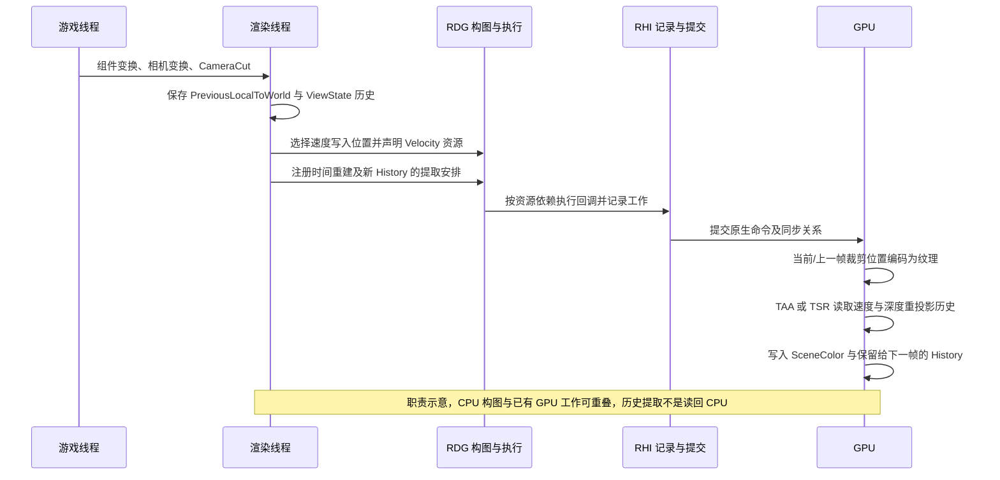
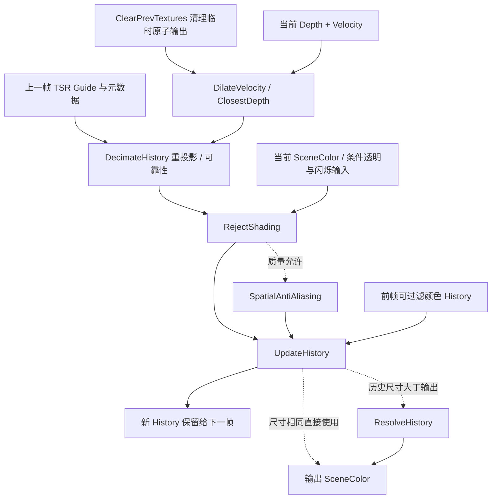

# 第 19 章：速度缓冲、TAA 与 TSR

[返回目录](../README.md) · [本章答案](../appendices/answers/19-velocity-taa-tsr.md)

> **版本与范围：**UE 5.7.4，CL 51494982，Windows、D3D12、SM6、桌面延迟渲染。以配置 A 的 TAA、普通不透明网格和速度在 Base Pass 写入为主线；TSR 作为同一场景的独立对照。没有运行编辑器、RenderDoc 或 GPU 时间线，观察步骤与预期均为 **[尚未验证]**。

> **证据约定：**带本地源码链接的实现陈述为“源码已确认”；推导公式、像素算例和流程图为“教学简化”。本章不把控制变量注册值当成运行值，不把多个分支里出现的同名资源视为同一张纹理，也不把教学步骤标为“运行观察已验证”。

## 19.1 学习目标

读完本章，你应能解释：

1. 速度缓冲的二维分量究竟表示当前像素从哪里来到哪里，为什么同时包含相机和物体运动。
2. UE 怎样保存当前与上一帧的局部到世界变换、当前与上一帧相机矩阵，并把它们送入 Vertex Shader。
3. `r.VelocityOutputPass` 的三个位置如何改变速度写入时机，以及透明物体为什么有单独速度 Pass。
4. TAA 如何使用抖动、速度、深度、邻域裁剪和历史权重，而不是简单平均两张图。
5. TSR 怎样组织速度膨胀、历史拒绝、更新及条件薄几何／解析阶段，为什么不能与 Gen4 TAA 混为一谈。

贯穿场景仍是地面、红色不透明立方体、金属球、蓝色透明薄片、方向光、点光源和固定曝光。P 是方块表面，Q 是薄片覆盖方块的位置，M 是金属球。先让方块沿世界 Y 方向横向移动，再只移动摄像机，最后比较相机切换（Camera Cut）与 TAA/TSR。在速度推导中跟踪的是 P 所代表的同一个表面点，它的屏幕像素位置可随帧变化；固定屏幕坐标反而可能先后看到不同物体。

必要前置知识是第 02 章的裁剪坐标与透视除法、第 03 章的采样覆盖、第 05 章的纹理与预曝光、第 07、08 章的 ViewState 和跨帧协作，以及第 14、17、18 章的速度附件、SSR 历史与透明颜色。**亚像素（Subpixel）**指小于一个输出像素的采样位置差，不是新增一组硬件屏幕像素；**重建（Reconstruction）**指利用离散样本估计输出位置的信号。

## 19.2 一帧速度数据的完整认知

### 19.2.1 速度不是世界米每秒

**运动向量（Motion Vector）**提供当前可见样本与上一帧屏幕位置的位移关系，供消费者反向查找历史。UE 此处的符号为“当前减上一帧”，所以从当前查历史要减去它。它不是物理速度，也不是方向光速度。D3D12 的速度纹理按所需信息选择两个或四个 16 位归一化通道；其中 `xy` 编码允许约 -2 到 +2 的屏幕坐标位移，快速运动仍可能超出表示范围或使历史无效。[打开格式选择](G:/UnrealEngineInstalled/UE_5.7/Engine/Source/Runtime/Renderer/Private/VelocityRendering.cpp:758)

设当前帧裁剪坐标为 `p=(x,y,z,w)`，上一帧同一表面点的裁剪坐标为 `p_prev`，去除各自投影除法后的屏幕位置为：

```text
screen = p.xy / p.w - currentJitter
prevScreen = p_prev.xy / p_prev.w - previousJitter
velocity = screen - prevScreen
```

UE 的 `Calculate3DVelocityBase` 还保存设备深度差 `z/w - prevZ/prevW`，它用于深度感知的历史判断；“3D”名称不表示纹理中保存了世界三维米数。[打开计算](G:/UnrealEngineInstalled/UE_5.7/Engine/Shaders/Private/VelocityCommon.ush:6)

**[教学简化]**设无抖动的 1280 像素宽视口中，同一个表面点从 x=600 移到 x=608，则像素位移为 +8，UV 位移为 `8/1280=0.00625`，而上述 -1～1 屏幕坐标中的位移为 `2×8/1280=0.0125`。从当前 x=608 查历史，应得到 `608-8=600`。如果把 0.0125 直接当 UV 差，就会查到错误的 x=592。Y 方向还需考虑屏幕坐标与纹理 UV 的轴向转换。

这个位移没有除以帧时间。若两帧相隔 1/60 秒，物理意义上的屏幕速度可另算为每秒 480 像素；引擎历史重投影首先需要的却是“这两帧之间移动了多少”。它也不是通过比较两张最终 RGB 自动估计的光流（Optical Flow）：这里优先使用引擎掌握的几何变换与深度。

### 19.2.2 CPU、渲染线程与 GPU 的职责

[打开速度与时间处理职责静态图](../assets/diagrams/19-velocity-taa-tsr-1.png)



游戏线程更新 Actor/Component；渲染线程通过场景代理和 ViewState 获得上一帧数据。GPU 负责顶点变换、速度编码、历史采样和重建。`RenderVelocities` 返回只表示 RDG Pass 已登记，不表示 GPU 已完成；历史资源被 `QueueTextureExtraction` 后，下一帧才作为 `PrevViewInfo` 输入。

## 19.3 速度的生产：当前帧和上一帧从哪里来

### 19.3.1 变换历史

`FSceneVelocityData::StartFrame` 在渲染帧开始把组件的 `LocalToWorld` 复制为 `PreviousLocalToWorld`，并标记有效。更新场景参数时，`GetPrimitiveUniformShaderParameters_RenderThread` 读取上一矩阵；若当前与上一矩阵相同，普通静态物体可以不写特定速度。[打开历史维护](G:/UnrealEngineInstalled/UE_5.7/Engine/Source/Runtime/Renderer/Private/RendererScene.cpp:3330)，[打开 Primitive 参数](G:/UnrealEngineInstalled/UE_5.7/Engine/Source/Runtime/Renderer/Private/RendererScene.cpp:3360)

相机历史来自 `ResolvedView.PrevTranslatedWorldToClip` 和 `View.ClipToPrevClip` 等矩阵。即使立方体不动，只移动摄像机，同一表面点的屏幕位置仍可能改变，所以它需要相机重投影位移。但不保证每个静止 Primitive 都把这份位移显式写入速度纹理：保留清除值时，消费者可以结合深度和相机矩阵恢复它。反过来，摄像机固定而物体变换改变，上一局部到世界矩阵产生差异。

渲染侧的“上一帧”是与当前 View 和场景渲染数据对应的历史状态，不等于在游戏线程里临时保存的一次 Tick 数值。第 08 章已经说明两侧可能跨帧重叠。材质上使用一个每 Tick 改变的参数，也不意味着引擎自动拥有这个参数过去所有时刻的值。

### 19.3.2 顶点阶段的两套位置

在 `VelocityShader.usf`，Vertex Shader 先用当前世界位置加 `World Position Offset`，乘当前 `TranslatedWorldToClip` 得到输出位置；随后用上一世界位置和上一材质偏移，乘 `PrevTranslatedWorldToClip` 得到上一裁剪位置，传给 Pixel Shader。[打开顶点计算](G:/UnrealEngineInstalled/UE_5.7/Engine/Shaders/Private/VelocityShader.usf:62)

这解释了三个易错点：

- 当前和上一帧都要应用相应的 WPO，否则顶点动画会被误判为相机移动或静止。
- `w` 除法必须分别进行，不能直接相减裁剪坐标。
- 速度写入的对象是当前可见几何；被遮挡物没有一个可见像素自动生成速度。

### 19.3.3 速度写入的三个位置

`r.VelocityOutputPass` 是只读的编译型设置：0 在深度 Pass 写入，1 在 Base Pass 增加 GBuffer 目标，2 在普通 Base Pass 后单独执行速度 Pass。[打开注册和说明](G:/UnrealEngineInstalled/UE_5.7/Engine/Source/Runtime/Renderer/Private/VelocityRendering.cpp:29)

配置 A 选 1，原因是把不透明表面、GBuffer 和速度的关系放在同一主材质路径中。若选择 0，深度 Pass 会被拆成有速度和无速度的阶段；若选择 2，Base Pass 不带速度，随后 `RenderVelocities` 读取网格再绘制一次。改变该项目设置需要重新编译相关 Shader，不能当作随时切换的质量 CVar。

渲染器通过 `ShouldRenderVelocities` 判断本帧是否有 TAA、运动模糊、SSR 时间 Pass、SSGI、Lumen、可视化等需求；深度 Pass 能输出速度时为避免遗漏，可能即使视图逻辑不需要也保留速度工作。[打开条件](G:/UnrealEngineInstalled/UE_5.7/Engine/Source/Runtime/Renderer/Private/VelocityRendering.cpp:387)

| 八维问题 | 速度生产阶段 |
|---|---|
| 是什么 | 将当前可见表面的前后帧投影关系写入速度资源 |
| 为什么 | 移动物体不能只靠静态世界和相机矩阵重投影；遗漏会使旧颜色采到错误位置 |
| 输入 | 当前／前帧 Primitive 和顶点数据、相机矩阵、材质变形、深度与可见绘制集合 |
| 处理 | 决定哪些对象需要输出，计算两套投影，移除抖动并编码，通过深度测试写纹理 |
| 输出 | Velocity 及条件启用的深度差／状态信息，供多个时间消费者读取 |
| 实现 | 场景历史、Base Pass 或 Velocity Mesh Processor、VelocityCommon 与编码 Shader |
| 条件 | 写入位置的项目配置、平台、View、Primitive 标记、材质和每帧变换 |
| 成本与误区 | 上一帧顶点计算、附件带宽和独立绘制；清除值不是有效编码的零运动 |

外层选定写入位置以后仍要看平台条件。`IsUsingBasePassVelocity` 排除移动与桌面前向，本章桌面延迟才采用值 1；`DepthPassCanOutputVelocity` 还排除 MSAA，不能将某个模式推广到所有渲染器。[Base Pass 条件](G:/UnrealEngineInstalled/UE_5.7/Engine/Source/Runtime/RenderCore/Private/RenderUtils.cpp:1576)，[深度路径条件](G:/UnrealEngineInstalled/UE_5.7/Engine/Source/Runtime/Renderer/Private/VelocityRendering.cpp:793)

本章 A 的速度附件在 Base Pass 后加入 SceneTextures Uniform Buffer 的可读资源集合；选择独立不透明速度时，主调度会在满足条件后调用 `RenderVelocities`。这分别属于“资源已写入并暴露给消费者”和“安排另一个生产 Pass”，不能通过有没有看到同名事件来判断速度一定不存在。[主调度暴露速度](G:/UnrealEngineInstalled/UE_5.7/Engine/Source/Runtime/Renderer/Private/DeferredShadingRenderer.cpp:2966)，[独立速度调用](G:/UnrealEngineInstalled/UE_5.7/Engine/Source/Runtime/Renderer/Private/DeferredShadingRenderer.cpp:3211)

### 19.3.4 Base Pass 中的速度编码

当材质和 Primitive 标志允许时，Base Pass Vertex Shader 写入上一屏幕位置；Pixel Shader 调用 `Calculate3DVelocity`，再用 `EncodeVelocityToTexture` 写入 GBuffer 的 Velocity 字段或独立目标。[打开 Base Pass 顶点](G:/UnrealEngineInstalled/UE_5.7/Engine/Shaders/Private/BasePassVertexShader.usf:247)，[打开 Base Pass 像素](G:/UnrealEngineInstalled/UE_5.7/Engine/Shaders/Private/BasePassPixelShader.usf:1199)

编码的 `xy` 先把速度缩放到纹理 0～1，保留 `(0,0)` 作为清除值附近的特殊状态；可选的深度差和 Pixel Animation/Temporal Responsiveness 标记放在其他通道。解码必须使用同一平台排列，不能把纹理 RG 当作已经以像素为单位的整数位移。[打开编码和解码](G:/UnrealEngineInstalled/UE_5.7/Engine/Shaders/Private/Common.ush:2060)

**[教学简化]**忽略可选非线性编码时，源码 `EncodedV.xy = V.xy * (0.499*0.5) + 32767/65535` 把真实零运动映射到约 `(0.499992,0.499992)`。全黑清除值不等于这个中间值。TAA 以 `EncodedVelocity.x>0` 判断是否有显式编码输入；没有时走相机回退。某个静态表面在原始 Velocity 视图中没有颜色，并不能证明它随相机移动时没有正确历史映射。

### 19.3.5 透明与裁剪深度

透明物体一般不写普通不透明 GBuffer，因此透明速度有 `TranslucentVelocity` 和 `TranslucentClippedDepth` Mesh Pass。透明材质是否写速度还受 `r.Translucency.Velocity`、平台能力和材质参数影响；不能因为 Q 在屏幕上可见就断言它一定贡献 Velocity。`RenderVelocities` 根据 Pass 类型选择深度读、模板和是否写深度。[打开 Pass 注册](G:/UnrealEngineInstalled/UE_5.7/Engine/Source/Runtime/Renderer/Private/VelocityRendering.cpp:1379)，[渲染入口](G:/UnrealEngineInstalled/UE_5.7/Engine/Source/Runtime/Renderer/Private/VelocityRendering.cpp:520)

材质选项 `Output Depth and Velocity` 由 `bOutputTranslucentVelocity` 控制，另有 `Velocity From Depth Only` 等条件。这是材质编译与透明处理的选择，需要保存材质、等待 Shader 完成；初次保持第一章的无额外透明速度观察条件。[打开材质属性](G:/UnrealEngineInstalled/UE_5.7/Engine/Source/Runtime/Engine/Public/Materials/Material.h:1029)

Q 同时包含蓝色前景和红色背景，两者可以沿不同方向运动。一条二维速度很难同时准确重投影两层颜色，打开透明速度只是给消费者另一份几何线索，不是保证透明拖影消失。透明深度写入还可能改变其他效果的遮挡关系，所以对照时必须记录材质选项，不能只比较开关前后的“清晰度”。

### 19.3.6 WPO 和像素动画不能只靠 Actor 变换

**世界位置偏移（World Position Offset，WPO）**在 Shader 中移动顶点，Actor 的 LocalToWorld 可以完全不变。例如令方块顶点沿 Z 做正弦运动，前后帧的偏移也必须参与速度。`r.Velocity.EnableVertexDeformation` 的 Auto 注册值为 2；本版 Auto 在速度值 2 的独立后置路径关闭，在其他位置允许，原因包括额外绘制成本。不能切换写入位置后仍假定 WPO 速度策略相同。[打开变形控制](G:/UnrealEngineInstalled/UE_5.7/Engine/Source/Runtime/Engine/Private/PrimitiveSceneProxy.cpp:62)

`Previous Frame Switch` 材质节点可分别提供 CurrentFrame 与 PreviousFrame 表达式。源码在编译前帧分支时选 PreviousFrame，否则选 CurrentFrame。若动画由游戏侧动态参数推动，编写者要保证前帧表达式使用正确旧值，不能指望节点替自己保存任意参数历史。[打开节点实现](G:/UnrealEngineInstalled/UE_5.7/Engine/Source/Runtime/Engine/Private/Materials/MaterialExpressions.cpp:8867)

纯粹变色的像素动画又不同：表面没移动，但条纹滚动、发光闪烁或视频内容改变。几何速度本来就无法一一描述其颜色变化。相关 Pixel Animation／Temporal Responsiveness 标记帮助时间算法调整信任度，不等于把颜色变化转化成真实世界位移。本章先不打开平台受限的每像素运动偏移功能，以免混淆基础几何速度。

## 19.4 TAA：用历史恢复采样并抑制锯齿

### 19.4.1 它是什么、输入和输出

**时间抗锯齿（Temporal Anti-Aliasing，TAA）**利用每帧不同的亚像素投影抖动，把多个时间样本重建到一个输出像素。它承担历史稳定与适用的上采样，输出颜色也可供后续运动模糊等消费者使用。输入包括当前 Scene Color、Scene Depth、Velocity、当前抖动、上一帧 `TemporalAAHistory`、Pre-Exposure 和 CameraCut；输出是新的 Scene Color 和供下一帧读取的 History。

| 八维问题 | TAA 主阶段回答 |
|---|---|
| 是什么 | 使用速度重投影、邻域约束和权重融合当前帧与历史帧 |
| 为什么 | 减少几何边缘锯齿、着色采样噪声和每帧抖动；没有它会看到单帧采样锯齿 |
| 输入 | Scene Color、Depth、Velocity、TAA History、抖动、曝光、CameraCut |
| 处理 | 找历史位置、检测越界/切镜、邻域裁剪、按速度与当前帧权重融合 |
| 输出 | 新 Scene Color、History 颜色及可选元数据 |
| UE 实现 | `AddTemporalAAPass`、`TemporalAA.usf`、`FTemporalAAHistory` |
| 条件 | 使用时间累积 AA、ViewState 有效、后处理启用；调试或切镜可禁用历史 |
| 成本与误区 | 历史采样、3×3 邻域、过滤和分辨率增加成本；TAA 不是简单两帧 50/50 平均 |

### 19.4.2 抖动为什么必须与速度一起解释

`SceneVisibility.cpp` 在时间累积方法和有效 ViewState 下准备样本序列，包含 Halton(2,3)、其变换和特定小样本排列等分支，写入 `View.TemporalJitterPixels`，再调用 `HackAddTemporalAAProjectionJitter` 修改投影矩阵。[打开序列选择](G:/UnrealEngineInstalled/UE_5.7/Engine/Source/Runtime/Renderer/Private/SceneVisibility.cpp:5203)，[写入投影偏移](G:/UnrealEngineInstalled/UE_5.7/Engine/Source/Runtime/Renderer/Private/SceneVisibility.cpp:5400)

因此一个静止方块也可能有非零“当前与上一帧屏幕坐标差”，其中一部分来自投影抖动。速度计算显式减去当前与上一抖动，避免 TAA 把故意采样偏移误判成物体运动。若禁用 TAA 抖动，抗锯齿样本覆盖能力也会改变。

想象斜边穿过一个像素。单帧只在一个位置判断覆盖，结果可能忽明忽暗；下一帧略换采样位置，就得到像素内部另一处的信息。历史重建把这些信息联系起来，估计更稳定的覆盖与着色。它不会把静止场景的相机 Actor 实际搬动半个像素，而是改变用于采样的投影。

TSR 的序列长度也不能直接等同于 `r.TemporalAASamples`。本版先为 TSR 取基础 8，再可能按输入分辨率比例增加采样数，并向合适的质数长度调整，以减少与其他周期信号的相关性。故“TSR 永远轮流使用 8 帧”不成立。序列长度、历史存储切片数和累计有效样本数是三个独立概念。[打开 TSR 序列调整](G:/UnrealEngineInstalled/UE_5.7/Engine/Source/Runtime/Renderer/Private/SceneVisibility.cpp:5211)

### 19.4.3 历史位置、越界和 CameraCut

`AddTemporalAAPass` 检查历史是否有效、View 是否 CameraCut，并为无效历史建立黑色占位；有效历史记录 ViewportRect 和 ReferenceBufferSize，使不同分辨率和视口偏移能够映射。[打开历史初始化](G:/UnrealEngineInstalled/UE_5.7/Engine/Source/Runtime/Renderer/Private/PostProcess/TemporalAA.cpp:571)

Shader 先用 `View.ClipToPrevClip` 得到相机运动，再在动态对象上读取 Velocity 覆盖该位移；历史屏幕坐标超出视口时将其标为 OffScreen。深度和速度邻域还能选择前景样本，避免背景速度污染前景轮廓。[打开 TAA 重投影](G:/UnrealEngineInstalled/UE_5.7/Engine/Shaders/Private/TemporalAA.usf:2071)

CameraCut 的含义不是“这一帧相机移动得很快”，而是历史不再对应同一连续视图。切镜或 ViewState 刚创建导致没有有效历史时，继续强行混合旧图会留下错误拖影，因此 C++ 把 `bCameraCut` 传给 Shader。本版 Gen4 TAA 还把输入历史 RT 为数组的情况视为重置条件；TSR 则另有格式位一致性判断，不是两个实现共享一份相同条件列表。[打开 TAA 重置条件](G:/UnrealEngineInstalled/UE_5.7/Engine/Source/Runtime/Renderer/Private/PostProcess/TemporalAA.cpp:589)

### 19.4.4 邻域约束、拒绝与融合

TAA 为当前像素准备邻域 Scene Color，并根据编译配置计算 min/max 或其他范围。`ClampHistory` 再限制重投影历史。本地 Shader 的 `AA_CLIP` 默认是 0，常用路径实际执行分量 `clamp`；同文件虽然存在 `HistoryClip` 的颜色盒求交分支，却不能只因搜到它便声称 A 必定执行。[打开邻域范围](G:/UnrealEngineInstalled/UE_5.7/Engine/Shaders/Private/TemporalAA.usf:1686)，[打开实际限制分支](G:/UnrealEngineInstalled/UE_5.7/Engine/Shaders/Private/TemporalAA.usf:1923)

颜色盒不必是直接显示 RGB；主 TAA 的适用分支会转换为 YCoCg 等工作空间。**YCoCg**把亮度与两项色度分开，有助于在相关通道中限制变化。只看输出截图 RGB 的最小最大值，不能逐位复算该 Shader 的范围。

**[教学简化]**设当前邻域单通道范围为 `[0.15,0.30]`，历史是 0.8，当前过滤结果为 0.2。无约束、当前权重 0.04 时输出是 0.776；先把历史限制为 0.30，则为 `0.30×0.96+0.20×0.04=0.296`。如果判定历史完全失效，使用当前过滤结果 0.2。三个答案分别对应“不限制”“限制”“拒绝”，不能都叫“降低 TAA 质量”。

**去遮挡（Disocclusion）**指前景移开，过去被挡住的背景现在出现。当前表面可能没有正确历史颜色；运动向量即使准确，指向的上一帧位置也可能仍被别的表面占据。邻域约束能压低明显错误颜色，却有稳定性与及时性之间的取舍：范围太宽可能拖影，范围太窄又可能让真实细节不断被拒绝。Gen4 TAA 的这套处理不能简化成 TSR 中完全相同的一张去遮挡 Mask。

最终权重受 `r.TemporalAACurrentFrameWeight`、历史 HDR 权重、速度、CameraCut 和 OffScreen 影响。默认当前帧权重 0.04 是注册初值，低值更平滑但更容易拖影，高值更及时但可能保留抖动；项目质量覆盖和实际 View 仍可能不同。[打开权重](G:/UnrealEngineInstalled/UE_5.7/Engine/Source/Runtime/Renderer/Private/PostProcess/TemporalAA.cpp:41)

真实 Shader 先计算 `BlendFinal`，再按速度、亮度差、响应性和切镜调整；最后由 `WeightedLerpFactors` 结合当前与历史 HDR 权重求融合比例。CameraCut 会令当前贡献权重为 1；`IgnoreHistory` 则将历史负载替换为当前过滤负载。上面的单通道公式用来解释运算关系，不代表每个像素都固定保留 96% 历史。[打开最终融合](G:/UnrealEngineInstalled/UE_5.7/Engine/Shaders/Private/TemporalAA.usf:2215)

### 19.4.5 TAA 调度

`GetMainTAAPassConfig` 根据 AntiAliasingMethod 返回 TAA、TSR、第三方或 Disabled；PostProcessing 根据结果把 SceneColor、Depth、Velocity 和透明资源装入 `UpscalerPassInputs`，再调用对应实现。[打开配置选择](G:/UnrealEngineInstalled/UE_5.7/Engine/Source/Runtime/Renderer/Private/PostProcess/TemporalAA.cpp:1090)，[打开统一调度](G:/UnrealEngineInstalled/UE_5.7/Engine/Source/Runtime/Renderer/Private/PostProcess/PostProcessing.cpp:928)

具体主线是 `AddGen4MainTemporalAAPasses → AddTemporalAAPass → FTemporalAACS → TemporalAA.usf::MainCS → TemporalAASample`。桌面路径的 `DoesTemporalAAUseComputeShader` 返回真，源码仍保留其他平台可用的 PS 入口。这里的 TAA 是 Compute 工作，不是再次提交场景 Mesh Draw Command。[打开桌面选择](G:/UnrealEngineInstalled/UE_5.7/Engine/Source/Runtime/Renderer/Private/PostProcess/TemporalAA.cpp:532)，[Shader 注册](G:/UnrealEngineInstalled/UE_5.7/Engine/Source/Runtime/Renderer/Private/PostProcess/TemporalAA.cpp:396)

`AddGen4MainTemporalAAPasses` 依据 `PrimaryScreenPercentageMethod` 选择 Main 或 MainUpsampling；即使输入与输出恰好都是 100% 尺寸，时间上采样方法标志也可能仍使配置名为 MainUpsampling。历史比例大于 100% 还可改为 MainSuperSampling，并在之后缩小。不能把一个 Pass 标签直接翻译成“输入分辨率必定低于输出”。[打开模式选择](G:/UnrealEngineInstalled/UE_5.7/Engine/Source/Runtime/Renderer/Private/PostProcess/TemporalAA.cpp:999)

最后，新纹理通过 `QueueTextureExtraction` 交给输出 History，连同 ViewportRect 与 ReferenceBufferSize 留给下一帧。它是持久保留 GPU 资源的安排，不是把整张图读回 CPU，也不是此时已经显示到屏幕。[打开历史提取](G:/UnrealEngineInstalled/UE_5.7/Engine/Source/Runtime/Renderer/Private/PostProcess/TemporalAA.cpp:980)

## 19.5 TSR：时间超分辨率的独立实现

### 19.5.1 TSR 与 TAA 的关系

**时间超分辨率（Temporal Super Resolution，TSR）**也使用抖动、速度和历史，但目标是从较低内部分辨率重建较高输出分辨率，同时进行抗锯齿。UE 5.7 把它作为 `AAM_TSR` 的独立配置；不能把 TSR 说成“把 TAA 的输出再放大”。TAA 也可能做 TemporalUpscale，但其历史和过滤实现不同。

| 八维问题 | TSR 主阶段回答 |
|---|---|
| 是什么 | 在时间历史基础上进行输入到输出分辨率的重投影、拒绝与重建 |
| 为什么 | 以较低内部像素预算得到较高输出，并稳定细线、运动边缘和闪烁 |
| 输入 | 低分辨率 Scene Color、Depth、Velocity、前帧 TSR 历史、透明资源、可选镜头畸变 |
| 处理 | 清理临时散射资源、速度膨胀、历史重投影/拒绝、条件空间抗锯齿、历史更新、条件输出解析 |
| 输出 | 输出分辨率 Scene Color、新的多切片历史与可选 mip |
| UE 实现 | `AddTemporalSuperResolutionPasses` 及 TSR Compute Shader 集合 |
| 条件 | `AAM_TSR`、平台支持、ViewState；历史格式、相机切换和质量变量会改变 Pass 集合 |
| 成本与误区 | 多个 Compute Pass 与更大历史占显存和带宽；TSR 不是无损恢复未采样细节 |

### 19.5.2 主要 Pass

为逐段阅读，TSR 对照先使用以下显式教学子配置：`r.TSR.History.ScreenPercentage 100`、`r.TSR.History.UpdateQuality 3`、`r.TSR.AsyncCompute 0`、`r.TSR.Resurrection 0`、`r.TSR.ReprojectionField 0`、`r.TSR.ThinGeometryDetection 0`。保持正常闪烁分析，且不增加镜头畸变或第三方时间上采样器。这些会话开关是教学选择，不宣称等于某个质量档默认值；完整 A/B 的 Nanite、Lumen、Substrate 设置仍按附录区分。

先在 B 仍使用 TAA、100% 屏幕比例时记录画面，再只将 AA 改为 TSR。下一次对照才改变输入屏幕比例。关闭异步仅为便于辨认逻辑阶段，不是要求实际产品这样配置；后文再解释其依赖与重叠能力。

[打开 TSR 资源依赖静态图](../assets/diagrams/19-velocity-taa-tsr-2.png)



在 `AddTemporalSuperResolutionPasses` 中，TSR 首先依据历史复活、镜头畸变、Alpha 和样本数决定格式与数组层数；CameraCut、历史无效或格式不一致会使历史不能直接复用。[打开配置](G:/UnrealEngineInstalled/UE_5.7/Engine/Source/Runtime/Renderer/Private/PostProcess/TemporalSuperResolution.cpp:1846)，[打开 CameraCut](G:/UnrealEngineInstalled/UE_5.7/Engine/Source/Runtime/Renderer/Private/PostProcess/TemporalSuperResolution.cpp:1982)

随后 `ClearPrevTextures` 清理本帧临时原子散射纹理，它不是每帧清空所有颜色 History。`DilateVelocity` 根据邻域深度寻找最近遮挡体并膨胀速度，同时向前帧空间散射深度相关信息，为后续判断提供证据。[打开清理与速度 Pass](G:/UnrealEngineInstalled/UE_5.7/Engine/Source/Runtime/Renderer/Private/PostProcess/TemporalSuperResolution.cpp:2347)，[速度膨胀 Shader](G:/UnrealEngineInstalled/UE_5.7/Engine/Shaders/Private/TemporalSuperResolution/TSRDilateVelocity.usf:278)

`DecimateHistory` 依据当前重投影、深度误差和散射结果重采样历史 Guide，并标记 OffScreen、视差去遮挡、像素动画和可填洞信息；这些位不是最终颜色，而是历史可靠性元数据。它不是把上一帧最终输出简单缩小一半。[打开标记与 Guide 输出](G:/UnrealEngineInstalled/UE_5.7/Engine/Shaders/Private/TemporalSuperResolution/TSRDecimateHistory.usf:468)

`RejectShading` 测量当前输入与历史在邻域中的差异，必要时拒绝旧历史；启用时还可做闪烁分析、薄几何和历史复活。`SpatialAntiAliasing` 只在条件满足时对拒绝区域进行空间抗锯，不能把每个像素都理解成完整空间滤波。[打开拒绝与空间 Pass](G:/UnrealEngineInstalled/UE_5.7/Engine/Source/Runtime/Renderer/Private/PostProcess/TemporalSuperResolution.cpp:2853)

`UpdateHistory` 在配置的历史分辨率重建并写入结果；它可能等于输出分辨率，也可能更高。只有历史尺寸与输出尺寸不同，才追加这里的 `ResolveHistory` 解析到输出 ViewRect。可选 mip 也按消费者需要生成。[打开更新入口](G:/UnrealEngineInstalled/UE_5.7/Engine/Source/Runtime/Renderer/Private/PostProcess/TemporalSuperResolution.cpp:3122)，[解析条件](G:/UnrealEngineInstalled/UE_5.7/Engine/Source/Runtime/Renderer/Private/PostProcess/TemporalSuperResolution.cpp:3321)

TSR 可以把部分阶段安排到异步 Compute，但运行代码先检查 `GSupportsEfficientAsyncCompute`，再按 `r.TSR.AsyncCompute` 等级给不同 Pass 标记队列。深度／速度相关工作可先于最终场景颜色就绪；RejectShading 和 UpdateHistory 则要读相关颜色。即使等级 3 请求全部异步，资源依赖仍在，也不保证 GPU 实际有收益。注册帮助仍出现旧 Pass 名称，具体本版 Pass 以上述构图实现为准。[打开队列前提](G:/UnrealEngineInstalled/UE_5.7/Engine/Source/Runtime/Renderer/Private/PostProcess/TemporalSuperResolution.cpp:1886)，[速度 Pass 标志](G:/UnrealEngineInstalled/UE_5.7/Engine/Source/Runtime/Renderer/Private/PostProcess/TemporalSuperResolution.cpp:2530)

### 19.5.3 分阶段读懂输入怎样变化

#### 速度膨胀与前帧深度证据

| 八维问题 | ClearPrevTextures 与 DilateVelocity |
|---|---|
| 是什么 | 准备临时原子纹理，产生前景边缘适用的重投影与深度信息 |
| 为什么 | 一个低分辨率边缘样本可能同时靠近前景与背景，错误背景速度会拉坏前景历史 |
| 输入 | 当前深度、速度、View 矩阵与清理后的 PrevAtomics |
| 处理 | 选邻域较近表面，解码显式速度或算相机回退，估计深度误差并散射遮挡证据 |
| 输出 | 重投影表示、最近深度／误差及前帧空间原子结果；条件运动模糊数据 |
| 实现 | `FTSRDilateVelocityCS`、`TSRDilateVelocity.usf`、`TSRDepthVelocityAnalysis.ush` |
| 条件 | TSR 主线执行，但重投影场、正交投影、运动模糊等改变 Shader 分支 |
| 成本与误区 | 邻域读取、原子竞争和输出带宽；膨胀速度不是让场景物体真的变大 |

最近表面指空间上靠近相机的前景，不是把设备深度取数值最小。Reversed-Z 下取值关系相反。`FetchAndComputeScreenVelocity` 先判断编码是否有效，有就解码，没有就 `ComputeStaticVelocity`；这与 TAA 的相机回退是一致的数据原则。[打开 TSR 速度回退](G:/UnrealEngineInstalled/UE_5.7/Engine/Shaders/Private/TemporalSuperResolution/TSRDepthVelocityAnalysis.ush:109)

**原子操作（Atomic Operation）**使并发 Shader 对同一存储位置的特定读改写保持规定的一致性。多个当前像素投影到同一个前帧位置时，不能任意覆盖并把最后一个线程当作最近表面；相应散射用原子规则保存所需证据。`PrevAtomics` 名字中的 Prev 指该信息所在的前帧空间，不意味着它必定是上帧持久保存的纹理。

#### 历史 Guide 与可靠性

| 八维问题 | DecimateHistory |
|---|---|
| 是什么 | 在当前输入采样位置准备可比较的历史引导数据 |
| 为什么 | 当前低分辨率信号与高分辨率历史不能不经坐标／频率对齐就逐值比较 |
| 输入 | 前帧 Guide、重投影向量、最近深度、误差、PrevAtomics；条件摩尔纹历史 |
| 处理 | 映射并采样 Guide，检查视口与视差关系，记录去遮挡和填洞条件 |
| 输出 | ReprojectedHistoryGuide、条件 Moire 数据及 DecimateMask |
| 实现 | `FTSRDecimateHistoryCS` 与 `TSRDecimateHistory.usf` |
| 条件 | 普通 TSR 主线；复活、薄几何、Alpha、重投影场改变附加输入输出 |
| 成本与误区 | 历史访存和边界判断；Guide 是比较用信号，不是最终高频颜色的别名 |

**引导数据（Guide）**为后续判断提供相对紧凑、匹配当前采样尺度的信息。颜色已经足够接近，也可能因为对应位置刚去遮挡而不应信任；颜色不同，也可能只是投影抖动造成的采样变化。因此需要把颜色比较与几何可靠性联系起来，而不是看到 RGB 差异就一律清空历史。

#### 着色拒绝与空间抗锯齿

| 八维问题 | RejectShading 与条件 SpatialAntiAliasing |
|---|---|
| 是什么 | 评估当前与历史着色是否一致，并为不可靠区域准备空间抗锯信息 |
| 为什么 | 运动向量不包含光照改变、闪烁贴图和反射变化，需要判断颜色历史本身是否仍可信 |
| 输入 | 当前场景颜色、Guide、DecimateMask、曝光及条件透明／闪烁数据 |
| 处理 | 变换比较空间，邻域限制与滤波，测量差异并调整历史信任；按质量产生抗锯信息 |
| 输出 | HistoryRejection、更新的 Guide、当前颜色准备结果、抗锯 Mask 和条件 AntiAliasing 纹理 |
| 实现 | `TSRRejectShading.usf::MeasureRejection` 调用及 `TSRShadingAnalysis.ush` 算法 |
| 条件 | 拒绝主线执行；空间阶段依赖 RejectionAntiAliasingQuality，低历史更新质量可关闭 |
| 成本与误区 | 邻域滤波、寄存器和共享存储成本；名字带网络或张量不等于可直接推断用了训练模型 |

源码先在工作色彩空间中计算当前邻域范围、约束输入与历史，再调用 `MeasureRejection`。该函数用模糊、总变化量、量化误差与邻域颜色盒测量差异，说明这里存在明确的图像算法，不能用“AI 自动识别错误像素”跳过。[打开调用上下文](G:/UnrealEngineInstalled/UE_5.7/Engine/Shaders/Private/TemporalSuperResolution/TSRRejectShading.usf:650)，[差异测量](G:/UnrealEngineInstalled/UE_5.7/Engine/Shaders/Private/TemporalSuperResolution/TSRShadingAnalysis.ush:458)

当细密几何的明暗随抖动快速反复变化，直接拒绝历史可能又造成闪烁。启用闪烁启发式后，算法允许某些变化在一定范围内积累，以稳定摩尔纹；代价是某些真实动画也可能变得迟缓。这里的**摩尔纹（Moire）**来自高频细节与采样网格的干涉，不是物体贴图里固定存在的条纹。`MeasureFlickeringLuma` 还可在主不透明流程中较早生成，随后传入时间上采样器，所以所有 TSR 工作不一定连续排列在后处理函数里。[提前测量入口](G:/UnrealEngineInstalled/UE_5.7/Engine/Source/Runtime/Renderer/Private/DeferredShadingRenderer.cpp:3412)

空间抗锯 Pass 的存在与某个像素最终使用其结果是两件事。UE 先按质量决定是否构造该工作，再以 Mask 和相关信息指导局部重建；不能用“只在拒绝区域”暗示没有其他线程或调度成本。[空间阶段输入和条件](G:/UnrealEngineInstalled/UE_5.7/Engine/Source/Runtime/Renderer/Private/PostProcess/TemporalSuperResolution.cpp:3085)

#### 历史更新、输出与跨帧保存

| 八维问题 | UpdateHistory 与条件 ResolveHistory |
|---|---|
| 是什么 | 把可信历史与当前样本重建到历史像素网格，再提供后处理所需输出 |
| 为什么 | 可靠性 Mask 尚不是颜色，输入样本与输出像素位置、数量也不同 |
| 输入 | 当前颜色、旧可过滤颜色 History、重投影、拒绝／空间抗锯信息、采样对齐与有效度 |
| 处理 | 重采样、限制高频历史、按有效度和 HDR 权重融合、更新颜色与元数据；必要时缩小 |
| 输出 | 新 ColorArray／MetadataArray、输出 Scene Color 和按需 mip |
| 实现 | `TSRUpdateHistory.usf`、`TSRResolveHistory.usf`；C++ 用 HistorySize 与 OutputRect 决定解析 |
| 条件 | 更新是主线；解析只在尺寸不同时执行，附加输出由下游需求决定 |
| 成本与误区 | 历史尺寸与过滤访存影响成本；历史有效度不是已保存完整帧数的简单计数 |

Shader 结合样本对齐程度、速度相关有效度上限和拒绝信息计算前帧与当前权重，并可把旧高频颜色限制到输入邻域范围。融合后把有效度写进 Metadata，再写颜色。它并不是按固定权重对四个邻居做一次双线性放大。[打开高频限制与权重](G:/UnrealEngineInstalled/UE_5.7/Engine/Shaders/Private/TemporalSuperResolution/TSRUpdateHistory.usf:1251)

C++ 提取 ColorArray、MetadataArray、GuideArray 以及条件 Moire／Coverage 历史，并保存对应 View 矩阵、视口和曝光。另将当前输出放入 `TemporalAAHistory`，供下一帧 SSR 等读取；这不代表 TSR 内部因此又执行了一次 Gen4 TAA。第 17 章中“SSR 能读取 TAAHistory”是资源接口名称，本章说明实际生产者也可以是 TSR。[打开跨帧提取与 SSR 输出](G:/UnrealEngineInstalled/UE_5.7/Engine/Source/Runtime/Renderer/Private/PostProcess/TemporalSuperResolution.cpp:3433)

### 19.5.4 额外分支不能混入固定流程

`r.TSR.Resurrection` 开启时可保留间隔较久的历史切片，并尝试在旧区域重新出现时利用它，称为**历史复用／复活（History Resurrection）**；不是无条件回放旧帧。`r.TSR.ThinGeometryDetection` 增加薄几何覆盖、检测和权重放宽工作；`r.TSR.ReprojectionField` 增强边缘重投影表示，包括局部变形关系。教学子配置先关闭三者，它们不能画成每次 TSR 必有的固定框。[复活开关](G:/UnrealEngineInstalled/UE_5.7/Engine/Source/Runtime/Renderer/Private/PostProcess/TemporalSuperResolution.cpp:240)，[重投影场](G:/UnrealEngineInstalled/UE_5.7/Engine/Source/Runtime/Renderer/Private/PostProcess/TemporalSuperResolution.cpp:282)，[薄几何控制](G:/UnrealEngineInstalled/UE_5.7/Engine/Source/Runtime/Renderer/Private/PostProcess/TemporalSuperResolution.cpp:325)

配置 B 的 Nanite 与 Substrate 会改变前面怎样得到几何、深度与颜色，但 TAA/TSR 的核心输入合同仍可按当前颜色、深度、速度和历史理解。Lumen 与 SSR 自己也有时间处理，它们的 History 不等于主画面 TAA/TSR History。某个反射噪声减小，可能发生在第 17、24 章的消费者里，不能全归给主抗锯齿。

### 19.5.5 分辨率算例

**教学简化：**内部 SceneColor 为 960×540，输出为 1920×1080，历史比例为 100%。输入像素数为 `518400`，输出像素数为 `2073600`，输出是输入的 4 倍。TSR 通过多帧抖动和空间邻域提供额外样本，但不能保证每个输出像素都有四个独立真实场景样本；细线、透明和快速运动仍可能需要拒绝或重建。

若 `r.TSR.History.ScreenPercentage=200`，历史尺寸可能达到输出的两倍，带宽和显存增加，且代码会受最大纹理尺寸和单资源大小限制而回退到 100%。[历史尺寸计算](G:/UnrealEngineInstalled/UE_5.7/Engine/Source/Runtime/Renderer/Private/PostProcess/TemporalSuperResolution.cpp:2001)

以输出 1920×1080 为例，历史尺寸 200% 表示 3840×2160，即像素数再增至 8,294,400，是 100% 历史的四倍，而不是两倍。单张四字节颜色平面从约 7.91 MiB 增为约 31.64 MiB；真实 TSR 还有数组切片、元数据、Guide、对齐和瞬时资源，不能把这个数当总显存。渲染输入降低至 50% 也不意味着整帧开销降低 75%，因为输出分辨率的历史更新、CPU、阴影及其他固定工作仍存在。

## 19.6 P、Q、M 的时间案例

### 19.6.1 方块移动

方块移动时，P 的当前顶点位置由新的 LocalToWorld 计算，上一帧位置由 `PreviousLocalToWorld` 计算。P 的有效速度编码表示从上一屏幕位置到当前屏幕位置的位移；TAA 根据该位移寻找旧颜色。方块移开后，原来的像素位置变成背景，深度／运动边界判断和邻域限制尝试排除旧红色，但不保证每个去遮挡像素都立即完美恢复。

Q 的主不透明深度仍是方块；若透明薄片没有速度 Pass，TAA 只能用方块速度或相机速度近似 Q 的历史。即使 Q 的颜色历史里有蓝色，不能推断透明薄片已经写入不透明 Velocity。

### 19.6.2 只移动摄像机

所有静态物体 LocalToWorld 不变，但相机的 `ClipToPrevClip` 让 P、Q、M 的屏幕位置变化。它们共享同一组相机矩阵，不一定具有相同二维速度：相机平移时，近处与远处的视差不同。TAA 可结合各自深度恢复相机重投影；TSR 还会按最近深度与速度处理前景边缘。原始 Velocity 纹理仍可能保留静态对象清除值，观察时应同时检查消费者的合成运动可视化。

### 19.6.3 Camera Cut 与曝光

若相机瞬间切到方块背后，并由视图路径设置 `View.bCameraCut`，TAA 与 TSR 会将旧历史标为不可靠，避免把旧位置的红块拖到新画面。运行时游戏代码可通过 `PlayerCameraManager::SetGameCameraCutThisFrame` 报告本帧切镜，该函数也暴露给蓝图；单纯移动相机 Actor 不等于所有 View 都自动报告切镜。[切镜接口](G:/UnrealEngineInstalled/UE_5.7/Engine/Source/Runtime/Engine/Classes/Camera/PlayerCameraManager.h:872)

曝光变化也不能直接比较存储值：TAA 使用 `View.PreExposure / PrevViewInfo.SceneColorPreExposure` 修正历史颜色；TSR 的前帧参数也保存 Pre-Exposure Correction。假设过去缩放为 0.5、当前为 1，历史存储颜色 0.4 应先乘 2 变为 0.8 再比较，不能把尺度差当真实照明突变。[TAA 参数](G:/UnrealEngineInstalled/UE_5.7/Engine/Source/Runtime/Renderer/Private/PostProcess/TemporalAA.cpp:818)，[TSR 参数](G:/UnrealEngineInstalled/UE_5.7/Engine/Source/Runtime/Renderer/Private/PostProcess/TemporalSuperResolution.cpp:2330)

## 19.7 观察练习与排查

**以下步骤尚未运行验证。**保持配置 A、固定曝光和输出分辨率，先记录 `r.VelocityOutputPass`、`r.TemporalAASamples`、`r.TemporalAA.Quality`、`r.TemporalAACurrentFrameWeight`、`r.TemporalAA.Upsampling`、`r.AntiAliasingMethod`。方法值 2 是 TAA，4 是 TSR；本章不启用第三方时间上采样器。先在 PPV／相机中检查 AA 覆盖，并通过最终 View 方法核实命令是否生效。

速度位置在 Project Settings > Rendering > Optimizations > Velocity Pass 中保持 Write during base pass，保存项目后重启并等 Shader 编译完成。源码明确标记 `ConfigRestartRequired`；实验过程中只查询，不把 `r.VelocityOutputPass 2` 当热切换命令。[设置入口](G:/UnrealEngineInstalled/UE_5.7/Engine/Source/Runtime/Engine/Classes/Engine/RendererSettings.h:914)

1. 将方块 Mobility 设为 Movable。在 Level Blueprint 保留初始位置，用四秒循环 Timeline 的 Float Track 取 `0秒=0、1秒=40、3秒=-40、4秒=0`，把该值加到初始 Y，再用 SetActorLocation 更新方块；位置单位为厘米。摄像机和灯不动。查看 Buffer Visualization 的 Velocity；到运动反向阶段，预期方向相关显示发生变化。停止与恢复同向运动不等于方向反转。
2. 停止方块动画，恢复初始位置，仅移动摄像机。原始 Velocity 允许静态对象保持清除值；同时用 `show VisualizeMotionBlur` 或 `show VisualizeTemporalUpscaler` 检查包含深度／相机信息的诊断视图。比较近方块与远地面的视差，不预设它们速度相同。完成后关闭这些 Show Flag 再看正常颜色。[时间上采样器诊断输入](G:/UnrealEngineInstalled/UE_5.7/Engine/Source/Runtime/Renderer/Private/PostProcess/VisualizeTemporalUpscaler.cpp:136)
3. 在 TAA、100% 屏幕比例下，将 `r.TemporalAASamples` 单独设为 1 和 8，其他值不变。比较方块边缘和高光的稳定性；它改变的是跨帧序列，不表示每帧完整重画八次场景。若观察不到差异，检查是否仍是 TAA、是否有时间上采样影响序列，以及当前视口是否实时更新。恢复记录值。
4. 重启方块动画，单独把 `r.TemporalAACurrentFrameWeight` 从基线改为 0.02，再恢复并改为 0.1。比较同一运动阶段的拖影与抖动，数值只是观察选择，不能保证效果单调。Q 若发生额外拖影，先查前后景不同运动与透明速度，再调时间参数。
5. 按附录切到 B 并完成必要重启，但先保持 TAA 和 100% 屏幕比例。设置 19.5.2 的 TSR 子配置后只把 AA 改为 TSR；记录相同视点的静态与运动结果。再单独将主屏幕比例降为 50%，验证实际 ViewRect 尺寸改变后比较。最后恢复屏幕比例、AA、所有变量及方块位置，停止 Timeline。

TSR 可用 `r.TSR.Visualize -2` 显示总览；模式 0 观察累计样本、1 观察视差去遮挡、2 观察历史拒绝、6 观察空间抗锯区域。设置回 `-1` 并关闭 VisualizeTSR 显示标志以恢复正常画面。模式颜色来自调试映射，不能当原始浮点值；没有启用复活／薄几何时，不据其可视化缺失推断引擎损坏。[本版可视化说明](G:/UnrealEngineInstalled/UE_5.7/Engine/Source/Runtime/Renderer/Private/PostProcess/TemporalSuperResolution.cpp:371)

CPU 与 GPU 成本需要分开记录：速度单独绘制可能增加 Mesh 工作，Base Pass 速度增加附件与旧顶点计算；TAA 的历史滤波按其输出像素工作；TSR 的早期分析偏向输入分辨率，而 UpdateHistory 按历史分辨率。调低输入比例只减少部分成本。实际测量还须记录显卡、驱动、画质、ViewRect 与历史尺寸，不能根据截图清晰度估算毫秒。

排查顺序是：确认 AntiAliasingMethod 和 ViewState → 确认速度资源是否声明、是否由 Base/Separate/Translucent Pass 写入 → 查看深度与 Velocity 可视化 → 检查 CameraCut、曝光和历史格式 → 最后才调历史权重。没有抓帧时不要虚构某个 Pass 的 GPU 时间。

## 19.8 概念回顾

速度是屏幕重投影线索，几何位移来自物体、相机和顶点变形；像素动画等标记另帮助算法调整信任度。速度资源的生产位置由编译型设置决定，消费方是 TAA、TSR、运动模糊、SSR 时间处理等多个阶段。静态背景可以不写显式速度，由消费者补出相机重投影。

TAA 用抖动、历史、深度、邻域约束和动态权重改善时间稳定；TSR 另有独立的多阶段重投影与历史重建实现，重投影场增强、薄几何和历史复活都要看条件。两者都可能失败，不能恢复从未进入输入或历史的真实几何。内部 History、供 SSR 的 TemporalAAHistory，以及最后显示用的输出纹理，必须按生产者与消费者区别。

## 19.9 理解检查题

1. 立方体 LocalToWorld 不变、摄像机向右移动。为什么 P 仍有速度？速度 Shader 中哪一组矩阵体现相机贡献？
2. `r.VelocityOutputPass=1` 与 2 的主要差异是什么？为什么把 1 改成 2 不能只看作“多一个后处理 Pass”？
3. TAA 的当前帧权重为 0.04。上一帧历史颜色为 0.8，当前过滤颜色为 0.2，忽略 HDR 权重、裁剪和速度变化，教学式线性融合结果是多少？为什么这个算例不能当成 UE 实际输出？
4. 方块从屏幕左侧移出，Velocity 正确但 TAA 仍出现红色拖影。请给出至少两个源码中存在的历史限制或修正机制，并说明它们不保证完全消除拖影的原因。
5. 内部 960×540、输出 1920×1080 时，TSR 输出像素数是输入的多少倍？为什么不能说 TSR 因此“凭空生成了三倍真实细节”？

下一章进入后处理、曝光、色调映射、UI 与 Present，说明 TAA/TSR 输出为什么还不是显示器最终看到的像素。
