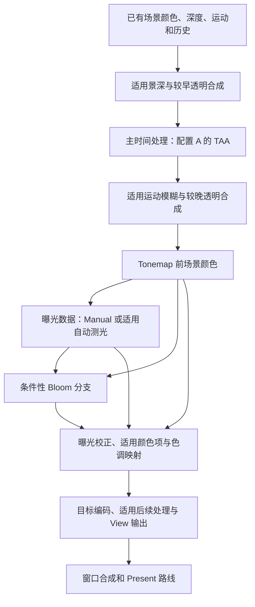
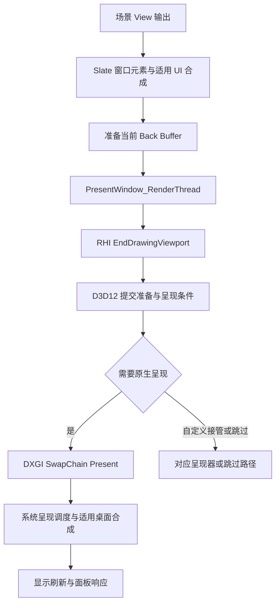

# 第 20 章：后处理、颜色输出与 Present

[返回目录](../README.md) · [本章答案](../appendices/answers/20-postprocess-present.md) · [一帧总览](00-frame-overview.md)

> **版本与范围：**UE 5.7.4，CL 51494982，Windows、D3D12、SM6，桌面延迟渲染配置 A。本章延续普通网格、传统 GBuffer、SSR、TAA、手动曝光与 1280 × 720 窗口观察。Substrate、Nanite、Lumen、VSM、硬件光追和 MegaLights 按配置附录关闭。
>
> **证据边界：**本章静态阅读本地源码，没有启动 UE、抓取 GPU 帧或测量显示延迟。`[源码已确认]`表示能定位的条件或实现，`[教学简化]`表示明确假设的模型与算例，`[尚未验证]`表示待工程运行的操作与预期。显示系统的概念说明不冒充本机显示器测量结果。

## 20.1 学习目标与本章基线

到第 19 章，场景已经拥有光照、反射、透明贡献，以及时间重建需要的颜色和运动信息。但这仍不等于显示器上的最终像素。场景颜色可以远大于 1，可以采用预曝光存储，也可能尚未合入某些较晚透明层。后处理要把这些数据组织为目标输出图像，窗口系统还要把场景图像与适用 UI 组合，最后请求显示系统呈现。

本章继续追踪 P 和 Q。P 位于红方块未被薄片覆盖的位置；Q 位于蓝色透明薄片覆盖方块的位置。薄片为 Unlit、Translucent、Two Sided，`Tint=(0.1,0.6,1)`，`EmissiveStrength=300`，Opacity 为 0.35，不启用折射。这些是材质输入，不是 Q 的最终显示 RGB。

完成本章后，应能解释曝光和预曝光的区别，手算一次存储与还原，说明 Basic 与 Histogram 自动测光的主要过程，区分 Bloom、景深、运动模糊和 Tonemap，追踪场景输出到 Slate、RHI 与 DXGI Present，并说明为什么 Present 返回仍不等于人眼已经看到整帧。

必要前置知识是第 05 章的线性颜色与预曝光、第 09～10 章的 RDG、RHI 和完成边界，以及第 18～19 章的透明插入位置与时间重建。本章把这些数据接到输出图像，不需要读者提前了解显示器电路。

配置 A 的固定条件必须先说清楚：唯一全局 PPV 使用 Manual，开启 Apply Physical Camera Exposure，ISO=100、快门倒数=60、F-stop=4，Exposure Compensation=0，不设置补偿曲线。Bloom Intensity 与 Motion Blur Amount 为 0，`r.BloomQuality`、`r.MotionBlurQuality`、`r.DepthOfFieldQuality` 都设为 0；镜头光晕、暗角和胶片颗粒强度也设为 0，不使用自定义后处理材质或外部颜色分级 LUT。

这意味着本章介绍的 Bloom、景深和运动模糊是可选机制，不是配置 A 的实际必经工作。TAA、适用曝光数据、普通色调映射及输出颜色转换仍然保留。局部曝光也要检查最终设置；本版构造值的高光对比、阴影对比和细节强度为 1，下面全局曝光算例另明确假设局部曝光倍率为 1，没有曲线参与。

## 20.2 后处理是一张条件依赖图

### 20.2.1 输入与输出的八维定位

| 维度 | 本阶段的回答 |
|---|---|
| 作用 | 把场景颜色变为适合当前视图和输出设备的图像 |
| 原因 | 场景线性亮度范围、镜头效果与显示编码不是同一种数据 |
| 输入 | Scene Color、Scene Depth、Velocity、透明资源、历史、最终 PPV 设置与输出描述 |
| 过程 | 选择条件分支，完成适用重建、模糊、测光、Bloom、色调与输出变换 |
| 输出 | 当前 View 的处理结果，必要时再缩放或合成到 View Family 输出 |
| 实现 | `AddPostProcessingPasses`、各效果的 AddPass 函数与对应 Shader |
| 条件 | 显示标志、材质插入点、平台支持、质量、历史有效性和输出类型 |
| 成本与误区 | 全屏读写、多级纹理、采样核与历史均有成本；关闭一个效果不等于跳过整条流程 |

**[源码已确认]**桌面入口 `AddPostProcessingPasses` 收集输入并根据设置选择 Pass。它不是把每个后处理函数无条件执行一次。某个效果可以关闭，多个步骤可以共享下采样资源，某个最后执行的 Pass 还可直接使用指定输出附件。CPU 添加 Pass 与 GPU 完成它们仍是第 09、10 章区分的两件事，见 [S20-01](#s20-01)。

[打开后处理依赖静态图](../assets/diagrams/20-postprocess-present-1.png)



**[教学简化]**箭头表示必要数据关系，不是每种配置统一的硬件时间线。图中的景深、运动模糊和 Bloom 在 A 中关闭；图仍保留它们的位置以说明重新启用后的关系。曝光数据也不必依赖一张真实直方图。插件、场景捕获、可视化、不同透明插入点和 TSR 可以改变具体组合。

### 20.2.2 为什么透明与后处理交织

本版先处理适用 DOF 及 PostDOF 透明资源，再进入主时间处理选择。部分透明也可以交给 TSR 的专门合成分支；配置 A 使用 TAA，不应把 TSR 的处理直接接到 A 后面。运动模糊后还可以有 PostMotionBlur 透明合成，见 [S20-02](#s20-02)。

所以 Q 到达某一后处理输入时是否已经包含蓝片，要看薄片实际所属透明阶段。名称中有“后处理”不意味着所有透明已经完成；名称中有“透明”也不意味着该颜色完全避开曝光和 Tonemap。后续段落在使用 Q 的混合颜色算例时，会明确假设蓝片已经合入所讨论的 Scene Color。

同样要保留坐标边界。全分辨率、半分辨率纹理和 ViewRect 各自有尺寸；一个 View 可能只占附件的一部分。P/Q 的窗口坐标不能直接充当每张后处理纹理的采样 UV。检查某一像素时，应先通过 ViewRect 与输入输出变换找到对应采样区域。

## 20.3 手动曝光：固定选择，不是取消变换

### 20.3.1 相机参数怎样产生 EV100

曝光控制场景亮度进入后续显示变换前的整体尺度。手动曝光将这个选择固定下来，使相机朝向改变时不会因为画面平均亮度变化而自动调整同一块方块的明暗。它不禁止材质、光照、反射或遮挡随相机变化，也不取消色调曲线。

**[源码已确认]**`CalculateManualAutoExposure` 读取 `View.FinalPostProcessSettings`，根据物理相机开关决定是否采用相机 EV100。本场景参数进入以下公式，见 [S20-03](#s20-03)：

```text
EV100 = log2(Fstop^2 * ShutterSpeed * 100 / ISO)
      = log2(4^2 * 60 * 100 / 100)
      = log2(960)
      ≈ 9.907
```

这里 `ShutterSpeed` 是曝光时间的倒数，60 表示 1/60 秒。输入 0.0167 会表达另一种参数，不能因为它在日常语言中也叫“快门时间”就直接替换。物理相机开关关闭时，该函数使用的物理 EV100 为 0；并不是继续采用光圈数值但不显示它。

EV100 是对数形式的曝光参数，不是“每像素最终乘 9.907”。本版先通过亮度标定建立曝光范围，再得到曝光倍率。`LuminanceMaxFromLensAttenuation` 在扩展亮度范围条件下使用 `0.78 / max(LensAttenuation,0.01)`，非扩展条件返回 1；`EV100ToLuminance` 再计算标定尺度乘 `2^EV100`。不能漏掉这些条件后把一条网上常见曝光公式当成所有配置的精确输出。

### 20.3.2 补偿一档的含义

**[源码已确认]**桌面适用路径中，Exposure Compensation 从档数转换为 `2^Bias` 倍率。补偿加 1，在其他条件相同且尚未经过非线性色调变换的意义上，使适用曝光倍率翻倍；补偿减 1 则减半。PPV 参数首先要启用覆盖，之后还可能被相机、其他体积或 View Family 的固定曝光覆盖影响。

**[教学简化]**令曝光标定尺度 K=1，补偿为 0，无曲线和调试覆盖，则本例固定曝光倍率可表示为 `E=1/960`。这是为了把参数关系算到底而声明的条件，不是读取本机运行数值的结果。加一档补偿后为 `2/960`；把快门倒数由 60 改为 120，在其他参数相同时 EV100 增加 1，曝光倍率减半。

这两个变化方向值得分别练习：增大“补偿档数”使图像更亮，增大“物理相机 EV100”表示相同场景采用更少曝光。不能只记住“指数越大越亮”。P 和 Q 都会受到适用曝光变换，蓝片为 Unlit 仅表示不按普通受光模型求直接光，不表示绕过后处理曝光。

## 20.4 预曝光：改变存储尺度，再匹配还原

### 20.4.1 为什么颜色缓冲需要另一个倍率

场景亮度可以跨越很大范围。直接在有限精度的颜色缓冲中存储所有未经缩放的值，会使数值范围和精度管理更困难。UE 将适用场景颜色预先缩放，使缓冲中的值更接近当前有效曝光范围；随后在 Tonemap 中用匹配的倍率校正。

为避免与观察点 P 混淆，本章用 `p` 表示预曝光倍率，`E` 表示目标全局曝光倍率，`C` 表示未预曝光的场景线性颜色，`Cs` 表示缓冲中的对应颜色：

```text
存入适用场景颜色：Cs = C * p
进入后续色调处理：Ce = Cs * (E / p) = C * E
```

**[教学简化]**这里省略 SceneColorTint、局部曝光、暗角和 Bloom，且假设生产与消费采用同一预曝光约定。该代数说明存储尺度可以变化而目标曝光结果保持一致，不代表实际 Tonemap 只有一个乘法。

**[源码已确认]**`PostProcessTonemap.usf` 的 `FinalLinearColor` 包含 `OneOverPreExposure * GlobalExposure`，再结合适用颜色项；Bloom 也有对应的预曝光校正。法线、深度、Roughness 等属性不是这条颜色乘法的对象，见 [S20-04](#s20-04)。

### 20.4.2 本版 Manual 不必读取旧自动曝光

常见解释说“预曝光使用上一帧曝光”，适合说明自动曝光历史关系，却不够覆盖本版所有分支。**[源码已确认]**`FViewInfo::UpdatePreExposure` 在 Manual 时直接使用当前固定曝光，代码注释明确说明这样绕过 CPU→GPU→CPU 往返；自动方法则读取已有有效的 Last Exposure。最终预曝光还结合 Scene Color Tint 的亮度及已有平均局部曝光等因素，见 [S20-05](#s20-05)。

没有 ViewState、预曝光不适用于当前调试视图、设置了正值 PreExposureOverride 等情况又有各自处理。因此不能保证所有捕获里 `PreExposure` 都等于“上一帧曝光”。判断时应记录方法、ViewState、显示标志、覆盖值以及实际 View Uniform 数据。

### 20.4.3 P 与 Q 的一次还原练习

**[教学简化]**假设 P 的当前未预曝光场景颜色为 `(4,1,0.5)`，选择 `p=0.25`，目标 `E=0.5`：

```text
Cs(P) = (4,1,0.5)*0.25 = (1,0.25,0.125)
Ce(P) = Cs(P)*(0.5/0.25) = (2,0.5,0.25)
```

若同一颜色改用 `p=0.125` 存储，原始附件值全部减半，但消费端的 `E/p` 变为 4，还原结果仍是 `(2,0.5,0.25)`。只比较两个抓帧的 Scene Color 原始数值，可以误判灯光变弱；把预曝光也记录下来，才能比较同一尺度的亮度。

再假设 Q 背景为 `(4,1,0.5)`，蓝片已经以普通线性透明混合合入，薄片输入为 `(30,180,300)`、Alpha=0.35。忽略其他材质和透明路径差异：

```text
C(Q) = 0.35*(30,180,300) + 0.65*(4,1,0.5)
     = (13.1,63.65,105.325)
```

这个算例沿用蓝片参数，但背景、所处合成阶段及其他简化是人为设定，绝不是本场景运行输出。它说明蓝色 HDR 贡献可以远大于 1；Tonemap 和输出转换还没发生。更不能先把薄片 RGB 截到 1，再宣称这就是引擎内部参与光照范围的数值。

## 20.5 自动曝光：测光、目标与适应

### 20.5.1 Basic 与 Histogram 的输入处理

自动曝光不是“让每一个像素单独变成中灰”。全局测光从选定场景输入估计亮度分布，产生一个目标曝光，再按时间和参数调整整幅视图的曝光。画面里一个特别亮的蓝片可以影响统计，从而改变未被蓝片覆盖的 P；这属于全局曝光反馈，不是蓝片通过材质直接给 P 着色。

**[源码已确认]**Basic 的适用 Shader 将亮度转换为对数，写到下采样数据的 Alpha，再做带权归约，最后用 `exp2` 回到亮度量。Histogram 则把亮度分到桶中，按低、高百分位范围去掉部分权重，对保留的对数亮度加权后还原。本版共享直方图定义默认为 64 个桶，实际编译宏仍应核对，见 [S20-06](#s20-06)。

**[教学简化]**两个等权正亮度为 1 和 16，忽略缩放、裁剪和测光遮罩。对数平均为 `(log2(1)+log2(16))/2=2`，还原为 `2^2=4`；直接做算术平均则为 8.5。两者不同，说明 Basic 不能随意描述为“全屏 RGB 求和除以像素数”。Histogram 的百分位选择也不是直接丢掉某个固定矩形区域，它依据亮度累计权重决定保留范围。

黑色要有最小亮度处理，否则 `log2(0)` 没有有限值。测光遮罩、忽略材质影响的可选测光模式、直方图范围与输出亮度权重也会影响统计。本文只以明确的标准 Scene Color 统计过程建立基础；不承诺所有项目都用同一组 RGB 亮度系数或每个像素同权。

### 20.5.2 从统计结果走到曝光数据

**[源码已确认]**`EyeAdaptationCommon` 先把统计亮度限制到设定范围，计算目标，再结合旧曝光、时间差和适应速度得到平滑结果，输出实际倍率、目标倍率与平均场景亮度等数据。CPU 参数准备含由线性过渡到指数过渡的控制，Camera Cut、变换重置、Manual 或无有效范围等情况可以强制目标，见 [S20-07](#s20-07)。

从暗处转向亮处时，目标可以已经变化，而当前曝光还在接近目标。截图中暂时偏亮或偏暗不能直接归因于光源强度错误。测试速度设置时应观察一段连续时间，并记录是否发生 Camera Cut；每次切镜头都强制目标的实验，不适合推断普通连续适应曲线。

尤其要注意 Pass 名称：桌面后处理在具有适用 ViewState 等条件时，即使没有 Histogram，也会调用 Histogram Eye Adaptation Pass 来支持 Manual 的固定范围处理。因此看到 Eye Adaptation 事件，不能立即宣布项目仍在自动测光；反过来，没有直方图纹理也不能宣布 Tonemap 没有曝光数据。

### 20.5.3 局部曝光与全局曝光分开

局部曝光根据画面区域的亮度结构调整局部明暗关系，不能用一个全屏常数完整表示。当前源码按高光对比、阴影对比、细节强度和曲线等条件决定是否启用，并提供 Bilateral 与 Fusion 等路径。它可以与全局曝光一起参与 Tonemap，见 [S20-01](#s20-01)、[S20-04](#s20-04)。

本文固定曝光的数值练习将局部曝光取为 1。实际比较 P/Q 时，应确认这些参数和曲线仍为中性状态，否则同样的全局 EV100 不保证每个区域只受同一个倍率缩放。局部处理改善局部对比的同时，也会增加资源、采样与调参成本；它不恢复场景中根本没有计算出来的光照贡献。

## 20.6 Bloom：从亮部生成扩散贡献

Bloom 近似强亮部在成像系统中向周围扩散的视觉效果。它不是向场景增加一盏真实灯，也不会让蓝片自动照亮附近三维物体。开启后 Q 附近可以出现屏幕空间扩散，甚至影响邻近 P 的显示颜色，但这与重新计算 P 的直接光照不同。

| 维度 | Bloom 的回答 |
|---|---|
| 作用与原因 | 从亮部构造跨像素扩散，表达有限成像系统的高亮表现 |
| 输入 | 适用 Scene Color、曝光数据、阈值、强度与核设置 |
| 过程 | 条件性阈值准备，下采样，多尺度模糊或卷积，再合成 |
| 输出 | Bloom 颜色资源，供 Tonemap 的适用颜色合成读取 |
| 实现 | Bloom Setup、Gaussian Bloom 或 FFT Bloom 的独立分支 |
| 条件 | 强度、具体方法强度、质量与其他功能条件；配置 A 明确关闭 |
| 成本与误区 | 多分辨率读写和核采样有成本；亮像素不是世界空间照明 |

**[源码已确认]**常规 Gaussian 路径在需要阈值或局部曝光时添加 Bloom Setup，否则可复用场景下采样链。Threshold 为 -1 的适用配置可以绕过阈值准备；不能把所有 Bloom 都写成“先硬截去小于阈值的像素”。FFT Bloom 是另一条卷积处理路线，不应和 Gaussian 的全部 Pass 串成同一必经链，见 [S20-08](#s20-08)。

当前 `BloomSetupCommon` 先按 `OneOverPreExposure` 读取场景颜色，结合曝光计算亮度，再使用 `saturate((亮度-Threshold)*0.5)` 得到适用阈值权重，输出时回到预曝光空间。**[教学简化]**若阈值为 1，参与阈值比较的亮度为 2，权重是 0.5；亮度为 3 时权重为 1。该例忽略局部曝光和格式误差，只解释当前 Shader 的软过渡，不表示整个 Bloom 都是这个乘法。

不同尺寸的模糊层合成能同时表达小范围和大范围扩散。降低工作分辨率能降低成本，却也会损失细小亮点和形状精度。Q 的发光边缘一旦成为扩散输入，最终像素不再只依赖同一坐标的原始颜色；用透明混合公式独自预测邻近 P 的屏幕 RGB 就不充分了。

## 20.7 景深与运动模糊：两种不同的模糊依据

### 20.7.1 景深依据焦点和深度

景深描述处于焦平面之外的表面如何形成弥散，而非让画面均匀变糊。其输入通常包括场景颜色、深度和镜头参数。**弥散圆（Circle of Confusion，CoC）**表达一个点在成像面上展开的程度；前景与背景的处理还涉及遮挡边界，不能只用一张普通高斯模糊覆盖原图。

**[源码已确认]**`DiaphragmDOF::IsEnabled` 检查平台支持、DepthOfField 显示标志、质量大于 0，以及有效焦距范围相关设置，并排除特定参考路径。`AddPasses` 进一步组织 CoC 数据、适用前背景 Gather、条件性 Scatter 和重组合，见 [S20-09](#s20-09)。不是每次都运行所有采样模式，也不能从“开启 DOF”推出固定数量的 Pass。

配置 A 把景深质量设为 0，因而 F-stop=4 仍能参与手动物理曝光，却不要求运行景深模糊。实验若想单独观察景深，应记录焦点距离和参与曝光的光圈；仅修改光圈同时改变模糊与曝光，就很难将亮度变化归因于某一个效果。

Q 的透明阶段还会影响它是否被某条景深处理覆盖。晚合成透明资源可以在景深之后加入，背景已经模糊而薄片保持另一种边缘表现。这里应接回第 18 章的透明阶段证据，不能只按“薄片离相机更近”预测它必然获得与不透明物体相同的 CoC。

### 20.7.2 运动模糊依据速度和曝光时间模型

运动模糊近似有限快门时间内的屏幕运动积分。它需要颜色、深度和运动信息；相机移动也能让静止方块产生屏幕位移。第 19 章的 TAA 同样使用历史和运动信息，但其抗锯齿目标并不等于运动模糊，不能把 TAA 的拖影自动叫作正常 Motion Blur。

**[源码已确认]**`IsMotionBlurEnabled` 检查 SM5 及以上、后处理和 MotionBlur 显示标志、Amount 和 Max 大于阈值、实时更新、质量大于 0，以及适用 VR 条件。上层还考虑 Camera Cut 与上一帧变换重置等有效性。实现组织速度展平、块级分类和适用过滤，时间尺度与 Amount、最大长度参与参数生成，见 [S20-10](#s20-10)。

**[教学简化]**若一个点在一帧内沿屏幕水平移动 12 像素，使用半帧曝光的直线匀速模型，轨迹长度为 6 像素。这只是积分范围的入门模型；本版速度编码、时间缩放、核采样、边界和深度判断不能用这一个数字替代。12 像素的 Velocity 也不意味着 Shader 无条件读取十二个样本。

运动模糊后的透明层可能单独合成，即使模糊本身关闭，后处理也可能仍需完成这份透明资源的组合。因此“我关闭了 Motion Blur，却仍看见相关透明合成事件”并不矛盾。配置 A 的 Amount 与质量都为 0，首次比较不应把画面模糊归因于该效果，需先检查 TAA、分辨率或其他来源。

## 20.8 Tonemap、LUT 与颜色空间

### 20.8.1 色调映射解决亮度范围问题

色调映射将适用场景亮度映射到目标输出范围，同时影响高光、暗部和颜色关系。它通常是非线性的。若两个场景值分别为 2 和 20，简单截到 1 会让它们都失去区分；适当曲线可以在有限范围内保留一部分层次，但不可能无损保留无限亮度范围。

**[教学简化]**用 `T(x)=x/(1+x)` 说明非线性，不把它当 UE 的实际曲线。`T(1)=0.5`，`T(4)=0.8`；亮度变四倍，输出并未变四倍。把曝光由 1 改为 2 应先计算 `T(2x)`，并不等于对已经映射好的 `T(x)` 乘 2。

P 与 Q 都要遵守这一区别。Q 的蓝片很亮，某些通道进入曲线高亮区域后，材质强度翻倍可能只造成很小的显示差异，颜色饱和度也可能变化。不能据此断言 EmissiveStrength 没有进入 Shader，更不能从屏幕颜色直接倒推出未预曝光的自发光输入。

### 20.8.2 为什么没有外部 LUT 仍能看到 LUT Pass

**[源码已确认]**常规 Tonemap 路线准备或取得颜色分级纹理，并在 Pixel Shader 中通过 `ColorLookupTable` 查询结果。`PostProcessCombineLUTs.usf` 可以把颜色校正、FilmToneMap、工作色域变换及输出编码等合入查找表；没有用户指定的外部颜色分级 LUT，不代表引擎内部不使用生成 LUT，见 [S20-11](#s20-11)。

LUT 是 Lookup Table，查找表。可以把它理解为在一组输入颜色位置预先计算变换结果，逐像素再查表并插值。它减少了重复执行复杂颜色变换的需求，也引入分辨率、采样和输入编码约定。看到纹理不是普通二维画面，并不表示资源损坏，它可能表达三维颜色输入到颜色输出的映射。

本版 Shader 的 SDR 相关处理包含工作空间与 AP1 之间的变换和 `FilmToneMap`，其他输出条件还有不同路径。仅因为代码中存在 ACES 2.0 或 PQ 分支，就不能宣布配置 A 必然执行它们。应先核对 `OutputDevice`、工作色域、当前 Shader permutation 和具体输出目标。

### 20.8.3 色域与传递函数是两个问题

色域决定 RGB 三个分量对应怎样的原色与白点；传递函数决定亮度数值怎样被编码。相同三元组放进不同色域，可以代表不同颜色；同一颜色用线性值和 sRGB 编码表示，也会得到不同数字。场景 HDR 浮点缓冲与 HDR 显示输出更不是同义词：即使最终使用 SDR 窗口，场景中仍然需要 HDR 颜色计算。

**[源码已确认]**`GetTonemapperOutputDeviceParameters` 依据场景捕获类型、Render Target 的显示输出格式和 Gamma 设置选择设备参数。sRGB 输出分支使用准确的 sRGB 转换；PQ、scRGB 和线性捕获类型各有不同处理，见 [S20-12](#s20-12)。不能把所有输出统一写成“RGB 开 1/2.2 次方”，也不能在已编码值上再手动补一次 Gamma。

**[教学简化]**仅比较线性到 sRGB 的标准转换，线性 0.18 对应约 0.461；这不是“18% 反射率物体最后必显示 0.461”的结论，因为物体照明、曝光和 Tone Curve 还没包含在这一个变换里。读取附件时应记录它处于场景线性、预曝光线性、已映射线性还是设备编码阶段。

输出纹理格式、Render Target 的 sRGB 属性和 Shader 中显式转换还必须配合。纹理名字叫 SceneColor 或 FinalColor，不能独自证明它已经经过哪一种传递函数。做数值比较时，先确认采样工具显示原始通道还是为查看而转换后的颜色。

## 20.9 从 View 输出到窗口与 Slate

后处理输出属于当前 View 或 View Family。窗口里却还可能有 UI、编辑器面板、鼠标指针、调试信息和其他视图，因此 Tonemap 返回的纹理不自动等于整个交换链 Back Buffer。窗口还可能调整大小或缩放视口图像，输出分辨率与内部场景分辨率必须分开记录。

**[源码已确认]**`FSceneViewport::BeginRenderFrame` 区分独立 Render Target 与直接使用视口 Back Buffer；独立目标结束时可以切换到 Shader 读取状态。`SViewport::OnPaint` 在非直接渲染模式下，通过 `MakeViewport` 生成引用视口纹理的 Slate 绘制元素，见 [S20-13](#s20-13)。因此编辑器里的场景视口可以是一张嵌入窗口布局的纹理，而不是整个窗口的所有像素。

Slate 的绘制元素会被组织为批次，准备顶点、索引、材质或纹理资源，并通过 Slate 渲染路线写入输出。它通常不需要让每个文字或按钮再次走普通场景不透明 Base Pass、GBuffer 和延迟光照。另一方面，世界空间 Widget、材质效果或自定义嵌入内容有各自路径，不能把所有“看起来像 UI”的像素都归为同一阶段。

**[源码已确认]**`FSlateRHIRenderer::DrawWindow_RenderThread` 取得交换链 Back Buffer，并根据立体渲染、HDR UI 合成等条件选择输出和元素纹理，再添加 Slate 元素绘制。HDR 条件下 UI 可以先进入独立资源再组合，避免把普通 UI 编码无条件当作场景 HDR 颜色，见 [S20-14](#s20-14)。

P/Q 若被窗口 UI 覆盖，最终窗口像素的来源就多了一层。此时游戏场景捕获与整窗截图可能不同，两者都可以是各自阶段的正确结果。透明、Tonemap 后材质、屏幕空间 UI 与操作系统窗口叠加也有不同所有者，不能统称为“最后加一层 Alpha”而省略颜色空间和资源条件。

## 20.10 RHI、交换链与 DXGI Present

### 20.10.1 提交路线的八维定位

| 维度 | 呈现阶段的回答 |
|---|---|
| 作用 | 将已经准备的窗口图像提交给平台呈现机制 |
| 原因 | GPU 纹理计算与显示系统刷新不是同一调度过程 |
| 输入 | 当前 Back Buffer、视口、同步策略、交换链与适用自定义呈现器 |
| 过程 | 完成适用绘制提交与状态准备，调用平台 Present，推进可用缓冲 |
| 输出 | 平台呈现请求及相关状态，不是可直接证明的人眼可见时刻 |
| 实现 | Slate PresentWindow、RHIEndDrawingViewport、D3D12 Viewport 与 DXGI |
| 条件 | 视口有效、允许呈现、需要原生 Present，且交换链存在 |
| 成本与误区 | 等待可能来自提交、GPU 进度或交换链空间；Present 耗时不等于后处理 Shader 耗时 |

[打开窗口呈现静态图](../assets/diagrams/20-postprocess-present-2.png)



**[教学简化]**此图描述责任和调用关系。操作系统合成方式、直接翻转、全屏模式、可变刷新和实际面板响应不是由这几行 UE 源码完全决定的，图不提供本机输入到显示延迟的测量值。

### 20.10.2 从 Slate 跟到平台调用

**[源码已确认]**`DrawWindows_RenderThread` 构建并执行 Slate RDG 图，然后调用 `PresentWindow_RenderThread`。后者广播 BackBufferReadyToPresent 回调，执行适用资源状态转换，再调用 `RHICmdList.EndDrawingViewport`。这个回调名字说明窗口资源到了对应代码位置，不是硬件已经扫描完这一帧的通知，见 [S20-14](#s20-14)。

D3D12 的 `RHIEndDrawingViewport` 在 `bPresent` 为真时调用视口 `Present`。视口会检查呈现许可、刷新资源屏障，并以 `WaitForSubmission` 提交相关命令，再经 `PresentChecked` 到平台实现。这里等待的是提交线程处理相关工作，不能把它直接翻译成“当前帧每一个 GPU 指令都已完成”，见 [S20-15](#s20-15)。

`PresentChecked` 还检查视口有效性，允许 `CustomPresent` 决定是否需要原生呈现。普通 Windows 路线最终进入 `PresentInternal`，调用 `SwapChain1->Present(SyncInterval, Flags)`。代码在未锁同步、非全屏并允许 Tearing 时设置 `DXGI_PRESENT_ALLOW_TEARING`，这些条件不能省略成“关闭 VSync 就一定撕裂”，见 [S20-16](#s20-16)。

### 20.10.3 为什么 Present 返回不是显示完成

交换链管理可用于渲染和呈现的缓冲。提交下一幅图像不等于 CPU 把全部像素复制到一张已经点亮的屏幕；它是把资源交给相应呈现队列与显示调度。GPU 的相关写入、操作系统的窗口合成或翻转、显示刷新及面板响应仍有各自条件。

**[源码已确认]**Windows `PresentInternal` 的注释明确指出 Present 可以因为 GPU 进度和交换链空间而阻塞。D3D12 结束视口后还依据 `r.FinishCurrentFrame` 选择帧事件的等待与发出顺序。一个函数可能包含等待，不意味着它返回就精确对应显示器最后一行像素完成发光；GPU Fence 也只证明其定义范围内的 GPU 工作完成，不测量面板。

**[教学简化]**60 Hz 固定刷新的一次刷新间隔约为 16.67 ms。如果某帧渲染工作耗时 8 ms，不能据此推出用户一定在输入后 8 ms 看到结果。CPU 准备、排队、等待刷新与扫描等都可能参与；它们还可能重叠，不能把每个统计面板中的时间机械相加。需要测量哪一段，就应使用能覆盖那一段的时间戳或外部显示测量。

“Back Buffer 准备好”“RHI 已提交”“GPU 工作完成”“Present 已调用”和“人眼可见”因此是五种不同证据。第 10 章的线程与 Fence 知识在这里形成闭环：不要用一个 CPU 断点或一次 Present 返回证明整个显示链已经完成。

## 20.11 成本、覆盖范围与可解释的比较

后处理常以屏幕覆盖驱动，物体数量很少也可能执行多次全屏读写。一次简单颜色变换、宽采样核模糊和多级直方图归约虽然都在后处理区域，成本来源并不相同。降低场景分辨率会影响某些阶段，但 Tonemap、UI 或后续输出缩放仍可能在更高的目标尺寸工作。

**[教学简化]**假设一张 1280 × 720 的 RGBA16F 纹理每像素 8 字节，不计压缩、对齐与其他附件：

```text
纹理容量 = 1280*720*8 = 7,372,800 B = 7.03125 MiB
一次全屏单读单写 = 14.0625 MiB 的理想数据量
半宽半高同格式容量 = 1.7578125 MiB
```

宽高都减半，像素数是四分之一，不是二分之一。这个模型只用于理解资源尺度，不代表某个实际 Tonemap Pass 一定使用 RGBA16F 输出，也不是显存总用量或 GPU 毫秒。多纹理采样、缓存、压缩、重用和不同格式都会改变实际流量。

Bloom 的核范围和层数、DOF 的 CoC 与前背景覆盖、Motion Blur 的速度分布和分类、自动曝光的统计输入，各有不同成本。手动曝光可以避开自动亮度适应，却不能保证连固定曝光数据 Pass 都消失；没有外部 LUT 也不保证没有内部 LUT 生成或读取。这些都是需要从实际资源和分支判断的例子。

呈现等待还应与渲染计算分开。若 GPU 后处理已经较快，CPU 却在 Present 附近等待同步或交换链空间，继续减少 Bloom 采样未必改变该处等待时间。相反，不能因为某帧 Present 很快就认定整个帧的 GPU 工作很少。先确定瓶颈所在的时间范围，再选择参数实验。

## 20.12 动手观察与排查

**[尚未验证]**先在独立练习关卡副本保持配置 A，确认实际使用普通 Camera，PPV 覆盖生效，曝光模式和参数来自最终 View 设置。固定输出尺寸、TAA、光源与相机，不直接从编辑器视口显示推断 Standalone 的曝光与颜色范围。

1. 记录 P/Q 的 Scene Color 阶段、实际纹理格式、ViewRect、PreExposure 与曝光倍率。若比较前后两帧，先将颜色转换到一致尺度。
2. 只将曝光补偿增加一档，比较 Tonemap 前的适用线性变化和最终图像变化。预期前者符合倍率关系，后者受非线性映射影响，不能逐通道要求翻倍。
3. 恢复补偿后，单独启用 Bloom，记录方法、强度、阈值和质量。查看 Bloom 输入与输出，再观察 Q 周围扩散；不要把扩散当成蓝片给 P 增加世界空间照明。
4. 分别建立景深和运动模糊实验，记录焦点、光圈与曝光关系，或速度、Camera Cut 与历史有效性。每次只研究一个效果，结束后恢复 A。
5. 区分场景捕获和窗口截图。沿 Slate 输出、RHIEndDrawingViewport 与 DXGI Present 定位资源和调用，不把 CPU 断点命中当显示完成时刻。

若画面整体偏亮，先检查最终曝光、预曝光解释和颜色编码，再检查光源或材质。若只有 Q 周边颜色扩散，检查 Bloom 与透明插入点。若画面模糊，分别排查 TAA、内部比例、景深和运动模糊。若场景捕获正确而窗口错误，再追踪 Slate、输出格式与交换链，不要回头修改已经正确的 GBuffer。

对于数值争议，应明确比较对象：材质输入、未预曝光 Scene Color、预曝光附件、Tonemap 输出还是截图中的设备编码 RGB。只有对象、空间、曝光、坐标和时间都对应，两个数值的差异才有可解释的含义。

## 20.13 本章回顾

曝光选择场景亮度的尺度，预曝光管理适用颜色缓冲的存储范围，Tonemap 与输出变换把颜色转换为目标表示。Bloom、景深和运动模糊各自使用不同输入与条件；配置 A 关闭这些模糊和扩散效果，仍保留 TAA、适用曝光处理和普通颜色输出。

P/Q 的最终像素可能包含跨像素采样、透明合成与 UI 覆盖，不再只由单个材质值决定。场景 View 输出还需经过窗口绘制与适用 Slate 合成，RHI 和 DXGI 再安排呈现。到达 Present 调用是可以定位的程序事件，真正可见则还涉及显示系统与设备。

## 20.14 理解检查

1. 配置 A 使用 F-stop=4、快门倒数=60、ISO=100。求物理 EV100；解释补偿加一档与快门倒数加倍为何对曝光倍率产生相反方向的变化。手动曝光是否意味着不运行 Tonemap？
2. 设未预曝光颜色为 `(8,2,1)`，`p=0.25`，目标 `E=0.125`。求存储颜色与曝光后、Tonemap 前颜色；将 p 改为 0.5 后，如何保持相同结果？本版 Manual 是否必须读取上一帧自动曝光？
3. 对两个等权亮度 1 与 16，求对数平均再还原的结果，并与算术平均比较。Histogram 的百分位筛选解决什么问题？为何出现 Eye Adaptation Pass 不足以证明自动测光仍开启？
4. 蓝片很亮但配置 A 没有光晕。分别从启用条件解释 Bloom、景深、运动模糊；若只开启 Bloom，它为何可能改变邻近 P 的显示，却不等于给 P 增加一盏灯？
5. 为什么 Tonemap 的输出不必等于整个窗口 Back Buffer？按 Slate、RHI、D3D12、DXGI 写出普通呈现路线，并说明 Present 返回、GPU Fence 完成和屏幕可见的区别。

答案见[本章答案](../appendices/answers/20-postprocess-present.md)。

## 20.15 源码证据索引

<a id="s20-01"></a>
**S20-01：桌面后处理入口与条件。** [PostProcessing.cpp:347](G:/UnrealEngineInstalled/UE_5.7/Engine/Source/Runtime/Renderer/Private/PostProcess/PostProcessing.cpp:347)为入口；[694](G:/UnrealEngineInstalled/UE_5.7/Engine/Source/Runtime/Renderer/Private/PostProcess/PostProcessing.cpp:694)起选择模糊、曝光与局部曝光条件；[729](G:/UnrealEngineInstalled/UE_5.7/Engine/Source/Runtime/Renderer/Private/PostProcess/PostProcessing.cpp:729)附近设置后续 Pass；[DeferredShadingRenderer.cpp:3943](G:/UnrealEngineInstalled/UE_5.7/Engine/Source/Runtime/Renderer/Private/DeferredShadingRenderer.cpp:3943)调用桌面流程。

<a id="s20-02"></a>
**S20-02：透明与时间处理的交织。** [PostProcessing.cpp:833](G:/UnrealEngineInstalled/UE_5.7/Engine/Source/Runtime/Renderer/Private/PostProcess/PostProcessing.cpp:833)添加适用 DOF；[897](G:/UnrealEngineInstalled/UE_5.7/Engine/Source/Runtime/Renderer/Private/PostProcess/PostProcessing.cpp:897)处理 PostDOF 透明；[977](G:/UnrealEngineInstalled/UE_5.7/Engine/Source/Runtime/Renderer/Private/PostProcess/PostProcessing.cpp:977)与 984 附近选择 TSR/TAA；[1097](G:/UnrealEngineInstalled/UE_5.7/Engine/Source/Runtime/Renderer/Private/PostProcess/PostProcessing.cpp:1097)处理没有运动模糊时仍需合成的较晚透明。

<a id="s20-03"></a>
**S20-03：固定曝光与参数。** [PostProcessEyeAdaptation.cpp:249](G:/UnrealEngineInstalled/UE_5.7/Engine/Source/Runtime/Renderer/Private/PostProcess/PostProcessEyeAdaptation.cpp:249)给出镜头标定；[319](G:/UnrealEngineInstalled/UE_5.7/Engine/Source/Runtime/Renderer/Private/PostProcess/PostProcessEyeAdaptation.cpp:319)处理补偿；[389](G:/UnrealEngineInstalled/UE_5.7/Engine/Source/Runtime/Renderer/Private/PostProcess/PostProcessEyeAdaptation.cpp:389)计算手动物理曝光；[660](G:/UnrealEngineInstalled/UE_5.7/Engine/Source/Runtime/Renderer/Private/PostProcess/PostProcessEyeAdaptation.cpp:660)得到固定倍率。[RenderUtils.h:699](G:/UnrealEngineInstalled/UE_5.7/Engine/Source/Runtime/RenderCore/Public/RenderUtils.h:699)定义 EV100 到亮度转换。

<a id="s20-04"></a>
**S20-04：预曝光校正与颜色合成。** [PostProcessTonemap.usf:310](G:/UnrealEngineInstalled/UE_5.7/Engine/Shaders/Private/PostProcessTonemap.usf:310)读取预曝光倒数与全局曝光；[412](G:/UnrealEngineInstalled/UE_5.7/Engine/Shaders/Private/PostProcessTonemap.usf:412)附近处理局部曝光分支；[521](G:/UnrealEngineInstalled/UE_5.7/Engine/Shaders/Private/PostProcessTonemap.usf:521)计算适用线性颜色；[524](G:/UnrealEngineInstalled/UE_5.7/Engine/Shaders/Private/PostProcessTonemap.usf:524)加入 Bloom；[542](G:/UnrealEngineInstalled/UE_5.7/Engine/Shaders/Private/PostProcessTonemap.usf:542)查颜色 LUT。

<a id="s20-05"></a>
**S20-05：当前预曝光的选择。** [PostProcessEyeAdaptation.cpp:1383](G:/UnrealEngineInstalled/UE_5.7/Engine/Source/Runtime/Renderer/Private/PostProcess/PostProcessEyeAdaptation.cpp:1383)为 `UpdatePreExposure`；[1421](G:/UnrealEngineInstalled/UE_5.7/Engine/Source/Runtime/Renderer/Private/PostProcess/PostProcessEyeAdaptation.cpp:1421)起处理缺少状态与覆盖条件；[1456](G:/UnrealEngineInstalled/UE_5.7/Engine/Source/Runtime/Renderer/Private/PostProcess/PostProcessEyeAdaptation.cpp:1456)区分 Manual 当前倍率与历史自动曝光；[1471](G:/UnrealEngineInstalled/UE_5.7/Engine/Source/Runtime/Renderer/Private/PostProcess/PostProcessEyeAdaptation.cpp:1471)组合最终倍率并更新历史记录。

<a id="s20-06"></a>
**S20-06：Basic 与 Histogram 统计。** [PostProcessEyeAdaptation.usf:253](G:/UnrealEngineInstalled/UE_5.7/Engine/Shaders/Private/PostProcessEyeAdaptation.usf:253)建立 Basic 对数亮度；[308](G:/UnrealEngineInstalled/UE_5.7/Engine/Shaders/Private/PostProcessEyeAdaptation.usf:308)附近归约带权结果；[PostProcessHistogramCommon.ush:89](G:/UnrealEngineInstalled/UE_5.7/Engine/Shaders/Private/PostProcessHistogramCommon.ush:89)定义默认桶数；[133](G:/UnrealEngineInstalled/UE_5.7/Engine/Shaders/Private/PostProcessHistogramCommon.ush:133)按百分位权重还原亮度。

<a id="s20-07"></a>
**S20-07：适应与 Manual 数据 Pass。** [PostProcessEyeAdaptation.usf:169](G:/UnrealEngineInstalled/UE_5.7/Engine/Shaders/Private/PostProcessEyeAdaptation.usf:169)计算目标和平滑曝光；[PostProcessEyeAdaptation.cpp:579](G:/UnrealEngineInstalled/UE_5.7/Engine/Source/Runtime/Renderer/Private/PostProcess/PostProcessEyeAdaptation.cpp:579)附近准备适应参数，[607](G:/UnrealEngineInstalled/UE_5.7/Engine/Source/Runtime/Renderer/Private/PostProcess/PostProcessEyeAdaptation.cpp:607)决定强制目标；[PostProcessing.cpp:1272](G:/UnrealEngineInstalled/UE_5.7/Engine/Source/Runtime/Renderer/Private/PostProcess/PostProcessing.cpp:1272)明确没有直方图时仍添加适用 Pass 支持 Manual。

<a id="s20-08"></a>
**S20-08：Bloom 组织与阈值。** [PostProcessing.cpp:778](G:/UnrealEngineInstalled/UE_5.7/Engine/Source/Runtime/Renderer/Private/PostProcess/PostProcessing.cpp:778)选择 Bloom 条件；[1296](G:/UnrealEngineInstalled/UE_5.7/Engine/Source/Runtime/Renderer/Private/PostProcess/PostProcessing.cpp:1296)起区分 FFT 与 Gaussian；[1351](G:/UnrealEngineInstalled/UE_5.7/Engine/Source/Runtime/Renderer/Private/PostProcess/PostProcessing.cpp:1351)决定是否需要准备；[PostProcessBloomSetup.cpp:197](G:/UnrealEngineInstalled/UE_5.7/Engine/Source/Runtime/Renderer/Private/PostProcess/PostProcessBloomSetup.cpp:197)组织 Gaussian Bloom；[PostProcessBloom.usf:37](G:/UnrealEngineInstalled/UE_5.7/Engine/Shaders/Private/PostProcessBloom.usf:37)定义当前预曝光与阈值计算。

<a id="s20-09"></a>
**S20-09：景深条件与组合。** [DiaphragmDOF.cpp:1471](G:/UnrealEngineInstalled/UE_5.7/Engine/Source/Runtime/Renderer/Private/PostProcess/DiaphragmDOF.cpp:1471)判断启用；[1486](G:/UnrealEngineInstalled/UE_5.7/Engine/Source/Runtime/Renderer/Private/PostProcess/DiaphragmDOF.cpp:1486)进入组织；[2916](G:/UnrealEngineInstalled/UE_5.7/Engine/Source/Runtime/Renderer/Private/PostProcess/DiaphragmDOF.cpp:2916)附近调度适用 Gather/Scatter；[2946](G:/UnrealEngineInstalled/UE_5.7/Engine/Source/Runtime/Renderer/Private/PostProcess/DiaphragmDOF.cpp:2946)重组合低分辨率失焦颜色。

<a id="s20-10"></a>
**S20-10：运动模糊资格与实现。** [PostProcessMotionBlur.cpp:128](G:/UnrealEngineInstalled/UE_5.7/Engine/Source/Runtime/Renderer/Private/PostProcess/PostProcessMotionBlur.cpp:128)判断启用；[622](G:/UnrealEngineInstalled/UE_5.7/Engine/Source/Runtime/Renderer/Private/PostProcess/PostProcessMotionBlur.cpp:622)设置时间与强度尺度；[973](G:/UnrealEngineInstalled/UE_5.7/Engine/Source/Runtime/Renderer/Private/PostProcess/PostProcessMotionBlur.cpp:973)准备分类过滤参数；[1164](G:/UnrealEngineInstalled/UE_5.7/Engine/Source/Runtime/Renderer/Private/PostProcess/PostProcessMotionBlur.cpp:1164)添加对应过滤事件。

<a id="s20-11"></a>
**S20-11：生成 LUT 与 Tone Curve。** [PostProcessing.cpp:1445](G:/UnrealEngineInstalled/UE_5.7/Engine/Source/Runtime/Renderer/Private/PostProcess/PostProcessing.cpp:1445)准备颜色分级纹理；[PostProcessCombineLUTs.usf:274](G:/UnrealEngineInstalled/UE_5.7/Engine/Shaders/Private/PostProcessCombineLUTs.usf:274)附近调用 `FilmToneMap`；[PostProcessTonemap.usf:184](G:/UnrealEngineInstalled/UE_5.7/Engine/Shaders/Private/PostProcessTonemap.usf:184)实现颜色查表。LUT 生成和用户外部 LUT 应分开理解。

<a id="s20-12"></a>
**S20-12：目标设备与编码。** [PostProcessTonemap.cpp:227](G:/UnrealEngineInstalled/UE_5.7/Engine/Source/Runtime/Renderer/Private/PostProcess/PostProcessTonemap.cpp:227)选择输出参数；[569](G:/UnrealEngineInstalled/UE_5.7/Engine/Source/Runtime/Renderer/Private/PostProcess/PostProcessTonemap.cpp:569)添加 Tonemap；[PostProcessCombineLUTs.usf:337](G:/UnrealEngineInstalled/UE_5.7/Engine/Shaders/Private/PostProcessCombineLUTs.usf:337)处理 sRGB，[361](G:/UnrealEngineInstalled/UE_5.7/Engine/Shaders/Private/PostProcessCombineLUTs.usf:361)起处理适用 HDR 输出分支。

<a id="s20-13"></a>
**S20-13：场景视口与 Slate 元素。** [SceneViewport.cpp:1915](G:/UnrealEngineInstalled/UE_5.7/Engine/Source/Runtime/Engine/Private/Slate/SceneViewport.cpp:1915)选择独立目标或 Back Buffer；[1930](G:/UnrealEngineInstalled/UE_5.7/Engine/Source/Runtime/Engine/Private/Slate/SceneViewport.cpp:1930)处理结束状态；[SViewport.cpp:159](G:/UnrealEngineInstalled/UE_5.7/Engine/Source/Runtime/Slate/Private/Widgets/SViewport.cpp:159)为非直接渲染模式创建 Viewport 绘制元素。

<a id="s20-14"></a>
**S20-14：Slate 窗口绘制与提交入口。** [SlateRHIRenderer.cpp:661](G:/UnrealEngineInstalled/UE_5.7/Engine/Source/Runtime/SlateRHIRenderer/Private/SlateRHIRenderer.cpp:661)组织窗口输出；[705](G:/UnrealEngineInstalled/UE_5.7/Engine/Source/Runtime/SlateRHIRenderer/Private/SlateRHIRenderer.cpp:705)判断 HDR UI 合成；[920](G:/UnrealEngineInstalled/UE_5.7/Engine/Source/Runtime/SlateRHIRenderer/Private/SlateRHIRenderer.cpp:920)进入 `PresentWindow_RenderThread`；[945](G:/UnrealEngineInstalled/UE_5.7/Engine/Source/Runtime/SlateRHIRenderer/Private/SlateRHIRenderer.cpp:945)调用 RHI；[1102](G:/UnrealEngineInstalled/UE_5.7/Engine/Source/Runtime/SlateRHIRenderer/Private/SlateRHIRenderer.cpp:1102)附近显示图执行与后续 Present 的关系。

<a id="s20-15"></a>
**S20-15：D3D12 呈现与提交等待。** [D3D12Viewport.cpp:519](G:/UnrealEngineInstalled/UE_5.7/Engine/Source/Runtime/D3D12RHI/Private/D3D12Viewport.cpp:519)检查视口与 CustomPresent；[598](G:/UnrealEngineInstalled/UE_5.7/Engine/Source/Runtime/D3D12RHI/Private/D3D12Viewport.cpp:598)组织 Present；[616](G:/UnrealEngineInstalled/UE_5.7/Engine/Source/Runtime/D3D12RHI/Private/D3D12Viewport.cpp:616)说明等待提交线程；[753](G:/UnrealEngineInstalled/UE_5.7/Engine/Source/Runtime/D3D12RHI/Private/D3D12Viewport.cpp:753)实现 RHI 入口，[781](G:/UnrealEngineInstalled/UE_5.7/Engine/Source/Runtime/D3D12RHI/Private/D3D12Viewport.cpp:781)附近选择帧事件等待。

<a id="s20-16"></a>
**S20-16：Windows DXGI 调用。** [WindowsD3D12Viewport.cpp:352](G:/UnrealEngineInstalled/UE_5.7/Engine/Source/Runtime/D3D12RHI/Private/Windows/WindowsD3D12Viewport.cpp:352)为 `PresentInternal`；[356](G:/UnrealEngineInstalled/UE_5.7/Engine/Source/Runtime/D3D12RHI/Private/Windows/WindowsD3D12Viewport.cpp:356)设置适用 tearing 标志；[365](G:/UnrealEngineInstalled/UE_5.7/Engine/Source/Runtime/D3D12RHI/Private/Windows/WindowsD3D12Viewport.cpp:365)说明可能的等待；[388](G:/UnrealEngineInstalled/UE_5.7/Engine/Source/Runtime/D3D12RHI/Private/Windows/WindowsD3D12Viewport.cpp:388)调用交换链 Present。

下一章：[第 21 章 Substrate](21-substrate.md)。我们将保持同一场景，检查材质表达与运行时 GBuffer 如何改变。
