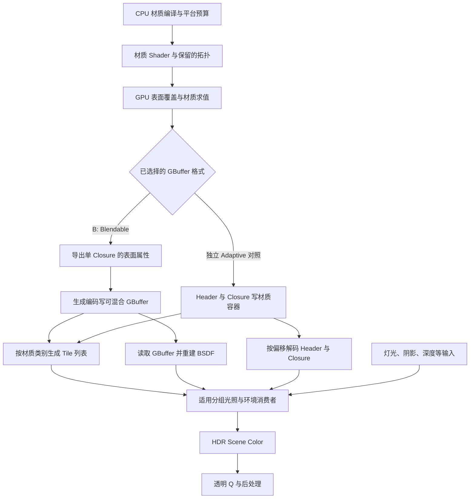
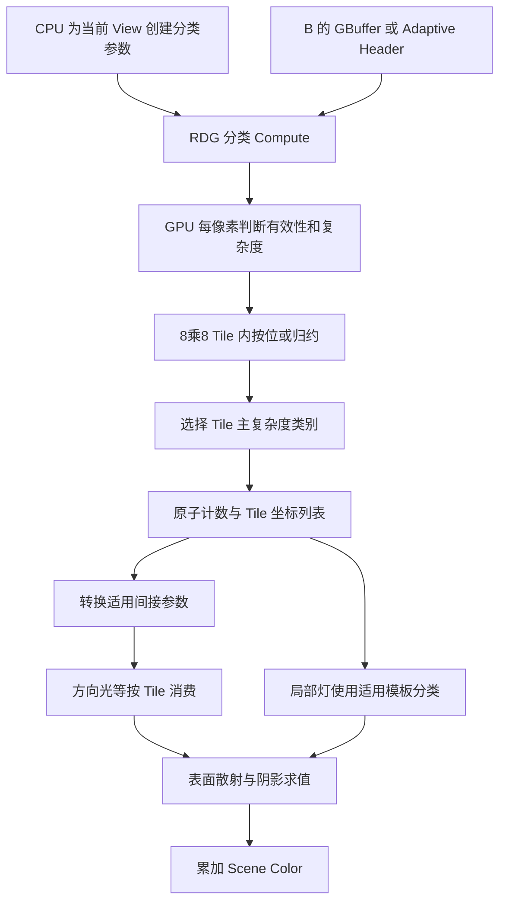

# 第 21 章：Substrate，从材质表达走到可消费的数据

[返回目录](../README.md) · [本章答案](../appendices/answers/21-substrate.md)

> **版本与范围：**UE 5.7.4，CL 51494982，Windows、D3D12、SM6、桌面延迟渲染。主线是配置 B 的 **Substrate + Blendable GBuffer**；Adaptive GBuffer 是本章另外标出的对照实验。Nanite、Lumen 软件追踪、VSM 各自负责的工作在后面三章展开，硬件光追和 MegaLights 保持关闭。
>
> **证据边界：**本章只静态阅读本地源码，没有启动 UE、编译练习材质或抓取帧。源码可定位的条件标为 `[源码已确认]`，算例与抽象图标为 `[教学简化]`；界面操作和视觉预期均为 `[尚未验证]`。这里的“已确认”不表示当前显卡执行过该分支。

## 21.1 学习目标与前置知识

读完本章，应能解释：

1. Substrate 改变材质的哪些表达能力，为什么它不是一种新的几何可见性或全局光照算法。
2. BSDF、Slab、Closure、水平混合与垂直分层分别表示什么。
3. 为什么同一份材质图在不同 GBuffer 格式和预算下可能得到不同的运行表示。
4. B 的材质怎样从编译器进入 Base Pass，再由延迟光照读取；为什么仍能看到 GBuffer 和材质 Tile 分类。
5. 怎样沿资源和调用判断自己看到的是 Blendable 还是 Adaptive，而不只看项目勾选框。

前置知识为第 04 章的材质、BRDF 和 Shader 编译，第 09 章的 RDG，第 14 章的 GBuffer，第 16～18 章的光照和透明。第 20 章已说明 Scene Color 与显示颜色的差别，本章继续在线性光照和材质数据层面讨论。

过去我们给方块选择 Default Lit，再输入 Base Color、Metallic 和 Roughness。这个过程把材质限制在一个已有着色模型能表达的参数空间中。若要描述一层有色清漆覆盖基底，问题就多了一层：上层如何反射，剩余光怎样透过上层到达底层，底层的反射返回时又怎样经过上层。这些关系需要材质结构，而不仅是额外一个颜色参数。

**Substrate（材质基底系统，通常保留英文名）**把表面散射及其组合显式表示出来，并结合目标平台把它们编译、简化、编码和着色。它处在“材质定义 → 材质求值与存储 → 光照消费者”的连接上。场景仍需要摄像机、几何、可见性、深度和光源；Substrate 不替代第 06～13 章的全部工作。

## 21.2 先用真实散射关系解释术语

### 21.2.1 BRDF 扩展到 BSDF，不意味着每个对象变透明

第 04 章的 **BRDF（Bidirectional Reflectance Distribution Function，双向反射分布函数）**描述光从入射方向到反射方向的响应。**BSDF（Bidirectional Scattering Distribution Function，双向散射分布函数）**是更广义的散射描述，可以涵盖反射与透射。名字里的“函数”强调：它会因方向、粗糙度和材料参数产生不同响应，不是一张已经着色好的图片。

本章用 **Slab（材料薄层）**表示 Substrate 的一种基础散射构件。它可以带漫反射颜色、正视角反射率、粗糙度、法线以及适用的次表面、绒毛等参数。“薄层”是一种着色模型表达，不要求你额外建一个微米厚的几何壳，也不保证每个选项在每种 GBuffer 格式中完整保存。

**Closure（散射闭包）**在本章指运行表示中可独立求值的一份散射响应及参数。它不是 JavaScript 捕获局部变量的闭包，也不是材质资产数量或三角形数量。一张复杂材质图可以包含多份散射响应；编译后却可能因预算合并成一份。一个 Closure 内部也可具有多种散射瓣，因此“一个 Closure”不等于“只做一次乘法”或“只有漫反射”。

同一蓝色薄片仍要根据材质域和混合模式选择透明路线。把项目改成 Substrate，并不会让 Q 的蓝片进入普通不透明 GBuffer，更不会自动赋予它物理玻璃的折射和吸收。

### 21.2.2 Slab 的参数怎样连接我们已经学过的光照

| 参数 | 含义与用途 | 与已有知识的连接 |
|---|---|---|
| Diffuse Albedo | 漫反射反照率，控制适用漫反射颜色 | 是受光计算的材料参数，不是最终 RGB |
| F0 | 正视角镜面反射率，可以为 RGB | 第 04 章金属／非金属划分得到的反射响应入口 |
| F90 | 接近掠射角的反射响应参数 | 与 Fresnel 的角度变化有关，能力仍受格式和简化约束 |
| Roughness | 微表面粗糙程度参数 | 影响镜面分布；不直接等于模糊半径 |
| Normal／Tangent | 散射的局部方向基 | 各向异性需要知道切线方向，不能只给法线 |
| SSS MFP | Mean Free Path，平均自由程 | 描述适用内部传播尺度，须结合厚度、单位和次表面模式 |
| Emissive Color | 材料自身发光的颜色贡献 | 进入场景颜色和曝光链，不需要先被其他光源照亮 |

**[源码已确认]**`UMaterialExpressionSubstrateSlabBSDF::Compile` 从 [MaterialExpressionSubstrate.cpp:816](G:/UnrealEngineInstalled/UE_5.7/Engine/Source/Runtime/Engine/Private/Materials/MaterialExpressionSubstrate.cpp:816) 开始。它先取得当前材质拓扑中的操作记录，创建法线和需要时的切线代码，并登记共享局部方向基。随后读取 DiffuseAlbedo、F0、Roughness、F90 等输入；缺少输入时有显式默认值。不要把编辑器节点的“没连接”理解成 GPU 收到未初始化内存。

在同一函数的 [默认输入与简化处理](G:/UnrealEngineInstalled/UE_5.7/Engine/Source/Runtime/Engine/Private/Materials/MaterialExpressionSubstrate.cpp:859) 中，可见漫反射默认 `(0.18,0.18,0.18)`、粗糙度默认 `0.5` 等教学定位点。函数还会根据允许保留的特征，把某些输入改为常量。最后在 [调用 SubstrateSlabBSDF](G:/UnrealEngineInstalled/UE_5.7/Engine/Source/Runtime/Engine/Private/Materials/MaterialExpressionSubstrate.cpp:910) 时传入这些代码片段及拓扑信息。

这说明两件事：材质图的连接先由 CPU 编译成代码；真正随像素 UV、法线、纹理变化的数值才在 GPU 上求值。也说明“图里接了某个输入”不等于“目标格式保留了该特征”。

### 21.2.3 水平混合：同一表面的不同材料区域

**Horizontal Mixing（水平混合）**表示两份材料按覆盖权重组合。例如方块表面有红漆和暴露的金属，可以用空间变化的遮罩决定两者的份额。遮罩来自 UV 纹理时，同一个材质图在 P 和相邻像素上会得到不同的混合比例。

**[教学简化]**若两份响应在相同方向上的数值为 `f_A` 与 `f_B`，覆盖比例为 `w`，可先理解成：

```text
f_mix = (1 - w) * f_A + w * f_B
```

其中 `w=0` 只保留 A，`w=1` 只保留 B，中间值组合响应。这个式子用于理解“混合散射响应”；真实 Substrate 还追踪 Coverage、方向基和所选算子的规则。它不是把两份材质各自经过色调映射的截图做平均。

编译器也可以选择 **Parameter Blending（参数混合）**：先把两份材料的参数合为一个近似材料，后续只求这一份响应。这样能减少 Closure 数及后续工作，但近似材料的响应不必等于原来两份响应的加权和。

**[源码已确认]**[HorizontalMixing::Compile](G:/UnrealEngineInstalled/UE_5.7/Engine/Source/Runtime/Engine/Private/Materials/MaterialExpressionSubstrate.cpp:2442) 先编译 Background 与 Foreground，再取得 Mix。`bUseParameterBlending` 成立时，代码计算法线混合权重、合并方向基并调用参数混合版本；否则调用保留组合关系的版本。这里判断的是编译后的拓扑要求，而不是每一帧在 CPU 上重新混合两张材质图片。

### 21.2.4 一个数值例子：先混粗糙度与后混响应为什么不同

第 16 章给出 GGX 法线分布项。在法线、观察方向与光源方向重合的特殊位置，采用该章 `a²=r⁴` 的记法，有：

```text
D(r) = 1 / (pi * r^4)
```

`r` 是粗糙度，`D` 是微表面法线分布项，不是最终光照颜色。现在只比较这个项，忽略其他项与真实 Substrate 参数合并规则：

```text
r_A = 0.25    D_A ≈ 81.48733
r_B = 0.75    D_B ≈ 1.00602
w   = 0.5

先求两个响应再平均：0.5*D_A + 0.5*D_B ≈ 41.24667
先线性混粗糙度：r_mix = 0.5
再求响应：D(0.5) ≈ 5.09296
```

两者差很多，因为 `1/r⁴` 是非线性的。这不是引擎错误，而是“合并参数”与“保留两份响应”的数学差别。真实参数混合可以采取更精细的近似，本例不宣称 UE 直接把 Roughness 算术平均；它只证明不能要求单一近似 Closure 在所有光照方向上完全还原原拓扑。

### 21.2.5 垂直分层：上层会改变抵达下层的光

**Vertical Layering（垂直分层）**表示沿材料厚度方向的叠层，例如薄涂层覆盖红色基底。它与水平混合的区别是：光要穿过上层才能到达下层，回来时还会受到上层影响。

可以类比把一层有色涂层放在纸上。但真实机制不是“把涂层颜色贴到纸的颜色上”：需要计算上层的反射、穿透时的衰减、下层获得的光，以及返回方向上的衰减。上层粗糙还可能改变下层有效的方向分布。

**[教学简化]**只考虑一条去回路径，令上层反射贡献为 `R_top`，下层响应为 `R_base`，光进入和离开上层时的透过率为 `T_in`、`T_out`，那么：

```text
R_total ≈ R_top + T_in * R_base * T_out
```

如果 `R_top=0.04`、`R_base=0.5`、`T_in=T_out=0.8`，得到 `0.04+0.8*0.5*0.8=0.36`。若忽略回程衰减，只算一次透过，会得到 `0.44`。这些数值仅是同一标量表示下的机制示意，不包含多次内部反射、吸收的方向依赖或 UE 的完整能量处理。

**[源码已确认]**[VerticalLayering::Compile](G:/UnrealEngineInstalled/UE_5.7/Engine/Source/Runtime/Engine/Private/Materials/MaterialExpressionSubstrate.cpp:2623) 处理 Top、Base、Thickness 和拓扑；[HLSLMaterialTranslator.cpp:14961](G:/UnrealEngineInstalled/UE_5.7/Engine/Source/Runtime/Engine/Private/Materials/HLSLMaterialTranslator.cpp:14961) 分别生成保留层关系与参数混合版本。GPU 的树更新和覆盖／透过关系可以继续到 [SubstrateExport.ush:1032](G:/UnrealEngineInstalled/UE_5.7/Engine/Shaders/Private/Substrate/SubstrateExport.ush:1032) 所调用的 `SubstrateUpdateTree` 阅读。不能用屏幕透明混合的一次 Alpha 运算替代整套层内散射机制。

## 21.3 先确认格式和预算，再谈运行管线

### 21.3.1 同样开启 Substrate，运行表示仍可能不同

| 路线 | 编译与存储的基本选择 | 本书位置 |
|---|---|---|
| A：关闭 Substrate | 传统材质输入及传统 GBuffer 消费 | 第 14～17 章 |
| B：Blendable GBuffer | Substrate 材质适配为单 Closure 的可混合 GBuffer 表达，再由相应消费者重建散射数据 | 本章主线 |
| Adaptive GBuffer | 按允许复杂度把材质数据存入位流形式的材质容器，后续读取 Header 与 Closure 数据 | 本章独立对照；不默认加入 B |

**Blendable（可混合）**描述存储方式适合相应渲染目标混合等操作，不表示“允许无限材质层无损混合”。**Adaptive（自适应）**在这里涉及适配复杂材料的数据表示，不等于动态分辨率，也不表示每帧一定按当前像素精确收缩显存。

**[源码已确认]**[RenderUtils.cpp:1940](G:/UnrealEngineInstalled/UE_5.7/Engine/Source/Runtime/RenderCore/Private/RenderUtils.cpp:1940) 注册 `r.Substrate`，初值为 0；[1956 行](G:/UnrealEngineInstalled/UE_5.7/Engine/Source/Runtime/RenderCore/Private/RenderUtils.cpp:1956) 注册项目格式，初值为 1。它们是只读项目选择。新项目生成在 [GameProjectUtils.cpp:199](G:/UnrealEngineInstalled/UE_5.7/Engine/Source/Editor/GameProjectGeneration/Private/GameProjectUtils.cpp:199) 写入另一些默认值。因此“CVar 注册 0”“新项目启用”“旧项目保留设置”可以同时成立。

`IsSubstrateBlendableGBufferEnabled` 在 [RenderUtils.cpp:2086](G:/UnrealEngineInstalled/UE_5.7/Engine/Source/Runtime/RenderCore/Private/RenderUtils.cpp:2086) 同时检查项目是否请求 Adaptive、平台是否支持，以及移动延迟分支。即使项目请求 Adaptive，平台不支持时仍会选择 Blendable。本书 Windows SM6 的设置请求也应与实际平台能力一起核对。

### 21.3.2 Closure 预算与字节预算分别限制什么

编译复杂材料时存在两种不同约束：能保存多少数据，以及后续最多处理多少独立 Closure。增加字节预算，不保证 Closure 限制同步增加；设置多个 Closure，也不保证复杂参数一定装得下。

**[源码已确认]**[GetClosurePerPixel](G:/UnrealEngineInstalled/UE_5.7/Engine/Source/Runtime/RenderCore/Private/RenderUtils.cpp:2124) 在 Blendable 路线直接返回 `1`。Adaptive 才进一步合并平台 Closure 配置、项目限制和项目覆盖政策。项目 `ProjectClosuresPerPixel` 注册为 4，不意味着每个平台或本书 B 实际都是 4。

[GetBytePerPixel](G:/UnrealEngineInstalled/UE_5.7/Engine/Source/Runtime/RenderCore/Private/RenderUtils.cpp:2100) 先将请求向上对齐至 4 字节，再限制范围；Blendable 的上下限都是 20，Adaptive 的上限是 256。`r.Substrate.BytesPerPixel` 的注册值为 80，也不能据此断言 B 为每个像素分配一份 80 字节材质容器。

注意这里的 **20 是这套接口返回的材质预算值**。要计算实际总显存，仍须枚举所用 GBuffer 格式、Scene Color、深度、速度、分类缓冲、历史和临时资源，不能拿 `20×像素数` 当作整帧显存结论。Blendable 不按 Adaptive 那样创建主 `Substrate.Material` 数组，这个差异在 21.6 再核对。

**[教学简化]**仅为了练习容量单位，`1280×720×20=18,432,000 byte=17.578125 MiB`。这只是指定字节数乘像素数；没有考虑分辨率对齐、实际附件格式或资源复用。实际物理流量也可能因压缩、缓存、重复读写而不同。

### 21.3.3 本章补充配置

先在 A 的基础上仅开启 Substrate、选择 Blendable，命名为“Substrate 单项对照”；这样可先观察材质系统差异。然后才回到完整 B，加入 Nanite、Lumen 和 VSM。单项对照不另冒充第三套完整主线。

| 项目 | 本章选择 | 生效与限制 |
|---|---|---|
| Substrate materials | `r.Substrate=1` | Project Settings，重启并等待 Shader 编译 |
| Substrate GBuffer Format (Project) | `r.Substrate.ProjectGBufferFormat=0` | Blendable；重启，不能当运行时画面开关 |
| DBuffer | 延续 `r.DBuffer=1` | B 初次对照也固定；Blendable 支持不表示必须关闭 DBuffer |
| 独立 Substrate DBuffer Pass | `r.Substrate.DBufferPass=0` | 只读，变更影响 Shader 编译；本章不启用延后应用变体 |
| 材质 Tile 分类 | `r.Substrate.AsyncClassification=0` | 运行时教学选择，先读普通 Compute；异步另作条件说明 |
| Substrate 随机光照 | `r.Substrate.StochasticLighting=0` | 保持关闭；它与 MegaLights 的设置也不能混称 |
| MegaLights／聚类直接光照 | 继续使用配置附录的关闭值 | 保留第 16 章可追踪的普通直接光照消费者 |

分类开关的注册与读取在 [Substrate.cpp:50](G:/UnrealEngineInstalled/UE_5.7/Engine/Source/Runtime/Renderer/Private/Substrate/Substrate.cpp:50) 和 [240 行](G:/UnrealEngineInstalled/UE_5.7/Engine/Source/Runtime/Renderer/Private/Substrate/Substrate.cpp:240)。注册初值为 1；本章主动设为 0，并不声称 UE 默认关闭异步分类。

## 21.4 编译阶段：材质图怎样成为有限的运行表示

这一阶段通常由编辑、加载所需 Shader 或构建触发，不是每一帧把节点图全部重新编译。运行时材质实例参数更新与重新生成拓扑 Shader 也要分开。

| 问题 | 本阶段的回答 |
|---|---|
| 是什么 | 分析材质图，生成目标平台可用的材质 Shader 和复杂度信息 |
| 为什么 | GPU 需要可执行代码和可解释的有限数据，无法直接消费编辑器连线界面 |
| 输入 | Front Material、节点输入、平台、格式、特征与字节／Closure 预算 |
| 过程 | 生成拓扑，统计特征，按预算简化，编译输入和算子，生成 HLSL 与排列 |
| 输出 | Shader 代码／排列、材质复杂度与存储要求，不是当帧最终 GBuffer |
| UE 实现 | MaterialExpressionSubstrate 与 HLSLMaterialTranslator 的拓扑、编译上下文和生成函数 |
| 条件 | Substrate 支持、材质域、节点类型、目标平台与编译环境 |
| 成本与误区 | 编译时间／排列数量和运行成本不同；更多编辑器节点不直接等于更多最终 Closure |

### 21.4.1 从 Front Material 开始读调用链

**Front Material（正面材质输入）**是 Substrate 材质根输入之一，表示最终提交的材料结构。为了阅读，不必先理解全部宏，可以沿以下路线定位：

```text
FHLSLMaterialTranslator 准备编译上下文
  -> 遍历 Front Material 的 SubstrateGenerateMaterialTopologyTree
  -> SubstrateGenerateDerivedMaterialOperatorData
  -> 编译 MP_FrontMaterial
  -> 各 MaterialExpressionSubstrate 节点的 Compile
  -> SubstrateSlabBSDF／混合／分层代码生成
  -> 目标 Shader 编译与缓存
```

**[源码已确认]**[HLSLMaterialTranslator.cpp:1688](G:/UnrealEngineInstalled/UE_5.7/Engine/Source/Runtime/Engine/Private/Materials/HLSLMaterialTranslator.cpp:1688) 设置上下文并遍历根表达式，[1706 行](G:/UnrealEngineInstalled/UE_5.7/Engine/Source/Runtime/Engine/Private/Materials/HLSLMaterialTranslator.cpp:1706) 派生拓扑信息。后续在 [1863 行](G:/UnrealEngineInstalled/UE_5.7/Engine/Source/Runtime/Engine/Private/Materials/HLSLMaterialTranslator.cpp:1863) 能看到完全简化编译上下文的 Front Material 编译。源码还有传统输入转换等分支，不能把“新建显式 Slab 图”当作全部旧材质的唯一路径。

拓扑记录含父子关系、层深度、方向基及需要的特征。例如两条不同连线路径可以引用相同材质函数，但处于不同的组合关系；编译器要知道这些关系，才能判断谁位于上层、谁可以被参数合并。节点资产引用与运行 Closure 索引不是同一个编号系统。

### 21.4.2 超出预算时，具体发生什么

**[源码已确认]**[SubstrateGenerateDerivedMaterialOperatorData](G:/UnrealEngineInstalled/UE_5.7/Engine/Source/Runtime/Engine/Private/Materials/HLSLMaterialTranslator.cpp:13331) 组织派生信息。其 [简化迭代](G:/UnrealEngineInstalled/UE_5.7/Engine/Source/Runtime/Engine/Private/Materials/HLSLMaterialTranslator.cpp:13478) 获取 Closure 预算，在未满足约束时对选中操作设置参数混合，并在进一步条件下简化 Slab 特征。

在 [14142 行](G:/UnrealEngineInstalled/UE_5.7/Engine/Source/Runtime/Engine/Private/Materials/HLSLMaterialTranslator.cpp:14142)，是否装得下由两个比较共同决定：请求字节数不超过预算，且 Closure 数不超过上限。不能只看材质统计中的其中一个数字。该块还有无法满足后续条件时的错误处理；不是承诺任意复杂图都必然变成正确且无损的 Shader。

**[教学简化]**用伪代码保留这段机制的要点：

```text
topology = analyze_front_material()
repeat:
    derive_retained_features_and_closures(topology)
    estimate_material_storage(topology)
    if bytes_fit && closures_fit:
        break
    apply_next_allowed_simplification(topology)
    if no_supported_solution:
        report_compile_error
generate_shader_for_retained_representation()
```

这不是逐行复制，也不意味着每轮只减一个 Closure。它提醒读者追踪“原来想表达什么”“最终保留什么”“按哪个平台预算决定”。B 强制单 Closure，复杂混合图可能因此成为参数近似；这是格式约束的一部分。

### 21.4.3 生成代码与运行时数值的最后一个连接

[SubstrateSlabBSDF](G:/UnrealEngineInstalled/UE_5.7/Engine/Source/Runtime/Engine/Private/Materials/HLSLMaterialTranslator.cpp:14389) 产生调用 `GetSubstrateSlabBSDF` 等函数的 HLSL 表达式。材质里的纹理采样或参数会成为这些表达式的输入。CPU 在此形成代码，GPU 运行代码时才得到 P 处的具体 Albedo、F0 和 Roughness。

因此每帧移动方向光，不需要重新编译红方块材质。改变静态拓扑、格式或影响编译的项目设置则可能需要新 Shader。看到 Shader 编译耗时上升，也不能直接把它算作稳定帧的 GPU 毫秒数。

## 21.5 B 的一帧：导出 GBuffer，再重建散射数据

### 21.5.1 先看两个格式共享和分开的地方

[打开材质生产与消费静态图](../assets/diagrams/21-substrate-1.png)



**[教学简化]**这张图是材质数据依赖，编译与当帧渲染分属不同时间范围。B 的 Nanite 可以通过自己的材质求值组织进入相应输出机制，不能从图中的“GPU 表面覆盖”推断所有 B 网格都执行普通网格的同一 Raster Draw。

### 21.5.2 Base Pass 中先取得材质结构

**[源码已确认]**[BasePassPixelShader.usf:1046](G:/UnrealEngineInstalled/UE_5.7/Engine/Shaders/Private/BasePassPixelShader.usf:1046) 从 `PixelMaterialInputs.GetFrontSubstrateData()` 和 `MaterialParameters.GetFrontSubstrateHeader()` 取得当前像素的结构及 Header。**Header（头部元数据）**帮助描述材质模式、独立响应数量和适用标志；它不同于 PNG 文件头，也不是全部散射参数本身。

在适用的 DBuffer 路径，材质求值还要应用贴花。B 继续开启 DBuffer，但 `r.Substrate.DBufferPass=0`，所以不把后文的独立 DBuffer 应用 Pass 当作必经节点。普通透明薄片仍排除于常规自动不透明 DBuffer 应用，详见第 14 章的外层条件。

### 21.5.3 Format 0 的具体输出链

在 [BasePassPixelShader.usf:1872](G:/UnrealEngineInstalled/UE_5.7/Engine/Shaders/Private/BasePassPixelShader.usf:1872) 附近的 `SUBSTRATE_GBUFFER_FORMAT==0` 分支，Shader 调用 `SubstrateMaterialExportOut`，取得一份可导出的表面表示。输入不仅有材质结构，还有观察方向、表面法线和相对相机位置。

[SubstrateMaterialExportOut](G:/UnrealEngineInstalled/UE_5.7/Engine/Shaders/Private/Substrate/SubstrateExport.ush:1000) 以索引 0 的 BSDF 为出口；适用时先更新覆盖、透过与亮度权重，再取得法线、BaseColor、Metallic、Specular、Roughness、Emissive 等。函数存在为传统转换优化的分支，不能把全部拓扑更新都断言为每个像素必经。

返回 Base Pass 后，[1903 行](G:/UnrealEngineInstalled/UE_5.7/Engine/Shaders/Private/BasePassPixelShader.usf:1903) 附近通过 `SetGBufferForShadingModel` 把导出属性放入 `FGBufferData`。其中的 ShadingModelID 用于这个格式的解释与消费。随后使用当前生成的 GBuffer 编码写附件，而非把 C++ 材质节点列表直接复制到显存。

P 在这里得到可供光照读取的材质属性。Q 的不透明背景也按相同规则处理；前方蓝片仍在透明路线提供颜色。看到 B 中 GBuffer 的 BaseColor 并不奇怪，但该属性可能已经是复杂 Substrate 图经过导出和简化的结果，不能反推它完整保留了作者原始的所有层。

### 21.5.4 消费者如何重新得到 BSDF

第 16 章已经定位 `DeferredLightPixelMain`。本版的 Substrate 分支在 [DeferredLightPixelShaders.usf:267](G:/UnrealEngineInstalled/UE_5.7/Engine/Shaders/Private/DeferredLightPixelShaders.usf:267) 区分是否从材质容器加载；Format 0 的宏选择可在 [文件开头](G:/UnrealEngineInstalled/UE_5.7/Engine/Shaders/Private/DeferredLightPixelShaders.usf:30) 核对。

B 读取 `GetScreenSpaceData`，判断材质是否受光，用 Scene Depth 恢复当前受光位置，再准备光方向、范围衰减与阴影输入。在 [322 行](G:/UnrealEngineInstalled/UE_5.7/Engine/Shaders/Private/DeferredLightPixelShaders.usf:322) 调用 `SubstrateReadGBufferBSDF`，把 GBuffer 转成 Substrate 消费者所需结构。

[SubstrateRead.ush:24](G:/UnrealEngineInstalled/UE_5.7/Engine/Shaders/Private/Substrate/SubstrateRead.ush:24) 的实现使用 GBuffer 法线建立方向基；存在适用各向异性时使用存储切线。它读取 DiffuseColor、SpecularColor、粗糙度等数据，兼顾 Shading Model 的不同恢复分支。这不是读取一份任意长的材质层数组。

之后 [SubstrateDeferredLighting](G:/UnrealEngineInstalled/UE_5.7/Engine/Shaders/Private/Substrate/SubstrateDeferredLighting.ush:56) 接收灯光、方向、阴影，以及“材质容器”或“直接传入的 BSDF”两种输入形式。容器形式才有相应 Closure 循环；B 单 BSDF 形式并不从不存在的多层数组逐层读取。

适用面积光／普通光在同文件 [160 行](G:/UnrealEngineInstalled/UE_5.7/Engine/Shaders/Private/Substrate/SubstrateDeferredLighting.ush:160) 附近进入 `SubstrateEvaluateBSDFCommon` 等积分分支。最后产生光照贡献，再接回 Scene Color。阴影仍要来自 VSM 或当前独立实验使用的普通阴影；Substrate 不会自己凭材质数据知道灯与表面之间所有遮挡物。

### 21.5.5 用八个问题收束这一阶段

| 问题 | B 的材质生产与消费 |
|---|---|
| 是什么 | 表面求值后存储可混合属性，再恢复相应 BSDF 供光照使用 |
| 为什么 | 保留延迟消费者共享表面数据的组织，同时适配 Substrate 作者表达 |
| 输入 | 编译后材质、几何插值、View、深度、适用贴花；光照侧另加灯光和阴影 |
| 过程 | Front 数据 → 单 Closure 导出 → GBuffer 编码 → 解码／恢复 BSDF → 散射求值 |
| 输出 | GBuffer、适用初始颜色和后续 HDR 光照颜色；不同资源保存不同阶段的信息 |
| UE 实现 | BasePassPixelShader、SubstrateExport、SubstrateRead、DeferredLightPixelShaders 与 SubstrateDeferredLighting |
| 条件 | Format 0、适用不透明材质、所选消费者及其排列；透明另行处理 |
| 成本与误区 | 材质求值、附件带宽和光照求值均有成本；单 Closure 不代表图中纹理采样全部免费 |

## 21.6 Adaptive 对照：材质容器与资源预算

这一节描述独立对照，不偷偷把 B 改成 Adaptive。只有明确选择项目格式 1、平台支持并完成重启编译后，才沿本节解释实际捕获。

### 21.6.1 为什么要另存 Header 和 Closure 数据

如果一个像素需要保留多层独立响应，固定几个传统通道不一定装得下。Adaptive 路线用 **Material Container（材质数据容器）**保存可解码的数据。它可看作带格式说明的紧凑记录：读取方先看 Header，再按对应规则获得其余字段。

类比可变长记录只是为了理解。真实实现还涉及 `uint` 打包、特定数组切片、寻址和 GPU 访问，不是 C++ `std::vector` 在每个屏幕像素上各分配一次堆内存。

**[源码已确认]**场景入口在 [DeferredShadingRenderer.cpp:2322](G:/UnrealEngineInstalled/UE_5.7/Engine/Source/Runtime/Renderer/Private/DeferredShadingRenderer.cpp:2322) 调用 `InitialiseSubstrateFrameSceneData`。该函数在 [Substrate.cpp:459](G:/UnrealEngineInstalled/UE_5.7/Engine/Source/Runtime/Renderer/Private/Substrate/Substrate.cpp:459) 收集是否需要材质缓冲、格式及 View 要求，并据此安排资源。

这里有一个容易被名字误导的地方：`UsesSubstrateMaterialBuffer` 在 [143 行](G:/UnrealEngineInstalled/UE_5.7/Engine/Source/Runtime/Renderer/Private/Substrate/Substrate.cpp:143) 返回 `IsUsingGBuffers`，并不等价于“必定分配 Adaptive 容器”。实际创建 `Substrate.Material` 还要判断 `!bBlendableGBufferEnabled`。

### 21.6.2 资源创建与实际写入是两件事

[Substrate.cpp:602](G:/UnrealEngineInstalled/UE_5.7/Engine/Source/Runtime/Renderer/Private/Substrate/Substrate.cpp:602) 附近按有效预算计算数组切片；在需要材质缓冲且非 Blendable 的条件下创建 `PF_R32_UINT` 的二维数组 `Substrate.Material`，以及所需 SRV／UAV。Top Layer、适用次表面和 Closure Offset 资源也有各自条件。

CPU 调用 `GraphBuilder.CreateTexture` 时只是登记资源描述和使用关系。材质值要等 GPU 执行对应 Shader 后才存在。相关生命周期依赖继续遵守第 09～10 章，不由 C++ 局部变量的作用域替代。

在 Base Pass 的非 Format 0 分支，[BasePassPixelShader.usf:2002](G:/UnrealEngineInstalled/UE_5.7/Engine/Shaders/Private/BasePassPixelShader.usf:2002) 附近取得当前像素数据偏移、初始化可写容器，再调用 `PackSubstrateOut`。适用数据通过 MRT 和 UAV 等路线写出。不能把它描述成“全部 Closure 永远各占一个固定 MRT”，也不能用传统通道图直接解码数组里的整数。

| 问题 | Adaptive 容器阶段 |
|---|---|
| 是什么 | 把保留的复杂材质数据编码成可供延迟读取的位流记录 |
| 为什么 | 支持固定传统属性集合难以完整表达的材料关系 |
| 输入 | 当前像素材质树、Header、预算、寻址信息、适用预计算项 |
| 过程 | 更新保留响应、判断有效部分、编码 Header 和数据、写附件及 UAV |
| 输出 | 材质容器、适用 Top Layer 与其他辅助数据，供分类／光照／环境消费者读取 |
| UE 实现 | InitialiseSubstrateFrameSceneData、PackSubstrateOut、Substrate 读写与解码工具 |
| 条件 | 请求 Adaptive 且平台支持；复杂效果另受功能与 Closure 预算约束 |
| 成本与误区 | 更多存储和解码、更多独立响应；预算上限、实际分配和每像素有效写入量不同 |

### 21.6.3 Adaptive 不保证每帧最小分配

资源分配政策在 [Substrate.cpp:63](G:/UnrealEngineInstalled/UE_5.7/Engine/Source/Runtime/Renderer/Private/Substrate/Substrate.cpp:63) 注册 `r.Substrate.AllocationMode`，初值 1。初始化时的分支分别允许按当前 View 需求、按跨帧只增长的需求、或按平台预算分配。

只增长模式的目的包括减少重新分配引起的波动。相机曾经看到复杂材质、后来转向简单墙面，容器可能仍保持较大容量。因此“当前 P 只有一份简单材料”不足以解释整个资源占用。另一方面，分配了某个容量也不说明每个像素都写入并读取相同数量的数据。

### 21.6.4 多 Closure 特性还要单独启用

**Opaque Rough Refraction（不透明材料内部粗糙折射）**描述适用上层对下层的粗糙传播，不等同于把整块方块改成透明玻璃。`IsOpaqueRoughRefractionEnabled` 在 [RenderUtils.cpp:2309](G:/UnrealEngineInstalled/UE_5.7/Engine/Source/Runtime/RenderCore/Private/RenderUtils.cpp:2309) 同时要求 Substrate、对应开关、非 Blendable 和多于一个 Closure 的支持。B 不满足其格式条件。

同理，高级材质树可视化也排除 Blendable，见 [2321 行](G:/UnrealEngineInstalled/UE_5.7/Engine/Source/Runtime/RenderCore/Private/RenderUtils.cpp:2321)。不能在 B 打开一个高级可视化开关失败后，立即断言 Substrate 没有运行。

## 21.7 材质 Tile 分类：B 也存在的重要工作

### 21.7.1 分类为什么可以减少复杂路径的覆盖

**Tile（屏幕块）**把一定大小的像素区域作为处理单位。**Material Classification（材质分类）**读取表面数据，判断该区域需要哪个复杂度的 Shader 路径，再把区域加入相应列表。它不改变材质作者图，不负责几何遮挡，也不是给世界中的 Actor 分类。

如果全屏只有少量像素使用复杂特征，让整个屏幕无条件执行最复杂 Shader 会浪费工作。但分类本身需要读取数据、归约、写列表和组织间接参数。是否更快仍取决于实际场景分布，不能把它称为零成本优化。

### 21.7.2 CPU 调用与 GPU 分类输入

**[源码已确认]**主调度在 [DeferredShadingRenderer.cpp:3014](G:/UnrealEngineInstalled/UE_5.7/Engine/Source/Runtime/Renderer/Private/DeferredShadingRenderer.cpp:3014) 之后的 Substrate 分支安排适用 DBuffer、分类和采样工作。`bNeedsClassificationPass` 还会考虑随机光照分类是否合并；本书 MegaLights 和相关随机光照关闭，不把这种合并当作固定路径。

[AddSubstrateMaterialClassificationPass](G:/UnrealEngineInstalled/UE_5.7/Engine/Source/Runtime/Renderer/Private/Substrate/Substrate.cpp:1638) 对每个适用 View 选择 Compute／AsyncCompute，设置 SceneTextures、View、列表 UAV、间接计数和格式相关参数。分类列表的创建在 [InitialiseSubstrateViewData](G:/UnrealEngineInstalled/UE_5.7/Engine/Source/Runtime/Renderer/Private/Substrate/Substrate.cpp:260)；其 `bNeedsMaterialBuffer` 分支也覆盖桌面 B，不能因 B 没有 Adaptive 纹理数组就认定所有分类缓冲不存在。

### 21.7.3 Shader 内部怎样把 64 个像素归为一块

[SubstrateMaterialClassification.usf:93](G:/UnrealEngineInstalled/UE_5.7/Engine/Shaders/Private/Substrate/SubstrateMaterialClassification.usf:93) 的 `TileMainCS` 处理一个屏幕块。CPU 在 [Substrate.cpp:1709](G:/UnrealEngineInstalled/UE_5.7/Engine/Source/Runtime/Renderer/Private/Substrate/Substrate.cpp:1709) 使用 8 的组尺寸组织二维组数；这里每块是 8×8 个像素，不是第 16 章示意灯光网格的 16×16，也不是 VSM 的物理页。

本版 Format 0 的读取在 [分类 Shader:137](G:/UnrealEngineInstalled/UE_5.7/Engine/Shaders/Private/Substrate/SubstrateMaterialClassification.usf:137)：

1. 根据当前 ViewRect 偏移取得正确的缓冲坐标。
2. 读取 GBuffer，排除 Unlit；背景或本例蓝片不能在此凭空变成受光 Closure。
3. 检查需要时的 Anisotropy、ShadingModelID 等，给当前像素标记 Simple、Single 或 Complex。
4. 用 Wave 操作或组共享内存对整个 Tile 做位或归约。
5. 按复杂度优先选择此 Tile 的主类别，原子增加相应计数，并写入打包后的 Tile 坐标。

归约和列表写入可以在 [294 行](G:/UnrealEngineInstalled/UE_5.7/Engine/Shaders/Private/Substrate/SubstrateMaterialClassification.usf:294) 与 [359 行](G:/UnrealEngineInstalled/UE_5.7/Engine/Shaders/Private/Substrate/SubstrateMaterialClassification.usf:359) 阅读。Tile 中只要有适用 Complex 像素，就不能把整个 Tile 当作 Simple；但这不表示其余像素的材质参数被永久改成复杂材料。

Adaptive 的分类改为读取材质 Header，且会考虑它特有的类别和辅助工作。多 Closure Offset 在 [Substrate.cpp:398](G:/UnrealEngineInstalled/UE_5.7/Engine/Source/Runtime/Renderer/Private/Substrate/Substrate.cpp:398) 明确排除 Blendable，不能把它画成 B 分类后的必经阶段。

[打开 Tile 分类静态图](../assets/diagrams/21-substrate-2.png)



该图为 `[教学简化]`，不表示分类 CPU 回调一返回 GPU 就完成，也不表示所有灯都用相同间接绘制。源码中的类别有能力与使用掩码，某个列表可能为空。

### 21.7.4 从分类输出追到真实光照调用

`AddSubstrateMaterialClassificationIndirectArgsPass` 在 [Substrate.cpp:1615](G:/UnrealEngineInstalled/UE_5.7/Engine/Source/Runtime/Renderer/Private/Substrate/Substrate.cpp:1615) 将适用分类计数转换为后续间接参数。这里写的是 GPU 将使用的工作描述，不是 CPU 立刻读取所有像素再逐块 Draw。

[LightRendering.cpp:2970](G:/UnrealEngineInstalled/UE_5.7/Engine/Source/Runtime/Renderer/Private/LightRendering.cpp:2970) 附近解释两类普通延迟光照消费者：方向光可按 Tile 组织矩形区域，局部灯可用光体积配合模板中的分类。随后根据 `ShouldRenderTileType` 为适用类别选择 Shader permutation 并调用 `InternalRenderLight`。

所以 B 不只是把 A 的一个 Shader 替换成另一个 Shader。它还可能增加分类任务，并改变方向光和局部光怎样限定复杂度路径的覆盖。阴影算法则是另一条条件轴，由 VSM 章节继续展开。

| 问题 | 材质分类阶段 |
|---|---|
| 是什么 | 将屏幕区域按所需材料复杂度组织成可消费列表 |
| 为什么 | 避免简单区域无条件使用最复杂分支 |
| 输入 | B 的 GBuffer 或 Adaptive Header、ViewRect、适用标志和目标列表 |
| 过程 | 像素分类 → Tile 归约 → 类别优先选择 → 原子计数／列表 → 间接参数 |
| 输出 | Tile 列表、Draw／Dispatch 参数及适用分类消费结果 |
| UE 实现 | Substrate.cpp 与 SubstrateMaterialClassification.usf；LightRendering 消费 |
| 条件 | Substrate、适用延迟路径、当前分类组织；B 也可执行，异步另受支持和调度约束 |
| 成本与误区 | 分类读写、复杂像素分布和消费者成本；8×8 Tile 与 Actor、Closure、阴影页不同 |

### 21.7.5 数值与并行边界

**[教学简化]**1280×720 恰好按 8 整除，因此主 View 区域可分成 `160×90=14,400` 块。某块只有一个各向异性像素，也可能进入 Complex 类别。相同数量的复杂像素集中在少量块与均匀散落在全屏，可能带来不同分类覆盖，不能只比较材质资产数量。

开启异步分类只改变相应 Pass 的许可队列类型。它仍需等待本帧材质输入可读取，消费者也要等待分类结果。GPU 上是否与阴影工作重叠、重叠多久，还受设备能力、屏障、资源和负载影响。我们没有采集 GPU 时间线，不能把 CVar 帮助中的 “with shadow” 当作本机已测到的重叠证据。

## 21.8 贴花、透明与其他 UE5 系统如何连接

### 21.8.1 DBuffer 是条件轴，不是 Substrate 的同义词

第 14 章解释了贴花在 Base Pass 之前写 DBuffer、接收方再应用。Adaptive 材质数据不适合任意硬件混合，相关系统因此更依赖 DBuffer 组织；Blendable 格式本身不强制所有项目启用 DBuffer。不过本书 B 为控制变量仍保持 DBuffer 开启。

[RenderUtils.cpp:1511](G:/UnrealEngineInstalled/UE_5.7/Engine/Source/Runtime/RenderCore/Private/RenderUtils.cpp:1511) 给出 `IsUsingDBuffers` 的合并条件。独立 Substrate DBuffer Pass 是否可用还要经过 [IsDBufferPassEnabled](G:/UnrealEngineInstalled/UE_5.7/Engine/Source/Runtime/RenderCore/Private/RenderUtils.cpp:2296)，包括法线格式／平台和只读开关。注册说明明确变更会要求重新编译 Shader。

当独立 Pass 开启且资源有效，`AddSubstrateDBufferPass` 在 [Substrate.cpp:1792](G:/UnrealEngineInstalled/UE_5.7/Engine/Source/Runtime/Renderer/Private/Substrate/Substrate.cpp:1792) 内还区分 Blendable Pixel Shader 路径与材质容器的 Compute 路径。这里只解释它为什么可能出现，本书固定值 0 时不将它计入 B 的必经执行清单。

### 21.8.2 Q 仍需要前景与背景，但内部颜色表示要重新核对

蓝片保持 Unlit 透明教学行为；B 中原有材质可能经过 Substrate 兼容转换。它仍不能覆盖掉 Q 的不透明背景属性，再希望普通延迟光照同时求出两层颜色。

透明 Substrate 可以区分 **Coverage（覆盖率）**与 **Transmittance（透过率）**。前者表示覆盖多少，后者表示覆盖部分让多少背景光通过；有色透过率可按 RGB 分别衰减。

**[教学简化]**令覆盖率为 `a`，覆盖部分自身已求得的出射颜色为 `R`，透过率为 `T`，背景为 `C_bg`：

```text
C_out = a*R + ((1-a) + a*T)*C_bg
```

这里 `R` 的定义已包含属于表面的颜色，不把背景重复计入。取 `a=0.5`、`R=(0.1,0.2,0.3)`、`T=(0.2,0.6,0.8)`、`C_bg=(0.6,0.4,0.2)`，则背景系数为 `(0.6,0.8,0.9)`，结果为 `(0.41,0.42,0.33)`。这不是原蓝片的实测值，也不是所有 Substrate Blend Mode 的统一输出公式。

实际 Shader 的透明分支、兼容传统材质与 AlphaComposite 覆盖见 [BasePassPixelShader.usf:2213](G:/UnrealEngineInstalled/UE_5.7/Engine/Shaders/Private/BasePassPixelShader.usf:2213)。RGB 是否已预乘、Alpha 保存覆盖还是透过相关量、是否使用双源混合，都要与第 18 章的绑定和合成一起核对。不能给所有透明输出再盲目乘一次 Opacity。

### 21.8.3 四个系统分别回答不同问题

| 系统 | 核心问题 | 与本章的连接 |
|---|---|---|
| Nanite | 哪些适用细节和三角形产生可见表面，怎样组织光栅与材质工作 | 产生材质求值所需表面信息，最终仍需对应材质表示 |
| VSM | 接收点朝光源方向是否被遮挡，怎样按页维护阴影深度 | 为直接光照提供可见性相关输入，不替代 BSDF |
| Lumen | 间接光与反射从哪里取得、怎样近似并复用 | 使用适用表面信息与材质响应；B 单 Closure 不意味着没有 GI |
| Substrate | 表面如何散射光，组合关系怎样表达、存储和求值 | 消费光照来源与可见性，产生受材料影响的颜色 |

这些系统会相互约束，但没有一个开关能代表另外三个已生效。完整 B 的帧要在第 27 章把这些条件合起来，而不是把四个宣传流程图首尾拼接。

## 21.9 贯穿案例与观察练习

### 21.9.1 先保持红方块和金属球的基础外观

**[尚未验证]**以下需要你在 UE 工程里执行，本书没有交付额外工程或实际截图。操作前保留 A 项目及原材质的可恢复副本；Substrate 下保存转换材质可能改变它回到关闭 Substrate 状态时的兼容性。

这不是假想限制：编辑器在 [MaterialEditor.cpp:2164](G:/UnrealEngineInstalled/UE_5.7/Engine/Source/Editor/MaterialEditor/Private/MaterialEditor.cpp:2164) 有自动转换材质的保存检查与兼容提示。不要通过“关闭开关后重新保存同一份资产”承担全部回退流程。练习的目的是观察渲染，不需要修改引擎源码。

1. 复制 A 的练习工程或保留版本控制快照，确认能独立恢复原材质。记录场景、相机、曝光与灯光参数。
2. 仅切换本章 21.3.3 的 Substrate 相关项目设置，重启并等待材质 Shader 完成。几何、GI、阴影先保留 A，命名为单项对照。
3. 检查原材质是否走兼容转换；再新建一个实验用 Surface／Opaque 材质，添加 `Substrate Slab BSDF`，输出接 `Front Material`。不要把显式新图与原图的自动转换状态混为同一次对照。
4. 为实验红方块明确输入 Diffuse Albedo `(0.8,0.05,0.03)`、F0 `(0.04,0.04,0.04)`、Roughness `0.45`，其他复杂特征保持默认或关闭。数值是本章新实验参数，不替换第一章的全部基准。
5. 在金属球的实验副本中取 Diffuse Albedo 为 0，给 F0 有色反射率，保持相机和灯光。检查镜面响应与粗糙度，而不是要求场景颜色等于 F0。

预期你能看到简单表面正常受光，且某些传统 GBuffer 观察仍有意义。若材质变黑，先检查 Front Material 是否连接、Shader 是否编译成功、当前格式和材质域，然后检查场景是否真的有可见光源。若外观不同，先对照新输入与原来 Metallic／Specular 的映射，不把一切变化都归因于系统性能。

### 21.9.2 在同一方块上比较混合表达

先复制实验材质，在其中放两个 Slab，以不同 Roughness 和颜色区分，通过 Horizontal Mix 连接到 Front Material。Mix 先设 0、1，再设 0.5；观察材质统计和 Shader 编译信息，同时看 P 的高光变化。

B 的单 Closure 约束意味着中间结果可能是参数近似。不能仅看图中有两个 Slab 就宣布运行时保存两个 Closure。再复制一份做 Vertical Layer，保持上层简单、基底可辨识，观察同样参数变化为什么不应等同于水平混合。这里不规定复杂透射的像素颜色，因为格式保真、简化和光照方向都会影响结果。

真正比较多 Closure 时，使用另一个明确标识的 Adaptive 实验副本，在项目中选择 Adaptive，核对平台支持、项目／平台 Closure 限制和字节预算，重启并重新编译。不要把 `ProjectClosuresPerPixel=4` 当成实际必有四层，也不要在 Blendable 下通过改这一项期待绕过强制单 Closure。

### 21.9.3 用可视化验证当前表示

在视口的 View Mode 中查找 `Substrate Visualization`，先观察 `Material Properties`、`Material Count`、`Material Classification` 与 `Substrate Info`。菜单与可用性来源见 [SubstrateVisualizationData.cpp:65](G:/UnrealEngineInstalled/UE_5.7/Engine/Source/Runtime/Engine/Private/SubstrateVisualizationData.cpp:65)。材质编辑器也有 Substrate 面板，注册入口见 [MaterialEditor.cpp:503](G:/UnrealEngineInstalled/UE_5.7/Engine/Source/Editor/MaterialEditor/Private/MaterialEditor.cpp:503)。

| 观察位置 | 想核对的事实 | 看不到预期时先检查 |
|---|---|---|
| 材质编译／Substrate 面板 | 请求与最终复杂度、是否简化、Shader 目标 | 正在看的是资产预览还是目标平台实际排列 |
| Material Count | 当前表示保留的材料响应数量 | B 单 Closure、Unlit、视图和格式有效性 |
| Material Classification | 当前表面分布如何影响 Tile 类别 | 复杂特征是否被简化、相机是否覆盖实验区域 |
| GPU 捕获的资源 | B 的 GBuffer 与 Adaptive Material 数组的不同 | 当前重启后配置、平台回退、场景是否真的使用材质 |
| P 与 Q | 不透明背景属性与透明颜色分别出现在哪里 | 当前 Pass、Separate Translucency 和显示模式 |

高级材质树模式有额外 Shader 与格式要求，不在 B 强行要求可用。可视化输出本身也有渲染成本，不能把开启后的帧耗时当普通运行基准。

### 21.9.4 最后回到完整 B

完成单项观察后，按配置附录启用适用 Nanite、Lumen 软件追踪和 VSM。仍使用同一红方块、球、地面、方向光、点光源和透明片。记录这次配置切换是多项功能组合，不能用总帧差推算 Substrate 单独成本。

对 P 依次记录：几何如何产生表面、材质如何导出属性、分类归入哪个类别、灯光读取什么阴影与表面数据、Lumen 是否补充相应间接贡献、最终颜色怎样经过曝光。对 Q，再单独追踪蓝片的着色与合成，并保留其后方不透明表面的记录。

## 21.10 关键概念回顾

- Substrate 管理材料散射表达、编译、表示与消费；Nanite、VSM、Lumen 负责相邻但不同的问题。
- 水平混合、垂直分层和屏幕透明混合不同；参数近似也不等于保留所有原响应。
- 本书 B 是 Blendable、单 Closure。项目开启 Substrate 不等于运行 Adaptive 材质容器。
- B 可把材质导出为 GBuffer，再恢复 BSDF 供 Substrate 光照消费；它仍可执行材质 Tile 分类。
- Adaptive 的字节预算、实际分配、每像素有效数据量与完整帧显存是四种不同度量。
- 查看源码函数名后必须继续核对内部格式分支、资源绑定与使用者，不能只凭 `MaterialBuffer` 这样的名字推断资源存在。

## 21.11 理解检查题

1. 为什么材质图里有两个 Slab，不足以证明 B 的一个像素有两个 Closure？列出需要检查的至少三个条件。
2. 使用 21.2.4 的特殊 GGX 分布项，计算粗糙度 0.25 与 0.75 各占一半时“先求响应再平均”和“先平均粗糙度”的结果，并解释这能证明什么、不能证明什么。
3. 沿 B 的 P 像素，写出 Front Material 到直接光照的主要数据转换，指出哪一步发生于编译阶段，哪一步发生于 GPU 当帧。
4. 一个 8×8 Tile 中只有一个有效 Complex 像素，其余都是 Simple。主类别会怎样选择？1280×720 有多少块？B 是否因此需要 Adaptive 的 Closure Offset 纹理？
5. 当 `a=0.5`、`R=(0.1,0.2,0.3)`、`T=(0.2,0.6,0.8)`、背景 `(0.6,0.4,0.2)` 时，按本章简化覆盖／透射式计算结果。为什么不能把它直接当成原蓝片的屏幕颜色？

下一章进入 **Nanite**：保持同一材质和光照语境，解释适用几何如何组织细节、可见性、光栅化与材质求值，再接回本章的表面数据消费者。
