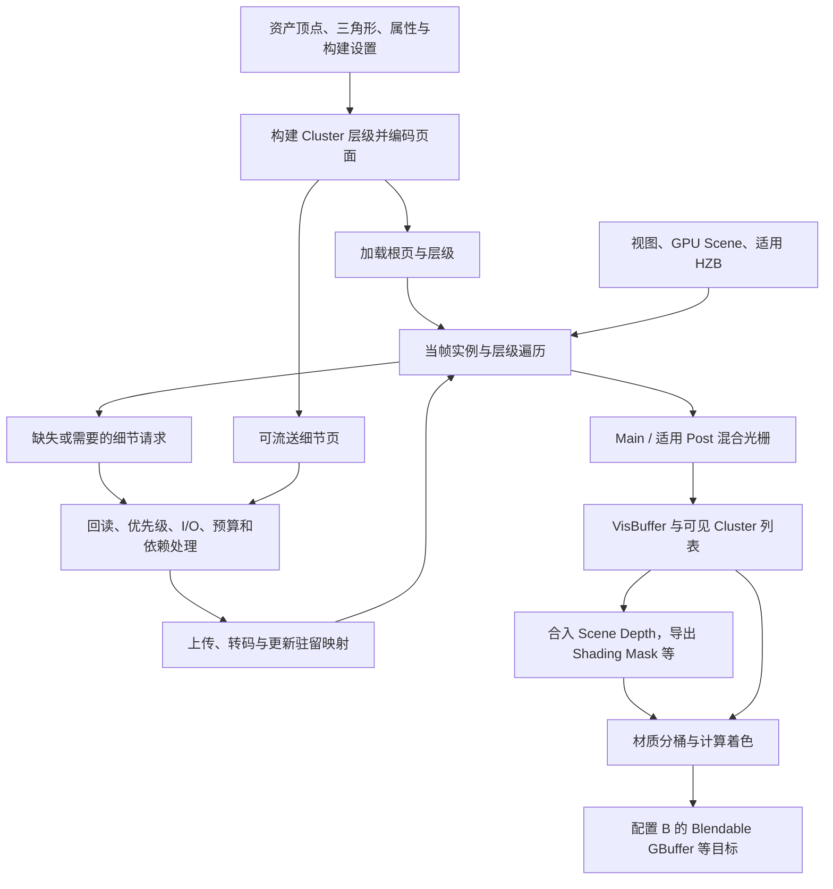
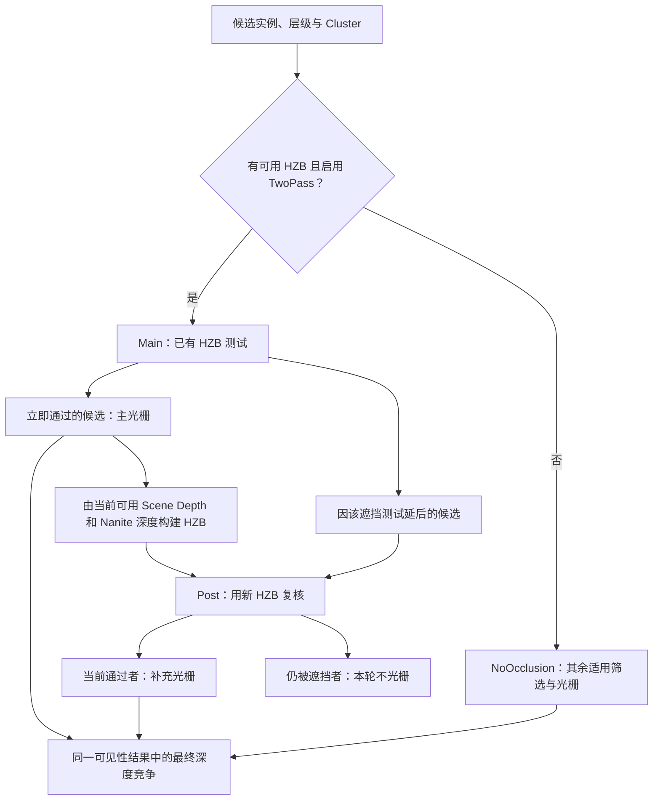

# 第 22 章：Nanite 虚拟化几何与可见表面

[返回目录](../README.md) · [本章答案](../appendices/answers/22-nanite.md) · [一帧总览](00-frame-overview.md)

> **版本与范围：**UE 5.7.4，CL 51494982，Windows、D3D12、SM6、桌面延迟渲染。采用配置 B：Substrate Blendable GBuffer，`r.Substrate.ProjectGBufferFormat=0`，Nanite、Lumen 软件追踪和 VSM 开启，硬件光追与 MegaLights 关闭。本章聚焦适用静态网格的三角形路线，不把体素、骨骼、细分或特殊捕获分支当作固定场景的必经步骤。
>
> **证据边界：**本章静态阅读本地源码，没有启动 UE、抓取 GPU 帧或测量 Nanite 性能。`[源码已确认]`表示可定位的条件和实现，`[教学简化]`表示明确假设的图解与算例，`[尚未验证]`表示待运行的实验及观察预期。事件名表示工作类别，不能单凭名字证明某个 GPU 区间实际执行或耗时多少。

## 22.1 学习目标与场景入口

普通网格路线从顶点和索引出发，经可见性筛选、绘制命令、光栅化与材质求值建立表面数据。模型变得很复杂时，不能只问显卡能存多少三角形，还要问：当前视图需要多少细节，哪些数据已经驻留，哪些表面最终可见，以及为这些表面运行材质需要多少工作。Nanite 把这几件事紧密组织起来。

完成本章后，应能解释 Cluster、层级与几何页的关系，说明历史 HZB 为什么还需要 Post Pass，区分硬件光栅与 GPU 软件光栅，手算一条可见性记录的解码，并从这条记录追到本版的材质计算着色与 GBuffer。还应能说明，Nanite 开启后为什么灯光、阴影、透明和材质成本仍然存在。

必要前置知识是第 02～05 章的投影、光栅化、材质与资源，第 11～13 章的 GPU Scene、绘制组织和 HZB，以及第 21 章 B 的 Blendable GBuffer。尤其要先区分“几何是否可见”与“可见表面是什么材质”，后面的 VisBuffer 正是把两项工作连接起来的记录。

场景仍是红方块、金属球、地面、方向光、点光源，以及蓝色 Unlit、Translucent、Two Sided 薄片。P 是方块未被薄片覆盖的观察位置，Q 是被薄片覆盖的位置；二者不是持久化的 Primitive ID 或 Cluster ID。薄片保持 `Tint=(0.1,0.6,1)`、自发光强度 300、Opacity=0.35、无折射，继续走适用普通透明网格路线。

对于 B 中启用并成功构建 Nanite 数据的适用方块、球和地面，本章追踪其 Nanite 路线。如果某个资产尚未启用或未满足资格，它仍需按实际代理路径检查。项目开关并不自动证明场景里每个对象都使用 Nanite；一个只有少量三角形的教学方块，也不足以展示复杂资产的性能收益。

### 22.1.1 先用八个问题定位

| 维度 | Nanite 在本章中的回答 |
|---|---|
| 作用 | 按视图选择适用几何细节，筛选和光栅化可见表面，再组织材质工作 |
| 原因 | 总资产细节、当前屏幕需求、驻留预算与传统逐网格提交成本并不一致 |
| 输入 | 构建后的层级和页面、GPU Scene 实例、视图、HZB、材质管线与驻留状态 |
| 过程 | 流送更新、实例与 Cluster 剔除、LOD 选择、混合光栅、深度导出和材质分桶 |
| 输出 | 可见 Cluster、VisBuffer、Scene Depth 与适用速度，随后写入对应 GBuffer 等目标 |
| 实现 | Builder、Streaming Manager、`NaniteCullRaster`、`NaniteComposition`、`NaniteShading` |
| 条件 | 平台、项目、视图显示标志、资产数据、材质资格及各功能开关共同决定 |
| 成本与误区 | 构建、存储、流送、队列、光栅、材质与阴影均有成本；高面数不等于免费 |

**[源码已确认]**桌面渲染器判断是否需要 Nanite 时，检查 `UseNanite`、视图族的 NaniteMeshes 显示标志及流送资源条目。材质资格函数允许 Opaque 或 Masked，要求 Surface Domain，并排除 Single Layer Water；Masked 还有单独政策条件。蓝片的 Translucent 不满足这条混合模式要求，不能因为它只有两个三角形就强行纳入，见 [S22-01](#s22-01)。

## 22.2 Cluster、层级和页面各管什么

### 22.2.1 Cluster 是几何工作单位

Cluster 可先理解为一小批彼此相关的几何数据及其描述。它有三角形和顶点属性，也有用于选择与绘制的元数据。它不是一个完整 Actor，不等于材质球，也不等于一张屏幕上的固定方块。一个复杂资产可以分成许多 Cluster，同一资产实例化多次时，这些几何数据又与不同实例变换结合。

**[源码已确认]**本版普通三角形定义中，Cluster 的三角形上限为 128，顶点上限为 256，见 [S22-02](#s22-02)。这是容量边界，不表示每个 Cluster 恰好有 128 个三角形，也不表示一个网格的实际 Cluster 数一定等于 `ceil(三角形数/128)`。分组、简化、材质边界及层级表示都会影响最终构建结果。

相较只保存原始高精度三角形，Nanite 还准备不同误差水平的几何表示。远处看球时，一些细小曲面差异落不到可分辨的屏幕范围，较粗表示可能已经足够；靠近球后，较细表示才变得必要。这里的“足够”由投影、误差、设置和实际可用数据共同决定，并不是人工给每个物体写一个固定距离切换表。

### 22.2.2 层级负责搜索，不是逐帧简化器

层级把大量候选几何组织成可以逐步访问的结构。运行时先检查较大的范围，再决定是否继续访问其后代。`FPackedHierarchyNode` 保存 LOD Bounds、包围盒、最小与父级误差信息、子引用及资源页范围，见 [S22-03](#s22-03)。这些数据回答两类问题：这一部分是否可能相关，以及当前精度是否值得进一步展开。

构建使用 `ClusterDAG`，所以应把初学图里的树理解为示意，不把每个内部关系都强制解释为唯一父子树。更重要的区别是：主要简化工作发生在资产构建阶段；运行时在已经准备的表示中选择和遍历。相机每移动一步，并不是 CPU 重新对整颗高模球执行一次离线减面。

### 22.2.3 页面负责驻留与传输

页面是几何数据流送与安装的重要单位。一个 Cluster 是几何工作概念，一个页面是存储和驻留概念，两者不能交换使用。层级元数据通过页面引用帮助找到所需细节；页面之间还可能有依赖，不能只看某一块字节已到达就假定其所有引用都有效。

**[源码已确认]**资源的 `RootData` 注释明确说明根页随资源加载，使资源始终有可绘制内容；`StreamablePages` 保存其余按需流送页面，并配套 `PageStreamingStates`、`PageDependencies` 等数据，见 [S22-03](#s22-03)。这里的常驻边界是资源仍然加载的期间，不是整个程序永不释放这些数据。

当更细页面尚不可用时，已有常驻层级使系统能够保留有效的较粗表示。它解决“等待细节时是否仍有几何可画”，不保证相机突然靠近后细节已经立刻完全到位。把这种粗层级称作资产的 Fallback Mesh 会混淆两套表示：后者是 Builder 另外输出的回退网格，供适用的其他路径使用，并非每次流送缺页就切过去绘制的同义词。

## 22.3 从构建到流送：细节怎样到达 GPU

### 22.3.1 构建阶段先付哪些成本

**[源码已确认]**`FBuilderModule::Build` 先构建中间资源，再按需求构建 Fallback 数据，最后调用 `Encode` 输出 Nanite 资源。中间过程把输入顶点、三角形和材质索引加入 `ClusterDAG`，调用 `ReduceMesh` 构造简化表示；保留比例与 Trim Relative Error 还可参与裁剪，见 [S22-04](#s22-04)。

输入不仅是位置。法线、UV、适用颜色和切线影响重建后的材质效果与数据量。减面时保留哪些差异，也会影响近看轮廓、细小孔洞和着色表现。构建结果是带有精度与压缩选择的表示，不宜描述为“无条件无损压缩原网格”。相关构建时间、派生数据缓存和资源大小，属于制作与装载预算的一部分。

Fallback Percent Triangles 和 Nanite 运行时屏幕误差不是同一个旋钮。前者参与构建特定回退表示，后者影响运行时细节选择。发现非 Nanite 路径上的轮廓较粗时，应先确认它到底使用哪种表示，再调整对应参数；盲目降低所有误差阈值可能增加无关数据和工作量。

[打开 Nanite 数据与运行流程静态图](../assets/diagrams/22-nanite-1.png)



**[教学简化]**图把资产阶段和多帧运行关系画在一起。流送回路通常跨越 CPU、GPU 与 I/O 时间，不表示 GPU 发出一个请求后，这个页面马上返回同一轮遍历。末尾 GBuffer 输出也不等于已经完成直接光、间接光、透明合成或 Tonemap。

### 22.3.2 请求不是立即命中

运行时遍历发现相关细节时，Shader 可调用 `RequestPageRange`，把需求写入流送请求缓冲。CPU 侧 `BeginAsyncUpdate` 安排回读并取得可用请求；`AsyncUpdate` 安装已经就绪的页面，整理 GPU 请求、显式请求、预取与父依赖，再按优先级和预算选择页面，见 [S22-05](#s22-05)。

这里有几个先后关系。请求可能重复，需要归并；页面可能已经驻留，只需更新使用状态；新页面可能正在 I/O 中，不能重复当成新读入；池容量有限时要考虑淘汰与依赖。源码中的优先级选择和 LRU 更新说明系统管理的是受限工作集，而不是把所有高模资产都永久装进 GPU。

准备好数据后，Page Uploader 还要把页面转成 GPU 消费的格式。`ResourceUploadTo` 注册 `Nanite::Transcode` 工作，分别处理独立转码和依赖父页面的转码批次，见 [S22-06](#s22-06)。因此“磁盘读完”“CPU 安装完成”“RDG 已登记转码”和“GPU 可以读取新数据”是不同检查点，不能在其中一个点上宣告后续全部完成。

### 22.3.3 页面容量算例

**[源码已确认]**当前定义的根页 GPU 容量为 `2^15=32 KiB`，普通流送页为 `2^17=128 KiB`，见 [S22-02](#s22-02)。名称里的 GPU 很关键：这不是每页实际磁盘压缩文件的固定大小。

**[教学简化]**假设某资源当前使用两个根页槽位、八个普通流送页槽位，仅按这些页面容量记账：

```text
根页容量     = 2 * 32 KiB  =   64 KiB
流送页容量   = 8 * 128 KiB = 1024 KiB
合计         = 1088 KiB    = 1.0625 MiB
```

这个数没有计入层级、页表与依赖、实例数据、队列、VisBuffer、上传临时空间或其他资产，更不是进程显存的测量值。真实工作集还受到共享池和资源布局影响。算例的用途是练习区分“页面容量的局部账目”和“整个 Nanite 的总成本”。

## 22.4 GPU 选择哪些几何值得画

### 22.4.1 实例、节点、Cluster 是不同筛选层次

同一颗球放在多个位置，会产生不同实例变换和可见性。实例剔除先从场景范围减少候选，再把需要访问的层级节点送入队列。节点范围可能已经在视锥外，或被适用 HZB 保守判定遮挡，此时无需逐三角形处理其内部细节。仍相关的节点继续访问，并最终产生可绘制 Cluster。

**[源码已确认]**`AddPass_InstanceHierarchyAndClusterCull` 组织实例层级驱动、实例剔除、候选节点与后续 Cluster 工作，使用 GPU 缓冲和间接参数连接阶段，见 [S22-07](#s22-07)。CPU 仍负责场景更新、资源准备、材质命令及 RDG 注册，因此 GPU 驱动不等于整帧没有 CPU 成本。

LOD 选择与遮挡剔除也不能混为一谈。远处仍可见的球需要画，只是可能采用较粗表示；近处完全被墙挡住的高精度球可能根本无需进入光栅。前者回答“画到什么精度”，后者回答“是否可能贡献可见表面”。页未驻留则增加第三个约束：“当前实际能选到哪些表示”。

### 22.4.2 投影误差算例

**[教学简化]**对普通透视、较小局部误差，可以用以下近似建立直觉：

```text
屏幕误差（像素） ≈ 世界误差 * 焦距尺度（像素） / 距离
```

取世界误差 1 cm，焦距尺度 1000 像素。在 1000 cm 距离处约为 1 像素，在 2000 cm 处约为 0.5 像素。若教学阈值为 0.75 像素，前者需要更细表示，后者可能允许当前表示。相机距离翻倍，在这些假设下误差减半；增加内部渲染分辨率则可能提高屏幕细节需求。

这不是把实际 Shader 代码替换成一个除法。`ShouldVisitChildInternal` 与 `SmallEnoughToDraw` 使用投影范围、层级误差、实例非均匀缩放、变形尺度和 View 的 LODScale，见 [S22-08](#s22-08)。边界跨近裁剪面、正交视图、变形和阴影视图都不能机械套用上述透视算例。阈值也只控制选择策略的一部分，不直接等于最终像素颜色误差。

## 22.5 历史遮挡为什么分 Main 与 Post

### 22.5.1 先用已有深度减少工作

本帧在完整几何光栅化之前，还没有本帧完整的深度图。如果先把全部几何画完再做遮挡剔除，许多本来想省掉的工作已经支付。因此主流程尝试利用已有 HZB，先筛出一批值得立即处理的实例和 Cluster，再根据当前已画结果复核被延后的候选。

**[源码已确认]**`RenderNanite` 请求两阶段遮挡，并根据早期深度是否完整，选择 `PrevViewInfo.NaniteHZB` 或 `PrevViewInfo.HZB`。渲染器最终收到空 HZB，或 TwoPass 被关闭时，会取消两阶段遮挡，走 `NoOcclusionPass`，见 [S22-09](#s22-09)。这个名称表示这里不使用该遮挡阶段，不代表视锥筛选与 LOD 都被取消。

还要保留 Prime HZB 的条件。本版 `r.Nanite.PrimeHZB` 注册值为 0；非默认设置在适用条件下可先做额外光栅并生成 HZB。因此准确说法是“没有可用输入 HZB 时关闭两阶段遮挡”，而不是“任何首次出现的视图绝对不可能有 HZB”。相机切换、历史失效和多视图也应检查实际入口条件。

### 22.5.2 Post 复核当前可能重新露出的部分

主阶段使用历史信息判为遮挡的候选不能简单永久丢弃。相机可能移动，遮挡物也可能移动；上一帧挡住球的一面红方块，本帧可能已经挪开。相关实例、节点或 Cluster 被保留到延后队列，等待新的遮挡信息复核。

**[源码已确认]**主阶段先调用剔除和光栅。在普通主视图路径中，随后从可用 Scene Depth 和当前已光栅的 Nanite 深度构建 HZB，把它设为 Post 的输入，再运行 Post 剔除与光栅，见 [S22-10](#s22-10)。此处真实调用是 `BuildHZBFurthest`；附近注释虽然写着 closest，不能据注释把该调用改讲为最近深度金字塔。

[打开 Main 与 Post 遮挡静态图](../assets/diagrams/22-nanite-2.png)



**[教学简化]**图省略了独立的视锥、细节、驻留与特殊视图条件。Post 不是把所有场景几何无条件再画一次，也不把 Main 已写颜色重做一遍；这里主要在建立几何可见性，完整材质输出尚在后面。

### 22.5.3 用集合手算一次复核

**[教学简化]**假设其他条件都已通过，只追踪六个 Cluster，记为 `{A,B,C,D,E,F}`。Main 的历史遮挡测试让 `{A,B,C}` 立即光栅，延后 `{D,E,F}`。用当前已画深度构建 HZB 后，Post 发现 D、E 现在可见，F 仍被遮挡。

于是本轮进入光栅的集合为 `{A,B,C,D,E}`，共五个，不是 Main 三个加 Post 全部六个。它们最终还要逐像素竞争深度；进入可见 Cluster 列表不保证每个 Cluster 都在最终图像拥有一个像素。该例把节点与实例队列折叠成 Cluster 集合，不是对引擎统计计数器的逐项预测。

若新 HZB 对某区域证据不足，保守测试应避免误剔除可能可见的几何。这可能留下多余光栅工作，却维护可见性正确性的目标。两阶段策略也有队列、HZB 构建和第二轮调度成本，所以不能仅因存在遮挡就断言它必定带来固定比例加速。

## 22.6 硬件与软件光栅都运行在 GPU

### 22.6.1 为什么需要两种实现

硬件光栅使用图形管线的三角形处理和光栅单元。对于很小的三角形，传统图形管线的设置、调度及像素工作组织可能不划算；Nanite 因而也用 Compute Shader 执行软件光栅。这里 software 描述算法由 Shader 实现，绝不表示 CPU 在逐像素绘图。

运行时可按投影边长等信息决定适用路线。`SmallEnoughToDraw` 内的硬件选择同时受尺度、边长和强制标志影响，需要裁剪的 Cluster 也可被强制送入硬件路线，见 [S22-08](#s22-08)。所以“大三角形硬件、小三角形软件”是动机概括，不是对所有材质与视图都成立的一条像素面积分界线。

**[源码已确认]**`AddPass_Rasterize` 分别组织 `HW Rasterize (Triangles)` 与适用 `SW Rasterize (Triangles)`，后者使用计算命令列表。调度可以是 HardwareOnly、HardwareThenSoftware，或 HardwareAndSoftwareOverlap。重叠需要有效异步计算支持、相关开关、UAV 多管线访问能力及适用 Pass 条件，见 [S22-11](#s22-11)。

即使 CPU 选择了 overlap 模式，也只能证明按这个方式安排队列；真实 GPU 是否充分同时执行，还受资源压力、依赖、硬件调度和当时工作量影响。对只有少量三角形的方块来说，队列与固定准备成本可能比三角形工作本身更显眼，不能把模式名当作性能测量。

### 22.6.2 可编程光栅为什么仍涉及材质

不透明、没有顶点变形的简单表面，决定覆盖与深度所需的信息比较少。但 WPO 会移动顶点，Masked 需要知道哪些覆盖应该留下，PDO 也可能影响深度。适用可编程光栅必须执行这些与几何可见性相关的材质工作；它不能等所有赢家选完以后，再发现赢家本应是一个透明孔洞。

因此，把 Nanite 概括成“第一阶段完全不读任何材质，第二阶段只算一次全部材质”会误导。正确边界是：覆盖与深度需要的适用材质逻辑在相应光栅路径处理，最终表面的完整材质数据在后续着色组织中求值。两者可以使用相关材质代码，却有不同输入和输出任务。

本书固定方块和球不以 WPO、Mask 或细分作为基线。后续实验若添加风摆、孔洞或位移，要同时考虑包围范围、光栅分桶、Shader 工作、速度与阴影缓存。更复杂的材质不只增加最后一段像素计算，也可能提高建立可见性的成本。

## 22.7 VisBuffer 记录赢家，不记录最终颜色

### 22.7.1 一条记录里有什么

硬件和软件光栅向 Nanite 可见性目标提交覆盖与深度竞争结果。主视图的 `VisBuffer64` 使用 64 位兼容资源表达。对本章普通三角形路线，可以把其有效内容理解为“深度位模式 + 当前可见 Cluster 引用 + Cluster 内三角形索引”，见 [S22-12](#s22-12)。

**[源码已确认]**`UnpackVisPixel` 从一个 32 位字取 `>>7` 的可见 Cluster 编码与 `&0x7F` 的三角形索引，从另一个字取深度位模式，随后将可见 Cluster 编码减一。全零记录会产生无效的 `0xFFFFFFFF` Cluster 索引。加一编码为“无表面”保留了清晰的表示，不能把零清除当作 Cluster 0 的真实命中。

这条记录没有存完 UV、法线、粗糙度或 Base Color。可见 Cluster 索引指向本次工作建立的列表，随后才能追到页面和真正的 Cluster 信息；它不是可跨帧永久使用的资产编号。观察 P 时，应把窗口像素、ViewRect 内坐标和目标纹理坐标先对应好，再读取该纹理位置。

### 22.7.2 编解码算例

**[教学简化]**忽略本章未采用的特殊表示，设当前列表中的 Cluster 索引为 42，内部三角形索引为 5，则低字的几何载荷为：

```text
Payload = ((42 + 1) << 7) | 5
        = 5504 + 5
        = 5509

解码 Cluster = (5509 >> 7) - 1 = 42
解码 Triangle = 5509 & 127 = 5
```

若另一个 Cluster 也含有内部 Triangle 5，它们仍是不同表面引用；三角形局部索引只有结合 Cluster 才有意义。材质槽也不直接等于 5，后续要依据该 Cluster、实例、Mesh Pass 与三角形关系查询材料。

### 22.7.3 64 位原子怎样解决竞争

**[源码已确认]**`NaniteWritePixel.ush` 对适用深度执行 `saturate`、`asuint`，将几何载荷与深度打包后使用 64 位原子 Max；DepthOnly 分支则对深度执行原子 Max，见 [S22-12](#s22-12)。在这里的非负反向 Z 深度约定下，较大深度代表更近表面，浮点位模式的顺序可用于这类比较。

**[教学简化]**同一像素有两个候选深度 0.50 与 0.75，较近的 0.75 赢得比较，其几何载荷随深度一起保留。不是把两个颜色相加，也不是先把深度和三角形编号分别写入而允许来自不同候选。相同深度时还涉及完整打包值的竞争，不能据此承诺一个稳定的 Actor 顺序。

VisBuffer 最终每位置保留一个不透明表面赢家，不代表建立它时只处理过一个候选。多层相互遮挡、密集表面、遮罩孔洞和小三角形都可能产生额外计算或原子竞争。后续只对最终相关表面组织材质，是减少无效完整着色的一种方式，不能消除前面的所有 overdraw。

## 22.8 Nanite 深度怎样与普通网格合并

### 22.8.1 两种来源必须共享遮挡结果

场景可以同时存在 Nanite 不透明网格与普通不透明网格。如果普通物体挡在 Nanite 球前，后续灯光和透明深度测试应看到前者；如果 Nanite 球更近，场景深度则应反映球。仅有私有 VisBuffer 还不足以让所有后续消费者正确工作，需要把适用结果合入 Scene Depth。

**[源码已确认]**`RenderNanite` 提取光栅结果后调用 `EmitDepthTargets`。该函数读取 VisBuffer，并组织 Scene Depth、Shading Mask、适用 Velocity 及模板信息的导出，见 [S22-13](#s22-13)。它是连接可见性结果和场景公共资源的阶段，不是重新把方块所有表面材质执行一遍。

普通像素导出路径使用 NearOrEqual 深度状态，并由 `EmitSceneDepthPS` 输出 `SV_Depth` 及适用目标。该 Shader 从可见表面查找 Shading Bin 和接收贴花等标志，打包 Shading Mask；无有效表面时丢弃。文件叫 `NaniteExportGBuffer.usf`，但这个入口的主要任务是深度、遮罩与适用速度，不能仅凭文件名把它讲成完整 GBuffer 材质着色。

### 22.8.2 不要混淆两种 Compute

深度导出存在平台条件分支。`UseComputeDepthExport` 同时要求 `GRHISupportsDepthUAV`、`GRHISupportsExplicitHTile` 和有效深度导出开关；满足时使用计算导出并处理适用深度压缩元数据，否则使用对应像素路径，见 [S22-13](#s22-13)。本章不把某个条件函数的存在当成当前机器实际选择该分支的运行证据。

后面讲的 Nanite 材质计算着色是另一件事。即使平台通过像素 Shader 合并深度，仍可以随后通过 Compute Shader 求值材质并写 GBuffer。因此“深度导出不是 CS”不能推出“Nanite Base Pass 不是计算着色”，反方向也同样不成立。

速度还必须跟踪真实表面运动。入口是否提供 Velocity 目标与 Base Pass 速度策略有关；WPO 等需要相应材质变形信息的情况，不能只靠刚体矩阵代替。源码明确保留某些速度在材质 Base Pass 计算的条件。一个 Velocity 资源存在，不表示每个 Nanite 像素都在同一阶段、用同一种公式写入。

## 22.9 本版材质 Base Pass 是计算着色

### 22.9.1 从可见表面组织 Shading Bin

现在 P 已经有一个可见三角形引用，但仍不知道它的最终表面属性。Nanite 需要把屏幕中的相关工作按材质着色命令组织，让相同或相容 Shader 的工作集中执行。Raster Bin 服务可见性光栅，Shading Bin 服务完整材质着色；它们不是一张通用桶表的两个随意名称。

**[源码已确认]**普通 Base Pass 组织中调用 `Nanite::DispatchBasePass`。该函数取得 VisBuffer、VisibleClusters 与 Shading Mask 等资源，调用 `ShadeBinning`，随后登记 `ShadeGBufferCS` 计算工作。分桶包含 Count、Reserve、Scatter 等阶段，以计数、分配和散布形成后续间接调度数据，见 [S22-14](#s22-14)。

用数组打比方，一张屏幕可能交错出现红漆、金属与地面像素。分桶为不同着色命令整理像素或 Quad 工作清单，既保留目标坐标，也提供调度数量。这个过程自身要扫描、写缓冲并准备参数；一个材质只覆盖很少像素，也可能产生不可忽略的固定准备和调度成本。

### 22.9.2 VisBuffer 怎样还原材质输入

`NaniteVertexFactory.ush` 的着色入口从像素位置读取 VisBuffer，解码深度、可见 Cluster 和 Triangle。通过可见记录找到页面与 Cluster，再读取场景实例、三角形索引和顶点数据，计算适用变换与重心坐标，构造材质所需位置、法线、UV 等输入，见 [S22-15](#s22-15)。

**[教学简化]**假设三角形三个 UV 为 `(0,0)`、`(1,0)`、`(0,1)`，某表面的透视校正重心权重为 `(0.2,0.3,0.5)`，则插值 UV 为 `(0.3,0.5)`。重心权重应来自正确投影与表面重建；直接拿未经校正的屏幕线性面积权重替代，会导致透视下纹理变形。

知道 UV 还不够。纹理采样需要导数，以决定合适的 mip 与过滤范围；法线要处在预期坐标空间；WPO 与实例变换必须对应实际表面。Nanite 没有把顶点属性问题删除，而是根据最终可见几何重建这些输入，再接入材质系统。它也不能从一张仅有颜色的图片自动推导出正确的原始 UV。

### 22.9.3 同一个材质主函数，不同执行包装

**[源码已确认]**`TBasePassCS` 注册到 `/Engine/Private/BasePassPixelShader.usf` 的 `MainCS`，Shader 频率为 Compute。文件在 `COMPUTE_SHADED` 条件下包含 `ComputeShaderOutputCommon.ush`，其中 `ShadePixel` 调用共用的 `FPixelShaderInOut_MainPS`，再由 `ExportPixel` 向绑定 UAV 写输出，见 [S22-16](#s22-16)。

这条证据链很重要：文件名含 PixelShader，不代表该入口仍然是传统 Pixel Shader Draw；函数名含 BasePass，也不表示 Nanite 从顶点、光栅到 GBuffer 全部只经过一个普通网格 Base Pass。当前主线应明确区分早先的可见性光栅、公共深度导出，以及这里的材质计算着色。

计算着色也不是“每个最终像素恰好求值一次”的绝对保证。`ProcessPixel` 明确保留所有参与 lane 的着色，以维持 `ddx/ddy` 有效，再通过 PixelWriteMask 禁止 helper lane 导出。Quad 分桶、可变着色率和边界处理会影响执行与输出数量，见 [S22-17](#s22-17)。应区分“执行材质的 lane 数”“导出位置数”和“最终可见像素数”。

### 22.9.4 接回 B 的 Blendable GBuffer

B 启用 Substrate，但选择格式 0 的 Blendable GBuffer。`DispatchBasePass` 根据实际 SceneTextures 获取 GBuffer 目标，并以强制包含 Velocity 布局的方式准备绑定；是否真正写速度仍有材质和策略条件。只有 Substrate 的非 Blendable 分支，才进入该处 Adaptive 的额外输出处理，见 [S22-14](#s22-14)。

因此本章不把 Adaptive 的 `Substrate.Material` 数组与 Top Layer 导出无条件接到 B 后面。B 的材料表达、单 Closure 限制及消费者关系沿用[第 21 章](21-substrate.md)。Nanite 负责把被选中的可见表面送入相应材质输出机制，不会因为使用计算着色就改变项目选定的 GBuffer 协议。

另一个具体差别是颜色写入方式。共用计算包装在非 Substrate 或 Substrate 格式 0、且非高精度 GBuffer 的条件下，对 `MRT[3].rgb` 显式执行 `LinearToSrgb`，随后通过 UAV 导出，见 [S22-16](#s22-16)。不能以“GPU 正在写纹理”为由，假定所有 UAV 写入都自动获得光栅渲染目标的 sRGB 转换；也不能把该条件扩大到所有输出附件。

至此，P 的红方块可以贡献其对应表面数据。它的红色材料输入仍不等于屏幕显示红色：直接光、间接光、反射、适用遮蔽以及后处理还会继续作用。GBuffer 的金属、法线和粗糙度等数据是后续计算的输入，VisBuffer 更早，只解决其中的表面引用问题。

## 22.10 P/Q、VSM 与 Lumen 的边界

### 22.10.1 透明 Q 继续接在后面

在不透明阶段，若 Q 对应的方块仍是最近适用不透明表面，Nanite 可见性与 GBuffer 会先描述方块。蓝片没有因为屏幕投影覆盖 Q 就替换这份不透明几何记录；它仍通过适用透明阶段读取深度等输入并参与合成。P 与 Q 的差别要沿整个帧链条观察，不能只在 Nanite 可见性纹理里寻找最终蓝色。

薄片的自发光输入为 `(30,180,300)`，Opacity 为 0.35；这些值继续遵循前面透明、预曝光及后处理章节的边界。Nanite 不负责把它们直接变成显示 RGB，也不把半透明层变成多层 VisBuffer。若把薄片改为 Masked，那是改变混合模式与覆盖规则的另一个实验，不是让 35% 半透明自动获得相同外观的 Nanite 支持。

### 22.10.2 VSM 复用几何机制，使用阴影视图

阴影回答的是灯光看过去的遮挡。主相机 VisBuffer 中没有出现的表面，仍可能挡住照向地面的光，所以不能把主相机最终可见三角形清单当成所有灯光的完整遮挡集合。Nanite 需要针对相应阴影视图、页面需求和缓存状态执行工作。

**[源码已确认]**VSM 的 Nanite 入口以 `Pipeline=Shadows` 创建共享上下文，`InitRasterContext` 选择 `DepthOnly`，设置 `bIsShadowPass=true`，再针对组织后的阴影视图调用 `DrawGeometry`，见 [S22-18](#s22-18)。输出目标是阴影物理页池中的深度，目的不是生成主视图的红漆或金属 GBuffer。

Nanite 几何页存储的是几何表示，VSM 虚拟页映射的是阴影纹理区域。前者负责几何是否驻留，后者负责哪些阴影区域需要实体存储和更新；它们可以相互产生需求，却不能共用同一套“页数乘页面大小”的容量算式。物体变形还可能提高阴影更新压力，具体缓存与失效将在后续阴影章节展开。

### 22.10.3 Lumen 不由 Nanite 自动替代

Lumen 解决适用全局光照和反射问题，可能使用屏幕数据及自己的场景表示、捕获和追踪结果。Nanite 提供相邻几何能力，但打开它不会自动完成间接光，更不意味着 Lumen 每次都只读取主相机 VisBuffer。反过来，Lumen 可用也不能证明每个可见资产都经过 Nanite 光栅。

本书 B 的 Lumen 软件追踪、VSM、Substrate 与 Nanite 是一组明确选择的组合。比较 A/B 全帧时间时，多项机制同时变化，不能把总差值归因于 Nanite 单项。固定曝光和相机有利于视觉比较，却不会自动把这些成本分离；性能实验还需要独立控制变量。

## 22.11 怎样检查成本与异常

### 22.11.1 从现象倒查数据阶段

| 观察到的现象 | 优先检查的边界 |
|---|---|
| 物体没有进入 Nanite 可视化 | 平台与项目条件、资产构建数据、材质资格和实际代理 |
| 快速靠近后几何细节暂时较粗 | 页请求、I/O、工作集和安装，随后再检查误差设置 |
| 可见性成本高而材料简单 | 候选数量、遮挡有效性、微小三角形、重叠表面和可编程光栅 |
| ShadeGBuffer 工作高 | 材质复杂度、着色桶分布、像素覆盖和 helper lane 等组织成本 |
| 开启 WPO 后阴影开销增大 | 变形覆盖范围、相关光栅工作和 VSM 缓存更新 |
| Q 最终蓝色与预期不符 | 透明阶段、深度关系、颜色合成及曝光，不只检查 Nanite |

这张表列的是排查入口，不能代替捕获证据。例如细节粗也可能来自资产构建裁剪，而不一定是流送慢；遮挡工作高也可能是当前相机下本来就有大量可见几何。应先确认观察资源、实际设置及执行阶段，再推断原因。

几何数量、屏幕覆盖、材质复杂度和阴影更新是互相联系但不同的轴。把源资产从百万三角形换成千万三角形，若当前选中的屏幕几何接近，主视图工作未必线性增加；但构建与存储仍可能显著增加。反过来，把一个复杂材质铺满全屏，即使几何极少，也可能持续消耗大量着色时间。

降低内部渲染分辨率通常减少很多像素工作，也会改变细节需求，但不会按同一比例消除实例遍历、资源更新和固定调度。只改 Nanite 误差阈值则可能降低几何工作，却未必减少整屏材质、后处理或透明成本。优化前应先确认瓶颈所在，避免把一个全局旋钮当成所有阶段的通用解法。

### 22.11.2 一次可复现的阅读与实验顺序

**[尚未验证]**先保存 A 的工程副本和固定观察条件，再建立明确命名的 Nanite 单项对照：只给适用静态资产启用并构建 Nanite，保持光照、阴影、材质系统、相机和输出条件不变。它用于观察 Nanite 自身行为，不把它另称为完整 B。确认后再回到 Substrate、Lumen、VSM 全部启用的 B。

在编辑器支持的 Nanite 可视化中，分别观察实例、Cluster、三角形、光栅与材质相关视图，先核实各视图的图例与实际可用项。移动相机靠近金属球，再沿原路径返回；记录是否存在细节变化、工作集变化，以及蓝片是否仍属于普通透明路径。只有运行结果出现后，才能把它记为本工程观察。

抓帧时沿资源依赖查找：几何流送更新、Main 与适用 Post、硬件与软件光栅、深度导出、Shading Bin 和 ShadeGBufferCS。某个事件没有出现，先检查是否没有工作、分支被关闭、事件被合并或捕获视图不同。一个事件存在，也要检查实际 Dispatch/Draw 和读写资源，不能从名称直接估算工作量。

最后分别记录主视图可见性、材质与 VSM 工作，再解释总帧结果。首次加载、Shader 编译、流送暖机和稳定相机应分开记录。使用同样的取样方式和足够稳定的区间，才能比较时间；本章给出的字节和投影误差算例都不能替代这些实测。

## 22.12 关键概念回顾

Cluster 组织局部几何，层级帮助选择细节，页面组织存储与流送；它们不是同一个粒度。历史 HZB 可以提前排除候选，条件性 Post 再用当前信息复核。硬件与软件光栅都在 GPU 工作，并通过可见性记录竞争保留当前表面。

VisBuffer 提供定位表面的信息，深度导出把 Nanite 接入公共遮挡关系；随后材质分桶重建属性，使用本版计算着色包装写入适用 GBuffer。深度导出是否采用 Compute 与材质是否采用 Compute 是两项不同选择。主视图、阴影视图与 Lumen 卡片也有不同的输入与消费者，不能把一份主视图结果当成全部功能的完整答案。

## 22.13 理解检查题

1. Cluster、Nanite 几何页、运行时常驻粗层级和资产 Fallback Mesh 分别是什么？按本章容量假设，三个根页槽位与五个流送页槽位合计多少 KiB？为什么不能把结果叫作整个 Nanite 的显存？
2. 使用本章透视教学模型，世界误差 2 cm、焦距尺度 900 像素，在 1200 cm 与 2400 cm 距离处分别有多少像素误差？阈值为 1 像素时如何选择？列出至少两个实际 Shader 比该模型多考虑的条件。
3. Main 让四个 Cluster 立即光栅，另有三个因历史遮挡被延后；Post 中两个重新通过。总共有多少个不同 Cluster 进入这两轮光栅？为什么不能省掉 Post，也不能说 Post 总会重画全部场景？没有输入 HZB 时又怎样？
4. 当前可见 Cluster 索引为 12，内部 Triangle 为 9，求普通三角形几何载荷并解码复核。两个候选反向 Z 深度为 0.4 与 0.8 时谁更近？这条 VisBuffer 记录为什么还不足以得到 Base Color？
5. 用当前本地源码路线说明 Nanite 从 VisBuffer 到 B 的 GBuffer 要经过哪些工作。为什么“深度导出是 CS”“每个可见像素只求值一次”“VSM 直接复用主相机 VisBuffer”“Q 蓝片也自动进入 Nanite”都不能作为通用结论？

答案见[第 22 章答案](../appendices/answers/22-nanite.md)。下一步沿灯光视图研究 VSM 的页面分配、缓存与阴影采样，再把 Nanite 的 DepthOnly 输出接入完整照明链路。

## 22.14 源码索引

以下均为本地 UE 5.7.4 源码。链接定位入口或关键条件，正文描述需连同相邻分支一起阅读。

<a id="s22-01"></a>
**S22-01：启用与材料资格。**[DeferredShadingRenderer.cpp:482](G:/UnrealEngineInstalled/UE_5.7/Engine/Source/Runtime/Renderer/Private/DeferredShadingRenderer.cpp:482) 判断视图族与资源；[NaniteResources.cpp:3204](G:/UnrealEngineInstalled/UE_5.7/Engine/Source/Runtime/Engine/Private/Rendering/NaniteResources.cpp:3204) 检查混合模式、Domain、Shading Model 及 Masked 政策。

<a id="s22-02"></a>
**S22-02：Cluster 和页容量。**[NaniteDefinitions.h:21](G:/UnrealEngineInstalled/UE_5.7/Engine/Shaders/Shared/NaniteDefinitions.h:21) 定义三角形与顶点上限；[NaniteDefinitions.h:49](G:/UnrealEngineInstalled/UE_5.7/Engine/Shaders/Shared/NaniteDefinitions.h:49) 定义根页与流送页 GPU 容量。

<a id="s22-03"></a>
**S22-03：层级与资源结构。**[NaniteResources.h:50](G:/UnrealEngineInstalled/UE_5.7/Engine/Source/Runtime/Engine/Public/Rendering/NaniteResources.h:50) 定义打包层级节点；[NaniteResources.h:412](G:/UnrealEngineInstalled/UE_5.7/Engine/Source/Runtime/Engine/Public/Rendering/NaniteResources.h:412) 区分 RootData、StreamablePages、层级和依赖。

<a id="s22-04"></a>
**S22-04：构建与回退表示。**[NaniteBuilder.cpp:635](G:/UnrealEngineInstalled/UE_5.7/Engine/Source/Developer/NaniteBuilder/Private/NaniteBuilder.cpp:635) 把输入加入 ClusterDAG；[NaniteBuilder.cpp:680](G:/UnrealEngineInstalled/UE_5.7/Engine/Source/Developer/NaniteBuilder/Private/NaniteBuilder.cpp:680) 简化；[NaniteBuilder.cpp:724](G:/UnrealEngineInstalled/UE_5.7/Engine/Source/Developer/NaniteBuilder/Private/NaniteBuilder.cpp:724) 构建 Fallback；[NaniteBuilder.cpp:854](G:/UnrealEngineInstalled/UE_5.7/Engine/Source/Developer/NaniteBuilder/Private/NaniteBuilder.cpp:854) 总入口与后续 Encode。

<a id="s22-05"></a>
**S22-05：流送请求与异步更新。**[NaniteClusterCulling.usf:604](G:/UnrealEngineInstalled/UE_5.7/Engine/Shaders/Private/Nanite/NaniteClusterCulling.usf:604) 发出页面请求；[NaniteStreamingManager.cpp:2293](G:/UnrealEngineInstalled/UE_5.7/Engine/Source/Runtime/Engine/Private/Rendering/NaniteStreamingManager.cpp:2293) 开始更新与回读；[NaniteStreamingManager.cpp:2841](G:/UnrealEngineInstalled/UE_5.7/Engine/Source/Runtime/Engine/Private/Rendering/NaniteStreamingManager.cpp:2841) 安装就绪页面、整理请求及优先级选择。

<a id="s22-06"></a>
**S22-06：页面转码。**[NaniteStreamingManager.cpp:3096](G:/UnrealEngineInstalled/UE_5.7/Engine/Source/Runtime/Engine/Private/Rendering/NaniteStreamingManager.cpp:3096) 注册资源上传；[NaniteStreamingPageUploader.cpp:203](G:/UnrealEngineInstalled/UE_5.7/Engine/Source/Runtime/Engine/Private/Nanite/NaniteStreamingPageUploader.cpp:203) 组织上传；[NaniteStreamingPageUploader.cpp:314](G:/UnrealEngineInstalled/UE_5.7/Engine/Source/Runtime/Engine/Private/Nanite/NaniteStreamingPageUploader.cpp:314) 独立与父依赖转码。

<a id="s22-07"></a>
**S22-07：GPU 剔除组织。**[NaniteCullRaster.cpp:4364](G:/UnrealEngineInstalled/UE_5.7/Engine/Source/Runtime/Renderer/Private/Nanite/NaniteCullRaster.cpp:4364) 组织实例层级、实例与 Cluster 剔除；[NaniteClusterCulling.usf:709](G:/UnrealEngineInstalled/UE_5.7/Engine/Shaders/Private/Nanite/NaniteClusterCulling.usf:709) 写可见 Cluster 列表。

<a id="s22-08"></a>
**S22-08：LOD 与光栅选择。**[NaniteClusterCulling.usf:281](G:/UnrealEngineInstalled/UE_5.7/Engine/Shaders/Private/Nanite/NaniteClusterCulling.usf:281) 判断层级访问；[NaniteClusterCulling.usf:310](G:/UnrealEngineInstalled/UE_5.7/Engine/Shaders/Private/Nanite/NaniteClusterCulling.usf:310) 选择可绘制精度与硬件光栅；[NaniteClusterCulling.usf:869](G:/UnrealEngineInstalled/UE_5.7/Engine/Shaders/Private/Nanite/NaniteClusterCulling.usf:869) 处理裁剪相关硬件选择。

<a id="s22-09"></a>
**S22-09：历史 HZB 与入口条件。**[DeferredShadingRenderer.cpp:127](G:/UnrealEngineInstalled/UE_5.7/Engine/Source/Runtime/Renderer/Private/DeferredShadingRenderer.cpp:127) 注册 PrimeHZB；[DeferredShadingRenderer.cpp:1572](G:/UnrealEngineInstalled/UE_5.7/Engine/Source/Runtime/Renderer/Private/DeferredShadingRenderer.cpp:1572) 选择历史与适用预构建；[NaniteCullRaster.cpp:3826](G:/UnrealEngineInstalled/UE_5.7/Engine/Source/Runtime/Renderer/Private/Nanite/NaniteCullRaster.cpp:3826) 在空 HZB 或关闭 TwoPass 时取消两阶段遮挡。

<a id="s22-10"></a>
**S22-10：Main、HZB 与 Post。**[NaniteCullRaster.cpp:6570](G:/UnrealEngineInstalled/UE_5.7/Engine/Source/Runtime/Renderer/Private/Nanite/NaniteCullRaster.cpp:6570) 主阶段；[NaniteCullRaster.cpp:6618](G:/UnrealEngineInstalled/UE_5.7/Engine/Source/Runtime/Renderer/Private/Nanite/NaniteCullRaster.cpp:6618) 实际调用 BuildHZBFurthest；[NaniteCullRaster.cpp:6634](G:/UnrealEngineInstalled/UE_5.7/Engine/Source/Runtime/Renderer/Private/Nanite/NaniteCullRaster.cpp:6634) Post 剔除与光栅。

<a id="s22-11"></a>
**S22-11：混合光栅调度。**[NaniteCullRaster.cpp:5619](G:/UnrealEngineInstalled/UE_5.7/Engine/Source/Runtime/Renderer/Private/Nanite/NaniteCullRaster.cpp:5619) 组织光栅分桶和 HW/SW Pass；[NaniteCullRaster.cpp:6155](G:/UnrealEngineInstalled/UE_5.7/Engine/Source/Runtime/Renderer/Private/Nanite/NaniteCullRaster.cpp:6155) 按能力选择调度；[NaniteCullRaster.cpp:6173](G:/UnrealEngineInstalled/UE_5.7/Engine/Source/Runtime/Renderer/Private/Nanite/NaniteCullRaster.cpp:6173) 创建 64 位兼容可见性纹理。

<a id="s22-12"></a>
**S22-12：可见性编码与原子竞争。**[NaniteDataDecode.ush:846](G:/UnrealEngineInstalled/UE_5.7/Engine/Shaders/Private/Nanite/NaniteDataDecode.ush:846) 解码可见性记录；[NaniteWritePixel.ush:20](G:/UnrealEngineInstalled/UE_5.7/Engine/Shaders/Private/Nanite/NaniteWritePixel.ush:20) 打包与原子 Max；[NaniteWritePixel.ush:79](G:/UnrealEngineInstalled/UE_5.7/Engine/Shaders/Private/Nanite/NaniteWritePixel.ush:79) 深度约束与位模式转换。

<a id="s22-13"></a>
**S22-13：公共深度导出。**[DeferredShadingRenderer.cpp:1707](G:/UnrealEngineInstalled/UE_5.7/Engine/Source/Runtime/Renderer/Private/DeferredShadingRenderer.cpp:1707) 调用导出；[NaniteComposition.cpp:255](G:/UnrealEngineInstalled/UE_5.7/Engine/Source/Runtime/Renderer/Private/Nanite/NaniteComposition.cpp:255) 分支及目标；[NaniteShared.cpp:474](G:/UnrealEngineInstalled/UE_5.7/Engine/Source/Runtime/Renderer/Private/Nanite/NaniteShared.cpp:474) 检查 Compute 导出条件；[NaniteExportGBuffer.usf:70](G:/UnrealEngineInstalled/UE_5.7/Engine/Shaders/Private/Nanite/NaniteExportGBuffer.usf:70) 像素导出入口。

<a id="s22-14"></a>
**S22-14：计算材质分桶与调度。**[BasePassRendering.cpp:1543](G:/UnrealEngineInstalled/UE_5.7/Engine/Source/Runtime/Renderer/Private/BasePassRendering.cpp:1543) 调用 Nanite Base Pass；[NaniteShading.cpp:1178](G:/UnrealEngineInstalled/UE_5.7/Engine/Source/Runtime/Renderer/Private/Nanite/NaniteShading.cpp:1178) 准备材质输入、Blendable/Adaptive 条件和输出绑定；[NaniteShading.cpp:1294](G:/UnrealEngineInstalled/UE_5.7/Engine/Source/Runtime/Renderer/Private/Nanite/NaniteShading.cpp:1294) 调用分桶并继续组织 ShadeGBufferCS；[NaniteShading.cpp:1720](G:/UnrealEngineInstalled/UE_5.7/Engine/Source/Runtime/Renderer/Private/Nanite/NaniteShading.cpp:1720) Count、Reserve、Scatter 工作。

<a id="s22-15"></a>
**S22-15：重建材质输入。**[NaniteVertexFactory.ush:1113](G:/UnrealEngineInstalled/UE_5.7/Engine/Shaders/Private/Nanite/NaniteVertexFactory.ush:1113) 读取三角形顶点、变换与重心信息；[NaniteVertexFactory.ush:1200](G:/UnrealEngineInstalled/UE_5.7/Engine/Shaders/Private/Nanite/NaniteVertexFactory.ush:1200) 解码 VisBuffer 并取得 Cluster；[NaniteVertexFactory.ush:1245](G:/UnrealEngineInstalled/UE_5.7/Engine/Shaders/Private/Nanite/NaniteVertexFactory.ush:1245) 着色阶段按像素读取可见性。

<a id="s22-16"></a>
**S22-16：本版 MainCS 与 UAV 输出。**[BasePassRendering.cpp:145](G:/UnrealEngineInstalled/UE_5.7/Engine/Source/Runtime/Renderer/Private/BasePassRendering.cpp:145) 注册 TBasePassCS；[BasePassPixelShader.usf:2719](G:/UnrealEngineInstalled/UE_5.7/Engine/Shaders/Private/BasePassPixelShader.usf:2719) 选择计算包装；[ComputeShaderOutputCommon.ush:46](G:/UnrealEngineInstalled/UE_5.7/Engine/Shaders/Private/ComputeShaderOutputCommon.ush:46) 调用共用材质主函数与条件性 sRGB 转换；[ComputeShaderOutputCommon.ush:115](G:/UnrealEngineInstalled/UE_5.7/Engine/Shaders/Private/ComputeShaderOutputCommon.ush:115) 导出 UAV。

<a id="s22-17"></a>
**S22-17：Helper Lane 与工作掩码。**[ComputeShaderOutputCommon.ush:186](G:/UnrealEngineInstalled/UE_5.7/Engine/Shaders/Private/ComputeShaderOutputCommon.ush:186) 保留材质导数并按掩码导出；[ComputeShaderOutputCommon.ush:241](G:/UnrealEngineInstalled/UE_5.7/Engine/Shaders/Private/ComputeShaderOutputCommon.ush:241) MainCS 读取分桶与像素工作。

<a id="s22-18"></a>
**S22-18：VSM 的独立阴影工作。**[VirtualShadowMapArray.cpp:3808](G:/UnrealEngineInstalled/UE_5.7/Engine/Source/Runtime/Renderer/Private/VirtualShadowMaps/VirtualShadowMapArray.cpp:3808) 创建 Shadows 上下文与 DepthOnly 目标；[VirtualShadowMapArray.cpp:3908](G:/UnrealEngineInstalled/UE_5.7/Engine/Source/Runtime/Renderer/Private/VirtualShadowMaps/VirtualShadowMapArray.cpp:3908) 配置阴影剔除；[VirtualShadowMapArray.cpp:3933](G:/UnrealEngineInstalled/UE_5.7/Engine/Source/Runtime/Renderer/Private/VirtualShadowMaps/VirtualShadowMapArray.cpp:3933) 提交适用阴影视图几何。
