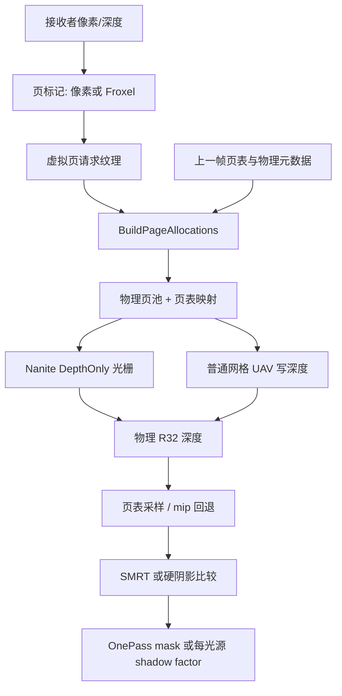
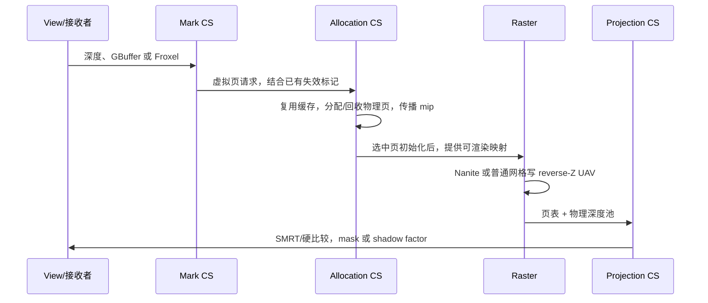

# 第 23 章：Virtual Shadow Maps，从按需页到软阴影

[返回目录](../README.md) · [本章答案](../appendices/answers/23-virtual-shadow-maps.md) · [一帧总览](00-frame-overview.md)

> **版本与范围：**UE 5.7.4，CL 51494982，Windows、D3D12、SM6，桌面延迟渲染。配置 B 启用 Substrate Blendable GBuffer、Nanite、Lumen 软件追踪和 Virtual Shadow Maps（VSM），关闭硬件光追与 MegaLights。P 是不透明红方块，Q 是覆盖在其上的蓝色 Unlit 透明片。本文只静态阅读本地源码，没有启动工程、抓 GPU 计时或声称某显卡实测结果。

> **证据边界：**`[源码已确认]` 指本地源码中的实现和条件，以下有源码链接的实现描述均属于这一范围；`[教学简化]` 指坐标、容量和光照算例；`[尚未验证]` 指实验步骤、视觉预期及尚未执行的运行检查。CVar 的“注册初值”可能被 Scalability、项目配置、设备配置或启动命令覆盖，不是当前运行值。

## 23.1 学习目标与前置知识

读完本章，应该能够：

1. 区分虚拟页、物理页、页表和请求标记，解释为什么 16K 虚拟分辨率不等于每帧分配 1 GiB。
2. 描述页请求、缓存更新、分层 mip、Nanite/普通网格光栅和阴影投影之间的依赖。
3. 解释方向光 clipmap 与局部光 mip 的差别，以及 One Pass Projection 何时复用结果。
4. 计算 reverse-Z 阴影深度比较和一个简单 SMRT 阴影因子。
5. 设计能区分缓存命中、几何失效、页池溢出和 SMRT 噪声的可重复实验。

第 15 章的传统阴影贴图通常为光源的适用投影视图建立固定大小的深度目标，再在目标中写入可见深度。VSM 保留“从光源方向记录遮挡深度”的物理目的，却把目标拆成按需映射的虚拟页：接收者请求可能需要采样的区域，页表再把虚拟地址指向物理池。VSM 是 **Virtual Shadow Maps（虚拟阴影贴图）**的缩写；名字中的 Virtual 修饰存储和寻址组织，没有取消遮挡体光栅或深度比较。

前置知识是第 02 章坐标变换、第 03 章深度、第 05 章资源与缓存、第 09 章 RDG、第 13 章 HZB、第 15～16 章阴影与直接光，以及第 22 章 Nanite。读本章时随时把“相机看见什么”和“光源到接收者之间挡着什么”分开：相机视图深度用来找接收者，阴影视图深度用来找遮挡体，两张图的坐标和最近方向不能互换。

实验仍采用摄像机、地面、红方块、金属球、蓝片、可移动方向光和点光源。B 的材质为 Blendable、单 Closure；Lumen 采用软件追踪，旧 clustered deferred 运行路径关闭，硬件光追和 MegaLights 关闭。灯光仍需要 Cast Shadows 等资格。B 的具体设置以[配置基线](../appendices/configuration.md)为准，不把后文的附加测试当成基线默认。

## 23.2 八维定位：VSM 在帧图中的位置

| 维度 | 本章回答 |
|---|---|
| 作用 | 为方向光和局部光提供可缓存、可按页分配的遮挡深度，并生成每像素阴影因子 |
| 原因 | 传统整张阴影图的分辨率、视野和缓存更新成本难以同时满足大场景需求 |
| 输入 | 光源投影、SceneDepth/GBuffer、接收者像素、投射体几何、Nanite 数据、上一帧页表与缓存 |
| 过程 | 标记页请求 → 分配/回收物理页 → 清空脏页 → 以 Nanite 或普通网格写 reverse-Z 深度 → 采样并过滤 |
| 输出 | 页表、物理深度池、页统计、屏幕阴影因子或 One Pass mask bits |
| 实现 | `FShadowSceneRenderer::BeginMarkVirtualShadowMapPages`、`BuildPageAllocations`、`RenderVirtualShadowMaps`、`RenderVirtualShadowMapProjection` |
| 条件 | `UseVirtualShadowMaps`、平台原子 UAV 能力、项目 Nanite 支持、对应光源/材质/ShowFlag 和 CVar |
| 成本与误区 | 页标记、实例剔除、物理页写入、过滤和失效都有成本；“虚拟”不代表零内存，“缓存”不代表零绘制 |

**[源码已确认]**`UseVirtualShadowMaps` 要求 `r.Shadow.Virtual.Enable` 且 `DoesRuntimeSupportNanite(..., true /* atomics */, true /* project setting */)`，见 [RenderUtils.cpp:1426](G:/UnrealEngineInstalled/UE_5.7/Engine/Source/Runtime/RenderCore/Private/RenderUtils.cpp:1426)。这表示平台能力与项目支持依赖 Nanite/原子写入；它不要求场景中的每个网格都启用 Nanite，也不等于启用 HWRT。普通网格是否进入 VSM 由 `r.Shadow.Virtual.NonNaniteVSM` 和对应绘制分支另外决定，[RenderUtils.cpp:1443](G:/UnrealEngineInstalled/UE_5.7/Engine/Source/Runtime/RenderCore/Private/RenderUtils.cpp:1443)。

## 23.3 三个地址：虚拟页、物理页、页表

### 23.3.1 常量和容量

| 维度 | 地址与存储阶段的回答 |
|---|---|
| 作用 | 把光源投影中的高分辨率逻辑地址映射到有限物理深度存储 |
| 原因 | 相机当前可能只需要一小部分阴影图，而固定整图必须为没有需求的区域也预留像素 |
| 输入 | 阴影图 ID、clipmap/mip 级、虚拟 texel、页表和物理池尺寸 |
| 过程 | 取页坐标和页内坐标，解码映射/有效位，必要时按 LOD offset 查粗级数据 |
| 输出 | 物理页坐标、物理 texel 地址、有效性和实际采样层级 |
| 实现 | `FShadowPhysicalPage`、`ShadowDecodePageTable`、`VirtualToPhysicalTexelBase` |
| 条件 | 对应页存在有效映射；直接写入还要求本级可渲染 |
| 成本与误区 | 页表读取和元数据占空间；相邻虚拟页不保证在物理池相邻，不能跨边界盲目线性采样 |

**Virtual Page（虚拟页）**是一小块光源投影区域的名字，包含阴影图、级别和二维页坐标。**Physical Page（物理页）**是显存池中真正能放深度的固定槽位。**Page Table（页表）**记录两者的对应关系。可以把它类比为“图书编号到书架位置”的目录，但必须补上技术区别：本系统由 GPU Shader 批量读写映射，并在 RDG 中安排依赖，不是每个像素请求 CPU 分配一次显存。

**Resident（驻留）**在本章表示已有可用物理存储；**Valid（有效）**还要求保存的内容与当前场景和用途匹配；**Dirty/Invalidated（脏页/失效）**表示需要更新某部分深度。一个槽位已经分配，并不能证明其中上一帧的影子仍正确。

`VirtualShadowMapDefinitions.h` 定义 `VSM_LOG2_PAGE_SIZE=7`、页边长 128、最大 mip 数 8，虚拟基础级边长为 16384，[定义:13](G:/UnrealEngineInstalled/UE_5.7/Engine/Shaders/Shared/VirtualShadowMapDefinitions.h:13)。一个 R32_UINT 页若只按 128×128 深度像素计算，占 `128×128×4=65536 B=64 KiB`；默认最大物理页数是 2048，[VirtualShadowMapArray.cpp:97](G:/UnrealEngineInstalled/UE_5.7/Engine/Source/Runtime/Renderer/Private/VirtualShadowMaps/VirtualShadowMapArray.cpp:97)。因此单层粗略深度容量约 `2048×64 KiB=128 MiB`，还不包括静态/动态双层数组、元数据、HZB、页表和对齐。

**[教学简化]**如果 16384×16384 基础级全部常驻，像素数是 268,435,456，R32 深度约 1 GiB；实际只映射被请求的页。八级完整 mip 的页数是 `16384²/128² + 8192²/128² + ... + 128²/128² = 16384+4096+1024+256+64+16+4+1=21845`，这是虚拟地址空间的页数，不是物理池必须同时拥有的页数。

### 23.3.2 地址转换算例

虚拟 texel `(517,259)` 的页地址是 `(517>>7,259>>7)=(4,2)`，页内坐标是 `(5,3)`。若页表把该虚拟页映射到物理页 `(10,7)`，物理 texel 为 `(10×128+5,7×128+3)=(1285,899)`。Shader 的 `VirtualToPhysicalTexelBase` 使用相同的右移和页内掩码，[PageAccessCommon.ush:293](G:/UnrealEngineInstalled/UE_5.7/Engine/Shaders/Private/VirtualShadowMaps/VirtualShadowMapPageAccessCommon.ush:293)。

页表值还携带有效位和层级偏移：`0x40000000` 表示本级可用于渲染，`0x80000000` 表示某个 mip 有有效映射；层级指针的 LOD offset 放在 `[20:25]`。因此“页表有非零值”不能简单解读为“本级深度可渲染”。[编码与解码](G:/UnrealEngineInstalled/UE_5.7/Engine/Shaders/Private/VirtualShadowMaps/VirtualShadowMapPageAccessCommon.ush:245)

例如某细页没有单独分配，页表可以指向一个粗级页供查询，却不能把这条指针当成“允许将细级投影的像素写进粗页”。若不区分写入资格和采样资格，不同投影密度会污染同一存储。源码给粗层级指针编码时明确不设置可渲染位，[S23-17](#s23-17)。

物理池可被许多灯光共同使用。点光的六个面、方向光的多个 clipmap、当前帧和仍保留的缓存共同竞争预算；不能把 2048 页理解成“每一盏灯各有 2048 页”。反过来，物理池中看似邻接的两块区域也可能属于完全不同的光源。调试物理纹理时，必须同时查看页表和元数据，单看 R32 图像不能恢复完整光源投影。

## 23.4 方向 clipmap 与局部 mip

| 维度 | 投影视图阶段的回答 |
|---|---|
| 作用 | 为近远接收者选合适的光源投影范围与采样密度 |
| 原因 | 方向光需要覆盖观察者周围的大范围；局部光需要覆盖有限锥体或立方体面 |
| 输入 | 方向/位置、光源类型、观察者位置、FOV、分辨率、LOD bias 和 clipmap 配置 |
| 过程 | 方向光建立多级对齐正交投影；局部光建立面视图及虚拟 mip 级别 |
| 输出 | 每个阴影视图的矩阵、逻辑页范围和采样层级参数 |
| 实现 | `FVirtualShadowMapClipmap`、`GetLevelRadius`、`GetRenderViewCount` |
| 条件 | 对应光源选择 VSM；级别、coarse 页和 LOD 模式依配置而变 |
| 成本与误区 | 每一级/面都可能增加请求和实例投影；17 个 clipmap 不等于 17 张全常驻 16K 深度纹理 |

方向光没有有限的光源位置，UE 以围绕观察者的多个正交 clipmap 覆盖近远范围。全局 CVar 默认 FirstLevel=6、LastLevel=22，共 17 个逻辑级别；每增加一级，覆盖范围大致翻倍，[Clipmap.cpp:44](G:/UnrealEngineInstalled/UE_5.7/Engine/Source/Runtime/Renderer/Private/VirtualShadowMaps/VirtualShadowMapClipmap.cpp:44)。`GetLevelRadius(L)=2^(L+1)`，所以 level 6 的覆盖半径模型值为 128（单位跟随世界单位），实际投影还要为 snapping 和边界留余量，[Clipmap.cpp:157](G:/UnrealEngineInstalled/UE_5.7/Engine/Source/Runtime/Renderer/Private/VirtualShadowMaps/VirtualShadowMapClipmap.cpp:157)。视图中心按 `SnapSize=RawLevelRadius` 对齐网格，减少相机微动造成的整张页抖动，[Clipmap.cpp:345](G:/UnrealEngineInstalled/UE_5.7/Engine/Source/Runtime/Renderer/Private/VirtualShadowMaps/VirtualShadowMapClipmap.cpp:345)。

局部点光/聚光灯使用有限投影，并为每个局部虚拟阴影图建立最多 8 个 mip。点光 One Pass 的六个面由 `GetRenderViewCount` 返回 6 个 primary views；普通局部光为 1 个 view，mip 数仍为 `FVirtualShadowMap::MaxMipLevels`，[VirtualShadowMapArray.cpp:3697](G:/UnrealEngineInstalled/UE_5.7/Engine/Source/Runtime/Renderer/Private/VirtualShadowMaps/VirtualShadowMapArray.cpp:3697)。`r.Shadow.Virtual.MarkPixelPagesMipModeLocal=1/2` 可选择四个高/低分辨率 mip，默认 0 使用全部 8，[VirtualShadowMapArray.cpp:317](G:/UnrealEngineInstalled/UE_5.7/Engine/Source/Runtime/Renderer/Private/VirtualShadowMaps/VirtualShadowMapArray.cpp:317)。这改变请求和绘制预算，不表示虚拟图只剩四级。

这里的点光 `bOnePassPointLightShadow` 是六面阴影视图的组织标志，不是 23.8 的“屏幕局部灯 One Pass Projection”。两个名字都带 One Pass，作用对象却不同：前者有关点光方向覆盖，后者有关多个局部灯的屏幕阴影计算。

**[教学简化]**局部光的完整尺寸序列为 `16384、8192、4096、2048、1024、512、256、128`。同一物体远离相机、在屏幕上的投影变小后，通常不需要维持最细采样密度；选更粗 mip 可以减少页和实例重复。它们仍表示同一光源投影中的深度，不能简单按颜色贴图做平均来生成，因为平均两个遮挡深度不一定仍是正确的最近遮挡体。

clipmap 则是多个不同范围的投影，普通方向 clipmap 每级只使用一个 mip，见 `GetRenderViewCount` 的第一个分支。它与第 15 章 CSM 都有“近处细、远处粗”的目标，但不能直接套用 CSM 按相机视锥切 split 的分配公式。阅读 Shader 时先判断此处的 level 是 clipmap 绝对级、相对数组索引，还是局部光 mip。

对于 level 6，本版 `RawLevelRadius=128`，`HalfLevelDim=2×128=256`，这一段正交投影全宽为 512 世界单位；level 7 对应 raw radius 256、全宽 1024。若采用 UE 常规厘米单位，数值分别是 1.28 m 覆盖半径参数和 5.12 m 投影全宽。这里明确分开了覆盖半径与为中心 snapping 扩大的投影范围，不能引用“level 6 半径 64 cm”的旧版本口径。[S23-18](#s23-18)

方向光 `ResolutionLodBiasDirectional=-1` 表示分辨率倾向加倍，`+1` 表示减半。对固定二维覆盖范围，线性密度翻倍可能把基础需求推到约四倍，但真实页数还受遮挡、边界、视图和层级选择影响。这个符号非常容易弄反：页压力大时，向更正的方向增加 bias 才是降低这项分辨率，不应照抄含糊的 overflow 提示作反向调节。[S23-19](#s23-19)

下面是 **[教学简化]** 的资源依赖图。箭头表示数据依赖，不表示每个框都单独产生一次 CPU 等待，也不表示该图覆盖所有特殊光源、头发和水体分支。

[打开页请求到阴影因子的静态图](../assets/diagrams/23-virtual-shadow-maps-1.png)



## 23.5 一帧：请求、分配、清空、写入

| 维度 | 请求与分配阶段的回答 |
|---|---|
| 作用 | 判断哪些虚拟页需要可查询深度，并使它们获得正确的物理映射 |
| 原因 | 接收需求随相机和灯光变化；有限物理槽位必须复用、回收或分配 |
| 输入 | 深度/接收者、灯光网格、coarse 规则、上一帧映射、失效标记和可用页列表 |
| 过程 | 标记请求，更新已有页，分配新映射，生成层级标记，传播粗级指针，初始化选中页 |
| 输出 | 本帧页表、页状态、物理元数据和间接初始化/绘制所需列表 |
| 实现 | `BeginMarkPages`、`GeneratePageFlagsFromPixels`、`BuildPageAllocations` 和页管理 Compute Shader |
| 条件 | VSM 启用且存在阴影图；Froxel、前层透明、水和头发有各自分支 |
| 成本与误区 | 请求归并、列表整理和清页占带宽；没有物理槽位时不能保证所有需求仍有高质量阴影 |

### 23.5.1 请求不只来自屏幕像素

默认 `r.Shadow.Virtual.MarkPixelPages=1`，在深度/GBuffer 像素上生成请求。若 `r.Shadow.Virtual.MarkPagesUsingFroxels=1` 且 Froxel 数据已启用，`GeneratePageFlagsFromFroxelsCS` 取每个约 8×8 像素 Froxel 中心来标记，源码说明这是近似但有更高吞吐的实验路径，[VirtualShadowMapArray.cpp:62](G:/UnrealEngineInstalled/UE_5.7/Engine/Source/Runtime/Renderer/Private/VirtualShadowMaps/VirtualShadowMapArray.cpp:62)，分支位置见 [VirtualShadowMapArray.cpp:2761](G:/UnrealEngineInstalled/UE_5.7/Engine/Source/Runtime/Renderer/Private/VirtualShadowMaps/VirtualShadowMapArray.cpp:2761)。这就是为什么页请求不是“只看摄像机可见投射体”：一个屏幕接收者需要光源视线上的远处遮挡体，投射体本身可以在相机外。

方向 clipmap 还可标记 coarse pages；局部光默认 `r.Shadow.Virtual.MarkCoarsePagesLocal=2`，性能模式会抑制由移动、WPO、动画引起的动态失效，[VirtualShadowMapArray.cpp:327](G:/UnrealEngineInstalled/UE_5.7/Engine/Source/Runtime/Renderer/Private/VirtualShadowMaps/VirtualShadowMapArray.cpp:327)。`r.Shadow.Virtual.NonNanite.IncludeInCoarsePages=1` 默认把普通网格纳入粗页；关闭可省大粗页绘制，但可能减少低分辨率回退覆盖，[VirtualShadowMapArray.cpp:337](G:/UnrealEngineInstalled/UE_5.7/Engine/Source/Runtime/Renderer/Private/VirtualShadowMaps/VirtualShadowMapArray.cpp:337)。

这里的 `MarkCoarsePagesLocal=2` 特指 coarse 页性能规则，不会把所有细页上运动物体的失效都关闭。粗页让普通可见表面之外的适用消费者也能找到低分辨率数据，并给部分回退提供覆盖；它不能保证所有动态小物体在粗级上每帧准确出现。B 的基本场景没有额外雾，教材仍保留这个机制，避免在加雾或改变透明受光模式时误以为 VSM 只有不透明接收者请求。

Shader 从设备深度重建接收者位置，再分别调用方向光和局部光的页标记逻辑。多个屏幕像素可能投到同一页，页标记把它们归并；同一接收者也可能向多个灯光请求页。因而“屏幕上 1000 个阴影像素”既不是 1000 个物理页，也不是 1000 个投射体 Draw Call。[S23-20](#s23-20)

**Receiver Mask（接收者掩码）**进一步描述一页里哪些子区域当前有需求。本版共享定义的页内 receiver mask 分辨率为 8×8；它允许阴影剔除更贴近接收者分布，而不是只知道整页“有/无”。这份信息也改变缓存策略，详见 23.9，不能把它与屏幕最终 Shadow Mask 混为一个纹理。[S23-02](#s23-02)

调度上，coarse 标记必须先完成，因为这一步的写法不是与后续像素标记可随意重叠的原子合并。C++ 在加入后续像素任务前安排 coarse pass，并明确说明不能重叠。[S23-21](#s23-21) 同样，Froxel 页标记虽然名称和第 18 章体积雾 froxel 相似，不能据此宣称它就是体积雾散射纹理；本处是在主视图 HZB 生成过程得到的接收者空间分组。

### 23.5.2 物理池不是“申请 CVar 页数”这么简单

初始化时，代码把物理池 X 方向页数取为平台最大纹理宽度除以 128，并要求它是 2 的幂；Y 方向按请求最大页数向上取整，最终 `MaxPhysicalPages=X×Y`，[VirtualShadowMapArray.cpp:885](G:/UnrealEngineInstalled/UE_5.7/Engine/Source/Runtime/Renderer/Private/VirtualShadowMaps/VirtualShadowMapArray.cpp:885)。所以用户指定的最大页数可能因行宽向上取整而增加；上面的 2048 页算例假定最终实际容量也为 2048。启用缓存时 `StaticCachedArrayIndex=1`，池数组通常有静态和动态两层；可视化 Nanite overdraw 还会预留第三层，[VirtualShadowMapArray.cpp:895](G:/UnrealEngineInstalled/UE_5.7/Engine/Source/Runtime/Renderer/Private/VirtualShadowMaps/VirtualShadowMapArray.cpp:895)。

`SetPhysicalPoolSize` 创建 `PF_R32_UINT` 的 2D array，并使用 ShaderResource、UAV、AtomicCompatible 标志；若平台支持且 CVar 开启，还会使用 ReservedResource/ImmediateCommit 提示，让 RHI 更适合分散的小块显存分配，[CacheManager.cpp:1137](G:/UnrealEngineInstalled/UE_5.7/Engine/Source/Runtime/Renderer/Private/VirtualShadowMaps/VirtualShadowMapCacheManager.cpp:1137)。这是资源分配提示，不等同于页表虚拟映射本身。改变尺寸、数组层数、最大页数或 flags 会重建资源并丢弃缓存，[CacheManager.cpp:1147](G:/UnrealEngineInstalled/UE_5.7/Engine/Source/Runtime/Renderer/Private/VirtualShadowMaps/VirtualShadowMapCacheManager.cpp:1147)。

### 23.5.3 分配与溢出

`BuildPageAllocations` 先读取上一帧缓存是否可用，再更新页状态、生成层级标记、传播 coarse mip 映射，最后选择并清空需要初始化的物理页，[VirtualShadowMapArray.cpp:2844](G:/UnrealEngineInstalled/UE_5.7/Engine/Source/Runtime/Renderer/Private/VirtualShadowMaps/VirtualShadowMapArray.cpp:2844)、[2970](G:/UnrealEngineInstalled/UE_5.7/Engine/Source/Runtime/Renderer/Private/VirtualShadowMaps/VirtualShadowMapArray.cpp:2970)。GPU 分配函数从 AVAILABLE 列表弹出物理页；若页已绑定旧虚拟地址，会先清旧页表，再写新映射和元数据，[PhysicalPageManagement.usf:425](G:/UnrealEngineInstalled/UE_5.7/Engine/Shaders/Private/VirtualShadowMaps/VirtualShadowMapPhysicalPageManagement.usf:425)。没有可用物理页时，该请求没有物理 backing，源码把它作为 overflow 条件，可能产生缺失阴影，[物理页耗尽分支](G:/UnrealEngineInstalled/UE_5.7/Engine/Shaders/Private/VirtualShadowMaps/VirtualShadowMapPhysicalPageManagement.usf:483)。

页面状态至少要区分：已映射、静态缓存有效、动态缓存有效、本帧请求、被失效、刚分配需清空。缓存命中仍可能需要页表查找、请求归并、层级传播和投影采样；新页还要清零和光栅。不要把“allocated”统计当成“本帧重画像素数”。

物理页列表包括保留使用顺序的 LRU、可分配 AVAILABLE、空闲 EMPTY 与本帧 REQUESTED 等集合。**LRU（Least Recently Used）**表示按近期使用状况组织回收，不是要求所有场景严格复现教科书里逐项维护的 CPU 双向链表；这里由 Shader 维护批量列表、计数和元数据。[S23-22](#s23-22)

**[教学简化]**假设共享池只有 8 个逻辑槽位，上帧 A～F 占 6 个，本帧继续需要 A～D，又新请求 G、H、I。如果 E/F 已符合可回收条件，可以先把旧映射清掉，再把槽位交给新页。A～D 的内容也只有在未失效时才可直接复用。若同一时刻有效需求超过可支持的槽位，单纯存在回收算法并不能创造容量；不能假设系统必定在采样前无损补齐所有页。

初始化也不是每帧把整个池清零。代码先选出要初始化的页并生成间接参数；静态内容有效时，动态页可从静态层复制作为起点，否则选中的页清为 `0U`。随后可以只加入该帧的动态遮挡体。这样既避免重画静态内容，又保留 reverse-Z 的合并规则。[S23-23](#s23-23)

### 23.5.4 与主帧调度的连接

本书的普通桌面延迟主线在尚未提早渲染阴影且 VSM 启用时，准备前层透明数据、调用 `BeginMarkVirtualShadowMapPages`，稍后调用 `RenderShadowDepthMaps`。`FShadowSceneRenderer::RenderVirtualShadowMaps` 先调用 `BuildPageAllocations`，再进入真正的 VSM 渲染，见 [S23-24](#s23-24)。前层函数存在不表示当前 Unlit 蓝片一定产生相关深度或参与该功能，必须继续看它的资格。

这些都是 CPU 构造 RDG 工作的调用顺序。Compute 标记、页更新和光栅通过资源依赖排序，由 RHI 提交给 GPU；`BuildPageAllocations` 返回不代表 GPU 已完成所有页分配。默认主线还会利用 Base Pass 后的表面信息，不能把第 15 章某个“早画传统阴影”的时间位置无条件套给 VSM。MegaLights 另有在标页之前生成样本的调度，B 关闭它，详见后续对照章节。

## 23.6 两条写入路径：Nanite 与普通网格

| 维度 | 阴影光栅阶段的回答 |
|---|---|
| 作用 | 把可能挡住灯光的几何转成所需物理页的最近深度 |
| 原因 | 页表只告诉我们存在哪里，不能代替物体的遮挡形状 |
| 输入 | 阴影视图、页标记、实例与簇/网格命令、材质裁剪、适用阴影 HZB |
| 过程 | 根据页需求剔除几何，选择阴影 LOD，执行 Nanite 光栅或普通网格 VSM Shader |
| 输出 | 物理池动态/静态层中的 reverse-Z 深度，以及适用 HZB |
| 实现 | `RenderVirtualShadowMapsNanite`、`RenderVirtualShadowMapsNonNanite`、`ShadowDepthPixelShader` |
| 条件 | 两条几何路径分别受 Nanite 和 NonNaniteVSM 条件控制，完全缓存页可跳过重绘 |
| 成本与误区 | 网格覆盖的视图/页数、材质遮罩和 WPO 会增加成本；相机不见的几何仍可能投影到阴影页 |

VSM 内部渲染在页分配后进行。Nanite 路径以 `Nanite::InitRasterContext(...DepthOnly..., PhysicalPagePoolRDG)` 建立深度-only 光栅上下文，再创建带 shadow pass、可选 HZB 两遍遮挡剔除的 Nanite renderer，[VirtualShadowMapArray.cpp:3812](G:/UnrealEngineInstalled/UE_5.7/Engine/Source/Runtime/Renderer/Private/VirtualShadowMaps/VirtualShadowMapArray.cpp:3812)、[3904](G:/UnrealEngineInstalled/UE_5.7/Engine/Source/Runtime/Renderer/Private/VirtualShadowMaps/VirtualShadowMapArray.cpp:3904)。它使用 Nanite 的实例、簇和 LOD 数据，并将深度写入共享物理池。

普通网格使用 VSM shadow depth shader。材质裁剪/WPO/Opacity Mask 仍需在适用 shadow shader 中求值；这不代表透明材质自动成为透明遮挡体。普通 VSM 的目标写入不是第 15 章“深度测试后保留最近值”的固定状态：VSM 状态为深度写入关闭、`CF_Always`，[ShadowDepthRendering.cpp:738](G:/UnrealEngineInstalled/UE_5.7/Engine/Source/Runtime/Renderer/Private/ShadowDepthRendering.cpp:738)。像素 Shader 解码页地址后，使用 `InterlockedMax(UAV, asuint(DeviceZ))` 写物理 R32 页，[ShadowDepthPixelShader.usf:105](G:/UnrealEngineInstalled/UE_5.7/Engine/Shaders/Private/ShadowDepthPixelShader.usf:105)。因为这里是 reverse-Z，较大的有效 DeviceZ 表示更靠近光源的遮挡深度；不能套用传统 LessEqual/clear=1 的直觉。

**UAV（Unordered Access View，无序访问视图）**允许 Shader 按地址写资源。多个三角形可能同时覆盖一个物理 texel，普通赋值会受并发覆盖顺序影响。`InterlockedMax` 原子地保留最大值；有效非负浮点深度的 `asuint` 位表示保持这种大小顺序，写入后用 `asfloat` 还原。它是把浮点位解释为整数来做原子比较，没有把 `0.7` 数值强转成整数 0。

**[教学简化]**同一 texel 从清零开始依次接收 `0.25、0.70、0.40`，最大值为 `0.70`，改变提交先后也保留同样的最大值。若分别来自静态层 `0.70`、动态层 `0.40`，合并仍取 `max=0.70`；它不是把两种阴影深度相加得到 `1.10`。阴影图存可见深度，只有之后的受光阶段才会把不同灯光能量相加。

Nanite 的阴影上下文采用自己的簇剔除和光栅流程。不能因为普通网格 Pixel Shader 有这行原子写入，就推断 Nanite 的所有硬件/软件光栅排列也逐行执行同一个入口。两条路径的可靠交点是同一物理深度池和页语义，源码内部调度分别检查是否有 Nanite pass，以及 NonNaniteVSM 是否启用。[S23-25](#s23-25)

这里的 HZB 是阴影物理页深度的层级遮挡数据。Nanite 复用旧阴影 HZB 时，还要求上一帧页表可用，才能把旧资源和当前虚拟坐标正确关联；不是直接拿主相机 HZB 删除所有屏幕外投射体。普通网格也有实例剔除和适用 HZB 测试，随后构建光栅 pass。[S23-26](#s23-26)

因此优化时要同时看几何数量和覆盖范围：一个覆盖很多光源面或 coarse 页的大网格可能产生大量工作，很多小实例也会产生剔除和调度成本。Nanite 能减少细粒度几何处理的浪费，但页更新、材质裁剪和 SMRT 投影仍然存在。静止地面并不能抵消另一批每帧改变形状的投射体带来的动态成本。

## 23.7 采样、mip 回退和 SMRT

| 维度 | 投影与过滤阶段的回答 |
|---|---|
| 作用 | 在当前接收者处把光源深度转换为阴影可见比例 |
| 原因 | 深度页仍在光源投影中，直接光照需要每个相机像素的遮挡因子 |
| 输入 | SceneDepth、法线/表面信息、灯光参数、虚拟页表、物理深度、采样噪声和 SMRT 设置 |
| 过程 | 重建位置，选 clipmap/mip，查询深度；做单次比较或多方向图像追踪，过滤并输出 |
| 输出 | 单灯 Shadow Factor，或为多个局部灯打包的 Mask Bits |
| 实现 | `ProjectLight`、`SampleVirtualShadowMap`、`TraceDirectional`、`TraceLocalLight` |
| 条件 | 灯光和接收者有效；RayCount>0 才走 SMRT，OnePass 和每灯输出独立选择 |
| 成本与误区 | 灯光重叠、ray/step 数、半影和缺页改变成本；阴影因子不是最终表面 RGB |

采样器先把虚拟 UV 换为 texel，查询页表；若本级映射存在，就从物理池 `Load` R32 深度。层级页表可把请求转向较粗 mip，返回 `LODOffset`，[ProjectionCommon.ush:141](G:/UnrealEngineInstalled/UE_5.7/Engine/Shaders/Private/VirtualShadowMaps/VirtualShadowMapProjectionCommon.ush:141)。缺页返回 `bValid=false`，不应当直接等同于“深度为 0 的无遮挡”；投影代码需要依照回退和有效性处理。

硬阴影的教学比较：采样到遮挡深度 `0.7`，接收者参考深度 `0.4`，忽略 bias 时 `0.7>0.4`，判定命中遮挡；清零页的 0 不表示有一个近处遮挡体。真实 Shader 还会应用 normal/slope bias 和 clipmap 边界规则。

**SMRT（Shadow Map Ray Tracing）是阴影图上的多样本追踪，不是 HWRT BVH 三角形追踪。**局部和方向光 ray count 的注册初值都是 7，每条 ray 的 samples 初值为 8，[局部光参数](G:/UnrealEngineInstalled/UE_5.7/Engine/Source/Runtime/Renderer/Private/VirtualShadowMaps/VirtualShadowMapArray.cpp:590)、[方向光参数](G:/UnrealEngineInstalled/UE_5.7/Engine/Source/Runtime/Renderer/Private/VirtualShadowMaps/VirtualShadowMapArray.cpp:637)。模板按射线在阴影图中的深度采样，第一次有效样本做比较，后续可用深度斜率外推；找不到命中则返回 miss，[SMRTTemplate.ush:26](G:/UnrealEngineInstalled/UE_5.7/Engine/Shaders/Private/VirtualShadowMaps/VirtualShadowMapSMRTTemplate.ush:26)。**[教学简化]**7 条射线中 3 条 miss 的因子是 `3/7≈0.4286`，实际还会受到无效页、早停、滤波和自阴影 bias 影响。

增大 `MaxRayAngleFromLight` 会扩大半影覆盖但增加噪声；增大 ExtrapolateMaxSlope 可使边缘更软，也可能在第二遮挡体后漏光，[VirtualShadowMapArray.cpp:604](G:/UnrealEngineInstalled/UE_5.7/Engine/Source/Runtime/Renderer/Private/VirtualShadowMaps/VirtualShadowMapArray.cpp:604)。SMRT 的采样数量是质量/成本旋钮，不会补回深度图没有记录的背面几何。

### 23.7.1 接收者的位置怎样进入查询

主投影 Shader 读取 SceneDepth 的设备深度，转换出场景深度，再从像素中心和 DeviceZ 重建 TranslatedWorldPosition；随后取得表面信息，传给 `ProjectLight`。[S23-27](#s23-27) 对 P 来说，这仍是红方块表面的位置；VSM 不会从阴影图反推出方块的 Base Color，也不会替 Substrate 求 BSDF。

**Shadow Factor（阴影因子）**在这里可先理解为 0 表示完全遮挡、1 表示不遮挡，中间值表示过滤后的部分可见程度。第 16 章再把它与该灯的衰减、颜色和表面响应结合。使用这个因子之后，场景仍可有其他灯、Lumen 间接光和自发光，因此 `ShadowFactor=0` 不代表最终像素一定是 `(0,0,0)`。

投影还存在法线偏移、深度偏移和适用的短屏幕追踪修正，它们解决接收面精度、自阴影等问题。把 bias 调得很大可能减少 acne，却把阴影从接触处推开或漏光；提高虚拟分辨率只是影响采样精度的一种办法，不能把所有接触异常都当成页尺寸问题。

### 23.7.2 软阴影为什么要多条方向

有面积的光源在某个表面点可能只被遮挡一部分。**Umbra（本影）**表示所有相关光源方向都被挡住；**Penumbra（半影）**表示只有部分方向被挡住。方向光的 Source Angle、局部光的 Source Radius 会改变这些方向的分布和半影范围；ray count 控制估计这份可见比例时有多少样本，两者不能互相替代。

**[源码已确认]**方向 SMRT 的射线方向构造使用圆盘采样和 `Light.SourceRadius` 参数，之后为每条射线调用 `SMRTRayCast`，以实际追踪的 miss 数除以 ray 数得到因子。[S23-28](#s23-28) 在投影的方向/局部分支，`GetSMRTRayCount()>0` 才追踪，否则仍调用对应 `SampleVirtualShadowMap...`；设 0 是关闭软阴影追踪，不是关闭灯光的 VSM。[S23-29](#s23-29)

可以把 SMRT 看成沿一条偏离中央光方向的候选路径，在光源深度表示里询问“这里是否遇到遮挡”。它没有遍历场景的 HWRT 加速结构，也没有保证每次比较都拿到真实三角形交点。深度图通常只保留从原投影方向看到的最前层；沿偏斜路径看去时需要的后层信息可能根本不存在。模板通过深度历史和斜率外推缓解这一限制，但外推是一种近似，不能恢复未记录的场景拓扑。

### 23.7.3 数量与性能不能机械相乘

注册值 RayCount=7、SamplesPerRay=8 可以帮助比较设置规模，却不能直接声称“每像素每灯恰好做 56 次纹理读取”。模板循环是 `i<=NumSteps`，包含终端样本；命中可提早返回，波内适应性逻辑可减少 ray 数，clipmap/点光面切换和有效页查询又会影响实际采样。[S23-11](#s23-11)

全亮或全暗区域经常比半影更容易提前确定结果。更大光源、复杂接触和多灯重叠会扩大需要仔细估计的区域。增加 ray 数主要降低可见比例估计的随机波动，增加每 ray 的采样主要改善路径覆盖；两者都增加工作，却解决不同的误差。测试时固定 Source Radius/Angle，再一次只改一个变量，才知道改善来自哪一步。

## 23.8 One Pass Projection 与每光源投影

`r.Shadow.Virtual.OnePassProjection` 默认 1。若数组已分配、ShowFlag 未处于 VSM 可视化且当前光照需要 One Pass，Renderer 先为局部光建立 mask bits；方向光仍走每个 clipmap 的完整投影，[ShadowSceneRenderer.cpp:939](G:/UnrealEngineInstalled/UE_5.7/Engine/Source/Runtime/Renderer/Private/Shadows/ShadowSceneRenderer.cpp:939)、[1089](G:/UnrealEngineInstalled/UE_5.7/Engine/Source/Runtime/Renderer/Private/Shadows/ShadowSceneRenderer.cpp:1089)。局部光随后从 mask bits 合成；关闭 One Pass 则逐光源输出 shadow factor，[ShadowSceneRenderer.cpp:1111](G:/UnrealEngineInstalled/UE_5.7/Engine/Source/Runtime/Renderer/Private/Shadows/ShadowSceneRenderer.cpp:1111)。

One Pass 的输出预算由 `MaxLightsPerPixel` 限制，默认 16，实际再限制到 32，[VirtualShadowMapArray.cpp:391](G:/UnrealEngineInstalled/UE_5.7/Engine/Source/Runtime/Renderer/Private/VirtualShadowMaps/VirtualShadowMapArray.cpp:391)、[931](G:/UnrealEngineInstalled/UE_5.7/Engine/Source/Runtime/Renderer/Private/VirtualShadowMaps/VirtualShadowMapArray.cpp:931)。超过预算不会简单地让所有后续灯光“永远没有阴影”：MaskBitsCommon 在找不到该灯的 packed index 时，会对该局部灯回退一次 `SampleVirtualShadowMapLocal`，[MaskBitsCommon.ush:16](G:/UnrealEngineInstalled/UE_5.7/Engine/Shaders/Private/VirtualShadowMaps/VirtualShadowMapMaskBitsCommon.ush:16)。这降低过滤质量并增加单灯查找成本。One Pass 也不等同于 clustered deferred；它是阴影投影组织方式，普通延迟光照仍可消费每光源结果。

把多个灯的阴影一起处理，主要是共享屏幕信息读取、灯光列表遍历和输出组织。它并不把七盏灯变成一盏灯，也不会免去每盏灯所需虚拟深度的生成。图中一个 Projection CS 框只是教学归纳，实际有不同视图、头发输入、方向光和局部光排列，不保证整帧恰好只有一次 Compute dispatch。

`VirtualShadowMapProjection.usf` 的 One Pass 分支读取经筛选的局部灯光网格，对预算以内的灯依次执行 `ProjectLight`、过滤、打包；同时检测预算溢出。B 关闭 MegaLights，不能把同文件中为 MegaLights 灯光安排的特殊退出条件解释成普通方向光支持或排除规则。[S23-30](#s23-30)

**[教学简化]**如果某个网格单元含 18 个符合条件的局部 VSM 灯，MaskBits 预算为 16，前 16 个可有预计算打包结果，其余灯在适用消费者中执行单次 VSM 回退。增加预算可能改善这种过滤退化，却增加输出带宽；降低光源重叠可能同时减少查询与物理页需求。实际名单顺序由灯光网格决定，不能假设“距离最近的 16 盏”就是源码保证。

VSM 可视化模式会让 `IsVSMOnePassProjectionEnabled` 返回 false，[S23-31](#s23-31)。可视化是观察机制的工具，切回普通 Lit 视图后才能比较正常路径性能。若截图中出现完整 per-light projection，先确认 ShowFlag，再判断是否是用户关闭 One Pass。

下面的图是 **[教学简化]** 的单帧依赖顺序，所有 GPU 阶段都经 RDG/RHI 记录与提交；它不是不同硬件队列的实际计时图。

[打开 VSM 单帧依赖静态图](../assets/diagrams/23-virtual-shadow-maps-2.png)



## 23.9 缓存：命中、失效和合并

| 维度 | 跨帧复用阶段的回答 |
|---|---|
| 作用 | 保留仍正确的遮挡深度，避免重复绘制，并更新已变化的部分 |
| 原因 | 大量静态场景不会每帧变化，但几何、灯光和需求都可能局部或整体变化 |
| 输入 | 旧页元数据、光源缓存键、实例变化/WPO、包围体、receiver mask 和保留年龄 |
| 过程 | 检查投影兼容性，按实例投影范围标记失效，区分静态/动态层，再初始化和合并选中页 |
| 输出 | 可继续使用的缓存深度、本帧 uncached 页和下一帧元数据 |
| 实现 | `FVirtualShadowMapPerLightCacheEntry`、`InvalidateInstancePages`、页更新与合并 Shader |
| 条件 | 缓存启用、旧资源/投影有效；receiver mask 和持续移动灯光会改变动态缓存策略 |
| 成本与误区 | 检查、复制与合并仍消耗带宽；强制 Static 不能保证移动/WPO 后的旧深度正确 |

### 23.9.1 静态和动态是缓存行为

缓存管理器将静态和动态页分开保存时，`ShouldCacheStaticSeparately()` 由 `StaticCachedArrayIndex>0` 判断，[VirtualShadowMapArray.h:386](G:/UnrealEngineInstalled/UE_5.7/Engine/Source/Runtime/Renderer/Private/VirtualShadowMaps/VirtualShadowMapArray.h:386)。动态几何变化可以只标记 dynamic uncached；静态页仍可复用。渲染后若存在分离数组，会执行 MergeStaticPhysicalPages，把静态内容与动态内容按页合并，[VirtualShadowMapArray.cpp:1754](G:/UnrealEngineInstalled/UE_5.7/Engine/Source/Runtime/Renderer/Private/VirtualShadowMaps/VirtualShadowMapArray.cpp:1754)。

真正合并采用 `max(dynamic,static)`，与前面的 reverse-Z 最近遮挡语义一致。[S23-23](#s23-23) 静态缓存不是 Lightmass 烘焙阴影，也不要求灯光 Mobility=Static；本书 Movable 灯光下没有变化的场景内容仍可利用 VSM 缓存。网格资产是 Static Mesh 也不表示它永远被归入静态缓存，WPO、变形、实例更新和缓存行为设置都参与判定。

本版 `Cache.FramesStaticThreshold` 注册初值为 100，说明对象在一段无失效帧数之后可以转入静态缓存；`Cache.MaxPageAgeSinceLastRequest` 控制未被当前帧请求的页可保留多久。这些是帧数策略，不保证所有页在指定帧数内必定有槽位保留，更不是“经过 100 秒变静态”。[S23-32](#s23-32)

### 23.9.2 Receiver Mask 为什么影响动态缓存

**[源码已确认]**本版 `r.Shadow.Virtual.UseReceiverMaskDirectional` 注册初值为 true。页更新 Shader 对使用 receiver mask 的投影设置 `VSM_FLAG_DYNAMIC_UNCACHED`，原因是按当前接收区域裁剪后的页可能不完整，下一帧接收者改变后不能把旧动态页当成完整深度页复用。[S23-33](#s23-33)

这样可以更积极地剔除本帧没有用的动态内容，但代价是所需动态部分需要更新。静态层仍可保留；因此“摄像机和物体静止后所有 VSM 页一定变绿”不是本版源码保证。可视化的蓝色正表示只静态部分缓存而动态部分未缓存。关闭显式动态失效收集，是因为该分支已经按这种规则重画动态部分，不是自动获得无限有效的动态缓存。

这也是缓存分析必须连条件看的例子：一种策略多存一些可复用完整页，另一种策略只画当前需要的区域，二者的页剔除与重画成本不同。不能只比较 invalidation 事件少了多少，就得出总 GPU 工作一定更少。切换 receiver mask 后，源码还会主动使旧投影缓存失效，防止把不同完整性约定的数据混用。

### 23.9.3 灯光、几何和视图失效

方向 clipmap 在光方向、FirstLevel 或 receiver mask 开关改变时失效；失效后下一帧先走 uncached，静止一帧后才重新建立缓存，[CacheManager.cpp:304](G:/UnrealEngineInstalled/UE_5.7/Engine/Source/Runtime/Renderer/Private/VirtualShadowMaps/VirtualShadowMapCacheManager.cpp:304)。局部光比较光源平移和旋转，必要时失效，[CacheManager.cpp:353](G:/UnrealEngineInstalled/UE_5.7/Engine/Source/Runtime/Renderer/Private/VirtualShadowMaps/VirtualShadowMapCacheManager.cpp:353)。可变形网格即使变换不变，也可按 Auto 行为触发失效；被重新显露的普通网格也可能在下一帧失效，[CacheManager.cpp:1333](G:/UnrealEngineInstalled/UE_5.7/Engine/Source/Runtime/Renderer/Private/VirtualShadowMaps/VirtualShadowMapCacheManager.cpp:1333)。WPO 还可由 GPU invalidation shader 标记实例页。

方向光旋转改变了整个光源投影，不只是让某几页颜色换一下；持续转动的太阳可能持续走 uncached 路线。局部光移动也改变相对光源的遮挡深度，远处灯光另有时间分摊例外，因此不把“灯一动全部同帧更新”的话泛化到所有优化分支。相机平移则首先改变需求和 clipmap 偏移，可以复用对齐区域，但穿越 Z guard band、改变深度范围等也能使某级缓存失效。[S23-34](#s23-34)

几何失效通过实例包围体估计影响区域。Shader 把实例从 local 变换到**阴影视图**的 translated world，做光源视锥/范围检查，再求覆盖的页矩形；局部阴影遍历 mip，clipmap 只处理对应级。它包含已分配但本帧未请求的缓存页，因为这些页以后还可能被重新请求。[S23-35](#s23-35)

**[教学简化]**一块页原来只记录静止墙壁，方块移动经过它后，动态部分必须重新反映方块的新遮挡；若方块离开，旧深度也不能永久留在那儿。只在“新位置”加入一次更近深度，无法擦掉旧位置的残留；初始化和失效范围就是为这种跨帧正确性服务。实际影响范围由实例更新、缓存分类、包围体和页规则共同决定，不是简单按最终屏幕轮廓删像素。

过大的包围体可能覆盖更多页，引起过度失效和剔除浪费；过小又可能漏掉 WPO 位移的真实几何，导致阴影消失或过时。强制 `ShadowCacheInvalidationBehavior=Static` 会抑制某些移动更新，[S23-36](#s23-36)，只应在对象符合相应承诺时使用。不能把“关 WPO invalidation 能涨帧”当成不影响结果的通用优化。

页池重建会丢缓存；页池溢出统计明确警告会产生 missing shadow，[CacheManager.cpp:1123](G:/UnrealEngineInstalled/UE_5.7/Engine/Source/Runtime/Renderer/Private/VirtualShadowMaps/VirtualShadowMapCacheManager.cpp:1123)。容量不足和内容失效是不同问题：增大池可能缓解前者，却不消除一直运动的遮挡体需要更新这一事实。

## 23.10 配置 B 中的 P/Q 推理

P 的不透明方块既是接收者，也是可能的投射体。VSM 页标记阶段从 P 的屏幕深度请求光源投影区域，方块和地面等投射体随后写入对应页。投射体不是“P 这一个像素”：阴影里重画的是相关几何及其适用材质裁剪，而 P 是相机投影下选择的接收位置。

在普通方向或点光直接光照中，P 的 Substrate BSDF 参数描述表面如何响应光，VSM 描述有多少直接光被挡住，Lumen 软件追踪另行估计适用间接光。三者给同一像素贡献，但不是同一算法。切换 VSM ray count，不应该直接改变 P 的 Base Color 编码；改变 Substrate Roughness，也不是重新定义页表地址。

Q 处主不透明背景仍然先计算方块的深度、材质和光照。其后普通 Translucent、Unlit、Two Sided 蓝片沿第 18 章透明路径合成。薄片不是 Nanite 不透明几何，也没有因 VSM 开启而自动获得 Lit BRDF。**接收阴影、投射阴影、写相机深度是三个独立资格**：某个特殊透明投射或前层受光功能存在，不代表此处普通发光蓝片默认使用它。

本版有 `r.Shadow.Virtual.TranslucentQuality` 的高质量 Lit 透明选项，注册初值为 0，受编译/功能条件限制，[S23-37](#s23-37)。那是明确的对照分支；不能从函数名里出现 Translucency 推断当前 Q 会产生彩色 VSM 透射阴影。Two Sided 只改变适用面处理，也不把蓝色与 Opacity 自动编码到 R32 遮挡深度中。

**[教学简化]**若只改变某盏灯的阴影，使同一线性表示中的方块背景从 `Cb1=(0.2,0.3,0.4)` 变为 `Cb2=(0.1,0.15,0.2)`，普通透明片颜色 Cs 不变、Opacity=0.35，则：

```text
Q1 = 0.35*Cs + 0.65*Cb1
Q2 = 0.35*Cs + 0.65*Cb2
Q2-Q1 = 0.65*(Cb2-Cb1)
      = (-0.065,-0.0975,-0.13)
```

这说明 Q 可以随背景阴影变化而改变，即使薄片自身仍是 Unlit。它不是“薄片接受了 VSM 表面受光”的证据。本书蓝片的 Cs 包含高亮 Emissive，后面还有曝光、时间处理和色调映射；上式是固定表示中的合成差值，不能当作最终显示 RGB 的实测改变量。

## 23.11 可复现实验与成本判断

以下均为 **[尚未验证]**，是可执行的实验设计，尚无本机运行记录。先保存 B 的副本，固定相机书签、分辨率、光源参数、曝光和 TAA；等待 Shader/资产加载完成。每次先查询相关 CVar 并记录当前值，实验结束恢复。初始化几帧和稳定帧分开记录，不把首次编译卡顿归入 VSM 稳态成本。

### 23.11.1 先确认观察对象

编辑器视口选择 Virtual Shadow Map Visualization，再用 `r.Shadow.Virtual.Visualize` 选择通道。只输入通道字符串不保证在普通视图直接显示对应结果，源码注册说明要求视口处于该 view mode。[S23-38](#s23-38) 检查当前选择的光源；方向光和点光对同一地面区域的阴影不同，不应把两个灯的结果交叉比较。

| 通道 | 源码定义的观察对象 | 可检验的问题 |
|---|---|---|
| `mask` | 参与着色的最终阴影 mask | 当前像素被该灯遮挡多少 |
| `mip` | 方向光 clipmap 或局部灯 mip | 分辨率变化是否来自层级选择 |
| `vpage` | 虚拟页地址 | 移动相机后需要的虚拟区域如何变化 |
| `cache` | 绿为缓存，红为未缓存，蓝为仅静态缓存 | 哪一部分仍需更新，而不是总共分配了多少显存 |
| `naniteoverdraw` | Nanite 在映射页中的过度绘制 | 哪些页有较多 Nanite 光栅覆盖 |
| `raycount` | 实际评估的 SMRT ray 数量 | 半影是否需要更多样本，适应性逻辑是否减少工作 |
| `dirty` / `invalid` / `merged` | 脏页 / GPU WPO 失效 / 合并页 | 内容更新和缓存合并发生在哪里 |

这些名称与说明已由 [S23-16](#s23-16) 确认；某一视图中的具体颜色分布仍需运行验证。不能把蓝色当成“普通透明片污染了页”，它是缓存状态标记。

### 23.11.2 实验 A：静止、相机平移、旋转灯光

先固定场景记录 `cache` 与 `mip`，再只小幅平移相机，最后恢复相机、只旋转方向光。**预期：**相机移动改变请求和 clipmap 对齐，部分旧区域可复用；旋转方向光改变缓存键，可能造成更广泛更新。Receiver Mask 下动态部分仍可未缓存，不能要求静止画面全绿。

**排错：**如果每帧大面积未缓存，检查灯光是否受蓝图/时间系统持续旋转、是否存在 WPO、是否刚改池尺寸以及 receiver mask 状态；若画面完全没变化，检查选中的是否确为那盏方向光。记录相机和光源变换，避免只用“移动了一点”的口头描述。

### 23.11.3 实验 B：对象形状变化与缓存范围

先移动红方块，再在独立副本给一个对象加 WPO 或骨骼动画，保持对象组件 Transform 不动，观察 `cache`、`dirty`、`invalid`。**预期：**形状变化仍可能需要更新；包围体较大时影响区域可能扩大。用 `invalid` 专门观察 GPU WPO 标记，不把所有 CPU 灯光失效也要求显示在这个通道。

**排错：**WPO 幅度超过 bounds 时先修正合理 bounds；观察前后阴影是否留下旧轮廓。不要为了得到“绿色缓存截图”而强制 Static。接收者掩码开启时，显式 invalidation 事件减少也不证明动态光栅免除。

### 23.11.4 实验 C：Nanite 与普通网格

在两个内容一致的副本中切换同一适用不透明投射体的 Nanite；保持 `r.Shadow.Virtual.NonNaniteVSM` 有效、材质和灯光不变。记录阴影剔除/光栅事件、可见实例、`naniteoverdraw` 与稳定帧耗时。**预期：**几何处理路径变化，但页表、物理池和投影阶段仍在。

**排错：**`naniteoverdraw` 没有普通网格颜色并不等于普通网格不投影；检查非 Nanite shadow draw/raster 事件。更换网格路径可能改变实际几何 LOD，比较质量与性能时要记录这种差异。使用实际场景测量，不能从三角形计数单独预测最终毫秒数。

### 23.11.5 实验 D：页池压力与分辨率

固定视图，按合理小步降低 `r.Shadow.Virtual.MaxPhysicalPages`，记录实际池尺寸、请求/分配页、overflow 和缺失阴影。恢复原值后重新等待缓存建立。另做一轮仅把方向 LOD bias 向正方向增加，观察 `mip` 和页需求。

**预期：**池容量过小可能无法为全部请求分配 backing；降低采样密度通常减少压力。**排错：**本版动态阴影分辨率还可随内存或计算预算增加 LOD bias，[S23-39](#s23-39)，因此需求可能先变化而未立即 overflow。应记录这项策略和实际层级，不能凭“降低池但没坏”证明池永不溢出。测试池上限时改一次等待稳定，不逐帧来回重建资源。

### 23.11.6 实验 E：软阴影和 One Pass

点光 Source Radius 保持非零且固定，先分别设置 `r.Shadow.Virtual.SMRT.RayCountLocal` 为 0、3、7，再恢复 ray 数、仅改 `r.Shadow.Virtual.SMRT.SamplesPerRayLocal` 为 4、8。对方向光使用对应 Directional 名称。记录半影噪声、接触漏光和普通 Lit 视图下的 Projection 时间。

**预期：**ray count=0 仍有 VSM 阴影，但失去这条 SMRT 软化估计。样本增多不保证深度图后层缺失造成的漏光消失。TAA 可能改变噪声的最终观感，因此保持时间设置不变，不把单张抖动帧等同于稳定结果。

之后固定所有质量设置，只比较 `r.Shadow.Virtual.OnePassProjection=0/1`。增加局部光重叠需另开一组测试，并记录 `MaxLightsPerPixel`。VSM 可视化会关闭 One Pass，计时前必须切回普通视图。关闭 One Pass 后仍有逐灯阴影；超过 mask 预算也可能走单样本回退，不能把这两种变化混在一起。

### 23.11.7 一份最小记录与判断顺序

```text
版本/CL、设备、分辨率、运行方式：
配置副本、相机书签、当前选中灯光：
Cache / ReceiverMask / MaxPhysicalPages / 实际池尺寸：
LOD bias / 动态分辨率 / Nanite / NonNaniteVSM：
OnePass / MaxLightsPerPixel / RayCount / SamplesPerRay：
改动的唯一变量、改动前值、改动后值：
稳定帧 Requested / Allocated / StaticCached / DynamicCached：
Dirty / Invalidated / Merged、overflow 类型：
标页/分配、几何光栅、Projection 分别的观测：
可见变化、对应源码条件、尚待验证解释：
```

先确认分支和观察对象，再看页是否缺失；页存在时看内容是否更新正确，最后看过滤与光照消费。若池没有溢出而 Projection 昂贵，优先检查重叠灯光、半影和样本数；若 Projection 稳定而光栅激增，检查失效和几何覆盖范围。GPU 各队列重叠时不要把事件持续时间简单相加当成总帧时间，完整观测方法在第 28 章继续。

## 23.12 证据索引

<a id="s23-01"></a>**S23-01：启用与平台能力。** [RenderUtils.cpp:1426](G:/UnrealEngineInstalled/UE_5.7/Engine/Source/Runtime/RenderCore/Private/RenderUtils.cpp:1426)

<a id="s23-02"></a>**S23-02：页尺寸、mip 与虚拟分辨率。** [VirtualShadowMapDefinitions.h:13](G:/UnrealEngineInstalled/UE_5.7/Engine/Shaders/Shared/VirtualShadowMapDefinitions.h:13)

<a id="s23-03"></a>**S23-03：物理池行列和缓存数组。** [VirtualShadowMapArray.cpp:885](G:/UnrealEngineInstalled/UE_5.7/Engine/Source/Runtime/Renderer/Private/VirtualShadowMaps/VirtualShadowMapArray.cpp:885)

<a id="s23-04"></a>**S23-04：页表编码、层级有效位和地址换算。** [PageAccessCommon.ush:245](G:/UnrealEngineInstalled/UE_5.7/Engine/Shaders/Private/VirtualShadowMaps/VirtualShadowMapPageAccessCommon.ush:245)

<a id="s23-05"></a>**S23-05：clipmap 级别和 snapping。** [Clipmap.cpp:44](G:/UnrealEngineInstalled/UE_5.7/Engine/Source/Runtime/Renderer/Private/VirtualShadowMaps/VirtualShadowMapClipmap.cpp:44)、[157](G:/UnrealEngineInstalled/UE_5.7/Engine/Source/Runtime/Renderer/Private/VirtualShadowMaps/VirtualShadowMapClipmap.cpp:157)、[345](G:/UnrealEngineInstalled/UE_5.7/Engine/Source/Runtime/Renderer/Private/VirtualShadowMaps/VirtualShadowMapClipmap.cpp:345)

<a id="s23-06"></a>**S23-06：像素/Froxel/coarse 页标记。** [VirtualShadowMapArray.cpp:62](G:/UnrealEngineInstalled/UE_5.7/Engine/Source/Runtime/Renderer/Private/VirtualShadowMaps/VirtualShadowMapArray.cpp:62)、[2761](G:/UnrealEngineInstalled/UE_5.7/Engine/Source/Runtime/Renderer/Private/VirtualShadowMaps/VirtualShadowMapArray.cpp:2761)、[327](G:/UnrealEngineInstalled/UE_5.7/Engine/Source/Runtime/Renderer/Private/VirtualShadowMaps/VirtualShadowMapArray.cpp:327)

<a id="s23-07"></a>**S23-07：分配、回收和物理页初始化。** [VirtualShadowMapArray.cpp:2844](G:/UnrealEngineInstalled/UE_5.7/Engine/Source/Runtime/Renderer/Private/VirtualShadowMaps/VirtualShadowMapArray.cpp:2844)、[2970](G:/UnrealEngineInstalled/UE_5.7/Engine/Source/Runtime/Renderer/Private/VirtualShadowMaps/VirtualShadowMapArray.cpp:2970)、[PhysicalPageManagement.usf:425](G:/UnrealEngineInstalled/UE_5.7/Engine/Shaders/Private/VirtualShadowMaps/VirtualShadowMapPhysicalPageManagement.usf:425)

<a id="s23-08"></a>**S23-08：Nanite 与普通网格光栅。** [VirtualShadowMapArray.cpp:3812](G:/UnrealEngineInstalled/UE_5.7/Engine/Source/Runtime/Renderer/Private/VirtualShadowMaps/VirtualShadowMapArray.cpp:3812)、[ShadowDepthPixelShader.usf:105](G:/UnrealEngineInstalled/UE_5.7/Engine/Shaders/Private/ShadowDepthPixelShader.usf:105)

<a id="s23-09"></a>**S23-09：VSM 深度状态。** [ShadowDepthRendering.cpp:738](G:/UnrealEngineInstalled/UE_5.7/Engine/Source/Runtime/Renderer/Private/ShadowDepthRendering.cpp:738)

<a id="s23-10"></a>**S23-10：采样与 mip 回退。** [ProjectionCommon.ush:118](G:/UnrealEngineInstalled/UE_5.7/Engine/Shaders/Private/VirtualShadowMaps/VirtualShadowMapProjectionCommon.ush:118)

<a id="s23-11"></a>**S23-11：SMRT 参数和模板。** [VirtualShadowMapArray.cpp:583](G:/UnrealEngineInstalled/UE_5.7/Engine/Source/Runtime/Renderer/Private/VirtualShadowMaps/VirtualShadowMapArray.cpp:583)、[SMRTTemplate.ush:26](G:/UnrealEngineInstalled/UE_5.7/Engine/Shaders/Private/VirtualShadowMaps/VirtualShadowMapSMRTTemplate.ush:26)

<a id="s23-12"></a>**S23-12：One Pass 与每光源投影。** [ShadowSceneRenderer.cpp:939](G:/UnrealEngineInstalled/UE_5.7/Engine/Source/Runtime/Renderer/Private/Shadows/ShadowSceneRenderer.cpp:939)、[1089](G:/UnrealEngineInstalled/UE_5.7/Engine/Source/Runtime/Renderer/Private/Shadows/ShadowSceneRenderer.cpp:1089)

<a id="s23-13"></a>**S23-13：One Pass 超预算回退。** [MaskBitsCommon.ush:16](G:/UnrealEngineInstalled/UE_5.7/Engine/Shaders/Private/VirtualShadowMaps/VirtualShadowMapMaskBitsCommon.ush:16)

<a id="s23-14"></a>**S23-14：缓存失效与合并。** [CacheManager.cpp:304](G:/UnrealEngineInstalled/UE_5.7/Engine/Source/Runtime/Renderer/Private/VirtualShadowMaps/VirtualShadowMapCacheManager.cpp:304)、[1333](G:/UnrealEngineInstalled/UE_5.7/Engine/Source/Runtime/Renderer/Private/VirtualShadowMaps/VirtualShadowMapCacheManager.cpp:1333)、[VirtualShadowMapArray.cpp:1754](G:/UnrealEngineInstalled/UE_5.7/Engine/Source/Runtime/Renderer/Private/VirtualShadowMaps/VirtualShadowMapArray.cpp:1754)

<a id="s23-15"></a>**S23-15：池重建与溢出提示。** [CacheManager.cpp:1123](G:/UnrealEngineInstalled/UE_5.7/Engine/Source/Runtime/Renderer/Private/VirtualShadowMaps/VirtualShadowMapCacheManager.cpp:1123)

<a id="s23-16"></a>**S23-16：可视化入口。** [VirtualShadowMapVisualizationData.cpp:17](G:/UnrealEngineInstalled/UE_5.7/Engine/Source/Runtime/Engine/Private/VirtualShadowMapVisualizationData.cpp:17)

<a id="s23-17"></a>**S23-17：粗级采样指针不可当细级渲染映射。** [页表层级编码](G:/UnrealEngineInstalled/UE_5.7/Engine/Shaders/Private/VirtualShadowMaps/VirtualShadowMapPageAccessCommon.ush:265)不设置可渲染位；[传播粗 mip](G:/UnrealEngineInstalled/UE_5.7/Engine/Source/Runtime/Renderer/Private/VirtualShadowMaps/VirtualShadowMapArray.cpp:2970)用于快速定位已映射粗页。

<a id="s23-18"></a>**S23-18：方向级别的实际投影范围。** [HalfLevelDim 与 SnapSize](G:/UnrealEngineInstalled/UE_5.7/Engine/Source/Runtime/Renderer/Private/VirtualShadowMaps/VirtualShadowMapClipmap.cpp:345)从 raw radius 推导；[FReversedZOrthoMatrix](G:/UnrealEngineInstalled/UE_5.7/Engine/Source/Runtime/Renderer/Private/VirtualShadowMaps/VirtualShadowMapClipmap.cpp:443)使用这份半宽。

<a id="s23-19"></a>**S23-19：分辨率 bias 的符号。** [方向光注册说明](G:/UnrealEngineInstalled/UE_5.7/Engine/Source/Runtime/Renderer/Private/VirtualShadowMaps/VirtualShadowMapClipmap.cpp:29)写明 -1 加倍、+1 减半。

<a id="s23-20"></a>**S23-20：接收者像素重建与请求。** [像素位置](G:/UnrealEngineInstalled/UE_5.7/Engine/Shaders/Private/VirtualShadowMaps/VirtualShadowMapPageMarking.usf:306)、[方向页请求](G:/UnrealEngineInstalled/UE_5.7/Engine/Shaders/Private/VirtualShadowMaps/VirtualShadowMapPageMarking.usf:532)、[局部页请求](G:/UnrealEngineInstalled/UE_5.7/Engine/Shaders/Private/VirtualShadowMaps/VirtualShadowMapPageMarking.usf:617)连接屏幕接收者与灯光投影。

<a id="s23-21"></a>**S23-21：coarse 标记的顺序约束。** [VirtualShadowMapArray.cpp:2620](G:/UnrealEngineInstalled/UE_5.7/Engine/Source/Runtime/Renderer/Private/VirtualShadowMaps/VirtualShadowMapArray.cpp:2620)说明先运行 coarse 且不能与后续标记重叠；[粗页 Shader](G:/UnrealEngineInstalled/UE_5.7/Engine/Shaders/Private/VirtualShadowMaps/VirtualShadowMapPageMarking.usf:805)区分方向级和局部最后 mip。

<a id="s23-22"></a>**S23-22：GPU 页列表。** [PhysicalPageManagement.usf:30](G:/UnrealEngineInstalled/UE_5.7/Engine/Shaders/Private/VirtualShadowMaps/VirtualShadowMapPhysicalPageManagement.usf:30)定义 LRU、AVAILABLE、EMPTY、REQUESTED 列表用途；[重新绑定前清旧页表](G:/UnrealEngineInstalled/UE_5.7/Engine/Shaders/Private/VirtualShadowMaps/VirtualShadowMapPhysicalPageManagement.usf:448)避免双重归属。

<a id="s23-23"></a>**S23-23：初始化与静动态合并。** [InitializePhysicalPagesIndirectCS](G:/UnrealEngineInstalled/UE_5.7/Engine/Shaders/Private/VirtualShadowMaps/VirtualShadowMapPhysicalPageManagement.usf:900)按有效静态数据复制或清零；[MergePhysicalPixel](G:/UnrealEngineInstalled/UE_5.7/Engine/Shaders/Private/VirtualShadowMaps/VirtualShadowMapPhysicalPageManagement.usf:755)使用 max。

<a id="s23-24"></a>**S23-24：默认延迟主调度与分配先后。** [DeferredShadingRenderer.cpp:3109](G:/UnrealEngineInstalled/UE_5.7/Engine/Source/Runtime/Renderer/Private/DeferredShadingRenderer.cpp:3109)检查是否已经 early render；[调用阴影深度绘制](G:/UnrealEngineInstalled/UE_5.7/Engine/Source/Runtime/Renderer/Private/DeferredShadingRenderer.cpp:3127)继续该条件；[VSM 分配后绘制](G:/UnrealEngineInstalled/UE_5.7/Engine/Source/Runtime/Renderer/Private/Shadows/ShadowSceneRenderer.cpp:930)给出局部调用顺序。

<a id="s23-25"></a>**S23-25：两条光栅路径分别调度。** [ShadowSceneRenderer.cpp:807](G:/UnrealEngineInstalled/UE_5.7/Engine/Source/Runtime/Renderer/Private/Shadows/ShadowSceneRenderer.cpp:807)检查 Nanite；[普通网格条件](G:/UnrealEngineInstalled/UE_5.7/Engine/Source/Runtime/Renderer/Private/Shadows/ShadowSceneRenderer.cpp:817)调用 NonNanite 路径后进入 PostRender；[材质裁剪](G:/UnrealEngineInstalled/UE_5.7/Engine/Shaders/Private/ShadowDepthPixelShader.usf:91)保留遮罩处理。

<a id="s23-26"></a>**S23-26：阴影 HZB 和普通实例路径。** [旧 HZB 有效条件](G:/UnrealEngineInstalled/UE_5.7/Engine/Source/Runtime/Renderer/Private/VirtualShadowMaps/VirtualShadowMapArray.cpp:3904)、[普通网格入口](G:/UnrealEngineInstalled/UE_5.7/Engine/Source/Runtime/Renderer/Private/VirtualShadowMaps/VirtualShadowMapArray.cpp:3956)、[实例剔除参数](G:/UnrealEngineInstalled/UE_5.7/Engine/Source/Runtime/Renderer/Private/VirtualShadowMaps/VirtualShadowMapArray.cpp:4263)分别连接页状态和几何。

<a id="s23-27"></a>**S23-27：投影位置重建。** [设备深度读取](G:/UnrealEngineInstalled/UE_5.7/Engine/Shaders/Private/VirtualShadowMaps/VirtualShadowMapProjection.usf:792)、[线性深度与 translated world](G:/UnrealEngineInstalled/UE_5.7/Engine/Shaders/Private/VirtualShadowMaps/VirtualShadowMapProjection.usf:804)、[表面信息](G:/UnrealEngineInstalled/UE_5.7/Engine/Shaders/Private/VirtualShadowMaps/VirtualShadowMapProjection.usf:812)为 ProjectLight 提供接收者数据。

<a id="s23-28"></a>**S23-28：SMRT 方向分布和比例。** [方向光圆盘采样](G:/UnrealEngineInstalled/UE_5.7/Engine/Shaders/Private/VirtualShadowMaps/VirtualShadowMapProjectionDirectional.ush:157)、[图像追踪调用](G:/UnrealEngineInstalled/UE_5.7/Engine/Shaders/Private/VirtualShadowMaps/VirtualShadowMapProjectionDirectional.ush:257)、[实际 ray 数与因子](G:/UnrealEngineInstalled/UE_5.7/Engine/Shaders/Private/VirtualShadowMaps/VirtualShadowMapProjectionDirectional.ush:307)说明返回量不是光照 RGB。

<a id="s23-29"></a>**S23-29：RayCount=0 的回退。** [方向分支](G:/UnrealEngineInstalled/UE_5.7/Engine/Shaders/Private/VirtualShadowMaps/VirtualShadowMapProjection.usf:265)、[局部分支](G:/UnrealEngineInstalled/UE_5.7/Engine/Shaders/Private/VirtualShadowMaps/VirtualShadowMapProjection.usf:335)在不走 SMRT 时仍查询 VSM。

<a id="s23-30"></a>**S23-30：One Pass 的局部灯循环。** [光源筛选与投影](G:/UnrealEngineInstalled/UE_5.7/Engine/Shaders/Private/VirtualShadowMaps/VirtualShadowMapProjection.usf:825)、[过滤和打包](G:/UnrealEngineInstalled/UE_5.7/Engine/Shaders/Private/VirtualShadowMaps/VirtualShadowMapProjection.usf:854)、[预算溢出](G:/UnrealEngineInstalled/UE_5.7/Engine/Shaders/Private/VirtualShadowMaps/VirtualShadowMapProjection.usf:863)区分共享计算和容量。

<a id="s23-31"></a>**S23-31：可视化禁用 One Pass。** [IsVSMOnePassProjectionEnabled](G:/UnrealEngineInstalled/UE_5.7/Engine/Source/Runtime/Renderer/Private/Shadows/ShadowSceneRenderer.cpp:128)同时检查 CVar 和 ShowFlag。

<a id="s23-32"></a>**S23-32：缓存保留与静态分类时间。** [页保留年龄](G:/UnrealEngineInstalled/UE_5.7/Engine/Source/Runtime/Renderer/Private/VirtualShadowMaps/VirtualShadowMapCacheManager.cpp:70)和 [FramesStaticThreshold](G:/UnrealEngineInstalled/UE_5.7/Engine/Source/Runtime/Renderer/Private/VirtualShadowMaps/VirtualShadowMapCacheManager.cpp:85)都是帧策略。

<a id="s23-33"></a>**S23-33：Receiver Mask 下的动态重画。** [方向开关注册初值 true](G:/UnrealEngineInstalled/UE_5.7/Engine/Source/Runtime/Renderer/Private/VirtualShadowMaps/VirtualShadowMapClipmap.cpp:145)、[页可能不完整，动态始终 uncached](G:/UnrealEngineInstalled/UE_5.7/Engine/Shaders/Private/VirtualShadowMaps/VirtualShadowMapPhysicalPageManagement.usf:333)、[可省显式动态失效](G:/UnrealEngineInstalled/UE_5.7/Engine/Source/Runtime/Renderer/Private/VirtualShadowMaps/VirtualShadowMapCacheManager.cpp:602)共同解释成本取舍。

<a id="s23-34"></a>**S23-34：clipmap 单级缓存兼容性。** [深度范围与 guard band](G:/UnrealEngineInstalled/UE_5.7/Engine/Source/Runtime/Renderer/Private/VirtualShadowMaps/VirtualShadowMapCacheManager.cpp:202)、[WPO 距离阈值变化](G:/UnrealEngineInstalled/UE_5.7/Engine/Source/Runtime/Renderer/Private/VirtualShadowMaps/VirtualShadowMapCacheManager.cpp:229)、[有效时映射偏移](G:/UnrealEngineInstalled/UE_5.7/Engine/Source/Runtime/Renderer/Private/VirtualShadowMaps/VirtualShadowMapCacheManager.cpp:240)说明相机移动不只有一种结果。

<a id="s23-35"></a>**S23-35：实例失效的空间范围。** [阴影视图 translated world](G:/UnrealEngineInstalled/UE_5.7/Engine/Shaders/Private/VirtualShadowMaps/VirtualShadowMapCacheInvalidation.ush:47)、[按包围体投影](G:/UnrealEngineInstalled/UE_5.7/Engine/Shaders/Private/VirtualShadowMaps/VirtualShadowMapCacheInvalidation.ush:71)、[级别循环和已分配范围](G:/UnrealEngineInstalled/UE_5.7/Engine/Shaders/Private/VirtualShadowMaps/VirtualShadowMapCacheInvalidation.ush:100)、[包含本帧未请求页](G:/UnrealEngineInstalled/UE_5.7/Engine/Shaders/Private/VirtualShadowMaps/VirtualShadowMapCacheInvalidation.ush:150)构成空间标记路径。

<a id="s23-36"></a>**S23-36：实例更新和强制 Static。** [Primitive 更新处理](G:/UnrealEngineInstalled/UE_5.7/Engine/Source/Runtime/Renderer/Private/VirtualShadowMaps/VirtualShadowMapCacheManager.cpp:553)显式区分移除、更新、添加及 Static 行为。

<a id="s23-37"></a>**S23-37：高质量透明是单独选项。** [TranslucentQuality](G:/UnrealEngineInstalled/UE_5.7/Engine/Source/Runtime/Renderer/Private/VirtualShadowMaps/VirtualShadowMapProjection.cpp:42)注册初值为 0，并说明针对 Lit 透明的成本。

<a id="s23-38"></a>**S23-38：可视化通道使用条件。** [ConfigureConsoleCommand](G:/UnrealEngineInstalled/UE_5.7/Engine/Source/Runtime/Engine/Private/VirtualShadowMapVisualizationData.cpp:107)生成通道列表；[说明与注册](G:/UnrealEngineInstalled/UE_5.7/Engine/Source/Runtime/Engine/Private/VirtualShadowMapVisualizationData.cpp:117)要求视口进入对应 view mode。

<a id="s23-39"></a>**S23-39：阴影动态分辨率。** [DynamicRes.MaxResolutionLodBias](G:/UnrealEngineInstalled/UE_5.7/Engine/Source/Runtime/Renderer/Private/VirtualShadowMaps/VirtualShadowMapCacheManager.cpp:98)根据内存/计算预算向上偏置 LOD，注册最大值为 2；不等于所有帧固定使用 +2。

## 23.13 概念回顾与常见误区

VSM 把“整张阴影图”变成“按接收需求映射的页集合”。页表负责虚拟到物理的地址，物理池负责有限存储，Nanite 和普通网格负责把遮挡深度写入页，投影阶段再选择硬比较、SMRT 或 One Pass mask。缓存减少重复绘制，却必须面对光源运动、WPO、可变形几何、receiver mask 切换和池重建。沿着请求、映射、写入、采样四个边界读源码，才能判断一次阴影变化到底来自页缺失、缓存失效、深度写入还是滤波噪声。

- 16K 是虚拟最大平面；实际共享池按页数和数组层数分配，还受平台行宽取整影响。
- 页表非零不等于本级可重画，也不等于缓存内容仍正确；采样回退和渲染资格不同。
- 方向 clipmap 是多个覆盖范围；局部 mip 是局部投影的采样密度层级。
- 普通 VSM 通过 UAV 原子 max 写深度，固定深度状态关闭写入不等于没有阴影深度输出。
- SMRT 在阴影图上追踪，RayCount=0 仍可有硬 VSM 阴影，增加样本不能恢复缺失的后层几何。
- One Pass 是局部灯阴影投影组织方式；方向光、超预算回退与可视化模式有独立条件。
- Receiver Mask 下动态部分可每帧 uncached；蓝色静态缓存不是错误，也不能用全绿证明性能最优。

## 23.14 理解检查

1. 本版页边长、最大虚拟平面和完整局部 mip 数分别是多少？计算一个 R32 页以及 2048 页单层/双层的深度容量。虚拟 texel `(517,259)` 映射到物理页 `(10,7)` 时，物理 texel 是多少？这些数字为什么不能直接当实测总显存？
2. 方向 clipmap 与点光的面/mip 有何区别？用本版公式计算 level 6 的 raw radius 和投影全宽。为什么接收者在相机内，不代表只有相机可见几何会写阴影？页表指向粗级时为什么不能按细级坐标直接写入？
3. 普通 VSM 设置深度写入关闭、CF_Always，为何仍能记录遮挡？一个 texel 收到 `0.25、0.70、0.40` 后存什么，接收者深度 `0.4` 是否被挡？7 条有效教学射线有 3 条 miss 时阴影因子是多少？RayCount=0 与关闭 VSM 有何不同？
4. 相机静止、对象 Transform 不变，为什么动态页仍可能 uncached？分别说明 Receiver Mask、WPO/骨骼形变、方向光旋转和物理池重建的影响。强制 Static 为什么不是通用的性能修复？
5. B 关闭旧 clustered deferred 和 HWRT，局部 VSM 是否仍能用 One Pass？预算为 16、相关局部灯为 18 时，是否必然有两盏灯完全不投影？Q 的背景按正文从 Cb1 变为 Cb2，Opacity=0.35，求 Q 的线性差值，并说明它能否证明 Unlit 蓝片接受了 Lit VSM 受光。

下一章进入 [Lumen 软件追踪](24-lumen-software-tracing.md)。
