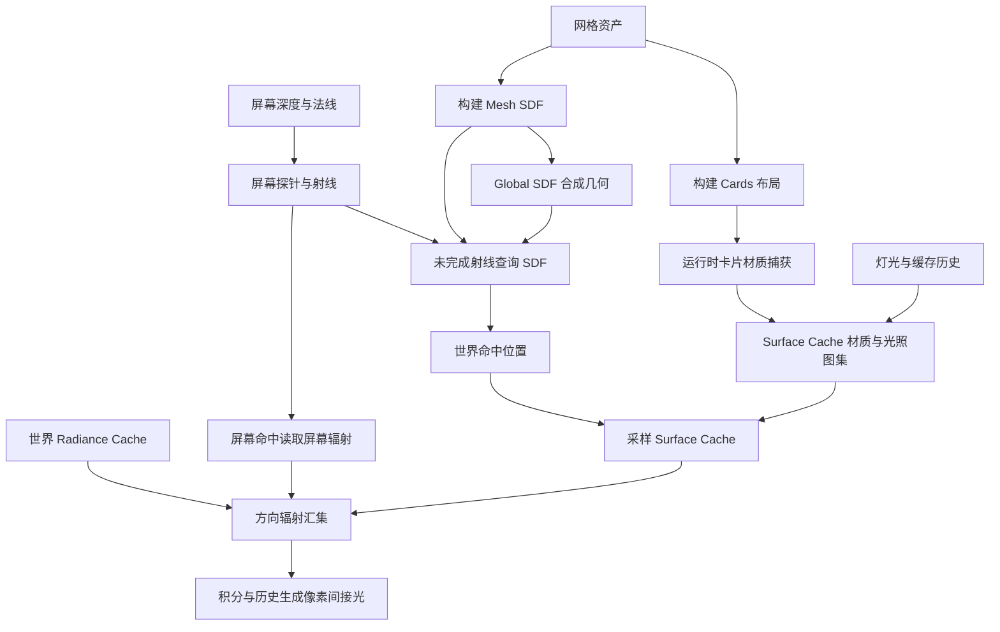
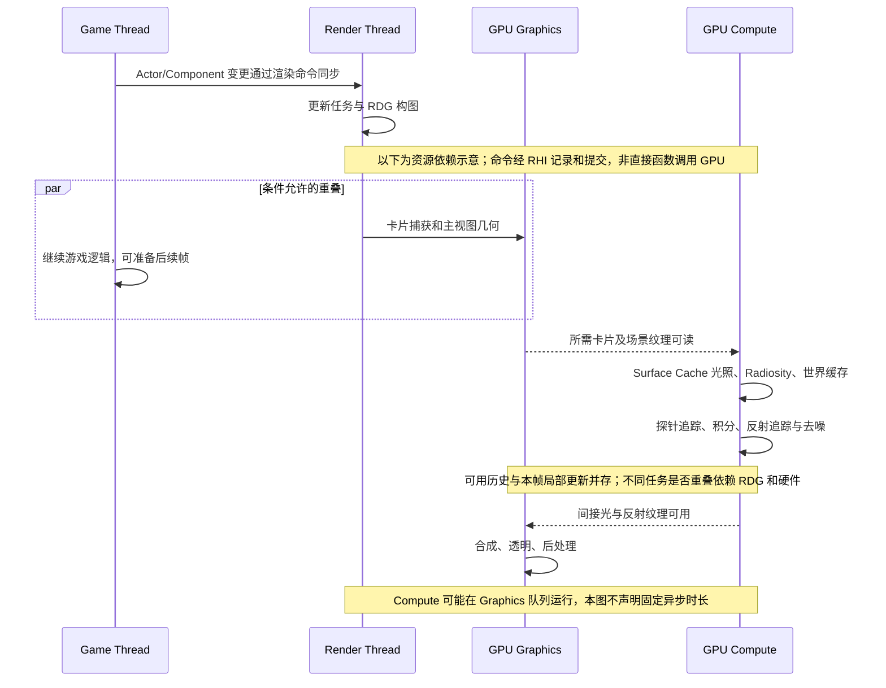

# 第 24 章：Lumen 软件追踪：从 Surface Cache 到屏幕探针

[返回目录](../README.md) · [本章答案](../appendices/answers/24-lumen-software-tracing.md) · [一帧总览](00-frame-overview.md)

> **版本与范围：**UE 5.7.4，CL 51494982，Windows、D3D12、SM6，桌面延迟渲染。本文的配置 B 启用 Substrate Blendable GBuffer、适用不透明网格 Nanite、虚拟阴影贴图和 Lumen 软件追踪；`r.Lumen.HardwareRayTracing=0`、项目 `r.RayTracing=0`，MegaLights 关闭，`r.GenerateMeshDistanceFields=1`，`r.Lumen.TraceMeshSDFs=1`。分辨率、曝光和 TAA 沿用前章。不同项目设置、平台和后处理可能改变分支。
>
> **证据边界：**“源码已确认”指本地 UE 5.7.4 静态阅读，以下带源码链接的具体实现均属此范围；“教学简化”是为建立模型而做的抽象；“尚未验证”表示没有在本机启动工程、抓 RenderDoc 或测 GPU 时间。软件追踪是 GPU Compute Shader 中的距离场追踪，不是 CPU 逐条光线循环。

## 24.1 学习目标与问题地图

读完本章，应能回答：

1. Lumen 为什么同时需要几何表示（Mesh SDF、Global SDF、Cards）和光照表示（Surface Cache、Radiance Cache）？
2. 一条 Screen Probe 射线怎样先利用屏幕深度，再落到 Mesh SDF 或 Global SDF，并取得命中处的辐射亮度？
3. Surface Cache 的直接光照、Radiosity 间接光照为什么可以跨帧分批更新？
4. Lumen 反射为什么有独立的追踪与去噪路线，而不是把漫反射 Screen Probe 结果直接当镜面反射？
5. 如何沿着 `RenderLumenSceneLighting`、`RenderLumenScreenProbeGather` 和 `RenderLumenReflections` 阅读源码？

本章所用场景固定为：摄像机、地面、红色不透明立方体、金属球、蓝色透明薄片、可移动方向光和点光源。P 是方块未被薄片覆盖的像素，Q 是薄片覆盖方块的像素，M 是金属球上的反射像素。配置 A 关闭 Lumen；配置 B 只切换本章声明的项目设置，避免把两条路径混在一起。

必要前置知识是第 04 章的 BRDF 与辐射亮度、第 05 章的历史数据、第 09 章的 RDG、第 13 章的 HZB、第 17 章的间接光和第 21～23 章的配置 B。**全局光照（Global Illumination，GI）**包含表面间相互反射的贡献；**辐射亮度（Radiance）**描述光沿某个方向的能量密度，探针保存的是方向相关光信息。**辐照度（Irradiance）**则把表面接收的方向贡献积分，后面会看到 Surface Cache 把直接与间接辐照度乘以漫反射 BRDF，再成为可供别处采样的出射亮度。

本章保持 Q 为前章的 Unlit、Translucent、Two Sided 薄片，Tint `(0.1,0.6,1)`、EmissiveStrength `300`、Opacity `0.35`，无折射。它自身不接收受光材质的漫反射 GI；讨论受光透明体积时会明确指出那是另一种材质条件。也不增加 Sky Light、Reflection Capture、雾或烘焙灯光，场景不会凭空拥有均匀天空照明。

## 24.2 三种“空间表示”先分开

### 24.2.1 Mesh SDF 与 Global SDF：几何的近似

**有符号距离场（Signed Distance Field，SDF）**把空间中的每一点存成“到最近表面的距离”，表面内外用符号区分。**Mesh SDF**按单个网格保存，分辨率较高，能更准确地表示方块边缘；**Global SDF**把许多对象合并到分层体素场中，覆盖范围大但分辨率低。它们回答的是“这条射线在哪里撞到几何体”，不保存材质颜色或光照。

本版项目设置 `r.GenerateMeshDistanceFields` 对应 `RendererSettings.h` 的 `bGenerateMeshDistanceFields`；`r.Lumen.TraceMeshSDFs` 的注册说明明确指出，打开它更准确但重叠实例多时追踪成本高，关闭时使用较低分辨率 Global SDF。[源码说明](G:/UnrealEngineInstalled/UE_5.7/Engine/Source/Runtime/Renderer/Private/Lumen/LumenDiffuseIndirect.cpp:97)

**[教学简化]**对理想精确 SDF，在射线位置 `x(t)=o+t·d` 采样得到距离 `s` 后，可以把参数向前推进约 `s`：因为该球形范围内没有更近表面，通常无需像固定小步长那样逐格检查。例如沿射线采到距离 `20 cm、6 cm、1 cm、0.03 cm`，并采用 `0.05 cm` 命中阈值，就能在最后一个样本判为接近表面。`o` 是起点，`d` 是单位方向，`t` 是沿射线的距离；数字只是模型，不能推断每条实际射线都四步命中。

UE 实际保存的是离散、压缩、有限分辨率的距离近似。`LumenSoftwareRayTracing.ush` 把射线变换到对象体积坐标，与体积包围盒求交，循环采样 `SampleSparseMeshSignedDistanceField`，用 `max(DistanceField, LocalMinStepSize)` 推进；同时加入表面扩张、mip 层级切换、最大步数和双面覆盖的处理。本段局部循环的上限是 64，但它不是整条 Lumen 射线所有阶段的总步数。[距离推进与命中判断](G:/UnrealEngineInstalled/UE_5.7/Engine/Shaders/Private/Lumen/LumenSoftwareRayTracing.ush:179)

这也解释薄墙问题：若距离场体素不足以保留墙厚，Shader 采到的“空隙”并非真实三角形空隙。表面扩张可改善漏光，却可能造成掠射角自遮挡，源码注释明确承认这个取舍。只提高后处理质量不能修复缺失的几何表示；需要检查资产厚度、Distance Field Resolution Scale 和实际距离场可视化。

### 24.2.2 Mesh Cards 与 Surface Cache：表面的可采样图像

**Mesh Card（网格卡片）**以若干捕获方向和有深度的图像覆盖网格表面，用于给表面建立可采样的参数化。它不是给主视图替换成几张平面。构建期工具 `FMeshUtilities::GenerateCardRepresentationData` 生成卡片数据；静态网格 `FMeshBuildSettings::MaxLumenMeshCards` 构造初值为 12，控制资产构建预算，设为 0 可关闭该网格的卡片生成。12 是最大生成设置，不保证每个资产恰好 12 张。[卡片构建入口](G:/UnrealEngineInstalled/UE_5.7/Engine/Source/Developer/MeshUtilities/Private/MeshCardRepresentationUtilities.cpp:1076)[资产设置与默认值](G:/UnrealEngineInstalled/UE_5.7/Engine/Source/Runtime/Engine/Classes/Engine/EngineTypes.h:2791)

**Surface Cache（表面缓存）**不是 SDF。它是把卡片展开到物理图集，保存卡片表面的材质、法线、深度、发光和随时间更新的直接/间接光照。软件追踪在命中 SDF 后，会把命中位置映射回卡片并采样 Radiance；`LumenSoftwareRayTracing.ush` 的 `ConeTraceMeshSDFsAndInterpolateFromCards` 正是在命中后读取采样结果的 `SurfaceCacheSample.Radiance` 成员。[命中后采样](G:/UnrealEngineInstalled/UE_5.7/Engine/Shaders/Private/Lumen/LumenSoftwareRayTracing.ush:588)

### 24.2.3 Screen Probe 与 Radiance Cache：需求与复用

**Screen Probe（屏幕探针）**先按屏幕网格放置，再在需要补充采样的区域自适应增加探针。探针通过深度回到真实表面位置，从那里采样多个方向，而非从相机中心重复发射主视线。**八面体映射（Octahedral Mapping）**把三维单位方向映射到二维方形纹理，每个纹素代表一个方向区间；它不是每个探针只发八条射线。探针收集漫反射和粗糙镜面间接光，属于“从哪些表面位置问光”的采样布局。[统一与自适应放置入口](G:/UnrealEngineInstalled/UE_5.7/Engine/Source/Runtime/Renderer/Private/Lumen/LumenScreenProbeGather.cpp:2206)

**Radiance Cache（辐射缓存）**在世界空间的层级网格中存放带方向的辐射值，探针或透明体积可以复用附近缓存，减少每个探针都完整追踪的成本。它不是 Surface Cache：前者是空间中可复用的入射辐射样本，后者是物体表面的材质与光照图。

下面的关系图是教学数据流，不是 GPU 时间线：

[查看静态图](../assets/diagrams/24-lumen-software-tracing-1.png)



## 24.3 一帧的真实组织：更新、收集、合成

教材可按“先更新场景、再求间接光、最后合成”理解；运行时 CPU 和 GPU 会因 RDG 依赖、异步 Compute 和跨帧缓存而重叠。UE 5.7 主调度在 `DeferredShadingRenderer.cpp` 先调用 `BeginUpdateLumenSceneTasks`，随后 `UpdateLumenScene`，再调用 `RenderLumenSceneLighting`。[主调度入口](G:/UnrealEngineInstalled/UE_5.7/Engine/Source/Runtime/Renderer/Private/DeferredShadingRenderer.cpp:1873)[场景更新](G:/UnrealEngineInstalled/UE_5.7/Engine/Source/Runtime/Renderer/Private/DeferredShadingRenderer.cpp:2794)[场景光照](G:/UnrealEngineInstalled/UE_5.7/Engine/Source/Runtime/Renderer/Private/DeferredShadingRenderer.cpp:2899)

[查看静态图](../assets/diagrams/24-lumen-software-tracing-2.png)



图中“箭头”表示资源依赖，不表示每个 Compute 必须等整帧 CPU 结束。`RenderLumenSceneLighting` 根据 `UseAsyncCompute(ViewFamily)` 选择 `ERDGPassFlags::AsyncCompute` 或 `Compute`，并在函数内先增加 Surface Cache 帧索引，再调用直接光照和 Radiosity。[异步标志与调用](G:/UnrealEngineInstalled/UE_5.7/Engine/Source/Runtime/Renderer/Private/Lumen/LumenSceneLighting.cpp:242)

这里仍处在第 07、09 章的 `FSceneRenderBuilder` 与 RDG 框架内，不是把旧版本 `BeginRenderingViewFamily → Render` 图照搬到本版。间接光模块用 `ELumenIndirectLightingSteps` 记录剩余的 ScreenProbeGather、Reflections、Composite。`StepsLeft` 允许先启动部分计算，后续只做尚未完成的步骤；同一 CPU 函数出现多处调用不代表每个视图重复完整计算 Lumen。[剩余步骤判定](G:/UnrealEngineInstalled/UE_5.7/Engine/Source/Runtime/Renderer/Private/IndirectLightRendering.cpp:1060)

## 24.4 阶段一：更新 Lumen Scene 与 Surface Cache

### 它是什么，为什么需要

Lumen Scene 更新把新增、删除或变换的 Primitive 反映到专用场景：卡片页分配、图集页回收、卡片/高度场场景信息和捕获任务。Mesh SDF 的资产构建与距离场场景维护是相邻子系统，不能把它们都归给 `UpdateLumenScene` 一次函数调用。若不更新表示，移动方块可能继续对应旧位置或失效缓存，Screen Probe 命中后无法取得匹配表面的光照。

### 输入、过程、输出

输入包括 Primitive 的世界变换、材质标志、卡片派生数据和上一帧缓存。更新任务根据可见性、距离和页使用年龄决定哪些卡片要捕获；`r.LumenScene.SurfaceCache.CardCapturesPerFrame` 默认 300，表示每帧捕获预算，`CardCaptureFactor=64` 的注释把它解释为每帧可捕获纹素约为总纹素除以该因子。[预算变量](G:/UnrealEngineInstalled/UE_5.7/Engine/Source/Runtime/Renderer/Private/Lumen/LumenSceneRendering.cpp:100)

卡片捕获将卡片当作小视图渲染材质与深度，写入 Surface Cache 图集。需要注意：这是 GPU 捕获；CPU 负责组织任务和页表，Shader 负责光栅化和写图集。输出是卡片页、材质/法线/发光图和页状态，后续直接光照、Radiosity、SDF 命中插值都会读取。

本版具体过程可从 `UpdateLumenScene` 的 `UpdateSceneTask.Wait()` 读起：这是 CPU 等待场景准备任务，不是等整个 GPU。接着检查是否有有效 Lumen 视图，必要时分配并清除卡片图集，注册本帧临时资源，再创建卡片捕获目标。[等待与资源准备](G:/UnrealEngineInstalled/UE_5.7/Engine/Source/Runtime/Renderer/Private/Lumen/LumenSceneRendering.cpp:2490)

普通网格卡片使用 Raster Pass，在卡片图集矩形内设置 Viewport，并通过 `InstanceCullingContext->SubmitDrawCommands` 提交相应 Mesh Draw Command。Nanite 网格则在 `HasNanite() && NeedsRender()` 条件下选择 Nanite Lumen 管线，产生卡片视图的可见性，再输出 Albedo、Normal、Emissive、DepthStencil。这是第 12、22 章机制在不同视图上的复用，不意味着软件追踪时拿 Nanite 原始三角形做逐射线相交。[普通卡片绘制](G:/UnrealEngineInstalled/UE_5.7/Engine/Source/Runtime/Renderer/Private/Lumen/LumenSceneRendering.cpp:2808)[Nanite 卡片条件](G:/UnrealEngineInstalled/UE_5.7/Engine/Source/Runtime/Renderer/Private/Lumen/LumenSceneRendering.cpp:2854)[卡片目标](G:/UnrealEngineInstalled/UE_5.7/Engine/Source/Runtime/Renderer/Private/Lumen/LumenSceneRendering.cpp:2986)

### UE 实现、条件、性能与误区

`BeginUpdateLumenSceneTasks` 与其中的 `UpdateLumenScenePrimitives` 可在 `LumenSceneRendering.cpp` 找到；`UpdateLumenSceneBuffers` 在上述函数中是 GPU Breadcrumb/Stat 标记，不能因名称就当成独立 C++ 函数。[任务入口](G:/UnrealEngineInstalled/UE_5.7/Engine/Source/Runtime/Renderer/Private/Lumen/LumenSceneRendering.cpp:1969)[Primitive 更新调用](G:/UnrealEngineInstalled/UE_5.7/Engine/Source/Runtime/Renderer/Private/Lumen/LumenSceneRendering.cpp:2104)缓存可跨帧保留，重新捕获由失效、周期刷新和预算等条件决定；主相机没看到的表面仍可能影响 GI，不等于立刻从缓存删除。

性能成本来自卡片捕获的光栅化、图集带宽和页表更新。**常见误区：**Surface Cache 不是“整张屏幕的 GBuffer”；它只覆盖 Lumen 卡片表示的表面，薄片等透明物体通常不会按普通不透明卡片进入同一流程。P 的方块移动会使卡片需要更新，Q 的透明薄片仍走透明路线；它不会因为 Lumen 开启就自动获得不透明 GBuffer 的 GI。

| 八维检查 | 场景与卡片更新 |
|---|---|
| 是什么 | 把游戏侧变更转为 Lumen 表面表示与本帧捕获工作 |
| 为什么 | 后续世界命中需要与几何相匹配的材质和光照位置 |
| 输入 | Primitive 状态、资产 Cards、反馈与上帧页表 |
| 过程 | CPU 更新任务、页分配与预算筛选、普通或 Nanite 捕获、图集写回 |
| 输出 | 卡片/页数据、Albedo/Normal/Emissive/Depth 及缓存状态 |
| UE 实现 | `BeginUpdateLumenSceneTasks`、`UpdateLumenScene`、卡片 Raster/Nanite 管线 |
| 执行条件 | 有有效 Lumen GI 视图，页面需要更新且预算允许 |
| 性能与误区 | 资产布局构建不等于每帧重建；主相机不可见不等于不参与 GI |

## 24.5 阶段二：Surface Cache 直接光照与 Radiosity

### 它是什么，为什么需要

Lumen 先给卡片表面计算直接光照，再在卡片上进行多次反弹近似（Radiosity，辐射度）。这样一个远处或当前屏幕外的表面也能成为间接光源，屏幕像素只需采样缓存，而不必对每个像素重新追踪所有灯光。

### 输入与处理

`RenderLumenSceneLighting` 建立两个更新上下文，分别给 Direct Lighting 和 Indirect Lighting；本版 CVar 注册初值为直接更新因子 32、间接 64，随后通过 `SetLightingUpdateAtlasSize` 约束更新预算。[更新因子](G:/UnrealEngineInstalled/UE_5.7/Engine/Source/Runtime/Renderer/Private/Lumen/LumenSceneLighting.cpp:39)[上下文构建](G:/UnrealEngineInstalled/UE_5.7/Engine/Source/Runtime/Renderer/Private/Lumen/LumenSceneLighting.cpp:572)

**[教学简化]**忽略取整和最小页大小，若图集宽高都乘 `1/sqrt(F)`，面积就约变成原来的 `1/F`。所以 `F=64` 表示这类预算约为原面积的 1/64，不表示每张卡片固定 64 帧更新一次。实际代码还根据 `LumenSceneLightingUpdateSpeed` 调整因子，按 tile 对齐，保留至少一张完整物理页的容量；页面距离、接近视锥的程度和上次更新时间共同参与优先级。[预算尺寸计算](G:/UnrealEngineInstalled/UE_5.7/Engine/Source/Runtime/Renderer/Private/Lumen/LumenSceneLighting.cpp:97)[页面优先级](G:/UnrealEngineInstalled/UE_5.7/Engine/Shaders/Private/Lumen/LumenSceneLighting.usf:105)

`RenderDirectLightingForLumenScene` 收集灯光、建立卡片与灯光 tile，软件路径调用 `TraceDistanceFieldShadows` 生成阴影遮罩，然后 `RenderDirectLightIntoLumenCardsBatched` 把灯光写入 Direct Lighting Atlas；硬件光追分支在同一位置调用另一套函数，本章明确关闭它。[直接光照入口](G:/UnrealEngineInstalled/UE_5.7/Engine/Source/Runtime/Renderer/Private/Lumen/LumenSceneDirectLighting.cpp:2239)[软件阴影与写入](G:/UnrealEngineInstalled/UE_5.7/Engine/Source/Runtime/Renderer/Private/Lumen/LumenSceneDirectLighting.cpp:2408)

本章的主视图阴影仍使用 VSM，但这不能推出“Lumen 卡片直接读取主视图阴影颜色”。这里的接受者是卡片 texel，存在独立的灯光剔除、阴影掩码缓冲和距离场阴影 Compute；VSM 的主视图投影在不同路径为摄像机可见表面服务。分析灯光问题时必须先确认自己看的是哪个接收表面与哪份阴影输入。

**Radiosity（辐射度传播）**在卡片上放置半球探针，读取已缓存的表面光，把其他表面的出射亮度积分成此处的间接入射贡献。本版软件分支 `FLumenRadiosityDistanceFieldTracingCS` 选择 `FTraceGlobalSDF`；对应 Shader 的 `LumenRadiosityDistanceFieldTracingCS` 调用 `RayTraceGlobalDistanceField`，不能套用下节 Screen Probe 的“先屏幕、后 Mesh SDF”序列。[软件 Radiosity 参数](G:/UnrealEngineInstalled/UE_5.7/Engine/Source/Runtime/Renderer/Private/Lumen/LumenRadiosity.cpp:930)[Shader 追踪](G:/UnrealEngineInstalled/UE_5.7/Engine/Shaders/Private/Lumen/Radiosity/LumenRadiosity.usf:82)

具体数据变化是：追踪结果写 `TraceRadianceAtlas`；可选空间滤波限制邻近探针的噪声；将方向亮度投影为低阶**球谐（Spherical Harmonics，SH）**系数，以少量系数保存低频方向函数；然后给卡片 texel 插值、按法线积分并与历史累积。球谐并不是一盏隐藏的灯，而是一种压缩方向信号的数学表示。`LumenRadiosityIntegrateCS` 把积分后的结果写回 Radiosity 图集，时域分支用 `lerp(HistoryRadiosity, TexelRadiance, Alpha)`。[方向投影](G:/UnrealEngineInstalled/UE_5.7/Engine/Shaders/Private/Lumen/Radiosity/LumenRadiosity.usf:363)[积分与历史](G:/UnrealEngineInstalled/UE_5.7/Engine/Shaders/Private/Lumen/Radiosity/LumenRadiosity.usf:481)

`RenderRadiosityForLumenScene` 要求功能开启、Final Lighting Atlas 已有效且有更新 tile，随后调用 `AddRadiosityPass` 和 `CombineLumenSceneLighting`；否则清除间接光图集。它不是每帧从零求全场固定次数的反弹。[执行条件](G:/UnrealEngineInstalled/UE_5.7/Engine/Source/Runtime/Renderer/Private/Lumen/LumenRadiosity.cpp:1085)

最后 `CombineLumenSceneLightingCS` 读取 Albedo、Emissive、Direct Lighting、Indirect Lighting；`CombineFinalLighting` 先解码 Albedo，再做 `(DirectLighting + IndirectLighting) * Albedo / PI + Emissive`，并排除非有限数和负值，因为结果会进入持久缓存的反馈循环。[图集输入](G:/UnrealEngineInstalled/UE_5.7/Engine/Shaders/Private/Lumen/LumenSceneLighting.usf:477)[真实组合函数](G:/UnrealEngineInstalled/UE_5.7/Engine/Shaders/Private/Lumen/SurfaceCache/LumenSurfaceCache.ush:50)

**[教学简化]**假设解码后的 Albedo=`(0.8,0.1,0.05)`，直接辐照度=`(PI,PI,PI)`，间接辐照度=`(0.2PI,0.2PI,0.2PI)`，发光为 0，则缓存出射亮度为 `1.2*(0.8,0.1,0.05)=(0.96,0.12,0.06)`。这里 PI 抵消的是 Lambert 漫反射 BRDF 的归一化项；不用先把颜色 clamp 到 1，因为缓存承担 HDR 光能。这个算例演示真实函数的数学结构，忽略编码、预曝光、量化与艺术参数，不能视为本场景测量。

### 输出、条件、成本与案例

输出是可被射线命中采样的 Surface Cache 辐射值、页的更新时间和 Final Lighting Atlas。只有视图启用 Lumen 且存在有效 Lumen Scene 时才执行；`Lumen::IsLumenFeatureAllowedForView` 还要求 ViewState，并且在软件追踪配置下必须支持距离场。[启用条件](G:/UnrealEngineInstalled/UE_5.7/Engine/Source/Runtime/Renderer/Private/Lumen/Lumen.cpp:248)

P 的方块卡片会得到直接灯光，附近地面卡片可在间接追踪命中方块后读到红色出射亮度。反复更新的缓存形成多次反射的近似反馈，不要求为每个像素显式保存一条完整多反弹路径。移动方向光时，直接主像素、Surface Cache、Radiosity、世界探针和屏幕历史的刷新可能不同步；因子与预算意味着变化可以在多帧传播。

成本来自卡片 texel 数量、灯光影响范围、距离场阴影、Radiosity 射线与图集带宽。提高 Scene Lighting Update Speed 通常增加刷新工作，并不能补上距离场或卡片覆盖缺失。**误区：**不能把开启 Lumen 后发现的所有拖影都归给 TAA；缓存本身就可能还有旧光照。也不能把这里的 Lambert 缓存当成 M 的完整视角相关镜面材质求值。

| 八维检查 | 卡片直接光照 | 卡片 Radiosity |
|---|---|---|
| 是什么 | 在卡片接收表面计算灯光 | 在卡片间传播低频间接光 |
| 为什么 | 为屏幕外表面提供可复用受光结果 | 让直接受光/发光表面继续照亮其他表面 |
| 输入 | 卡片法线/位置、灯光列表、软件距离场 | 已有效 Final Lighting、卡片探针、历史 |
| 过程 | 灯光 tile 剔除、阴影、辐照度求值、组合 | Global SDF 追踪、探针滤波、球谐积分、时域累积 |
| 输出 | DirectLightingAtlas、更新后的 FinalLightingAtlas | IndirectLightingAtlas、更新后的 FinalLightingAtlas |
| UE 实现 | `RenderDirectLightingForLumenScene` 与批量卡片灯光 Shader | `RenderRadiosityForLumenScene`、`LumenRadiosityIntegrateCS` |
| 执行条件 | 功能允许、任务可用、存在更新 tile | 功能允许、Final Lighting 有效、存在更新 tile |
| 性能与误区 | 与主视图直接灯光重复的是不同接收数据，并非重复给 P 加光 | 预算不是固定刷新周期，缓存反馈不是每像素每帧完整路径追踪 |

## 24.6 阶段三：Screen Probe Gather 的软件追踪

### 1. 布置与准备

`RenderLumenScreenProbeGather` 创建探针图集、深度/法线下采样和追踪参数，为各探针保存方向域的射线辐射。若启用 Radiance Cache，它先注册屏幕探针标记回调，和透明体积等其他消费者一起调用 `UpdateRadianceCaches`，以便批量组织缓存 dispatch 并提供重叠机会。[Radiance Cache 更新](G:/UnrealEngineInstalled/UE_5.7/Engine/Source/Runtime/Renderer/Private/Lumen/LumenScreenProbeGather.cpp:2421)

更准确地说，这些探针比像素稀疏：统一探针给出基础覆盖，自适应探针在深度等变化处增加覆盖，最后才将探针结果还原到各像素。**[教学简化]**假设暂定一个 16×16 像素块放一个探针，1280×720 就有 `80×45=3600` 个统一探针；若每个探针本次采 64 个方向，则基础方向样本为 `230400`，而不是 `921600×64`。这解释“让相邻像素共享入射光”的节省来源。这些数字是人为示例，本版实际下采样因子、方向图集分辨率和自适应数量由质量、分辨率和设置决定。[尺寸与预算设置](G:/UnrealEngineInstalled/UE_5.7/Engine/Source/Runtime/Renderer/Private/Lumen/LumenScreenProbeGather.cpp:2206)

世界 Radiance Cache 的更新可以沿 `LumenRadianceCache::UpdateRadianceCaches` 阅读：先准备多层空间网格与前次缓存，消费者回调标记本帧需要的空间位置，`FAllocateUsedProbesCS` 为需求分配探针索引，再按历史和预算决定哪些探针需要追踪。这里的**间接寻址纹理（Indirection Texture）**保存“空间格子映射到哪个实际探针槽”，不用给整个大空间都铺满高分辨率方向纹理。[更新入口](G:/UnrealEngineInstalled/UE_5.7/Engine/Source/Runtime/Renderer/Private/Lumen/LumenRadianceCache.cpp:1215)[分配所需探针](G:/UnrealEngineInstalled/UE_5.7/Engine/Source/Runtime/Renderer/Private/Lumen/LumenRadianceCache.cpp:1713)

后续建立追踪 tile 与间接 dispatch 参数，软件分支 `FRadianceCacheTraceFromProbesCS` 使用 Global SDF、卡片光照和可选天空输入，从世界探针位置收集方向信息。执行完将 `ProbeLastTracedFrame` 等缓冲转为外部资源供后续帧保留。没有 Sky Light 的案例不会因 Shader 支持天空就自动收到天空光。[软件世界探针追踪](G:/UnrealEngineInstalled/UE_5.7/Engine/Source/Runtime/Renderer/Private/Lumen/LumenRadianceCache.cpp:2177)[保存更新时间](G:/UnrealEngineInstalled/UE_5.7/Engine/Source/Runtime/Renderer/Private/Lumen/LumenRadianceCache.cpp:2401)

因此世界缓存承担共享的远处方向光信息，Screen Probe 仍需处理附近遮挡与当前表面几何。若只对整个房间插值一份颜色，墙两边的光就会泄漏；实际缓存要结合空间层级、可见性/深度信息和局部追踪使用。Radiance Cache 同样有更新预算，提高每帧追踪预算会增加工作；它不会让没有 SDF 和卡片表示的物体突然变得可追踪。

| 八维检查 | 世界 Radiance Cache |
|---|---|
| 是什么 | 在多层空间网格中维护可共享的方向辐射探针 |
| 为什么 | 让多个消费者复用远处入射光，降低重复追踪 |
| 输入 | 本帧需求标记、旧探针、世界场景表示与光照缓存 |
| 过程 | 保留/分配所需探针、预算选择、追踪 tile、软件 Global SDF 追踪与缓存更新 |
| 输出 | 方向辐射纹理、空间间接寻址、探针更新时间 |
| UE 实现 | `UpdateRadianceCaches`、`FAllocateUsedProbesCS`、`FRadianceCacheTraceFromProbesCS` |
| 执行条件 | `UseRadianceCache` 允许，并有需要更新/使用的消费者 |
| 性能与误区 | 覆盖范围、探针密度、方向分辨率、更新量决定成本；不等同卡片 Surface Cache |

### 2. 屏幕追踪与世界追踪

`TraceScreenProbes` 首先在条件满足时运行 `ScreenProbeTraceScreenTexturesCS`：需要上一帧屏幕追踪输入、`r.Lumen.ScreenProbeGather.ScreenTraces`、ShowFlag 和最终设置同时允许。[屏幕条件](G:/UnrealEngineInstalled/UE_5.7/Engine/Source/Runtime/Renderer/Private/Lumen/LumenScreenProbeTracing.cpp:688)它沿反射/漫反射射线在深度或 HZB 中寻找便宜的屏幕命中；屏幕外或深度不确定时，该射线进入后续世界表示。

随后把仍需追踪且满足距离等条件的射线压缩成紧凑缓冲，并写间接 dispatch 参数。**射线压缩（Trace Compaction）**不是压缩图像文件，而是把没完成的工作索引收集起来，避免后续 Shader 还为已经得到答案的方向占用同样工作量。`CompactTraces` 产生 allocator/data 两类缓冲，`SetupCompactedTracesIndirectArgsCS` 再把数量转成线程组数；CPU 不必逐条读回 GPU 命中结果。[压缩和间接参数](G:/UnrealEngineInstalled/UE_5.7/Engine/Source/Runtime/Renderer/Private/Lumen/LumenScreenProbeTracing.cpp:576)

若细节追踪启用并存在 Mesh SDF 对象，`FScreenProbeTraceMeshSDFsCS` 在 Compute Shader 中执行距离场追踪。`r.Lumen.TraceMeshSDFs=1` 只是其中一个条件；`UseMeshSDFTracing` 还检查 `r.Lumen.TraceMeshSDFs.Allow` 与 `LumenDetailTraces` ShowFlag，Screen Probe 调用处又有自己的 `TraceMeshSDFs` 开关。[实际允许条件](G:/UnrealEngineInstalled/UE_5.7/Engine/Source/Runtime/Renderer/Private/Lumen/LumenDiffuseIndirect.cpp:206)[Mesh SDF Shader 注册](G:/UnrealEngineInstalled/UE_5.7/Engine/Source/Runtime/Renderer/Private/Lumen/LumenScreenProbeTracing.cpp:325)

剩余射线再由 `FScreenProbeTraceVoxelsCS` 追踪 Global SDF（体素场）；其排列是 Shader permutation，只有 `!bUseHardwareRayTracing && Lumen::UseGlobalSDFTracing(...)` 时才选择 Global SDF 分支。[Global SDF permutation](G:/UnrealEngineInstalled/UE_5.7/Engine/Source/Runtime/Renderer/Private/Lumen/LumenScreenProbeTracing.cpp:868)

命中 Mesh SDF 后，`ConeTraceMeshSDFsAndInterpolateFromCards` 计算命中位置、锥体半径和卡片坐标，从 Surface Cache 取 `Radiance`；命中 Global SDF 则在 `EvaluateGlobalDistanceFieldHit` 中继续计算卡片采样或体素结果。[两类命中处理](G:/UnrealEngineInstalled/UE_5.7/Engine/Shaders/Private/Lumen/LumenSoftwareRayTracing.ush:649)

这里“先屏幕、再世界”是候选路径的逻辑次序，不意味着每条射线都完整跑三遍。屏幕有可信命中可以直接提供部分答案；没完成才可能进入世界阶段；全局场与 Radiance Cache 的启用条件又决定后续处理。屏幕来源还涉及历史 Scene Color、速度和深度验证，不应口述成“读取已经完成的本帧最终颜色”，否则会形成要求当前间接光依赖自身最终结果的循环。

### 3. 滤波、积分与时域

追踪结果写入 `TraceRadiance` 与 `TraceHit`，随后 `FilterScreenProbes` 滤波，`InterpolateAndIntegrate` 把方向样本积分为屏幕分辨率的 `DiffuseIndirect`、可选背面漫反射和 `RoughSpecularIndirect`。源码明确创建这三类输出纹理，并在积分后调用 `UpdateHistoryScreenProbeGather` 保存历史。[追踪与输出](G:/UnrealEngineInstalled/UE_5.7/Engine/Source/Runtime/Renderer/Private/Lumen/LumenScreenProbeGather.cpp:2564)[积分与历史](G:/UnrealEngineInstalled/UE_5.7/Engine/Source/Runtime/Renderer/Private/Lumen/LumenScreenProbeGather.cpp:2639)

**[教学简化]**方向积分可写成 `E ≈ Σ Li·max(n·wi,0)·Δωi`，其中 `Li` 是方向 `wi` 的入射亮度，`n` 是表面单位法线，`Δωi` 是这个样本代表的立体角。若采样方向不均匀，就必须按采样概率修正权重；UE 的 `GenerateBRDF_PDF` 与可选 `GenerateImportanceSamplingRays` 用材质/光照分布把有限样本投入更有贡献的方向。**重要性采样（Importance Sampling）**改变的是把计算花在哪里，并非直接把暗处颜色删掉。[方向概率构建](G:/UnrealEngineInstalled/UE_5.7/Engine/Source/Runtime/Renderer/Private/Lumen/LumenScreenProbeGather.cpp:2417)[生成射线](G:/UnrealEngineInstalled/UE_5.7/Engine/Source/Runtime/Renderer/Private/Lumen/LumenScreenProbeGather.cpp:2551)

稀疏采样和插值可能漏掉非常短距离的接触遮挡，本版在滤波后允许 `ComputeScreenSpaceShortRangeAO` 补充短程 AO，再根据选定模式在积分或后续合成应用，不能把它当成配置 A 那条独立 SSAO 的必然复用。积分后的时域又根据深度、运动和历史有效性平衡噪声与响应速度；它是 Lumen 自己的历史，主画面末尾还可继续经过 TAA。[短程 AO 调度](G:/UnrealEngineInstalled/UE_5.7/Engine/Source/Runtime/Renderer/Private/Lumen/LumenScreenProbeGather.cpp:2592)

**八维总结：**

|问题|回答|
|---|---|
|是什么|当前视图的低频间接光采样器|
|为什么|以少量探针覆盖大量像素，复用屏幕和世界表示|
|输入|深度、法线、GBuffer、Mesh/Global SDF、Surface/Radiance Cache、历史|
|处理|放置探针→条件 Screen Trace→对未完成项做条件 Mesh／Global SDF 追踪→采样辐射→滤波积分→时域重投影|
|输出|DiffuseIndirect、RoughSpecularIndirect、LightIsMoving 与历史|
|源码|`RenderLumenScreenProbeGather`、`TraceScreenProbes`、`FScreenProbeIntegrateCS`|
|条件|Lumen GI、距离场支持、ShowFlag、ScreenTraces/RadianceCache 等 CVar|
|成本误区|成本在 Compute 追踪、SDF 访问、滤波和历史失效；它不是只读屏幕，也不是 CPU 光线追踪|

对案例而言，服务 P 附近的探针可能从当前深度恢复表面位置，向地面方向的射线命中屏幕，再对屏幕外方向使用世界 SDF，命中地面卡片并取其 Radiance。金属球 M 可以利用该阶段的 `RoughSpecularIndirect`，但需要细节的镜面方向由反射专用路线处理。Q 在主不透明 GBuffer 中仍对应背景方块；Q 的 Unlit 薄片自身不会变成一个受光的漫反射 Screen Probe 接收者。

## 24.7 阶段四：Lumen 反射是另一条路线

### 为什么不能直接复用漫反射

漫反射需要宽角度、低频的入射积分；镜面反射需要由法线和粗糙度决定的窄锥方向，并且命中点的材质颜色、可见性和屏幕历史更敏感。UE 在 `RenderDiffuseIndirectAndAmbientOcclusion` 中先得到最终聚合步骤，再按 `ReflectionsMethod == Lumen` 调用 `RenderLumenReflections`。[反射调度](G:/UnrealEngineInstalled/UE_5.7/Engine/Source/Runtime/Renderer/Private/IndirectLightRendering.cpp:1088)

### 输入、处理与输出

输入是 Scene Textures、深度/法线/GBuffer、Mesh SDF 参数、Radiance Cache 参数和 Lumen 卡片光照。`RenderLumenReflections` 按 `ELumenReflectionPass` 区分 Opaque、FrontLayerTranslucency 和 SingleLayerWater。这里跟踪 M 对应 Opaque，不把其他两类的资源配置混进来。[函数签名与模式](G:/UnrealEngineInstalled/UE_5.7/Engine/Source/Runtime/Renderer/Private/Lumen/LumenReflections.cpp:1154)

第一步是 tile 分类和射线生成。`ReflectionGenerateRaysCS` 读取材质，先判断此粗糙度是否需要专门的反射射线。理想光滑面接近 `reflect(CameraVector, WorldNormal)`；粗糙表面从微表面分布采样法线，再据此计算反射方向，示例分支使用 `ImportanceSampleVisibleGGX`。**GGX**是第 04 章中描述微表面法线分布的一种模型；方向随机变化使多帧能采到不同反射贡献。Shader 写 `RWRayBuffer`，其中保存方向与打包后的锥角。[射线生成](G:/UnrealEngineInstalled/UE_5.7/Engine/Shaders/Private/Lumen/LumenReflections.usf:302)

第二步 `TraceReflections` 初始化追踪输出，按 `UseScreenTraces(View)` 组织 HZB Screen Trace。屏幕命中可使用屏幕颜色，但需要检查历史深度/速度；若转到世界表示，软件分支压缩未完成射线并派发 `FReflectionTraceMeshSDFsCS`，随后压缩剩余工作并派发 `FReflectionTraceVoxelsCS`。后者带 Global SDF、Radiance Cache、命中处采样 Scene Color 等 permutation，实际选择取决于配置与数据。[屏幕追踪](G:/UnrealEngineInstalled/UE_5.7/Engine/Source/Runtime/Renderer/Private/Lumen/LumenReflectionTracing.cpp:1155)[软件回退](G:/UnrealEngineInstalled/UE_5.7/Engine/Source/Runtime/Renderer/Private/Lumen/LumenReflectionTracing.cpp:1256)[最后世界阶段](G:/UnrealEngineInstalled/UE_5.7/Engine/Source/Runtime/Renderer/Private/Lumen/LumenReflectionTracing.cpp:1309)

因此，屏幕命中和世界命中是对一条射线的不同求解来源，不能简单给它们各 50% 权重相加，更不能把材质 Roughness 当成“屏幕光与卡片光的线性混合比例”。材质粗糙度影响反射方向分布、专用射线的选择以及与粗糙环境结果的过渡。`SetupCompositeParameters` 读取后处理的 Max Roughness To Trace，并允许 CVar 覆盖；这个阈值也不是所有项目都相同的固定值。[粗糙度条件](G:/UnrealEngineInstalled/UE_5.7/Engine/Source/Runtime/Renderer/Private/Lumen/LumenReflections.cpp:412)

第三步 Resolve 将追踪结果按实际下采样、邻域重建等配置还原到目标像素，输出 `ResolvedSpecularIndirect` 与相关深度。Resolve 并非只有“把同一像素多条射线平均”；单帧射线也可能只覆盖部分像素，邻域处理负责恢复布局。随后时域 Compute 根据历史有效性累积反射，空间滤波用深度和邻域权重抑制噪声。降低噪声依赖更多历史可能牺牲快速变化时的响应，不能把它当成无代价效果。[Resolve 调度](G:/UnrealEngineInstalled/UE_5.7/Engine/Source/Runtime/Renderer/Private/Lumen/LumenReflections.cpp:1513)[空间滤波](G:/UnrealEngineInstalled/UE_5.7/Engine/Source/Runtime/Renderer/Private/Lumen/LumenReflections.cpp:1709)

配置 B 开启 Substrate **Blendable GBuffer**，不应因此把多闭包 Material Container 全部路径设为执行。本版 `Lumen::SupportsMultipleClosureEvaluation` 明确要求 Substrate 开启且不是 Blendable GBuffer；函数里能看到复杂材质循环不代表 B 的简单材质像素会逐层重复所有工作。[多闭包条件](G:/UnrealEngineInstalled/UE_5.7/Engine/Source/Runtime/Renderer/Private/Lumen/Lumen.cpp:208)

### 合成、条件与性能

反射纹理与 DiffuseIndirect 分开产生，在配置 B 中交给 `FDiffuseIndirectCompositePS` 组合。主调度把普通 Lumen 间接光合成安排在 Lights 后，注释说明这为异步 Lumen 计算提供重叠空间；较早那次间接光函数调用与较晚这次由参数、管线状态与 `StepsLeft` 区分。[后置合成](G:/UnrealEngineInstalled/UE_5.7/Engine/Source/Runtime/Renderer/Private/DeferredShadingRenderer.cpp:3328)

随后 `RenderDeferredReflectionsAndSkyLighting` 检测 Lumen GI + Lumen Reflections 时直接跳过传统镜面合成，因为镜面已经合入。不能把教材的一行“反射”理解成先在 Lumen 合成一次、然后在传统反射 Pass 再加一次。[跳过重复合成](G:/UnrealEngineInstalled/UE_5.7/Engine/Source/Runtime/Renderer/Private/IndirectLightRendering.cpp:2044)

`ShouldRenderLumenReflections` 除检查 Reflection Method、ShowFlag 和 Allow CVar，还要求 Lumen GI 可用，或者满足独立 HWRT 反射条件。所以本章软件反射与 Lumen GI 一起启用；关闭 GI 后保留软件反射设置，不应继续声称运行相同完整路径。[反射执行条件](G:/UnrealEngineInstalled/UE_5.7/Engine/Source/Runtime/Renderer/Private/Lumen/LumenReflections.cpp:750)

性能主要受需要专用射线的像素比例、粗糙度阈值、追踪距离、世界对象重叠程度、实际反射分辨率与去噪影响。全屏低粗糙度金属会让更多像素进入昂贵路径；单纯提高 Nanite 几何精度不会提高软件 SDF 命中的几何精度。M 的反射若屏幕外缺失，应先查距离场、卡片覆盖与更新，不能只把 Reflections Quality 调到很高。

| 八维检查 | 不透明 Lumen 反射 |
|---|---|
| 是什么 | 对需要专用镜面射线的材质像素估计反射 |
| 为什么 | 稀疏低频漫反射探针不能保存清晰镜面方向变化 |
| 输入 | 材质、法线/深度、历史颜色、SDF、Surface/Radiance Cache |
| 过程 | tile 分类、生成方向、屏幕与条件软件回退、Resolve、时域/空间滤波 |
| 输出 | SpecularIndirect 等反射资源，供间接光合成 |
| UE 实现 | `RenderLumenReflections`、`TraceReflections`、反射 Resolve/去噪 Shader |
| 执行条件 | 反射方法与 ShowFlag 允许，软件路径在本章依赖有效 Lumen GI |
| 性能与误区 | 粗糙度改变采样/追踪选择；不是屏幕颜色与卡片颜色的固定线性比例 |

## 24.8 贯穿案例：P、Q、M 的一帧

1. **进入表示：**方块和球的网格生成卡片、Mesh SDF；地面同样拥有卡片。透明薄片作为 Translucent 物体保留自己的材质与排序信息，不强行塞入不透明 Surface Cache。
2. **可见与更新：**视锥内、被移动的方块卡片进入捕获预算；方向光移动令直接光照页变旧，按更新因子分批刷新。点光源进入 Lumen 灯光 tile。
3. **卡片光照：**直接灯光阴影 Compute 写方块和地面卡片，Radiosity 将方块反弹的红色逐步传播到地面。
4. **P：**P 的主不透明材质记录与深度为 Screen Probe 积分提供表面属性；主直接光照累加方向光/点光源，Lumen 普通间接光合成在 Lights 后加入已经准备好的间接与反射结果。该顺序描述这里的主合成，不等于探针计算也只能等 Lights 结束才启动。
5. **M：**M 先计算反射方向和粗糙度；反射路线尝试屏幕命中，离开屏幕后用 Mesh/Global SDF 命中卡片，采样 Surface Cache，并经 Resolve/去噪后写入反射输出。
6. **Q：**透明薄片在所选透明 Pass 与背景混合；背景方块已获得间接光，所以即使薄片自身 Unlit，Q 也可能因背景 GI 改变而变化。这不是薄片自身收到漫反射 GI。只有换成适用的受光透明材质时才讨论相应透明体积和反射缓存，且那是显式改变配置的对照实验。

**[教学简化]**另取一组同一线性表示下的混色输入：背景颜色为 `(0.8,0.1,0.05)`，薄片本步骤的源颜色为 `(0.1,0.6,1.0)`、Opacity 为 `0.35`，暂不继续预曝光和色调映射，则

```text
Q = 0.35 × (0.1, 0.6, 1.0) + 0.65 × (0.8, 0.1, 0.05)
  = (0.555, 0.275, 0.3825)
```

这是透明混合算例，不是 Lumen 反射或 Surface Cache 的测量值，也不是把贯穿材质的 Tint 直接当成实际源颜色：该材质还有自发光强度 300，实际源输入与本例不同。若移动薄片，Q 的透明排序、速度和历史有效性还会引入额外分支。

## 24.9 实践：只改变一个变量观察软件追踪

### 24.9.1 先建立可重复基线

**[尚未验证]**以下是可执行练习设计，尚未在本机运行。沿用第 01 章场景布局，在专用项目或可恢复副本完整切换到[配置 B](../appendices/configuration.md)，统一重启，等待 Substrate/Nanite Shader 与网格派生数据准备完成。Generate Mesh Distance Fields 明确要求重启，构建距离场主要是几何派生数据工作，不能全部叫作“Shader 编译”。[重启和构建说明](G:/UnrealEngineInstalled/UE_5.7/Engine/Source/Runtime/Engine/Classes/Engine/RendererSettings.h:666)

项目设置 Rendering 中 GI Method=Lumen、Reflection Method=Lumen、Software Ray Tracing Mode=Detail Tracing；关闭 Use Hardware Ray Tracing when available 和 Support Hardware Ray Tracing。唯一 PPV 的 GI/Reflection Method 覆盖也设置为 Lumen；否则项目值正确仍可能被最终 View 覆盖。[方法映射](G:/UnrealEngineInstalled/UE_5.7/Engine/Source/Runtime/Engine/Classes/Engine/RendererSettings.h:568)

在 Output Log 查询下面变量，不带数值是读取实际状态。选完画质档后再核对，避免后选画质把子开关覆盖。

```text
r.DynamicGlobalIlluminationMethod
r.ReflectionMethod
r.GenerateMeshDistanceFields
r.Lumen.TraceMeshSDFs
r.Lumen.TraceMeshSDFs.Allow
r.Lumen.HardwareRayTracing
r.RayTracing
```

前三项应为 `1、1、1`，细节追踪及 Allow 都应为 1，末两项为 0。B 的 TAA、固定分辨率、手动曝光和灯光保持不动，不加 Sky Light；资产细节应在 Static Mesh Editor 的距离场可视化中可见。项目支持与资源已准备后，本节的屏幕追踪和细节追踪 CVar 是可在会话中对照的设置，不需要每次重新启动；完整 A/B 切换仍按重启流程执行。

### 24.9.2 先检查表示，再看最终画面

从视口 View Mode 的 Lumen 分类进入 **Lumen Scene** 与 **Surface Cache**，保持同一相机。前者显示 Lumen 场景表示；后者的粉色表示缺少 Surface Cache 覆盖，黄色表示被剔除的网格，这是本版模式描述明确的含义。再输入 `r.Lumen.Visualize.CardPlacement 1` 查看卡片布局，记录后恢复 0。[模式名称与颜色说明](G:/UnrealEngineInstalled/UE_5.7/Engine/Source/Runtime/Engine/Private/LumenVisualizationData.cpp:40)[卡片可视化开关](G:/UnrealEngineInstalled/UE_5.7/Engine/Source/Runtime/Renderer/Private/Lumen/LumenVisualize.cpp:201)

**预期与排查：**若主 Lit 画面方块正常，Surface Cache 某面粉色，首先查卡片覆盖，不先判定是 TAA。在资产 Build Settings 增加 Max Lumen Mesh Cards 并 Apply 会重建该资产的卡片表示；保存独立副本，不能覆盖引擎自带基础资产。简单方块通常不需要增加卡片，若它已经覆盖完整，不应为了“看到变化”任意放大数值。

### 24.9.3 区分屏幕依赖和世界依赖

先记录 `r.Lumen.ScreenProbeGather.ScreenTraces`，再设置为 0，比较 P 周围地面串色和接触区域，保持镜面反射设置不变。之后恢复原值。单独记录并切换 `r.Lumen.Reflections.ScreenTraces 0/1`，观察 M，随后恢复。两个控制变量属于不同功能，不要同时修改后把差异都归给某一个。[探针开关](G:/UnrealEngineInstalled/UE_5.7/Engine/Source/Runtime/Renderer/Private/Lumen/LumenScreenProbeTracing.cpp:14)[反射开关](G:/UnrealEngineInstalled/UE_5.7/Engine/Source/Runtime/Renderer/Private/Lumen/LumenReflectionTracing.cpp:17)

把相机缓慢旋转，使方块逐渐离开屏幕但其反射位置仍可能落在金属球上。**预期：**软件世界表示可保留部分屏幕外贡献，因此关闭 Screen Traces 不等于 Lumen 完全黑；屏幕与 SDF 表示不一致的部分可能出现变化。若完全无变化，可能原本就主要世界命中、该区域贡献弱，或子开关/ShowFlag 已被外层设置禁用；不能据此伪造显著差异。

### 24.9.4 细节追踪与更新响应

在距离场已准备、屏幕追踪状态固定时，对照 `r.Lumen.TraceMeshSDFs 1` 和 `0`，只记录软件世界追踪的几何差异。本版实际开启还受 Allow 和 ShowFlag 限制；提高 Mesh SDF 精度可能改善部分细节，也可能增加重叠对象多时的访问成本。本案例只有少量网格，不应宣称必有某个毫秒级性能收益。

恢复 Detail Tracing 后，将点光源的 Intensity 改变，分别观察 Lit 与 Surface Cache，比较直射高光和间接地面随时间变化的过程。在 PPV 对照 **Lumen Scene Lighting Update Speed**，固定 **Final Gather Lighting Update Speed**；下一轮交换只改后一项，以区分卡片刷新与最终收集响应。二者为不同后处理参数，不等同 TAA 权重。[两个速度参数](G:/UnrealEngineInstalled/UE_5.7/Engine/Source/Runtime/Engine/Classes/Engine/Scene.h:1729)

**排查顺序：**先看运行方法与距离场支持，再看资产几何与卡片覆盖，再看缓存更新时间，最后才检查屏幕历史与后处理。记录每项原值并恢复，等待静止场景稳定后再开始下一项。本文没有生成工程截图、GPU 耗时或实测时间线；两张 PNG 均由本文 Mermaid 图渲染，属于教材示意。

## 24.10 关键概念回顾

- SDF 解决“在哪里命中几何”，Surface Cache 解决“命中表面是什么材质、当前有多少光”。
- Screen Probe 是视图采样布局，Radiance Cache 是世界空间辐射样本；二者都不同于 Surface Cache。
- Lumen Scene Lighting 先更新卡片直接光照，再做 Radiosity；更新因子和捕获预算让结果跨帧摊销。
- 软件追踪是 GPU Compute 的 Screen Trace、Mesh SDF、Global SDF 组合；硬件光追是另一条条件分支。
- Lumen 反射有自己的追踪、Resolve 和去噪，不能把 DiffuseIndirect 直接当清晰镜面。
- Q 透明薄片不应套用普通不透明 GBuffer 流程；它在后续透明阶段与背景合成。无折射蓝片的像素 Shader 不必采样背景，直接混合可由混合单元完成。

## 24.11 理解检查题

1. 为什么 Mesh SDF、Global SDF 和 Surface Cache 不能互相替代？
2. `r.Lumen.TraceMeshSDFs=1` 时，一条探针射线从屏幕追踪到最终颜色的大致顺序是什么？
3. 直接光照更新因子为 32、间接光照更新因子为 64，应如何理解这两个数？
4. 为什么金属球 M 的清晰反射要走 `RenderLumenReflections`，不能只取 Screen Probe 的 `DiffuseIndirect`？
5. 配置 B 中透明薄片 Q 为什么不能直接写入普通不透明 GBuffer 来完成 Lumen GI？

下一章转到硬件光线追踪：保留这里已经分清的几何表示、光照缓存与最终收集关系，逐项检查加速结构、硬件求交和 Hit Lighting 怎样替换其中的部分步骤。第 27 章再回到保持软件追踪的配置 B 串联整帧，并明确标出硬件对照的边界。
