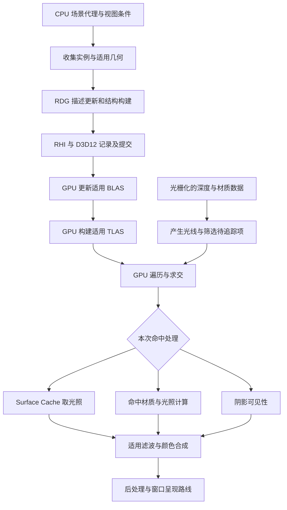
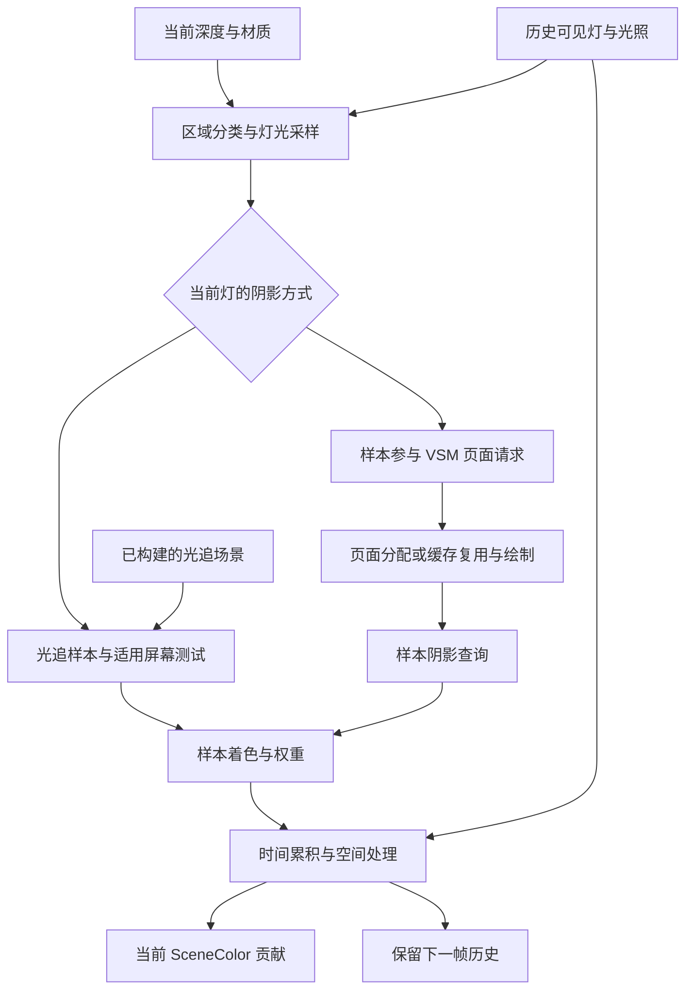

# 第 25 章：硬件光线追踪及相关分支

[返回目录](../README.md) · [配置附录](../appendices/configuration.md) · [本章答案](../appendices/answers/25-hardware-ray-tracing.md)

> **适用范围：**UE 5.7.4，CL 51494982，Windows／D3D12／SM6。A 和 B 的既定主线仍关闭硬件光追。本章使用 B 的可恢复副本逐项研究硬件光追、Lumen 命中光照和 MegaLights；没有把这些开关一起改成所谓“完整 UE5 默认”。
>
> **验证范围：**本章具体实现为 **[源码已确认]** 的静态阅读，数值模型标为 **[教学简化]**。本机 GPU 的光追能力、Shader 编译、场景运行、截图、质量和耗时均 **[尚未验证]**。图是依赖示意，不是实测时间轴。

## 25.1 学习目标与前置知识

学完本章，你应能沿着一次反射请求解释：光线如何描述；引擎为什么要准备另一种几何表示；怎样找到相交物体；命中后从哪里得到材质和光照；结果怎样回到原有场景颜色。你还应能区分项目支持、功能启用、材质表示、光照算法以及实际设备执行这五个层次。

必要前置知识包括第 02 章的变换、第 03 章的相交与遮挡概念、第 08～10 章的线程／RDG／RHI、第 16 章的直接光照，以及第 22～24 章的 Nanite、VSM 和 Lumen。尚未阅读第 24 章时，至少先记住两件事：Lumen 软件追踪同样主要在 GPU 上运行；找到距离场中的表面后，仍需要从 Surface Cache 等来源取得光照。

本章不从头重新讲 BRDF。我们把已有 BRDF 看成“给定表面、入射与观察方向，如何响应光”的函数，集中解释它的输入怎样在光线命中处产生。

### 25.1.1 先划清六个容易混用的名称

| 名称 | 回答的问题 | 在本章的位置 |
|---|---|---|
| 硬件光线追踪，Hardware Ray Tracing，HWRT | GPU 是否用支持的光追机制遍历加速结构并求交 | 几何查询能力 |
| DirectX Raytracing，DXR | D3D12 怎样描述、记录与调度相关工作 | 底层 API |
| Lumen 硬件追踪 | Lumen 怎样把部分世界空间查询换成 HWRT | GI／反射的一条实现分支 |
| 命中光照，Hit Lighting | 命中后是否重新求材质和光照 | 与“用什么几何求交”分开的选择 |
| 光追阴影，Ray Traced Shadows | 表面到光源的方向是否被挡住 | 直接光照的一项可见性输入 |
| 路径追踪，Path Tracing | 沿多段光传播路径估计完整成像 | 独立渲染模式的边界对照 |

金属球的一条反射射线可以使用硬件求交，同时仍从 Lumen Surface Cache 取命中颜色。方向光也可以继续采用 VSM。这些选择不矛盾，因为它们处理不同问题。

## 25.2 一条光线究竟是什么

### 25.2.1 起点、方向与有效区间

光线通常写成：

```text
x(t) = o + t*d，t_min <= t <= t_max
```

`o` 是起点，`d` 是方向，`t` 是沿方向的参数；只有 `d` 长度为 1 且坐标单位已知时，`t` 才能直接解释为相同单位的距离。`t_min` 和 `t_max` 限定本次查询关心哪一段。

**[教学简化]**在单位为厘米的局部算例中，表面点为 `(0,0,0)`，点光源在 `(0,0,100)`。向光源发出的方向是 `(0,0,1)`，最大范围接近 100。若遮挡三角形与这条线在 `t=40` 相交，则它挡住该方向的直接光；若相交在 `t=140`，已经超过灯的位置，不能据此遮住这盏点光源。

真实阴影射线还要考虑起点偏置、光源有限尺寸、材质遮罩、对象掩码和距离限制。把 `t_min` 设为正的小值，是处理表面数值误差的一种办法；它不是无条件正确的修复。偏置过大可能跨过紧贴表面的遮挡物，表现为漏光。

反射的起点通常是当前可见表面，方向由观察向量、法线和材质粗糙度决定。粗糙表面并不总沿唯一理想镜面方向取样。用于反射的最大距离也不等于主相机 Far Plane；相机裁剪与二次射线查询是不同问题。

### 25.2.2 三角形求交输出为什么还不是颜色

成功求交至少可以告诉后续代码：命中的实例、几何段、三角形索引、距离及三角形内部的重心坐标。重心坐标描述命中点在三个顶点之间的位置，可用于插值 UV、法线和其他属性。

**[教学简化]**三角形 UV 为 `(0,0)`、`(1,0)`、`(0,1)`，命中重心权重为 `(0.2,0.3,0.5)`，则插值 UV 为 `(0.3,0.5)`。这个值告诉材质去纹理哪里取样；还没有决定取哪个 Mip、使用什么法线贴图、怎样照明或输出多亮。

这与第 03 章光栅化的属性插值有共同目标，但入口不同。光栅化先确定屏幕覆盖并插值；光追从射线与三角形的命中关系恢复属性。不能把光追理解为“再运行一遍原相机的 Base Pass”，命中点可能根本不在当前 GBuffer 中。

## 25.3 加速结构：为什么不能每条光线遍历全部三角形

### 25.3.1 BVH 先排除整组几何

**包围体层次结构（Bounding Volume Hierarchy，BVH）**用树形包围体组织几何。光线若不与某个包围盒相交，就可以跳过盒子里整组候选；相交才继续检查子节点，最终在叶节点附近求交具体图元。

**[教学简化]**有一百万个三角形和一百万条光线，逐对尝试会产生约一万亿次候选测试。BVH 可以大量减少无关测试，但这不意味着任何场景都严格是 `log2(三角形数)` 次。重叠包围体、长射线、复杂透明候选、树的构建质量与缓存行为都会影响遍历成本。

DXR 规定 API 与结果语义，不要求所有厂商使用相同内部树布局。本章的二叉盒子示意是理解工具，不能当成驱动实际存储格式，更不能从节点图直接计算某张 GPU 的时钟周期。

### 25.3.2 BLAS 与 TLAS 分别组织什么

**底层加速结构（Bottom-Level Acceleration Structure，BLAS）**通常组织一个几何集合内部的图元；**顶层加速结构（Top-Level Acceleration Structure，TLAS）**组织场景实例及其变换、掩码和引用的底层结构。

假设复制 100 个使用同一静态网格和适用共享几何表示的方块，概念上可以共享一份方块 BLAS，再用 100 个 TLAS 实例描述不同位置。实例引用共享底层几何，不意味着所有材质绑定、剔除状态和运行分支都只需一条记录。真正能共享到哪一层，必须查看具体 Proxy、Geometry 与实例构建代码。

只平移方块时，三角形相对自身的位置没有改变，实例变换更新可能就足以描述运动。若 WPO 或蒙皮改变顶点相对位置，则相关几何也需要更新，不能只改一个世界矩阵。**重新构建（Build）**与允许的**更新／重拟合（Update / Refit）**有不同条件和成本；拓扑改变、初始化标志或资产流送可能要求另一条路线。

BLAS、TLAS 的名称也不能直接当成“永久网格”和“每帧恰好一棵世界树”。本版场景代码按 Layer 和 Active View 组织顶层构建。层用于适用查询语义，视图参与实例准备；一帧的实际数量需要运行记录。

### 25.3.3 用八个问题理解几何准备阶段

| 问题 | 本阶段的答案 |
|---|---|
| 是什么 | 为需要硬件追踪的功能准备可求交几何与实例层次 |
| 为什么需要 | Shader 需要高效回答空间相交；屏幕深度不含全部离屏几何 |
| 输入 | Proxy 提供的几何、索引／顶点数据、实例变换、可见性／掩码、驻留状态和动态更新需求 |
| 处理过程 | 收集相关实例 → 准备几何构建／更新 → 生成实例描述 → 分配结果与 Scratch → 安排 BLAS／TLAS 构建 |
| 输出 | 可由相应光追 Shader 访问的加速结构及配套元数据 |
| UE 实现 | `RayTracing.cpp`、`DispatchRayTracingWorldUpdates`、`FRayTracingScene::Update/Build` 和 D3D12 构建入口 |
| 执行条件 | 项目／设备／视图支持且当前功能需要；实例还要满足独立相关性、剔除、LOD 与驻留条件 |
| 成本与误区 | CPU 收集、动态顶点准备、结构构建、内存与遍历；不会因为光线数固定而消失 |

### 25.3.4 从场景 Proxy 追到实际构建 API

**[源码已确认]**[RayTracing.cpp:1824](G:/UnrealEngineInstalled/UE_5.7/Engine/Source/Runtime/Renderer/Private/RayTracing/RayTracing.cpp:1824) 的 `BeginGatherInstances` 准备实例收集任务；[1160 行](G:/UnrealEngineInstalled/UE_5.7/Engine/Source/Runtime/Renderer/Private/RayTracing/RayTracing.cpp:1160) 的 `GatherRelevantPrimitives` 整理相关物体，静态与动态实例分开处理。动态路线在 [694 行](G:/UnrealEngineInstalled/UE_5.7/Engine/Source/Runtime/Renderer/Private/RayTracing/RayTracing.cpp:694) 调用 `SceneProxy->GetDynamicRayTracingInstances`。

函数名中的 Dynamic 表示这一条数据生成路线，不能仅凭这个词推断一个 Actor 的 Mobility。CPU 收集也不是 GPU 已经完成 BVH。原相机遮挡结果不能成为唯一候选条件：镜面反射和阴影需要屏幕外、相机后方或被当前物体遮住的几何，因此光追有自己的相关性和剔除约定。

继续到 [DeferredShadingRenderer.cpp:1007](G:/UnrealEngineInstalled/UE_5.7/Engine/Source/Runtime/Renderer/Private/DeferredShadingRenderer.cpp:1007) 的 `DispatchRayTracingWorldUpdates`：它先检查当前 Family 的光追状态，等待初始化任务，处理待构建几何和适用 Nanite 更新，然后调用动态几何更新管理器，最后进入 `RayTracingScene.Update` 和 `Build`。这里确实存在 CPU 任务等待；它不等于等待本帧 GPU 完成。

同函数 [1030 行](G:/UnrealEngineInstalled/UE_5.7/Engine/Source/Runtime/Renderer/Private/DeferredShadingRenderer.cpp:1030) 用请求值和 `GRHISupportsRayTracingAsyncBuildAccelerationStructure` 一起选择 Compute／AsyncCompute。写了异步标志也不能免除 BLAS、TLAS 和消费者之间的依赖。

[RayTracingScene.cpp:214](G:/UnrealEngineInstalled/UE_5.7/Engine/Source/Runtime/Renderer/Private/RayTracing/RayTracingScene.cpp:214) 的 `Update` 确定实例容量、RHI 场景对象及结构结果内存。分配有粒度与复用政策，所以实例减少一半不保证显存立刻精确减少一半。[478 行](G:/UnrealEngineInstalled/UE_5.7/Engine/Source/Runtime/Renderer/Private/RayTracing/RayTracingScene.cpp:478) 的 `Build` 为每个适用层／视图声明 Scratch、实例读入和 `BVHWrite`，再添加 `RayTracingBuildScene` Pass。

这个 Pass 的回调整理 `FRayTracingSceneBuildParams`：场景对象、Scratch 缓冲、实例缓冲、实例上限和所引用的几何；再通过 RHI 绑定结构内存并选择单次或批量 Build。这些是记录／发出引擎命令的 CPU 步骤。GPU 在提交之后执行对应构建命令。

后端入口在 [D3D12RayTracing.cpp:4791](G:/UnrealEngineInstalled/UE_5.7/Engine/Source/Runtime/D3D12RHI/Private/D3D12RayTracing.cpp:4791)，底层几何构建则在 [4641 行](G:/UnrealEngineInstalled/UE_5.7/Engine/Source/Runtime/D3D12RHI/Private/D3D12RayTracing.cpp:4641)。两类参数最终通向 [4615 行](G:/UnrealEngineInstalled/UE_5.7/Engine/Source/Runtime/D3D12RHI/Private/D3D12RayTracing.cpp:4615) 的内部函数，在原生命令列表上调用 `BuildRaytracingAccelerationStructure`。具体树节点布局由实现决定，UE 此处没有逐节点手写整个厂商 BVH。

[查看静态图](../assets/diagrams/25-hardware-ray-tracing-1.png)



图中的 BLAS 更新是“有需求时”的工作，不能读成每帧重建全部静态网格。光栅化与结构准备可在依赖允许时重叠；合流箭头才说明某消费者必须等相关输入可用。

## 25.4 两种 GPU 调度方式：RayGen 与内联查询

### 25.4.1 完整光追管线里的 Shader 分工

**光线生成 Shader（Ray Generation Shader，RayGen／RGS）**定义从哪里开始一项光追任务、发出什么射线、怎样处理结果。**最近命中 Shader（Closest Hit Shader）**用于处理选定命中；**任意命中 Shader（Any Hit Shader）**可参与候选接受／拒绝，例如遮罩材质裁孔；**未命中 Shader（Miss Shader）**处理没有满足条件的命中时的情况。

这些名字描述角色，不保证一次射线必然调用每种 Shader。透明／遮罩候选、Opaque 标记、Ray Flags、是否跳过 Closest Hit 和具体追踪目的都会改变回调。不能把 Any Hit 理解成“所有可见表面按距离从近到远都完整着色一次”。

**载荷（Payload）**是追踪过程中传递的结果或状态；阴影可能只需简化的命中信息，完整材质光照需要更多数据。载荷并不是固定的一张 GBuffer，也不总包含最后 RGB。

**Shader 绑定表（Shader Binding Table，SBT）**把适用记录与 Shader 标识、局部绑定连接起来，使命中某个实例／几何段时能进入所需处理。SBT 与加速结构承担不同职责：一个组织程序和参数，一个组织空间求交，不能因都带“表／树”而互换。

**[源码已确认]**[DeferredShadingRenderer.cpp:655](G:/UnrealEngineInstalled/UE_5.7/Engine/Source/Runtime/Renderer/Private/DeferredShadingRenderer.cpp:655) 的 `SetupRayTracingPipelineStatesAndSBT` 收集适用 Shader 并准备管线和绑定；[1076 行](G:/UnrealEngineInstalled/UE_5.7/Engine/Source/Runtime/Renderer/Private/DeferredShadingRenderer.cpp:1076) 的 `SetupRayTracingRenderingData` 组织相关数据准备。主渲染中有多处按消费者需要提前设置的调用，不应在总图里固定成 Base Pass 之后唯一一次通用等待。

### 25.4.2 Inline 仍然是硬件光追

**内联光线追踪（Inline Ray Tracing）**让适用 Shader 在自身控制流中启动和推进查询。它可以出现在 Compute 调度里，所以抓帧看到 Compute 不能立刻断言该任务使用软件距离场。

本版通用实现 [TraceRayInline.ush:50](G:/UnrealEngineInstalled/UE_5.7/Engine/Shaders/Private/RayTracing/TraceRayInline.ush:50) 创建 `RayQuery`，调用 `TraceRayInline`，通过 `Proceed()` 推进，并对候选类型执行必要的接受／拒绝逻辑，最后收集已提交命中的信息。平台专用分支可能替换这一实现，因此本章只把它作为可读的语义路线。

下面是**教学伪代码**，省略 UE 和 HLSL 的具体类型：

```text
query.start(tlas, ray, instanceMask)
while query.hasCandidate():
    candidate = query.nextCandidate()
    if candidateNeedsMaterialTest:
        acceptOrRejectUsingSupportedMaterialRules(candidate)
result = query.committedResult()
```

不能把这段伪代码理解为 CPU 循环，也不能假定所有 Opaque 三角形都必须进入一个用户候选回调。GPU／API 可直接处理满足自动提交条件的候选，具体标志与语义需要一起读。

Lumen 的两个入口在 [LumenReflectionHardwareRayTracing.cpp:341](G:/UnrealEngineInstalled/UE_5.7/Engine/Source/Runtime/Renderer/Private/Lumen/LumenReflectionHardwareRayTracing.cpp:341) 注册到同一个 Shader 文件的 `LumenReflectionHardwareRayTracingCS` 与 `RGS`。这说明相似算法可以通过不同调度方式进入，而不是两种函数名必然代表完全不同的反射效果。

### 25.4.3 从 Pass 参数追到 DispatchRays

内联版本的帮助宏在 [LumenHardwareRayTracingCommon.h:178](G:/UnrealEngineInstalled/UE_5.7/Engine/Source/Runtime/Renderer/Private/Lumen/LumenHardwareRayTracingCommon.h:178)，使用 `FComputeShaderUtils::AddPass` 和间接参数缓冲安排 Compute。完整 RayGen 版本在 [257 行](G:/UnrealEngineInstalled/UE_5.7/Engine/Source/Runtime/Renderer/Private/Lumen/LumenHardwareRayTracingCommon.h:257) 添加 RDG 回调、绑定参数，再按是否 Minimal Payload 选择 `View.MaterialRayTracingData` 或 `View.LumenRayTracingData` 的管线和 SBT。

随后调用 `RHICmdList.RayTraceDispatchIndirect`。后端 [D3D12RayTracing.cpp:5745](G:/UnrealEngineInstalled/UE_5.7/Engine/Source/Runtime/D3D12RHI/Private/D3D12RayTracing.cpp:5745) 组织分发表和间接数据；底层 [5687 行](G:/UnrealEngineInstalled/UE_5.7/Engine/Source/Runtime/D3D12RHI/Private/D3D12RayTracing.cpp:5687) 区分 `ExecuteIndirect` 与普通 `DispatchRays`。

间接调度的意义是 GPU 生成待处理数量后，后续调度可读取它，避免为了知道“还有多少条射线”把数量读回 CPU 再发命令。它不保证每个像素都射出相同数量，也不把 RDG Execute 变成 GPU 完成事件。

## 25.5 先准备一套可解释的硬件对照配置

| 项目 | 本章选择 | 条件与准备 |
|---|---|---|
| 平台 | Windows、D3D12、SM6，平台光追模式允许 Full | 实际 GPU／驱动必须支持所需能力；本章没有检查当前硬件 |
| Support Hardware Ray Tracing | 开启，`r.RayTracing=1` | 项目重启型设置，先满足 Support Compute Skin Cache，并等待 Shader 编译 |
| Lumen Hardware Ray Tracing | 开启，`r.Lumen.HardwareRayTracing=1` | 先保持 Lumen GI／Reflection、Surface Cache 光照模式；仍需 View 允许 |
| Lumen Ray Lighting Mode | 先 0，再单独比较 2 | 0=Surface Cache；2=仅反射 Hit Lighting；PPV 可覆盖 |
| Lumen 距离场数据 | 保留 B 的生成设置 | 便于回到软件追踪，不在切换时同时删除其输入 |
| 普通 Ray Traced Shadows | 初始关闭，灯上显式 Disabled 或继承关闭项目值 | 阴影对照时只为选定点光单独开启，MegaLights 仍关闭 |
| Nanite | 沿用 B，记录光追 Proxy／LOD 与 `r.RayTracing.Nanite.Mode` | 本章先用 Mode 0；其几何来源仍需核验，不能只看名称 |
| MegaLights | 先 `r.MegaLights.Allowed=0` | 后面独立实验再启用，不能连带替换当前直接光照 |
| 其他 | Blendable GBuffer、VSM、TAA、手动曝光、原分辨率 | 不同时比较 Adaptive、TSR、自动曝光或天空光 |

**[源码已确认]**项目支持和 Skin Cache 前提见 [RendererSettings.h:639](G:/UnrealEngineInstalled/UE_5.7/Engine/Source/Runtime/Engine/Classes/Engine/RendererSettings.h:639)。平台运行模式的读取在 [RenderUtils.cpp:919](G:/UnrealEngineInstalled/UE_5.7/Engine/Source/Runtime/RenderCore/Private/RenderUtils.cpp:919)，Full、Inline、Disabled 有不同意义。拥有 SM6 不能独立证明具备所有 DXR Shader 和间接调度能力。

[LumenHardwareRayTracingCommon.cpp:175](G:/UnrealEngineInstalled/UE_5.7/Engine/Source/Runtime/Renderer/Private/Lumen/LumenHardwareRayTracingCommon.cpp:175) 要求引擎光追已启用、Inline 或 RayGen 支持、功能 CVar 开启且首个视图允许光追。RayGen 支持又要求相关 Shader 与间接调度能力。注册值、项目请求与最终返回值分属三个层次。

`r.Lumen.HardwareRayTracing` 本版注册初值为 1，但 A／B 主线显式关闭。更改此值的回调会重建相关组件渲染状态，以更新 Lumen 可见性，见同文件 [18 行](G:/UnrealEngineInstalled/UE_5.7/Engine/Source/Runtime/Renderer/Private/Lumen/LumenHardwareRayTracingCommon.cpp:18)。因此可以用于已准备项目内的对照，也必须区分一次切换停顿和稳定每帧成本。它不能替代 `r.RayTracing` 的项目准备和重启。

## 25.6 Lumen 反射：换掉世界求交后，哪些步骤继续存在

### 25.6.1 屏幕追踪不会因 HWRT 自动消失

第 24 章的反射路线先产生方向和待追踪数据，再尝试适用屏幕信息，处理其余世界空间查询。硬件开关改变的是其中一条世界空间路线；采样、压紧、历史、重建与合成仍有各自用途。

**[源码已确认]**[LumenReflectionTracing.cpp:1218](G:/UnrealEngineInstalled/UE_5.7/Engine/Source/Runtime/Renderer/Private/Lumen/LumenReflectionTracing.cpp:1218) 在适用分支调用 `RenderLumenHardwareRayTracingReflections`；软件分支继续使用距离场。前面的屏幕追踪为独立条件。屏幕结果可补充主视图与光追几何近似之间的差异，也可能掩盖某些离屏表示问题，所以只在正常画面里看起来一致不等于几何完全一致。

**射线压紧（Ray Compaction）**将需要后续追踪的项组织成连续列表。每项可以存“原反射纹理中的哪个位置需要处理”，配套计数给间接调度。它减少无效工作，不是压缩颜色图像，也不保证所有线程每次都有相同长度的路径。

### 25.6.2 三种光照模式不要照搬旧版本编号

| 本版控制值 | 含义 | 仍使用 Surface Cache 的部分 |
|---|---|---|
| 0 | 命中光照主要取 Surface Cache | 本模式相关缓存采样 |
| 1 | 为 GI 与反射的适用命中计算材质和光照 | 后续传播仍可能使用缓存 |
| 2 | 为反射的适用命中计算材质和光照 | GI 与后续传播，包括反射中所见的 GI |

来源：[LumenHardwareRayTracingCommon.cpp:33](G:/UnrealEngineInstalled/UE_5.7/Engine/Source/Runtime/Renderer/Private/Lumen/LumenHardwareRayTracingCommon.cpp:33) 的注册说明，以及 [247 行](G:/UnrealEngineInstalled/UE_5.7/Engine/Source/Runtime/Renderer/Private/Lumen/LumenHardwareRayTracingCommon.cpp:247) 的 `GetHitLightingMode`。后者先检查 RayGen 支持，再处理独立 Lumen Reflection 和最终 PPV 覆盖。没有所需 RayGen 支持时，不能仅输入 2 就宣称已执行完整命中材质光照。

本章选择 B 的副本，GI 仍为 Lumen，因此先比较 0 与 2。独立 Lumen 反射、GI 不是 Lumen 的情况有强制命中光照选择，属于另一项实验，不混入此表的基线观察。

### 25.6.3 读取一段真实的反射构图

[LumenReflectionHardwareRayTracing.cpp:611](G:/UnrealEngineInstalled/UE_5.7/Engine/Source/Runtime/Renderer/Private/Lumen/LumenReflectionHardwareRayTracing.cpp:611) 是本章中心入口。按以下顺序读它：

1. 取得 `bUseHitLighting`、是否强制 Hit Lighting、Inline 支持、Far Field、透明追踪等条件。本版这里的 Inline 选择还显式排除启用／强制 Hit Lighting 的情况。
2. 为近场 Default 追踪压紧待处理射线，准备 Scene、TLAS、反射坐标、深度、材质数据与光照缓存参数；据配置选择 CS 或 RGS 调度。
3. 仅在 Far Field 启用时再压紧并追踪远场。远场需要自己的表示与距离条件，不能仅将射线拉长就认为所有远处资产自动完整驻留。
4. 仅在 Hit Lighting 启用时，再压紧需要命中光照的项；这里还能按材质整理，减少不同材质造成的执行离散。
5. 本版 Hit Lighting 分支将 `bUseInline=false`，通过完整 RayGen 路线处理，并按条件开启更多反射／折射跳数。

这不是固定的“每像素先软件再硬件再路径追踪”。压紧列表、屏幕命中、距离、材质和模式都会改变实际工作量；函数准备的是图节点，列表与像素数据由 GPU 消费。

### 25.6.4 Shader 怎样从一个列表项恢复到具体表面

[LumenReflectionHardwareRayTracing.usf:99](G:/UnrealEngineInstalled/UE_5.7/Engine/Shaders/Private/Lumen/LumenReflectionHardwareRayTracing.usf:99) 先验证线程索引是否小于压紧计数，再从 `CompactedTraceTexelData` 解码原反射位置。接着读取此前的命中距离、深度、世界法线和射线方向，以深度恢复平移世界位置。

它设置 `Origin`、`Direction`、`TMin` 和 `TMax`，按已有屏幕追踪结果回退一小段，并应用法线偏置。这里的回退用于衔接近似屏幕命中与世界表示，不能解释为“硬件一定从相机重新射出主射线”。起点是反射表面，方向是已经生成的反射方向。

同一 Shader 还传播 **光线锥（Ray Cone）**，即用一个随传播距离扩大的采样范围估计纹理过滤需求。它帮助命中材质选择合适尺度，避免把任意反射都当作无限精确的点采样。Ray Cone 不是实际额外发出的一束无穷多射线。

默认分支在 [237 行](G:/UnrealEngineInstalled/UE_5.7/Engine/Shaders/Private/Lumen/LumenReflectionHardwareRayTracing.usf:237) 调用 `TraceSurfaceCacheRay`；Hit Lighting 分支在 [233 行](G:/UnrealEngineInstalled/UE_5.7/Engine/Shaders/Private/Lumen/LumenReflectionHardwareRayTracing.usf:233) 调用 `TraceAndCalculateRayTracedLighting`，把命中书签、光照开关、阴影模式和上下文传入。书签用于保留适用的命中定位信息，不是 CPU 文件书签。

最后在 [388 行](G:/UnrealEngineInstalled/UE_5.7/Engine/Shaders/Private/Lumen/LumenReflectionHardwareRayTracing.usf:388) 写入 `RWTraceRadiance`，还写相关命中结果。输出是反射处理所需的追踪辐亮度，而非经过 Tonemap 的屏幕颜色。后续仍按第 24 章的反射重建、历史与材质合成衔接 SceneColor。

### 25.6.5 命中阶段的八个问题

| 问题 | Lumen HWRT 反射中的答案 |
|---|---|
| 是什么 | 对待处理反射项进行世界几何求交并获取命中光照 |
| 为什么需要 | 补足屏幕信息，使用适用三角形表示和可选命中材质求值 |
| 输入 | 反射方向／位置、压紧列表、深度／法线、TLAS／BLAS、缓存或材质与灯光绑定 |
| 处理过程 | 恢复起点 → 限定有效区间 → 追踪 → 按模式取缓存或求材质光照 → 写追踪结果 |
| 输出 | TraceRadiance、距离及适用命中元数据，交给反射重建与合成 |
| UE 实现 | ReflectionTracing 的分流 → HardwareRayTracing C++ → 对应 USF → 缓存／命中光照辅助函数 |
| 执行条件 | Lumen 反射、硬件能力、View、光照模式、距离与压紧结果共同决定 |
| 成本与误区 | 结构维护、遍历、材质纹理、阴影射线及滤波；Hit Lighting 不是免费“准确模式” |

回到案例，金属球可能反射屏幕外的红方块。HWRT 找到方块三角形只解决“反射到谁”；Surface Cache 模式还受卡片覆盖和更新影响，Hit Lighting 会增加命中材质与光照工作。球在主画面中的几何仍可由 Nanite 光栅化，Q 的普通透明薄片也没有自动改成路径追踪玻璃。

## 25.7 光追阴影：改变直接光照的可见性输入

### 25.7.1 从一条硬阴影射线到有限尺寸光源

第 15 章的阴影贴图先从光源视角记录最近深度，再在接收点比较。光追阴影则可以从当前接收点向光源方向求交，判断中间是否有遮挡。两种方法都回答光源可见性，使用的数据表示和误差来源不同。

理想点光源对应唯一方向；有尺寸的光源在接收点看来覆盖一块方向范围，不同方向可能部分可见。**半影（Penumbra）**就是光源只部分可见的区域。有限样本用来估计可见比例，不是把硬阴影边缘随意模糊就能完全等价。

**[教学简化]**在光源上等概率取四个点，射线可见结果为 `(1,0,1,1)`，平均可见性为 `0.75`。若该位置未经阴影的标量直接光贡献为 12，则这一简化估计得到 9。真实材质、光源形状与每个方向的权重可能不同，不能把所有面光源积分都写成四个相同权重相加。

低样本的估计会随随机数变化形成噪声。**去噪（Denoising）**利用邻域、深度／法线、历史和遮挡距离等信息减少这种波动。它也可能带来拖影或细节损失；输出平滑不证明底层每个样本都准确。

### 25.7.2 从灯光开关读到 Shader

**[源码已确认]**[LightRendering.cpp:243](G:/UnrealEngineInstalled/UE_5.7/Engine/Source/Runtime/Renderer/Private/LightRendering.cpp:243) 的 `ShouldRenderRayTracingShadowsForLight` 先检查当前视图与灯类型支持，再处理灯自己的 `Enabled`、`UseProjectSetting` 或禁用选择。因而 `r.RayTracing.Shadows=0` 不足以保证没有任何灯使用光追阴影，单灯显式 Enabled 可以选择它。

这并不意味着硬件支持可被灯开关绕过；外层能力检查仍然执行。本章初始配置要求检查灯的覆盖，避免以为在比较 Lumen Reflection，实际上也同时改变了直接阴影。

[RayTracingShadows.cpp:383](G:/UnrealEngineInstalled/UE_5.7/Engine/Source/Runtime/Renderer/Private/RayTracing/RayTracingShadows.cpp:383) 的 `RenderRayTracingShadows` 接收 SceneTextures、View、当前灯、每像素样本配置、去噪需求和输出 UAV。它计算适用屏幕裁剪范围，准备样本数、法线偏置、灯光数据、遮挡掩码和命中距离输出。

`FOcclusionRGS` 与 `FOcclusionCS` 分别在 [250 行](G:/UnrealEngineInstalled/UE_5.7/Engine/Source/Runtime/Renderer/Private/RayTracing/RayTracingShadows.cpp:250)、[308 行](G:/UnrealEngineInstalled/UE_5.7/Engine/Source/Runtime/Renderer/Private/RayTracing/RayTracingShadows.cpp:308) 注册。本版普通阴影的 Inline 选择在 [400 行](G:/UnrealEngineInstalled/UE_5.7/Engine/Source/Runtime/Renderer/Private/RayTracing/RayTracingShadows.cpp:400) 要求没有完整光追 Shader 支持而有 Inline 支持；它与前文 Lumen 的选择逻辑不一样，不能共用一句“默认都走 Inline”。

Shader [RayTracingOcclusionRGS.usf:386](G:/UnrealEngineInstalled/UE_5.7/Engine/Shaders/Private/RayTracing/RayTracingOcclusionRGS.usf:386) 遍历适用样本，生成随机序列，按灯类型取样并追踪可见性；[311 行](G:/UnrealEngineInstalled/UE_5.7/Engine/Shaders/Private/RayTracing/RayTracingOcclusionRGS.usf:311) 的 `OcclusionToShadow` 展示把累计可见性转为样本平均的基础关系。内部还存在透射、次表面和毛发分支，本章四射线例只对应最简单的可见／不可见模型。

调用方 [LightRendering.cpp:2107](G:/UnrealEngineInstalled/UE_5.7/Engine/Source/Runtime/Renderer/Private/LightRendering.cpp:2107) 组织该工作，随后 [2137 行](G:/UnrealEngineInstalled/UE_5.7/Engine/Source/Runtime/Renderer/Private/LightRendering.cpp:2137) 可经 `DenoiseShadowVisibilityMasks` 获取滤波结果，再让相关灯光消费。光追阴影不是必须在全部光照结束后统一执行的黑色覆盖层。

| 问题 | 光追阴影阶段的答案 |
|---|---|
| 是什么 | 估计接收点到光源的可见性，作为该光直接贡献的输入 |
| 为什么需要 | 获得适用几何遮挡和有限尺寸光源阴影，替换选定灯的阴影生成方式 |
| 输入 | 场景深度／材质相关信息、光源形状与范围、TLAS、样本数、历史及滤波辅助输入 |
| 处理过程 | 定位表面 → 采样光源方向 → 追踪遮挡 → 写可见性／距离 → 条件去噪 → 灯光消费 |
| 输出 | 当前灯适用的阴影可见性及辅助数据 |
| UE 实现 | LightRendering → RenderRayTracingShadows → Occlusion RGS／CS → Denoiser |
| 执行条件 | 当前灯覆盖、项目默认、平台／View、灯类型和相应阴影政策共同决定 |
| 成本与误区 | 接收像素、样本数、遍历、透明候选、去噪与结构准备；不保证比所有 Shadow Map 场景更快 |

案例中可以让点光单独改用光追阴影，方向光继续 VSM。P 的材质参数不会因此改变，变的是来自点光的可见性及最终贡献。Q 背景也会受影响，但 Unlit 薄片自身仍不因普通直接灯光变色。

## 25.8 Nanite 主画面与光追几何为什么可能不一致

### 25.8.1 一个资产可以有多种几何表示

Nanite 主视图根据可见性与细节要求选择 Cluster 并完成光栅化。HWRT 需要的是可被加速结构引用的几何。两者可以源于同一资产，却不保证此刻使用相同三角形集合。

**[源码已确认]**[NaniteResources.cpp:167](G:/UnrealEngineInstalled/UE_5.7/Engine/Source/Runtime/Engine/Private/Rendering/NaniteResources.cpp:167) 注册 `r.RayTracing.Nanite.Mode`，0 标为 fallback，1 标为 streamed out mesh。变量改变会重建组件渲染状态，所以切换停顿不代表稳定遍历成本。

本版还有专用 **光追代理几何（Ray Tracing Proxy Geometry）**。它是用于求交的资产数据，不能与第 06 章 CPU 对象 `FPrimitiveSceneProxy` 混为一物。[RendererSettings.h:645](G:/UnrealEngineInstalled/UE_5.7/Engine/Source/Runtime/Engine/Classes/Engine/RendererSettings.h:645) 的 Generate Ray Tracing Proxies 可让 Nanite 网格生成专用光追代理，并支持多个光追 LOD；它是重启型项目设置，资产准备也有自己的工作。

[NaniteResources.cpp:1833](G:/UnrealEngineInstalled/UE_5.7/Engine/Source/Runtime/Engine/Private/Rendering/NaniteResources.cpp:1833) 的 `GetFirstValidRaytracingGeometryLODIndex` 在 Fallback 模式读取 `RenderData->RayTracingProxy->LODs`，区分是否使用 Rendering LODs，再检查 LOD 偏移、资源有效性、驻留及待构建状态。因此“Mode 0 必然直接使用某个固定传统 LOD0”不是本版通用事实。

### 25.8.2 误差如何变成自遮挡与漏光

假设主画面显示球面某个突起，光追代理把它简化为更平的表面。主 GBuffer 恢复的起点与 BLAS 表面可能相互穿插；向外发出的射线反而先命中代理的另一侧，造成自遮挡。若代理忽略了细小遮挡体，则又可能漏光。

加大偏置只能在部分情况缓解错误，并可能丢失紧邻遮挡。更高质量几何、适用专用 Proxy、细节和距离策略能改变近似误差，但会增加内存、构建或流送成本。屏幕追踪也可能补上部分主视图信息，所以诊断时要记录屏幕分支是否参与。

WPO 和曲线变形还要单独检查。本版 [NaniteResources.cpp:2005](G:/UnrealEngineInstalled/UE_5.7/Engine/Source/Runtime/Engine/Private/Rendering/NaniteResources.cpp:2005) 的注释与分支说明此处对 spline／WPO 动态更新仍使用回退路线，不能把 Mode 1 写成任何资产都自动完美同步的原生 Nanite 光追。

对本案例的普通方块和平滑球，差异可能较小；没有肉眼差异不能证明表示完全相同。应先使用可视化和实际几何引用判断，再决定是否需要为观察增加一个局部细节模型。原蓝片仍是非 Nanite 普通透明材质，本章不把它临时改成复杂折射后继续沿用 Q 的简单混色式。

## 25.9 MegaLights：对很多灯的直接贡献进行采样

### 25.9.1 为什么还需要一种直接光照算法

第 16 章的逐灯处理，对每盏适用灯计算相应像素贡献并累加。当大量带阴影局部灯同时影响同一区域时，逐灯覆盖、阴影和着色成本可能增加。MegaLights 用有限数量的样本选择灯及其光源位置，再估计总贡献，并结合时间／空间滤波稳定结果。

**随机采样（Stochastic Sampling）**在这里不是“随便丢掉一些灯”：选中概率与结果权重必须配套。**概率质量函数（Probability Mass Function，PMF）**描述选中某一离散灯的概率；涉及连续光源面积时则使用相应 **概率密度函数（Probability Density Function，PDF）**。代码经常统一使用 PDF 名称，阅读时要辨认正在采样的是灯编号还是灯面上的点。

**重要性采样（Importance Sampling）**让可能贡献较大的项更常被选择，以降低有限样本的波动。可是准确阴影本身正是要花成本求出的信息，所以采样前只能使用估计和历史，不能预先免费知道每盏灯真正贡献多少。

### 25.9.2 一个能手算的采样例子

**[教学简化]**忽略颜色方向、光源面积、遮挡和滤波，只计算两盏灯的标量贡献 `c1=8`、`c2=2`。总和是 10。每次只选一盏，若以概率 `p_i` 选中灯 i，使用估计值 `c_i/p_i`：

```text
期望 = p1*(c1/p1) + p2*(c2/p2) = c1+c2
```

期望表示大量重复采样的理论平均，不是每一帧必然正确。均匀选择 `p1=p2=0.5` 时，单次结果可能为 16 或 4，平均为 10。方差为 `0.5*(16-10)^2 + 0.5*(4-10)^2 = 36`。

如果准确按贡献取 `p1=0.8`、`p2=0.2`，两种结果都是 10，这个特意构造的标量例子方差为 0。真实 RGB、材质和面积采样无法普遍用一份概率让所有方向与通道同时得到这种结果。

再让第一盏灯完全被挡住，实际贡献变成 `(0,2)`，但采样仍误用未遮挡概率 `(0.8,0.2)`。单次结果为 0 或 10，平均仍为 2，方差为 `0.8*(0-2)^2 + 0.2*(10-2)^2 = 16`。均匀概率这时结果为 0 或 4，方差反而只有 4。

这个例子说明：强调很亮却被挡住的灯会浪费样本，历史可见性可以帮助引导，但变化后的旧历史又可能误导。真实实现还有阈值、权重裁剪和去噪等近似，不能因为这个理想公式无偏，就宣布完整 MegaLights 在所有情况下都严格无偏。

### 25.9.3 先核验功能条件，尤其是设置提示与代码的差异

**[源码已确认]**[MegaLights.cpp:470](G:/UnrealEngineInstalled/UE_5.7/Engine/Source/Runtime/Renderer/Private/MegaLights/MegaLights.cpp:470) 附近的 `ShouldCompileShaders` 排除移动平台，要求 SM6、Wave Operations 和平台光追支持。随后 `IsRequested` 还检查最终 PPV、Allowed、Lighting／MegaLights Show Flags；`IsEnabled` 再检查所需追踪数据。

正常教学实验使用已准备的硬件追踪。但本版 [MegaLightsRayTracing.cpp:227](G:/UnrealEngineInstalled/UE_5.7/Engine/Source/Runtime/Renderer/Private/MegaLights/MegaLightsRayTracing.cpp:227) 也存在软件支持判定，要求项目距离场和 `r.MegaLights.SoftwareRayTracing.Allow`。该开关注册初值为 0，见 [84 行](G:/UnrealEngineInstalled/UE_5.7/Engine/Source/Runtime/Renderer/Private/MegaLights/MegaLightsRayTracing.cpp:84)。本章不开启它，不能由代码存在就承诺任何无光追平台都能完整运行 MegaLights。

同样，项目提示仍说不支持方向光，而 [MegaLights.cpp:193](G:/UnrealEngineInstalled/UE_5.7/Engine/Source/Runtime/Renderer/Private/MegaLights/MegaLights.cpp:193) 注册默认关闭的 `r.MegaLights.DirectionalLights`；[556 行](G:/UnrealEngineInstalled/UE_5.7/Engine/Source/Runtime/Renderer/Private/MegaLights/MegaLights.cpp:556) 的 `GetMegaLightsMode` 按它决定方向光能否入选；[2012 行](G:/UnrealEngineInstalled/UE_5.7/Engine/Source/Runtime/Renderer/Private/MegaLights/MegaLights.cpp:2012) 另检查 `r.Forward.LightBuffer.Mode`。

因此本书只确认“存在这个条件分支”，不把提示中的绝对限制照搬成全部源码事实，也不把未运行的方向光扩展写成稳定可用结论。本案例保持 `r.MegaLights.DirectionalLights=0`，方向光继续原路线，只让点光参与。

### 25.9.4 从采样、追踪到颜色的源码路线

**第一步：生成样本。**[MegaLights.cpp:1839](G:/UnrealEngineInstalled/UE_5.7/Engine/Source/Runtime/Renderer/Private/MegaLights/MegaLights.cpp:1839) 的 `GenerateMegaLightsSamples` 为视图创建上下文并调用 `GenerateSamples`。上下文绑定 View、Scene、GBuffer／Substrate、灯光缓冲、蓝噪声和历史等数据；Tile 分类组织需要处理的区域，普通 GBuffer 与其他输入类型有条件区别。

具体入口 [MegaLightsSampling.cpp:310](G:/UnrealEngineInstalled/UE_5.7/Engine/Source/Runtime/Renderer/Private/MegaLights/MegaLightsSampling.cpp:310) 调度 `FGenerateLightSamplesCS`，Shader 注册在 [183 行](G:/UnrealEngineInstalled/UE_5.7/Engine/Source/Runtime/Renderer/Private/MegaLights/MegaLightsSampling.cpp:183)。参数中同时存在采样质量、Tile 类型和历史引导变体，不等于“每盏灯各发一个传统 Draw”。

Shader [MegaLightsSampling.usf:77](G:/UnrealEngineInstalled/UE_5.7/Engine/Shaders/Private/MegaLights/MegaLightsSampling.usf:77) 的 `GetLocalLightTargetPDF` 临时关闭阴影影响，估计灯在当前材质上的响应，结合预曝光亮度和适用 IES，再以 `log2(Lum+1)` 得到目标权重。这不是简单按灯的原始 Intensity 比例抽签，法线、材质、距离和方向都可能影响被选机会。

[242 行](G:/UnrealEngineInstalled/UE_5.7/Engine/Shaders/Private/MegaLights/MegaLightsSampling.usf:242) 附近结合历史可见性调整权重；[590 行](G:/UnrealEngineInstalled/UE_5.7/Engine/Shaders/Private/MegaLights/MegaLightsSampling.usf:590) 把权重总和与选中权重的比值写回样本。这与前面的逆概率直觉相连，但完整算法还涉及灯面位置引导和样本组织，不能逐项等同于两盏标量灯的例子。

**第二步：为样本判断可见性。**[MegaLights.cpp:1920](G:/UnrealEngineInstalled/UE_5.7/Engine/Source/Runtime/Renderer/Private/MegaLights/MegaLights.cpp:1920) 的 `RenderMegaLightsViewContext` 调用 `RayTrace`，接着 `Resolve`，最后 `DenoiseLighting`。其中屏幕追踪、HWRT、阴影方法、材质测试与远场都有条件。`r.MegaLights.HardwareRayTracing.EvaluateMaterialMode` 注册初值为 0，见 [106 行](G:/UnrealEngineInstalled/UE_5.7/Engine/Source/Runtime/Renderer/Private/MegaLights/MegaLightsRayTracing.cpp:106)，所以不能假设所有遮罩材质默认都按完整材质求值处理孔洞。

**第三步：求值样本贡献。**[MegaLightsResolve.cpp:586](G:/UnrealEngineInstalled/UE_5.7/Engine/Source/Runtime/Renderer/Private/MegaLights/MegaLightsResolve.cpp:586) 为适用输入组织 Resolve；[198 行](G:/UnrealEngineInstalled/UE_5.7/Engine/Source/Runtime/Renderer/Private/MegaLights/MegaLightsResolve.cpp:198) 注册 `FShadeLightSamplesCS` 到 `MegaLightsShading.usf`。Shader 根据样本、材质与可见性得到漫反射／镜面结果，并在 [280 行](G:/UnrealEngineInstalled/UE_5.7/Engine/Shaders/Private/MegaLights/MegaLightsShading.usf:280) 等位置限制权重，防止极端样本主导颜色。裁剪是质量／稳定性取舍，会影响理想统计关系。

**第四步：去噪并合入颜色。**[MegaLightsDenoising.cpp:285](G:/UnrealEngineInstalled/UE_5.7/Engine/Source/Runtime/Renderer/Private/MegaLights/MegaLightsDenoising.cpp:285) 的 `DenoiseLighting` 先安排时间累积，再安排空间阶段。历史参数包含深度／法线、曝光比例、累积帧数和亮度矩。**亮度矩（Luminance Moments）**记录亮度及其平方等统计量，用于估计波动；例如由平均平方减平均值的平方估计方差，但有限样本和滤波会影响可靠性。

时间阶段根据历史有效性选择变体；空间阶段绑定 `RWSceneColor`，结合当前光照结果和适用边界信息输出。即便关闭某项滤波，该阶段仍可能承担结果整理／合成，不能要求函数名完全消失。最后 [422 行](G:/UnrealEngineInstalled/UE_5.7/Engine/Source/Runtime/Renderer/Private/MegaLights/MegaLightsDenoising.cpp:422) 提取漫反射、镜面、矩和累积帧数历史。这里的历史是 MegaLights 光照历史，不是 TAA 的同一张纹理。

### 25.9.5 与 VSM 的连接改变了局部执行关系

每灯 MegaLights Shadow Method 可以选择 Ray Tracing 或 Virtual Shadow Map。解析位于 `GetMegaLightsMode`；项目默认方法注册在 [MegaLights.cpp:376](G:/UnrealEngineInstalled/UE_5.7/Engine/Source/Runtime/Renderer/Private/MegaLights/MegaLights.cpp:376)。VSM 选项允许从适用光栅几何生成阴影，但引入该灯的页面生成、更新与缓存成本。

**[源码已确认]**主调度先在 [DeferredShadingRenderer.cpp:3109](G:/UnrealEngineInstalled/UE_5.7/Engine/Source/Runtime/Renderer/Private/DeferredShadingRenderer.cpp:3109) 的适用分支调用 `BeginMarkVirtualShadowMapPages`，建立页面标记上下文并安排通用标记工作；随后 [3120 行](G:/UnrealEngineInstalled/UE_5.7/Engine/Source/Runtime/Renderer/Private/DeferredShadingRenderer.cpp:3120) 调用 `GenerateMegaLightsSamples`。其内部先 `GenerateSamples`，再由 [MegaLights.cpp:1889](G:/UnrealEngineInstalled/UE_5.7/Engine/Source/Runtime/Renderer/Private/MegaLights/MegaLights.cpp:1889) 的 `MarkVSMPages` 安排已选样本所需的页面请求，之后才进入页面分配与阴影绘制。这里的“采样在标记之前”专指样本参与的标记，不能扩展成采样早于全部通用 VSM 标记。

样本专属标记还受 `r.MegaLights.VSM.MarkPages` 控制，本版注册初值为 1，见 [MegaLights.cpp:451](G:/UnrealEngineInstalled/UE_5.7/Engine/Source/Runtime/Renderer/Private/MegaLights/MegaLights.cpp:451)。关闭后，通用路线保守请求该灯可能需要的页；[VirtualShadowMapArray.cpp:2594](G:/UnrealEngineInstalled/UE_5.7/Engine/Source/Runtime/Renderer/Private/VirtualShadowMaps/VirtualShadowMapArray.cpp:2594) 据此决定是否在通用灯列表中包括 MegaLights。后面 [DeferredShadingRenderer.cpp:3316](G:/UnrealEngineInstalled/UE_5.7/Engine/Source/Runtime/Renderer/Private/DeferredShadingRenderer.cpp:3316) 才调用 `RenderMegaLights` 完成相关追踪、求值与去噪。上述先后指 C++ 构图及其数据依赖，仍不等于实测 GPU 时间轴。

[查看静态图](../assets/diagrams/25-hardware-ray-tracing-2.png)



这张图只描述 MegaLights 条件链，未展开所有前置资源、普通方向光和其他光照。它说明为什么不能把全书统一画成“所有阴影全部完成以后，才开始选择所有灯”。不同消费者会反过来决定自己需要哪些阴影数据。

| 问题 | MegaLights 阶段的答案 |
|---|---|
| 是什么 | 以有限样本估计适用灯的直接光照，并结合历史／空间信息重建 |
| 为什么需要 | 控制大量带阴影灯同时影响像素时的昂贵工作数量 |
| 输入 | 当前表面、灯数据、历史、采样随机数，以及 HWRT 或适用 VSM 等阴影表示 |
| 处理过程 | 分类／采样 → 条件页面准备 → 可见性追踪 → 样本求值 → 去噪与合成 |
| 输出 | 漫反射／镜面光照贡献、可见灯相关历史及 SceneColor 更新 |
| UE 实现 | GenerateMegaLightsSamples → GenerateSamples；RenderMegaLights → RayTrace → Resolve → DenoiseLighting |
| 执行条件 | 项目／PPV／ShowFlag／Allowed、平台与追踪数据、单灯允许和阴影方法 |
| 成本与误区 | 固定样本预算不等于固定全帧耗时；候选灯处理、结构／VSM、材质、体积和滤波仍有成本 |

**[教学简化]**若 1280×720 每个着色位置处理 4 个样本，名义样本数为 3,686,400；这不是本版默认实际射线数。下采样、Tile 覆盖、无效项、屏幕命中、额外材质追踪、体积与参考模式都会改变工作量。不能用这个乘法直接计算 GPU 毫秒，也不能把每个样本等同于一个完全独立硬件 Dispatch。

## 25.10 透明与路径追踪：到这里应当停下哪些类推

### 25.10.1 开启硬件支持不会重写 Q 的材质模式

普通透明合成仍按第 18 章工作。对一条反射射线来说，能否命中透明几何、是否折射、是否使用完整材质、允许多少跳，与主相机是否看到一片 Translucent 表面是不同条件。Opaque、Masked、Translucent 也有不同的候选和透射规则。

本版存在接入 Lumen 的光追透明入口，`RayTracedTranslucency::IsEnabled` 在 [LumenReflectionTracing.cpp:314](G:/UnrealEngineInstalled/UE_5.7/Engine/Source/Runtime/Renderer/Private/Lumen/LumenReflectionTracing.cpp:314)，检查透明请求、ShowFlag、非 MSAA、RayGen 和 Lumen HWRT 支持；对应 RayGen 注册在 [LumenReflectionHardwareRayTracing.cpp:846](G:/UnrealEngineInstalled/UE_5.7/Engine/Source/Runtime/Renderer/Private/Lumen/LumenReflectionHardwareRayTracing.cpp:846)。这足以说明本版有额外路径，不能把所有网上旧版 `RayTracingTranslucency.cpp` 描述当作唯一现行机制。

本章不启用这条透明扩展，也不宣称完整支持矩阵已通过实测。Q 固定蓝色 Unlit 薄片的作用是保持可解释的前景覆盖。更换为物理折射材质后，需要额外跟踪折射方向、不同背景命中、能量分配和路径长度，原 `a*前景+(1-a)*背景` 算例不再是完整光学模型。

### 25.10.2 Path Tracing 是另一种成像路线

路径追踪沿多次反射／透射传播来估计相机收到的光，可以作为理解光输运的独立参照。硬件光追只是为其提供空间查询能力，并不自动决定采样策略、反弹次数、材质模型或显示输出。

**[源码已确认]**项目设置 [RendererSettings.h:660](G:/UnrealEngineInstalled/UE_5.7/Engine/Source/Runtime/Engine/Classes/Engine/RendererSettings.h:660) 将 Path Tracing 作为额外材质变体支持，并要求硬件光追。实际主调度在 [DeferredShadingRenderer.cpp:3745](G:/UnrealEngineInstalled/UE_5.7/Engine/Source/Runtime/Renderer/Private/DeferredShadingRenderer.cpp:3745) 按视图模式进入 `RenderPathTracing`；实现入口在 [PathTracing.cpp:3484](G:/UnrealEngineInstalled/UE_5.7/Engine/Source/Runtime/Renderer/Private/PathTracing.cpp:3484)。存在项目支持不等于当前视图已使用它。

因为共享部分引擎基础设施，不能仅凭外层类仍名为 `FDeferredShadingSceneRenderer` 就判定每个模式都执行相同的传统延迟光照。Path Tracing 画面也只有在相机、材质支持、曝光、采样收敛和输出条件一致时才适合做对照；不能拿一张尚未收敛的图片直接给实时算法的每个像素判错。

移动端、桌面前向、VR 的能力和视图组织也必须另查平台与特性条件。本章 Windows 单视图实验不证明这些平台具有相同的 Shader 调度、透明支持和性能。

## 25.11 贯穿案例与观察练习

所有实践仍为 **[尚未验证]**。先复制项目配置与关卡，保留原 A、B 的可恢复状态；按 25.5 准备支持、重启并等待编译。每项记录显卡、驱动、实际 API、最终 View 设置、当前变量、光源覆盖和资源准备状态。

### 25.11.1 从软件 Lumen 切到硬件 Surface Cache 模式

1. 保持 B 的 TAA、Blendable、VSM、曝光、分辨率、相机和材质。仅启用已准备的 HWRT，并将 LightingMode 保持 0；两盏灯的普通光追阴影先禁用，MegaLights Allowed 仍为 0。
2. 以金属球反射和红方块接触处为观察位置，记录画面与光追场景相关可视化。正常画面相似是合理结果，不表示代码没有切换。
3. 通过当前变量、设备日志及捕获中的结构构建／光追消费者判断路径。Compute 标签不足以区分 Inline HWRT 与软件追踪，需继续检查 Shader 资源和实现。
4. 预期世界空间几何表示发生变化；如果仍只有屏幕信息明显变化，先查硬件条件、最终方法、视图允许、Proxy 与资源驻留。不要直接提高最大追踪距离代替条件核验。

本实验保持 P 的主表面材质与深度职责，金属球的反射信息来源可能改变；Q 的背景会继承间接光和反射差异，薄片自身的简单混合模式保持原定义。

### 25.11.2 只改变反射 Hit Lighting

从模式 0 切到 2，记录 PPV 覆盖和实际 RayGen 能力，保持所有几何、灯、相机与阴影设置。观察金属球中细节和照明变化，并比较相关反射追踪／材质工作。变化大小依赖 Surface Cache 表示质量，不能承诺此简单场景必然明显提升。

若黑块或漏光仍存在，先区分几何求交、卡片覆盖、材质支持、屏幕命中和历史；命中光照不会自动修复错误 BLAS 或缺失几何。若发生切换卡顿，待资源和历史稳定再采样，不将准备成本混入每帧比较。

### 25.11.3 只让点光使用光追阴影

恢复预先记录的 Lumen 光照模式；MegaLights 保持关闭。将点光的 Cast Ray Traced Shadow 设为 Enabled，方向光维持原值。先检查地面上方块投下的阴影，再改变点光 Source Radius 观察适用软阴影关系。

预期变化应与这盏灯有关，其他直接光仍可使阴影区域可见。若认为“阴影没有全黑，所以没有生效”，应回看第 16 章多灯累加。若阴影缺少细小几何，应检查光追表示及其可见性，不只检查主画面的 Nanite 三角形。

### 25.11.4 单独启用 MegaLights

恢复点光普通光追阴影覆盖到前一基线，确认硬件支持已准备。在项目／PPV 中启用 MegaLights，请求 `r.MegaLights.EnableForProject=1`、`r.MegaLights.Allowed=1`，并记录最终 PPV 的 MegaLights 开关。点光 Allow MegaLights 设为开启，Shadow Method 先选 Ray Tracing。

同时记录 `r.MegaLights.HardwareRayTracing=1`、`r.MegaLights.SoftwareRayTracing.Allow=0`、`r.MegaLights.DirectionalLights=0`、`r.MegaLights.NumSamplesPerPixel` 与 `r.MegaLights.DownsampleMode`。保留原场景无雾和 Unlit 蓝片，避免增加体积与 Lit 透明需求。设备资源已经准备后，这些会话／功能选择不应被当作开启项目硬件支持的替代方法。

只有一盏局部灯时，不应预期一定获得性能收益。原场景的作用是核验路径；若要研究多灯，另存实验关卡，再有步骤地复制点光，固定每灯范围、阴影方法和其他设置，记录灯影响区域与候选数量，不能同时降低灯强度后将质量差异都归于算法。

接着只把所选点光的 MegaLights Shadow Method 改为 VSM，观察采样与页面请求的联系。若抓帧仍看到 VSM，是这项配置的合理结果，不是 MegaLights 自动失效。恢复 Ray Tracing 后再进行样本数量比较，避免把两种阴影成本混到一组数据。

### 25.11.5 记录四类成本，避免从一个标签得出结论

| 记录项 | 要回答的问题 | 常见误判 |
|---|---|---|
| CPU 场景准备 | 收集多少相关实例，哪些任务在等待，是否正在重建状态 | 把 CVar 切换停顿当成稳定 GPU 光追成本 |
| 结构与几何更新 | 哪些 BLAS 更新，哪些 TLAS 构建，是否流送或换 LOD | 只统计 Trace 而漏掉结构维护 |
| 光线与命中计算 | 样本、有效追踪项、Inline／RayGen、材质和阴影射线 | 认为相同输出分辨率意味着相同射线数 |
| 去噪、合成与帧时间 | 历史是否稳定，滤波影响什么，工作是否处于关键路径 | 把各个重叠事件耗时相加当成最终帧时长 |

具体观察工具和记录步骤在第 28 章串联。本章没有任何一组实测毫秒值，以上分类用于让后续测量能回答明确问题。

## 25.12 关键概念回顾

- HWRT 提供高效空间查询，Lumen、阴影、MegaLights 与 Path Tracing 分别决定怎样使用它。
- BLAS 组织几何内部，TLAS 组织实例；动态顶点、驻留和视图组织会改变维护成本。
- Inline 可以运行在 Compute 中；RayGen 使用适用管线与 SBT。不能只看 Dispatch 类型推断是否硬件求交。
- 命中一个三角形不等于得到完整颜色。Surface Cache 取光照与 Hit Lighting 是两条有不同成本的处理路线。
- Nanite 主视图、光追 Proxy、距离场与阴影表示可能不同，同一资产不等于同一组运行三角形。
- MegaLights 的采样、阴影数据、求值和去噪相互衔接；有限样本控制部分工作量，不保证整帧恒定耗时。
- 本版已有条件方向光和软件 MegaLights 分支；它们不属于本章主实验，也未得到运行验证。
- 项目支持、当前请求、最终 View 和实际 GPU 能力应逐层核验，不能由一个 CVar 宣布全部功能就绪。

## 25.13 理解检查题

1. 将 100 个共享相同网格的静态方块平移，与用 WPO 改变这些方块顶点，有哪些不同的数据更新需求？为什么不能据此保证运行时一定只有一份 BLAS 和一份 TLAS？
2. 一项捕获事件是 Compute，是否足以判定它是 Lumen 软件追踪？请从 Shader 入口、绑定资源和查询机制给出核验路线。
3. B 的副本开启 HWRT 并采用 LightingMode 0 后，金属球反射仍受 Surface Cache 覆盖影响是否矛盾？改为本版模式 2 后改变了哪些工作，又有哪些问题不会自动解决？
4. 两盏灯实际贡献为 8、2。每次等概率选一盏并按逆概率加权，可能输出什么、期望与方差分别是多少？若第一盏被完全挡住，却仍用概率 0.8、0.2，结果与方差如何变化？
5. 开启 MegaLights 后捕获中仍存在 VSM 和传统方向光是否一定错误？请结合本章配置、源码条件和页面请求顺序解释，再说明为什么不能仅用“每像素 4 个样本”推断全帧成本。

完成后阅读 [参考答案](../appendices/answers/25-hardware-ray-tracing.md)。下一部分从基础配置的一帧开始，将对象、绘制、资源、命令与显示重新连接成完整阅读路线。
