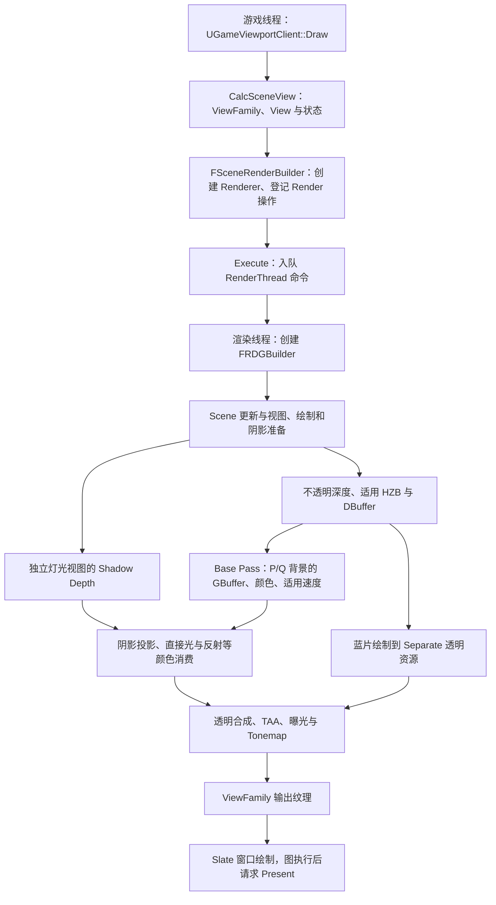
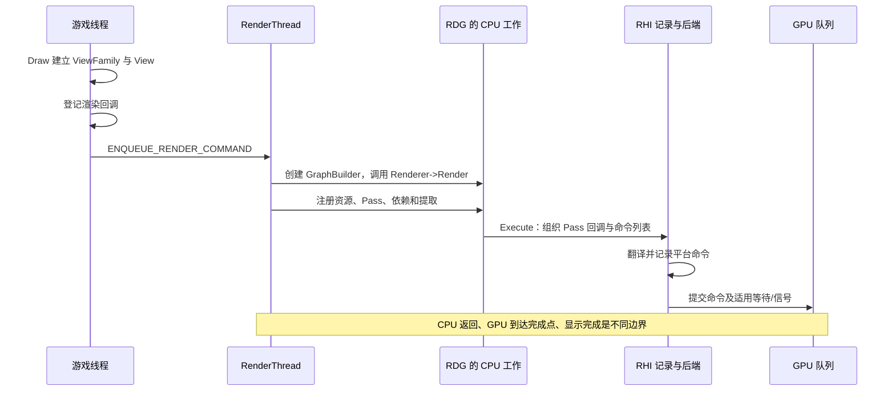

# 第 26 章：从 `UGameViewportClient::Draw` 追一帧基础画面

[返回目录](../README.md) · [本章答案](../appendices/answers/26-basic-frame-walkthrough.md) · [一帧总览](00-frame-overview.md)

> **版本与范围：**UE 5.7.4，CL 51494982，Windows、D3D12、SM6、桌面延迟渲染。主线使用配置 A：Substrate、Nanite、Lumen、VSM 和 MegaLights 关闭，普通静态网格、传统 GBuffer、TAA、SSR、手动曝光和 1280 × 720 Standalone。红方块 P 与蓝色透明薄片 Q 沿用全书定义。
>
> **证据边界：**本章是本地源码静态阅读，没有启动编辑器、抓帧或测量 GPU 时间。`[源码已确认]`表示能定位到函数与条件；`[教学简化]`表示为阅读而折叠的关系或手算；`[尚未验证]`表示读者需要在自己的项目运行核对。源码中 C++ 调用先后是调度与依赖线索，不自动等于 GPU 时间线。

## 26.1 学习目标与前置知识

完成本章后，你应能沿 UE 5.7 的主视口入口找到真实渲染回调，为 P/Q 写出深度、属性、颜色和历史的生产消费关系，并把一条 Draw 和一条 Dispatch 追到 RHI 与 D3D12。最后，应能解释主场景输出、窗口呈现请求和实际显示之间还隔着什么。

必要前置知识是第 06～10 章的场景、线程、RDG 与 RHI，以及第 11～20 章的基础渲染阶段。第五篇的现代功能不是配置 A 跟读的前提；需要辨认条件分支时，再回查对应章节。

前面的章节已经分别解释过 View、Scene、可见性、Mesh Pass、深度、GBuffer、阴影、光照、透明、TAA 和 Present。初学者真正难的地方是把它们放回同一帧：哪一层首先收到请求？哪个对象拥有 P 的变换？哪个 Pass 生产深度，谁消费它？为什么同一帧可以出现几张 RDG 图？为什么 `GraphBuilder.Execute()` 返回后仍不能说显示器已经更新？

本章不再从头定义所有术语，而是建立一条可以照着源码走的路线。每个节点都记录四件事：调用方、收到的数据、交给谁、不能据此推断什么。这样读到陌生功能时，可以用同一方法扩展，而不是背一条“固定渲染顺序”。

| 八维问题 | 本次整帧跟读的约定 |
|---|---|
| 作用 | 把一次窗口请求追到可呈现图像，并关联同一观察的中间资料 |
| 原因 | 每章局部正确仍可能在线程、时间、空间与表示的交接处被错误拼接 |
| 输入 | 已准备 Scene、主 View、配置 A、适用历史和窗口目标 |
| 过程 | 跟调用和参数，展开两个真实 Pass，再核对资源消费者 |
| 输出 | 带条件的阅读记录、P/Q 账本，以及待运行核验的检查点 |
| 实现 | Viewport、SceneRenderBuilder、Renderer、RDG、RHI、Slate 与 DXGI |
| 条件 | 当前版本、视图类型、项目和会话设置、资产状态均与本章一致 |
| 成本与误区 | 记录、执行与等待分层记账，不用函数名或单个计时替代整条证据链 |

配置 A 的对象仍是地面、红 Cube、金属 Sphere、方向光、点光源和蓝色透明 Plane。P 是方块未被薄片覆盖的屏幕位置，Q 是投影重叠的位置。P/Q 是观察位置，不是引擎为像素保存的身份。薄片使用 Unlit、Translucent、Two Sided、Opacity 0.35 和自发光 `(30,180,300)`；它不会写普通不透明 GBuffer 深度。

### 26.1.1 配置和观察入口

配置附录规定默认 RHI 为 DX12、目标 Shader 格式含 SM6、前向渲染和硬件光追关闭、静态光照关闭、DBuffer 开启、早期深度默认策略、Velocity 在 Base Pass 写入。Standalone 会话使用 `r.SetRes 1280x720w`、动态分辨率 0、主次屏幕比例 100，并关闭 Bloom、DOF、Motion Blur 和雾质量。手动曝光由唯一 PPV 固定，ISO 100、快门倒数 60、F-stop 4、补偿 0，EV100 约 9.907。

为把本次跟读落到一条透明和阴影分支，本章另明确：蓝片选择 Translucency Pass 的 After DOF，保持 `r.SeparateTranslucency=1`、透明比例 100%，并在运行时核对实际目标尺寸；薄片 Cast Shadow 保持关闭。`r.shadow.ShadowMapsRenderEarly=0`、`r.BasePassWriteDepthEvenWithFullPrepass=0`，不添加 SceneCapture、Planar Reflection、水、天空或额外 View Extension。它们是这次阅读的补充条件，不宣称所有 A 工程默认值必然如此。

这些值是阅读条件，不是当前机器已经验证的运行事实。项目配置值、控制变量注册初值和最终 View 设置可能不同。读一帧之前先记录进程、窗口客户区、相机、ShowFlags、资产构建状态和当前 CVar，避免把编辑器视口或旧进程的结果混入。

## 26.2 一帧的总图：先区分请求与资源依赖

[打开基础一帧依赖静态图](../assets/diagrams/26-basic-frame-walkthrough-1.png)



**[教学简化]**图展示请求与资源依赖，阴影分支不表示必须先于 Base Pass 生成；本章固定非提前普通阴影路径，在主调度的 Base Pass 后登记阴影深度。真实渲染器还会根据 View、ShowFlags、输出类型、扩展、历史和平台能力增删分支。图中 CPU 节点“登记”不等于 GPU 已完成，多条箭头也不等于多个物理队列。

### 26.2.1 先给每个阶段写“生产者→消费者”

| 数据 | 主要生产者 | 当前帧消费者 | 不应写成 |
|---|---|---|---|
| `FSceneView` / `ViewFamily` | LocalPlayer、Viewport | Renderer、View Extension | 一张已经渲染好的图片 |
| Primitive / Instance 数据 | Scene 更新、GPU Scene 上传 | CPU/GPU 可见性、Shader | 所有对象本帧都可见 |
| Scene Depth / HZB | 本章普通 PrePass、HZB Pass | 遮挡、透明、AO、光照 | P 的最终颜色 |
| GBuffer / Scene Color | Base Pass、光照与合成 | AO、直接光、反射、后处理 | 显示器 RGB |
| Velocity / History | Base Pass、TAA、提取 | TAA、Motion Blur、下一帧 | 本帧永久真值 |
| ViewFamily 输出 | 后处理和合成 | SceneViewport、Slate、Present | 已经被面板显示 |

这张表是源码阅读的第一张“资料账本”。遇到一个纹理名，先问谁写、何时写、哪个 ViewRect、是否预曝光、谁读以及资源何时离开当前 RDG。只记名字会把 `SceneColor`、`BackBuffer` 和历史纹理误当成同一对象。

## 26.3 游戏线程：窗口如何形成观察请求

### 26.3.1 `UGameViewportClient::Draw` 的输入

**[源码已确认]** `UGameViewportClient::Draw` 位于 `GameViewportClient.cpp:1411`。它收到 `FViewport` 和 `FCanvas`，检查世界、玩家、视口矩形和显示条件，创建 `FSceneViewFamilyContext`，随后让 View Extensions 修改 ViewFamily。它不是“把世界画到屏幕”的单一函数，而是把窗口请求整理成渲染器可以消费的观察集合。

`FSceneViewFamily` 包含 Scene、RenderTarget、时间、显示标志、输出尺寸和 View 数组等公共信息。单人游戏只有一个 View 时看起来简单，但同一接口也能组织分屏、立体、SceneCapture 或编辑器特殊视图。一个 Camera Actor 存在不等于它自动成为 View；玩家 View Target 和捕获组件才决定是否真的请求观察。

### 26.3.2 `CalcSceneView` 形成 P/Q 所属的 View

**[源码已确认]** `ULocalPlayer::CalcSceneView` 从 872 行进入，先调用 `CalcSceneViewInitOptions`，失败时不创建 View；成功后在 919 行 `new FSceneView(ViewInitOptions)`，并在 989 行结束最终后处理设置。这里合入相机变换、投影、ViewRect、后处理设置、ViewState 和时间相关参数。

这时 P/Q 只有几何关系上的候选位置：P 射线可能先命中方块，Q 射线可能先遇到透明片再看到方块。CPU 没有从屏幕像素反向计算颜色，也没有把 Q 写成“透明像素对象”。`ViewState` 可能携带前帧历史，但历史有效性需由每种算法单独判断。

### 26.3.3 Standalone 与编辑器视口不是同一条证据

配置附录要求 Standalone，是为了固定游戏视口客户区、主屏幕比例和玩家相机。编辑器视口可以 Pilot 到同一 Camera，却有自己的屏幕比例、ShowFlags 和曝光显示。`r.SetRes` 针对游戏视图，不足以证明编辑器内部缓冲也变成 1280×720。阅读日志时应把窗口、视口和 ViewRect 分开记。

**[教学简化]**若窗口客户区是 1280×720，P 的屏幕坐标可能是 `(640,360)`；这只表示输出 ViewRect 中心附近的观察位置。主 Scene Texture 可能有对齐尺寸、多个 View 或不同输入矩形，不能把这两个整数直接当任意 GBuffer、HZB 或 Separate Translucency 纹理的坐标。

## 26.4 `FSceneRenderBuilder`：把请求变成渲染命令

### 26.4.1 先处理可能影响 Renderer 构造的工作

**[源码已确认]** `BeginRenderingViewFamilies` 在 `SceneRendering.cpp:5039` 接受一批 ViewFamily；存在 Scene 时先在 5060 行发送 End-of-Frame 更新。5167 行创建 `FSceneRenderBuilder`，随后更新延迟 SceneCapture，再调用 `CreateLinkedSceneRenderers`。延迟捕获可能提供 Custom Render Pass，因此要在主 SceneRenderer 构造前处理。

`CreateLinkedSceneRenderers` 在 `SceneRenderBuilder.cpp:472` 附近根据 Scene Feature Level 和扩展回调选择 Renderer。Windows SM6 桌面主线会使用 `FDeferredShadingSceneRenderer` 类别，但该类名本身不能替你证明 Substrate、Nanite、Lumen 或 VSM 已启用；每项功能仍看后续条件。

### 26.4.2 `AddRenderer` 登记的是工作函数

`SceneRendering.cpp:5204` 调用 `SceneRenderBuilder.AddRenderer`，登记 Renderer、事件名和函数对象。函数对象调用 `RenderViewFamily_RenderThread` 后返回 `true`。5217 行调用 `SceneRenderBuilder.Execute()`。

这里有两个容易犯的错误。第一，`AddRenderer` 不会立即执行完整 Renderer；它只是把工作加入构建器。第二，`Execute` 也不是 GPU 完成通知；它会把 Render 操作安排到渲染线程。

**[源码已确认]** `SceneRenderBuilder.cpp:759` 的处理器对 Render 操作执行 `ENQUEUE_RENDER_COMMAND(SceneRenderBuilder_Render)`。命令体在 872 行创建局部 `FRDGBuilder`，调用登记函数，最后在 915 行 `GraphBuilder.Execute()`；最后一个 Renderer 还设置 Flush Resources RHI。这里每个 Render 操作创建的 RDG 范围是局部的，不是“整帧只有一个 GraphBuilder”。

[打开请求、命令与 GPU 静态图](../assets/diagrams/26-basic-frame-walkthrough-2.png)



**[教学简化]**RDG 栏表示 CPU 软件工作，不是一条独立物理线程；回调可以由渲染侧或任务线程记录。图省略具体 RHI 线程模式、异步计算与 GPU 完成事件，没有假设每次渲染回调都等待 GPU。

### 26.4.3 线程交接的最小记录

阅读一条命令时，至少记录：创建线程、执行线程、捕获的对象所有权、是否复制输入、何时需要 Fence。Scene Proxy 在第 06 章已经说明，游戏对象变化会通过渲染命令进入 Scene 更新；渲染线程不能在任意时间安全读取 UObject 的可变字段。

`FRenderCommandFence` 默认描述 RenderThread 级别的消费；RHI Submission Event 描述命令是否交给提交管道；GPU Fence 或 D3D12 SyncPoint 才能在特定协议下说明 GPU 进度。把其中任一个简写成“帧完成”都会产生错误的生命周期结论。

## 26.5 渲染线程开始：`OnRenderBegin` 与 Scene 更新

### 26.5.1 Scene 更新通过回调推进准备

**[源码已确认]** `FDeferredShadingSceneRenderer::Render` 在 1790 行调用 `OnRenderBegin`。`OnRenderBegin` 先定义 `PostStaticMeshUpdate` 回调，然后在具有 `SceneUpdateInputs` 时，于 4073 行调用 `Scene->Update`。Scene 更新在适当位置调用前述回调，回调内 4058 行才启动 `LaunchVisibilityTasks`，并在并行准备条件下把相关性任务加入 GPU Scene 更新前置。不能把 Lambda 在文件中定义得早，读成它已经先执行。

这段组织解释了“可见性和 GPU Scene 为什么能重叠”。CPU 可以先准备包围体、View Relevance、动态网格和可见性任务；GPU Scene 上传必须等待相关数据满足。并行任务完成不等于 GPU 已经执行可见性 Shader，反之 GPU 正在执行上一批命令时，CPU 也可能准备下一批参数。

### 26.5.2 P 的资料账本从哪开始

对 P 对应的红方块，Scene 更新可能包含 Primitive 变换、Bounds、材质缓存索引、GPU Scene Instance 数据和速度相关前帧信息。它们的消费者不同：Bounds 供 CPU/GPU 可见性，Instance 数据供实例筛选和 Shader，本章的材质缓存供 Mesh Pass，前帧信息供 Velocity/TAA。

对 Q，蓝片仍有自己的 Primitive、Bounds、材质相关性和透明 Pass 选择，但它不会因为投影覆盖方块就进入不透明 GBuffer。透明材质的深度写入、排序、Separate Translucency 和合成位置由透明系统决定。

### 26.5.3 View Relevance 是分流条件

`PrimitiveSceneProxy->GetViewRelevance(&View)` 会给出主 Pass、深度、阴影、透明等相关性。普通方块可能进入 Depth、Base Pass、Shadow 和 Velocity；本例蓝片进入适用透明 Pass，Cast Shadow 已关闭，且不进入传统不透明 Base Pass。一个对象有 Draw Relevance，不等于它进入每个 Pass。

CPU 候选集合、GPU 实例筛选、普通 Mesh Pass 和 Nanite Cluster 剔除是不同粒度。配置 A 关闭 Nanite，因此本章主线的方块和球走普通静态网格；第 22 章的 Nanite 章节才追另一套 Cluster、VisBuffer 与计算着色路线。不要从 `FDeferredShadingSceneRenderer` 的共同入口推断两者共享同一条几何实现。

## 26.6 预通道、HZB 与普通可见性

### 26.6.1 为什么 A 仍先看深度

源码在渲染器中计算 `bIsEarlyDepthComplete`，当早期深度模式为 `DDM_AllOpaque` 或 `DDM_AllOpaqueNoVelocity` 时为真。按 A 的平台条件，DBuffer 支持会令 `ShouldForceFullDepthPass` 成立，即使场景没有贴花。再结合 `r.VelocityOutputPass=1`，`GetEarlyZPassMode` 选择 `DDM_AllOpaque`，因此本次主线具有完整早期深度，见 [S26-11](#s26-11)。实际运行仍需核对设置确实生效。

本章同时固定 Base Pass 不强制重写完整早期深度，因此通常取得 `DepthRead_StencilWrite` 访问。访问权限、比较函数与模板写入要分别记录：普通方块仍用 NearOrEqual 比较，不因深度只读或预通道完整就自动改成 Equal。遇到 Equal 应继续查早期 Mask、抖动 LOD 等对应分支。

`RenderPrePass` 位于 `DepthRendering.cpp:525`，通过 Depth Pass Mesh Processor 准备位置、深度 Shader 和深度状态，写入 Scene Depth。颜色目标不参与普通深度预通道。P 在这里如果进入不透明深度集合，只贡献深度覆盖；Q 的 Translucent 薄片通常不写这份不透明深度。

### 26.6.2 HZB 与遮挡的消费者

Scene Depth 可以用于构建 HZB；HZB 又可被 CPU 查询、GPU 实例筛选、普通遮挡和其他屏幕空间效果消费。`RenderOcclusion` 根据 `bOcclusionBeforeBasePass` 决定遮挡工作是在 Base Pass 前还是之后。查询读回还可能消费上一批 GPU 结果，不能把本帧刚添加的 Raster Pass 当成 CPU 已经可读的布尔值。

**[源码已确认]**在普通最终颜色分支中，`bOcclusionBeforeBasePass` 由 `DDM_AllOccluders` 或完整早期深度条件决定。`RenderOcclusionLambda` 组织 HZB、查询和适用 Froxel 工作，之后调用 `CompositionLighting.ProcessAfterOcclusion`。这不是 Nanite 的两阶段 Cluster HZB；同名 HZB 概念在不同消费者里仍要看生产和比较规则。

### 26.6.3 纸面例：遮挡结果不等于颜色结果

**[教学简化]**假设 P 的 Bounds 通过视锥但被一堵不透明墙遮挡，CPU/GPU 遮挡保守判定它不可见。正确结果是后续 Base Pass 不必为该被遮挡表面产生有效像素；它不是把 P 的颜色改成黑色，也不是从 Scene Color 删除一个已经存在的红色。若墙移开，历史查询需要重新验证，P 可能再次进入候选。

这说明“可见性输出”与“颜色输出”必须分账。遮挡可以省掉后续工作，但它本身不写 P 的 GBuffer，也不生成最终 Scene Color。

## 26.7 深度、阴影和 Base Pass：P 的表面资料何时成立

### 26.7.1 阴影是另一台相机

配置 A 使用普通 Shadow Maps。本次固定桌面延迟、`r.shadow.ShadowMapsRenderEarly=0`，所以沿渲染器 3130 行的非提前分支读 `RenderShadowDepthMaps`，不进入 2823 行的前向路线。方向光、点光源的深度目标、级联／六面投影和缓存策略不能合并成“每盏灯一张普通深度图”。

P 在主相机 Scene Depth 中较近，不代表它一定是方向光或点光的最近遮挡；屏幕外物体也可能在灯光视角挡住 P。阴影深度的消费者是阴影投影和光照，不是主相机透明排序。

### 26.7.2 DBuffer 在 Base Pass 前修改材质输入

配置 A 开启 DBuffer，但案例中没有实际贴花。`CompositionLighting.ProcessBeforeBasePass` 在适用条件下登记 DBuffer 贴花；Base Pass 再读取 DBuffer 并按材质 Decal Response 应用 Base Color、Normal、Roughness 等属性。没有贴花时仍可能创建或清除相关资源，具体是否有有效绘制看条件。

### 26.7.3 `RenderBasePass` 的普通网格分支

**[源码已确认]**渲染器在 2905 行调用 `RenderBasePass`，传入 SceneTextures、DBuffer、深度访问、InstanceCullingManager 和 Nanite 结果占位。配置 A 的普通网格 Base Pass 由 Mesh Pass 命令与 `BasePassPixelShader` 等 Shader 组织；它消费已有深度，写 GBuffer、适用 Scene Color 和 Velocity。

传统 `BasePassPixelShader.usf` 读取 `GetMaterialBaseColor`、Metallic、Roughness 等输入，在 994 行建立材质颜色，2319 行附近编码传统 GBuffer。P 的红色 Base Color 是材质输入，不是光照后屏幕红色；预曝光只作用于适用颜色目标，不应乘到法线和 Roughness。

配置 A 的 P 资料账本可以写成：

```text
局部顶点/索引 + LocalToWorld + View
    -> 深度/覆盖（Scene Depth）
    -> 材质输入 + DBuffer（如有）
    -> GBuffer 属性 + Base Pass 颜色 + Velocity（适用）
    -> 直接光、AO、反射、TAA 和 Tonemap
```

GBuffer 的法线、粗糙度和 Shading Model ID 供后续照明解释；Scene Color 的当前内容可能已含自发光或其他适用贡献。看到一个 `GBuffer` 资源名，不能推断它包含完整最终颜色。

### 26.7.4 从一条普通 Base Pass 走到原生命令

现在停在 `RenderBasePass`，选中一个实际分支深入，而不是立即跳到光照。先打开 [BasePassRendering.cpp:1608](G:/UnrealEngineInstalled/UE_5.7/Engine/Source/Runtime/Renderer/Private/BasePassRendering.cpp:1608)。并行分支分配 `FOpaqueBasePassParameters`，填写 View、BasePass Uniform Buffer、RenderTargets 和 InstanceCullingDrawParams。这些字段分别交接视图、材质共享输入、输出附件与实例绘制输入，不是一份“已经算好的颜色”。

随后 `Pass->BuildRenderingCommands` 准备实例工作和绘制参数，`AddDispatchPass` 登记一个带 `ERDGPassFlags::Raster` 的节点，其回调调用 `Pass->Dispatch`。这里的 Dispatch 是绘制命令组织接口，不能因为名字相同就标成 Compute Shader。非并行分支在 1700 行附近通过普通 AddPass 回调调用 Draw，同样要遵守附件与实例资源依赖。

继续到 [InstanceCullingContext.cpp:1673](G:/UnrealEngineInstalled/UE_5.7/Engine/Source/Runtime/Renderer/Private/InstanceCulling/InstanceCullingContext.cpp:1673)，查看 `SubmitDrawCommands` 如何为当前命令选择实例偏移、直接数量或间接参数。接着读 [MeshPassProcessor.cpp:1218](G:/UnrealEngineInstalled/UE_5.7/Engine/Source/Runtime/Renderer/Private/MeshPassProcessor.cpp:1218) 的 `SubmitDrawBegin`，核对 PSO、Shader 和资源绑定；再读 1302 行的 `SubmitDrawEnd`，确认索引与间接标志决定哪种 Draw 接口。

只选择直接索引例子时，才把链路接到 [D3D12Commands.cpp:1270](G:/UnrealEngineInstalled/UE_5.7/Engine/Source/Runtime/D3D12RHI/Private/D3D12Commands.cpp:1270)。1297 行的 `DrawIndexedInstanced` 向原生命令列表记录操作，仍然在 CPU。GPU Scene 主线也可以使用间接 Draw，此时应跟另一接口，不能强行经过这个直接函数。后端把适用列表交给队列的证据在 [D3D12Submission.cpp:827](G:/UnrealEngineInstalled/UE_5.7/Engine/Source/Runtime/D3D12RHI/Private/D3D12Submission.cpp:827) 的 `ExecuteCommandLists`。

这一段阅读的产物应是：P 所属网格的缓存或动态命令，如何连到当前 View 的输出附件、实例参数和实际 API。GPU 随后执行顶点变换、覆盖、深度和像素程序，才可能产生 P 的 GBuffer。CPU 调试器断在 `DrawIndexedInstanced`，不能据此把当前纹理内存当作已被该次 Draw 更新。

读 Shader 时还要跨过编译边界。`GetMaterialBaseColor` 等函数来自材质生成代码；`EncodeGBufferToMRT` 使用本版生成的布局接口。磁盘上旧编码分支仍存在，并不证明当前排列使用它。初学记录可以先写“生成的材质输入与布局函数”，然后沿第 04、14 章确认生成端，避免在当前帧中寻找一次实际上不应发生的材质重新编译。

## 26.8 Base Pass 之后：光照和反射的消费者链

### 26.8.1 AO 与间接光

渲染器在 3044 行附近以 `OnlyBeforeLightingDecals` 模式调用 `ProcessAfterBasePass`，3230 行再按模式处理剩余贴花与适用 AO；3265 行安排漫反射间接光／AO 合成，3339 行安排反射与天空光照。配置 A 的 AO 选择传统 SSAO、Pixel Shader、一级全分辨率；SSR 使用屏幕空间方法。A 的 GI 方法为 None，不能因通用函数名含 DiffuseIndirect 就记录成已启用动态间接光。

AO 不是把 P 的 Base Color 永久乘黑。它可以作为间接光、环境反射或特定光照项的遮蔽因子；直接光的阴影投影也有自己的遮罩。SSR 只能利用屏幕内的证据，屏外或被遮挡反射不应被当作材质错误。

### 26.8.2 `RenderLights` 消费 P 的 GBuffer

在 3314 行，`RenderLights` 接收 `SortedLightSet`。`GatherAndSortLights` 已按 View、阴影、Lighting Channel 等条件整理方向光和点光。方向光用覆盖 View 的矩形，点光使用光源体积和深度关系；光照 Shader 读取 P 的法线、Base Color、Metallic、Roughness、Shading Model 以及对应阴影遮罩。

配置 A 关闭 MegaLights，且本章不把 clustered 选择当作默认结论。应沿 `GatherAndSortLights → RenderLights → RenderLight → DeferredLightPixelMain → GetDynamicLighting` 阅读实际分支。RenderLights 返回只是 Pass 登记或命令记录阶段，不表示 GPU 已完成 P 的光照。

### 26.8.3 一个 P 的线性颜色算例

**[教学简化]**假设第一盏灯尚未乘阴影的贡献为 `(0.8,0.1,0.05)`，阴影可见率为 0.25，第二盏灯已经完成衰减与阴影处理的贡献为 `(0.1,0.1,0.1)`：

```text
Direct = (0.8,0.1,0.05) * 0.25 = (0.2,0.025,0.0125)
SceneColor_two_lights = Direct + SecondLight
                       = (0.3,0.125,0.1125)
```

这是假定同一线性、同一预曝光尺度的输入，不是本机截图值。Tonemap、颜色分级、TAA 和输出编码尚未执行。不能拿 `(0.8,0.1,0.05)` 直接要求显示器出现同样 RGB。

## 26.9 Q 的透明路线：它怎样接入同一帧

### 26.9.1 透明不进入单层不透明 GBuffer

Q 的方块背景在不透明 Base Pass 中已有 GBuffer 和 Scene Depth。蓝片作为 Translucent 进入 `RenderTranslucency`，接受对应深度测试，Shader 计算薄片颜色和不透明度，混合状态决定如何写入目标。当前 Unlit、无折射材质不需要在像素 Shader 中采样背景颜色；直接目标的混合或后续 Separate 合成才把前景与背景结合。适用的 Lit、雾或折射分支可能另读光照和场景资源。薄片的 `Tint×EmissiveStrength` 与 Opacity 不是 Base Pass 中红方块的属性覆盖。

透明 Pass 可能是 Standard、AfterDOF、AfterMotionBlur 或其他适用类型。AfterDOF 可以先写 Separate Translucency 纹理，之后在后处理阶段合成；Pass 名称说明效果位置，不保证 Draw 一定在景深 GPU 工作之后。配置 A 关闭 DOF 质量，仍需按材质和 View 条件确认它选择的透明 Pass。

### 26.9.2 Q 的资料账本

```text
方块不透明 GBuffer + Scene Depth
    -> 透明深度测试与后续背景合成所需数据
薄片材质：Cs=(30,180,300)，a=0.35
    -> 透明颜色/透射目标（可能是 Separate）
    -> ComposeSeparateTranslucency 或直接合成
    -> TAA/后处理输入
```

**[教学简化]**若假设透明颜色已经处在线性、同一曝光尺度，背景为 `(0.3,0.125,0.1125)`，则普通 source-over 可写成 `0.35*Cs + 0.65*背景`。但本例 `Cs` 具有高亮自发光，实际还会受到预曝光、透明目标格式、雾、合成位置和 Tonemap 影响，所以不要把该结果当作屏幕 RGB。

Q 的薄片不写普通主深度，因此透明排序和深度测试不能被简化成“谁最后 Draw 谁覆盖”。半透明层还可能依赖 Separate Translucency 的深度邻居和 ViewRect。读取 Q 时，应说明自己读的是透明目标、合成后的 Scene Color，还是最终后处理输出。

### 26.9.3 完整数值账本：同一尺度下追到透明合成

先把前一小例放下，建立一组独立且完整的账目。**[教学简化]**人为给定不透明光照后、透明前的未预曝光线性背景为 `C_b=(96,24,12)`，并假设 P 和 Q 背后的方块此时恰好相同。这个背景值不是从 Base Color 直接换算，也不是本机照明测量。另设预曝光 `p=1/960`，所有参与颜色使用同一尺度，没有折射、雾和额外材料效果。

| 检查点 | P | Q |
|---|---|---|
| 原始不透明材质 | 方块 Base Color `(0.8,0.05,0.03)` 等属性 | 同一材质，但空间位置与插值仍各自计算 |
| 主 Scene Depth | 方块最近适用不透明表面 | 仍是方块，较近蓝片不写本份深度 |
| GBuffer | 方块法线、金属度、粗糙度等 | 方块属性，尚无蓝片的完整表面层 |
| 本例透明前背景 | `C_b*p=(0.1,0.025,0.0125)` | 同样人为指定的背景存储值 |
| Separate 透明资源 | 无片覆盖：颜色 0，背景权重 1 | 有片覆盖：颜色 D，背景权重 T |
| 合成颜色 | 仍为背景存储值 | `D+T*(C_b*p)` |
| 主时间处理 | 当前颜色与适用运动、深度、历史 | 含蓝片当前颜色，同时仍须处理背景深度和运动边界 |

薄片未预曝光的 Shader 颜色为 `C_f=(30,180,300)`，故透明输入为 `C_f*p=(0.03125,0.1875,0.3125)`。Separate 目标按“已累计颜色 D、剩余背景权重 T”的语义，从 `(D,T)=(0,1)` 开始。单层蓝片绘制后的账目为：

```text
D = 0.35 * C_f * p = (0.0109375,0.065625,0.109375)
T = 1 - 0.35 = 0.65
Q = D + T * (C_b*p)
  = (0.0109375,0.065625,0.109375)
    + (0.065,0.01625,0.008125)
  = (0.0759375,0.081875,0.1175)
```

再从未预曝光端复核：`0.35*C_f+0.65*C_b=(72.9,78.6,112.8)`，乘 `1/960` 得到同一 Q。两种顺序一致，是因为这里所有线性运算采用了同一标度。该例同时说明蓝片可能让红通道下降，而让绿、蓝通道提高；“加入发光颜色”不意味着每个通道都只能变亮。

这组表示有直接源码依据：[TranslucentRendering.cpp:918](G:/UnrealEngineInstalled/UE_5.7/Engine/Source/Runtime/Renderer/Private/TranslucentRendering.cpp:918) 的独立目标使用 Black 清除，而 [RHI.cpp:125](G:/UnrealEngineInstalled/UE_5.7/Engine/Source/Runtime/RHI/Private/RHI.cpp:125) 中 Black 的 Alpha 为 1；[ComposeSeparateTranslucency.usf:98](G:/UnrealEngineInstalled/UE_5.7/Engine/Shaders/Private/ComposeSeparateTranslucency.usf:98) 以透明 Alpha 乘背景再加透明 RGB。不要用通用“覆盖 Alpha 越大越不透明”的解释替代这里的 T。

沿本章 After DOF、TAA、无自定义后处理材质的选择，`PostProcessing.cpp` 读取 PostDOF 资源，在适用重组合成或普通 Separate 合成后把结果交给主 TAA。代码 897 行附近的普通分支使用 `ComposeToNewSceneColor`，返回一个新的 ScreenPassTexture。C++ 变量仍叫 SceneColor，但它指向的资源和内容阶段已经变化，应在账本里写作“透明合成后”，而非仅记录变量名。

若实际 Separate 目标采用降采样，Q 可能还读取邻域深度与透明样本，本例单位置算式不能预测边缘过滤。检查本次选定的 100% 实际尺寸，就是为了把这类差异与混合公式错误区分开。

## 26.10 TAA、曝光、Tonemap 与 ViewFamily 输出

### 26.10.1 时间处理消费什么

配置 A 选择 TAA。`AddPostProcessingPasses` 组织当前 Scene Color、Scene Depth、Velocity、抖动、TAA History 和 PreExposure。`AddTemporalAAPass` 提供 `View.PreExposure / View.PrevViewInfo.SceneColorPreExposure` 参数，Shader 用它把有效历史校正到当前尺度，再按速度、邻域和有效性重建。

P 的静止方块也可能有非零屏幕差异，因为投影抖动改变了采样位置；WPO 或物体变换还会改变真实速度。Q 的最终透明颜色可能与方块背景共享部分速度，却不能假定薄片的所有颜色变化都由背景速度解释。

### 26.10.2 实读 TAA 的当前输出与未来历史

从 [PostProcessing.cpp:982](G:/UnrealEngineInstalled/UE_5.7/Engine/Source/Runtime/Renderer/Private/PostProcess/PostProcessing.cpp:982) 的 TAA 分支进入 `AddGen4MainTemporalAAPasses`，不要进入旁边的 TSR 或第三方分支。再到 [TemporalAA.cpp:1046](G:/UnrealEngineInstalled/UE_5.7/Engine/Source/Runtime/Renderer/Private/PostProcess/TemporalAA.cpp:1046)，核对当前颜色、深度和速度分别来自 `PassInputs`；旧历史来自 `View.PrevViewInfo.TemporalAAHistory`，新历史目标来自 `View.ViewState->PrevFrameViewInfo.TemporalAAHistory`。

继续读 1055 行的 `AddTemporalAAPass`，它接收上述输入而不是隐式从窗口重新取色。571 行起的实现创建新输出、登记适用旧历史，填充曝光修正与质量参数。桌面计算分支通过 `FTemporalAACS` 的参数声明输出 UAV，再调用 `FComputeShaderUtils::AddPass`；Shader 注册在 397 行，真正入口为 `TemporalAA.usf` 的 `MainCS`。这把“C++ 参数成员”和“Shader 从哪读、向哪写”连成可检查的一次 Pass。

计算 Shader 不自动意味着 Async Compute。本处使用普通 Compute 重载，是否另有强制政策要另记。也不要把桌面计算分支后面的移动 Pixel Shader 分支拼到同一次执行里。若使用本章理想 1280×720 有效矩形与 8×8 组，调度覆盖为 `160×90=14400` 个组；这个计数只说明工作覆盖，不提供 GPU 时间。

最后停在 988 行的 `QueueTextureExtraction`。它将符合条件的新历史交给图外持有者，供未来图注册，既不是 CPU 下载，也不是保存一份 PNG。同时返回的当前结果马上可被本图后续 Tonemap 消费。历史提取和当前输出是两个用途：不能因为历史禁止写入，就推断本帧完全没有 TAA 结果。

对前一节的数值账本，再额外假设远离几何边缘、历史重投影有效、邻域颜色一致且曝光尺度匹配，教学模型可以让 TAA 前后颜色不变。真实边缘、去遮挡或颜色动画不满足这些前提，所以无法只用当前 Q 和一个固定权重手算引擎整套 TAA。当前样本、历史样本及拒绝条件都应成为记录的一部分。

### 26.10.3 手动曝光不是跳过颜色变换

Manual 曝光固定的是曝光选择。它不跳过 TAA、Bloom（本配置关闭）、Tonemap、颜色 LUT 或输出编码。Tonemap Shader 读取预曝光倒数、全局曝光和适用颜色项，之后可加入 Bloom 与 LUT；本配置关闭 Bloom，但不关闭整条后处理链。

继续上述教学账目，若再指定全局曝光 `E=1/960`、局部曝光倍率 1，进入色调曲线前的颜色为 `C_exposed=C_stored*(E/p)`。由于本例 `E=p`，数值保持为 P 的 `(0.1,0.025,0.0125)` 与 Q 的 `(0.0759375,0.081875,0.1175)`。这是额外给定的倍率算例，不是从 EV100 一项无条件推出实际 E。

接下来是实际颜色 LUT、Tone Curve、输出设备编码等变换，不能继续把这两个数当作最终屏幕值。本章到此保留一个明确的未知项：`C_display=实际输出变换(C_exposed, 输出设置)`。读者若需要精确最终值，应记录对应 Shader 输入、LUT 和输出设置；随手套 Reinhard 或给线性值做一次 `pow(1/2.2)` 都不能替代当前引擎路线。

### 26.10.4 从 Scene Color 到窗口

`FDeferredShadingSceneRenderer::Render` 在 3943 行附近按 View 调用 `AddPostProcessingPasses`，最后通过 `OnRenderFinish` 和 `QueueSceneTextureExtractions` 交接历史与输出。ViewFamily 输出纹理可能仍不是 Back Buffer。SceneViewport、Slate 窗口绘制和 UI 合成可以继续读写或复制它。

## 26.11 为什么一帧有多个 RDG 和多个“完成”

主 SceneRenderBuilder Render 节点创建一个局部 RDG。SceneCapture、Planar Reflection、Slate Widget 和窗口绘制可能创建其他 RDG。SlateRHIRenderer 在 `SlateRHIRenderer.cpp:1087` 创建 Slate GraphBuilder，1102 行执行，之后 1112 行进入 `PresentWindow_RenderThread`，945 行调用 `EndDrawingViewport`。

因此不能把所有 `GraphBuilder.Execute()` 拼成单一“整帧 Execute”。一个图只对它登记的资源和 Pass 负责；外部历史、交换链和其他图通过资源注册、提取、Fence 或提交顺序建立联系。

Present 的边界也要拆开：RDG Execute 完成图的命令组织，RHI 可能继续翻译和提交，D3D12 交换链 `Present` 请求窗口呈现，Windows 合成器和面板再决定何时可见。`WaitForSubmission` 只保证适用提交线程关系，不等同于 GPU 完整空闲；即使 GPU Fence 达到某个值，也不等于人眼已经看到 P/Q。

## 26.12 初学者可照做的源码阅读路线

**[尚未验证]**以下路线只要求静态阅读和可选的只读捕获，不要求修改引擎。每一步都写一行“收到什么→写出什么→下一位消费者”，并保留确切版本和行号。

1. 从 `UGameViewportClient::Draw` 1411 行开始，记录 Viewport、Canvas、ViewFamily、玩家数量和最终 `BeginRenderingViewFamily` 调用；不要在这里写“开始执行 GPU”。
2. 进入 `ULocalPlayer::CalcSceneView` 872、`new FSceneView` 919 和 `EndFinalPostprocessSettings` 989，记录 Camera、ViewRect、Projection、ViewState、曝光和 ShowFlags。
3. 进入 `SceneRendering.cpp:5167`，确认 SceneRenderBuilder、延迟捕获、Linked Renderer、`AddRenderer` 和 `Execute` 的先后；把调用方和被登记函数分两栏。
4. 进入 `SceneRenderBuilder.cpp:829` 的 RenderThread 命令，再到 872 的 `FRDGBuilder` 和 915 的 `Execute`，记录线程交接、Renderer 输入和最后一个 Renderer 的资源 Flush 条件。
5. 进入 `DeferredShadingRenderer.cpp:1790` 的 `OnRenderBegin` 调用，跟到 Scene 更新回调、`LaunchVisibilityTasks`、`BeginInitViews`／`EndInitViews`；区分 CPU 上传准备、GPU 上传执行和各类可见性处理。
6. 进入 `RenderPrePass` 525 行、`RenderOcclusion` 和 `bIsEarlyDepthComplete` 2027 行，确认 P 的深度生产者、HZB 消费者与遮挡位置；把 Q 的 Translucent 资格单独标注。
7. 对照 2849 的提前 Shadow Depth 条件，实际沿 3130 的非提前分支；检查 2859 的 DBuffer、2905 的 `RenderBasePass`，再读 `BasePassPixelShader.usf:994/2319`，记录 P 的材质属性、颜色、GBuffer 与 Velocity 分账。
8. 进入 3044 的 `ProcessAfterBasePass`、3265 的 AO/间接光、3314 的 `RenderLights`、3339 的反射；每个 Pass 写明读取哪个表面资源，不能把“Lighting”合成单个函数。
9. 进入 3654 附近的 `RenderTranslucency` 和 `PostProcessing.cpp:388` 的 PostDOF 资源，再读透明合成；记录 Q 是哪张透明目标、何时回到 Scene Color。
10. 进入 3943 的 `AddPostProcessingPasses`、TAA 历史登记、Tonemap 以及 SceneViewport／Slate 入口，最后读 `D3D12Viewport.cpp` 和 Windows `PresentInternal`。记录每个完成点的范围，不写“Present 就是显示完成”。

阅读笔记推荐使用以下字段：`调用方 | 输入资源 | 输出资源 | 线程 | 条件 | 下一消费者 | 不能推断`。遇到同名资源，追加 `ViewIndex、ViewRect、格式、预曝光、历史所属批次和有效性`。这套字段比按文件顺序抄函数名更容易发现跨阶段误读。

### 26.12.1 用调用点验证入口，别从文件第一行顺读

第一次跟读可以在编辑器中建立六个书签：Viewport、SceneRenderBuilder 的登记处、RenderThread 命令体、Deferred Render、Base Pass 参数、Post Processing 参数。先只沿这个外圈走完，再展开前面选定的 Base Pass 和 TAA 两个 Pass。某个辅助函数非常大时，先写下它必须返回的资源或任务句柄，返回调用点检查谁使用，再决定是否需要深入所有内部细节。

不启动 UE 也能执行下面的只读搜索。第一行设定本章使用的引擎位置，后两行分别找登记调用和真正执行点：

```powershell
$ueEnginePath = 'G:/UnrealEngineInstalled/UE_5.7/Engine'
rg -n 'AddRenderer|SceneRenderBuilder.Execute' "$ueEnginePath/Source/Runtime/Renderer/Private/SceneRendering.cpp"
rg -n 'SceneRenderBuilder_Render|FRDGBuilder GraphBuilder|RenderNode.Function|GraphBuilder.Execute' "$ueEnginePath/Source/Runtime/Renderer/Private/SceneRenderBuilder.cpp"
```

读到 Lambda 时先圈出结束大括号，确认它被保存、立即调用还是交给任务系统。读到 `CreateTexture` 时记资源用途，不认定此刻 GPU 已分配并写好；读到 `SetupTask.Wait` 时记正在等待哪类 CPU 数据，不认定正在等 GPU；读到 Shader 名字时继续查注册入口、频率与排列条件，不根据文件名猜运行阶段。

### 26.12.2 从一份可审核记录结束阅读

完成后，至少提交三份短记录给自己复核。第一份记录主 View 的来源、配置、历史有效性和输出范围；第二份记录 P/Q 的数据阶段，包含深度、属性、预曝光颜色、透明 D/T 和时间结果；第三份记录一条 Draw 和一条 Dispatch 的参数、依赖与后端接口。每条源码结论附版本和入口，每条运行结论附具体工具与观察会话。

若具备与安装版匹配的可调试二进制和符号，可以在上述 CPU 入口设置只读断点。源码可读不等于本机已经安装匹配 PDB，也不要求初学者立刻重新编译整个引擎。没有符号时先完成静态记录；不要为了得到一条更直的调用栈随意关闭 RHI 线程、打开 Bypass，然后把改变后的时序作为正常配置 A 的证据。

检查帧捕获时优先定位实际资源写入，再追前一个生产者与后一个读取者。若 Q 的透明目标有颜色而最终窗口没有，检查合成和后处理；若透明目标根本没有该表面，退回 View Relevance、绘制列表和深度测试。这样每次排查都沿一个具体断开的交接点继续，而不是同时调整材质、曝光与灯光。

## 26.13 成本、故障和证据优先级

一帧的 CPU 成本包括 View 构建、Scene 更新、可见性任务、Mesh Pass／Light 排序、RDG 编译和 RHI 命令记录；GPU 成本包括深度、HZB、阴影、GBuffer、光照、透明、TAA 和后处理；I/O、Shader 编译和资源准备可能位于稳定帧之外。不能拿 `RenderLights` 的 CPU 包围时间替代 GPU 光照时间，也不能拿窗口 Present 阻塞时间全归因于 Tonemap。

排查 P 不见时，先检查相机和 ViewRect，再查 Scene Proxy／资产状态、View Relevance、深度与遮挡，最后查材质和光照。排查 Q 不见时，先查 Blend Mode、透明 Pass、Separate 资源、深度关系和合成位置；不要先改 Base Color。

证据需要相互补足：源码解释可用路径与条件，实际设置和捕获证明这次运行采用的路径，资源检查解释中间值，可视化帮助选择观察位置。源码里有一个分支不能压过运行证据而证明它已经执行；肉眼变化也不能单独证明哪个函数产生了变化。

## 26.14 关键概念回顾

一帧从 View 请求开始，经过场景更新和条件性可见性准备，由 `FSceneRenderBuilder` 把工作交到渲染侧。Renderer 建立资源和 Pass，RDG 组织依赖与命令回调，RHI 与 D3D12 再记录和提交设备工作。每一层的返回都只说明自己的完成范围。

P 的深度、GBuffer 属性、光照颜色和时间结果是不同资料。Q 保留不透明背景的深度与属性，透明薄片沿自己的绘制和合成路线加入颜色。Separate 目标中的累计颜色 D 和背景权重 T、颜色的 PreExposure 标度、历史有效性，都需要在交接时明确。

源码串联应保留当前配置、View、线程、资源生产者与消费者。主场景与 Slate 可以使用不同 RDG；图执行、RHI 提交、GPU 完成、Present 请求和屏幕扫描显示不能合成一个时间点。

## 26.15 理解检查题

1. `UGameViewportClient::Draw`、`ULocalPlayer::CalcSceneView`、`FSceneRenderBuilder::Execute`、`FRDGBuilder::Execute` 分别负责什么？为什么不能把它们都叫“渲染完成”？
2. 对 P 写出一条生产者到消费者链：Scene 更新、深度预通道、DBuffer、Base Pass、直接光照和 TAA 各自提供或消费什么？Q 在哪一步分流？
3. 当前早期深度完整，普通遮挡在 Base Pass 前执行。列出一个合理的依赖顺序，并说明为什么 C++ 调用顺序不能直接当成 GPU 实际时间线。若 `DDM_AllOccluders` 成立但早期深度不完整，遮挡位置有什么可能变化？
4. 解释为什么主场景 RDG、Slate RDG 和 SceneCapture RDG 可以同时存在。`GraphBuilder.Execute()`、RHI Submission Event、GPU Fence、Present 分别覆盖什么边界？
5. 给出一条可复现的源码阅读路线，追踪 Q 从透明材质输入 `(30,180,300), 0.35` 到最终窗口输出至少经过哪些消费者。指出两处不能用“看起来更蓝”证明的中间结论。

答案见[第 26 章答案](../appendices/answers/26-basic-frame-walkthrough.md)。

## 26.16 源码索引

<a id="s26-01"></a>
**S26-01：窗口与 View。** [GameViewportClient.cpp:1411](G:/UnrealEngineInstalled/UE_5.7/Engine/Source/Runtime/Engine/Private/GameViewportClient.cpp:1411) 创建 ViewFamily；[LocalPlayer.cpp:872](G:/UnrealEngineInstalled/UE_5.7/Engine/Source/Runtime/Engine/Private/LocalPlayer.cpp:872) 进入 `CalcSceneView`；[LocalPlayer.cpp:919](G:/UnrealEngineInstalled/UE_5.7/Engine/Source/Runtime/Engine/Private/LocalPlayer.cpp:919) 创建 View；[LocalPlayer.cpp:989](G:/UnrealEngineInstalled/UE_5.7/Engine/Source/Runtime/Engine/Private/LocalPlayer.cpp:989) 完成最终后处理设置。

<a id="s26-02"></a>
**S26-02：SceneRenderBuilder。** [SceneRendering.cpp:5039](G:/UnrealEngineInstalled/UE_5.7/Engine/Source/Runtime/Renderer/Private/SceneRendering.cpp:5039) 接收 ViewFamily 批次；[SceneRendering.cpp:5167](G:/UnrealEngineInstalled/UE_5.7/Engine/Source/Runtime/Renderer/Private/SceneRendering.cpp:5167) 创建 Builder；[SceneRendering.cpp:5204](G:/UnrealEngineInstalled/UE_5.7/Engine/Source/Runtime/Renderer/Private/SceneRendering.cpp:5204) 登记 Renderer；[SceneRendering.cpp:5217](G:/UnrealEngineInstalled/UE_5.7/Engine/Source/Runtime/Renderer/Private/SceneRendering.cpp:5217) 调用 Builder Execute。

<a id="s26-03"></a>
**S26-03：线程交接与 RDG。** [SceneRenderBuilder.cpp:829](G:/UnrealEngineInstalled/UE_5.7/Engine/Source/Runtime/Renderer/Private/SceneRenderBuilder.cpp:829) 入队渲染命令；[SceneRenderBuilder.cpp:872](G:/UnrealEngineInstalled/UE_5.7/Engine/Source/Runtime/Renderer/Private/SceneRenderBuilder.cpp:872) 创建局部 `FRDGBuilder`；[SceneRenderBuilder.cpp:915](G:/UnrealEngineInstalled/UE_5.7/Engine/Source/Runtime/Renderer/Private/SceneRenderBuilder.cpp:915) 执行图。

<a id="s26-04"></a>
**S26-04：Scene 更新与可见性。** [SceneRendering.cpp:3983](G:/UnrealEngineInstalled/UE_5.7/Engine/Source/Runtime/Renderer/Private/SceneRendering.cpp:3983) 设置更新回调；[SceneRendering.cpp:4058](G:/UnrealEngineInstalled/UE_5.7/Engine/Source/Runtime/Renderer/Private/SceneRendering.cpp:4058) 启动可见性任务；[SceneRendering.cpp:4073](G:/UnrealEngineInstalled/UE_5.7/Engine/Source/Runtime/Renderer/Private/SceneRendering.cpp:4073) 调用 Scene Update；[SceneVisibility.cpp:5852](G:/UnrealEngineInstalled/UE_5.7/Engine/Source/Runtime/Renderer/Private/SceneVisibility.cpp:5852) 与 6000 行推进 InitViews。

<a id="s26-05"></a>
**S26-05：深度、HZB 与遮挡。** [DeferredShadingRenderer.cpp:2027](G:/UnrealEngineInstalled/UE_5.7/Engine/Source/Runtime/Renderer/Private/DeferredShadingRenderer.cpp:2027) 计算完整早期深度；[DepthRendering.cpp:525](G:/UnrealEngineInstalled/UE_5.7/Engine/Source/Runtime/Renderer/Private/DepthRendering.cpp:525) 执行普通预通道；[DeferredShadingRenderer.cpp:2628](G:/UnrealEngineInstalled/UE_5.7/Engine/Source/Runtime/Renderer/Private/DeferredShadingRenderer.cpp:2628) 调度遮挡。

<a id="s26-06"></a>
**S26-06：阴影、DBuffer 与 Base Pass。** [DeferredShadingRenderer.cpp:3130](G:/UnrealEngineInstalled/UE_5.7/Engine/Source/Runtime/Renderer/Private/DeferredShadingRenderer.cpp:3130) 非提前阴影深度；[DeferredShadingRenderer.cpp:2859](G:/UnrealEngineInstalled/UE_5.7/Engine/Source/Runtime/Renderer/Private/DeferredShadingRenderer.cpp:2859) DBuffer；[DeferredShadingRenderer.cpp:2905](G:/UnrealEngineInstalled/UE_5.7/Engine/Source/Runtime/Renderer/Private/DeferredShadingRenderer.cpp:2905) Base Pass；[DepthRendering.cpp:777](G:/UnrealEngineInstalled/UE_5.7/Engine/Source/Runtime/Renderer/Private/DepthRendering.cpp:777) 深度 Mesh Pass。

<a id="s26-07"></a>
**S26-07：GBuffer 编码。** [BasePassPixelShader.usf:994](G:/UnrealEngineInstalled/UE_5.7/Engine/Shaders/Private/BasePassPixelShader.usf:994) 读取 Base Color；[BasePassPixelShader.usf:2319](G:/UnrealEngineInstalled/UE_5.7/Engine/Shaders/Private/BasePassPixelShader.usf:2319) 传统 GBuffer 编码；[BasePassPixelShader.usf:2419](G:/UnrealEngineInstalled/UE_5.7/Engine/Shaders/Private/BasePassPixelShader.usf:2419) 预曝光相关颜色路径。

<a id="s26-08"></a>
**S26-08：光照与透明。** [DeferredShadingRenderer.cpp:3265](G:/UnrealEngineInstalled/UE_5.7/Engine/Source/Runtime/Renderer/Private/DeferredShadingRenderer.cpp:3265) 间接光与 AO；[DeferredShadingRenderer.cpp:3314](G:/UnrealEngineInstalled/UE_5.7/Engine/Source/Runtime/Renderer/Private/DeferredShadingRenderer.cpp:3314) 直接光照；[DeferredShadingRenderer.cpp:3339](G:/UnrealEngineInstalled/UE_5.7/Engine/Source/Runtime/Renderer/Private/DeferredShadingRenderer.cpp:3339) 反射和天空；[DeferredShadingRenderer.cpp:3654](G:/UnrealEngineInstalled/UE_5.7/Engine/Source/Runtime/Renderer/Private/DeferredShadingRenderer.cpp:3654) 剩余透明；[TranslucentRendering.cpp:1286](G:/UnrealEngineInstalled/UE_5.7/Engine/Source/Runtime/Renderer/Private/TranslucentRendering.cpp:1286) 透明 View 资源。

<a id="s26-09"></a>
**S26-09：时间处理和后处理。** [DeferredShadingRenderer.cpp:3943](G:/UnrealEngineInstalled/UE_5.7/Engine/Source/Runtime/Renderer/Private/DeferredShadingRenderer.cpp:3943) 调用后处理；[PostProcessing.cpp:347](G:/UnrealEngineInstalled/UE_5.7/Engine/Source/Runtime/Renderer/Private/PostProcess/PostProcessing.cpp:347) 入口；[PostProcessing.cpp:388](G:/UnrealEngineInstalled/UE_5.7/Engine/Source/Runtime/Renderer/Private/PostProcess/PostProcessing.cpp:388) PostDOF 透明资源；[PostProcessTonemap.usf:310](G:/UnrealEngineInstalled/UE_5.7/Engine/Shaders/Private/PostProcessTonemap.usf:310) 曝光与颜色处理。

<a id="s26-10"></a>
**S26-10：窗口 RDG 与 Present。** [SlateRHIRenderer.cpp:1087](G:/UnrealEngineInstalled/UE_5.7/Engine/Source/Runtime/SlateRHIRenderer/Private/SlateRHIRenderer.cpp:1087) Slate GraphBuilder；[SlateRHIRenderer.cpp:1102](G:/UnrealEngineInstalled/UE_5.7/Engine/Source/Runtime/SlateRHIRenderer/Private/SlateRHIRenderer.cpp:1102) 执行；[SlateRHIRenderer.cpp:920](G:/UnrealEngineInstalled/UE_5.7/Engine/Source/Runtime/SlateRHIRenderer/Private/SlateRHIRenderer.cpp:920) Present Window；[D3D12Viewport.cpp:598](G:/UnrealEngineInstalled/UE_5.7/Engine/Source/Runtime/D3D12RHI/Private/D3D12Viewport.cpp:598) Present；[WindowsD3D12Viewport.cpp:388](G:/UnrealEngineInstalled/UE_5.7/Engine/Source/Runtime/D3D12RHI/Private/Windows/WindowsD3D12Viewport.cpp:388) 调用交换链。

<a id="s26-11"></a>
**S26-11：配置 A 的完整早期深度。** [RenderUtils.cpp:650](G:/UnrealEngineInstalled/UE_5.7/Engine/Source/Runtime/RenderCore/Private/RenderUtils.cpp:650) 合并强制完整深度条件；[RendererScene.cpp:4313](G:/UnrealEngineInstalled/UE_5.7/Engine/Source/Runtime/Renderer/Private/RendererScene.cpp:4313) 选择 Base Pass 访问与早期深度模式；[BasePassRendering.cpp:534](G:/UnrealEngineInstalled/UE_5.7/Engine/Source/Runtime/Renderer/Private/BasePassRendering.cpp:534) 设置适用深度状态。
