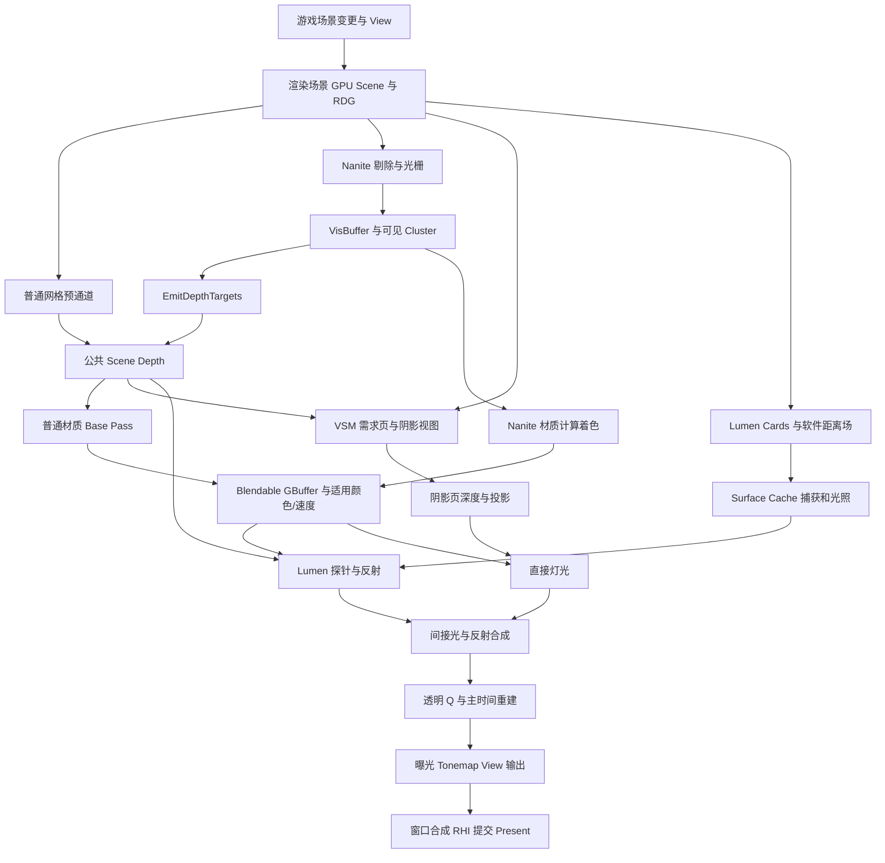
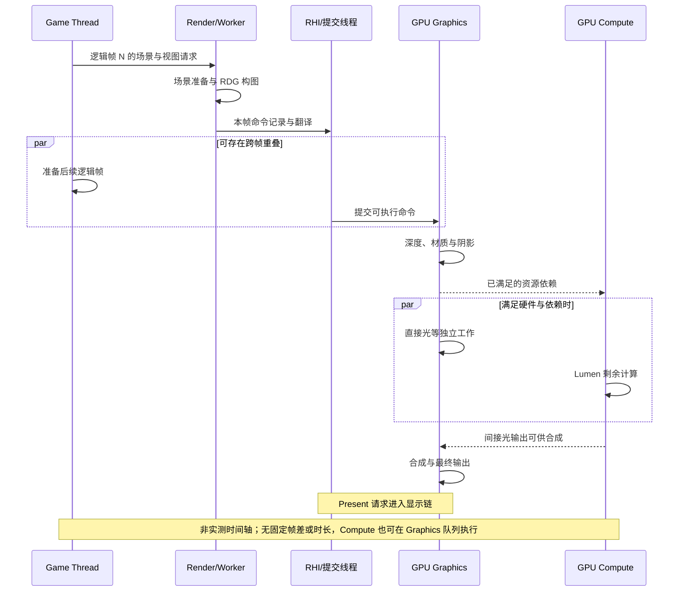

# 第 27 章：配置 B 的一帧源码串联与差异对照

[返回目录](../README.md) · [本章答案](../appendices/answers/27-modern-frame-walkthrough.md) · [配置矩阵](../appendices/configuration.md)

> **版本与范围：**UE 5.7.4，CL 51494982，Windows、D3D12、SM6，桌面延迟渲染。主线为 Substrate **Blendable GBuffer**、适用不透明网格 Nanite、VSM、Lumen 软件 Detail Tracing、TAA；硬件光追和 MegaLights 关闭。它不是本版所有新项目的默认配置，也不等于 Adaptive GBuffer、TSR 或硬件 Lumen。
>
> **证据边界：**本章带源码链接的函数、条件与资源关系均为 **[源码已确认]**，指本地静态阅读。图、假设像素与工作量算例属于 **[教学简化]**。没有运行教学工程、抓取 GPU 帧、记录性能或测量显示延迟；操作练习和预期均属 **[尚未验证]**。图中顺序表达所选路径的调用关系或依赖，不冒充实测时间线。

## 27.1 学习目标与开始前的检查

本章把前面分开的机制接起来。你要练习的不是背出一串 Pass 名，而是对每一次交接说清楚：“哪个线程/Shader 写了什么，下一步为什么能读取它，哪些条件可能让这一步不存在。”

完成本章后，应能做到五件事：

1. 从 Actor/Component 变更追到渲染场景、ViewFamily、`FSceneRenderBuilder` 与 RDG。
2. 解释 Nanite 可见性、公共 Scene Depth 与 Blendable GBuffer 之间的三次不同交接。
3. 区分主视图、VSM 阴影视图、Lumen 卡片视图及距离场命中，各自判断什么可见性。
4. 把 Lumen 卡片光照、探针、反射与直接灯光接入 Scene Color，随后跟到透明、TAA、Tonemap 与 Present。
5. 对 A/B 的差异进行单项归因，并解释静止帧、移动帧、历史失效帧为什么会走不同工作集合。

前置知识是第 06～10 章架构、第 11～20 章基础阶段和第 21～24 章现代功能。**资源生产者（Producer）**是本次写入资源的 Pass；**消费者（Consumer）**是依赖该结果的 Pass。RDG 以声明的访问关系组织依赖；C++ 函数返回、CPU 命令提交、GPU 完成和显示器扫描输出依旧是不同事件。

### 27.1.1 固定同一场景与三个观察位置

继续使用摄像机、地面、红方块、金属球、蓝色薄片、可移动方向光和点光源。不增加 Sky Light、Reflection Capture、烘焙光照、雾、水体或毛发。P 是方块没有薄片覆盖的像素；Q 是薄片覆盖方块的像素；M 是金属球上观察环境反射的位置。

红方块和金属球使用适用 Nanite 不透明网格；地面可以同样使用 Nanite，练习时再保留一份地面为普通网格以观察共存。薄片保持普通网格、Unlit、Translucent、Two Sided、Opacity=0.35，Tint=`(0.1,0.6,1)`，EmissiveStrength=300，无折射。基础记录先静止，移动实验才将方块设为 Movable 并沿既定方向移动。

P/Q 是跟踪数据来源的标签，不保证每次相机移动后仍落在同一个屏幕坐标。记录像素时同时写下窗口坐标、ViewRect 坐标和目标纹理坐标；同一个窗口坐标在后续帧可能已对应另一块表面。

### 27.1.2 本帧配置契约

| 类别 | B 的明确选择 | 对调用关系的影响 |
|---|---|---|
| API/着色路径 | D3D12、SM6、桌面 Deferred，`r.ForwardShading=0` | 不进入移动与前向主链 |
| 材质 | `r.Substrate=1`、`r.Substrate.ProjectGBufferFormat=0` | Blendable 输出，不能套 Adaptive 多闭包存储 |
| 几何 | Nanite 项目支持及适用资产已构建 | 主视图包含 Nanite 可见性与材质 CS；普通物体仍可共存 |
| GI/反射 | Lumen，`r.DynamicGlobalIlluminationMethod=1`、`r.ReflectionMethod=1` | 使用卡片/距离场/探针与反射合成 |
| 软件追踪 | 距离场生成完成，`r.Lumen.TraceMeshSDFs=1`、`r.Lumen.TraceMeshSDFs.Allow=1` | 允许条件性 Mesh SDF 细节追踪，另有 Global SDF |
| 阴影 | VSM，`r.Shadow.Virtual.Enable=1` | 页面需求、分配、阴影视图与投影 |
| 排除的分支 | `r.RayTracing=0`、`r.Lumen.HardwareRayTracing=0`、`r.MegaLights.Allowed=0` | 本帧不含 HWRT 求交、Hit Lighting 或 MegaLights 采样 |
| 深度/速度 | 保留 DBuffer 支持、默认 Early Z 政策、Velocity Output Pass=1 | 普通深度与 Nanite 导出汇入公共深度，速度写入仍有材质条件 |
| 时间/显示 | TAA、100% Screen Percentage、1280×720、手动曝光 | 主时间重建不是 TSR；显示仍要经过颜色输出 |

Substrate、Nanite 项目支持、距离场生成、硬件光追支持等修改按[配置附录](../appendices/configuration.md)重启并完成编译/派生数据构建。不能在项目只改了配置文件、资产还没有生成时，就把缺失结果当作稳定的 B。

此处也沿用第 21 章的普通 Substrate 灯光条件，不启用 Stochastic Lighting。Bloom、景深与运动模糊仍按第 20 章基线关闭。蓝片沿用第 26 章的 After DOF、Separate Translucency 开启且比例 100%、Cast Shadow 关闭，无额外后处理材质；实际资源尺寸仍须运行核对。TAA、曝光相关数据与 Tonemap 保留；没有外部 LUT 并不等于引擎不会生成内部颜色分级 LUT。

## 27.2 先看整张资源图

第 26 章的基础 A 主要把普通三角形送到 GBuffer。B 增加多种表示，但它们最终仍需对同一个可见表面建立一致数据。下面图中主深度、阴影深度、距离场是三个不同问题的答案。

[查看静态图](../assets/diagrams/27-modern-frame-walkthrough-1.png)



图把多个条件 Pass 聚合成教学节点，不是 `Render()` 的逐行顺序。例如 Lumen 卡片光照在本版 CPU 构图中可早于主 Base Pass，而探针和反射还需主场景纹理。VSM 需要阴影投射者自己的视图，箭头从场景连入它，不能只把主相机可见结果复制过去。

沿 P 阅读时，第一次出现“这是哪块表面”的证据是可见性/深度；第二次得到“它是什么材质”是 GBuffer；第三次得到“光照后多亮”是 Scene Color。到了 TAA/后处理，结果还可能混入邻域和历史，不能再把一个最终像素当作唯一三角形的直接输出。

## 27.3 检查点一：游戏数据怎样交到本帧

### 27.3.1 移动的是 Component，上传的是渲染记录

方块的 Actor 提供游戏组织，真正具有几何表示的是 Static Mesh Component。游戏侧修改变换并标记渲染变换脏状态后，`UPrimitiveComponent::SendRenderTransform_Concurrent` 更新包围范围，在渲染或隐藏阴影/间接光等条件满足时调用 `Scene->UpdatePrimitiveTransform(this)`。不应描述为“GPU 直接访问 Actor 指针”。[组件交接](G:/UnrealEngineInstalled/UE_5.7/Engine/Source/Runtime/Engine/Private/Components/PrimitiveComponent.cpp:678)

场景更新最终把变化应用到 Scene Proxy、实例数据和各种子系统。材质修改、移动实例和新增对象所触发的更新并不相同：移动通常更新变换与包围范围，新建代理则还涉及注册、材质命令和资源关系。第 06、11 章已经拆开这些工作；此处重点是它们如何与这一帧的视图汇合。

`FSceneRenderer::OnRenderBegin` 先设置场景更新回调，再在需要消费场景更新输入的路径调用 `Scene->Update(GraphBuilder, SceneUpdateParameters)`。Scene 更新推进到适当位置时才执行回调；回调中的 `LaunchVisibilityTasks` 启动可见性任务，并在并行准备条件下把 ComputeRelevance 任务添加到 GPU Scene 更新的前置依赖。定义回调的位置不等于回调的执行时刻。[可见性与上传依赖](G:/UnrealEngineInstalled/UE_5.7/Engine/Source/Runtime/Renderer/Private/SceneRendering.cpp:4058)

**[教学简化]**可把 GPU Scene 看成“供 Shader 用 ID 查询的场景记录表”。表里有变换、实例与 primitive 关系等，但网格顶点、索引、Nanite 几何页和材质纹理仍有各自资源。一个实例进入 GPU Scene 也不保证本帧可见，更不保证所有 Lumen/Nanite 表示已经细化到最高质量。

### 27.3.2 UE 5.7 的发起链保持原样

游戏视口建立 View 和 ViewFamily，最终进入 `FRendererModule::BeginRenderingViewFamilies`。本版 `SceneRendering.cpp` 创建 `FSceneRenderBuilder`，处理适用捕获，再调用 `CreateLinkedSceneRenderers`；随后 `AddRenderer` 注册回调，回调调用 `RenderViewFamily_RenderThread`，最后构建器 `Execute()` 安排这些操作。[构建器创建](G:/UnrealEngineInstalled/UE_5.7/Engine/Source/Runtime/Renderer/Private/SceneRendering.cpp:5167)[登记主渲染](G:/UnrealEngineInstalled/UE_5.7/Engine/Source/Runtime/Renderer/Private/SceneRendering.cpp:5204)

进入构建器排入的渲染命令后，`FRDGBuilder` 在 CPU 上创建，`RenderNode.Function` 在 Rendering 条件允许时填入本次渲染工作，随后 `GraphBuilder.Execute()` 执行图。这里的 Execute 仍不是显示完成通知；场景之外的窗口绘制还可能构建另一张 RDG。[RDG 创建与执行](G:/UnrealEngineInstalled/UE_5.7/Engine/Source/Runtime/Renderer/Private/SceneRenderBuilder.cpp:872)

| 八维问题 | 本检查点的答案 |
|---|---|
| 是什么 | 游戏变更、当前 View 和渲染场景准备的交汇处 |
| 为什么 | 各渲染任务必须看到一致的快照与正确资源引用 |
| 输入 | 组件变更、摄像机、PPV、ViewState、资产与旧场景状态 |
| 过程 | 记录变更、场景更新、视图可见性任务、GPU Scene 上传组织、构图 |
| 输出 | 本帧 View、渲染侧记录、资源引用与可见性任务结果 |
| UE 实现 | Component 发送、Scene Update、`FSceneRenderBuilder`、`FRDGBuilder` |
| 执行条件 | 当前 ViewFamily、Feature Level、ShowFlags 与有效场景 |
| 性能与误区 | CPU 任务/上传成本仍存在；“GPU 驱动”不代表无 CPU，也不代表每帧全量复制 |

## 27.4 检查点二：先选出 P 对应的表面

### 27.4.1 CPU 可见性与 Nanite 剔除不是重复同一件事

CPU 按视图过滤隐藏组件、视锥、距离、相关性与适用遮挡历史，组织普通 Mesh Draw Commands 和 Nanite 相关输入。`EndInitViews` 收束需要的准备；之后本版调用 `InitialiseSubstrateFrameSceneData`，注释要求它等待 ViewRelevance 完成。函数名含 Substrate 并不证明创建了 Adaptive 材质缓冲，该入口甚至在 Substrate 关闭时也会调用。[视图准备与材质帧数据](G:/UnrealEngineInstalled/UE_5.7/Engine/Source/Runtime/Renderer/Private/DeferredShadingRenderer.cpp:2314)

GPU 上，Nanite 根据实例、层级、Cluster、投影误差、页面驻留与适用 HZB 进一步选择工作。**Cluster（簇）**是 Nanite 的局部几何处理单元；CPU 判定方块参与主视图，不意味着它的每个 Cluster 都必须光栅。反过来，主视图不显示某个表面，也不能据此从全部阴影和间接光输入删除它。

### 27.4.2 普通深度与 Nanite 深度必须交汇

`RenderPrepassAndVelocity` 先清除主深度，在需要预通道时调用 `RenderPrePass`，随后在 `bNaniteEnabled` 条件下调用 `RenderNanite`。[深度与 Nanite 调用关系](G:/UnrealEngineInstalled/UE_5.7/Engine/Source/Runtime/Renderer/Private/DeferredShadingRenderer.cpp:2369)

Nanite 主阶段可用旧 HZB 降低工作量，生成当前可见性后构建 HZB，再在 Post 阶段复核延后候选。没有可用 HZB 或关闭两阶段条件时是另一分支；Post 不是把全部网格无条件重画。真实当前 HZB 调用是 `BuildHZBFurthest`，不能看到附近旧注释写 closest 就误讲它的规约方向。[Main/Post 实现](G:/UnrealEngineInstalled/UE_5.7/Engine/Source/Runtime/Renderer/Private/Nanite/NaniteCullRaster.cpp:6570)

主 Nanite `VisBuffer64` 保存胜出表面的深度与几何引用，不是红色或金色。`RenderNanite` 接着调用 `EmitDepthTargets`，将结果导出到公共 Scene Depth，并准备 Shading Mask 与适用速度/模板数据；普通网格和 Nanite 几何才能参与同一后续深度关系。[调用导出](G:/UnrealEngineInstalled/UE_5.7/Engine/Source/Runtime/Renderer/Private/DeferredShadingRenderer.cpp:1707)[导出输入/目标](G:/UnrealEngineInstalled/UE_5.7/Engine/Source/Runtime/Renderer/Private/Nanite/NaniteComposition.cpp:255)

**[教学简化]**设某位置普通地面深度 0.40，Nanite 球的深度 0.65，反向 Z 下较大的球更近；最终公共深度应反映球。若另一位置普通网格为 0.80，它比 Nanite 候选更近，后续灯光不能错误地读到球的材质。这里的数值是同一视图同一投影下的设备深度示例，不是米或厘米。

普通像素导出用 `CF_DepthNearOrEqual` 合并；Compute 导出则有 `GRHISupportsDepthUAV && GRHISupportsExplicitHTile && GNaniteExportDepth!=0` 条件。只知道 Windows/D3D12/SM6，还不能凭空宣布本机用了哪个深度导出分支。[像素深度状态](G:/UnrealEngineInstalled/UE_5.7/Engine/Source/Runtime/Renderer/Private/Nanite/NaniteComposition.cpp:415)[Compute 能力判断](G:/UnrealEngineInstalled/UE_5.7/Engine/Source/Runtime/Renderer/Private/Nanite/NaniteShared.cpp:474)

| 八维问题 | 本检查点的答案 |
|---|---|
| 是什么 | 生成当前主视图的几何可见性和公共深度 |
| 为什么 | 光照、透明、屏幕追踪与后处理要知道表面位置和遮挡 |
| 输入 | 可见性任务、GPU Scene、普通网格/Nanite 页面、View、可用历史 HZB |
| 过程 | 普通预通道、Nanite 剔除/光栅、条件 Main/Post、深度导出合并 |
| 输出 | VisBuffer、VisibleClusters、Scene Depth、Shading Mask、适用速度 |
| UE 实现 | `RenderPrePass`、`RenderNanite`、`EmitDepthTargets` |
| 执行条件 | 预通道政策、Nanite 资格、历史有效性与平台导出能力 |
| 性能与误区 | 页面流送、剔除、光栅和原子竞争都有成本；VisBuffer 不是 GBuffer |

## 27.5 检查点三：为胜出的表面计算材质

### 27.5.1 主 Base Pass 前还会发生什么

本版在所选路径中先组织 `UpdateLumenScene`，更新卡片表示，再处理适用 DBuffer。随后 `RenderLumenSceneLighting` 可以为卡片图集计算光照，才出现主 `RenderBasePass` 调用。[Lumen Scene 更新](G:/UnrealEngineInstalled/UE_5.7/Engine/Source/Runtime/Renderer/Private/DeferredShadingRenderer.cpp:2794)[卡片光照与主 Base Pass](G:/UnrealEngineInstalled/UE_5.7/Engine/Source/Runtime/Renderer/Private/DeferredShadingRenderer.cpp:2897)

为什么主 GBuffer 尚未完成，Lumen 就能算一部分光照？因为这里的接收者是 Surface Cache 卡片 texel，读取卡片捕获的法线/位置，不是正在等待主 Base Pass 的 P。代码顺序如果看似“违反了先材质后灯光”，往往是混淆了两套表面资源。Lumen 最终 Screen Probe 积分仍需要主深度与材质，不能提前把不存在的 P 材质读出来。

本场景没有贴花实体，DBuffer 支持会影响预通道和材质编译，但不保证有实际贴花投影 Draw。把“支持开启”与“本帧有消费者/生产工作”分开，是整帧阅读中反复使用的方法。

### 27.5.2 同一个材质协议，两类生产方式

普通网格通过 Raster Base Pass 求材质；Nanite 则从已建立的 VisBuffer 重新取得三角形属性，按 Shading Bin 组织计算着色。`Nanite::DispatchBasePass` 读取 VisBuffer、VisibleClusters、Shading Mask，调用 `ShadeBinning`，形成计算调度与 UAV 输出。[Nanite 材质入口](G:/UnrealEngineInstalled/UE_5.7/Engine/Source/Runtime/Renderer/Private/Nanite/NaniteShading.cpp:1178)[分桶交接](G:/UnrealEngineInstalled/UE_5.7/Engine/Source/Runtime/Renderer/Private/Nanite/NaniteShading.cpp:1294)

**Shading Bin（着色分桶）**保存要用相同着色命令处理的像素或 Quad 工作。它不替代材质逻辑：Shader 还要从可见三角形还原法线、UV、导数、实例变换，再执行材质。`TBasePassCS` 注册到 `BasePassPixelShader.usf::MainCS`；文件名有 PixelShader 不代表当前调度仍是 Pixel Shader。计算包装中的 `ShadePixel` 调用共用材质主函数，`ExportPixel` 通过 UAV 输出。[Compute 入口注册](G:/UnrealEngineInstalled/UE_5.7/Engine/Source/Runtime/Renderer/Private/BasePassRendering.cpp:145)[计算着色包装](G:/UnrealEngineInstalled/UE_5.7/Engine/Shaders/Private/ComputeShaderOutputCommon.ush:46)

本版为导数保留 helper lanes 的材质执行，只禁止这些辅助位置写出。因而“最终 P 只保留一个表面”不能推出“GPU 总共只执行过一个 lane 的材质”。光栅候选、计算 lane、实际 UAV 导出和最终像素是四种不同计数。[辅助 lane 规则](G:/UnrealEngineInstalled/UE_5.7/Engine/Shaders/Private/ComputeShaderOutputCommon.ush:186)

两条方式都必须遵守 B 的 **Blendable GBuffer** 布局。红方块的基础色、粗糙度、金属参数和法线被编码成后续延迟消费者可读的数据，但不等于第 14 章配置 A 的所有通道布局原封不动。也不应追加 Adaptive `Substrate.Material` 多闭包数组与其全部后处理；Lumen 多闭包条件本身就排除 Blendable。[Lumen 多闭包判断](G:/UnrealEngineInstalled/UE_5.7/Engine/Source/Runtime/Renderer/Private/Lumen/Lumen.cpp:208)

| 八维问题 | 本检查点的答案 |
|---|---|
| 是什么 | 将可见几何转换为延迟光照可消费的材质属性 |
| 为什么 | 多个灯光与间接光需要共同的法线、颜色和粗糙度 |
| 输入 | Scene Depth、几何/VisBuffer、材质、纹理、适用 DBuffer |
| 过程 | 普通 Raster 或 Nanite 重建属性/分桶/CS 求值、布局编码 |
| 输出 | B 的 Blendable GBuffer、适用 Scene Color 初始项及 Velocity |
| UE 实现 | `RenderBasePass`、`DispatchBasePass`、`MainCS`、材质包装 |
| 执行条件 | 不透明/Masked 资格、实际材质布局、网格路线、着色命令非空 |
| 性能与误区 | 材质成本与 MRT/UAV 带宽保留；深度导出是否 CS 不决定材质是否 CS |

## 27.6 检查点四：从灯光视图生成 VSM 阴影

VSM 不是在主相机深度上简单涂黑。它先根据接收表面的需求，选择灯光投影中的虚拟页；再把需要更新的页映射到物理页池，让阴影投射者从灯光视角写深度，最后在主表面处查询这份灯光深度来判断遮挡。

本版 B 的延迟路径不会采用前向渲染那条早期阴影链；`r.Shadow.ShadowMapsRenderEarly` 的分支也明确不支持 VSM。在后续阶段，`RenderFrontLayerTranslucency(..., true /*VSM page marking*/)` 为适用前层透明提供需求数据，随后 `BeginMarkVirtualShadowMapPages`，再调用 `RenderShadowDepthMaps`。[早期分支边界](G:/UnrealEngineInstalled/UE_5.7/Engine/Source/Runtime/Renderer/Private/DeferredShadingRenderer.cpp:2843)[页面标记与阴影调用](G:/UnrealEngineInstalled/UE_5.7/Engine/Source/Runtime/Renderer/Private/DeferredShadingRenderer.cpp:3109)

出现 FrontLayer 函数名不等于 Unlit 薄片 Q 一定写了前层数据；需继续检查材质与功能条件。它也不等于最终透明颜色提前合进主 Scene Color。这是资源准备与最终混合的区别。

`FShadowSceneRenderer::RenderVirtualShadowMaps` 先调用 `BuildPageAllocations`，再进入实际阴影渲染。内部按需要组织 Nanite 阴影与非 Nanite 阴影，最后 `PostRender`。[分配入口](G:/UnrealEngineInstalled/UE_5.7/Engine/Source/Runtime/Renderer/Private/Shadows/ShadowSceneRenderer.cpp:921)[两个几何分支](G:/UnrealEngineInstalled/UE_5.7/Engine/Source/Runtime/Renderer/Private/Shadows/ShadowSceneRenderer.cpp:807)

Nanite 阴影视图采用 `Pipeline=Shadows`、DepthOnly 输出，针对阴影视图和页范围调用 `DrawGeometry`。主相机 VisBuffer 没包含方块背面，不表示背面不可能遮挡方向光；所以 VSM 不能只复用主相机最终可见三角形清单。[VSM Nanite 上下文](G:/UnrealEngineInstalled/UE_5.7/Engine/Source/Runtime/Renderer/Private/VirtualShadowMaps/VirtualShadowMapArray.cpp:3808)[阴影视图绘制](G:/UnrealEngineInstalled/UE_5.7/Engine/Source/Runtime/Renderer/Private/VirtualShadowMaps/VirtualShadowMapArray.cpp:3933)

主灯光计算的 `RenderLights` 可组织 VSM One Pass Projection Mask Bits。方向光逐灯投影和局部光源的一次投影策略不是同一种工作；One Pass 的启用由自己的状态决定，也不等同于 Clustered Deferred Lighting。[灯光侧阴影入口](G:/UnrealEngineInstalled/UE_5.7/Engine/Source/Runtime/Renderer/Private/LightRendering.cpp:1567)[One Pass 条件](G:/UnrealEngineInstalled/UE_5.7/Engine/Source/Runtime/Renderer/Private/Shadows/ShadowSceneRenderer.cpp:943)

缓存能减少需要重画的内容，但本版的 Receiver Mask（接收者掩码）还会改变更新政策。它按当前接收区域缩小所需阴影范围；方向光开关注册初值为 true，页更新 Shader 因为旧动态页可能不完整而设置 `VSM_FLAG_DYNAMIC_UNCACHED`，所需动态部分继续更新，静态层仍可缓存。[方向光默认条件](G:/UnrealEngineInstalled/UE_5.7/Engine/Source/Runtime/Renderer/Private/VirtualShadowMaps/VirtualShadowMapClipmap.cpp:145)[页完整性与更新](G:/UnrealEngineInstalled/UE_5.7/Engine/Shaders/Private/VirtualShadowMaps/VirtualShadowMapPhysicalPageManagement.usf:333) 因此不能写“场景静止则第二帧全部页都不画”，也不能把可视化蓝色的仅静态缓存误判为错误。

几何页和阴影页也不同：Nanite 几何页面驻留良好，不保证 VSM 物理页池足够；后者充足，也不能补出尚未流入的细节几何。缓存键、层合并和失效实验接回[第 23 章](23-virtual-shadow-maps.md)，读整帧时仍需保留这些条件。

| 八维问题 | 本检查点的答案 |
|---|---|
| 是什么 | 为主接收者建立灯光视角遮挡信息 |
| 为什么 | 主深度不能判断沿灯光方向谁挡住了光 |
| 输入 | 接收者深度、灯光投影、页表/缓存、阴影投射者与几何 |
| 过程 | 标记需求、分配/复用物理页、失效更新、阴影视图光栅、投影 |
| 输出 | VSM 深度页、页表、适用投影遮挡结果 |
| UE 实现 | `BeginMarkVirtualShadowMapPages`、`RenderVirtualShadowMaps`、投影接口 |
| 执行条件 | VSM 支持、灯光投影、页需求、更新和缓存政策 |
| 性能与误区 | 页数、几何复杂度、缓存失效与投影成本；不是每灯全量巨幅阴影图 |

## 27.7 检查点五：把直接光、GI 与反射接入颜色

### 27.7.1 三类光照计算位置，各有数据

第一类是主视图的 P/M：延迟直接光从主 GBuffer 读取表面属性，结合方向光/点光源和 VSM 遮挡，在 Scene Color 中累加贡献。

第二类是 Lumen 卡片 texel：`RenderLumenSceneLighting` 计算卡片直接光照和 Radiosity，并更新 Final Lighting Atlas。软件卡片阴影使用自己的距离场追踪；不能因为主视图是 VSM 就把这两份阴影缓冲当成同一张。卡片的缓存组合为 `(Direct+Indirect)*Albedo/PI+Emissive`，是给世界命中提供出射亮度。[卡片光照入口](G:/UnrealEngineInstalled/UE_5.7/Engine/Source/Runtime/Renderer/Private/Lumen/LumenSceneLighting.cpp:217)[缓存组合](G:/UnrealEngineInstalled/UE_5.7/Engine/Shaders/Private/Lumen/SurfaceCache/LumenSurfaceCache.ush:50)

第三类是世界/屏幕探针的采样位置，它们不一定对应真实几何表面。世界 Radiance Cache 保存空间方向样本；Screen Probe 从主表面附近收集光，条件性 Screen Trace、Mesh SDF、Global SDF 求命中，再从卡片/缓存取得辐射，积分、滤波并保存历史。它们不是给 Scene Color 增加另一个任意环境常量。[屏幕探针追踪与积分](G:/UnrealEngineInstalled/UE_5.7/Engine/Source/Runtime/Renderer/Private/Lumen/LumenScreenProbeGather.cpp:2576)

三个“直接/间接”字样应加上接收者来理解。卡片直接受光对摄像机 P 的间接射线而言，可以成为间接光源；主 P 的直接光则还是两盏场景灯的直接贡献。它们在物理光路和缓存位置上不同，并非误把一盏灯加了两次。

### 27.7.2 为什么两次间接光调用不能机械相加

`RenderDiffuseIndirectAndAmbientOcclusion` 读取 `AsyncLumenIndirectLightingOutputs.StepsLeft`，只执行剩余的 ScreenProbeGather、Reflections、Composite。若所需探针已经异步组织，后续调用可以只合成，不会再次无条件完整追踪。[剩余步骤](G:/UnrealEngineInstalled/UE_5.7/Engine/Source/Runtime/Renderer/Private/IndirectLightRendering.cpp:1060)

金属球 M 的较清晰反射由 `RenderLumenReflections` 独立生成方向、追踪并去噪，输出放到间接光纹理槽位；DiffuseIndirect、RoughSpecularIndirect 与反射纹理分别有自己的含义。软件反射在本章依赖有效 Lumen GI，独立 HWRT 反射属于第 25 章的另一条件。[反射进入合成输入](G:/UnrealEngineInstalled/UE_5.7/Engine/Source/Runtime/Renderer/Private/IndirectLightRendering.cpp:1097)

主调度在 Lights 后再次调用间接光合成，注释说明为异步 Lumen 保留与灯光重叠的机会。B 的镜面已经随 `FDiffuseIndirectCompositePS` 合入，随后传统反射/天空函数检测 Lumen GI+Lumen Reflections 并跳过对应镜面合成。[Lights 后的合成](G:/UnrealEngineInstalled/UE_5.7/Engine/Source/Runtime/Renderer/Private/DeferredShadingRenderer.cpp:3328)[避免重复合成](G:/UnrealEngineInstalled/UE_5.7/Engine/Source/Runtime/Renderer/Private/IndirectLightRendering.cpp:2044)

P 此时可以包含红方块自身的直接和间接受光；M 包含直接高光与场景反射，二者不是同一个项。关闭 Lumen 反射不保证点光源高光消失，因为直接 BRDF 镜面高光有自己的生产者。

| 八维问题 | 本检查点的答案 |
|---|---|
| 是什么 | 汇合主直接光与 Lumen 间接/镜面贡献 |
| 为什么 | 材质属性、遮挡与缓存辐射尚不是最终可见颜色 |
| 输入 | GBuffer、Scene Depth、VSM、Surface Cache、SDF、世界/屏幕历史 |
| 过程 | 卡片光照、世界/屏幕探针、专用反射、直接光累加、后置间接合成 |
| 输出 | 主 Scene Color 与各类持续缓存/历史 |
| UE 实现 | `RenderLights`、`RenderLumenSceneLighting`、`RenderLumenFinalGather`、`RenderLumenReflections`、Composite |
| 执行条件 | 最终 View 方法、软件数据、ShowFlags、剩余步骤与缓存预算 |
| 性能与误区 | 多套缓存有各自刷新成本；函数出现两次不代表完整 GI 加两次 |

## 27.8 检查点六：从 Q 的透明层到可显示输出

### 27.8.1 不透明 Q 与透明 Q 是两份记录

在主深度和 GBuffer 中，Q 位置仍代表后方方块；薄片随后在所选透明 Pass 与已有背景混合。Unlit 表示薄片自身不计算常规受光，不表示不经过曝光、TAA 或最终颜色输出。Lumen 改变后方背景时，Q 也会跟着变化，这不是薄片自身收到漫反射 GI 的证明。

透明的绘制与合成可以分开。某些层先画入独立透明纹理，再由后处理阶段合成；PostDOF、AfterMotionBlur 与前层反射数据不是同一分类。主后处理中的 PostDOF 合成、TAA/TSR 选择、较晚透明合成有各自位置，即使景深或运动模糊关闭也不能忽略所有相关透明资源。[透明与时间处理交接](G:/UnrealEngineInstalled/UE_5.7/Engine/Source/Runtime/Renderer/Private/PostProcess/PostProcessing.cpp:897)

### 27.8.2 TAA 保留，不自动换 TSR

`AddPostProcessingPasses` 根据最终 AntiAliasingMethod 选择 `AddMainTemporalSuperResolutionPasses` 或 `AddGen4MainTemporalAAPasses`；本章选择 TAA。Nanite、VSM 和 Lumen 的开启并不把这个条件自动改成 TSR。[实际选择位置](G:/UnrealEngineInstalled/UE_5.7/Engine/Source/Runtime/Renderer/Private/PostProcess/PostProcessing.cpp:977)

TAA 读取当前颜色、深度、速度与自身历史，做重投影、邻域限制和累积。静态像素未显式写 Velocity 时，消费者可以根据深度和前后相机矩阵恢复运动；原始清零速度与“编码后的零运动”不同。Lumen 自己的历史和 TAA 历史串联存在，后者不能自动修复上游仍有旧光照的 Surface Cache。

手动曝光仍要施加选定倍率。预曝光改变 HDR 缓冲存储尺度，Tonemap 使用倒数匹配还原，再结合目标曝光、颜色分级和输出编码。B 的间接光更多只会改变输入能量，不会让这些颜色步骤消失。[Tonemap 输入尺度](G:/UnrealEngineInstalled/UE_5.7/Engine/Shaders/Private/PostProcessTonemap.usf:310)

### 27.8.3 场景完成不等于窗口与显示完成

View 输出可能是嵌在编辑器窗口里的独立纹理，也可能直接面向视口目标。Slate 收集窗口元素并画到 Back Buffer；之后 `PresentWindow_RenderThread` 调用 RHI 的视口结束/呈现入口，D3D12 后端进一步处理命令提交与 DXGI Present。[窗口与 RHI](G:/UnrealEngineInstalled/UE_5.7/Engine/Source/Runtime/SlateRHIRenderer/Private/SlateRHIRenderer.cpp:920)

场景 RDG Execute、Slate RDG Execute、D3D12 队列提交、GPU Fence 完成和 Present 是不同边界。Present 请求处理并不等于显示器已经扫描到 P/Q 所在行；同步、队列、窗口合成和屏幕刷新会影响实际可见时间。本章没有测量这些延迟，不给出毫秒或帧数保证。[D3D12 Present 组织](G:/UnrealEngineInstalled/UE_5.7/Engine/Source/Runtime/D3D12RHI/Private/D3D12Viewport.cpp:598)

| 八维问题 | 本检查点的答案 |
|---|---|
| 是什么 | 把光照结果、透明、时间数据与显示输出衔接 |
| 为什么 | Scene Color 仍是 HDR 工作资源，窗口与显示有独立需求 |
| 输入 | Scene Color、透明纹理、Depth/Velocity、历史、曝光与输出设备参数 |
| 过程 | 条件透明合成、TAA、曝光/Tonemap、View 输出、窗口绘制与呈现 |
| 输出 | 抗锯齿历史、输出纹理、窗口 Back Buffer、呈现请求 |
| UE 实现 | `AddPostProcessingPasses`、TAA、Tonemap、Slate 与 D3D12 Viewport |
| 执行条件 | 透明阶段、抗锯齿方法、后处理与窗口模式、Present 条件 |
| 性能与误区 | 带宽/历史/合成与显示等待并存；Present 返回不证明屏幕已经看到整帧 |

## 27.9 同一帧为什么有不同年龄的数据

### 27.9.1 跨线程和跨队列的真实含义

[查看静态图](../assets/diagrams/27-modern-frame-walkthrough-2.png)



同一逻辑帧 N 的 GPU 工作执行时，Game Thread 可能已经准备后续逻辑状态；同时 GPU 的缓存并不全是刚刚从零产生。RDG 负责已声明资源访问的正确顺序，不要求每张历史纹理都属于同一个更新时刻。异步标志只是允许队列组织，真实硬件是否充分重叠必须另行捕获。

**[教学简化]**若一段独立图形工作耗时 4 ms，一段计算耗时 3 ms，串行模型是 7 ms；完全重叠的理想下界为 `max(4,3)=4 ms`。若这之后还依赖一个 1 ms 合成，理想关键路径是 5 ms。这不是本场景性能预测：资源冲突、带宽争用和队列等待都可能让实际时间更长，不能直接把各 GPU Stat 数相加当总帧时长。

### 27.9.2 各类历史为何不能一键等价重置

| 数据 | 保留目的 | 变化后可能发生的工作 |
|---|---|---|
| Nanite 驻留页 | 复用已经装入 GPU 的几何 | 新视图提出新细节需求，流送/安装有延后 |
| Nanite/场景 HZB | 降低后续遮挡测试成本 | 失效时改分支，Main/Post 处理新暴露候选 |
| VSM 页与层状态 | 复用适用阴影区域 | 投影变化、失效、Receiver Mask 政策决定哪些内容重画 |
| Surface Cache | 复用材质捕获和卡片光照 | 新页、变换、材料和灯光更新按不同预算处理 |
| 世界 Radiance Cache | 共享世界空间方向辐射 | 需求标记、位置覆盖与追踪预算更新 |
| Screen Probe/反射历史 | 降低间接光和镜面采样噪声 | 深度/运动/光照变化使旧样本受限或被拒绝 |
| TAA 历史 | 结合子像素样本改善最终稳定性 | 重投影、邻域限制、CameraCut 等条件改变累积 |

这些数据有不同所有者与生命周期。相机切换会让某些历史失效，但不等于从磁盘重新构建所有 Nanite 资产。反过来，纹理缓存已分配也不等于当前表面有有效覆盖。稳定帧、快速移动帧和首次载入帧不能只用一个“缓存开/关”标签解释。

## 27.10 把一个 P 与一个 Q 真正算到交接点

### 27.10.1 从几何编号到颜色的五份记录

**[教学简化]**假设 P 的 Nanite 可见表面引用是当前 VisibleClusters 列表中的 42、簇内三角形 5。按第 22 章的编码，几何低字为 `((42+1)<<7)|5=5509`。这个 5509 不是材质颜色，也不是永久 Actor ID；下一步必须通过可见记录与 Cluster 查询实际顶点、材质和实例。

假设恢复出的 UV 权重是 `(0.2,0.3,0.5)`，三个顶点 UV 为 `(0,0)、(1,0)、(0,1)`，得到 UV=`(0.3,0.5)`。材质在这个坐标采样出红色表面属性；法线进入后续灯光，Roughness 决定镜面分布，金属度区分方块和 M 的响应。这个中间记录仍不是 HDR Scene Color。

再假设某个红色表面卡片的直接与间接辐照度合计为 `1.2PI`、解码 Albedo=`(0.8,0.1,0.05)`、Emissive=0，卡片出射亮度为 `(0.96,0.12,0.06)`。P 的探针若命中该表面，还需乘方向积分权重及 P 的材质响应，不能把这三个数不加解释地直接覆盖到 P。光照缓存和主像素色值属于不同坐标与单位层次。

最后为演示透明混合，另假定不透明 Q 的当前阶段颜色 `B=(0.8,0.1,0.05)`，薄片阶段颜色 `S=(0.1,0.6,1)`、`a=0.35`，得到：

```text
Q = a*S + (1-a)*B
  = (0.555, 0.275, 0.3825)
```

此处 S 是专门假设的阶段颜色，不是把实际材质 EmissiveStrength=300 忽略后声称测量。若缓存/背景 GI 令 B 变成 `(0.9,0.15,0.08)`，薄片自身不变，则 `Q=(0.62,0.3075,0.402)`。Q 的变化来自背景乘以混合权重 0.65，而非薄片突然变成受光材质；这个权重不代表完整玻璃光学中的物理透射率。

### 27.10.2 后处理仍会改变这份颜色

设当前阶段未预曝光 HDR 颜色为 C，存储倍率为 p，目标曝光倍率为 E，则简化的存储与恢复关系为 `Stored=p*C`、`Exposed=Stored*(E/p)=E*C`。例如 C=`(4,1,0.5)`、p=0.25、E=0.125，存储为 `(1,0.25,0.125)`，Tonemap 前曝光颜色为 `(0.5,0.125,0.0625)`。随后非线性色调映射和输出编码还会改变数值。

这组数值的用途是检查数据层次，不是伪造整条 UE Shader 的逐像素结果。真实 P/Q 会受到 BRDF、采样、历史、预曝光、局部曝光设置、量化和输出格式共同影响；在没有抓帧的情况下，教材不能给出其最终 8 位 RGB 真值。

## 27.11 如何比较 A、B 与单项对照

| 比较 | 保持哪些不变 | 可以回答什么 | 不能推导什么 |
|---|---|---|---|
| 完整 A 对 B | 场景构图、分辨率、曝光、灯光意图 | 两套明确配置的整体外观与工作集合差异 | 总差异都由 Nanite 或 Lumen 一项造成 |
| B 中某资产 Nanite 开/关 | 材质、GI、阴影、相机、时间方法 | 该资产两条几何路线的差异 | 回退网格和原高模一定几何等价 |
| B 的 Screen Trace 对照 | 世界表示、其他 Lumen 子功能 | 屏幕信息在指定 GI 或反射中的影响 | 关闭屏幕追踪就关闭全部 Lumen |
| B 的 Detail/Global 软件追踪 | 其他配置、距离场已构建 | 网格细节追踪与全局场的差异 | 调整该项就等于硬件三角形求交 |
| B 的 TAA/TSR | 先保持相同输入/输出分辨率 | 时间重建机制差异 | TSR 是启用 Nanite 后的固定步骤 |
| B 的 HWRT 副本 | 先明确其余功能，再按第 25 章准备 | 硬件求交/Surface Cache/Hit Lighting 的条件差异 | 原软件 B 已经使用了硬件 RT |

“软件光栅”“软件光线追踪”“计算着色”也必须分别说。Nanite 软件光栅在 GPU Compute 上建立三角形覆盖；Lumen 软件追踪在 GPU Compute 上沿 SDF 找世界命中；Nanite 材质计算着色在 GPU Compute 上求材质并写 GBuffer。三者都可能是 Compute，但算法、输入和输出完全不同。

## 27.12 实践：做一份可核查的整帧记录

### 27.12.1 记录配置，不只记录截图

**[尚未验证]**从固定场景准备完整 B，记录版本、显卡、驱动、RHI、画质档、实际分辨率、摄像机变换、两盏灯、PPV 和资产 Nanite 状态。查询配置表关键 CVar，核对重启型设置和资源构建完成。之后静止相机，等流送和缓存有机会更新，再记录基线；等待多久稳定需要实际观察，本文不承诺固定帧数。

用视口 Nanite、Lumen Scene、Surface Cache、VSM 可视化分别观察不同表示，记录模式名称。可视化可能改变实际 ShowFlags 或工作，不把可视化帧的耗时当正常 Lit 的性能。回到 Lit 后，记录 P/Q/M 的屏幕位置，并保留其对应表面说明。

### 27.12.2 用资源交接表阅读源码或抓帧

以下表格可直接用于笔记。尚未运行时将“观察结果”写为未测，不能把“源码有这个函数”填成“本帧 GPU 执行过”。

| 检查位置 | 要确认的具体问题 | 如果不同，先查什么 |
|---|---|---|
| `SceneRenderBuilder_Render` | 这是主 ViewFamily、捕获还是 UI？ | Renderer 名称、View、输出目标 |
| Nanite VisBuffer | P 的表面引用有效吗？ | Nanite 资格、页面驻留、视图与遮挡条件 |
| EmitDepthTargets 后 | 主深度与普通网格正确合并吗？ | 实际 PS/CS 导出条件、ViewRect、深度约定 |
| Base Pass 后 | P/M 的材质来自 Blendable 目标吗？ | 项目格式、实际绑定资源、Nanite 材质命令 |
| VSM 页和投影 | 阴影来自哪个灯光与页？ | 页面需求、投射者、缓存/失效、方向/局部投影 |
| Lumen 合成前 | 哪些步骤已完成，纹理来自哪个历史？ | StepsLeft、Screen Trace、世界表示与缓存有效性 |
| 透明与 TAA | Q 的背景和薄片在哪次合成？ | 材质透明阶段、独立透明资源、实际 AA 方法 |
| View/窗口输出 | 当前纹理是 SceneColor、View 输出还是 Back Buffer？ | Slate 路线、输出设备和 Present 边界 |

源码断点在 CPU 函数入口只能证明控制流到达；跟进 Pass 参数、Shader 注册和资源生产者才能证明算法连接。若有 GPU 抓帧工具，则再核对实际 GPU 事件和附件；两种证据都记录，不能互相替代。安装版源码可以静态阅读，但调试二进制是否有匹配符号取决于本机组件，缺符号不应改为编造断点结果。

### 27.12.3 三个运动实验分开执行

第一轮只移动方块。跟踪变换/GPU Scene、Nanite 可见性、主速度、VSM 失效和 Lumen 表示更新；观察遮挡后的地面重新露出时，哪一层仍保留历史。结束后恢复方块并等待稳定。

第二轮只移动摄像机。世界对象未变但屏幕投影、HZB 可用性、页需求、屏幕追踪覆盖和时间重投影都变化。若 M 的反射随着方块离屏变化，先比较 Lumen Screen Trace 与世界表示，不把它直接归为材质编译错误。

第三轮只改变点光源强度。几何 VisBuffer 和 GBuffer 理论上可保持相同表面，但直接 Scene Color、卡片光照、间接历史和 TAA 响应不同。Q 的薄片自身仍 Unlit，背景变化足以改变最终 Q。不要同时移动相机、改曝光和切 TSR，否则无法定位变化来源。

每轮写下原值、改变值、恢复操作、观察模式、未验证部分。性能记录应在正常 Lit 模式与相同渲染条件下进行；本章给出的是验证方法，不附未采集的 FPS、GPU 毫秒、截图或时间线。

## 27.13 回顾与理解检查

配置 B 改变了几何可见性、材质表示、阴影和间接光的实现，但没有取消场景同步、资源依赖和显示链。P 依次拥有几何引用、公共深度、材质属性、HDR 颜色与输出像素；Q 在不透明阶段代表背景，透明阶段才加入薄片；M 的直接高光和环境反射有不同来源。理解这一帧，就是能在每次交接指出资源、条件、执行者和下一位消费者。

1. 在 `RenderLumenSceneLighting` 调用时主 Base Pass 尚未完成，为什么不矛盾？它能否直接把当前 P 的最终材质读出来？
2. 解释 Nanite VisBuffer、Scene Depth 与 Blendable GBuffer 的区别。深度导出走 Pixel Shader 是否意味着 Nanite 材质也走 Pixel Shader？
3. 为什么主相机的最终可见三角形集合不能直接作为 VSM 全部阴影几何？Nanite 几何页和 VSM 页的“缓存”分别缓存什么？
4. 若间接光函数在主调度出现两次，如何确认不是完整 GI 重算并相加两次？软件 B 关闭 Lumen GI 后能否无条件保留同样的软件 Lumen 反射？
5. 透明假设 `a=0.35`、`S=(0.1,0.6,1)`，背景从 `(0.8,0.1,0.05)` 变为 `(0.9,0.15,0.08)`，求 Q 的两次结果；解释为什么 Unlit 薄片未变而 Q 改变，以及 Present 返回为何不能给出 Q 实际可见时间。

下一章把这种交接式阅读用于缓冲观察、性能分析与源码排查，练习从一个异常像素或热点反向寻找真正的生产者。
