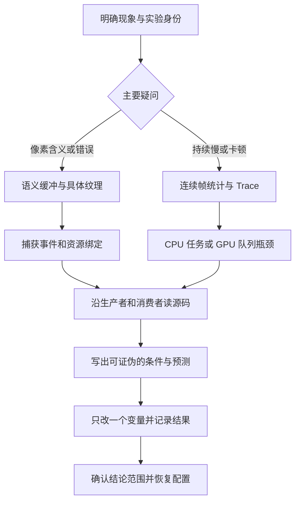
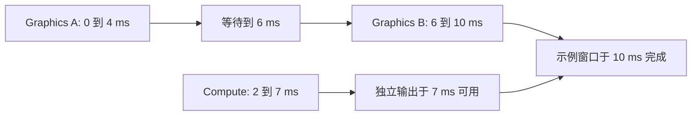

# 第 28 章：缓冲观察、性能分析与源码阅读实践

[返回目录](../README.md) · [本章答案](../appendices/answers/28-debugging-and-profiling.md) · [配置基线](../appendices/configuration.md)

> **版本与范围：**UE 5.7.4，CL 51494982，Windows、D3D12、SM6、桌面延迟渲染。本章先用配置 A 的普通网格/GBuffer/传统阴影建立观察方法，再在配置 B 的 Substrate Blendable、Nanite、VSM、Lumen 软件追踪中复用；HWRT 和 MegaLights 仍关闭。基础抗锯齿沿用 TAA，TSR 是明确的对照实验。
>
> **证据边界：**本章只静态核验本地源码和命令入口，没有启动 UE、录制 Trace、抓 RenderDoc 或测 GPU。`[源码已确认]` 是实现与条件，`[教学简化]` 是人工算例；所有操作步骤、界面预期和待填写记录均为 `[尚未验证]`。没有数据的表格保持待记录，不能把教程图当成运行截图。

## 28.1 学习目标与前置知识

读完本章，你应能独立完成以下工作：

1. 为同一个 P/Q 像素写清缓冲的资源、时间位置、坐标、数值和颜色含义。
2. 用连续帧数据区分画面错误、CPU 计算、CPU 等待、GPU 工作和呈现限制。
3. 在本版中运行有明确起止的 Trace、ProfileGPU 和资源捕获实验，并处理“没有事件”的情况。
4. 沿一个事件找到 RDG Pass、Shader 参数、资源生产者/消费者和条件分支。
5. 写一份可复现的观察记录，区分证据、推论与尚未验证的解释。

前置知识是第 02～05 章的数据含义、第 08～10 章的线程/RDG/RHI，以及第 13～24 章各系统的生产消费关系。本章不要求先读完 Renderer 的所有文件。第一步应是提出一个足够具体的问题，例如“Q 的主深度为什么仍像方块”，或者“旋转太阳后 VSM 哪一部分工作增加”，而不是先打开工具收集所有数字。

**Debugging（调试）**主要回答结果为什么不正确；**Profiling（性能分析）**主要回答工作与等待花在哪里。二者会互相帮助，但证据不同。资源捕获能显示一次 Draw 的输入纹理，未必能代表平时每秒 60 帧的运行节奏；一条 CPU 时间线能找到主线程等待，未必保存当时每个像素的 GBuffer。

## 28.2 先建立一次公平实验

| 维度 | 实验准备的回答 |
|---|---|
| 作用 | 让两次观察只改变已知变量，并知道运行的是哪条渲染路线 |
| 原因 | 视图、画质、缓存、线程和工具模式都可能让结果变化 |
| 输入 | 工程副本、A/B 基线、版本、设备、相机、材质、灯光和当前 CVar |
| 过程 | 保存书签和配置，等待加载稳定，记录初值，指定唯一改动与恢复方式 |
| 输出 | 可重复操作、稳定观察区间和完整实验身份 |
| 实现 | 工程配置、视口/运行设置、控制台只读查询与日志 |
| 条件 | 使用允许所需调试功能的编辑器/Development 构建，目标平台与教材一致 |
| 成本与误区 | 编辑器、捕获工具、后台任务和预热都能影响结果；CVar 注册初值不是运行事实 |

### 28.2.1 一份实验至少固定什么

固定项目副本、相机书签、输出尺寸 1280×720、曝光、时间抗锯齿、光源、物体数量和材质。P 是方块没有被蓝片覆盖的位置，Q 是蓝片覆盖方块的位置；蓝片保持 Unlit、Translucent、Two Sided、Opacity=0.35、无折射，不顺手改成玻璃。A/B 的差异另见配置表。

记录“编辑器普通视口、PIE、Standalone 或打包 Development”，不要把这些模式混着比较。编辑器还有 Slate、预览和额外视口；关闭其他实时视口只是一种控制条件，不表示发布版本必然省同样百分比。保持窗口焦点和供电状态一致，并记录 VSync、帧率上限和动态分辨率。

在 UE 控制台逐项查询下列值。这里展示的是 UE 控制台输入，不是 PowerShell 脚本：

```text
r.RHI.Name
r.ScreenPercentage
r.DynamicRes.OperationMode
r.VSync
r.VSyncEditor
t.MaxFPS
r.AntiAliasingMethod
r.RDG.ImmediateMode
r.RDG.Debug.FlushGPU
```

**[源码已确认]**`r.RHI.Name` 在 Renderer 非 Test/Shipping 的命令入口报告实际 RHI 名称；VSync 和 MaxFPS 分别有运行设置，[S28-01](#s28-01)。查询值通常会由控制台/日志显示；把实际输出抄入记录。不要把教材里的 D3D12 前提当成工程确实用了 D3D12 的证据。

屏幕百分比也不能只看一个值。本版代码会在动态分辨率覆盖 `r.ScreenPercentage` 时提示它被忽略，[S28-02](#s28-02)。编辑器视口的屏幕百分比策略又可能独立于游戏。资源的分配 extent 还可能大于本帧有效 ViewRect，所以要同时记录输出尺寸、实际渲染 rect 和相关 pass 的输入/输出尺寸。

### 28.2.2 预热与测量区间

先让 Shader 编译、资产流入和必要缓存更新完成，再取固定区间。VSM 初始建页、Lumen 更新、TAA 建立历史都是观察对象的一部分，但应该分为“首次/切换帧”和“稳定运行”，不要把二者平均成一个难以解释的数字。

选择一段能重复的相机路径或静止书签，每次收集同样长度的区间。若研究偶发卡顿，保留卡顿前后多帧；若研究稳定负载，记录中位数和高百分位，而不是挑最好的一帧。尚未有采集数据时只写“待记录”，不要在示例表中伪装成设备成绩。

**[教学简化]**60 FPS 对应每帧约 `1000/60=16.667 ms`，30 FPS 为 `33.333 ms`。从 20 ms 改到 16 ms 是帧时间下降 20%，吞吐率从 50 FPS 到 62.5 FPS、上升 25%。两种百分比都对，但必须写清分母。8 个帧时间 `10,10,10,10,10,10,10,30 ms` 的平均为 12.5 ms，中位数为 10 ms；只报中位数就漏掉一次明显卡顿。

## 28.3 给问题选择正确的证据

| 工具 | 最适合回答 | 不能单独证明 |
|---|---|---|
| Buffer Visualization | Base Color、法线、深度等语义通道是否符合预期 | 显存原始编码或完整 GPU 执行时间 |
| `vis` | 具体 RDG 纹理的某个版本/mip/数组层是什么样 | 所有帧的资源历史、精确内存带宽 |
| `stat unit` / `stat gpu` | 稳定负载趋势和粗粒度 CPU/GPU 分类 | 某个等待的完整依赖来源、单像素数值 |
| `ProfileGPU` | 一帧的 GPU 事件树和各队列统计 | 连续帧卡顿分布、最终输入到显示延迟 |
| Unreal Insights Trace | 多线程、任务、GPU 队列及其时间关系 | 未采集通道的事件、纹理全部像素内容 |
| RenderDoc | API 事件、资源绑定、管线状态、捕获内像素/纹理 | 未捕获前的全部缓存生成史、正常帧稳态性能 |
| DumpGPU | RDG Pass 的资源、参数与阶段输出 | 完整硬件 API 重放、未受导出干扰的帧时间 |
| 本地源码 | 条件、算法、数据结构和调用可能性 | 本次运行已进入某个分支或产生某个耗时 |

先写清现象，再选择最小足够证据。比如“金属球是黑的”先检查材质、光源和反射输入，不需要立即录制全 CPU Trace；“每隔几秒卡一下”需要连续时间线，单张 Buffer Visualization 帮助有限。

[打开问题到证据的静态图](../assets/diagrams/28-debugging-and-profiling-1.png)



这张 **[教学简化]** 流程图没有承诺所有问题都要经过所有工具。它强调的是结论的证据来源：观察和源码互相校正，不能靠工具名称代替推理。

## 28.4 实验一：P/Q 的语义缓冲

| 维度 | 缓冲观察的回答 |
|---|---|
| 作用 | 验证当前像素在某个阶段保存的几何、材质或颜色含义 |
| 原因 | 显示 RGB 已经经过光照、透明和后处理，无法直接代表 GBuffer 参数 |
| 输入 | 视图、SceneTextures、可视化材质、当前通道与曝光设置 |
| 过程 | 用可视化材质读取和解码对应输入，将其映射成可看的颜色 |
| 输出 | 语义通道画面或导出的可视化图片 |
| 实现 | `FBufferVisualizationData`、`AddVisualizeBufferPass` 和后处理材质输入 |
| 条件 | `AllowDebugViewmodes`、材质已加载、对应 view mode 与输入资源有效 |
| 成本与误区 | 可视化也要渲染；显示颜色通常已解码/缩放，不是原始字节或最终 Lit 颜色 |

### 28.4.1 操作步骤

**[尚未验证]**打开 A，选定相机书签，先保留普通 Lit 图作为现象记录。编辑器视口选择 Buffer Visualization，并依次选择 Base Color、World Normal、Scene Depth、Roughness、Metallic。游戏视口在支持的开发环境可使用：

```text
viewmode visualizebuffer
r.BufferVisualizationTarget BaseColor
```

然后只改变目标名，依次试 `WorldNormal`、`SceneDepth`、`SceneDepthWorldUnits`、`Roughness`、`Metallic`、`Velocity`、`PreTonemapHDRColor`。结束使用 `viewmode lit`，编辑器视口也可用原来的 View Mode 菜单恢复。若控制台命令作用于游戏视图而非正在观察的编辑器视图，使用该视口菜单，不能因为某个窗格没变就判断功能失效。

**[源码已确认]**目标名来自 `Engine.BufferVisualizationMaterials`，对应材质加载后进入通道表；目标 CVar 名为 `r.BufferVisualizationTarget`，其帮助明确要求 Buffer Visualization view mode，[S28-03](#s28-03)。未知通道会报告不存在并恢复上一个有效值，[S28-04](#s28-04)。

### 28.4.2 预期与解释

P 的 Base Color 应表示方块材质参数，灯光阴影不是 Base Color 的组成部分；在 Q 处普通透明片不写普通不透明 GBuffer，底下方块的语义数据仍可能是你看到的来源。主 SceneDepth 也通常仍是背景不透明表面，不能因为 Q 看着蓝就要求主深度记录蓝片。

这些是基于基线机制的**待验证预期**，不是说所有透明材质在所有模式都没有深度。CustomDepth、前层透明、水体、特殊透明深度和普通 SceneDepth 是不同资源；本章固定普通 Unlit 蓝片，避免把额外功能混入。

World Normal 的颜色是方向数据的显示映射。Scene Depth 可视化也可能把很大的深度范围压成灰度；看到一片白不能直接说整个场景都在远平面。选择 SceneDepthWorldUnits 或在捕获中检查深度格式、投影变换和实际数值，再用第 02～03 章知识解读。

金属球 Base Color 与漫反射响应的关系不能照搬非金属方块；Metallic/Roughness 通道帮助确认参数。A 没有 SkyLight、Reflection Capture 和 Lumen，反射来源受到限制；“球不亮”不能单独证明材质编码坏了。

### 28.4.3 这不是直接显示显存字节

本版可视化是由材质产生的图像。配置中 SceneColor、PreTonemapHDRColor 等通道标记 `ApplyAutoExposure=true`，后处理输入还分别提供 tonemap 前后颜色、Separate Translucency 和 Velocity，[S28-05](#s28-05)。因此截屏像素不能自动当作“SceneColor 原始线性数值”。读取原始资源时还要区分格式、预曝光、颜色编码、视口范围和缩放。

**[教学简化]**法线 `(0,0,1)` 若采用 `N*0.5+0.5` 显示，会变成 `(0.5,0.5,1)`；这能解释常见蓝紫外观，却不宣称所有调试材质逐行采用同一公式。R32 深度 `0.7`、SRGB 字节 179 和线性颜色 0.7 也不能因数字相近就互换。

### 28.4.4 缺少通道时先查条件

`AllowDebugViewmodes` 会检查强制设置、Commandlet 和是否要求 cooked data；`r.ForceDebugViewModes` 是 ReadOnly 设置。游戏 ViewMode 的 Test/Shipping 路径还会单独回到 Lit，[S28-06](#s28-06)。不要把“运行时输入 ForceDebugViewModes=1”写成所有打包版本都能立即恢复调试材质的办法，它还涉及编译和打包是否包含所需资源。

把同样步骤在 B 副本重复。Blendable 仍有可消费的 GBuffer 表示，但 Nanite 几何、Substrate 兼容解码和可用通道与 A 不应只凭纹理名字判断。若某通道不支持当前表示，记录条件并转向系统专用可视化或实际 Shader 输入。

## 28.5 实验二：追踪一张具体纹理

### 28.5.1 从通道名走到 RDG 资源名

Buffer Visualization 的 `BaseColor` 是语义通道；RDG 的 `GBuffer...` 是资源名字；GPU API 的纹理对象又是底层存储。三者不能画等号。`vis` 根据 RDG 资源名、版本和子资源显示纹理，适合回答“同一个 SceneColor 在这个写入之后是什么内容”。

**[尚未验证]**恢复普通视图，先列出实际资源和可用视图：

```text
vis *SceneColor*
vis view=?
```

从输出选定本次视图中的资源名，不假设每个项目一定叫 `SceneColor`。然后按实际名称使用 `vis <实际资源名> PIP`；尖括号部分是要替换的占位符。若有多个版本，使用日志支持的 `名字@版本`；选择 mip 或数组层可追加 `MIP1`、`INDEX1`，结束输入 `vis 0`。

本版帮助列出 `RGB`、`R/G/B/A`、乘除缩放、`FRAC/SAT`、mip、数组层和视图筛选，[S28-07](#s28-07)。这里的版本是可视化系统捕获的中间版本计数，不是上一帧、下一帧的绝对编号。先列出名字和版本，再选目标；不要把教程里随手写的 `@3` 当作固定 TAA 前颜色。

### 28.5.2 检查表面上全黑或全白的资源

先检查纹理 extent、有效 ViewRect、所选 mip/array slice、通道和数值缩放。某些资源只有 alpha 有效，某些是 uint 位字段，某些深度是 reverse-Z；把它们按 RGB 0～1 看都可能很奇怪。`FRAC` 会折返整数部分，`SAT` 会截断范围，它们的显示效果不是原始数据错误的直接证据。

用第 23 章物理页池作例子：那是许多灯光和虚拟页共享的 R32 存储，直接显示物理纹理得到碎片状深度是合理现象。必须同时借助页表和灯光信息恢复逻辑布局。Lumen 图集和 Nanite ID 缓冲也需要其自身编码解释，不能用 SceneColor 的经验套读。

**[源码已确认]**`vis` 入口受 `SUPPORTS_VISUALIZE_TEXTURE` 保护，执行命令前会 `FlushRenderingCommands`，[S28-08](#s28-08)。这会干扰切换瞬间的 CPU 调度；退出观察后再采集稳态计时。显示纹理还会增加捕获/显示 pass，不能在这个模式下给发布性能定论。

## 28.6 实验三：先看连续帧，再定位 GPU 事件

| 维度 | 粗粒度性能观察的回答 |
|---|---|
| 作用 | 判断主要工作量在哪一层，并选择要详细分析的时间段 |
| 原因 | FPS 一个数无法区分 CPU 计算、等待、GPU 工作或限帧 |
| 输入 | 帧时钟、线程统计、GPU 时间戳/统计事件和呈现设置 |
| 过程 | 看连续曲线与分组统计，标记稳定负载或卡顿，再捕获相关事件树 |
| 输出 | 可疑线程/队列/Pass、时间范围和下一步假设 |
| 实现 | `stat unit`、`stat unitgraph`、`stat gpu`、`ProfileGPU` |
| 条件 | 对应构建启用 Stats/GPU profiler，RHI 支持所需时间数据 |
| 成本与误区 | 平滑统计不是单帧原始值；CPU/GPU 和父子事件不能随意相加 |

### 28.6.1 读取 unit 与 gpu

**[尚未验证]**在普通 Lit 运行视图逐项打开：

```text
stat unit
stat unitgraph
stat gpu
```

这些通常是切换命令；记录原来哪些已开启，结束恢复。观察 Frame、Game、Draw、RHIT 和 GPU 中实际出现的列。Draw 的线程耗时不等于显卡执行 Draw Call 的耗时；独立 RHIThread 不出现也可能采用任务模式。先记录连续一段，再选择需要详细 Trace 的区间。

**[源码已确认]**`STAT_Unit` 注册说明是 Game Thread、Render Thread 和 GPU 的帧时统计；`UnrealClient.cpp` 分别读取线程全局时间和 `RHIGetGPUFrameCycles`，并采用 `0.9*旧值+0.1*新值` 平滑，[S28-09](#s28-09)。因此屏幕上一个数值不是你刚刚按下快门那一帧的逐事件总和。`stat raw` 是本版提供的原始统计显示切换，但做分布分析仍应读取连续记录。

如果 Frame 接近 16.67 ms，而 GPU busy 明显低于它，可能有 VSync、帧率上限、CPU 限制或等待。先查设置和时间线，不立即宣布“GPU 测量不准”。反过来 Game 较长也不保证游戏逻辑纯计算很重，部分等待是下游工作或帧同步造成的，需沿等待依赖找原因。

### 28.6.2 本版 ProfileGPU 仍存在

先记录当前 `r.ProfileGPU.Root`、`r.ProfileGPU.ThresholdPercent`、`r.ProfileGPU.ShowLeafEvents` 与 UI 设置。初次观察保持不筛选或记清筛选规则，然后输入：

```text
ProfileGPU
```

**[源码已确认]**`RHIDefinitions.h` 在未覆盖时把 `RHI_NEW_GPU_PROFILER` 定义为 1；新实现通过 `FAutoConsoleCommand` 注册 `ProfileGPU`，捕获一帧工作统计并写日志，[S28-10](#s28-10)。旧 `UEngine::HandleProfileGPUCommand` 受 `RHI_NEW_GPU_PROFILER==0` 条件保护，不能只找到旧入口被排除就说本版命令消失。

队列报告在表格有行或允许显示空队列时进入日志/控制台；筛选后无行且关闭空队列显示时，可以没有该队列的报告。UI 另要求 `r.ProfileGPU.ShowUI`、Graphics 队列及表格有行。新实现区分队列、Draw/Dispatch 数以及 inclusive/exclusive 时间；不要把旧教程的弹窗外观当作本版必然界面。[S28-11](#s28-11)

若事件太多，再按真实名字使用 Root 通配过滤；它区分大小写。ThresholdPercent 会隐藏小项，ShowLeafEvents 影响没有 Draw 或 Dispatch 工作记录的事件节点，空队列也有显示选项。这里的 HasWork 同时接受 Draw 和 Dispatch，并按包含子项的统计判断。若某个 Pass 没出现，先恢复筛选并检查实际渲染分支，不能立即断言被编译器优化掉了。

### 28.6.3 父子时间的数值例子

**Inclusive（包含子项）**表示该作用域及内部子项累计统计；**Exclusive（自身）**排除已经归入子项的部分。源码节点同时保存两组字段，并向祖先传播 inclusive，[S28-12](#s28-12)。

**[教学简化]**在同一串行统计范围中，父项 Lighting inclusive=5 ms，子项 A=2 ms、B=1 ms，父项 exclusive=2 ms。总数应是 5 ms，或 `2+2+1=5 ms`；把父 5 与子 2、1 相加成 8 ms 是重复计数。某个父项自身很小但 inclusive 很大，说明应继续看子项，而不是直接重写父函数。

GPU 作用域的时间还受统计实现对 busy、idle、wait 的分法影响。本版 ProfileGPU 表格时间列使用 BusyCycles；Graphics UI 以 exclusive busy 累积安排条形位置，并以 inclusive busy 决定宽度，不是保留空洞和等待的实际墙钟时间轴。[表格忙碌时间](G:/UnrealEngineInstalled/UE_5.7/Engine/Source/Runtime/RHI/Private/GPUProfiler.cpp:1086)、[UI 条形生成](G:/UnrealEngineInstalled/UE_5.7/Engine/Source/Runtime/RHI/Private/GPUProfiler.cpp:1945)。比较前后必须使用同一工具、同一列和同一队列口径。API 捕获器某个事件的回放时间也不自动等于 UE profiler 相应 scope 的 busy 时间。

## 28.7 实验四：CPU 与 GPU 的连续 Trace

| 维度 | 时间线采集的回答 |
|---|---|
| 作用 | 观察多帧内线程任务、GPU 队列工作和依赖等待的关系 |
| 原因 | 一张事件树看不全跨帧流水、偶发等待和队列空洞 |
| 输入 | 编译时事件埋点、启用的 Trace 通道、采集开始/结束和书签 |
| 过程 | 运行时写事件流，停止后由匹配版本 Unreal Insights 解码并显示 |
| 输出 | `.utrace` 文件、时间范围、CPU/GPU 轨道和适用任务/资源信息 |
| 实现 | `Trace.File`、`Trace.Bookmark`、`Trace.Stop`、CPU/GPU/RDG Trace |
| 条件 | Trace 编译与通道启用，GPU 后端有有效事件和时间戳，分析器支持该事件版本 |
| 成本与误区 | 开更多通道增加开销；轨道空白可能是未记录，Submit 短不代表 GPU 工作短 |

### 28.7.1 最小可重复采集

**[尚未验证]**先执行 `Trace.Status`。若已有重要诊断会话，不覆盖它，使用另一轮实验；否则启动本次短文件跟踪：

```text
Trace.File cpu,gpu,frame,bookmark,task
Trace.Status
Trace.Bookmark Chapter28_Baseline_Begin
```

在固定书签运行一段，再做一次预先规定的操作，例如匀速横移相机。到达结束位置后：

```text
Trace.Bookmark Chapter28_Baseline_End
Trace.Stop
Trace.Status
```

按日志实际报告的路径打开 `.utrace`，不要猜所有机器都写在同一绝对目录。本版 `Trace.File [Path] [ChannelSet]` 可以省略路径；单个含逗号的通道参数按 channel set 处理。`Trace.Start` 已标弃用，优先使用 File，[S28-13](#s28-13)。书签、Status 和 Stop 也都有可核验入口。

CPU、Gpu、Frame、Bookmark、Task 是不同通道。需要第 08 章渲染/RHI 命令信息时，另加已核验的 `rendercommands,rhicommands`；研究 RDG 依赖时另加 `rdg`。先用最小集合确认事件可见，再为具体问题增加通道，不为了“更全面”默认记录所有系统。[S28-14](#s28-14)

### 28.7.2 在 Insights 中回答具体问题

使用同一 UE 5.7 工具版本打开记录，定位两个书签之间的区间。先看 Frame 分布和线程，再展开相关 CPU 事件与 Task 依赖，最后看实际存在的 Graphics、Compute 等 GPU 队列轨道。名称和布局随分析器版本变化，但事件的生产者、消费者与时间边界是稳定的阅读方法。

逐项回答：GameThread 长段是计算还是等待？RenderThread 在等哪些任务？RHI 翻译在专用线程还是工作任务？GPU 队列在无工作提交时空闲，还是在等待另一个队列信号？昂贵的 Pass 在关键依赖上，还是与更长工作重叠？

本版 GPU Trace 记录 QueueSpec、BeginWork/EndWork、Wait、SignalFence/WaitFence 与 breadcrumb 事件，GPU 支持由 `UE_TRACE_ENABLED`、新 profiler 和非 Shipping 等条件控制，[S28-15](#s28-15)。这些记录比单纯 CPU Submit scope 更接近设备执行关系，但仍需要检查具体 RHI 是否提供了有效数据。

没有 GPU 轨道时检查：Gpu 通道是否启用、当前构建是否有 GPU Trace、是否是正确进程、记录区间是否包含有效工作、分析器是否匹配版本。CPU scope 名叫 Draw 或 Dispatch，也不能代替缺失的 GPU 时间戳。没有 Task 事件时同样先检查通道与埋点，不把空白自动解释成任务不存在。

### 28.7.3 持续时间、忙碌和等待

**Elapsed（经过时间）**是区间起止差；**Busy（忙碌）**是统计口径下实际有工作推进的时间；**Wait（等待）**描述队列依赖；**Idle（空闲）**可表示尚无可执行提交。新 profiler 中的 Wait 处理明确区分提交前空闲和等待其他队列 Fence 的区间，[S28-16](#s28-16)。

游戏线程发命令、渲染线程构图、RHI 翻译提交、GPU 执行和显示扫描是不同边界。不要在屏幕上画一条竖线，强行把不同轨道同编号帧的开始解释成同一次模拟的全部阶段；先用实际事件关联和第 08 章的帧语义建立关系。

## 28.8 数值练习：两条 GPU 队列为什么不能直接相加

**[教学简化]**假设某个观察窗口内：

```text
Graphics 忙碌区间：[0,4] ms 与 [6,10] ms，共 8 ms
Compute  忙碌区间：[2,7] ms，共 5 ms
两队列同时忙碌：[2,4] 与 [6,7]，共 3 ms
至少一条队列忙碌的并集：8+5-3=10 ms
```

把队列工作加成 13 ms 会把重叠的 3 ms 计算两次；取最长单队列 8 ms 又漏掉 Graphics 空闲区间 `[4,6]` 中的 Compute 工作。这个例子只说明区间并集，没有把 busy 直接当成呈现延迟。

[打开队列重叠与依赖的静态图](../assets/diagrams/28-debugging-and-profiling-2.png)



图中 Graphics 的等待终点是已给定的 6 ms；没有箭头声明它在等 Compute 的全部结果。若 B 真正依赖 Compute 完成，B 最早应在 7 ms 开始，而不是 6 ms，示例总长相应变为 11 ms。画时序时，依赖箭头必须与给出的时间一致。

**[源码已确认]**新 profiler 的 `ComputeUnion` 计算“至少一个 GPU pipe 忙碌”的区间并集。整帧汇总先收集各队列由平台 RHI 提供的有效 `TotalBusyCycles`，存在这类值时取其中最大值写入 GPU frame time history；全部缺少时，才由各队列时间戳求并集写入，[S28-17](#s28-17)。因此不能把任何设备上的 unit GPU 数字都绝对定义成同一条公式。前面的区间算例说明并集与简单相加、单队列最大值的数学区别，不能替代具体平台实际采用的汇总口径。

**关键路径**是决定结果最早可用时间的依赖链。某个 3 ms Compute 若完全藏在更长的 Graphics 后面，把它降到 2 ms 可能没有降低总帧时间；若它让 Graphics 等到 7 ms，把它降到 6 ms 则可能减少 1 ms 等待。实际还有共享算力、缓存和带宽竞争，重叠不表示两张独立显卡无成本并行，必须重新测量。

这也解释为什么 `r.RDG.AsyncCompute=1` 不是“Compute Shader 必定在异步队列运行”，为什么 CPU parallel execute 不等于 GPU overlap。先看 Pass 标志和硬件条件，再看真实轨道；强制改变队列策略可以是对照实验，但不能预先宣称一定更快。

## 28.9 实验五：捕获一帧并追踪 Q 的颜色

| 维度 | 资源/API 捕获的回答 |
|---|---|
| 作用 | 查看某次绘制/计算前后的资源、绑定、着色阶段和管线状态 |
| 原因 | 最终图像无法告诉我们哪个写入首次改变了目标像素 |
| 输入 | 已初始化的捕获工具、目标视口、稳定场景和指定捕获范围 |
| 过程 | 捕获 API 或导出 RDG 资源，在事件树中沿目标资源查生产者/消费者 |
| 输出 | RenderDoc 捕获或 DumpGPU 本地资源目录，及事件/资源对应记录 |
| 实现 | UE RenderDocPlugin、`renderdoc.CaptureFrame`、`DumpGPU` |
| 条件 | 插件/库/API 支持或 WITH_DUMPGPU，有效渲染视图和可写输出目录 |
| 成本与误区 | 捕获、读回和回放改变运行条件；资源可读不证明其缓存曾在本帧生成 |

### 28.9.1 RenderDoc 前提和步骤

**[尚未验证]**在可恢复工程副本安装兼容的 RenderDoc，检查 UE RenderDoc 插件与日志。插件默认启用并不等于捕获库已经附加：本版 Loader 要求 `-AttachRenderDoc` 启动参数或插件设置中的 `renderdoc.AutoAttach`，随后加载库并检查 API，[S28-18](#s28-18)。需要重启的设置应在运行前完成，不在测量中途改一批 Shader 编译选项。

恢复普通 Lit，固定相机，等待缓存稳定，确认捕获目标是主场景视口。输入 `renderdoc.CaptureFrame` 或使用对应捕获按钮。默认 CaptureAllActivity=0 针对当前视口；延迟、多帧或捕获所有编辑器活动会改变范围，先查询并记录这些选项，[S28-19](#s28-19)。按日志定位捕获文件；本版插件设置的基础目录是工程 Saved 下的 RenderDocCaptures。

捕获入口在无延迟且仅当前视口的情况下可直接触发当前视口捕获，其余条件才排延迟工作。因此不要把命令帮助中的“next frame”理解成各种调用方式都严格等一个帧号。记录工具显示的实际事件范围，避免把一次编辑器视口重绘当作完整主游戏帧。

### 28.9.2 从资源出发找写入者

先确认捕获里的最终输出来自目标相机，而不是 Slate 或另一个视口。找到 Q 对应的画面位置，记录有效 ViewRect、纹理尺寸和坐标；如果存在动态分辨率、上采样和视口偏移，屏幕坐标不能不换算就用于所有中间纹理。

沿最终 SceneColor/后处理输出向前找：Tone Map 前颜色、时间处理输入、透明合成后的颜色、透明 Pass 目标、不透明光照后的背景。每一步记录资源 ID、事件 ID、mip/slice 和数值含义；相同名字可能对应不同资源，也可能是同一资源被多次写入。

对 Q 的普通透明 Draw，检查 Blend State、Depth Test/Write、Shader 输出及目标已有内容。基线应对应第 18 章的普通 Translucent 合成约定；若进入独立 Separate 目标，还要先解释 D/T，再找合成回主颜色的消费者。不要只看纹理 Alpha 就称它为 Opacity，普通 Separate 累计目标可能保存剩余透射。

**[教学简化]**若捕获前景未预乘输出 `Cs=(0.2,0.8,1)`、Alpha=0.35、背景 `Cb=(0.1,0.2,0.4)`，普通 over 是 `(0.135,0.41,0.61)`。只有确认 blend factors、颜色表示和输入值匹配，才能把这个算术用于解释捕获；蓝片的高 Emissive、预曝光和 tonemap 要另行处理。

Pixel History 和 Shader Debugger 的能力取决于 API、驱动、捕获器版本、优化与着色阶段。不能保证 Nanite 的所有 UAV 写入、Wave 操作或 Compute 材质都能得到传统 PS 的逐像素执行史。失败时退回事件资源前后对照、绑定检查和源码解码，先界定工具不支持的边界。

### 28.9.3 缓存与跨帧输入

单帧捕获可以包含 TAA 历史、VSM 物理池或 Lumen 缓存作为输入；这些资源在帧开始已经有内容，未必会在当前捕获内找到完整生产链。把“本帧没有创建/填充全部缓存的事件”理解成读未初始化内存，会误判很多正确的跨帧算法。

需要追踪缓存建立时，另录连续帧或重新设计首次/失效实验，清楚标记 Camera Cut、缓存重建和预热阶段。不能为了方便捕获清空所有历史，再把改变后的画面当作原始闪烁问题的稳定复现。

### 28.9.4 DumpGPU：更接近 RDG 的资源观察

RenderDoc 捕获 API，DumpGPU 则在 UE 的 RDG 组织中导出资源和参数。**[尚未验证]**先查询以下设置，记录原值，只在需要具体内容时进行短导出：

```text
r.DumpGPU.Root
r.DumpGPU.FrameCount
r.DumpGPU.Texture
r.DumpGPU.Buffer
r.DumpGPU.Stream
r.DumpGPU.Directory
```

确认仅需一帧后将 FrameCount 设 1，以实际事件名筛选 Root，例如调查本书 TAA 可在核实事件存在后用 `r.DumpGPU.Root *TAA*`，再输入 `DumpGPU`。Texture/Buffer 的 1 只导描述，2 同时导出二进制；没有像素内容时先查这两个值，不反复扩大帧数。[S28-20](#s28-20)

本地命令 `DumpGPU` 由 `WITH_DUMPGPU` 保护，进入 `FRDGBuilder::BeginResourceDump`。按日志实际目录打开随导出复制的 GPUDumpViewer 入口，观察 pass 参数、资源和版本；这里不使用上传开关。匹配范围过窄时可能看不到完整上下游，逐步扩大到生产者/消费者即可，不默认导出所有 Draw 后的所有资源。

DumpGPU 默认 Stream=0 是同步资源复制模式，结束阶段明确等待渲染命令完成；还会统计读回、GPU 等待、文件后处理等成本，[S28-21](#s28-21)。这些不是主渲染算法的稳态成本。需要比较性能时停止导出、恢复配置并重新采集普通运行，而不是从导出日志里的秒数推断“这张纹理的渲染耗时”。

## 28.10 实验六：把一个事件读到 Shader

| 维度 | 源码跟读的回答 |
|---|---|
| 作用 | 验证观测事件由什么条件生成、读取什么数据并如何产生输出 |
| 原因 | 事件名字是线索，不能独立解释算法、排列或当前执行分支 |
| 输入 | 当前版本源码、事件名、资源名、Shader 标识和实际配置 |
| 过程 | 搜事件/资源，定位 AddPass 与参数，找 Shader 注册，核验生产者和消费者 |
| 输出 | 可追溯的调用/资源链及需要运行验证的分支条件 |
| 实现 | `rg`、编辑器源码导航、RDG 参数声明、Shader 注册与 HLSL |
| 条件 | 源码与运行二进制匹配；生成代码、材质排列和平台宏须另外确认 |
| 成本与误区 | 找到同名函数不等于命中当前分支；源码行数或 C++ 函数时长不代表 GPU 算法成本 |

### 28.10.1 用本书 TAA 做完整练习

这部分可以只读源码完成，不要求启动工程。**[源码已确认]**本版 TAA 的事件字符串是 `TAA(%s Quality=%s%s) %dx%d -> %dx%d`，不是必须恰好名为 `TemporalAA`。[S28-22](#s28-22) 先在 Engine 根目录运行下面的只读 PowerShell 命令：

```powershell
rg -n 'TAA\(' Source/Runtime/Renderer/Private/PostProcess/TemporalAA.cpp
rg -n 'FTemporalAACS|IMPLEMENT_GLOBAL_SHADER' Source/Runtime/Renderer/Private/PostProcess/TemporalAA.cpp
rg -n 'MainCS' Shaders/Private/TemporalAA.usf
```

第一步定位事件附近的 `FComputeShaderUtils::AddPass`，记下 ComputeShader、PassParameters 和 group count。第二步跟 `FTemporalAACS` 注册到 `/Engine/Private/TemporalAA.usf` 的 `MainCS`。第三步读参数中的当前颜色、深度、速度、历史输入与输出，找哪些条件会让历史无效；本书第 19 章已经解释了这些数值的意义。

继续反向找输入资源的最近生产者，正向找输出进入哪个后处理阶段。不要因为类型名有 Compute 就断言使用 Async Compute：这里的默认 AddPass 重载与第 09 章相同，队列策略还由 PassFlags、RDG 和平台决定。观察事件给出的是实际线程组/尺寸线索，源码给出的是可能的实现路径，两份证据要匹配。

### 28.10.2 五层名称要一起记录

```text
屏幕现象：移动时方块边缘残影
实际事件：捕获/Trace 中的完整 TAA 事件名
C++ 组织：AddTemporalAAPass 与 AddPass 参数
Shader：FTemporalAACS -> TemporalAA.usf -> MainCS
资源：当前颜色/深度/速度/历史 -> 新历史与输出颜色
资格：A/B、TAA 而非 TSR、分辨率/质量、历史是否有效
```

这是填写模板，不是已经观察到的残影报告。若运行的是 TSR，继续找 Temporal Super Resolution 对应入口；不能把 TAA 的 Shader 当成 TSR 执行证据。若用户材质包含生成函数，静态 `.usf` 中看不到展开结果，还需要对应编译排列或生成代码才能证明材质表达式究竟是什么。

### 28.10.3 Debug Shader 设置何时才需要

本版 `r.Shaders.Symbols` 用于生成/写入符号，注册说明明确需要重编译；`r.Shaders.ExtraData` 增加名称等信息，`r.Shaders.Optimize` 控制优化，均有 ReadOnly 限制。`r.DumpShaderDebugInfo` 影响发生编译时的输出，并不是对已经缓存的每个 Shader 立即生成一份全文，[S28-23](#s28-23)。

只有遇到 Shader 身份或单步问题时才另建诊断配置，记录启动设置、编译结果和缓存状态。关闭优化会改变代码和成本；带额外数据的 Shader 也可能增加体积或影响去重。不要为获取一个易读调用栈，把正常配置的 Shader 全部换成未优化版本后继续报性能结论。

### 28.10.4 RDG Trace 与调试模式的边界

需要资源依赖时可另录包含 `rdg` 的短 Trace。`FRDGTrace` 记录图、Pass、资源、Pipeline、Graphics fork/join 等信息；它有编译条件，而且构造时要求 RDG 通道启用并且不处于 ImmediateMode，[S28-24](#s28-24)。没有 RDG 图时先检查条件，不假设 Renderer 没用 RDG。

`r.RDG.ImmediateMode` 会在创建 Pass 时执行，便于把 Lambda 崩溃连到构图调用栈；`r.RDG.Debug.FlushGPU` 更进一步要求每 Pass 刷新 GPU，并禁用 async compute 与 parallel execute，[S28-25](#s28-25)。它们用于诊断特定问题，不是常规观察需要打开的“更精准计时”。如果串行化让错误消失，只能说明时序相关假设值得检查，不能证明原依赖已经正确。

## 28.11 常见现象的下一步

| 现象 | 优先取证 | 先排除的误判 |
|---|---|---|
| Q 看着蓝但 GBuffer 是红方块 | 透明前后 SceneColor、主深度、透明目标和 blend state | 普通透明通常不覆盖不透明 GBuffer |
| 全屏颜色偏亮，Base Color 正常 | 固定曝光、Pre/PostTonemap、预曝光与输出编码 | 不能直接把显示颜色当材质参数 |
| Draw CPU 时间长，GPU 较空 | CPU Trace 的任务、命令组织和等待依赖 | Draw 列不是 GPU Draw 指令持续时间 |
| GPU Projection 贵，VSM 光栅稳定 | 普通视图下的投影事件、局部灯重叠与 SMRT | 缓存命中只省部分深度生成工作 |
| 旋转太阳后 GPU 暴涨 | VSM 缓存、dirty/静动态层和对应光栅 | 不是只有 ray count 才能影响阴影成本 |
| Lumen 明暗逐帧收敛 | Surface Cache/探针更新与历史、首次和稳态区间 | 单帧捕获不保证包含全部缓存生成史 |
| 开 vis/DumpGPU 才出现卡顿 | 普通运行对照、工具产生的 Flush/读回 | 导出等待不是原场景 Pass 的正常时间 |
| ProfileGPU 某事件消失 | Root/Threshold/叶子过滤、ShowFlags、编译与实际分支 | 搜不到名字不等于该算法永远不执行 |

Shader Complexity、Quad Overdraw 等 view mode 可以显示特定复杂度估计，但不能直接翻译成毫秒。纹理延迟、寄存器压力、缓存、带宽、波利用率和光栅覆盖都会影响设备成本。把这些图当成寻找热点区域的线索，再用目标设备上的时间/资源证据确认。

## 28.12 最终实验记录：让别人能重做

| 维度 | 结论整理的回答 |
|---|---|
| 作用 | 保存别人可以复现和核验的观察结论 |
| 原因 | 截图和一句“快了”无法交代配置、变量、统计口径和副作用 |
| 输入 | 原始日志/Trace/捕获路径、观察区间、配置差异、源码定位 |
| 过程 | 分开列出观测、解释、反证检查、质量变化和恢复步骤 |
| 输出 | 一份有适用范围的报告及下一步最小实验 |
| 实现 | 下方记录模板与 A/B 对照，保留原始工件 |
| 条件 | 结论只覆盖已观察的设备、构建、场景和路径 |
| 成本与误区 | 重复次数不足、挑帧、跨工具口径和同时改多项都会弱化结论 |

```text
实验编号、日期、操作者：
引擎版本/CL、工程版本、A 或 B、改动副本：
CPU/GPU/驱动、RHI、运行模式、窗口与焦点：
输出尺寸、有效 ViewRect、屏幕百分比/动态分辨率：
相机书签/运动、物体/材质/灯光、曝光、TAA/TSR：
VSync、FPS 上限、工具是否附加、相关 CVar 原值：
唯一变量与前后取值、预热和稳定观察区间：
日志/Trace/捕获实际路径、事件ID、资源ID/版本/mip/slice：
重复次数、帧时间中位数/高百分位、使用的列/队列口径：
直接观测到的事实：
对应源码函数、Shader、条件和资源依赖：
尚未验证的解释、可能反例、画质或稳定性变化：
已恢复哪些设置、下一次只改变什么：
```

填写时用“在 B、该书签、这段稳定帧里，VSM 光栅时间上升，静态缓存仍保留、动态页更新增加”这样的具体陈述。不要写“UE 阴影很慢”或“Nanite 永远更快”。未测量的潜在收益写成假设，观测不到的内容写成缺少证据，并说明下次用哪个工具补齐。

**[教学简化]**屏幕线性分辨率从 100% 改为 75%，像素数比为 `0.75²=0.5625`。若基线 1280×720 对应这份比例，内部示例为 960×540；但不是所有资源都缩放，也不是所有 Pass 成本按像素线性变化。假设测得某 Pass 从 4.0 ms 到 2.8 ms，只能说该范围内降低约 30%，不能说总帧必降 43.75%。实际测试必须核验比例是否被当前视口或动态分辨率采用。

停止当前实验拥有的 Trace/导出，退出 vis 和特殊 view mode，恢复 CVar 与项目设置。保留工具截图时注明它改变了哪些路径，例如 VSM 可视化禁用 One Pass。将恢复后的普通运行验证与诊断模式分开记录，这样最终报告才能服务真实工程判断。

## 28.13 源码证据索引

<a id="s28-01"></a>
**S28-01：运行身份和呈现设置。** [r.RHI.Name](G:/UnrealEngineInstalled/UE_5.7/Engine/Source/Runtime/Renderer/Private/Renderer.cpp:699)、[VSync/编辑器 VSync](G:/UnrealEngineInstalled/UE_5.7/Engine/Source/Runtime/Core/Private/HAL/ConsoleManager.cpp:4165)、[MaxFPS](G:/UnrealEngineInstalled/UE_5.7/Engine/Source/Runtime/Engine/Private/UnrealEngine.cpp:11851)用于查询实验条件。

<a id="s28-02"></a>
**S28-02：屏幕百分比不只看 CVar。** [r.ScreenPercentage](G:/UnrealEngineInstalled/UE_5.7/Engine/Source/Runtime/Engine/Private/LegacyScreenPercentageDriver.cpp:38)说明小于等于零时采用默认策略；[动态分辨率覆盖检查](G:/UnrealEngineInstalled/UE_5.7/Engine/Source/Runtime/Engine/Private/LegacyScreenPercentageDriver.cpp:76)提示设置可能被忽略。

<a id="s28-03"></a>
**S28-03：缓冲通道的来源。** [Initialize](G:/UnrealEngineInstalled/UE_5.7/Engine/Source/Runtime/Engine/Private/BufferVisualizationData.cpp:29)读取配置并加载材质；[控制台目标名](G:/UnrealEngineInstalled/UE_5.7/Engine/Source/Runtime/Engine/Public/BufferVisualizationData.h:53)、[View Mode 帮助](G:/UnrealEngineInstalled/UE_5.7/Engine/Source/Runtime/Engine/Private/BufferVisualizationData.cpp:109)和 [BaseEngine 通道表](G:/UnrealEngineInstalled/UE_5.7/Engine/Config/BaseEngine.ini:3146)给出实际可用名字。

<a id="s28-04"></a>
**S28-04：游戏视口检查目标名。** [GameViewportClient.cpp:1522](G:/UnrealEngineInstalled/UE_5.7/Engine/Source/Runtime/Engine/Private/GameViewportClient.cpp:1522)要求有效 view mode 和调试资格；[未知名字处理](G:/UnrealEngineInstalled/UE_5.7/Engine/Source/Runtime/Engine/Private/GameViewportClient.cpp:1538)记录警告并恢复旧值。

<a id="s28-05"></a>
**S28-05：可视化经过材质处理。** [曝光标记读取](G:/UnrealEngineInstalled/UE_5.7/Engine/Source/Runtime/Engine/Private/BufferVisualizationData.cpp:64)、[颜色通道的曝光配置](G:/UnrealEngineInstalled/UE_5.7/Engine/Config/BaseEngine.ini:3157)、[前后 tonemap/透明/速度输入](G:/UnrealEngineInstalled/UE_5.7/Engine/Source/Runtime/Renderer/Private/PostProcess/PostProcessVisualizeBuffer.cpp:349)说明显示语义。

<a id="s28-06"></a>
**S28-06：Debug View 条件。** [只读 ForceDebugViewModes](G:/UnrealEngineInstalled/UE_5.7/Engine/Source/Runtime/RenderCore/Private/ShaderCore.cpp:569)、[AllowDebugViewmodes](G:/UnrealEngineInstalled/UE_5.7/Engine/Source/Runtime/RenderCore/Private/ShaderCore.cpp:578)、[游戏 Test/Shipping 限制](G:/UnrealEngineInstalled/UE_5.7/Engine/Source/Runtime/Engine/Private/GameViewportClient.cpp:4551)不可忽略。

<a id="s28-07"></a>
**S28-07：vis 语法与版本。** [DisplayHelp](G:/UnrealEngineInstalled/UE_5.7/Engine/Source/Runtime/RenderCore/Private/VisualizeTexture.cpp:331)包含通配、版本、子资源和关闭命令；[中间版本计数](G:/UnrealEngineInstalled/UE_5.7/Engine/Source/Runtime/RenderCore/Private/VisualizeTexture.cpp:1022)并不是全局帧数。

<a id="s28-08"></a>
**S28-08：vis 的构建条件和干扰。** [命令前 FlushRenderingCommands](G:/UnrealEngineInstalled/UE_5.7/Engine/Source/Runtime/Renderer/Private/Renderer.cpp:670)、[命令保护宏](G:/UnrealEngineInstalled/UE_5.7/Engine/Source/Runtime/Renderer/Private/Renderer.cpp:681)、[SUPPORTS_VISUALIZE_TEXTURE](G:/UnrealEngineInstalled/UE_5.7/Engine/Source/Runtime/RenderCore/Public/RenderGraphDefinitions.h:59)说明适用范围。

<a id="s28-09"></a>
**S28-09：unit 与统计平滑。** [Unit 注册](G:/UnrealEngineInstalled/UE_5.7/Engine/Source/Runtime/Engine/Private/UnrealEngine.cpp:2333)、[UnitGraph/Raw](G:/UnrealEngineInstalled/UE_5.7/Engine/Source/Runtime/Engine/Private/UnrealEngine.cpp:2343)、[帧与线程平滑](G:/UnrealEngineInstalled/UE_5.7/Engine/Source/Runtime/Engine/Private/UnrealClient.cpp:370)、[GPU 帧周期读取](G:/UnrealEngineInstalled/UE_5.7/Engine/Source/Runtime/Engine/Private/UnrealClient.cpp:398)对应实际显示数据。

<a id="s28-10"></a>
**S28-10：新旧 GPU profiler 入口。** [新实现宏默认](G:/UnrealEngineInstalled/UE_5.7/Engine/Source/Runtime/RHI/Public/RHIDefinitions.h:68)、[新 ProfileGPU 命令](G:/UnrealEngineInstalled/UE_5.7/Engine/Source/Runtime/RHI/Private/GPUProfiler.cpp:2649)、[旧入口条件](G:/UnrealEngineInstalled/UE_5.7/Engine/Source/Runtime/Engine/Private/UnrealEngine.cpp:5381)共同确认命令未消失。

<a id="s28-11"></a>
**S28-11：ProfileGPU 输出与过滤。** [Root/Threshold](G:/UnrealEngineInstalled/UE_5.7/Engine/Source/Runtime/RHI/Private/GPUProfiler.cpp:44)、[叶子/空队列/统计列](G:/UnrealEngineInstalled/UE_5.7/Engine/Source/Runtime/RHI/Private/GPUProfiler.cpp:62)、[UI 与日志](G:/UnrealEngineInstalled/UE_5.7/Engine/Source/Runtime/RHI/Private/GPUProfiler.cpp:104)、[Graphics 队列 UI 条件](G:/UnrealEngineInstalled/UE_5.7/Engine/Source/Runtime/RHI/Private/GPUProfiler.cpp:1943)限制截图口径。

<a id="s28-12"></a>
**S28-12：包含与自身统计。** [FNode 统计字段](G:/UnrealEngineInstalled/UE_5.7/Engine/Source/Runtime/RHI/Private/GPUProfiler.cpp:914)、[祖先累计](G:/UnrealEngineInstalled/UE_5.7/Engine/Source/Runtime/RHI/Private/GPUProfiler.cpp:2203)解释父子重复计数。

<a id="s28-13"></a>
**S28-13：Trace 文件采集命令。** [File 参数解析](G:/UnrealEngineInstalled/UE_5.7/Engine/Source/Runtime/Core/Private/ProfilingDebugging/TraceAuxiliary.cpp:1308)、[Start 弃用和 File/Stop 注册](G:/UnrealEngineInstalled/UE_5.7/Engine/Source/Runtime/Core/Private/ProfilingDebugging/TraceAuxiliary.cpp:1582)、[Status](G:/UnrealEngineInstalled/UE_5.7/Engine/Source/Runtime/Core/Private/ProfilingDebugging/TraceAuxiliary.cpp:1622)、[Bookmark](G:/UnrealEngineInstalled/UE_5.7/Engine/Source/Runtime/Core/Private/ProfilingDebugging/TraceAuxiliary.cpp:1664)给出本版操作。

<a id="s28-14"></a>
**S28-14：通道分别产生数据。** [CPU](G:/UnrealEngineInstalled/UE_5.7/Engine/Source/Runtime/Core/Private/ProfilingDebugging/CpuProfilerTrace.cpp:24)、[Frame/Bookmark](G:/UnrealEngineInstalled/UE_5.7/Engine/Source/Runtime/Core/Private/ProfilingDebugging/MiscTrace.cpp:9)、[Task](G:/UnrealEngineInstalled/UE_5.7/Engine/Source/Runtime/Core/Private/Async/TaskTrace.cpp:14)、[Gpu](G:/UnrealEngineInstalled/UE_5.7/Engine/Source/Runtime/RHI/Private/GpuProfilerTrace.cpp:17)和 [RDG](G:/UnrealEngineInstalled/UE_5.7/Engine/Source/Runtime/RenderCore/Private/RenderGraphTrace.cpp:10)均有独立定义。

<a id="s28-15"></a>
**S28-15：GPU Trace 数据与资格。** [编译条件](G:/UnrealEngineInstalled/UE_5.7/Engine/Source/Runtime/RHI/Public/GpuProfilerTrace.h:11)、[通道有效性](G:/UnrealEngineInstalled/UE_5.7/Engine/Source/Runtime/RHI/Private/GpuProfilerTrace.cpp:349)、[队列与工作时间戳](G:/UnrealEngineInstalled/UE_5.7/Engine/Source/Runtime/RHI/Private/GpuProfilerTrace.cpp:367)、[Fence 关系](G:/UnrealEngineInstalled/UE_5.7/Engine/Source/Runtime/RHI/Private/GpuProfilerTrace.cpp:413)支持多队列分析。

<a id="s28-16"></a>
**S28-16：GPU 空闲与依赖等待分开。** [FGPUProfilerSink 的 Wait](G:/UnrealEngineInstalled/UE_5.7/Engine/Source/Runtime/RHI/Private/GPUProfiler.cpp:2212)区分 CPU 提交前 idle 和等待别的队列 fence。

<a id="s28-17"></a>
**S28-17：GPU 帧时间的汇总口径。** [ComputeUnion](G:/UnrealEngineInstalled/UE_5.7/Engine/Source/Runtime/RHI/Private/GPUProfiler.cpp:1570)计算至少一管线忙碌区间；[平台直接数据优先/并集回退](G:/UnrealEngineInstalled/UE_5.7/Engine/Source/Runtime/RHI/Private/GPUProfiler.cpp:2568)写入帧时间历史。

<a id="s28-18"></a>
**S28-18：RenderDoc 加载条件。** [Loader 初始化](G:/UnrealEngineInstalled/UE_5.7/Engine/Plugins/Developer/RenderDocPlugin/Source/RenderDocPlugin/Private/RenderDocPluginLoader.cpp:191)检查 AttachRenderDoc/AutoAttach，并寻找库；[插件描述](G:/UnrealEngineInstalled/UE_5.7/Engine/Plugins/Developer/RenderDocPlugin/RenderDocPlugin.uplugin:11)声明默认启用和 DeveloperTool 平台范围。

<a id="s28-19"></a>
**S28-19：RenderDoc 捕获范围与入口。** [捕获选项](G:/UnrealEngineInstalled/UE_5.7/Engine/Plugins/Developer/RenderDocPlugin/Source/RenderDocPlugin/Private/RenderDocPluginModule.cpp:38)、[基础输出目录](G:/UnrealEngineInstalled/UE_5.7/Engine/Plugins/Developer/RenderDocPlugin/Source/RenderDocPlugin/Private/RenderDocPluginModule.cpp:288)、[CaptureFrame 注册](G:/UnrealEngineInstalled/UE_5.7/Engine/Plugins/Developer/RenderDocPlugin/Source/RenderDocPlugin/Private/RenderDocPluginModule.cpp:309)、[立即/延迟视口捕获条件](G:/UnrealEngineInstalled/UE_5.7/Engine/Plugins/Developer/RenderDocPlugin/Source/RenderDocPlugin/Private/RenderDocPluginModule.cpp:420)决定实际范围。

<a id="s28-20"></a>
**S28-20：DumpGPU 选项和调用。** [资源描述/二进制选项](G:/UnrealEngineInstalled/UE_5.7/Engine/Source/Runtime/RenderCore/Private/DumpGPU.cpp:61)、[帧数与 Stream](G:/UnrealEngineInstalled/UE_5.7/Engine/Source/Runtime/RenderCore/Private/DumpGPU.cpp:103)、[WITH_DUMPGPU 命令](G:/UnrealEngineInstalled/UE_5.7/Engine/Source/Runtime/Engine/Private/UnrealEngine.cpp:5388)、[HandleDumpGPUCommand](G:/UnrealEngineInstalled/UE_5.7/Engine/Source/Runtime/Engine/Private/UnrealEngine.cpp:6392)连接资源导出。

<a id="s28-21"></a>
**S28-21：DumpGPU 对计时的干扰。** [复制本地 Viewer](G:/UnrealEngineInstalled/UE_5.7/Engine/Source/Runtime/RenderCore/Private/DumpGPU.cpp:2218)、[完成时等待](G:/UnrealEngineInstalled/UE_5.7/Engine/Source/Runtime/RenderCore/Private/DumpGPU.cpp:2244)、[读回与等待日志](G:/UnrealEngineInstalled/UE_5.7/Engine/Source/Runtime/RenderCore/Private/DumpGPU.cpp:2283)是工具工作；[显式 upload 条件](G:/UnrealEngineInstalled/UE_5.7/Engine/Source/Runtime/RenderCore/Private/DumpGPU.cpp:2035)区别本地导出和上传。

<a id="s28-22"></a>
**S28-22：TAA 事件到 Shader。** [Shader 注册](G:/UnrealEngineInstalled/UE_5.7/Engine/Source/Runtime/Renderer/Private/PostProcess/TemporalAA.cpp:396)、[AddTemporalAAPass](G:/UnrealEngineInstalled/UE_5.7/Engine/Source/Runtime/Renderer/Private/PostProcess/TemporalAA.cpp:571)、[AddPass 与事件字符串](G:/UnrealEngineInstalled/UE_5.7/Engine/Source/Runtime/Renderer/Private/PostProcess/TemporalAA.cpp:905)构成最小跟读入口。

<a id="s28-23"></a>
**S28-23：Shader 调试配置影响编译。** [DumpShaderDebugInfo](G:/UnrealEngineInstalled/UE_5.7/Engine/Source/Runtime/Engine/Private/ShaderCompiler/ShaderCompiler.cpp:306)、[Symbols](G:/UnrealEngineInstalled/UE_5.7/Engine/Source/Runtime/Engine/Private/ShaderCompiler/ShaderCompiler.cpp:357)、[ExtraData 与 Optimize](G:/UnrealEngineInstalled/UE_5.7/Engine/Source/Runtime/Engine/Private/ShaderCompiler/ShaderCompiler.cpp:434)不能当作不改变程序的即时观察开关。

<a id="s28-24"></a>
**S28-24：RDG Trace 数据和条件。** [RDG_ENABLE_TRACE](G:/UnrealEngineInstalled/UE_5.7/Engine/Source/Runtime/RenderCore/Public/RenderGraphDefinitions.h:26)、[Pass/资源字段](G:/UnrealEngineInstalled/UE_5.7/Engine/Source/Runtime/RenderCore/Private/RenderGraphTrace.cpp:25)、[排除 ImmediateMode](G:/UnrealEngineInstalled/UE_5.7/Engine/Source/Runtime/RenderCore/Private/RenderGraphTrace.cpp:118)说明哪些状态可采集。

<a id="s28-25"></a>
**S28-25：RDG 强制同步不是正常性能。** [ImmediateMode/Validation](G:/UnrealEngineInstalled/UE_5.7/Engine/Source/Runtime/RenderCore/Private/RenderGraphPrivate.cpp:12)、[每 Pass FlushGPU](G:/UnrealEngineInstalled/UE_5.7/Engine/Source/Runtime/RenderCore/Private/RenderGraphPrivate.cpp:32)分别改变构图执行与 GPU/CPU 并行条件。

## 28.14 概念回顾与理解检查

本章的实践落点是把“看到什么、在哪里看到、什么条件下看到”写清楚。资源名、事件名、线程名和源码函数名都是线索，必须与数据语义和运行条件连接。没有执行的实验保留待验证；已经得到的测量也只支持它所在配置与统计口径内的结论。

1. Q 看着蓝，BaseColor 和主 SceneDepth 却仍对应红方块。至少检查哪些资源/阶段才能判断是否错误？为什么 Buffer Visualization 截图不能直接当作原始 SceneColor 的线性值？
2. Lighting 父 scope inclusive=5 ms，两个子项 2 ms、1 ms，父 exclusive 应为多少？Graphics 忙碌 `[0,4]` 和 `[6,10]`，Compute 忙碌 `[2,7]`，忙碌区间并集是多少？为什么它们都不等于直接相加 CPU/GPU 后得到的显示延迟？
3. 写出一轮带 CPU/GPU/Task 与书签的短文件 Trace 的开始、标记和停止命令。只有 CPU Submit 很短、没有 GPU 轨道时，能否判断 GPU 很快？如何排查缺少轨道？
4. RenderDoc、DumpGPU 与 ProfileGPU 各适合回答什么？为什么 VSM 全绿、DumpGPU 导出耗时或未优化 Shader 的捕获时间，不能直接作为普通 B 配置的稳态性能结论？
5. 观察事件 `TAA(...)` 后，如何找到正确的 C++、Shader 和资源链？输入 ScreenPercentage=75 后，能否直接宣称所有 Pass 像素量变成 56.25%、帧时间下降 43.75%？最小记录应补哪些条件？
